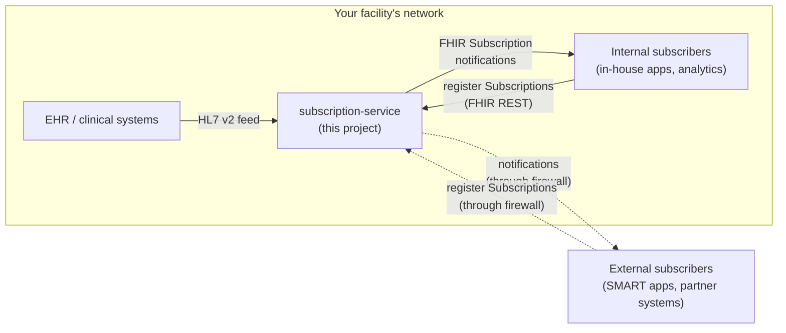
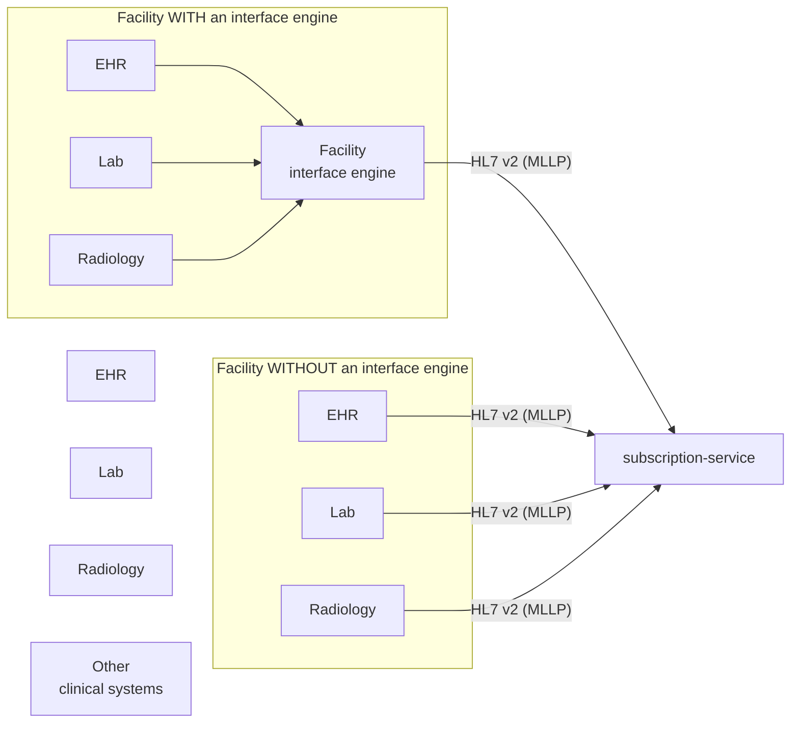
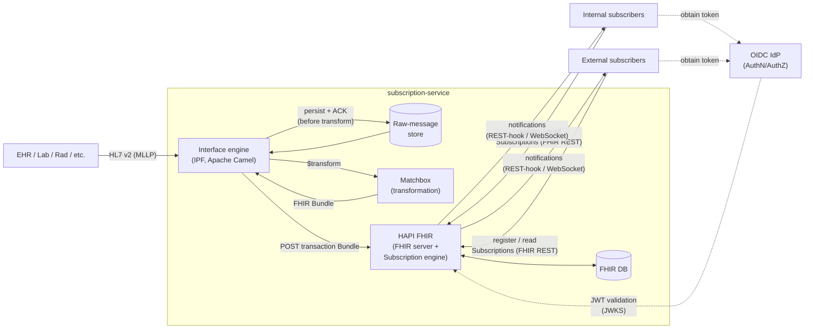

# subscription-service

A FOSS HL7 v2 → FHIR R4 pipeline that runs in your Docker or Kubernetes. Receives HL7 v2 messages from EHRs and labs, converts them to FHIR resources via Matchbox, persists them in HAPI FHIR, and fires FHIR Subscriptions to downstream consumers (in-house apps, partner systems, SMART on FHIR apps, analytics, etc.).

Use this when you need a standards-compliant FHIR Subscription endpoint and your EHR vendor hasn't shipped one. Run it inside your facility's network, in your own cloud, or anywhere Docker/Kubernetes runs.

## Quickstart (no auth, 5 minutes)

Goal: clone the repo, bring the stack up, prove it works. Auth is OFF by default in the quickstart so you don't need an OIDC provider to see your first message flow through.

```bash
git clone git@github.com:bzimbelman/fhir-ehr-subscriptions-service.git
cd fhir-ehr-subscriptions-service

# 1. Fetch the HL7 IGs (US Core, Subscriptions Backport, v2-to-FHIR)
bash scripts/fetch-igs.sh

# 2. Configure (defaults are fine for local dev)
cd deploy/docker
cp .env.example .env

# 3. Bring the whole stack up (HAPI + Matchbox + interface-engine + operator UI)
docker compose up -d

# 4. Verify the FHIR server
curl http://localhost:18080/fhir/metadata | jq '.software'
# {"name": "HAPI FHIR Server", "version": "7.6.0"}

# 5. Visit the operator UI
open http://localhost:3000
# /signin renders a "configure OIDC first" banner until you fill in the
# OIDC_* env vars in .env — see docs/auth.md for IdP recipes.

# 6. Send an HL7 v2 message and watch it ACK
printf '\x0bMSH|^~\\&|EPIC|HOSP|RECEIVER|CDS|20260626120000||ADT^A04|HELLO|P|2.5\rEVN|A04|20260626120000\rPID|1||MRN-HELLO^^^HOSP^MR||TEST^Quick^Start||19800101|M\rPV1|1|I|2000\r\x1c\r' \
  | nc -w 3 localhost 2575
# expect: MSH|...|ACK^A04^ACK|...|...MSA|AA|HELLO
```

That's it — you have a running FHIR server at `http://localhost:18080/fhir`, an HL7 v2 listener on port 2575, and an operator UI at `http://localhost:3000` for browsing subscriptions, messages, the DLQ, audit log, and Matchbox transforms.

Next steps:

- Send a real ADT^A01 (transformed to a FHIR Patient + Encounter): see [`docs/smoke-test.md`](docs/smoke-test.md)
- Register a Subscription so a webhook fires when a Patient is created: see [`docs/external-subscribers.md`](docs/external-subscribers.md)
- Enable OIDC authentication on the FHIR API for production: see [`docs/auth.md`](docs/auth.md)

## Why this exists

Many SMART on FHIR apps and backend services need to keep their data in sync with the EHR's data after the app has completed. This is the exact problem that FHIR Subscriptions was created to solve. However, most EHR vendors have not yet implemented FHIR Subscriptions on their R4 surfaces.

This project removes the dependency on the EHR vendor having to implement and maintain a FHIR subscription service of their own. The downside: it's not integrated into the EHR, so it won't be as elegant a solution as the vendor themselves could offer. If your EHR vendor has the subscription service baked in, look at that first — it will have better support than this project can provide.

The concept of this tool was drawn up at the FHIR DevDays conference in 2026 and built immediately so that it could resolve this need without waiting for EHR vendors to get time to implement the solution themselves.

## How it sits in a facility



## High-level architecture

### Sources

EHRs, lab systems, radiology systems, and other clinical systems all speak some flavor of HL7 v2 to integrate with each other. Some facilities run their own interface engine (Mirth, Rhapsody, Cloverleaf, etc.) and produce a normalized v2 stream from there; others have us connect directly to each clinical source.



Multi-source ingestion is on the roadmap: in addition to HL7 v2/MLLP, future versions will support FHIR polling (any FHIR-conformant EHR — Epic, Cerner, Meditech, etc.) and EHR-native API polling for vendors like Athena. Vendor-specific configuration profiles are tracked in Epic #410.

### Functional components



The raw-message store is deliberately in front of Matchbox: every inbound v2 message is persisted and ACKed before the transform is attempted, so a hiccup in Matchbox or HAPI never causes us to drop a message on the floor.

The FHIR DB is HAPI's persistence (Postgres). Any OpenID Connect provider that exposes a JWKS endpoint works — Keycloak, Auth0, Okta, Azure AD, AWS Cognito, Authentik, etc. Both internal and external subscribers obtain bearer tokens from the configured IdP, and HAPI validates them via JWKS. See [`docs/auth.md`](docs/auth.md) for the provider-agnostic contract and per-IdP recipes.

The public FHIR endpoint is whatever hostname *you* expose HAPI's HTTP port behind. Any reverse proxy works (Caddy, Traefik, nginx, ingress-nginx, a Cloudflare tunnel, etc.) — see [`docs/deployment-recipes/`](docs/deployment-recipes/). The MLLP ingress side is LAN/VPN-only by design (HTTP-only proxies can't carry plain TCP).

## Standards posture

For this implementation we chose to use as many FOSS tools as we could to make sure we were not building yet another component that already existed. In that spirit, the system is composed of:

| Concern               | Choice                                        |
|-----------------------|-----------------------------------------------|
| FHIR version          | R4                                            |
| US conformance        | US Core 7.0 (USCDI v4 aligned)                |
| Subscriptions         | R5 Subscriptions Backport IG (Topic-based)    |
| Legacy subscriptions  | R4 criteria-based, still supported by HAPI    |
| HL7 v2 → FHIR mapping | HL7 v2-to-FHIR IG (StructureMaps via Matchbox)|
| Custom mappings       | Project-owned FML files, loaded into Matchbox |
| AuthN/AuthZ           | Any OIDC IdP (Keycloak, Auth0, Okta, etc.), OAuth2/JWT|

R4 was chosen because every USCDI-conformant EHR (Epic, Cerner, Athena, etc.) exposes R4 today — US Core has not yet migrated to R5. The Subscriptions Backport IG lets us adopt R5's modern Topic-based subscription model on R4, so subscribers get the forward-shaped API without forcing the rest of the stack to R5.

## Component summary

- **Interface engine** — Spring Boot + Apache Camel + Open eHealth Integration Platform (IPF) + HAPI HL7v2 parser. One Camel route per upstream MLLP feed. Parses, routes by message type, calls Matchbox, posts to HAPI, then ACKs. Owned in this repo (`./interface-engine`).
- **Matchbox** — Off-the-shelf FHIR transform engine. Loads the public HL7 v2-to-FHIR IG plus any project-specific StructureMaps. Talks FHIR; the interface engine calls it via `$transform`.
- **HAPI FHIR JPA server** — Off-the-shelf FHIR server with Postgres backend. Loads US Core 7.0 + Subscriptions Backport IGs at boot. Subscription matcher fires REST-hook / WebSocket / message channels.
- **Postgres** — HAPI's persistence store. Lives on a persistent volume (bind mount in Docker, PVC in Kubernetes).
- **Operator UI** — Next.js 15 + NextAuth v5 console for browsing subscriptions, messages, the dead-letter queue, audit log, and Matchbox transforms. Authenticates operators via OIDC and proxies all admin-API traffic server-side so the bearer never reaches the browser. Owned in this repo (`./ui`). See [`docs/admin-api.md`](docs/admin-api.md) for the contract.
- **OIDC IdP** — Any OpenID Connect provider that exposes a JWKS endpoint. The repo ships a turn-key realm export at [`idp/keycloak/realms/`](idp/keycloak/realms/) for Keycloak users, but Auth0, Okta, Azure AD, Cognito, Authentik, etc. are all supported — see [`docs/auth.md`](docs/auth.md).

## Configuration toggles

All toggles are environment variables; set them in `deploy/docker/.env` (Docker) or `values.yaml` (Helm). Full reference in [`deploy/docker/.env.example`](deploy/docker/.env.example).

| Variable | Modes | What it does |
|---|---|---|
| `SUBSCRIPTION_SERVICE_AUTH_ENABLED` | `true` / `false` | OFF for the quickstart; ON for production. |
| `SUBSCRIPTION_SERVICE_AUTH_ISSUER` | `<your IdP issuer URL>` | Required when auth is ON; fail-fast otherwise. |
| `SUBSCRIPTION_SERVICE_VALIDATION_MODE` | `off` / `warn` / `enforce` | US Core profile validation. |
| `SUBSCRIPTION_SERVICE_CHANNEL_SECURITY` | `strict` / `relaxed` / `permissive` | Policy for accepting Subscription channels (HTTPS, auth headers). |
| `SUBSCRIPTION_SERVICE_MULTITENANCY` | `disabled` / `enabled` | HAPI partition-based isolation, keyed off a JWT claim. |

## Deployment targets

Two deployment shapes are supported, both delivered from this repo:

1. **Docker Compose** — fastest path to running. Good for dev, demo, single-node deployments. See [`deploy/docker/`](deploy/docker/).
2. **Kubernetes (Helm)** — production-shaped. Same images, values-driven config per environment. See [`deploy/k8s/`](deploy/k8s/) and [`docs/k8s-deployment.md`](docs/k8s-deployment.md).

Both shapes deploy the *same* container images; only the orchestration wrapper differs. The Helm chart and Docker Compose files live in this repo so they evolve together.

For exposing the public FHIR endpoint to subscribers outside your facility, see [`docs/deployment-recipes/`](docs/deployment-recipes/) — Cloudflare tunnel, Caddy, Traefik, nginx, k8s ingress, and direct port-forward recipes are all covered.

## Repository layout

```
subscription-service/
├── README.md                    ← you are here
├── docs/                        ← architecture, design notes, deployment recipes
├── interface-engine/            ← Interface engine: Spring Boot + IPF (Kotlin/Gradle)
├── ui/                          ← Operator UI: Next.js 15 + NextAuth v5 (TypeScript)
├── matchbox/                    ← Custom IGs and StructureMaps for Matchbox
├── hapi/                        ← HAPI server config + derived image
│   └── auth/                    ← OIDC JWT validation interceptor JAR
├── idp/                         ← IdP-specific assets (Keycloak realm export, etc.)
├── deploy/
│   ├── docker/                  ← docker-compose.yml + .env templates
│   └── k8s/                     ← Helm chart
└── scripts/                     ← Operational helpers (IG fetch, IdP provisioning, etc.)
```

More components will arrive as the project grows.

## Project status

- **Active**: Docker Compose + Helm targets, HL7 v2/MLLP ingestion, FHIR R4 + US Core + Subscriptions Backport, OIDC auth (any IdP), four configurable feature toggles
- **In progress**: durable inbound message store, retry + DLQ, observability surface, operator UI, vendor configuration profiles, FHIR/native-API polling
- **Roadmap epics**: [#378 hardening](https://op.bzonfhir.com/work_packages/378), [#387 observability](https://op.bzonfhir.com/work_packages/387), [#398 operator UI](https://op.bzonfhir.com/work_packages/398), [#410 vendor profiles](https://op.bzonfhir.com/work_packages/410), [#411 extension SPI](https://op.bzonfhir.com/work_packages/411)

## Reference deployment

The maintainer runs a reference instance for development and testing. That deployment is the maintainer's environment — your deployment will have its own URL. Don't point production traffic at it; it has no SLA and gets destroyed and rebuilt frequently.

| Component | URL | Notes |
| --- | --- | --- |
| HAPI FHIR R4 (subscription-service) | `https://subscription-service.bzonfhir.com` | JWT-gated; see `docs/auth.md`. |
| Operator UI (ticket #423) | `https://subscription-service-ui.bzonfhir.com` | OIDC-protected (Keycloak Development realm). See `docs/auth-testing.md` for the test-user credentials. |
| Keycloak (IdP) | `https://keycloak.bzonfhir.com/auth/realms/Development` | Realm: `Development`. Client: `subscription-service-ui`. |

## Contributing

Pull requests welcome — open an issue first if you're planning a substantial change. The `main` branch is protected: PRs require review and only the project owner can merge.

## License

Apache 2.0. The tool itself is FOSS. Companion concerns (managed-cloud operations, support contracts, premium add-ons) live in separate repos and may carry different licenses.
