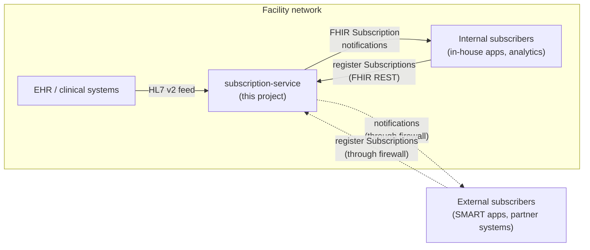
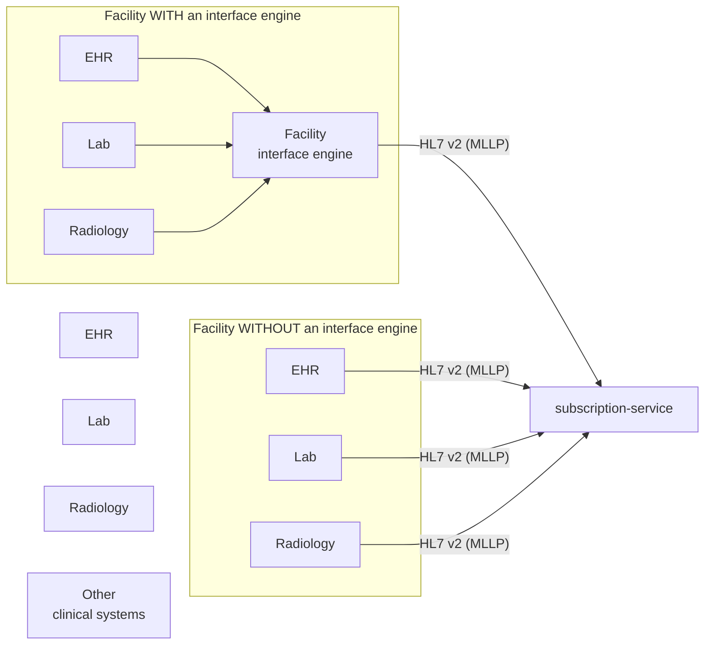

# subscription-service

This is an implementation that is here to make FHIR subscription services available to hospitals and other users of EHRs. The approach is to provide a connection between the facilities EHR system to this service and this service will then provide a standard FHIR subscription service that clients can then register and listen for updates on.



This removes the dependency on the EHR vendor having to implement and maintain the FHIR subscription service's apis on their own. The downside to this option is that it is not integrated into the EHR and as such may not be as efficient and elegent of a solution as the vendor themselves can offer. If you have an EHR vendor that has the subscription service baked in, I would strongly suggest looking at that service and seeing if it will meet your needs as it will undoubtedly have better support than we can provide.

## Why this exists

Many SMART on FHIR, and backend services need to be able to keep their data in sync with the EHR's data after the app has completed. This is the exact problem that FHIR subscriptions was created to solve. However, most EHR vendors have not even started to implement FHIR subscriptions.

The concept of this tool was drawn up at a FHIR dev days conference in 2026, and we immediately created it so that we could have a system that will resolve this need without waiting for EHR vendors to get time to implement this solution.

## High-level architecture

### Sources

EHRs, lab systems, radiology systems, and other clinical systems all speak some flavor of HL7 v2 to integrate with each other. Some facilities run their own interface engine (Mirth, Rhapsody, Cloverleaf, etc.) and produce a normalized v2 stream from there; others have us connect directly to each clinical source.



### Functional components


The raw-message store is deliberately in front of Matchbox: we want to persist every inbound v2 message and ACK the sender *before* we attempt the transform, so a hiccup in Matchbox or HAPI never causes us to drop a message on the floor.

The FHIR DB is HAPI's persistence (Postgres). Any OpenID Connect provider that exposes a JWKS endpoint works — Keycloak, Auth0, Okta, Azure AD, AWS Cognito, Authentik, etc. Both internal and external subscribers obtain bearer tokens from the configured IdP, and HAPI validates them via JWKS. See [`docs/auth.md`](docs/auth.md) for the provider-agnostic contract and per-IdP recipes.

External callers reach HAPI via `https://subscription-service.bzonfhir.com/fhir/*`, fronted by OIDC-issued OAuth2 bearer tokens. The MLLP ingress side is LAN/VPN-only (Cloudflare's HTTP tunnel can't carry plain TCP) and will be addressed in a later phase.

## Standards posture

For this implementation we choose to use as many FOSS tools as we could to make sure we were not building yet another component that already existed. In that vein we broke the tool down and used these components to build the system.

| Concern               | Choice                                        |
|-----------------------|-----------------------------------------------|
| FHIR version          | R4                                            |
| US conformance        | US Core 7.0 (USCDI v4 aligned)                |
| Subscriptions         | R5 Subscriptions Backport IG (Topic-based)    |
| Legacy subscriptions  | R4 criteria-based, still supported by HAPI    |
| HL7 v2 → FHIR mapping | HL7 v2-to-FHIR IG (StructureMaps via Matchbox)|
| Custom mappings       | Project-owned FML files, loaded into Matchbox |
| AuthN/AuthZ           | Any OIDC IdP (Keycloak, Auth0, Okta, etc.), OAuth2/JWT|

R4 was chosen because every USCDI-conformant EHR (Epic, Cerner, Athena, etc.) exposes R4 today — US Core has not yet migrated to R5. The Subscriptions Backport IG lets us adopt R5's modern Topic-based subscription model on R4, so subscribers get the forward-shaped API without forcing the rest of the stack to R5.

## Component summary

- **IPF app** — Spring Boot + Apache Camel + HAPI HL7v2 parser. One Camel route per upstream MLLP feed. Parses, routes by message type, calls Matchbox, posts to HAPI, then ACKs. Owned in this repo (`./ipf-app`).
- **Matchbox** — Off-the-shelf FHIR transform engine. Loads the public HL7 v2-to-FHIR IG plus any project-specific StructureMaps. Talks FHIR; IPF calls it via `$transform`.
- **HAPI FHIR JPA server** — Off-the-shelf FHIR server with Postgres backend. Loads US Core 7.0 + Subscriptions Backport IGs at boot. Subscription matcher fires REST-hook / WebSocket / message channels.
- **Postgres** — HAPI's persistence store. Lives on a persistent volume (bind mount on zdock, PVC on Kubernetes).
- **OIDC IdP** — Any OpenID Connect provider that exposes a JWKS endpoint. The reference deployment reuses the existing Keycloak instance at `keycloak.bzonfhir.com` (turn-key realm export at `idp/keycloak/realms/`), but Auth0, Okta, Azure AD, Cognito, Authentik etc. are all supported — see [`docs/auth.md`](docs/auth.md).

## Deployment targets

Two deployment shapes are planned:

1. **Docker Compose on zdock** — fastest path to running; reuses the existing Cloudflare tunnel that already fronts `*.bzonfhir.com`. Good for development, demos, and a single-node deployment.
2. **Kubernetes (Helm chart)** — production-shaped deployment; mirrors how the rest of the CDS Tools platform runs (`cdstools-deployment/charts/`). Supports rolling updates, horizontal scale, and graduation to a real cluster (EKS).

Both shapes deploy the *same* IPF/Matchbox/HAPI images; only the orchestration wrapper differs. The Helm chart and docker compose files will live in this repo so the chart and the service evolve together.

## Repository layout (planned)

```
subscription-service/
├── README.md                    ← you are here
├── docs/                        ← architecture, design notes, decisions
├── ipf-app/                     ← Spring Boot + IPF source (Kotlin/Gradle)
├── matchbox/                    ← Custom IGs and StructureMaps
├── hapi/                        ← HAPI server config (application.yaml, IGs)
├── deploy/
│   ├── docker/                  ← docker-compose.yml + .env templates
│   └── k8s/                     ← Helm chart
└── scripts/                     ← Dev/operational helpers
```

There will be more components as we add them and make them available. 

## License

Apache 2.0. The tool itself is FOSS. Companion concerns (managed-cloud operations, support contracts, premium add-ons) live in separate repos and may carry different licenses.
