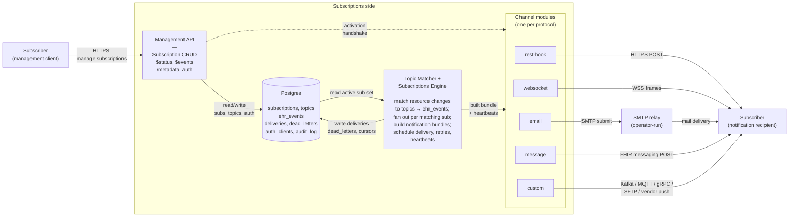
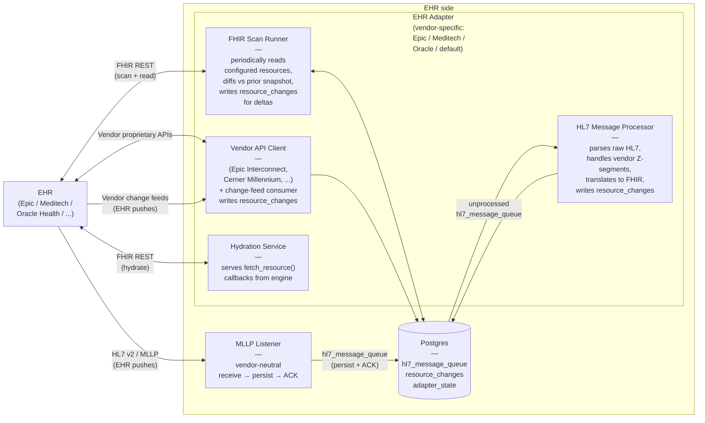
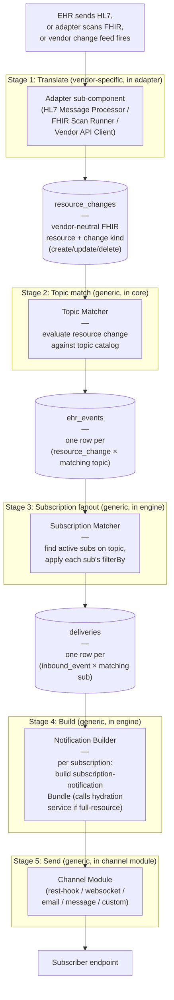
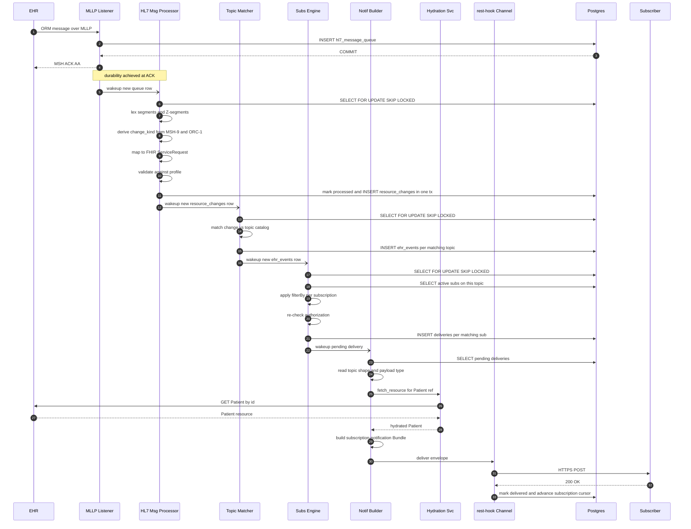
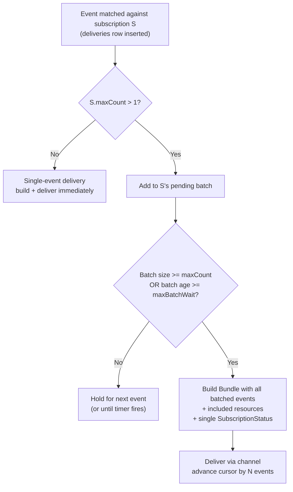

# Architecture

This document describes the architecture of `fhir-ehr-subscriptions-service`. It builds on [high-level-concept.md](high-level-concept.md) and is the source of truth for module boundaries, scaling behavior, and the EHR adapter plugin contract.

Two architectural constraints drive every decision below:

1. **Operational simplicity.** A deployment is one container plus Postgres. No leader election, no replica coordination, no cross-service choreography. If the service falls behind, it catches up from durable state — that is acceptable for the workload.
2. **Pluggable EHR adapters.** A deployment talks to exactly one EHR, but the codebase must support many vendor adapters (Epic 2025, Meditech Expanse, Oracle Health Millennium, athenahealth, etc.). Third parties must be able to write a new adapter for their EHR without forking the core. Epic is the first reference implementation.

## High-Level Topology

The architecture has two sides — the **subscriptions side** (the API subscribers manage subscriptions through, the engine that decides who needs to be notified, the channel modules that deliver notifications) and the **EHR side** (the vendor-neutral MLLP listener and the active vendor adapter that owns all other EHR I/O). Postgres is the durable seam between them. Three diagrams: each side, then the seam.

### Subscriptions side



External interfaces of this side (contracts at the domain boundary):
- **Subscribers (management) ↔ Management API.** Contract: the [FHIR Subscriptions REST API](https://hl7.org/fhir/R5/subscription.html) (R5) and the [Subscriptions R4 Backport IG](https://hl7.org/fhir/uv/subscriptions-backport/) (R4B). Auth: [SMART on FHIR Backend Services](https://hl7.org/fhir/smart-app-launch/backend-services.html).
- **Subscribers (notification recipients) ↔ Channel modules.** Contract: the [FHIR Subscriptions notification model](https://hl7.org/fhir/R5/notifications.html) — `subscription-notification` Bundles delivered over the channel-type protocol the subscription requested.
- **SMTP relay ↔ email channel.** Contract: standard SMTP submission (RFC 5321), used only when the email channel is enabled.

Internal components:
- **Management API** — REST endpoints for subscribers to manage their subscriptions and discover capabilities.
- **Topic Matcher.** Reads `resource_changes` rows produced by the adapter, evaluates each change against the active `SubscriptionTopic` catalog (a single change can match multiple topics), and writes one `ehr_events` row per matching topic. Generic — no vendor knowledge.
- **Subscriptions Engine.** Reads `ehr_events` rows. For each, finds active subscriptions on that topic, applies each subscription's `filterBy`, re-checks authorization, and emits one `deliveries` row per matching subscription. Then builds notification bundles per subscription, schedules delivery, manages retries and heartbeats. This is the brain.
- **Channel modules** — one per delivery protocol. Each takes a built bundle and sends it via its protocol. Modules speak only their protocol; the engine speaks only "deliver this bundle." When a subscription is created, the API drives the channel through an activation handshake to validate the endpoint per spec.
- **Postgres (this side's tables).** The subscription registry, the topic catalog, the `ehr_events` log (written by the Topic Matcher), delivery state, dead-letter log, auth clients, audit log.

### EHR side



External interfaces of this side (contracts at the domain boundary). The adapter exposes whichever subset of these the EHR provides; the manifest declares which are active.
- **HL7 v2 over MLLP.** Contract: [HL7 v2.x messaging](https://www.hl7.org/implement/standards/product_brief.cfm?product_id=185) framed by [MLLP](https://www.hl7.org/documentcenter/public/wg/inm/mllp_transport_specification.PDF). EHR pushes. Terminated by the MLLP Listener (vendor-neutral).
- **FHIR REST.** Contract: the EHR's published [FHIR API](https://hl7.org/fhir/R4/http.html). Owned by the adapter (vendor-specific) — every EHR's FHIR profile, search-parameter behavior, pagination quirks, and auth flow differ. Used for periodic scans and for hydration of referenced resources.
- **Vendor proprietary APIs.** Contract: vendor-specific (Epic Interconnect, Cerner / Oracle Health Millennium APIs, Meditech APIs, etc.). Owned by the adapter.
- **Vendor change feeds.** Contract: vendor-specific (webhooks, websockets, CDC streams, when offered). EHR pushes. Owned by the adapter.

Internal components:

- **MLLP Listener.** Accepts MLLP TCP connections, frames messages, writes each raw message to `hl7_message_queue` in Postgres, and ACKs the EHR. Persistence-then-ACK is the durability guarantee — once ACKed, the message will not be lost. If the listener falls behind, it can NACK or drop the connection; the EHR holds and re-sends.

  **Multiple listener endpoints per deployment.** Most facility interface engines open a separate MLLP connection per message type (one for ADT, one for ORM, one for ORU, etc.). The listener is configured with one or more **listener endpoints**, each defined by `{name, bind, port, allowed_message_types?}`. All endpoints write into the same `hl7_message_queue` table — there is no need for one table per connection — but every row carries the source listener endpoint's name as metadata so downstream stages and operators can tell where a message came from.

  **Per-message metadata captured by the listener** (in addition to the raw message body):
  - `received_at` — server-side timestamp of when the bytes arrived.
  - `listener_endpoint` — which configured endpoint accepted the connection (e.g., `adt-feed`, `lab-results`).
  - `peer_addr` — source IP/port of the EHR's interface engine.
  - `mllp_message_id` — MSH-10 message control ID, parsed only enough to capture the field (the listener still doesn't fully parse the message).
  - `correlation_id` — generated server-side; flows through `resource_changes` and `ehr_events` for end-to-end tracing.
  - `processed` — boolean flag flipped by the HL7 Message Processor when it has consumed the row.

  This is enough to satisfy audit, debugging, and trace correlation without giving the listener any vendor knowledge.

- **EHR Adapter.** Vendor-specific code. The adapter is the only place vendor knowledge lives, and it owns *all* I/O to the EHR except the MLLP socket (FHIR REST, proprietary APIs, change feeds). It is composed of four sub-components, each of which can run on its own cadence:

  - **HL7 Message Processor.** Reads unprocessed rows from `hl7_message_queue` in arrival order. For each row: parses the HL7 message, applies vendor-specific Z-segment handling, translates the message into a FHIR resource + change kind, and writes a `resource_changes` row. Marks the source row as processed in the same transaction so a crash never loses or double-processes a message.
  - **FHIR Scan Runner.** On a configurable cadence, calls the EHR's FHIR REST API for each resource type the adapter is configured to scan, snapshots the responses to `adapter_state`, compares against the prior snapshot, and writes `resource_changes` rows for resources whose content changed. (`_lastUpdated` is not relied on; most EHR FHIR APIs do not honor it accurately. Snapshot-and-diff is the change-detection mechanism.)
  - **Vendor API Client.** Wraps the EHR's proprietary APIs (Epic Interconnect, Cerner Millennium, etc.) and any vendor change feeds the EHR offers (webhooks, websockets, CDC streams). Translates vendor-specific events into FHIR resources and writes `resource_changes` rows. Manages its own cursors / last-seen tokens in `adapter_state`.
  - **Hydration Service.** Serves the `fetch_resource(ref)` callback from the engine. When the engine is building a `full-resource` notification bundle and needs a referenced resource, the hydration service fetches it from the EHR (typically via FHIR REST) and returns the FHIR resource synchronously. No DB writes — hydration is read-through to the EHR.

  NOTE: A reference implementation that can be extended is implemented with no processing logic, just the framework common handling. This will allow implementors to just override the pieces they need and have these components work out of the box.

- **Postgres (this side's tables).**
  - `hl7_message_queue` — the durable HL7 inbox. Written by the MLLP Listener, consumed by the HL7 Message Processor.
  - `resource_changes` — the durable, vendor-neutral, FHIR-shaped log of "this resource just changed in this way." Written by the adapter's three writing sub-components (HL7 Message Processor, FHIR Scan Runner, Vendor API Client). Consumed by the Topic Matcher on the Subscriptions side.
  - `adapter_state` — scan snapshots, change-feed cursors, last-seen tokens. Owned by the adapter sub-components.

### Pipeline from EHR change to subscriber notification

The end-to-end path from "the EHR sent us something" to "the subscriber's webhook got POSTed" is five distinct stages. Each stage has a clearly-defined input, a clearly-defined output, a named component that owns the transformation, and a Postgres table at the handoff so the next stage can resume after a crash. There is no magic.



**Stage 1 — Translate (vendor-specific, in adapter).**
- **Input.** Three different sources, one per adapter sub-component:
  - **HL7 Message Processor:** reads unprocessed rows from the `hl7_message_queue` table the MLLP Listener wrote.
  - **FHIR Scan Runner:** runs on a configurable cadence — for each configured resource type (e.g., `ServiceRequest`, `Encounter`) it calls the EHR's FHIR REST API directly, page by page, and processes each returned resource one at a time. It does *not* persist the polled response itself; it persists only what changed (see below). The prior content is held in `adapter_state` (a per-(adapter, resource_id) snapshot — typically a content hash plus the last-seen body) so the next scan can diff. Resources that disappear from the scan are emitted as `delete`.
  - **Vendor API Client:** receives a vendor change-feed record (webhook, websocket frame, CDC stream entry) directly from the EHR. Cursor / last-seen state lives in `adapter_state`.
- **Output:** a `resource_changes` row per detected change. Each row carries the FHIR resource (post-translation), a change kind (`create` / `update` / `delete`), the occurred-at timestamp, and a correlation ID for idempotency. The row says only "this FHIR resource just changed in this way." Nothing about topics, nothing about subscriptions.
- **Cancel-and-replace semantics.** Some EHRs model edits as a cancellation of the prior resource plus creation of a new one (orders are the canonical case — an Epic order edit emits a cancel ORM followed by a new ORM with a fresh order number). The cancellation and the new creation are two halves of the same logical edit. The adapter recognizes the pair using vendor-specific linkage (HL7 `ORC-2`/`ORC-3` placeholder/filler order numbers, Epic's `parent` reference, etc.) and emits **one** `resource_changes` row with `change_kind=update`, `previous_resource` set to the cancelled resource, and `resource` set to the replacement. Downstream this is an ordinary update — subscribers see the prior and new resource state in a single notification and can trivially correlate them. The link between cancellation and replacement is vendor knowledge, so reconstructing it is the adapter's job — only the adapter has access to the vendor identifiers that prove the pair belongs together. If the second half of the pair never arrives within a configured window, the adapter emits a plain `delete` for the cancellation; if a cancellation has no matching predecessor, the adapter emits a plain `create` for the new resource.
- **Owned by** the adapter's vendor-specific sub-components. This is the only stage with vendor knowledge.

**Stage 2 — Topic match (generic, in core).**
- **Input:** a `resource_changes` row.
- **Action:** the Topic Matcher consults the published `SubscriptionTopic` catalog. Each topic defines triggers (e.g., "fires on `create` or `update` of `ServiceRequest`") and any topic-defined criteria. The matcher evaluates the resource change against every active topic.
- **Output:** zero or more `ehr_events` rows — **one row per topic the change matches.** A single `ServiceRequest` create can match both `order-changed` and `order-finalized` and produces two rows. A `ServiceRequest` for an inactive topic produces zero rows and the change is dropped here.
- **Owned by** core. Generic. The same matcher works for every adapter because every adapter writes vendor-neutral resource changes.

**Stage 3 — Subscription fanout (generic, in engine).**
- **Input:** an `ehr_events` row (carrying one matched topic + the resource change).
- **Action:** find all `active` subscriptions referencing this topic. For each one, evaluate that subscription's `filterBy` (e.g., `patient=Patient/xyz`) against the resource. Re-check the subscription's authorization scope.
- **Output:** zero or more `deliveries` rows — **one row per matching subscription.** Two subscriptions for orders on patient xyz both match → two delivery rows. No subscriptions match → zero rows.
- **Owned by** the engine. Generic.

**Stage 4 — Build (generic, in engine).**
- **Input:** a `deliveries` row (or, when batching is enabled by `Subscription.maxCount > 1`, a small group of pending rows for the same subscription).
- **Action:** build the `subscription-notification` Bundle for **this one subscription**, using its negotiated FHIR version, its payload type (`empty` / `id-only` / `full-resource`), and its topic's `notificationShape`. If the payload type is `full-resource`, the builder calls the adapter's Hydration Service (`fetch_resource(ref)`) for any referenced resources the topic shape requires.
- **Output:** a `NotificationEnvelope` containing the built Bundle, handed in-memory to the channel module the subscription specified.
- **Per subscription, not per all.** Filter results, payload type, channel, content type, and authorization scope are all per-subscription, so each subscription gets its own Bundle.

**Stage 5 — Send (generic, in channel module).**
- **Input:** a `NotificationEnvelope` for one subscription.
- **Action:** the channel module for that subscription's `channelType` delivers using its protocol (HTTPS POST for rest-hook, WSS frame for websocket, SMTP submit for email, etc.). On success: mark the delivery row delivered, advance the subscription's event cursor. On transient failure: schedule a retry with backoff. On permanent failure: dead-letter and transition the subscription to `error`.
- **Output:** the notification reaches the subscriber.

**Generic vs. vendor-specific.** Stage 1 is vendor-specific code in the adapter. Stages 2–5 are entirely generic and live in core / engine / channel modules. That is why a new vendor adapter only has to implement translation: everything downstream is shared.

### End-to-end sequence: HL7 ORM for an order on a subscribed patient

This sequence walks one HL7 v2 ORM message from the EHR to the subscriber's webhook, through every component. It is the same five stages as above, with the Postgres handoffs and in-memory wakeups drawn explicitly. The example assumes one active subscription: `order-changed` topic, `filterBy patient=Patient/123`, channel `rest-hook`, payload `full-resource`, topic shape `_include=ServiceRequest:patient`.



Notes on this sequence:

- **Step 4 is the durability boundary.** Once the listener has the row in Postgres and the EHR has been ACKed, the message will survive any failure further down the chain. The EHR will not re-send.
- **Steps 5, 12, 16, 22 are in-memory wakeups.** Latency optimizations only — if a signal is lost (e.g., a brief stall or restart between commit and signal), the downstream component finds the row on its next read of the table. Correctness comes from the table contents, not from the wakeup.
- **Steps 6, 13, 17, 23 use `SELECT FOR UPDATE SKIP LOCKED` semantics** so a worker that crashes mid-stage doesn't block another worker from picking up the row after restart.
- **The hydration call (steps 25–28) is the only in-memory call across the EHR/Subscriptions boundary.** Everything else crosses through Postgres rows.
- **A change with zero matching topics stops at step 15** (no `ehr_events` written). A change with no matching subscriptions stops at step 21 (no `deliveries` written). Neither case writes anything past its stop point.
- **Two subscriptions matching the same event** produce two `deliveries` rows at step 21 and run independent build/send paths from step 22 onward — each with its own payload type, FHIR version, and channel.

**Steps 7–10 — what HL7 → FHIR translation actually does.** The "translate" steps in the diagram are not magic. Each step is a defined unit of work:
- **Step 7 (lex):** read the raw HL7 message body from the queue row, tokenize segments and fields, build a typed in-memory message tree. Standard segments (`MSH`, `PID`, `PV1`, `ORC`, `OBR`, etc.) follow the HL7 v2 spec; vendor `Z*` segments are handled by adapter-specific code.
- **Step 8 (derive change_kind):** look at `MSH-9` (message type, e.g. `ORM^O01`) and trigger codes within the message (`ORC-1` for orders: `NW` = new, `SC` = status change, `CA` = cancel, `XO` = change). Map to `create` / `update` / `delete`. **Cancel-and-replace correlation also happens here**: when this message is the cancellation half of a pair (recognized via `ORC-2`/`ORC-3` linkage to a still-pending replacement, or held briefly when its replacement is expected to follow) the adapter merges the pair into a single `update` rather than emitting separate `delete` and `create`. See [Cancel-and-replace pairs](#cancel-and-replace-pairs) for the full handling.
- **Step 9 (map to FHIR):** apply mapping rules to produce a FHIR resource. The base mappings come from the [HL7 v2-to-FHIR Implementation Guide](https://hl7.org/fhir/uv/v2mappings/); vendor adapters override specific fields (Epic Z-segments, EpicCare-specific identifiers, vendor-defined code systems). Resolve references to other resources (`subject`, `requester`) using the IDs carried in the message; the resolved references are FHIR-style references, not full resources (full resources are pulled later by hydration if a subscription needs them). Attach the queue row's `correlation_id` to the resource.
- **Step 10 (validate):** validate the produced FHIR resource against the project's profile set. Resources that fail validation are NOT written to `resource_changes`; the source HL7 row is moved to a dead-letter table along with the validation error so an operator can investigate. The `hl7_message_queue` row is still marked processed so the queue moves on.

The Adapter SPI defines hooks for each of these so a vendor adapter can override only the parts that differ from the generic implementation in `adapters/default`.

## Module Layout

The codebase is organized into modules whose names match the components in the diagrams above. Names are notional; final names will follow the chosen language's conventions. Every named component on the diagrams maps to exactly one module here.

### `api` — Subscriber-facing HTTP / WSS surface
- `http-fhir` — REST endpoints for `Subscription`, `SubscriptionTopic`, `$status`, `$events`, `$get-ws-binding-token`, and `/metadata` (CapabilityStatement). The Management API in the diagram.
- `auth` — JWT / SMART Backend Services validation, JWKS cache, client registry, scope checks. Used by `http-fhir` on every request and called again at delivery time.
- `version-shim` — translates the internal R5-shaped model to/from R4B Backport and (when published) R6 representations on the wire.

### `engine` — generic Subscriptions-side processing
The four named components inside the engine. All vendor-neutral.
- `topic-matcher` — Stage 2. Reads `resource_changes`, evaluates each change against the active `SubscriptionTopic` catalog, writes one `ehr_events` row per matching topic.
- `subscription-matcher` — Stage 3. Reads `ehr_events`, finds active subscriptions on the topic, applies each subscription's `filterBy`, re-checks authorization, writes one `deliveries` row per matching subscription.
- `notification-builder` — Stage 4. Reads `deliveries`, builds the `subscription-notification` Bundle per subscription (calling the adapter's Hydration Service for full-resource references). Produces a `NotificationEnvelope`.
- `delivery-scheduler` — owns retry / backoff / dead-letter policy, heartbeat scheduling, handshake state machine, per-subscription event cursor (`eventsSinceSubscriptionStart`).

### `topics` — SubscriptionTopic catalog
- `catalog` — built-in topic resources shipped with the project, plus the loader for adapter-contributed topics and operator-supplied topics.
- `filter` — search-parameter filter evaluation used by both `topic-matcher` (live events) and `$events` historical replay.

## Topic Matcher

The Topic Matcher is the component that turns "this FHIR resource just changed" into "these are the topics that care about it." It is a generic, vendor-neutral worker that sits between the adapter (which writes `resource_changes`) and the Subscriptions Engine (which reads `ehr_events`). It is the only component that consults the `SubscriptionTopic` catalog.

### What it consumes

For each unprocessed `resource_changes` row:

- `resource_type` — the FHIR resource type (e.g., `ServiceRequest`, `Observation`, `Encounter`).
- `change_kind` — `create`, `update`, or `delete`. The adapter is responsible for collapsing vendor-specific cancel-and-replace pairs into a single `update`.  The Topic Matcher then evaluates the row using FHIR search-parameter expressions and FHIRPath — see [Matching expression languages](#matching-expression-languages) for what evaluation actually does and does not support.
- `resource` — the post-translation FHIR resource body the adapter produced (or, for `delete`, the last-known body).
- `previous_resource` — for `update` and `delete`, the prior version. The adapter sources it from `adapter_state` for FHIR scans, from the predecessor message for HL7 updates, or from the cancelled resource of a recognized cancel-and-replace pair. May be null for `create`.
- `correlation_id` — propagates onto every `ehr_events` row produced.
- `occurred_at` — when the EHR change happened (best-effort; from MSH-7, FHIR `meta.lastUpdated`, or vendor timestamp).

### What it consults

The `SubscriptionTopic` catalog. The matcher loads every `active` topic at startup and on catalog change. For each topic, the relevant elements per the [R5 SubscriptionTopic spec](https://hl7.org/fhir/R5/subscriptiontopic.html) are:

- `resourceTrigger[]` — one or more triggers, each defining:
  - `resource` — the FHIR resource type the trigger applies to (e.g., `ServiceRequest`).
  - `supportedInteraction[]` — the interactions that fire the trigger (`create`, `update`, `delete`).
  - `queryCriteria.previous` — a search-parameter expression the prior resource state must satisfy (used for transition triggers like "moved from `draft` to `active`").
  - `queryCriteria.current` — a search-parameter expression the current resource state must satisfy.
  - `queryCriteria.requireBoth` — whether both previous and current must match, or either is sufficient.
  - `fhirPathCriteria` — a FHIRPath expression evaluated against the resource (an additional gate beyond search parameters).
- `eventTrigger[]` — used for non-resource-shaped events; consulted for change-feed records the adapter has tagged with an event code.
- `notificationShape[]` — `_include` and `_revinclude` directives the Notification Builder will use later. The Topic Matcher does not act on these; it copies the relevant ones onto the `ehr_events` row so Stage 4 doesn't have to re-load the topic.

### What it does

For each `resource_changes` row, evaluate every active topic in the catalog:

1. **Resource-type gate.** If the topic's `resourceTrigger.resource` does not include the change's `resource_type`, skip the topic.
2. **Interaction gate.** If the change's `change_kind` is not in the trigger's `supportedInteraction`, skip the topic.
3. **Previous-state criteria.** If `queryCriteria.previous` is present, evaluate it against `previous_resource`. If null and `previous` is required, skip.
4. **Current-state criteria.** If `queryCriteria.current` is present, evaluate it against `resource`.
5. **Combine** per `queryCriteria.requireBoth`: AND if true, OR otherwise.
6. **FHIRPath criteria.** If `fhirPathCriteria` is present, evaluate against the resource. Sandboxed evaluator with a per-evaluation time budget; a timeout or runtime error on a topic-defined expression skips that topic and emits a metric so operators can find broken topics.
7. **Match.** If all of the above pass, emit one `ehr_events` row for this `(resource_change, topic)` pair.

A single `resource_changes` row can produce zero, one, or many `ehr_events` rows. Zero is the common case.

### What it writes

One `ehr_events` row per matched topic. Row shape:

- `event_number` — server-assigned monotonic sequence (drives subscriber-visible `eventsSinceSubscriptionStart` and `$events` ordering).
- `topic_url` — canonical URL of the matched `SubscriptionTopic`, including version.
- `change_kind` — copied from the resource change.
- `focus` — FHIR reference to the changed resource (e.g., `ServiceRequest/abc-123`).
- `resource` — the resource body, kept for downstream filter evaluation by the Subscriptions Engine and for `$events` replay.
- `previous_resource` — kept when needed by `queryCriteria.previous` so subscription-level filters with previous-state semantics can be re-evaluated; may be null.
- `correlation_id` — copied from the resource change.
- `occurred_at` — copied from the resource change.
- `notification_shape_hint` — the matched topic's `_include`/`_revinclude` directives, denormalized so the Notification Builder doesn't reload the topic.
- `resource_change_id` — back-pointer to the source `resource_changes` row.

The matcher writes all matched-topic rows for one `resource_changes` row in a single transaction, then marks the `resource_changes` row processed in the same transaction. This guarantees that either every matched topic produces a row or none of them do — there is no partial fanout state.

### Matching expression languages

The matcher evaluates two languages, both spec-defined on `SubscriptionTopic`. Topic authors write expressions in these forms; we evaluate them.

**1. FHIR search-parameter expressions.** Used for `SubscriptionTopic.resourceTrigger.queryCriteria.current` and `.previous`. The expression is a string in the same form a subscriber would write on a FHIR search URL — e.g., `status=active`, `subject=Patient/123`, `code=http://loinc.org|1234-5`, `_lastUpdated=ge2026-01-01`. The matcher:
- parses the expression into `(parameter, modifier, comparator, value)` tuples per [FHIR search semantics](https://hl7.org/fhir/R5/search.html);
- looks up each parameter against the resource type's published `SearchParameter` definition (which gives the FHIRPath that extracts the value from the resource);
- evaluates the extraction FHIRPath against the candidate resource (`current`) or the prior version (`previous`);
- compares using the parameter's `type`-defined matching rules (string contains, token system+code equality, reference id equality, date-range comparison, etc.).

This is how transition triggers like "status moved from `active` to `cancelled`" are expressed: `previous=status=active` + `current=status=cancelled` + `requireBoth=true`. The matcher gets `previous_resource` and `resource` from the same `resource_changes` row, so it can evaluate both halves locally without calling the EHR.

**Subset support.** Full FHIR search has corners we do not support in `filterBy` or `queryCriteria` (custom search parameters defined inline, chained references like `subject:Patient.name`, `:above`/`:below` hierarchical token modifiers, full free-text `_text` / `_content` semantics). We support the subset that matters for change-detection topics: token equality (`=`, `:not`), reference equality (`=`, `:identifier`), string equality and `:contains`, date comparators (`eq`, `ne`, `gt`, `lt`, `ge`, `le`), `:missing`, `:in` against ValueSets that have been pre-loaded into the topic catalog. Anything outside this subset causes the topic to be **rejected at catalog-load time** with an operator-visible error.

**2. FHIRPath.** Used for `SubscriptionTopic.resourceTrigger.fhirPathCriteria`. A second-pass gate after the search-parameter criteria. This is where conditions that cannot be expressed in search parameters live — e.g., "an Observation whose `valueQuantity.value` exceeds the upper bound of `referenceRange[0].high`." The matcher uses an embedded FHIRPath evaluator (the same one that backs search-parameter extraction) running against `resource` (or `previous_resource` if the path begins with `%previous`).

**Safety.** FHIRPath is expressive enough to write expensive expressions. The evaluator runs each expression with:
- a per-evaluation wall-clock timeout (default 100 ms, configurable);
- a per-evaluation node-traversal limit;
- no I/O — pure resource traversal only;
- a deny-list for non-deterministic functions (`now()`, `today()` are allowed and stamped at evaluation start; nothing else with side effects is in scope).

A topic whose FHIRPath times out or errors against a runtime resource is skipped *for that resource_changes row only*; the matcher records the topic + resource + error in a per-topic metric and a debug log. Persistent topic-level failure (a topic that errors on every change) shows up on the operator dashboard for review.

**3. Vendor-specific event codes (no expression language).** For `SubscriptionTopic.eventTrigger`, the matcher matches on the literal code the adapter stamped onto the resource change for change-feed records. No expression evaluation — direct equality on the event code.

**What this means for cancel-and-replace.** Once the adapter has emitted the consolidated `update` row (with both `previous_resource` and `resource`), the matcher evaluates ordinary `queryCriteria.previous` + `queryCriteria.current` + `fhirPathCriteria` against it. A topic written as "fires when a `ServiceRequest` transitions from `active` to `revoked`" matches the cancel-and-replace pair the same way it would match a true single-event update — the matcher does not need to know how the change was assembled.

### What it does not do

- **It does not look at subscriptions.** Subscriptions are private per-client objects; the topic catalog is server-published and shared. Per-subscription filtering is the Subscriptions Engine's job in Stage 3.
- **It does not call the EHR.** It works entirely from the durable `resource_changes` row.
- **It does not build notifications.** Bundle assembly is the Notification Builder's job in Stage 4.
- **It does not enforce authorization.** Authorization is per-subscriber and is checked in Stage 3 and again at delivery.
- **It does not deduplicate matches across topics.** If two topics legitimately match the same change, both rows are written. Subscribers are configured against specific topics, so the engine only delivers to subscribers of the topic that actually matched.

### Cancel-and-replace pairs

Some EHRs model an edit as a cancellation of the old resource plus creation of a new one with a fresh identifier. Orders are the canonical case: an Epic order edit emits an HL7 cancel ORM followed by a new ORM with a fresh order number. Subscribers cannot correlate the pair on their own — the new resource has a different ID, and there is no link in the wire-shape that exposes which create replaced which delete. **The adapter is responsible for collapsing the pair into a single `update`** because the adapter is the only component with the vendor-specific knowledge to recognize that the two messages belong together.

#### How the adapter recognizes the pair

The recognition rule is vendor-specific. Common signals:
- **HL7 v2:** `ORC-2` (placeholder order number) and `ORC-3` (filler order number) link a cancel and its replacement when the EHR uses placeholder/filler conventions; some vendors put a parent reference in `ORC-8`.
- **Epic:** Epic carries a placeholder order ID across cancel-and-replace pairs in HL7 and exposes a `replaces` reference in its FHIR API.
- **Cerner / Oracle Health:** Millennium events carry `correlation_id` fields that bridge the pair.
- **FHIR scan:** the scan runner sees both states (the cancelled resource still present marked `cancelled`, and a separate resource referencing it via `basedOn`/`replaces`) and pairs them at scan time.

The adapter SPI exposes a configurable correlation strategy per resource type so vendor adapters override the matching logic without forking the engine. The reference adapter ships a default that handles the HL7 ORC-2/ORC-3 case and a configurable hold window.

#### What the adapter writes

When a pair is recognized, the adapter writes **one** `resource_changes` row:

- `change_kind = update`
- `previous_resource` = the cancelled FHIR resource (with its original identifier)
- `resource` = the replacement FHIR resource (with its new identifier)
- `correlation_id` = a stable correlation ID bridging both source messages (so retries and `$events` replay are idempotent)

A subscriber receiving the resulting notification gets both states in a normal `update` and can compare them directly. No vendor knowledge bleeds onto the wire.

#### Hold window and edge cases

The adapter does not block waiting for the replacement when it sees a cancellation. It opens a short **correlation hold window** (default 30 seconds, configurable per resource type) during which a matching replacement is paired into an `update`. If the window expires:
- **Cancellation with no replacement:** the adapter emits a plain `delete` for the cancelled resource. This is a real, observable EHR state ("the order was cancelled, no replacement"). Subscribers on `delete` topics fire normally.
- **Replacement with no preceding cancellation:** the adapter emits a plain `create`. This handles bootstrap cases (the cancellation arrived in a prior session) and EHRs that don't always send the cancellation half.

The hold is purely in adapter memory plus a Postgres-backed pending table so it survives restart. While a cancellation is held, the source HL7 message in `hl7_message_queue` is **not** marked processed — if the adapter restarts, the held cancellation reappears and re-enters the correlation window.

#### What the Topic Matcher sees

The matcher sees a normal `update` row with both `previous_resource` and `resource` populated. Topic authors write transition criteria using the [matching expression languages](#matching-expression-languages): `queryCriteria.previous=status=active`, `queryCriteria.current=status=cancelled`, `requireBoth=true`. The matcher treats the cancel-and-replace update identically to a true single-message update — there is no special-case logic at this layer.

#### Why not emit two rows and let subscribers correlate

Because they cannot. The cancellation row and the replacement row carry different resource IDs and no in-wire link tying them together. A subscriber receiving "delete order 12345" followed by "create order 67890" has no way to know order 67890 replaced order 12345 — that linkage is vendor-specific knowledge held only by the adapter at translation time. Pushing the correlation responsibility to the subscriber would force every subscriber to learn vendor-specific rules and re-implement what the adapter already knows.

### Failure handling

- A `SubscriptionTopic` with a malformed search-parameter expression or FHIRPath that fails to compile is rejected at catalog-load time; it does not become active. Operator-visible.
- A FHIRPath evaluation timeout or runtime error against a runtime resource skips that topic for that row only and increments a per-topic error metric; the change is not blocked from matching other topics.
- A persistent inability to write `ehr_events` (DB outage) leaves the `resource_changes` row unprocessed. The matcher resumes from where it left off when DB access returns. No data is lost.

### Where it lives

Module: `engine/topic-matcher`. Generic. The same matcher binary serves every adapter because every adapter writes the same `resource_changes` row shape.

### `channels` — outbound delivery
- `channel-spi` — the **Channel SPI**: stable contract every notification channel implements. See [Channel SPI](#channel-spi).
- `channels/rest-hook` — outbound HTTPS POST notifications (built-in, always enabled).
- `channels/websocket` — server-side WebSocket sessions with the `$get-ws-binding-token` handshake (built-in).
- `channels/email` — SMTP/S, S/MIME, or Direct SMTP (built-in, optional).
- `channels/message` — FHIR messaging channel (built-in).
- `channels/<custom>` — third-party custom channels (Kafka, MQTT, gRPC, SFTP drop, vendor push APIs). Loaded the same way as adapters.

### `mllp-listener` — host-provided MLLP queue (vendor-neutral)
The only host-provided EHR-facing component. Vendor-neutral by design:
- accepts MLLP TCP connections (one or more configured listener endpoints, per the [MLLP Listener description](#internal-components-1) above),
- frames messages,
- writes each raw message to `hl7_message_queue` with metadata (`listener_endpoint`, `peer_addr`, `received_at`, `mllp_message_id`, `correlation_id`),
- ACKs the EHR (or NACKs / drops the connection if the write fails or the listener is shedding load).

Does not parse, translate, route, or know which vendor sent the message.

### `adapter-spi` — the EHR plugin contract
Defines the trait/interface every EHR adapter implements. The SPI exposes hooks for each of the four adapter sub-components and for each translation step (lex / derive change_kind / map / validate) so adapters can override only the parts that differ from the generic defaults. See [Adapter SPI](#adapter-spi).

### `adapters/*` — concrete EHR adapters (run-time selectable)
A vendor adapter is a single module that bundles the four sub-components seen on the EHR-side diagram. The Adapter SPI ships a reference implementation of each sub-component with no vendor logic — implementors override only the methods they need.

The four sub-components every adapter provides:
- **HL7 Message Processor** — Stage 1 source. Reads `hl7_message_queue`, parses HL7 (including vendor Z-segments), derives change kind, maps to FHIR, validates, writes `resource_changes`.
- **FHIR Scan Runner** — Stage 1 source. Calls the EHR's FHIR REST API on a configurable cadence, diffs against the prior snapshot in `adapter_state`, writes `resource_changes` for deltas.
- **Vendor API Client** — Stage 1 source. Wraps the vendor's proprietary APIs and any change feeds; translates to FHIR; writes `resource_changes`.
- **Hydration Service** — serves `fetch_resource(ref)` callbacks from `notification-builder` during full-resource Bundle assembly.

Concrete adapters:
- `adapters/default` — the no-vendor-specified adapter. Generic v2-to-FHIR IG mappings and a standards-compliant FHIR scan runner. Fallback for any EHR that provides HL7 v2 and/or a standards-compliant FHIR API.
- `adapters/epic` — Epic. Epic-specific HL7 parsing (Z-segments, EpicCare conventions), Epic-flavored FHIR client, Interconnect / Vendor Services proprietary API client. **Reference implementation, first delivery.**
- `adapters/meditech` — Meditech Expanse (later).
- `adapters/oracle-health` — Cerner / Oracle Health Millennium (later).
- `adapters/<third-party>` — third parties ship their own crates/modules that implement the SPI; loaded statically at build time, or dynamically via plugin loading where the host language supports it cleanly.

NOTE: vendor naming is indicative, not exclusive. We may need an `epic-2026-11` for the November 2026 release of Epic, for example. At runtime, configuration names which adapter is loaded for the EHR being listened to.

### `domain` — vendor-neutral data model
- `subscription-model` — Subscription / SubscriptionTopic / SubscriptionStatus types (R5-shaped internal model).
- `bundle` — `subscription-notification` Bundle assembly primitives.
- `cursor` — `eventsSinceSubscriptionStart` ordering and gap detection.

### `infra` — operational glue
- `storage` — Postgres repositories for every table (`hl7_message_queue`, `resource_changes`, `ehr_events`, `deliveries`, `dead_letters`, `adapter_state`, `subscriptions`, `subscription_topics`, `auth_clients`, `audit_log`). Transactional outbox pattern — each stage commits its output row in the same transaction that marks its input row processed.
- `queue` — durable in-process job queue (no external broker) backed by Postgres for crash recovery. `SELECT FOR UPDATE SKIP LOCKED` semantics across each stage's input table claim work safely across worker restarts; durable rows survive restart. Workers consume from in-memory channels; durability lives in the table, coordination does not.
- `wakeup` — in-memory signal bus used by stages to wake the next consumer immediately after a commit (the dashed arrows in the sequence diagram). Latency optimization only — correctness comes from the durable rows.
- `lifecycle` — health/readiness probes and graceful shutdown. See [Health, Readiness, and Graceful Shutdown](#health-readiness-and-graceful-shutdown).
- `observability` — OpenTelemetry tracing, Prometheus metrics, structured logs.
- `config` — env + file + CLI flags, validated at startup; SIGHUP reloads the documented hot-reload subset.

## Runtime Model

The service:

- accepts subscriber HTTP/WSS connections on the Management API,
- runs the MLLP Listener and the active EHR Adapter (HL7 Message Processor, FHIR Scan Runner, Vendor API Client, Hydration Service),
- runs the Topic Matcher and the Subscriptions Engine,
- delivers notifications through the channel modules,
- persists state at every stage so a restart resumes from durable rows.

### Backpressure and overload behavior

The HL7 v2 listener does the minimum work per message: receive, write the raw message to a Postgres table, ACK. Nothing else happens on the receive path — no parsing, no FHIR translation, no filtering. This is near impossible to outrun from any reasonable EHR running on a decently sized node, because the cost per message is one row insert.

If the listener ever does fall behind, it has two well-defined responses available: **NACK** the message, or **drop the connection**, or both. The EHR's interface engine then holds the un-ACKed messages and re-sends when the connection is back. The HL7 v2 protocol already guarantees this behavior on the EHR side.

Downstream of the listener — the adapter translating raw messages into FHIR events, the engine fanning out to subscriptions, the channels delivering — is allowed to lag. End-to-end notification latency is best-effort per the spec; subscribers that need to catch up use `$events`. The durability boundary is at the listener: once the row is committed and ACKed, the message will not be lost.

### Concurrency inside the service

Postgres is the handoff mechanism between stages. Each stage reads its input from a table and writes its output to a table, persisting before acknowledging upstream. This is how delivery is guaranteed end-to-end. Mapping to the [pipeline stages](#pipeline-from-ehr-change-to-subscriber-notification):

- **MLLP Listener:** writes `hl7_message_queue`, ACKs the EHR. No parsing, no translation. Persistence-then-ACK is what makes the message un-loseable.
- **Adapter sub-components (Stage 1):** read `hl7_message_queue` (HL7 Message Processor), or pull from the EHR's FHIR API (FHIR Scan Runner), or consume vendor change feeds (Vendor API Client). Translate to FHIR. Write `resource_changes`.
- **Topic Matcher (Stage 2):** reads `resource_changes`, evaluates against the topic catalog, writes one `ehr_events` row per matching topic.
- **Subscriptions Engine (Stage 3 + 4):** reads `ehr_events`, finds matching subscriptions, applies `filterBy`, re-checks auth, writes one `deliveries` row per matching subscription. Builds the notification bundle for each delivery (calling the adapter's Hydration Service when the payload type is `full-resource`).
- **Channel workers (Stage 5):** read `deliveries`, attempt delivery, update the row's status. On crash, unfinished deliveries are recovered from the table at startup.

In-memory wakeup signals between stages are a latency optimization only — the durable rows are the source of truth, and any stage can recover its work by reading its input table.

### Datastore

**Postgres is the only supported datastore for the first version of this service.**

### What the server asks the EHR for

The server only asks the EHR for what's needed to satisfy currently-active subscriptions. The server is not a mirror of the EHR. It does not pre-fetch or warehouse clinical data. It does not pull resources nobody is subscribed to. If a new subscription is created, then the server needs to be able to update it's fetches to make sure it is fetching an initial set of data for that query.

But "what's needed" is more than just the trigger resource. Three drivers determine the actual data the adapter pulls from the EHR.

Three things determine what the adapter actually pulls from the EHR.

#### 1. EHR-side filtering, where supported

Some EHRs let the operator narrow the outbound stream (specific patient lists, specific order types, specific departments) at the EHR's interface configuration. Where the EHR supports it, the adapter is configured to receive only those streams. Where it doesn't (typical HL7 v2 feeds — the EHR pushes everything of a configured type), the server filters downstream.

#### 2. The pipeline drops irrelevant data at every stage

The pipeline (Stages 1–5) is the data-minimization mechanism. The adapter does not need a subscription-aware "interest set" — each stage's gating falls out of the pipeline naturally:

- **Stage 1 (adapter):** translates whatever it receives into a `resource_changes` row. The adapter has no subscription knowledge; it always writes the change. This keeps the adapter generic and gives the durable log a complete record of what happened.
- **Stage 2 (Topic Matcher):** if no active `SubscriptionTopic` matches the resource change, **zero `ehr_events` rows are written.** The change is recorded in `resource_changes` but goes no further. This is where most "nobody cares about this" drops happen.
- **Stage 3 (Subscriptions Engine):** if no active subscription matches the topic + `filterBy`, **zero `deliveries` rows are written.** Per-subscriber filtering happens here.
- **Hydration only on demand.** Stage 4 calls the adapter's Hydration Service only if the matched subscription's payload type is `full-resource` and the topic's `notificationShape` requires referenced resources. `empty` and `id-only` payloads cause zero EHR hydration calls.

#### 3. Hydration is bounded by topic shape and payload type

Hydration fetches additional resources from the EHR to populate the notification Bundle:

- **`empty` payload** — Bundle carries no resources. **Zero hydration.**
- **`id-only` payload** — Bundle carries references (`ServiceRequest/abc`) but no bodies. **Minimal hydration** — usually the ID is already in the resource_changes row.
- **`full-resource` payload** — Bundle carries bodies for the focus resource and anything the topic's `notificationShape` (`_include` / `_revinclude`) requires:
  - `_include=ServiceRequest:patient` → fetch the referenced Patient.
  - `_include=ServiceRequest:requester` → fetch the referenced Practitioner.
  - `_revinclude=Provenance:target` → fetch any Provenance pointing at the ServiceRequest.

The Hydration Service caches recently-fetched resources for a short TTL so multiple subscriptions matching the same event don't multiply EHR calls.

#### Walk-through: "orders for patient 123"

Subscriber registers:
- Topic: `http://example.org/subscription-topic/order-changed` (triggers on `ServiceRequest` create/update).
- Filter: `patient=Patient/123`.
- Channel: `rest-hook`.
- Payload type: `full-resource`.
- Topic includes: `_include=ServiceRequest:patient`.

What the pipeline does as messages flow:

| EHR event | Stage 1 (adapter) | Stage 2 (Topic Matcher) | Stage 3 (Engine) | Stage 4 (Build) | Calls to EHR |
|---|---|---|---|---|---|
| HL7 ORM for patient 456 | writes `resource_changes` for `ServiceRequest` for patient 456 | matches `order-changed` topic → writes `ehr_events` | `filterBy patient=Patient/123` does not match → **zero deliveries** | — | None. |
| HL7 ORU (lab result) for patient 123 | writes `resource_changes` for `Observation` | no active topic matches `Observation` | — | — | None. |
| HL7 ORM for patient 123 | writes `resource_changes` for `ServiceRequest` for patient 123 | matches `order-changed` topic → writes `ehr_events` | `filterBy patient=Patient/123` matches → writes one `deliveries` row | builds full-resource Bundle, calls Hydration Service for `Patient/123` | 1× `GET Patient/123`. |
| HL7 ADT for patient 123 | writes `resource_changes` for `Encounter` and/or `Patient` | no active topic matches → no `ehr_events` written | — | — | None. |

The only EHR query for this subscription is the single `GET Patient/123` for hydration on the matching order. No observations, no other orders, no demographics on other patients.

#### Data minimization principles

- **Don't fetch data nobody asked for.** Hydration is bounded by the matched subscription's payload type and the topic's notification shape. Stages 2 and 3 prune the work before any hydration is requested.
- **Don't store resource payloads longer than needed.** `resource_changes` and `ehr_events` retain bodies only as long as needed for `$events` replay (configurable retention).
- **Honor payload type at the channel boundary.** Even if the adapter has the full resource, an `id-only` subscription gets only IDs.
- **Re-check authorization at delivery.** Per the spec, scopes are validated at subscription create AND at delivery time. A subscriber whose access has been revoked stops receiving payloads even if the subscription is still technically active.

## Adapter SPI

The Adapter SPI is the contract third parties implement to support a new EHR. It is the most important interface in the system because it determines whether the project is genuinely extensible or just configurable. Stability of this contract is a long-term goal; breaking changes will be versioned.

### Design principles

- **Capability-driven, not assumption-driven.** An adapter declares which interfaces it provides (HL7 v2 in/out, FHIR REST, vendor-specific change feeds). The core uses only the declared capabilities — it never assumes an EHR has FHIR or HL7. An adapter that is "FHIR-only" is just as valid as one that is "HL7 v2-only" or "proprietary API-only."
- **The adapter speaks FHIR resources to the core.** Translation from HL7 v2 / vendor formats into FHIR is the adapter's job, not the core's. The core's domain language is FHIR.
- **Adapters are stateless except for scan/cursor state.** Adapters do not hold subscription state; they emit `resource_changes` rows. Any per-EHR state they need (resource snapshots for diffing, change-feed cursors, sequence numbers) is persisted via the `AdapterStateStore` provided by the host.
- **Adapters are sandboxable.** No direct access to the database, no direct access to the network beyond what they declare in their manifest. The host injects an HTTP client, a state store, a logger, a metrics emitter.

### The contract — base classes and overrides

The SPI is **not** a single flat trait an implementor fills in from scratch. It is a small framework: each of the four adapter sub-components ships a concrete base class with working defaults that handle the host's interactions (DB I/O, queue claiming, retry/backoff, idempotency, error routing, metric emission, lifecycle), plus a small set of clearly-marked overridable methods where vendor logic plugs in. The reference implementation in `adapters/default` uses the bases as-is; vendor adapters override only what differs.

The base classes are pseudo-code below. The shape will follow the chosen language's idioms (trait + default methods, abstract class with virtual methods, etc.); names are notional.

#### 1. Adapter — top-level lifecycle and registration

The top-level adapter object exists only to register the four sub-components and declare capabilities. It owns no I/O and is rarely overridden beyond the manifest.

```
abstract class EhrAdapter {
    // === REQUIRED override ===
    abstract fn manifest() -> AdapterManifest
    //   - id, vendor, supported EHR versions
    //   - declared capabilities: which of the four sub-components are active
    //     (Hl7Processor / FhirScan / VendorApi / Hydration)
    //   - configuration schema (JSON Schema) for adapter-specific config

    // === REQUIRED override ===
    // Construct each declared sub-component. Implementors return their own
    // subclass of the corresponding base class.
    abstract fn build_hl7_processor(ctx) -> Hl7MessageProcessor?
    abstract fn build_fhir_scan_runner(ctx) -> FhirScanRunner?
    abstract fn build_vendor_api_client(ctx) -> VendorApiClient?
    abstract fn build_hydration_service(ctx) -> HydrationService?
    //   Return null for any sub-component the EHR does not support.

    // === OPTIONAL override ===
    // Default: no-op. Override for adapter-wide setup/teardown
    // (e.g., shared connection pool, vendor SDK initialization).
    fn on_start(ctx)     { /* default: no-op */ }
    fn on_shutdown(ctx)  { /* default: no-op */ }
}
```

The host calls `manifest()`, validates the declared capabilities against the deployment configuration, instantiates each sub-component the adapter built, calls `on_start`, and runs the lifecycle described in the [pipeline](#pipeline-from-ehr-change-to-subscriber-notification).

#### 2. `Hl7MessageProcessor` base — Stage 1 source for HL7 v2

The base class owns the queue loop. The vendor subclass plugs into the four named [translation steps](#what-it-does) (lex, derive change_kind, map, validate) and the [cancel-and-replace correlation strategy](#cancel-and-replace-pairs).

```
abstract class Hl7MessageProcessor {
    // Provided by the framework — DO NOT override:
    //   - claim loop over hl7_message_queue using FOR UPDATE SKIP LOCKED
    //   - in-memory wakeup wiring from the MLLP listener
    //   - mark-processed + insert resource_changes in one transaction
    //   - dead-letter routing on translation/validation failure
    //   - metrics: messages_processed, processing_duration_ms,
    //     dead_lettered_total per error class
    //   - per-message correlation-id propagation
    //   - cancel-and-replace correlation-window state machine
    //     (Postgres-backed pending table)

    // === REQUIRED overrides ===
    // Step 7: tokenize the raw HL7 message into a typed tree.
    // Default base helper handles standard HL7 segments; the override
    // adds vendor Z-segments. Most adapters extend rather than replace.
    fn lex(raw_bytes) -> ParsedHl7Message

    // Step 8: derive (change_kind, vendor_correlation_key) from the message.
    // Returns the change kind and the vendor-specific identifier that links
    // cancel-and-replace pairs (typically an ORC-2/ORC-3 placeholder/filler
    // pair, or a vendor-specific order-group ID). The framework uses the
    // correlation key to pair messages within the configured hold window.
    fn classify(parsed) -> Classification { kind, correlation_key }

    // Step 9: produce the FHIR resource(s) for one message.
    fn map_to_fhir(parsed, classification) -> FhirResource

    // === OPTIONAL overrides ===
    // Step 10: validate the produced resource against the project's
    // FHIR profile set. Default: validate against base R5 resource profile.
    // Override to apply stricter vendor or facility profiles.
    fn validate(resource) -> ValidationResult { /* default: base profile */ }

    // Hold window for cancel-and-replace pairing. Default: 30s.
    fn correlation_hold_window() -> Duration { /* default: 30s */ }

    // What to do when the hold window expires without a partner.
    // Default: emit plain delete (cancellation alone) or plain create
    // (replacement alone). Override only if the EHR semantics differ.
    fn on_unpaired_cancellation(resource) -> ResourceChange { /* default */ }
    fn on_unpaired_replacement(resource) -> ResourceChange  { /* default */ }
}
```

#### 3. `FhirScanRunner` base — Stage 1 source for periodic FHIR scans

Base class owns scheduling, snapshot management, diff computation against `adapter_state`, and the `resource_changes` write. Vendor subclass provides the actual FHIR queries.

```
abstract class FhirScanRunner {
    // Provided by the framework:
    //   - scheduling (per-resource cadence)
    //   - snapshot persistence in adapter_state
    //   - content-hash diffing
    //   - resource_changes row writing for create/update/delete deltas
    //   - rate-limit budget enforcement against EHR
    //   - retry/backoff on transient EHR errors
    //   - metrics: scans_run, resources_scanned, deltas_emitted

    // === REQUIRED overrides ===
    // The set of FHIR resource types the adapter scans, with cadences.
    fn scan_plan() -> [ScanTarget { resource_type, cadence, query_params }]

    // Execute one scan target's query against the EHR's FHIR API.
    // Implementors handle vendor-specific paging, profile quirks,
    // search-parameter behavior, and auth.
    abstract fn run_scan(target, http) -> Iterator<FhirResource>

    // === OPTIONAL overrides ===
    // Hash function for diffing. Default: canonical JSON SHA-256 of the
    // resource minus volatile fields (meta.lastUpdated, version etc.).
    fn content_hash(resource) -> Hash { /* default */ }

    // Translate scanned resource if vendor profiles deviate from R5.
    // Default: identity. Override for profile normalization.
    fn normalize(resource) -> FhirResource { /* default: identity */ }
}
```

#### 4. `VendorApiClient` base — Stage 1 source for proprietary APIs and change feeds

Base class owns subscription/connection lifecycle, cursor persistence, retry/reconnect, and `resource_changes` writing. Vendor subclass provides the actual protocol.

```
abstract class VendorApiClient {
    // Provided by the framework:
    //   - cursor persistence in adapter_state
    //   - reconnect with exponential backoff on connection drops
    //   - in-flight idempotency via correlation_id
    //   - graceful shutdown (drain in-flight events)
    //   - metrics: events_received, connection_state, lag

    // === REQUIRED overrides ===
    // Long-running consumer for the vendor change feed. The base class
    // calls this in a supervised loop; implementors stream events to the
    // provided sink.
    abstract async fn consume(sink: EventSink, cursor) -> ()

    // Translate one vendor-proprietary record to a FHIR resource +
    // change_kind. Called by the base class for each event the consumer
    // pushes onto the sink.
    abstract fn translate(vendor_record) -> ResourceChange
}
```

#### 5. `HydrationService` base — synchronous resource fetch on demand

Base class owns the callback registration with the engine, in-memory caching, rate-limit budgeting against the EHR, and timeout. Vendor subclass implements the actual fetch.

```
abstract class HydrationService {
    // Provided by the framework:
    //   - engine callback wiring
    //   - per-replica in-memory LRU cache with short TTL
    //   - request coalescing (multiple concurrent calls for the same ref
    //     deduplicate to one EHR fetch)
    //   - rate-limit budget enforcement
    //   - hard timeout per fetch

    // === REQUIRED override ===
    // Fetch one resource from the EHR by reference.
    // Implementors handle vendor auth, pagination, profile normalization.
    abstract async fn fetch(reference: FhirReference, http) -> FhirResource

    // === OPTIONAL override ===
    fn cache_ttl() -> Duration { /* default: 60s */ }
}
```

#### Shared types

```
struct AdapterContext {
    config: AdapterConfig            // validated against manifest schema
    state_store: AdapterStateStore   // KV scoped to this adapter
    http: HttpClient                 // pre-configured: auth, TLS, retries
    metrics: MetricsEmitter
    logger: Logger
    resource_change_sink: Sink       // base classes call this; not for direct use
}

struct ResourceChange {
    resource_type: String
    change_kind: enum { Create, Update, Delete }
    resource: FhirResource           // the post-translation resource
    previous_resource: FhirResource? // populated for Update and Delete
    occurred_at: Timestamp
    correlation_id: String           // for idempotency and tracing
}
```

#### What an implementor actually writes

The minimal Epic adapter is roughly: subclass the four base classes, override the methods marked **REQUIRED**, override a handful of **OPTIONAL** methods where Epic differs (Z-segment lex, profile-aware validate, FHIR pagination quirks, vendor change-feed protocol). The base classes handle every cross-cutting concern listed under "Provided by the framework" so vendor code stays focused on vendor knowledge.

`adapters/default` ships a runnable adapter that overrides only what the v2-to-FHIR IG and stock R5 FHIR REST require. It is also the conformance reference: any vendor adapter is expected to pass the same conformance suite plus its own vendor-specific tests.

### What this gives us

- **Vendor isolation.** Vendor logic lives only in adapter overrides. Core never grows a `match vendor` switch.
- **Mixed-capability EHRs work.** An adapter declares which sub-components it supports via the manifest. An EHR that only emits HL7 returns null from `build_fhir_scan_runner` and `build_vendor_api_client`; the host wires nothing for those.
- **Out-of-tree adapters.** Implementors depend on the SPI crate, subclass the four bases, and ship their own image. The host loads adapters compiled into the image; selection is by config at startup (see [Selection at runtime](#selection-at-runtime)).
- **Testability.** `MockAdapter` provides a stub for every base class so the engine and channels can be exercised without touching an EHR. Adapter conformance tests live in `adapter-spi-tests`.

### Selection at runtime

The choice of adapter is a runtime configuration decision, not a compile-time decision. A given container image bundles one or more adapters compiled in; the running process reads its configuration at startup and activates exactly one of the bundled adapters for the deployment's EHR.

```
adapter:
  id: epic
  version_pin: ">=2024.1"               # constraint against the adapter manifest's supported_ehr_versions
  config:
    fhir_base_url: https://fhir.example-hospital.org/api/FHIR/R4
    hl7v2_listeners:                    # one entry per inbound MLLP stream
      - name: adt-feed
        bind: "0.0.0.0:2575"
    auth:
      kind: smart-backend-services
      client_id: ...
      jwks_url: ...
```

A single image bundling many adapters lets one operator artifact serve many facilities — each facility's deployment uses its own configuration to pick the matching adapter. Operators that prefer a tighter supply chain may ship vendor-specific images bundling a single adapter; the runtime model is the same — config still names which adapter to activate. The unselected adapters in an image are inert.

## Notification Construction

Every notification the server sends is a FHIR `Bundle` of type `subscription-notification`. The Bundle's first entry is always a `SubscriptionStatus` resource describing what kind of notification this is, the subscription's current event counter, and metadata about the events being conveyed. Subsequent entries carry the event payload (or are absent for `empty` payloads).

The spec defines **five notification types** the server emits, and the construction differs for each. The notification builder is a single module in `core/delivery` that produces the right Bundle shape based on `(notification type, payload type, topic shape, batching state)`.

### Notification types

| Type | When sent | Increments `eventsSinceSubscriptionStart`? | Carries event payload? |
|---|---|---|---|
| **handshake** | Once at activation (and on re-activation) to validate the endpoint. | No | No (status only) |
| **heartbeat** | At `Subscription.heartbeatPeriod` cadence when no events have been sent. | No | No |
| **event-notification** | When matching events have occurred. The primary path. | **Yes** | Yes (payload type controls how) |
| **query-status** | Server response to the client-initiated `$status` operation. | No | No (status only) |
| **query-event** | Server response to the client-initiated `$events` operation, returning historical events. | No | Yes (replays past events from the durable log) |

All five share the same Bundle shape. The builder selects the `SubscriptionStatus.type` and the inclusion of `notificationEvent` entries accordingly.

### Payload types — how each is constructed

The three spec-defined payload types (`empty`, `id-only`, `full-resource`) are configured per-subscription via `Subscription.content`. They control what goes into the Bundle alongside the `SubscriptionStatus`.

**`empty`** — the cheapest path:
- Bundle contains exactly one entry: the `SubscriptionStatus`.
- `SubscriptionStatus.notificationEvent[i].focus` is **absent** (no reference, no resource).
- The subscriber learns *that* an event happened and uses `$events` to fetch details (or pulls directly from the EHR with their own credentials — common for higher-trust subscribers).
- **Zero hydration.** The adapter is not even asked to fetch the trigger resource for delivery purposes.

**`id-only`** — references but no bodies:
- Bundle contains the `SubscriptionStatus` whose `notificationEvent[i].focus` is a reference to the matching resource (e.g., `ServiceRequest/abc-123`).
- No resource bodies are included as Bundle entries.
- **Minimal hydration:** the adapter only needs to know the resource ID, which it usually has from the trigger event already (HL7 v2 message control IDs, FHIR resource IDs from a scan result, etc.).
- Subscriber follows the reference back to the EHR (or the appropriate FHIR endpoint) using its own credentials to pull the body.

**`full-resource`** — bodies included:
- Bundle contains the `SubscriptionStatus`, the focus resource(s), and any resources required by the topic's `notificationShape` (`_include` / `_revinclude`).
- `SubscriptionStatus.notificationEvent[i].focus` references the primary resource; that resource appears as a Bundle entry; included resources also appear as Bundle entries.
- **Full hydration:** the adapter fetches everything the topic shape calls for (with caching across subscriptions that match the same event).
- Per the spec, full-resource payloads warrant tighter authorization — only trusted subscribers should be granted full-resource scopes.

The Channel SPI's `NotificationEnvelope` carries the already-built Bundle plus the negotiated content type (`application/fhir+json` or `application/fhir+xml`). Channels do not assemble Bundles themselves; the core does.

### Batching — `Subscription.maxCount`

The spec defines `Subscription.maxCount`: "the maximum number of events that will be included in a notification bundle." This is **batching**: a single notification Bundle can carry multiple events for the same subscription. The spec is explicit that maxCount is "not a strict limit on the number of entries in a bundle, as dependent resources can be included" — it caps **events**, not **Bundle entries** (included Patient, Practitioner, etc. don't count toward maxCount).

How the delivery scheduler implements this:



Key properties:
- **Per-subscription batching state** lives in memory (a small struct keyed by `subscription_id`) with each pending event row marked in `deliveries` so a crash recovers the partial batch. No cross-service row contention to worry about.
- **Bounded latency.** Batching introduces delivery latency. The server enforces a `maxBatchWait` cap (configurable, default e.g. 30s) so a partially-filled batch flushes on a timer even if it never reaches `maxCount`. Without this, a low-traffic subscription could wait indefinitely for a second event.
- **One `SubscriptionStatus` per Bundle, multiple `notificationEvent` entries.** Each `notificationEvent` has its own `eventNumber` and `focus`. The Bundle's `eventsSinceSubscriptionStart` reflects the highest event number in the batch.
- **`maxCount = 1` (the spec default)** disables batching: build and deliver per event.
- **Channel constraints can override.** Some channels are inherently single-event (e.g., a websocket frame might map 1:1 to one event). The Channel SPI's `manifest()` declares `supportsBatching`; subscriptions that try to set `maxCount > 1` on a non-batching channel are rejected at create time with HTTP 422.

### `$status` and `$events` operations

These are spec-defined operations the server MUST support on `Subscription`:

- **`$status`** — clients query current subscription status (active/error/off, current event counter, last delivered event number, error message if any). Returns a `Bundle` containing `SubscriptionStatus` resources. Implemented as a read-only DB query against `subscriptions` and `deliveries`.
- **`$events`** — clients retrieve historical events for catch-up. Returns a `Bundle` of `subscription-notification` type containing past `notificationEvent` entries (within a configurable retention window). Implemented by replaying the `ehr_events` durable log filtered by the subscription's topic + filter, then assembling the same way as live notifications.

`$events` is the spec-blessed mechanism subscribers use to recover from missed notifications (e.g., after a downtime). It is also the primary use case for the `query-event` notification type. **Retention policy** for `ehr_events` must be configured per deployment — too short and `$events` can't replay; too long and storage grows. Default: 30 days, configurable.

## Channel SPI

Notification channels are a peer plugin point to EHR adapters. The FHIR R5 / R6 spec defines four core channel types (`rest-hook`, `websocket`, `email`, `message`) and explicitly allows additional channel types via an extensible binding on `Subscription.channelType` ("Additional channel types can be defined by external implementation guides"). Real-world deployments will need custom channels — MQTT for IoT-style fanout, Kafka or NATS for downstream pipelines, gRPC for low-latency partners, S3/SFTP drops for batch consumers, vendor-proprietary push APIs.

The Channel SPI gives all of those a stable contract that mirrors the Adapter SPI. The core delivery scheduler doesn't know or care which channel a subscription uses — it hands a notification envelope to the channel and trusts it to deliver.

### The contract (notional, language-independent)

```
trait NotificationChannel {
    // Identity & capabilities
    fn manifest() -> ChannelManifest;
    //   - id: a Coding (system + code) used in Subscription.channelType
    //         (e.g., system="http://terminology.hl7.org/CodeSystem/subscription-channel-type",
    //          code="rest-hook", or a custom system for non-core channels)
    //   - human name, description
    //   - supported payload types: [empty, id-only, full-resource]
    //   - supported content-types: [application/fhir+json, application/fhir+xml, ...]
    //   - configuration schema for Subscription.parameters and Subscription.endpoint
    //   - whether the channel needs a handshake on activation
    //   - whether the channel supports heartbeats

    // Lifecycle
    async fn start(ctx: ChannelContext) -> Result<()>;
    async fn shutdown() -> Result<()>;

    // Per-subscription lifecycle
    async fn on_subscription_activated(sub: &Subscription) -> Result<HandshakeOutcome>;
    async fn on_subscription_deactivated(sub: &Subscription) -> Result<()>;

    // Delivery — the core's only required call path
    async fn deliver(notification: NotificationEnvelope) -> DeliveryOutcome;

    // Heartbeats (no-op for channels that don't support them)
    async fn send_heartbeat(sub: &Subscription) -> Result<()>;
}

struct NotificationEnvelope {
    subscription_id: SubscriptionId,
    sequence: u64,                  // eventsSinceSubscriptionStart
    bundle: SubscriptionNotificationBundle,
    payload_type: PayloadType,      // empty | id-only | full-resource
    content_type: ContentType,
    attempt: u32,
}

enum DeliveryOutcome {
    Delivered,
    TransientFailure { retry_after: Option<Duration>, reason: String },
    PermanentFailure { reason: String },        // -> dead letter
}
```

### What this gives us

- **Custom channels are first-class.** A facility that wants Kafka delivery writes a `channels/kafka` module that implements `NotificationChannel`. The core needs no changes.
- **Conformance with the spec's extensible binding.** A custom channel registers a Coding (its own system + code); the core advertises it in `CapabilityStatement.rest.resource` and accepts it on `Subscription.channelType` for matching codings.
- **Pluggable in the same way as adapters.** Build-time selection in v1 (image bundles the channel set the operator wants); runtime plugin loading is a stretch goal.
- **Consistent retry/backoff/dead-lettering.** Channels return outcomes; the core delivery scheduler owns the retry policy. No channel re-implements its own queue.
- **Discoverable to subscribers.** The capability statement enumerates channel codings; subscribers know what they can ask for.

## Email Channel — How Mail Is Sent

The FHIR spec lists `email` as a core channel and supports three delivery modes: plain SMTP/S, S/MIME-signed/encrypted, and Direct (the healthcare-specific secure email standard built on S/MIME and X.509 trust bundles). The server doesn't run its own SMTP server — operators configure an outbound relay.

### Delivery model

The server is an SMTP **client**, not a server. It composes MIME messages and submits them to an external relay. There is no inbound SMTP / IMAP listener — subscribers don't reply to notifications.

Three relay configurations are supported:

1. **Plain SMTP / SMTPS** — submission to a standard SMTP relay (e.g., the facility's mail server, AWS SES, SendGrid, Postmark). Uses STARTTLS or implicit TLS, SMTP AUTH (PLAIN/LOGIN/CRAM-MD5/XOAUTH2).
2. **S/MIME** — messages are S/MIME-signed (and optionally encrypted) before submission. Requires a signing certificate + private key for the sending identity, and recipient certificates (or a trust bundle) for encryption.
3. **Direct** — the healthcare-specific Direct Project flavor of S/MIME, with HISP-issued certificates and DNS/LDAP-based trust anchor discovery. Effectively S/MIME plus a healthcare PKI. The server treats Direct as an S/MIME profile with HISP-aware certificate resolution.

Mode is picked per deployment, not per subscription. A subscription's `endpoint` is `mailto:user@example.org`; the channel uses the configured relay to deliver.

### Notification mapping to MIME

- **Subject**: configurable template (default: `FHIR Subscription notification: <topic>`).
- **From**: configured `email.from` address (often a no-reply identity scoped to the facility).
- **To**: parsed from `Subscription.endpoint` (`mailto:` URI).
- **Body**: the `subscription-notification` Bundle, serialized per the subscription's negotiated content type.
- **Attachment vs. inline**: configurable. Default: inline `application/fhir+json` body for `id-only` and `empty` payloads, attached `application/fhir+json` for `full-resource` payloads (which can be large).

### Failure semantics

SMTP submission has its own error model that the channel maps onto the standard `DeliveryOutcome`:
- 4xx SMTP responses → `TransientFailure` (the relay says try later — graylisting, throttling).
- 5xx SMTP responses → `PermanentFailure` for that recipient (bad mailbox, policy rejection) → dead letter.
- Connection refused / TLS failures → `TransientFailure` with backoff.
- Bounces are received asynchronously (DSN) — out of scope for v1; operators are expected to monitor the relay's bounce reports separately.

S/MIME signing/encryption failures (missing recipient cert, expired cert) fail the delivery before submission and are visible in the audit log.

## Configuration

Every aspect of how the server runs is configured at startup; nothing is hard-coded. Configuration follows a layered model so operators can pick whichever style fits their deployment.

### Configuration sources, in precedence order

1. **Command-line flags** (highest precedence — for ad-hoc overrides).
2. **Environment variables** (preferred for secrets and per-environment overrides; well-suited to Kubernetes / Docker).
3. **Config file** — YAML, mounted into the container (`/etc/fhir-subs/config.yaml` by default). Preferred for the bulk of structural config.
4. **Built-in defaults** (lowest precedence — everything has a sensible default).

There is no runtime admin API. Operational changes are made by editing the config file and signaling SIGHUP for the documented hot-reload subset, or by restarting the container for everything else. See [decisions/0008](high-level-design/decisions/0008-resolved-design-questions.md).

Secrets (DB passwords, SMTP credentials, signing keys, JWT signing keys, adapter API keys) are injected via environment variables or mounted secret files; the config file may reference them by `${env:VAR_NAME}` or `${file:/run/secrets/foo}` placeholders. Secrets are never logged.

### Configuration domains

The config model groups settings into domains. A representative YAML structure (final field names will be normalized in the implementation):

```yaml
# Identity & runtime. deployment.mode selects the production posture
# ("production" — default) vs. the probe-only smoke posture ("probe-only");
# any other value is rejected by --check-config.
deployment:
  facility_id: "memorial-hospital-east"
  environment: "production"
  mode: "production"
  log_level: "info"
  log_format: "json"

# Adapter — exactly one. The two fields below are all the binary's typed
# Config exposes; vendor-specific keys (fhir_base_url, hl7v2.ack_mode,
# vendor API URLs, etc.) belong to the adapter manifest, not to this
# config file.
adapter:
  id: "epic"
  version_pin: ">=2024.1"

# Subscriptions API HTTP. The probe listener binds on a SEPARATE port so a
# misconfigured auth chain can never 401 a kubelet probe.
server:
  http:
    bind: "0.0.0.0:8443"                    # main TLS listener for Management API + WSS
    probe_bind: "0.0.0.0:8081"              # /healthz, /readyz, /startup; no auth wrapper
    insecure: false
    tls:
      cert_file: "/etc/fhir-subs/tls.crt"
      key_file: "/etc/fhir-subs/tls.key"
      min_version: "1.3"                    # "1.2" or "1.3"
    read_header_timeout: "5s"
    read_timeout: "30s"
    write_timeout: "30s"
    idle_timeout: "120s"
    max_header_bytes: 1048576

# Lifecycle: graceful shutdown bound on SIGTERM drain.
lifecycle:
  shutdown_grace_period: "30s"

# Database (Postgres is the only supported backend). Reference a secret via
# ${env:VAR} placeholder resolution.
database:
  url: "${env:DATABASE_URL}"

# Storage tunables — partition maintainer + chunked retention sweeper.
# Defaults from storage.Config.ApplyDefaults are sufficient for most
# deployments; only override values you actually want different.
storage:
  retention:
    hl7_message_queue: "7d"                 # processed rows only
    deliveries: "90d"
    dead_letters: "180d"
    audit_log: "7y"                         # accepted but ignored: audit retention is partition-driven
    run_interval: "1h"
    batch_size: 1000
    batch_pause: "100ms"
    tick_timeout: "5m"
  partitioning:
    auto_drop: true
    partition_lock_timeout: "30s"
    run_interval: "24h"
    tick_timeout: "10m"
    resource_changes_retention: "30d"
    ehr_events_retention: "30d"

# Codec — column-level encryption keys. All ciphertext is written under
# active_key_version and decrypted via the version recorded on the row.
codec:
  active_key_version: 1
  keys:
    - version: 1
      material: "${env:CODEC_KEY_V1}"       # base64-encoded 32-byte AES-256 key

# Subscriptions API auth (subscriber-facing). audience + trusted_issuers
# are required in production mode unless allow_dev_bypass is true (dev/e2e
# only). subscription_create_rate_limit and ws_binding_token_rate_limit
# are the per-client S-3.3 buckets.
auth:
  audience: "https://fhir-subs.example.org"
  token_url: "https://fhir-subs.example.org/oauth2/token"
  issued_secret: "${env:AUTH_ISSUED_SECRET}"
  issued_issuer: "https://fhir-subs.example.org"
  access_token_ttl: "1h"
  jwks_cache_ttl: "1h"
  clock_skew: "30s"
  allow_insecure_jwks: false                # dev-only escape hatch for plaintext JWKS hosts
  allow_dev_bypass: false                   # MUST be false in production
  jwks_allowed_hosts:
    - "idp.example.org"
  trusted_issuers:
    - issuer: "https://idp.example.org"
      audience: "https://fhir-subs.example.org"
      jwks_url: "https://idp.example.org/.well-known/jwks.json"
  subscription_create_rate_limit:
    burst: 100
    refill_per_second: 10
    max_keys: 65536
  ws_binding_token_rate_limit:
    burst: 60
    refill_per_second: 1
    max_keys: 65536

# MLLP listener — vendor-neutral receive-only socket. Empty/missing
# `listeners` means "do not start the listener"; deployments that only use
# the FHIR scan path leave this empty. Endpoints with TLS blocks must all
# share the same cert/key/CA paths (the listener owns one TLS config).
mllp:
  listeners:
    - name: "adt-feed"
      bind: "0.0.0.0:2575"
      proxy_protocol_v2: false
      tls:
        cert_file: "/etc/fhir-subs/mllp.crt"
        key_file: "/etc/fhir-subs/mllp.key"
        client_ca_file: "/etc/fhir-subs/mllp-clients.pem"
        require_client_cert: true
  max_message_bytes: 1048576
  persist_timeout: "5s"
  frame_assembly_timeout: "30s"
  read_idle_timeout: "60s"
  nack_then_drop_after: 5
  inflight_cap_per_conn: 64
  on_persist_fail: "nack"                   # "nack" or "drop"
  max_connections: 1000
  max_connections_per_ip: 50
  shutdown_drain_grace: "30s"

# Pipeline — per-stage claim-loop tunables for the four pipeline workers
# (HL7 processor, matcher, submatcher, scheduler) plus the supervisor
# bundle that wraps them.
pipeline:
  hl7_processor:
    claim_batch_size: 100
    idle_poll_interval: "1s"
  matcher:
    claim_batch_size: 100
    idle_poll_interval: "1s"
  submatcher:
    claim_batch_size: 100
    idle_poll_interval: "1s"
  scheduler:
    claim_batch_size: 100
    idle_poll_interval: "1s"
  correlation_hold_window: "30s"

# Topic catalog. Operator-supplied SubscriptionTopic JSON files; reloaded
# on SIGHUP. Defaults to /etc/fhir-subs/topics; in production this should
# point at a mounted ConfigMap or sidecar volume.
topics:
  catalog_dir: "/etc/fhir-subs/topics"

# Channels. Each block is optional; an absent block uses package defaults.
# Only the four built-in channels (rest-hook, websocket, email, message)
# are wired into the binary today.
channels:
  rest_hook:
    user_agent: "fhir-ehr-subscriptions-service/1.0"
    request_timeout: "30s"
  websocket:
    origin_patterns: ["https://*.example.org"]
    idle_timeout: "5m"
    ping_interval: "30s"
    bind_timeout: "10s"
    ping_write_timeout: "10s"
    upgrade_read_header_timeout: "10s"
    max_frame_bytes: 65536
    max_sessions: 10000
    max_sessions_per_client: 5
    max_replay_events: 1000
  email:
    from: "no-reply@example-hospital.org"
    subject_template: "FHIR Subscription notification: {{topic}}"
    smtp_host: "smtp.example-hospital.org"
    smtp_port: 587
    starttls: "required"                    # "required" | "preferred" | "disabled"
    auth_mechanism: "PLAIN"                 # "PLAIN" | "LOGIN" | "CRAM-MD5" | "XOAUTH2"
    auth_username: "${env:SMTP_USERNAME}"
    auth_password: "${env:SMTP_PASSWORD}"
    auth_identity: ""
    allow_cleartext_auth: false
    attachment_threshold_bytes: 65536
    request_timeout: "30s"
    local_name: "fhir-subs.example.org"
    user_agent: "fhir-ehr-subscriptions-service/1.0"
    tls_min_version: 771                    # crypto/tls.VersionTLS12 (771) or VersionTLS13 (772)
  message:
    user_agent: "fhir-ehr-subscriptions-service/1.0"
    request_timeout: "30s"
    server_endpoint: "https://messaging.example.org/fhir"
    max_idle_conns_per_host: 4
    max_conns_per_host: 16
    tls_min_version: 772                    # 771 = TLS 1.2, 772 = TLS 1.3

# Admin surface — read-only operator triage API. Empty token disables the
# routes entirely (404). Token MUST be at least 32 bytes.
admin:
  token: "${env:ADMIN_TOKEN}"
  path_prefix: "/admin"
  rate_limit:
    burst: 30
    refill_per_second: 1
    max_keys: 1024

# OpenTelemetry tracing. Empty otlp_endpoint disables tracing entirely
# (no-op tracer). sample_rate must be in [0,1]; --check-config rejects
# anything else.
tracing:
  otlp_endpoint: "${env:OTEL_EXPORTER_OTLP_ENDPOINT}"
  sample_rate: 0.1
  exporter_timeout: "10s"
  insecure: false
  tls:
    cert_file: "/etc/fhir-subs/otel-client.crt"
    key_file: "/etc/fhir-subs/otel-client.key"
    ca_file: "/etc/fhir-subs/otel-ca.pem"
  headers:
    "x-honeycomb-team": "${env:HONEYCOMB_API_KEY}"

# Prometheus metrics scrape endpoint.
metrics:
  bind: "0.0.0.0:9090"
  path: "/metrics"

# Audit log sink. "stdout" emits the audit chain on the binary's stdout;
# "file" writes to file_path with the configured fsync/batch policy.
audit:
  sink: "stdout"                            # "stdout" | "file"
  file_path: "/var/log/fhir-subs/audit.log"
  file_sync_mode: "batch"                   # "every" | "batch"
  file_batch_interval: "1s"
```

### What's required vs. optional

Hard-required at startup in `deployment.mode: production` (boot fails fast at `--check-config`):
- `deployment.facility_id`
- `adapter.id`
- `server.http.bind` and a separate `server.http.probe_bind`
- `server.http.tls.cert_file` + `server.http.tls.key_file` (unless `server.http.insecure: true`)
- `database.url`
- `codec.keys` (at least one entry) and `codec.active_key_version`
- `auth.audience` and at least one `auth.trusted_issuers` entry (unless `auth.allow_dev_bypass: true` — dev/e2e only)
- `topics.catalog_dir`
- `mllp.listeners` non-empty

Optional with defaults:
- All channel configs (built-in channels have safe defaults; the email channel is wired only when `channels.email.smtp_host` is set)
- Pipeline stage tunables (defaults supplied by the supervisor framework)
- Tracing (disabled when `tracing.otlp_endpoint` is empty), metrics, audit (defaults to `stdout`)

`deployment.mode: probe-only` skips the database / codec / auth / topics / MLLP requirements above; only `/healthz`, `/readyz`, `/startup`, and `/metadata` are served. `mllp.listeners` is rejected in probe-only mode (no durable persistence path).

### Validation

- Config is parsed and validated at startup. Any failure aborts the boot with a structured error pointing at the offending field.
- Adapter config is validated against the adapter's manifest's JSON Schema before the adapter is started.
- Channel custom config is validated against each channel's manifest schema.
- Secret placeholder resolution happens after structural validation; missing referenced env vars are a startup error.

### Hot reload

`SIGHUP` reloads the operator topic catalog (`topics.catalog_dir` — add / remove / update topic JSON files). Every other config change — bind addresses, Postgres connection, adapter selection, channel set, auth material — requires a restart.

## FHIR Version Strategy

FHIR Subscriptions span three versions of the spec right now, and ignoring that creates upgrade pain later. Status (verified 2026-06):

- **FHIR R4** — predates the topic-based redesign. Production EHRs and subscribers overwhelmingly speak R4. The **Subscriptions R5 Backport IG** (v1.1.0, STU, January 2023) layers topic-based functionality onto R4 via extensions/profiles.
- **FHIR R4B** — the bridge release. Closer to R5 semantics, easier to map cleanly. The Backport IG aligns more cleanly with R4B than pure R4.
- **FHIR R5** — current published release. Topic-based subscriptions are native. `SubscriptionTopic` is a first-class resource. This is the **internal model** of the system.
- **FHIR R6** — in **first full ballot** (not yet published). Maintains the four core channel types (rest-hook, websocket, email, message), keeps the extensible-binding model for custom channels. We track R6 as a target but do not implement against ballot drafts as if they were stable.

### Strategy

- **Internal model is R5-shaped.** Domain types in `core` follow R5 semantics (topic-based, `SubscriptionStatus` resource, typed notification bundles). This is forward-compatible with R6 — most R6 changes are additive.
- **Subscriber-facing surface is multi-version.** A version-shim layer at the edge of `api/http-fhir` translates the R5 internal model to/from:
  - R4B Backport IG representations (primary — most subscribers today),
  - R5 native (for forward-looking subscribers),
  - R6 (added once R6 publishes; ballot-tracking branch in the meantime).
- **One subscription, one negotiated version.** Subscribers negotiate FHIR version on subscription create (via `Accept` / `Content-Type`). The server responds with the matching representation. The internal storage is version-neutral (R5-shaped); shim translation is on the way in and on the way out.
- **CapabilityStatement advertises supported versions** so subscribers can discover them.
- **R6 readiness checklist** lives in a separate doc once R6 publishes; the channel and adapter SPIs are explicitly designed to need no changes when R6 lands (R6 keeps the same channel-type extensibility model).

### Why this matters

Without a version strategy, the project either ships R4-only and locks itself out of R5/R6 features, or ships R5-only and is unusable by today's R4-bound subscribers. The shim approach lets us serve real subscribers today while staying aligned with where the spec is going.

## Storage Schema (sketch)

Tables that justify the architecture above. Final schema TBD.

- `subscriptions` — Subscription resources, current status, channel config, cursor.
- `subscription_topics` — SubscriptionTopic resources (versioned canonicals).
- `hl7_message_queue` — durable HL7 inbox written by the MLLP Listener and consumed by the HL7 Message Processor. Append-only.
- `resource_changes` — vendor-neutral, FHIR-shaped log of "this resource just changed in this way." Written by the adapter sub-components, consumed by the Topic Matcher. Append-only; sequence-numbered; partitioned by `created_month` per [decisions/0008 #6](high-level-design/decisions/0008-resolved-design-questions.md).
- `ehr_events` — one row per `(resource_change × matching topic)`. Written by the Topic Matcher, consumed by the Subscriptions Engine. Append-only; sequence-numbered; partitioned by `created_month` per [decisions/0008 #6](high-level-design/decisions/0008-resolved-design-questions.md). Drives `$events` replay.
- `deliveries` — one row per `(inbound_event × matching subscription)`; status, attempts, next_attempt_at.
- `dead_letters` — deliveries that exhausted retries.
- `adapter_state` — KV scoped per adapter (scan snapshots, change-feed cursors, last-seen tokens).
- `auth_clients` — registered subscriber clients, public keys (JWKS), scopes.
- `audit_log` — append-only audit trail.

Indexes are tuned for: `deliveries(status, next_attempt_at)`, `ehr_events(sequence)`, `resource_changes(sequence)`, `hl7_message_queue(processed, received_at)`, `subscriptions(topic_id, status)`.

## Auth

- **Subscriber-facing (subscriptions API):** SMART on FHIR Backend Services (asymmetric JWT). The server is a *resource server*, not an identity provider — it validates tokens issued elsewhere or uses a built-in JWKS-based client registry. Per spec, scopes are re-checked at delivery time, not just at subscription create.
- **EHR-facing:** the adapter declares the EHR auth flow (SMART Backend Services, OAuth client credentials, static API keys, etc.). The host injects a configured HTTP client; secrets come from env vars or a mounted secret store.

## Observability

- **Metrics** (Prometheus): events ingested, events fanned out, deliveries by status, retry counts, dead-letter count, end-to-end event-to-delivery latency, heartbeat lag, DB pool saturation, adapter-specific metrics emitted via the SPI.
- **Tracing** (OpenTelemetry): a single trace spans adapter ingest → fanout → delivery, so an operator can follow one EHR change all the way to the subscriber's webhook response.
- **Logs** (structured JSON): correlation IDs at the event and delivery level.

## Health, Readiness, and Graceful Shutdown

The service exposes the standard probes a Kubernetes deployment expects, plus a graceful shutdown path that drains in-flight work before exiting.

### Probe endpoints

Both probes are unauthenticated HTTP `GET` endpoints exposed on the same port as the Management API (or a separate operations port if `server.http.probe_bind` is set). Responses are small JSON bodies; HTTP status code carries the result.

- **`GET /healthz` — liveness.** Indicates the process is running and not deadlocked. Always returns `200 OK` with `{"status":"ok"}` once the HTTP server has started, regardless of dependency state. Used by Kubernetes to decide whether to restart the container. **Liveness must not depend on Postgres** — a brief DB outage should not cause a restart loop; the probes should not punish the service for an outage it cannot fix.
  - Returns `503 Service Unavailable` only on internal panic, deadlock-detection signal, or shutdown-in-progress.

- **`GET /readyz` — readiness.** Indicates the service is ready to accept work. Used by Kubernetes to decide whether to route traffic to this pod and by the MLLP listener to decide whether to accept new MLLP connections. Returns `200 OK` only when **all** of:
  - Postgres connection pool can serve a query (`SELECT 1` within timeout).
  - The configured EHR adapter has completed `on_start` successfully.
  - The MLLP listener (if enabled) is bound to its configured port.
  - The configured channel modules have completed `start` successfully.
  - The service is not in the middle of graceful shutdown.

  Returns `503 Service Unavailable` with a JSON body listing which checks failed: `{"status":"unready","failed":["postgres","mllp_listener"]}`. Subscribers querying the Management API see the same 503 from the load balancer until readiness returns.

- **`GET /startup` — startup probe (optional).** Same checks as `/readyz` but with a longer grace period budget. Used as a Kubernetes `startupProbe` so the service has time to load the topic catalog, run schema migrations, and complete handshakes before liveness/readiness start counting against it. Returns `200 OK` once the service has fully initialized; `503` otherwise.

### Graceful shutdown

On `SIGTERM`, the service exits in this order:

1. **Mark unready.** `/readyz` starts returning `503` immediately so the orchestrator stops sending new traffic and the MLLP listener stops accepting new connections. Existing connections keep their slot.
2. **Stop accepting new work.**
   - Management API stops accepting `POST`/`PUT`/`DELETE` on `Subscription` (returns `503`); reads continue.
   - MLLP listener stops accepting new TCP connections; existing connections drain.
   - Stage workers stop claiming new rows from their input tables.
3. **Drain in-flight work** (bounded by `lifecycle.shutdown_grace_period`, default 30s):
   - In-flight HL7 messages on the wire are read to completion and ACKed (no NACKs during drain — that would force the EHR to retry into a service that's exiting).
   - In-flight HL7 Message Processor / FHIR Scan Runner / Vendor API Client work commits its current row.
   - In-flight `deliveries` complete their HTTP POST / WSS frame / SMTP submit and update their row status; mid-attempt deliveries that don't complete in time are left as `pending` (the next process incarnation re-claims them on startup).
   - Held cancel-and-replace pairs are flushed to durable state in the pending table.
4. **Close connections.**
   - Postgres connections drain via the pool's close timeout.
   - WebSocket subscribers receive a normal close frame (the spec already covers reconnect on the subscriber side).
   - Long-lived vendor change-feed connections close gracefully.
5. **Exit.** Process terminates.

If the grace period expires before drain completes, the service force-exits. Any uncommitted work is recovered by the next incarnation from the durable input tables — the at-least-once guarantee is preserved.

### Implementation notes

- These endpoints are not in the FHIR Subscriptions spec; they are operational endpoints. They live alongside `/metadata` but are not advertised in the `CapabilityStatement`.
- Probe bind, port, and grace period are configurable in the [Configuration](#configuration) section.
- The lifecycle module owns the shutdown sequencer; each long-running component (listener, adapters, engine workers, channel workers) registers a shutdown hook.

## Other Spec Requirements

The notification, batching, and version handling above cover the largest spec surfaces, but there are additional FHIR Subscriptions mechanics that also have to be implemented correctly. Listing them so they don't get forgotten.

### Subscription lifecycle states

`Subscription.status` has spec-defined values the server transitions through and persists:
- `requested` — accepted but not yet activated.
- `active` — handshake succeeded; events are being delivered.
- `error` — delivery is failing repeatedly; server is retrying.
- `off` — terminated by client (`DELETE`) or by the server (e.g., max retries exhausted, auth revoked).
- `entered-in-error` — created in error.

Transitions are driven by the delivery scheduler (`active` ↔ `error` based on consecutive failures), the auth layer (`off` on revoked credentials), and the client (`requested`/`off` via REST). All transitions are persisted and visible via `$status`.

### Filter evaluation

`Subscription.filterBy` is how clients narrow what they receive. Each filter is `{ resourceType, filterParameter, modifier, comparator, value }` per the [R5 Subscription resource](https://hl7.org/fhir/R5/subscription-definitions.html#Subscription.filterBy). Filters can be:
- **Search-parameter style** (e.g., `patient=Patient/123`, `category=laboratory`) — evaluated using the same FHIR search-parameter semantics the EHR would use.
- **FHIRPath** — evaluated against the candidate resource.

Filters are validated at subscription create against the topic's `canFilterBy` whitelist (the spec requires this — clients can't filter on parameters the topic doesn't allow). The `core/filter` module owns evaluation and is shared between the topic engine (live events) and the `$events` operation (historical replay).

### Required search parameters and operations

The R5 / R4B Backport CapabilityStatement must declare:
- Search parameters on `Subscription`: `url`, `status`, `type`, `payload`, `contact`, `criteria`, `topic` (R5).
- Search parameters on `SubscriptionTopic`: `url`, `status`, `version`, `name`, `title`, `date`, `derived-or-self`, `resource`, `trigger-description`.
- Operations: `$status` and `$events` on `Subscription`, plus standard CRUD.

These come "for free" if the storage layer indexes the right columns; we should explicitly enumerate them in the storage schema.

### Error handling and delivery failure semantics

The spec is specific about how to react when a subscriber's endpoint fails:
- After consecutive failures, the server SHOULD transition the subscription to `error` and continue retrying with backoff.
- After a configurable max-retry threshold, the server MAY transition to `off` and stop delivering. The default policy must be configurable per deployment.
- The server SHALL record an error message accessible via `$status`.
- Dead-lettered notifications are retained for diagnostic purposes (configurable retention).

The exact backoff curve and max-retry count are deployment policy, not spec-mandated. Defaults: exponential backoff (10s, 30s, 2m, 10m, 1h), max 8 attempts, then dead-letter. Configurable.

### Capability statement

The server publishes a `CapabilityStatement` at `/metadata` enumerating:
- Supported FHIR versions (R4B Backport / R5 / R6 once published).
- Supported `Subscription.channelType` codings (built-in plus loaded custom channels).
- Supported payload types per channel.
- Supported `SubscriptionTopic` URLs (the catalog this deployment knows about).
- Supported operations (`$status`, `$events`).
- Auth scheme (`smart-on-fhir`).

This is built dynamically from loaded channels, loaded adapter, and configured topics — it is not a static document.

### Topic catalog

A deployment must publish the `SubscriptionTopic` resources it supports. There are two sources:
- **Built-in topics** shipped with the project (admit/discharge/transfer, lab result finalized, order placed, document available, etc.). These are the starter set.
- **Adapter-contributed topics.** A vendor adapter may register additional topics that exploit vendor capabilities (e.g., an Epic-only topic that fires on a specific Interconnect event).

Topics are versioned canonical URLs. The storage layer keeps every published version so `Subscription` resources referencing an older version continue to evaluate correctly until the client migrates.

### Idempotency and ordering

- **Idempotency on resource changes.** Adapters provide a deterministic correlation ID per source event (e.g., HL7 message control ID, FHIR resource version). The `resource_changes` table has a unique index on `(adapter_id, correlation_id)` so duplicate ingest is a no-op. The same correlation ID is propagated onto each `ehr_events` row produced from the change.
- **Idempotency on outbound delivery.** Each `(subscription_id, eventNumber)` is a unique key on `deliveries`. Retries against an at-least-once channel with idempotent receivers won't double-fire matching events.
- **Per-subscription ordering.** The spec's `eventsSinceSubscriptionStart` is monotonic. The delivery scheduler delivers events in event-number order *per subscription*. Across subscriptions there is no global ordering guarantee.

#### Subscription event cursors

Two columns on `subscriptions` jointly track per-subscription event progress, written by independent code paths:

- `next_event_number` — the **issuance cursor**. The submatcher takes a row-level `SELECT FOR UPDATE` and advances this column at fanout time before writing each `(subscription_id, event_number)` pair into `deliveries` and `ehr_events` (see `internal/engine/submatcher/worker.go: nextEventNumber`). Migration 0004 introduced the column to fix the prior `MAX(deliveries.event_number) + 1` race and the retention-deletes-low-numbers regression (audit B-26 / B-27).
- `events_since_subscription_start` — the **wire-visible counter** the matcher folds in batches once events are recorded for delivery (story #56 / S-12.4). Subscribers see this on the `SubscriptionStatus` heartbeat and use it to detect missed events.

The invariant is `next_event_number >= events_since_subscription_start`. A number must be issued before a subscriber can see it; the wire counter can lag the issuance cursor (the gap is the in-flight batch) but can never run ahead of it. Migration 0014 enforces the invariant with a database CHECK constraint so a code regression in either write path becomes a write-time error rather than a wire-time mystery (OP #144).

### Subscription update semantics

When a client updates an existing `Subscription`:
- Changing `endpoint`, `header`, `channelType`, or auth metadata triggers a new **handshake** (the spec's mechanism for re-validating the endpoint).
- Changing `filterBy` or `topic` may invalidate in-flight deliveries; the scheduler drains the current batch (if batching) before applying the change to subsequent events.
- `heartbeatPeriod`, `timeout`, `maxCount` apply to subsequent notifications.

### Privacy and PHI handling

- **At-rest:** all DB columns containing FHIR resources or HL7 v2 message bodies are encrypted at the storage layer (column-level or whole-database, configurable).
- **In-transit:** TLS required on all subscriber-facing and EHR-facing connections except for explicitly opted-in MLLP-on-trusted-LAN deployments.
- **Audit log:** every subscription create/update/delete, every successful delivery, every authorization decision is recorded in an append-only audit log (separate from operational logs).
- **Retention:** event log, delivery log, and audit log retention are independently configurable. Defaults are conservative (30 days events, 90 days deliveries, 7 years audit) but must be reviewed by deployers against their HIPAA / regional obligations.

## Out of Scope

- Multi-instance coordination, leader election, distributed locks.
- Runtime-loaded plugins (WASM/dynamic libraries) — stretch goal.
- External message broker (Kafka, NATS, Pulsar) — not part of the design.
- Multi-facility / multi-tenant single deployment — explicit non-goal in the concept doc.
- A general-purpose FHIR REST server — this is a Subscriptions bridge, not a FHIR store.

## Open Questions

- **Language choice.** Decided: Go. See [high-level-design/decisions/0009-language-choice.md](high-level-design/decisions/0009-language-choice.md) for the reasoning and the locked library shortlist.
- **R4 vs. R5 vs. both.** Most production subscribers are R4 today. Plan: implement the **R4B Backport IG** as the primary subscriber-facing surface, with native R5 semantics as the internal model so we're forward-compatible.
- **Adapter packaging.** Build-time only (single static binary per adapter set) vs. runtime plugins (WASM). Build-time is the chosen model; runtime plugins are a stretch goal.
- **Standard topic catalog.** HL7 ships no canonical SubscriptionTopic library. We'll define an initial set (admit/discharge/transfer, lab result finalized, order placed, document available, allergy/medication change) and publish them as part of the project.
