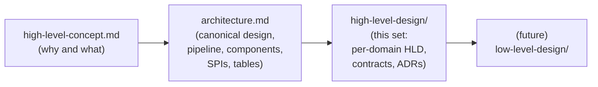

# High-Level Design (HLD)

This directory holds the High-Level Design for `fhir-subscriptions-foss`. The HLD set sits between the original concept and the eventual low-level design (LLD). Its job is to organize the architecture into focused per-domain documents with stable contracts and recorded decisions, not to invent new design.

## How the source documents relate

If anything in this directory contradicts `../architecture.md`, the architecture doc wins. This set organizes; it does not redefine.

## What is in this directory

### Top-level

| File | Purpose |
|---|---|
| [README.md](README.md) | This index. |
| [overview.md](overview.md) | One-page system overview. The fastest way to load context. |

### Domains

Each domain doc covers one named component or named slice of the system. It tells you what the domain does, how it fits with the others, and what it explicitly does NOT do.

| File | Domain |
|---|---|
| [domains/subscriptions-api.md](domains/subscriptions-api.md) | Subscriber-facing Management API (CRUD, `$status`, `$events`, `$get-ws-binding-token`, CapabilityStatement, auth). |
| [domains/subscriptions-engine.md](domains/subscriptions-engine.md) | Stages 3 and 4: subscription fanout and notification Bundle build. |
| [domains/topic-matcher.md](domains/topic-matcher.md) | Stage 2: matching `resource_changes` to `SubscriptionTopic` and writing `ehr_events`. |
| [domains/topics.md](domains/topics.md) | The `SubscriptionTopic` catalog: built-in, adapter-contributed, operator-supplied. |
| [domains/channels.md](domains/channels.md) | Channel modules and the four spec-defined channel types plus custom channels. |
| [domains/ehr-adapter.md](domains/ehr-adapter.md) | The vendor-specific EHR adapter (HL7 Message Processor, FHIR Scan Runner, Vendor API Client, Hydration Service). |
| [domains/mllp-listener.md](domains/mllp-listener.md) | The vendor-neutral MLLP listener. |
| [domains/storage.md](domains/storage.md) | Postgres tables, retention, indexes, transactional outbox. |
| [domains/observability.md](domains/observability.md) | Metrics, traces, structured logs. |
| [domains/lifecycle.md](domains/lifecycle.md) | Health, readiness, startup probes, graceful shutdown. |
| [domains/configuration.md](domains/configuration.md) | Layered configuration model, secret placeholders, hot reload. |

### Contracts

Each contract doc spells out a stable API surface: wire format, types, lifecycle, and versioning policy.

| File | Contract |
|---|---|
| [contracts/subscriber-api.md](contracts/subscriber-api.md) | The subscriber-facing FHIR REST contract. |
| [contracts/notification-bundle.md](contracts/notification-bundle.md) | The `subscription-notification` Bundle wire shape. |
| [contracts/channel-spi.md](contracts/channel-spi.md) | The Channel SPI a notification channel implements. |
| [contracts/adapter-spi.md](contracts/adapter-spi.md) | The Adapter SPI a vendor adapter implements. |
| [contracts/internal-tables.md](contracts/internal-tables.md) | The internal handoff contracts between pipeline stages. |

### Decisions

Lightweight ADRs. Each one captures a decision that has architectural consequences and is small enough to be a single page.

| File | Decision |
|---|---|
| [decisions/index.md](decisions/index.md) | Index of all ADRs and other tracked decisions. |
| [decisions/0001-postgres-only.md](decisions/0001-postgres-only.md) | Postgres is the only supported datastore. |
| [decisions/0002-single-instance-no-leader-election.md](decisions/0002-single-instance-no-leader-election.md) | One container, no replica coordination. |
| [decisions/0003-mllp-listener-vendor-neutral.md](decisions/0003-mllp-listener-vendor-neutral.md) | The MLLP listener is host-provided and vendor-neutral. |
| [decisions/0004-fhir-version-strategy.md](decisions/0004-fhir-version-strategy.md) | R5-shaped internal model, R4B Backport on the wire. |
| [decisions/0005-cancel-and-replace-in-adapter.md](decisions/0005-cancel-and-replace-in-adapter.md) | Cancel-and-replace correlation lives in the adapter. |
| [decisions/0006-no-cql-no-regex.md](decisions/0006-no-cql-no-regex.md) | Matching uses only FHIR search-parameter expressions and FHIRPath. |
| [decisions/0007-spec-bounded-scope.md](decisions/0007-spec-bounded-scope.md) | We stay inside the FHIR Subscriptions spec boundary. |

## Where to start, by question

| If you are asking ... | Read first |
|---|---|
| "What is this thing?" | [overview.md](overview.md) |
| "How does an EHR change become a notification?" | [overview.md](overview.md), then `../architecture.md` (the pipeline diagram and sequence diagram), then [domains/topic-matcher.md](domains/topic-matcher.md) and [domains/subscriptions-engine.md](domains/subscriptions-engine.md). |
| "What does a subscriber send to register?" | [contracts/subscriber-api.md](contracts/subscriber-api.md), then [domains/subscriptions-api.md](domains/subscriptions-api.md). |
| "What does a subscriber receive?" | [contracts/notification-bundle.md](contracts/notification-bundle.md). |
| "How do I write a new vendor adapter?" | [contracts/adapter-spi.md](contracts/adapter-spi.md), then [domains/ehr-adapter.md](domains/ehr-adapter.md). |
| "How do I write a new notification channel?" | [contracts/channel-spi.md](contracts/channel-spi.md), then [domains/channels.md](domains/channels.md). |
| "How does this run in Kubernetes?" | [domains/lifecycle.md](domains/lifecycle.md), then [domains/configuration.md](domains/configuration.md), then [domains/observability.md](domains/observability.md). |
| "How is data stored?" | [domains/storage.md](domains/storage.md), then [contracts/internal-tables.md](contracts/internal-tables.md). |
| "Why was X decided this way?" | [decisions/index.md](decisions/index.md). |

## Conventions

- The architecture doc is the canonical source. Each HLD doc cites its starting point in the architecture (e.g., "Read `../../architecture.md` §Topic Matcher first").
- FHIR spec citations use full URLs at hl7.org/fhir.
- Diagrams use Mermaid. Sequence-diagram messages stick to ASCII to avoid known parser issues.
- Each domain doc closes with a "What this domain does NOT do" list — the responsibilities that belong to a sibling domain.
- Each contract doc closes with a versioning policy.
- ADRs use a Status / Context / Decision / Consequences format.
