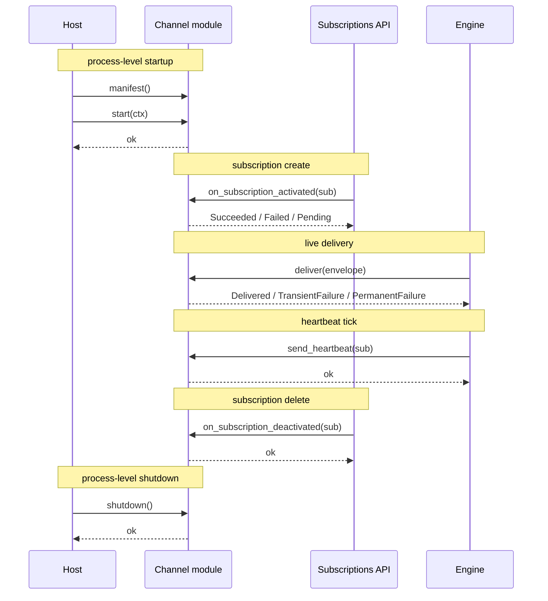

# Contract: Channel SPI

**Purpose.** The interface a notification channel implements. Stable across FHIR spec versions; the same SPI shape supports the four spec-defined channel types (`rest-hook`, `websocket`, `email`, `message`) and any custom channel a deployment loads.

**Reader's prerequisites.** Read [../domains/channels.md](../domains/channels.md) (the domain doc) and `../../architecture.md` (section "Channel SPI" — canonical signatures). The HLD-level reference reproduces the architecture's signatures and adds the per-call semantics, the lifecycle ordering, the manifest fields, and the versioning policy.

## What the SPI is

The Channel SPI is the contract between the [Subscriptions Engine](../domains/subscriptions-engine.md)'s delivery scheduler and any module that delivers notifications via a specific protocol. The scheduler:

- builds a `NotificationEnvelope`;
- hands it to the channel via `deliver(envelope)`;
- receives a `DeliveryOutcome` synchronously (or asynchronously, channel-dependent);
- updates the `deliveries` row based on the outcome.

The channel is responsible for the protocol — HTTPS POST framing, WSS frame emission, SMTP submission, FHIR messaging POST, vendor-proprietary push. It is NOT responsible for retry, backoff, dead-letter routing, or building Bundles. Those live in the engine.

## Notional signature

```
trait NotificationChannel {
    // Identity & capabilities
    fn manifest() -> ChannelManifest;

    // Process-level lifecycle
    async fn start(ctx: ChannelContext) -> Result<()>;
    async fn shutdown() -> Result<()>;

    // Per-subscription lifecycle
    async fn on_subscription_activated(sub: &Subscription) -> Result<HandshakeOutcome>;
    async fn on_subscription_deactivated(sub: &Subscription) -> Result<()>;

    // Delivery
    async fn deliver(notification: NotificationEnvelope) -> DeliveryOutcome;

    // Heartbeats (no-op for channels that don't support them)
    async fn send_heartbeat(sub: &Subscription) -> Result<()>;
}
```

The exact shape will follow the chosen language's idioms (trait + default methods, abstract class with virtual methods, etc.). Names are notional. The semantics below are stable.

## ChannelManifest

The manifest is queried once at startup and cached. It declares the channel's identity and capabilities so the API can validate subscriptions at create time and the `CapabilityStatement` can advertise correctly.

| Field | Notes |
|---|---|
| `id` | A `Coding` (`system` + `code`). Built-in channels use `http://terminology.hl7.org/CodeSystem/subscription-channel-type` (`rest-hook`, `websocket`, `email`, `message`). Custom channels use their own system + code, per the spec's extensible binding on `Subscription.channelType` ([`https://hl7.org/fhir/R5/codesystem-subscription-channel-type.html`](https://hl7.org/fhir/R5/codesystem-subscription-channel-type.html)). |
| `name` | Human-readable name. |
| `description` | Human-readable description. |
| `supported_payload_types` | Subset of `[empty, id-only, full-resource]` the channel accepts. Subscriptions setting `content` outside this set are rejected with HTTP 422. |
| `supported_content_types` | Subset of `[application/fhir+json, application/fhir+xml]` (or others, channel-dependent). |
| `supported_endpoints` | Set of acceptable schemes for `Subscription.endpoint`. For example: rest-hook accepts `https`; email accepts `mailto`; websocket accepts `null` (the WSS URL is server-side, not subscriber-side). |
| `requires_handshake` | Whether the channel performs an activation handshake. If true, `on_subscription_activated` MUST be called by the host. |
| `supports_heartbeats` | Whether the channel can send heartbeats. Subscriptions setting `heartbeatPeriod` on a non-heartbeat channel are rejected with HTTP 422. |
| `supports_batching` | Whether the channel can deliver Bundles with `maxCount > 1`. Subscriptions setting `maxCount > 1` on a non-batching channel are rejected with HTTP 422. |
| `parameter_schema` | JSON Schema for `Subscription.parameter[]` entries this channel accepts. Validated at subscription create. |
| `config_schema` | JSON Schema for the channel's deployment configuration (`channels.<channel-id>.*` in the configuration domain). Validated at startup. |

The `CapabilityStatement` enumerates each loaded channel's `id`, `supported_payload_types`, and `supported_content_types`.

## ChannelContext

Provided to `start(ctx)`. The host injects:

| Field | Notes |
|---|---|
| `config` | The channel's validated configuration (validated against `config_schema`). |
| `http` | Pre-configured HTTP client with TLS, retry, and instrumentation. |
| `metrics` | `MetricsEmitter` for channel-specific metrics. |
| `logger` | Structured logger. |
| `tracer` | OpenTelemetry tracer. |
| `outcome_sink` | A sink the channel may use for asynchronous delivery outcomes (channels that `deliver` returns immediately and a confirmation arrives later). |

The host does NOT inject DB access. Channels do not write to `deliveries`, `dead_letters`, or `subscriptions` directly. Outcomes flow through `DeliveryOutcome` returns or the asynchronous sink.

## NotificationEnvelope

```
struct NotificationEnvelope {
    subscription_id: SubscriptionId,
    sequence: u64,                    // eventsSinceSubscriptionStart for this delivery
    bundle: SubscriptionNotificationBundle,
    payload_type: PayloadType,        // empty | id-only | full-resource
    content_type: ContentType,        // application/fhir+json | application/fhir+xml
    attempt: u32,                     // 0 for first attempt, increments on retry
    correlation_id: String,           // tracing across all stages
    subscription_endpoint: Endpoint,  // resolved Subscription.endpoint plus parameters
    subscription_parameters: [Param], // Subscription.parameter[] entries
}
```

The `bundle` is already serialized in the negotiated `content_type`. Channels do not re-serialize.

The envelope carries `subscription_endpoint` and `subscription_parameters` so the channel does not have to re-load the `Subscription` resource to deliver. Channels MUST NOT mutate `bundle`, `subscription_endpoint`, or `subscription_parameters` — they are read-only for the delivery.

## DeliveryOutcome

```
enum DeliveryOutcome {
    Delivered,
    TransientFailure { retry_after: Option<Duration>, reason: String },
    PermanentFailure { reason: String },
}
```

| Variant | Engine response |
|---|---|
| `Delivered` | Mark `deliveries.status = 'delivered'`; advance the subscription cursor; if subscription was `error`, transition back to `active`. |
| `TransientFailure` | Reschedule with backoff. The `retry_after` (if present) is a hint; the scheduler honors it when computing the next attempt time. After `delivery.retry.max_attempts`, the failure escalates to permanent. |
| `PermanentFailure` | Move the row to `dead_letters`. Transition the subscription to `error` after consecutive failures, and to `off` if `delivery.retry.max_attempts` reaches the configured ceiling for the subscription. |

Channels are responsible for distinguishing transient from permanent. The architecture lists per-channel mappings (e.g., HTTP 4xx → permanent except 408/429, SMTP 4xx → transient, SMTP 5xx → permanent). See [../domains/channels.md](../domains/channels.md) per-channel sections.

## HandshakeOutcome

```
enum HandshakeOutcome {
    Succeeded,
    Failed { reason: String },
    Pending,    // for asynchronous channels (e.g., email-only) where the handshake will be confirmed later
}
```

| Variant | Engine response |
|---|---|
| `Succeeded` | Subscription transitions from `requested` to `active`. |
| `Failed` | Subscription stays in `requested`; the failure cause is stored on the subscription and visible via `$status`. |
| `Pending` | Subscription stays in `requested`. The channel reports the eventual outcome via the asynchronous `outcome_sink`. |

Most channels return synchronously. Email is the canonical asynchronous case — the SMTP relay accepts the message but real delivery is later. The architecture treats SMTP-relay-accepted as `Succeeded` for handshake purposes (there is no synchronous read-back of subscriber acknowledgement), so email returns `Succeeded` rather than `Pending` in practice.

## Lifecycle



Ordering rules:

- `manifest()` is called first; it MUST be pure (no side effects) so the host can safely call it during validation.
- `start(ctx)` is called once at startup, before any per-subscription or delivery call.
- `on_subscription_activated` is called once per subscription, after the subscription has been written to `subscriptions` with `status = 'requested'`. The handshake outcome drives the subsequent status transition.
- `deliver(envelope)` is called many times per subscription, concurrently. Channels must be thread-safe.
- `send_heartbeat(sub)` is called by the scheduler on the heartbeat timer. Channels with `supports_heartbeats = false` will never receive this call.
- `on_subscription_deactivated` is called when the subscription is `DELETE`d or the engine transitions it to `off` for terminal reasons.
- `shutdown()` is called once at process shutdown, after the engine has stopped issuing `deliver` calls.

## Concurrency expectations

A channel MUST be safe to call concurrently from multiple `deliver` invocations. The scheduler runs deliveries in parallel across subscriptions and (for `maxCount = 1` subscriptions) within a subscription. The channel's internal state (HTTP connection pool, WSS connection registry, SMTP submit pool) handles concurrency.

A channel MAY serialize per-subscription if its protocol requires it (e.g., a websocket channel sends frames in order on a given connection). The channel does that internally; it does not push back to the scheduler.

## Capability declaration in CapabilityStatement

Each channel's manifest contributes to the dynamically built `CapabilityStatement`:

- Its Coding appears in the supported `Subscription.channelType` codings.
- Its `supported_payload_types` and `supported_content_types` constrain the per-channel options published.
- Its `supports_batching` and `supports_heartbeats` are reflected in operator-visible documentation; the spec does not standardize where they appear in the `CapabilityStatement`, so the server publishes them in vendor-extensible operation parameters or in supplementary documentation linked from `/metadata`.

## Custom-channel registration

A custom channel ships as a module that implements `NotificationChannel`. Operators include it in the build (the project supports build-time inclusion in v1; runtime plugin loading is a stretch goal). At startup the host calls `manifest()` on every loaded channel and registers them. There is no separate registration step — a loaded channel is, by definition, a registered channel.

The channel's `id.system` MUST NOT be the standard system (`http://terminology.hl7.org/CodeSystem/subscription-channel-type`) — that is reserved for the spec's core types. Custom channels use their own system, per the spec's extensible binding.

## Versioning policy for this SPI

The Channel SPI is a stable interface. Stability rules:

- **No silent breaking changes.** A change that requires existing channels to be modified is a major version of the SPI. The project commits to keeping the SPI shape stable for the foreseeable future.
- **Additive changes** — new optional fields on the manifest, new variant on `DeliveryOutcome` for new channel behaviors, new lifecycle hooks with default implementations — are minor versions. Existing channels continue to work unchanged.
- **The lifecycle order is part of the contract.** A channel may rely on `start` happening before any `deliver`, on `manifest()` being pure, on `on_subscription_activated` being called before `deliver` for any subscription. Changing this order is a breaking change.
- **`NotificationEnvelope` field additions are additive** — channels that don't use the new field continue to work. Field removals are breaking.
- **`DeliveryOutcome` is closed.** Adding a new variant is a breaking change because every channel must produce one of the variants and channel-aware code in the scheduler may switch on them. We have not identified a need for a fourth variant.

When a breaking SPI change becomes necessary, the project ships the new SPI version in parallel with the old one for a release cycle so out-of-tree channels have time to migrate. The `manifest()` declares which SPI version the channel implements.

The SPI does not extend the FHIR Subscriptions spec. A channel that wants to do something beyond the spec must be a custom channel and its non-spec behavior is the operator's choice; the project's built-in channels stay strictly within the spec. See [decisions/0007-spec-bounded-scope.md](../decisions/0007-spec-bounded-scope.md).
