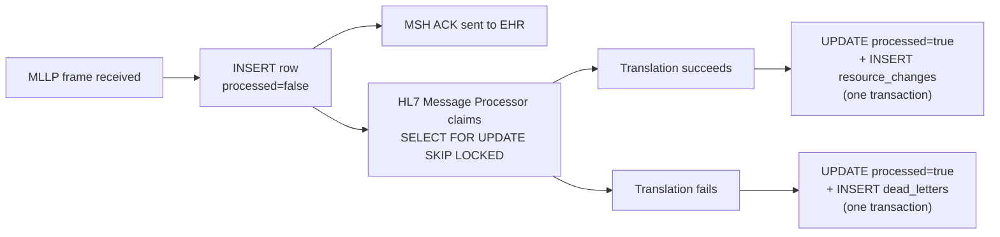
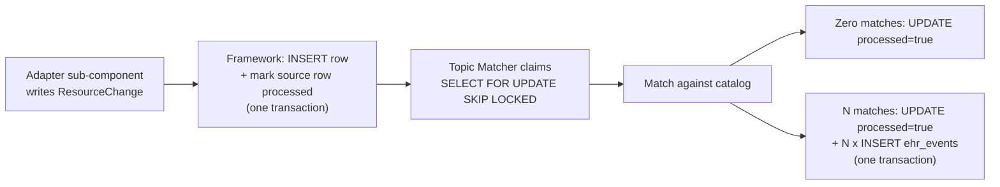
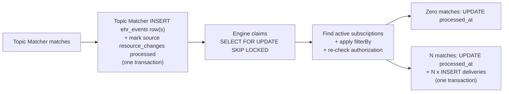
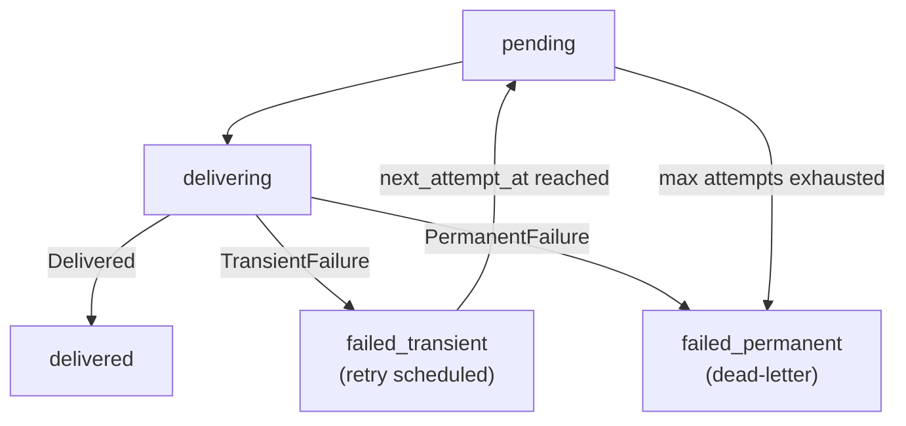

# Contract: Internal Tables — Stage Handoffs

**Purpose.** The wire-level contract between pipeline stages. `hl7_message_queue`, `resource_changes`, `ehr_events`, and `deliveries` are not just storage — they are the stage-to-stage interfaces. A stage's output row shape is the next stage's input contract.

**Reader's prerequisites.** Read [../domains/storage.md](../domains/storage.md) (the storage domain — schema-level concerns) and `../../architecture.md` (the canonical pipeline definition with stage inputs and outputs). The HLD-level reference here is row-level: shape, lifecycle, transactional invariants, retention, and versioning.

This is a contract document. Field names are notional; the implementation will normalize them. The shapes and the invariants are stable.

## Why these are contracts, not just tables

Every stage of the pipeline reads its input from a table and writes its output to a table. The transactional outbox pattern means each stage's `INSERT` of output rows is in the same transaction as its `UPDATE` of the input row's processed flag. A stage that crashes mid-row leaves the input row unclaimed (`SKIP LOCKED` lets the next worker re-claim) and writes nothing to its output.

The twelve tables below are the contracts. Four of them (`hl7_message_queue`, `resource_changes`, `ehr_events`, `deliveries`) are stage-to-stage handoffs along the main pipeline; `pending_pairs` is the cancel-and-replace correlation table that the HL7 Message Processor owns. The remaining seven (`subscriptions`, `subscription_topics`, `dead_letters`, `adapter_state`, `auth_clients`, `ws_binding_tokens`, `audit_log`) are project-internal contracts: the subscriber registry, the topic catalog, adapter KV state, audit, and short-lived auxiliary tables. Their row shapes are stable interfaces; downstream stages and operators depend on the fields they expect. Changing them is a coordinated migration, not a unilateral schema edit.

## `hl7_message_queue`

**Writer.** [MLLP Listener](../domains/mllp-listener.md). Persistence-then-ACK durability boundary.

**Reader.** [HL7 Message Processor](../domains/ehr-adapter.md#hl7-message-processor) inside the active adapter.

### Row shape

| Field | Type | Notes |
|---|---|---|
| `id` | UUID | Primary key. |
| `received_at` | timestamptz | Server-side time when bytes arrived. |
| `listener_endpoint` | text | The configured endpoint name (`adt-feed`, `lab-results`). |
| `peer_addr` | text | Source IP/port of the EHR's interface engine. |
| `mllp_message_id` | text | Parsed `MSH-10` (message control ID). The listener parses only this field. |
| `correlation_id` | UUID | Server-generated. Propagates onto `resource_changes`, `ehr_events`, `deliveries`. |
| `body` | bytea | The raw HL7 v2 message body — bytes between MLLP framing markers. |
| `processed` | bool | `false` until the HL7 Message Processor has consumed the row. |
| `processed_at` | timestamptz | Set when `processed` flips to `true`. |

### Lifecycle

### Transactional invariants

- **Persistence-then-ACK.** The listener does NOT ACK the EHR until the row commit succeeds. If the commit fails, the listener NACKs or drops the connection so the EHR re-sends.
- **Mark-processed-with-output.** The HL7 Message Processor's `UPDATE processed = true` is in the same transaction as either an `INSERT INTO resource_changes` (translation succeeded) or an `INSERT INTO dead_letters` (translation failed). There is never a state where the row is processed but no downstream effect was recorded.
- **Cancel-and-replace held cancellations are NOT marked processed.** While the framework holds a cancellation waiting for its replacement (within `correlation_hold_window`), the source HL7 row stays `processed = false` so a process restart re-enters the held state. The pairing state itself lives in [`pending_pairs`](#pending_pairs), which references the unprocessed row by `source_message_id`.
- **Idempotency.** Duplicate ingests of the same `mllp_message_id` from the same `listener_endpoint` are tolerated — the HL7 Message Processor's adapter-side idempotency on `(adapter_id, correlation_id)` prevents duplicate `resource_changes`.

### Retention

Default 7 days for processed rows. Unprocessed rows are kept indefinitely (no auto-drop of unprocessed work). Cleanup runs daily; batches small enough to avoid WAL bloat.

## `resource_changes`

**Writer.** [Adapter](../domains/ehr-adapter.md) sub-components — HL7 Message Processor, FHIR Scan Runner, Vendor API Client.

**Reader.** [Topic Matcher](../domains/topic-matcher.md).

### Row shape

| Field | Type | Notes |
|---|---|---|
| `id` | UUID | Primary key. |
| `sequence` | bigint | Monotonic per-deployment sequence; partitioning key. |
| `adapter_id` | text | The adapter that wrote this row. |
| `correlation_id` | text | Idempotency + tracing. Unique per `(adapter_id, correlation_id)`. Inherited from the source (HL7 message control ID, FHIR resource version, vendor record ID). |
| `resource_type` | text | The FHIR resource type. |
| `change_kind` | enum | `create`, `update`, `delete`. |
| `resource` | jsonb | The post-translation FHIR resource body. For `delete`, the last-known body. |
| `previous_resource` | jsonb | For `update` and `delete`, the prior version. May be null on `create`. |
| `event_code` | text | Optional. Set when the change came from a vendor change-feed record tagged with an event code (consumed by `SubscriptionTopic.eventTrigger`). |
| `occurred_at` | timestamptz | Best-effort EHR-side timestamp (MSH-7, FHIR `meta.lastUpdated`, vendor timestamp). |
| `received_at` | timestamptz | Server-side time when the source signal arrived. |
| `processed` | bool | `false` until the Topic Matcher has consumed the row. |
| `processed_at` | timestamptz | Set when processed flips. |

### Lifecycle

### Transactional invariants

- **Idempotency.** `UNIQUE (adapter_id, correlation_id)`. A duplicate ingest of the same source event is a no-op INSERT.
- **One transaction per fanout.** The Topic Matcher writes all matched-topic rows for one source row, plus the source-row mark-processed, in a single transaction. Either every matched topic produces an `ehr_events` row or none of them do.
- **Append-only.** No updates other than the `processed` flip and `processed_at` timestamp. The body is immutable once written.
- **Cancel-and-replace shape.** A merged cancel-and-replace pair appears as one row with `change_kind = update`, `previous_resource` = cancelled, `resource` = replacement, with a stable `correlation_id` bridging both source messages. The Topic Matcher does not see two rows.

### Retention

Default 30 days. Partitioned by month. Old partitions detached and dropped via the daily maintenance task.

### Indexes

- `UNIQUE (adapter_id, correlation_id)` — idempotency.
- `(processed, sequence)` — Topic Matcher claim query.
- `(sequence)` — partitioning + ordered scans.

## `ehr_events`

**Writer.** [Topic Matcher](../domains/topic-matcher.md).

**Reader.** [Subscriptions Engine](../domains/subscriptions-engine.md) (Stage 3) for live events; [Subscriptions API](../domains/subscriptions-api.md) for `$events` historical replay.

### Row shape

| Field | Type | Notes |
|---|---|---|
| `id` | UUID | Primary key. |
| `event_number` | bigint | Server-assigned monotonic sequence. Drives `eventsSinceSubscriptionStart` (per-subscription cursor is event_number-derived). Partitioning key. |
| `topic_url` | text | Canonical URL of the matched topic, including version. |
| `change_kind` | enum | Copied from the source resource_changes row. |
| `focus` | text | FHIR reference to the changed resource (e.g., `ServiceRequest/abc-123`). |
| `resource` | jsonb | Resource body, retained for downstream filter evaluation and `$events` replay. |
| `previous_resource` | jsonb | Retained for filterBy previous-state semantics. May be null. |
| `correlation_id` | text | Copied from the source resource_changes row. |
| `occurred_at` | timestamptz | Copied from the source. |
| `notification_shape_hint` | jsonb | The matched topic's `_include` / `_revinclude` directives, denormalized so the Notification Builder doesn't reload the topic. |
| `resource_change_id` | UUID | Back-pointer to the source `resource_changes` row. |
| `claimed_at` | timestamptz | Set when the Subscriptions Engine claims the row. Null until claimed. |
| `processed_at` | timestamptz | Set when the engine has finished Stage 3 fanout (deliveries written or zero-match recorded). |

### Lifecycle

### Transactional invariants

- **One transaction per Stage-3 fanout.** All `deliveries` rows for one `ehr_events` row, plus the mark-claimed, in one transaction.
- **Append-only on the body.** `resource`, `previous_resource`, `topic_url`, `event_number` are immutable once written. Only the `claimed_at` / `processed_at` flags advance.
- **Sequence-numbered.** `event_number` is monotonic per deployment. Used for `$events` replay ordering.
- **Replay-safe.** `$events` reads `ehr_events` by `event_number` range, re-evaluates `filterBy`, re-checks authorization. The engine does not consume rows for replay; it queries them.

### Retention

Default 30 days. Bounds the `$events` replay window. Partitioned by month. Operators that need a longer catch-up window extend retention; storage cost grows roughly linearly.

### Indexes

- `(event_number)` — partitioning + replay.
- `(topic_url, claimed_at)` — engine claim query.
- `(resource_change_id)` — debugging back-link.

## `deliveries`

**Writer.** [Subscriptions Engine](../domains/subscriptions-engine.md).

**Reader.** Channel modules ([channels](../domains/channels.md)) via the delivery scheduler; updated by the scheduler on outcome.

### Row shape

| Field | Type | Notes |
|---|---|---|
| `id` | UUID | Primary key. |
| `subscription_id` | UUID | The subscription receiving this delivery. |
| `event_number` | bigint | The `eventsSinceSubscriptionStart` for this delivery, copied from `ehr_events`. Per-subscription monotonic. |
| `ehr_event_id` | UUID | Source `ehr_events` row. |
| `status` | enum | `pending`, `delivering`, `delivered`, `failed_transient`, `failed_permanent`. |
| `attempts` | int | Incremented on each retry. |
| `next_attempt_at` | timestamptz | Scheduler's pull key. Initially set to now; advanced on retry. |
| `last_error` | text | Most recent failure reason. |
| `delivered_at` | timestamptz | Set when status transitions to `delivered`. |
| `correlation_id` | text | Copied from `ehr_events`. |
| `created_at` | timestamptz | Insert time. |

### Lifecycle

Concretely:

1. Engine inserts row with `status = 'pending'`, `next_attempt_at = now()`.
2. Scheduler claims `pending` rows whose `next_attempt_at <= now()` via `FOR UPDATE SKIP LOCKED`. Sets `status = 'delivering'`.
3. Channel returns `DeliveryOutcome`:
   - `Delivered` → `status = 'delivered'`, `delivered_at = now()`. Subscription cursor advances. If subscription was `error`, transition back to `active`.
   - `TransientFailure` → `status = 'failed_transient'`, increment `attempts`, compute `next_attempt_at` from backoff curve. After max attempts, escalate to `failed_permanent`.
   - `PermanentFailure` → `status = 'failed_permanent'`, copy to `dead_letters`. Subscription transitions to `error` after threshold; to `off` after deeper threshold.

### Transactional invariants

- **Outbound idempotency.** `UNIQUE (subscription_id, event_number)`. Retries do not produce duplicate rows; the same row is updated.
- **Per-subscription ordering.** The scheduler delivers rows for one subscription in `event_number` order. Across subscriptions there is no global ordering guarantee.
- **Cursor advance is conditional.** `subscriptions.eventsSinceSubscriptionStart` advances only on `status = 'delivered'`. Pending or failed deliveries do not advance the cursor.

### Retention

Default 90 days. Operators querying delivery history go further by reading the `audit_log` (which retains 7y by default).

### Indexes

- `UNIQUE (subscription_id, event_number)` — outbound idempotency.
- `(status, next_attempt_at)` — scheduler's main pull query.
- `(subscription_id, event_number)` — per-subscription replay and debugging.

## `pending_pairs`

The cancel-and-replace correlation table. Owned by the [HL7 Message Processor](../domains/ehr-adapter.md#hl7-message-processor) (and any other Stage 1 sub-component that participates in pair correlation). It is **separate from `adapter_state`** because it is per-pair durable state with its own lifecycle, not opaque adapter KV.

This table is the durable persistence of the `correlation_hold_window` mechanism described in [../decisions/0005-cancel-and-replace-in-adapter.md](../decisions/0005-cancel-and-replace-in-adapter.md). Without it, a process restart during a held window would lose the cancellation half and break the consolidated-`update` invariant.

### Writer

- The HL7 Message Processor inserts a row when it sees the first half of a pair (typically the cancellation) and that half is held pending its partner.
- The HL7 Message Processor deletes the row in two cases:
  - The partner arrives within the window: the held resource and the new resource are merged into a single `resource_changes` row with `change_kind = update`, and the pending row is deleted in the same transaction.
  - The window expires: the reaper deletes the row and emits the held half as a plain `delete` (lone cancellation) or plain `create` (lone replacement) `resource_changes` row, in the same transaction.

### Reader

Same writer — no other component reads this table.

### Row shape

| Column | Type | Notes |
|---|---|---|
| `correlation_key` | text, PK | Vendor-specific identifier that links the cancel and the replacement (HL7 `ORC-2`/`ORC-3` placeholder/filler pair, Epic placeholder order ID, Cerner correlation_id, etc.). The adapter's correlation strategy determines what goes here. |
| `pending_resource` | jsonb / bytea | The FHIR resource of whichever half arrived first, serialized. |
| `pending_kind` | enum | `delete` (cancellation held) or `create` (replacement held — rare but possible if the cancellation arrived first in a prior session and was already flushed). |
| `source_message_id` | bigint, FK → `hl7_message_queue(id)` | Back-reference. The source HL7 row stays `processed = false` while this `pending_pairs` row exists; a restart resumes the held state. |
| `expires_at` | timestamptz | Hold-window deadline. A reaper sweep finds rows where `expires_at <= now()` and flushes them. |
| `created_at` | timestamptz | For monitoring (held-pair-age metric). |

### Lifecycle

1. **Insert.** Stage 1 sees a message it recognizes as the first half of a pair (vendor-specific recognition rule). It writes the `pending_pairs` row and **does not** mark the source `hl7_message_queue` row processed. The transaction is the row write only — there is no `resource_changes` row at this point.
2. **Resolve (partner arrives in time).** The next message in the same correlation key is recognized as the partner. In one transaction: read and delete the `pending_pairs` row, mark both source `hl7_message_queue` rows processed, insert one `resource_changes` row with `change_kind = update`, `previous_resource` = the cancelled body, `resource` = the replacement body, propagating the correlation_id through.
3. **Expire (partner never arrives).** A reaper job runs on a fixed cadence (default every 5 seconds) and finds rows with `expires_at <= now()`. For each: in one transaction, delete the `pending_pairs` row, mark the source `hl7_message_queue` row processed, and insert one `resource_changes` row — `change_kind = delete` for a held cancellation, or `change_kind = create` for a held replacement.

### Transactional invariants

- The `pending_pairs` row exists if and only if the source `hl7_message_queue` row's `processed` is false. They are written and cleared together.
- A successful pair resolution writes exactly one `resource_changes` row (the consolidated `update`) and clears the `pending_pairs` row in the same transaction.
- An expired pair flushes exactly one `resource_changes` row and clears the `pending_pairs` row in the same transaction.

### Retention

The table holds only in-flight pairs plus a small grace window. Resolved or expired rows are deleted immediately as part of resolution. The reaper enforces the upper bound; in steady state the table size is small (held cancellations not yet matched).

### Indexes

- `(expires_at)` — the reaper's sweep query: "rows whose hold window has ended."
- `(source_message_id)` — restart recovery: rebuild the in-memory pairing state from this table on startup.

## `subscriptions`

**Writer.** [Subscriptions API](../domains/subscriptions-api.md) (`internal/api/handlers/`), [Subscriptions Engine](../domains/subscriptions-engine.md) (status transitions, cursor advance).

**Reader.** Subscriptions API (CRUD), Engine (Stage 3 fanout, scheduler).

### Row shape

| Column | Type | Notes |
|---|---|---|
| `id` | uuid, PK | Subscription identifier. |
| `client_id` | text, FK → `auth_clients.id` | The owning SMART client. |
| `status` | text | One of `requested`, `active`, `error`, `off`, `entered-in-error`. |
| `topic_url` | text | The matched [`subscription_topics.url`](#subscription_topics). |
| `channel_type` | text | `rest-hook`, `websocket`, `email`, etc. |
| `endpoint` | text, nullable | Channel-specific delivery target (HTTPS URL for `rest-hook`, null for `websocket`). |
| `header` | jsonb, nullable | Channel header overrides. |
| `filter_by` | jsonb, nullable | Array of FHIR `filterBy` elements applied at Stage 3. |
| `content` | text | One of `empty`, `id-only`, `full-resource`. Default `id-only`. Per [decisions/0010 #1](../decisions/0010-implementation-defaults.md) the project default is `id-only` even though the FHIR R5 default is `empty`. |
| `heartbeat_period` | interval, nullable | Channel keep-alive cadence. |
| `timeout` | interval, nullable | Per-delivery timeout. |
| `max_count` | int | Default 1. Notifications-per-batch upper bound. |
| `events_since_subscription_start` | bigint | Default 0. Per-subscription cursor; advances only on confirmed delivery. |
| `reason` | text | Free-form rationale captured at create time. |
| `end_time` | timestamptz, nullable | Optional auto-expiry. |
| `error` | text, nullable | Most recent error reason while `status = 'error'`. |
| `contact` | jsonb, nullable | Operator contact metadata. |
| `last_handshake_at` | timestamptz, nullable | Set on the most recent successful channel handshake. |
| `created_at` | timestamptz | Insert time. |
| `updated_at` | timestamptz | Mutation time. |

### Lifecycle

`requested` on POST → `active` on handshake success → `error` ↔ `active` on consecutive failures → `off` on max retries / DELETE / revoked auth. See [low-level-design/subscriptions-engine.md](../../low-level-design/subscriptions-engine.md#update-semantics-drain-before-applying-changes) for the update-semantics drain rule.

### Transactional invariants

- **Cursor advance is conditional.** `events_since_subscription_start` is advanced ONLY on confirmed delivery; the increment is in the same transaction as the [`deliveries`](#deliveries) `status = 'delivered'` write.
- **Drain before mutate.** Updates to `filter_by` or `topic_url` drain the in-flight batch first per the engine's update-semantics rule, so a notification batch never straddles a contract change.
- **Revocation cascades.** When the owning row in [`auth_clients`](#auth_clients) is removed, the subscription transitions to `off` and any pending [`ws_binding_tokens`](#ws_binding_tokens) for it are deleted.

### Indexes

- `(topic_url, status)` — the engine's Stage 3 lookup ("active subscriptions for this topic").

### Retention

90 days after `status = 'off'`.

## `subscription_topics`

**Writer.** Topics catalog loader (`internal/topics/`).

**Reader.** [Topic Matcher](../domains/topic-matcher.md) (Stage 2), Subscriptions API (`GET /SubscriptionTopic`), version-shim.

### Row shape

| Column | Type | Notes |
|---|---|---|
| `id` | uuid, PK | Topic-row identifier. |
| `url` | text, NOT NULL | Canonical topic URL. |
| `version` | text, NOT NULL | Topic version. |
| `title` | text | Human-readable title. |
| `description` | text | Description. |
| `status` | text | One of `draft`, `active`, `retired`. |
| `date` | timestamptz | Publication timestamp. |
| `source` | text | One of `builtin`, `adapter`, `operator`. |
| `body` | jsonb | Full FHIR `SubscriptionTopic` resource. |
| `compiled_form` | bytea | Pre-compiled cache, opaque to readers other than the matcher. |
| `created_at` | timestamptz | Insert time. |
| `retired_at` | timestamptz, nullable | Set when transitioning to `retired`. |

`UNIQUE (url, version)`.

### Lifecycle

Loaded at startup and on SIGHUP. Source precedence per [low-level-design/topics.md](../../low-level-design/topics.md): operator > adapter > built-in. Versions transition to `retired` when removed from source but no [`subscriptions`](#subscriptions) row is `off` against them; deletion is operator-driven, not automatic.

### Transactional invariants

- **Source precedence is enforced at load.** A loader transaction that observes the same `(url, version)` from multiple sources keeps the highest-precedence body and discards the lower-precedence rows.
- **No silent retire.** Marking `status = 'retired'` and clearing `retired_at` are mutations that go through the loader; readers never write this table.

### Indexes

- `(status)` — catalog reads filter by status.
- `(url)` — version lookups for a given canonical URL.

### Retention

While `status != 'retired'` OR any `subscriptions` row references the version. Operator-supervised cleanup.

## `dead_letters`

**Writer.** [Subscriptions Engine](../domains/subscriptions-engine.md) (delivery exhaustion), [HL7 Message Processor](../domains/ehr-adapter.md#hl7-message-processor) (translation/validation failure), [Channel](../domains/channels.md) modules (permanent failure).

**Reader.** Operators (read-only).

### Row shape

| Column | Type | Notes |
|---|---|---|
| `id` | uuid, PK | Dead-letter row identifier. |
| `kind` | text | One of `delivery_exhausted`, `hl7_unparseable`, `hl7_invalid_fhir`, `channel_permanent_failure`. |
| `source_table` | text | The originating contract table (e.g., `deliveries`, `hl7_message_queue`). |
| `source_id` | uuid | The originating row id. |
| `subscription_id` | uuid, nullable, FK → [`subscriptions.id`](#subscriptions) | Set when the dead-letter is delivery-side. |
| `reason` | text | Short failure category. |
| `error_detail` | jsonb | Structured error body (status code, headers, validation report). |
| `payload_redacted` | bytea | JCS-canonicalized payload with PHI fields redacted. |
| `correlation_id` | uuid, nullable | Propagated tracing id. |
| `created_at` | timestamptz | Insert time. |

### Lifecycle

Append-only. Never updated.

### Transactional invariants

- **Append-only.** No update or delete path other than retention sweep.
- **Co-committed with the terminal write.** A `delivery_exhausted` insert is in the same transaction as the [`deliveries`](#deliveries) `status = 'failed_permanent'` write; an `hl7_unparseable` / `hl7_invalid_fhir` insert is in the same transaction as the [`hl7_message_queue`](#hl7_message_queue) `processed = true` write.

### Indexes

- `(kind, created_at)` — operator triage queries by failure category and recency.

### Retention

180 days (`storage.retention.dead_letters`).

## `adapter_state`

**Writer.** [Adapter](../domains/ehr-adapter.md) sub-components (HL7 Message Processor, FHIR Scan Runner, Vendor API Client).

**Reader.** Same writers.

### Row shape

| Column | Type | Notes |
|---|---|---|
| `adapter_id` | text | The owning adapter. Part of PK. |
| `scope` | text | E.g., `scan_snapshot`, `change_feed_cursor`, `vendor_token`. Part of PK. |
| `key` | text | Sub-component key. Part of PK. |
| `value` | bytea | Opaque to the table; the adapter sub-component owns the serialization. |
| `key_version` | int | Default 1. At-rest encryption envelope version. |
| `updated_at` | timestamptz | Mutation time. |

`PRIMARY KEY (adapter_id, scope, key)`.

### Lifecycle

KV upsert. The adapter sub-component owns the schema-within-value. **Does NOT hold cancel-and-replace pending pairs — those live in [`pending_pairs`](#pending_pairs).**

### Transactional invariants

- **Co-committed with the change it implies.** Writes from a sub-component are in the same transaction as the [`resource_changes`](#resource_changes) row that derived from the state change (e.g., a scan-snapshot update commits with the `resource_changes` rows it implies).
- **Opaque to the framework.** The framework never inspects `value`; only the writing sub-component does.

### Indexes

PK is sufficient.

### Retention

While referenced by the active adapter. No automatic sweep; cleanup is operator-driven when adapters are decommissioned.

## `auth_clients`

**Writer.** Configuration loader (file → DB on SIGHUP) per [decisions/0008 #9](../decisions/0008-resolved-design-questions.md). There is no admin API.

**Reader.** API auth middleware.

### Row shape

| Column | Type | Notes |
|---|---|---|
| `id` | text, PK | The `client_id` from the SMART JWT. |
| `jwks_url` | text | Where the API auth middleware resolves the client's signing keys. |
| `scopes` | text[] | SMART scope strings granted to the client. |
| `display_name` | text | Operator-facing label. |
| `created_at` | timestamptz | Insert time. |
| `updated_at` | timestamptz | Mutation time. |

### Lifecycle

Source of truth is `auth.client_registry` in the config file. SIGHUP reload re-syncs (insert / update / delete-rows-not-in-config). Cascading deletes apply to [`ws_binding_tokens.client_id`](#ws_binding_tokens).

### Transactional invariants

- **One-shot sync.** The SIGHUP sync is one transaction: the post-state of the table matches the post-state of the config file or the sync rolls back.
- **Cascade is in-transaction.** Deletes propagate to `ws_binding_tokens` and downgrade owning [`subscriptions`](#subscriptions) to `off` within the same sync transaction.

### Indexes

PK is sufficient.

### Retention

Forever, unless removed from config.

## `ws_binding_tokens`

**Writer.** Subscriptions API `$get-ws-binding-token` handler.

**Reader.** WebSocket channel on connection upgrade.

### Row shape

| Column | Type | Notes |
|---|---|---|
| `token` | text, PK | Base64url, ~22 chars. The bearer secret presented on upgrade. |
| `subscription_id` | uuid, FK → [`subscriptions.id`](#subscriptions) ON DELETE CASCADE | The bound subscription. |
| `client_id` | text, FK → [`auth_clients.id`](#auth_clients) | The issuing client. |
| `expires_at` | timestamptz | Token expiry. |
| `created_at` | timestamptz | Insert time. |

### Lifecycle

Insert at `$get-ws-binding-token`. Single-use: deleted on successful WSS upgrade. Reaper deletes expired rows on a periodic sweep.

### Transactional invariants

- **Single-use redemption.** The WSS upgrade reads-then-deletes the token in one transaction so a token cannot be redeemed twice.
- **Cascade.** Deleting the bound subscription deletes the token; deleting the issuing client cascades the same way through `subscriptions`.

### Indexes

- `(expires_at)` — the reaper's sweep query.

### Retention

Until expiry or use.

## `audit_log`

**Writer.** Every component, via the audit emitter in `internal/infra/observability/`. Per [decisions/0010 #7](../decisions/0010-implementation-defaults.md), `audit_log` is BOTH a durable Postgres table AND a configurable real-time sink. The table is the source of truth; the sink is best-effort forwarding.

**Reader.** Operators (forensics), the chain verifier (daily integrity check).

### Row shape

| Column | Type | Notes |
|---|---|---|
| `seq` | bigserial, PK | Monotonic sequence. |
| `occurred_at` | timestamptz | Default `now()`. |
| `actor_kind` | text | One of `subscriber`, `operator`, `system`. |
| `actor_id` | text, nullable | The acting principal id. Null for `system`. |
| `action` | text | Verb-noun, e.g., `create_subscription`, `revoke_client`, `deliver_notification`. |
| `target_kind` | text, nullable | The kind of object acted on (`subscription`, `client`, `topic`). |
| `target_id` | text, nullable | The acted-on id. |
| `outcome` | text | One of `success`, `failure`, `denied`. |
| `correlation_id` | uuid, nullable | Propagated tracing id. |
| `canonical_form` | bytea | JCS-canonicalized JSON of the audit-relevant fields per [decisions/0010 #3](../decisions/0010-implementation-defaults.md). |
| `hash` | bytea | SHA-256 of `canonical_form`. |
| `prev_hash` | bytea | SHA-256 of the prior row's `hash`; the chain link. |

### Lifecycle

Append-only. Never updated, never deleted (except retention-driven; default 7y).

### Transactional invariants

- **Application-enforced chain.** The hash chain is application-enforced. Writers serialize through a Postgres advisory lock so `prev_hash` is correct under concurrency.
- **Mismatch is observable.** The mismatch metric `fhir_subs_audit_chain_invalid_total` increments on any verifier-detected break.
- **No mutation.** Once written, `canonical_form`, `hash`, and `prev_hash` are immutable.

### Indexes

- `(occurred_at)` — time-range forensics.
- `(actor_id)` — per-actor history.
- `(correlation_id)` — cross-table tracing joins.

### Retention

7 years (`storage.retention.audit_log`). The chain-walk on cleanup re-anchors the chain after the truncation point.

## Versioning policy

The twelve tables are project-internal contracts (five are stage-to-stage handoffs along the main pipeline; the others are subscriber-registry, topic catalog, adapter state, audit, and short-lived auxiliary tables). Schema changes follow the storage domain's expand-then-contract migration discipline (see [storage.md](../domains/storage.md#schema-migrations)). The HLD-relevant rules:

### Additive changes

A new optional column is additive. Older readers ignore it. Older writers don't populate it. The migration:

1. Add the column NULL-able. Deploy the new release. Both old and new readers tolerate the new column.
2. New writers populate the column on new rows. Old rows still have NULL; readers must handle NULL.
3. (Optional) Backfill old rows.

### Breaking changes — expand-then-contract

Removing or repurposing a column is breaking. The discipline:

1. Add the new column alongside the old. Writers write both. Readers read whichever is present.
2. Backfill the new column from the old.
3. Switch readers to the new column. Old column is still written but unused by readers.
4. Stop writing the old column. Drop it in a later release.

This typically spans three releases. It is the only safe way to change a contract without coordinated downtime.

### Cross-stage contracts

When a contract change affects two stages (writer + reader of the same table), both must roll forward together. The expand-then-contract discipline lets the rollout happen in any order — a release with the new reader works against the old writer (it ignores the new column it doesn't see), and vice versa.

### Indexes

Index changes are not contract changes — they're performance changes. They use `CREATE INDEX CONCURRENTLY` to avoid blocking writes. The HLD lists required indexes; additional indexes may be added without coordination.

### Retention

Retention defaults are per-deployment configuration. Changes to defaults are documented in the project's release notes; per-deployment overrides are unaffected.

### Compatibility window

Each release of the project must run against a database migrated by the immediately previous release (forward compatibility). Each release must tolerate a database that has been migrated to the immediately next release (backward compatibility, for rollback). Two releases ahead is not required.

This is what makes rolling deployments and quick rollbacks safe. A schema change that violates either rule must be staged across multiple releases.
