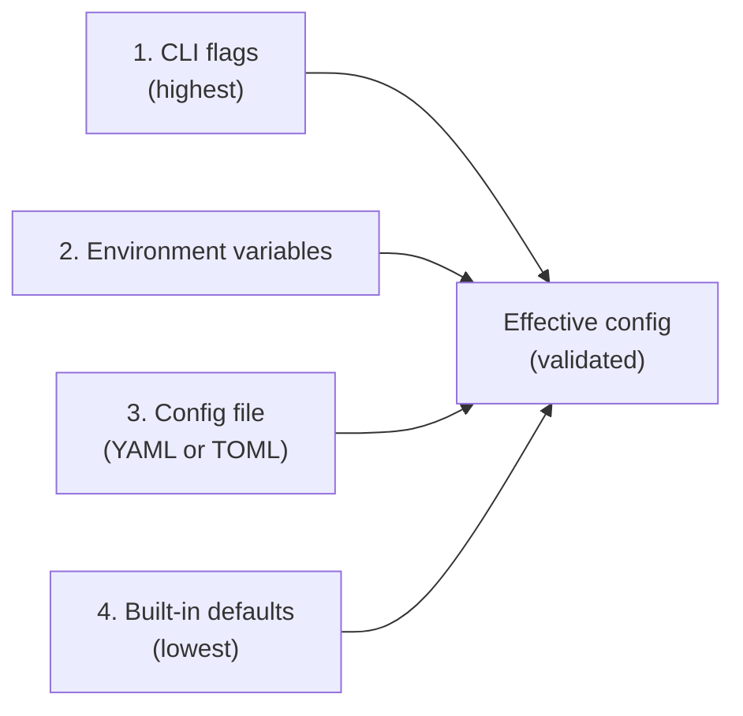

# Configuration

**Purpose.** The layered configuration model. How operators tell a deployment what facility it serves, which adapter to load, which channels to enable, how to authenticate subscribers, where to talk to Postgres, how long to retain data, where to send metrics. Plus the secret-placeholder syntax, the hot-reload subset, and the validation rules.

**Reader's prerequisites.** Read `../../architecture.md` (section "Configuration" — canonical, with a representative YAML example). This HLD doc covers the shape of the config domain — where values come from, how they're resolved, and what is/isn't reloadable. The example YAML in the architecture doc is the source of truth for field names; this document does not duplicate it.

## Four sources, one effective configuration



Precedence is highest-wins. There is no runtime admin API — see [decisions/0008](../decisions/0008-resolved-design-questions.md). Operational changes flow through the config file plus SIGHUP for the reloadable subset, or through container restart for everything else.

### 1. CLI flags

For ad-hoc overrides during operator interventions. `--log-level=debug` is the canonical use. Flags that override secrets are unusual — secrets normally come from env or files — but supported.

### 2. Environment variables

Preferred for secrets and per-environment overrides. Well-suited to Kubernetes (a Secret mounted as env vars) and to Docker (`-e` or `--env-file`). Environment variable names mirror the config-file path: `STORAGE_POSTGRES_URL`, `AUTH_TRUSTED_ISSUERS_0_JWKS_URL`. The exact convention will be normalized in implementation; the principle is one-to-one mapping between config keys and env-var names so an operator can override any field without touching the file.

### 3. Config file

YAML or TOML, mounted into the container (`/etc/fhir-subs/config.yaml` by default). Preferred for the bulk of structural config — listener endpoints, channel set, retention, observability sinks. The example YAML in `../../architecture.md` is the reference structure.

The file is read once at startup. Hot reload of a subset is supported (see "Hot reload" below); reload re-reads the same file.

### 4. Built-in defaults

Everything has a sensible default. The architecture's example YAML shows defaults for retry curves, retention windows, heartbeat periods, request timeouts, pool sizes. An operator can run with the bare minimum (`facility_id`, `storage.postgres.url`, `adapter.id`, `auth.*`) and accept defaults for the rest.

## Secret placeholder syntax

Secrets must never appear in the config file directly. They live in environment variables or in mounted files (Kubernetes Secret, Docker secret, file-based vault unwrap). The config file references them via placeholder syntax:

- `${env:VAR_NAME}` — the value of environment variable `VAR_NAME`.
- `${file:/path/to/secret}` — the contents of the file at `/path/to/secret`, trimmed of trailing whitespace.

Placeholders are resolved **after** structural validation: structurally invalid configs are rejected before any secret is touched. A missing referenced env var or unreadable secret file is a startup error. Resolved secrets are never logged.

Examples (matching the architecture's example YAML):

```yaml
storage:
  postgres:
    url: "${env:DATABASE_URL}"
  encryption:
    at_rest_key: "${env:STORAGE_ENCRYPTION_KEY}"

adapter:
  config:
    fhir_auth:
      private_key_file: /run/secrets/epic-key.pem
      client_id: "${env:EPIC_CLIENT_ID}"

channels:
  email:
    smtp:
      auth:
        username: "${env:SMTP_USERNAME}"
        password: "${env:SMTP_PASSWORD}"
```

Direct file references (e.g., `private_key_file: /run/secrets/epic-key.pem`) are equivalent to a placeholder where the consuming component reads the file at use time. Either is acceptable; the placeholder form is recommended for non-large secrets.

## Hot reload

The architecture commits a specific reloadable subset. Reload is triggered by `SIGHUP` only — there is no admin API ([decisions/0008](../decisions/0008-resolved-design-questions.md)). Reloadable today:

- **Topic catalog.** Add, remove, update topics. The topic loader re-reads the operator-supplied catalog directory and re-evaluates the merge with adapter-contributed and built-in topics.
- **Subscription client registry.** Add, remove, change scopes for registered subscriber clients.
- **Log level.** A live `info` → `debug` flip without a restart.
- **Delivery retry / backoff parameters.** The scheduler picks up the new curve on its next tick.

Everything else requires a restart:

- Bind addresses (`server.http.bind`, MLLP listener ports).
- Postgres connection (`storage.postgres.url`, `pool_size`).
- Adapter selection (`adapter.id`).
- Channel set (which channels are loaded). Channel **configuration** within an already-loaded channel is reloadable for non-connection fields; connection-level fields (SMTP host, Kafka brokers) require a restart of the channel.
- TLS material (server certificate). A reload that swaps cert files is feasible but is a v1 stretch.

Reload is best-effort: if a reload of the topic catalog fails (a new topic file has a parse error), the failed item is logged and the rest of the reload proceeds. The service does not roll back to the prior state on a partial reload failure — that would be a worse experience than "the new bad topic was rejected, everything else applied."

## Validation

Validation runs at startup and on every reload. Three layers:

### Structural

The config file (YAML/TOML) must parse and must conform to the project's schema. Unknown keys are an error (no silent typos). Required fields must be present.

### Semantic

- `auth.trusted_issuers` must contain at least one entry **OR** an authenticated `client_registry` must be present. The architecture is explicit: "you cannot run with no auth."
- Adapter config is validated against the adapter manifest's JSON Schema before the adapter is started. An unknown adapter ID is a startup error. The architecture's words: "Adapter config is validated against the adapter's manifest's JSON Schema before the adapter is started."
- Channel custom config is validated against each channel's manifest schema.
- Listener endpoints must not collide on bind+port within a deployment.
- TLS material referenced by `server.http.tls.cert_file` and `key_file` must be readable and valid.

### Secret resolution

After structural and semantic validation pass, secret placeholders are resolved. A missing env var or unreadable secret file is a startup error.

If any layer fails, the service refuses to start. A structured error pointing at the offending field is emitted to stderr and to the audit log if the audit log is configured before the failure.

## What's required vs. what's optional

The architecture is explicit. Hard-required at startup:

- `deployment.facility_id`
- `server.http.bind` (or the TLS-enabled equivalent — TLS recommended)
- `storage.postgres.url`
- `adapter.id` and the adapter's required config (per its manifest schema)
- At least one `auth.trusted_issuers` entry OR an authenticated `client_registry` entry

Optional with defaults:

- All channel configs (built-in channels have safe defaults; email is opt-in via `channels.email.enabled`).
- All delivery / heartbeat / retry tuning.
- Observability (metrics/tracing/audit defaults are stdout/file).

## Configuration domains in the file

The architecture's example YAML groups configuration into domains. The HLD's contribution is just the mapping of each domain to the responsible HLD section:

| Config domain | HLD domain |
|---|---|
| `deployment.*` | This document. Identifies the facility and environment in logs and audit. |
| `server.*` | [Subscriptions API](subscriptions-api.md), [lifecycle](lifecycle.md). |
| `lifecycle.*` | [Lifecycle](lifecycle.md). |
| `storage.*` | [Storage](storage.md). |
| `auth.*` | [Subscriptions API](subscriptions-api.md). |
| `topics.*` | [Topics](topics.md). |
| `adapter.*` | [EHR Adapter](ehr-adapter.md). The `adapter.config` sub-tree is validated against the adapter's manifest schema. |
| `channels.*` | [Channels](channels.md). One sub-section per built-in channel plus a `custom[]` array. |
| `delivery.*` | [Subscriptions Engine](subscriptions-engine.md) — delivery scheduler. |
| `observability.*` | [Observability](observability.md). |

Each HLD domain doc references the relevant configuration sub-tree by name. The architecture's YAML is the example; this doc and the per-domain docs do not redefine the field names.

## What this domain does NOT do

- **It does not store secrets.** Secrets are referenced by placeholder; the operator's secret store provides them.
- **It does not validate domain semantics that need runtime data.** A topic that fails to load at runtime, a subscriber whose JWKS is unreachable, a channel whose endpoint is down — these are runtime conditions, not configuration validation. The relevant domain handles them.
- **It does not own the schema of any individual domain's config.** Each domain owns its own schema; this domain owns the loader, the layering, the placeholder syntax, and the validator that walks the schemas.
- **There is no admin API.** Runtime mutation of configuration goes through the config file plus SIGHUP for the documented reloadable subset, or through container restart. See [decisions/0008](../decisions/0008-resolved-design-questions.md).
