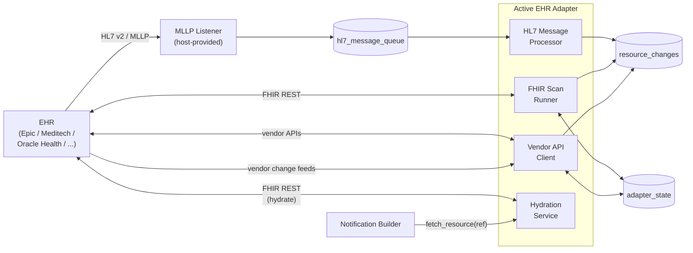

# EHR Adapter

**Purpose.** The vendor-specific module that owns all I/O with the EHR except the MLLP socket. Stage 1 of the pipeline — translation. Reads HL7 messages from `hl7_message_queue`, scans the EHR's FHIR API on a cadence, consumes vendor change feeds, serves hydration callbacks from the engine, and writes vendor-neutral `resource_changes` rows.

**Reader's prerequisites.** Read [../overview.md](../overview.md), `../../architecture.md` (sections "EHR side", "Pipeline … Stage 1", "Cancel-and-replace pairs", "Adapter SPI"), and [mllp-listener.md](mllp-listener.md) (the host-provided component that feeds the HL7 path). The adapter SPI signature lives in [../contracts/adapter-spi.md](../contracts/adapter-spi.md).

## What an adapter is

An adapter is a vendor-specific implementation of the [Adapter SPI](../contracts/adapter-spi.md). It is the only place vendor knowledge lives. The core (engine, channels, topic matcher, storage, lifecycle) never grows a `match vendor` switch.

A deployment activates exactly one adapter at runtime, named by configuration (`adapter.id`). The container image may bundle several adapters compiled in; the unselected ones are inert.

## Where it sits

## The four sub-components

Every adapter has the same four sub-components. Three of them write `resource_changes` (the Stage 1 output); the fourth serves a synchronous callback during Stage 4. Each is independently optional — an adapter declares which it provides via its manifest's capability set.

### HL7 Message Processor

**Stage 1 source for HL7 v2 messages.**

Reads unprocessed rows from `hl7_message_queue` (using `SELECT FOR UPDATE SKIP LOCKED`), parses the HL7 message, applies vendor-specific Z-segment handling, derives `change_kind` from the message control fields (`MSH-9`, `ORC-1`, etc.), maps to a FHIR resource using the [HL7 v2-to-FHIR Implementation Guide](https://hl7.org/fhir/uv/v2mappings/) plus vendor overrides, validates against the project's profile set, and writes a `resource_changes` row. The row insert and the source-row mark-processed happen in the same transaction so a crash never loses or double-processes a message.

The translation is documented in `../../architecture.md` as four steps (lex / classify / map / validate). The base class owns the queue loop, the dead-letter routing on validation failure, and the cancel-and-replace correlation-window state machine. The vendor subclass overrides:

- **REQUIRED:** `lex(raw_bytes)` — extend the standard segment tokenizer with vendor `Z*` segments.
- **REQUIRED:** `classify(parsed)` — return `(change_kind, vendor_correlation_key)`. The `correlation_key` is what the framework uses to pair cancel-and-replace messages within the hold window (typically `ORC-2`/`ORC-3` placeholder/filler order numbers).
- **REQUIRED:** `map_to_fhir(parsed, classification)` — produce the FHIR resource(s).
- **OPTIONAL:** `validate(resource)` — defaults to base R5 profile validation; override for stricter vendor or facility profiles.
- **OPTIONAL:** `correlation_hold_window()` — defaults to 30s.
- **OPTIONAL:** `on_unpaired_cancellation` / `on_unpaired_replacement` — defaults to "emit a plain delete" / "emit a plain create".

See [../contracts/adapter-spi.md](../contracts/adapter-spi.md#hl7messageprocessor) for the full SPI shape.

### FHIR Scan Runner

**Stage 1 source for periodic FHIR REST scans.**

On a configurable cadence per resource type, calls the EHR's FHIR REST API directly, processes each returned resource one at a time, and diffs against the prior snapshot in `adapter_state`. The framework computes a content hash of the resource (canonical JSON SHA-256, minus volatile fields like `meta.lastUpdated` and version), compares to the stored hash, and emits a `resource_changes` row when the hash differs.

We do **not** rely on `_lastUpdated`. Most EHR FHIR APIs do not honor it accurately (resources change without `_lastUpdated` advancing; `_lastUpdated` advances without the resource changing). Snapshot-and-diff is the change-detection mechanism.

Resources that disappear between scans are emitted as `delete`. New resources are `create`. Hash-divergent resources are `update`, with `previous_resource` populated from the snapshot.

The base class owns scheduling, snapshot persistence in `adapter_state`, content-hash diffing, the `resource_changes` row write, rate-limit budget enforcement against the EHR, and retry/backoff on transient EHR errors. The vendor subclass overrides:

- **REQUIRED:** `scan_plan()` — return the set of `(resource_type, cadence, query_params)` to scan.
- **REQUIRED:** `run_scan(target, http)` — execute one target's query against the EHR's FHIR API, yielding resources. Implementor handles vendor-specific paging, search-parameter quirks, and auth.
- **OPTIONAL:** `content_hash(resource)` — defaults to canonical JSON SHA-256.
- **OPTIONAL:** `normalize(resource)` — defaults to identity; override for vendor profile normalization.

When a new subscription is created, the scan runner is consulted to ensure its scan plan includes whatever resource types the subscription's topic + filter requires. If the type is not already in the plan, the scan runner adds it and runs an initial scan to seed `adapter_state`. This is what `../../architecture.md` calls "the server needs to be able to update its fetches to make sure it is fetching an initial set of data" for new subscriptions.

### Vendor API Client

**Stage 1 source for vendor proprietary APIs and change feeds.**

Wraps the EHR's proprietary APIs (Epic Interconnect, Cerner / Oracle Health Millennium APIs, Meditech APIs) and consumes any vendor change feeds the EHR offers (webhooks, websockets, CDC streams, polling). Translates vendor-specific events into FHIR resources and writes `resource_changes` rows. Manages its own cursors / last-seen tokens in `adapter_state`.

The base class owns connection / subscription lifecycle, cursor persistence, retry / reconnect with exponential backoff, in-flight idempotency via `correlation_id`, and graceful shutdown that drains in-flight events. The vendor subclass overrides:

- **REQUIRED:** `consume(sink, cursor)` — long-running consumer for the vendor change feed; streams events to the provided sink.
- **REQUIRED:** `translate(vendor_record)` — translate one vendor record to a `ResourceChange`.

### Hydration Service

**Synchronous callback for Stage 4 — `fetch_resource(ref)`.**

When the [Notification Builder](subscriptions-engine.md#stage-4--notification-builder) is assembling a `full-resource` Bundle and the topic's `notificationShape` includes `_include` or `_revinclude` directives, the builder calls `fetch_resource(reference)` synchronously. The hydration service fetches the referenced resource from the EHR (typically via FHIR REST), normalizes it, and returns the body in-memory. **No DB writes** — hydration is read-through to the EHR.

The base class owns engine callback wiring, a per-replica in-memory LRU cache with short TTL, request coalescing (multiple concurrent calls for the same reference deduplicate to one EHR fetch), rate-limit budgeting, and a hard timeout per fetch. The vendor subclass overrides:

- **REQUIRED:** `fetch(reference, http)` — fetch one resource from the EHR. Implementor handles vendor auth, pagination, and profile normalization.
- **OPTIONAL:** `cache_ttl()` — defaults to 60s.

The hydration service is the **only** synchronous in-memory call across the EHR/Subscriptions boundary. Everything else crosses through Postgres rows.

## The base-class framework

The Adapter SPI is not a single flat trait an implementor fills in from scratch. Each sub-component ships a concrete base class with working defaults that handle every cross-cutting concern (DB I/O, queue claiming, retry/backoff, idempotency, error routing, metric emission, lifecycle). The vendor subclass overrides only the methods marked **REQUIRED** plus whichever **OPTIONAL** methods the EHR's behavior actually demands.

`../../architecture.md` "The contract — base classes and overrides" lists every base class and every required/optional override; [../contracts/adapter-spi.md](../contracts/adapter-spi.md) is the HLD-level reference. The HLD-relevant points:

- **The base class owns the queue loop and the transactional outbox writes.** Vendor code never touches the database directly.
- **The base class owns the cancel-and-replace correlation-window state machine.** Vendor code provides the correlation key from `classify`; the base does the pairing, the hold, the timeout, and the unpaired-emission paths.
- **The base class owns the dead-letter routing.** A translation or validation failure routes the source row to `dead_letters` and increments a metric; vendor code does not need to handle the failure path.

This is what makes the SPI genuinely extensible. A vendor adapter is small — typically a few hundred lines of vendor logic plus the inherited base behavior — and a new vendor is added by writing a new module against the SPI, not by forking the core.

## Capabilities and runtime selection

An adapter declares which sub-components it provides via its manifest. An EHR that only emits HL7 returns null from `build_fhir_scan_runner` and `build_vendor_api_client`; the host wires nothing for those. The host validates the declared capabilities against the deployment configuration at startup (the configured `adapter.config` must populate the schema the adapter advertises), instantiates each declared sub-component, and starts the lifecycle.

Selection is by `adapter.id` in the configuration domain. A single image bundling many adapters lets one operator artifact serve many facilities — each facility's deployment uses its own configuration to pick the matching adapter. Operators that prefer a tighter supply chain may ship vendor-specific images bundling a single adapter; the runtime model is the same.

## Reference adapter — `adapters/default`

`adapters/default` is the no-vendor-specified adapter. It uses the inherited base behavior unmodified plus the standard `v2-to-FHIR` IG mappings and a stock R5 FHIR REST client. It is:

- a fallback for any EHR that provides HL7 v2 and/or a standards-compliant FHIR API and needs no vendor-specific logic;
- the conformance reference any vendor adapter is expected to pass plus its own vendor-specific tests.

If the project ships a third-party adapter, its first integration step is "does it pass `adapters/default`'s conformance suite?" The answer must be yes before vendor-specific tests are added.

## First vendor adapter — Epic

Epic is the first vendor adapter and the reference for "real-world vendor logic." Epic-specific behavior the adapter encapsulates:

- HL7 v2 with Epic Z-segments and EpicCare-specific identifiers (so the `lex` and `classify` overrides handle them).
- The Epic FHIR API's profile quirks, paging behavior, and search-parameter constraints (`run_scan` and `normalize` overrides).
- Epic Interconnect / App Orchard / Vendor Services proprietary APIs (`Vendor API Client`).
- Epic's HL7 cancel-and-replace pattern (Epic carries a placeholder order ID across the pair) — handled in `classify`, paired by the base class.

The Epic adapter ships in `adapters/epic`. Future Epic releases that diverge enough to warrant a separate adapter follow the **vendor naming policy** below.

## Vendor naming policy

Adapter IDs are vendor-versioned where vendor releases meaningfully differ:

- `epic` — current Epic release the adapter targets (a moving reference).
- `epic-2026-11` — pinned to the November 2026 Epic release if that release introduces breaking interface changes the `epic` adapter cannot absorb cleanly.
- `meditech-expanse` — Meditech Expanse.
- `oracle-health` (alias `cerner`) — Oracle Health Millennium.

Vendor naming is indicative, not exclusive. Operators pick the adapter ID that matches their EHR via configuration; the chosen adapter's manifest declares what EHR versions it supports.

## Cancel-and-replace as a first-class adapter concern

Some EHRs model an edit as a cancellation of the prior resource plus creation of a new one with a fresh identifier. Orders are the canonical case (an Epic order edit emits a cancel ORM followed by a new ORM with a fresh order number). Subscribers cannot correlate the pair on their own — the new resource has a different ID and the spec wire shape carries no in-band link.

The adapter is responsible for collapsing the pair into a single `update` row with both `previous_resource` and `resource` populated. This is non-negotiable design and is recorded in [decisions/0005-cancel-and-replace-in-adapter.md](../decisions/0005-cancel-and-replace-in-adapter.md). Mechanics:

- The vendor subclass's `classify(parsed)` returns the `vendor_correlation_key` that links the pair (HL7 `ORC-2`/`ORC-3`, Epic placeholder order ID, vendor-specific group ID).
- The base class's correlation-window state machine pairs the messages within `correlation_hold_window()` (default 30s, configurable per resource type).
- Pair recognized → one `resource_changes` row with `change_kind = update`, `previous_resource` = cancelled, `resource` = replacement, stable `correlation_id` bridging both source messages.
- Hold window expires with no partner → the configurable unpaired path (default: emit plain `delete` for an unpaired cancellation, plain `create` for an unpaired replacement).
- Held cancellations survive restart: the source HL7 row in `hl7_message_queue` is **not** marked processed while the cancellation is held, and a small Postgres-backed pending table persists the in-flight pairing state.

This is encapsulated in the adapter framework so vendor code only contributes the correlation key. The pairing logic itself is shared.

## Authentication to the EHR

The adapter declares the EHR auth flow (SMART Backend Services, OAuth client credentials, static API keys, vendor-specific SSO). The host injects a configured HTTP client; secrets are sourced from environment variables or mounted secret files via the configuration domain's secret-placeholder syntax. Adapters do NOT read environment variables directly.

## Sandboxing

Adapters do not have direct access to the database. The base classes mediate all DB I/O. Adapters do not have direct access to the network beyond what they declare in their manifest — the host injects an HTTP client pre-configured with auth, TLS, and retry policy. They emit logs and metrics through the host's `MetricsEmitter` and `Logger`.

This is what makes adapter conformance testable: a `MockAdapter` with stubbed sub-components exercises the engine and channels end-to-end without any EHR connectivity.

## What this domain does NOT do

- **It does not match resource changes against topics.** That is the [Topic Matcher](topic-matcher.md) — Stage 2.
- **It does not look at subscriptions.** Per-subscription filtering is the [Subscriptions Engine](subscriptions-engine.md) — Stage 3.
- **It does not build notification Bundles.** That is Stage 4.
- **It does not deliver to subscribers.** That is the [channels](channels.md) — Stage 5.
- **It does not own the subscription catalog or topic catalog** — though it MAY contribute topics via `manifest()`. See [topics.md](topics.md).
- **It does not run the MLLP socket.** That is the host-provided [MLLP Listener](mllp-listener.md). The adapter consumes the queue the listener writes to.
- **It does not authenticate subscribers.** Subscriber auth is the [Subscriptions API](subscriptions-api.md). The adapter authenticates only **outbound** to the EHR.
- **It does not store subscription state.** The adapter's only persistent state is `adapter_state` (scan snapshots, change-feed cursors). Subscription state lives in the engine's tables.
