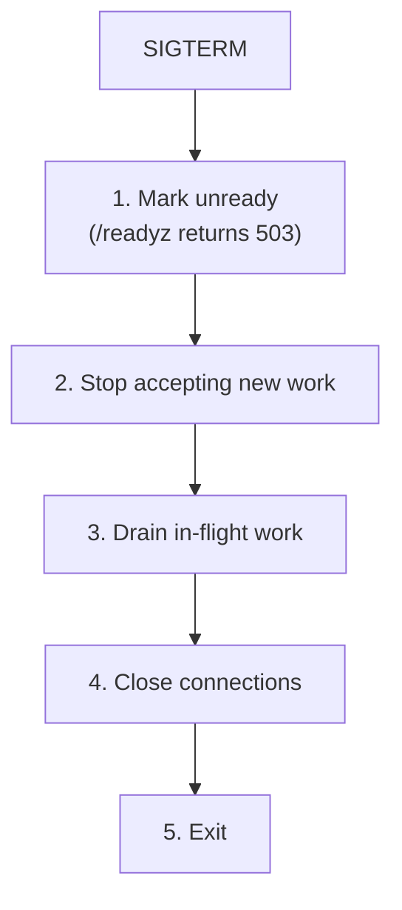

# Lifecycle: Health, Readiness, Graceful Shutdown

**Purpose.** The three probe endpoints (`/healthz`, `/readyz`, `/startup`), the graceful shutdown sequence, and the rule that liveness must NOT depend on Postgres.

**Reader's prerequisites.** Read `../../architecture.md` (section "Health, Readiness, and Graceful Shutdown" — canonical for this domain). Configuration knobs live in [configuration.md](configuration.md).

## Three probes, three answers

A Kubernetes deployment expects three probes. Each answers a different question:

| Probe | Question it answers | Used by | Failure consequence |
|---|---|---|---|
| `/healthz` | Is the process alive and not deadlocked? | Kubernetes liveness | Restart the container. |
| `/readyz` | Is the service ready to take traffic? | Kubernetes readiness, internal MLLP listener gate, load balancer | Stop routing traffic to this pod. |
| `/startup` | Has initial startup completed? | Kubernetes startup probe | Hold off liveness/readiness checks until startup completes. |

All three are unauthenticated HTTP `GET` endpoints. Responses are small JSON bodies; the HTTP status code carries the result.

By default they share the main HTTP listener bind. For Kubernetes deployments the recommended pattern is to expose them on a separate operations port via `server.http.probe_bind` so they are reachable without needing the main listener's TLS posture.

The endpoints are **not** in the FHIR Subscriptions spec; they are operational endpoints. They live alongside `/metadata` but are not advertised in the `CapabilityStatement`.

## `/healthz` — liveness

Indicates the process is running and not deadlocked. Always returns `200 OK` with body `{"status":"ok"}` once the HTTP server has started, regardless of dependency state.

**Liveness must not depend on Postgres.** A brief DB outage should not cause a container restart loop — the probe must not punish the service for an outage it cannot fix. The right response to a DB outage is to retry connections from `/readyz` and let the orchestrator stop routing traffic; restarting the container does nothing to bring Postgres back.

The only conditions that cause `/healthz` to return non-200:

- `503 Service Unavailable` if shutdown is in progress (the lifecycle sequencer flips an in-memory flag — see "Graceful shutdown" below).
- `503 Service Unavailable` on internal panic / deadlock-detection signal (e.g., the runtime's deadlock detector has fired).

In every other case — DB unreachable, EHR unreachable, channel module misbehaving — `/healthz` stays `200`.

## `/readyz` — readiness

Indicates the service is ready to accept work. Used by Kubernetes to decide whether to route traffic to this pod, and used internally by the [MLLP Listener](mllp-listener.md) to decide whether to accept new MLLP connections.

Returns `200 OK` only when **all** of:

- the Postgres connection pool can serve a query (`SELECT 1` within `lifecycle.postgres_probe_timeout`, default 2s);
- the configured EHR adapter has completed `on_start` successfully;
- the MLLP listener (if enabled) is bound to its configured port;
- the configured channel modules have completed `start` successfully;
- the service is not in the middle of graceful shutdown.

Returns `503 Service Unavailable` with a JSON body listing which checks failed:

```json
{"status":"unready","failed":["postgres","mllp_listener"]}
```

Subscribers querying the [Subscriptions API](subscriptions-api.md) see the same 503 from the load balancer until readiness returns.

The Postgres probe runs on a tight cadence (every 2s) with the configured timeout. If Postgres flickers, readiness flickers; the orchestrator handles routing. The probe does not retry the failed query — that would mask transient outages from the orchestrator.

## `/startup` — startup probe

Same checks as `/readyz` but with a longer Kubernetes grace-period budget. Used as a Kubernetes `startupProbe` so the service has time to:

- run schema migrations (the first install of a release can take longer than steady-state startup);
- load the topic catalog (built-in + adapter-contributed + operator-supplied);
- complete adapter `on_start` (which may include an initial FHIR scan to seed `adapter_state`);
- bind all MLLP listener endpoints;
- start every configured channel module (some channels open persistent connections — Kafka, the WebSocket pool — that take time).

Returns `200 OK` once the service has fully initialized; `503` otherwise. Once the startup probe succeeds, Kubernetes hands off to liveness/readiness. The service ignores liveness failures during startup.

## Graceful shutdown

On `SIGTERM` the service exits in this strict order. The architecture is canonical; the HLD restates the sequence so the cross-domain dependencies are clear.



### Step 1 — mark unready

`/readyz` flips to `503` immediately. The orchestrator sees it within one probe interval and stops routing new traffic. The MLLP listener sees the readiness flip and stops accepting new MLLP TCP connections; existing connections keep their slot.

### Step 2 — stop accepting new work

- The [Subscriptions API](subscriptions-api.md) stops accepting `POST` / `PUT` / `DELETE` on `Subscription` (returns `503`); read endpoints continue to serve so subscribers can still query `$status` and `$events`.
- The MLLP listener stops accepting new TCP connections. Existing connections drain.
- Stage workers stop claiming new rows from their input tables (no new `SELECT FOR UPDATE SKIP LOCKED` calls).

### Step 3 — drain in-flight work

Bounded by `lifecycle.shutdown_grace_period` (default 30s):

- In-flight HL7 messages on the wire are read to completion and ACKed. **No NACKs during drain** — that would force the EHR's interface engine to retry into a service that's exiting.
- In-flight HL7 Message Processor / FHIR Scan Runner / Vendor API Client work commits its current row (one row of `resource_changes` is the unit of work; the worker finishes the row's transaction, then stops claiming).
- In-flight `deliveries` complete their HTTPS POST / WSS frame / SMTP submit and update their row status. Mid-attempt deliveries that don't complete in time are left as `pending` (the next process incarnation re-claims them on startup).
- Held cancel-and-replace pairs are flushed to durable state in the pending table. Held pairs survive restart by design (see [ehr-adapter.md](ehr-adapter.md#cancel-and-replace-as-a-first-class-adapter-concern)).

### Step 4 — close connections

- Postgres connections drain via the pool's close timeout.
- WebSocket subscribers receive a normal close frame. The spec covers reconnect on the subscriber side.
- Long-lived vendor change-feed connections close gracefully (the [Vendor API Client](ehr-adapter.md#vendor-api-client) base class handles this).

### Step 5 — exit

Process terminates.

If the grace period expires before drain completes, the service force-exits. Any uncommitted work is recovered by the next incarnation from the durable input tables — the at-least-once guarantee is preserved.

## Dependencies between domains during startup and shutdown

Startup order:

1. **Configuration loaded and validated.** Failure here aborts startup with a structured error pointing at the offending field.
2. **Postgres connection pool created.** Schema migrations run. Failure leaves `/startup` returning `503`.
3. **Topic catalog loaded.** Failure of an individual topic does not abort startup; the topic is logged and counted in a metric.
4. **Adapter `on_start`.** Failure aborts startup.
5. **Channel modules `start`.** Each channel's failure aborts startup.
6. **MLLP listener binds.** Failure aborts startup.
7. **HTTP server starts** on the API listener and the probe listener.
8. `/startup` returns `200`. The service is now fully ready.

Shutdown order is the reverse, with the additional drain step.

## Configuration knobs

Owned by the [configuration](configuration.md) domain:

- `server.http.probe_bind` — share the main listener (default) or expose probes on a separate port.
- `lifecycle.shutdown_grace_period` — max time to drain in-flight work on SIGTERM. Default 30s.
- `lifecycle.postgres_probe_timeout` — readiness `SELECT 1` budget. Default 2s.

Operators tune `shutdown_grace_period` based on their typical in-flight delivery time. A deployment with slow downstream subscribers (long HTTPS POST timeouts) needs a longer grace period to drain cleanly.

## What this domain does NOT do

- **It does not own the readiness logic of any specific component.** Each component (the listener, the adapter, each channel module) registers its own readiness check with this domain. The lifecycle module runs them and aggregates.
- **It does not own retries.** Once the service is shutting down, retries are not the lifecycle's job; the [Subscriptions Engine](subscriptions-engine.md) and channels handle retry semantics for their respective in-flight work.
- **It does not appear in the `CapabilityStatement`.** Probes are operational, not part of the FHIR Subscriptions surface.
- **It does not block on subscriber acknowledgement** during shutdown beyond the grace period. Confirmed deliveries are committed; in-flight ones revert to `pending` for the next incarnation.
