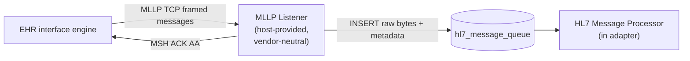

# MLLP Listener

**Purpose.** The vendor-neutral host-provided component that accepts MLLP/TCP connections from EHR interface engines, frames messages, persists raw bytes to `hl7_message_queue`, and ACKs the EHR. Does no parsing, no translation, no routing. The durability boundary of the EHR side.

**Reader's prerequisites.** Read `../../architecture.md` (sections "EHR side: MLLP Listener" and "Backpressure and overload behavior"). The decision on why this is host-provided rather than per-adapter is recorded in [decisions/0003-mllp-listener-vendor-neutral.md](../decisions/0003-mllp-listener-vendor-neutral.md).

## Where it sits



The listener is the **only** vendor-neutral EHR-facing component. Everything else on the EHR side is in the adapter — including the parsing of HL7 messages the listener wrote.

## Why vendor-neutral

The decision to keep the MLLP listener out of the adapter is recorded in [decisions/0003-mllp-listener-vendor-neutral.md](../decisions/0003-mllp-listener-vendor-neutral.md). Two reasons:

- **HL7 v2 MLLP framing is a vendor-independent standard.** Receive, frame, persist, and ACK are the same code regardless of which EHR is sending.
- **The cost of putting it in each adapter is high.** Every adapter would have to re-implement the listener, the persistence-then-ACK durability invariant, the multi-endpoint configuration, and the backpressure model. Bugs would be per-adapter.

The listener does the minimum a generic MLLP receiver needs to do. Anything HL7-content-aware lives in the adapter's HL7 Message Processor.

## Multiple listener endpoints per deployment

Most facility interface engines open a separate MLLP connection per HL7 message type — one for ADT, one for ORM, one for ORU, one for SIU, one for MDM. The listener is configured with one or more **listener endpoints**, each defined by `{name, bind, port, allowed_message_types?}`.

```yaml
# Excerpt from the configuration domain — see ../../architecture.md
mllp_listener:
  endpoints:
    - name: adt-feed
      bind: "0.0.0.0:2575"
      tls: false
      allowed_message_types: ["ADT"]
    - name: lab-results
      bind: "0.0.0.0:2576"
      tls: false
      allowed_message_types: ["ORU"]
    - name: orders
      bind: "0.0.0.0:2577"
      tls: false
      allowed_message_types: ["ORM", "OMG"]
```

**Why this lives at the top level, not under `adapter.config`.** The MLLP listener is host-provided and vendor-neutral (see [decisions/0003](../decisions/0003-mllp-listener-vendor-neutral.md)). Its configuration belongs at the same level as `server.http` and `lifecycle`, not nested inside the per-vendor adapter config.

All endpoints write into the same `hl7_message_queue` table. There is no need for one table per connection — the source endpoint is recorded as metadata on the row.

The optional `allowed_message_types` is a defensive filter: messages whose `MSH-9` does not match the allowlist are NACKed (not silently dropped). The listener does the minimum parsing needed to read `MSH-9` for this filter. If `allowed_message_types` is unset, all message types are accepted.

## Per-message metadata captured

In addition to the raw message body, every queue row carries:

- `received_at` — server-side timestamp of when the bytes arrived.
- `listener_endpoint` — the configured endpoint that accepted the connection (`adt-feed`, `lab-results`, ...).
- `peer_addr` — source IP/port of the EHR's interface engine.
- `mllp_message_id` — `MSH-10` message control ID, parsed only enough to capture this single field. The listener does not parse the rest of the message.
- `correlation_id` — generated server-side; flows through `resource_changes` and `ehr_events` for end-to-end tracing.
- `processed` — boolean flag flipped by the HL7 Message Processor when it has consumed the row.

This is enough for audit, debugging, trace correlation, and per-feed metrics without the listener having any vendor knowledge.

## Persistence-then-ACK durability

The durability invariant the listener enforces:

1. Receive an MLLP-framed message into memory.
2. `INSERT INTO hl7_message_queue` with the raw bytes plus metadata. Commit.
3. Send an MSH `ACK^...^AA` (Application Accept) back to the EHR.

Once step 2 commits, the message is durable. Step 3 confirms receipt to the EHR's interface engine, which then advances its outbound queue.

If step 2 fails (DB outage, integrity error, write timeout), the listener does NOT ACK. It either:

- **NACKs** the message — sends `ACK^...^AE` (Application Error) so the EHR's interface engine holds and re-sends; or
- **drops the connection** — closes the TCP socket without ACKing, which the EHR's interface engine treats as "still un-ACKed" and re-establishes the connection.

Either is acceptable per the HL7 v2 protocol, which already guarantees this re-send behavior on the EHR side. The listener's policy on which to use under load is configurable; the default is NACK first, drop on a sustained DB-write failure.

The architecture's words: "Once ACKed, the message will not be lost. If the listener falls behind, it can NACK or drop the connection; the EHR holds and re-sends."

## Backpressure and overload

The listener does the minimum work per message: receive, write the raw bytes, ACK. Nothing else happens on the receive path — no parsing, no FHIR translation, no filtering. This is near impossible to outrun from any reasonable EHR running on a decently sized node, because the cost per message is one row insert.

If the listener does fall behind:

- it has a configurable inflight cap per connection;
- once the cap is hit, new messages on that connection are NACKed until the cap clears;
- if the DB write itself stalls (pool exhaustion, slow disk), the listener NACKs all incoming messages until the write path recovers;
- if the listener is being stopped (graceful shutdown), it stops accepting new TCP connections; existing connections drain (read in-flight messages to completion and ACK them) within the shutdown grace period.

Downstream stages (the HL7 Message Processor in the adapter, the engine, the channels) are allowed to lag. End-to-end notification latency is best-effort per the FHIR Subscriptions spec; subscribers that need to catch up use `$events`. The durability boundary is at the listener: once the row is committed and ACKed, the message will not be lost.

## What the listener does NOT parse

The listener parses **only the framing** plus enough of `MSH` to read `MSH-9` (for the optional `allowed_message_types` filter) and `MSH-10` (for `mllp_message_id`). Everything else — segments, fields, components, Z-segments, message structure — is opaque bytes the listener neither inspects nor validates.

The HL7 v2 framing per the [MLLP transport spec](https://www.hl7.org/documentcenter/public/wg/inm/mllp_transport_specification.PDF):

- Start byte: `0x0B` (`<VT>`).
- End bytes: `0x1C 0x0D` (`<FS><CR>`).
- Body: the raw HL7 v2 message, segments separated by `<CR>` (`0x0D`).

The listener reads bytes, frames on these markers, and writes the inter-marker body verbatim to the queue. It does not normalize line endings, strip trailing whitespace, or mutate the body in any way. The HL7 Message Processor in the adapter receives bytes-equivalent-to-wire.

## TLS

MLLP can run plain or over TLS. Per the configuration:

```yaml
hl7v2:
  listeners:
    - name: lab-results
      bind: 0.0.0.0
      port: 2576
      tls: false           # plain MLLP — typical on a trusted facility LAN
    - name: external-orders
      bind: 0.0.0.0
      port: 2596
      tls: true
      cert_file: /etc/fhir-subs/mllp-ext.crt
      key_file: /etc/fhir-subs/mllp-ext.key
```

Plain MLLP is the typical configuration on a trusted facility LAN. TLS-MLLP is required when the link crosses a network the operator does not trust — most cloud-VPN deployments include it. The deployment opts in per endpoint.

## Health and readiness

The listener registers a readiness check with the [lifecycle](lifecycle.md) module: each configured listener endpoint must be bound to its port for the service to be ready. A bind failure on any endpoint causes `/readyz` to return 503; the listener attempts to rebind on a backoff.

During graceful shutdown the listener:

1. stops accepting new TCP connections immediately when readiness goes to "draining";
2. drains existing connections — reads in-flight messages to completion and ACKs them (no NACKs during drain so the EHR doesn't retry into a service that's exiting);
3. closes the listener sockets;
4. reports done to the lifecycle sequencer.

## What this domain does NOT do

- **It does not parse HL7.** The HL7 Message Processor in the adapter does. The listener reads `MSH-9` and `MSH-10` and writes the rest as opaque bytes.
- **It does not translate to FHIR.** That is the adapter's job.
- **It does not route.** All endpoints write to the same `hl7_message_queue`. Routing is `listener_endpoint` metadata that downstream code can use; it is not the listener's job to enforce.
- **It does not know which vendor sent the message.** Vendor knowledge lives in the [adapter](ehr-adapter.md), not here.
- **It does not own non-HL7 EHR I/O.** FHIR REST polling, vendor APIs, and vendor change feeds are owned by the [adapter's sub-components](ehr-adapter.md).
- **It is not extensible per-adapter.** It is the same code regardless of which adapter is loaded. Per-adapter HL7 behavior lives in the HL7 Message Processor.
