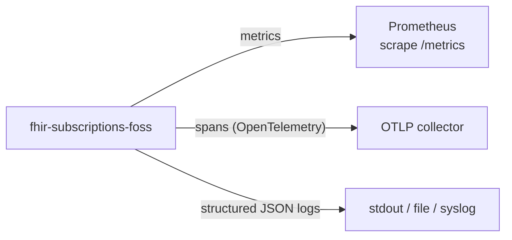

# Observability

**Purpose.** Metrics, traces, and structured logs. The signals operators rely on to know whether the bridge is working and where time is being spent.

**Reader's prerequisites.** Read `../../architecture.md` (section "Observability"). Configuration knobs live in [configuration.md](configuration.md).

## Three signals

- **Metrics** — Prometheus exposition format. Long-term operational dashboards, alerts, capacity planning.
- **Tracing** — OpenTelemetry over OTLP. Per-event end-to-end traces from EHR ingest to subscriber webhook response.
- **Logs** — structured JSON. Per-line correlation IDs so logs can be cross-referenced with metrics and traces.

All three signals carry the same `correlation_id` per event so a single EHR change can be traced from `hl7_message_queue` row through delivery on the subscriber's wire.

## Metrics

Prometheus exposition on the configurable bind (`observability.metrics.bind`, default `0.0.0.0:9090`, path `/metrics`). The `/metrics` endpoint is unauthenticated — operators control access at the network layer. The architecture lists what must be measured. The HLD-relevant metric names follow standard Prometheus conventions (snake_case, suffix-by-unit).

### Pipeline volume

| Metric | Type | Labels | Notes |
|---|---|---|---|
| `fhir_subs_hl7_messages_received_total` | Counter | `listener_endpoint`, `peer_addr` | Bytes-on-the-wire arrival count. |
| `fhir_subs_hl7_messages_acked_total` | Counter | `listener_endpoint`, `outcome` (`aa`, `ae`, `dropped`) | The split between accept, NACK, and drop. |
| `fhir_subs_resource_changes_total` | Counter | `adapter_id`, `change_kind`, `resource_type` | Stage 1 output. |
| `fhir_subs_ehr_events_total` | Counter | `topic_url`, `change_kind` | Stage 2 output (matched events). |
| `fhir_subs_deliveries_total` | Counter | `topic_url`, `channel_type`, `payload_type` | Stage 3 output. |
| `fhir_subs_dead_letters_total` | Counter | `source` (`hl7_translation`, `delivery`), `reason` | Drops from any failure path. |

### Latency

| Metric | Type | Labels | Notes |
|---|---|---|---|
| `fhir_subs_stage_duration_seconds` | Histogram | `stage` (`translate`, `topic_match`, `fanout`, `build`, `send`) | Per-stage processing time. |
| `fhir_subs_end_to_end_latency_seconds` | Histogram | `topic_url`, `channel_type` | EHR-arrival to subscriber-confirmed-delivery. |
| `fhir_subs_hydration_duration_seconds` | Histogram | `adapter_id`, `resource_type`, `cache_outcome` (`hit`, `miss`) | Stage 4 hydration calls. |
| `fhir_subs_topic_match_duration_seconds` | Histogram | `topic_url` | Per-topic evaluation time; helps spot expensive FHIRPath. |

### Delivery health

| Metric | Type | Labels | Notes |
|---|---|---|---|
| `fhir_subs_delivery_attempts_total` | Counter | `channel_type`, `outcome` (`delivered`, `transient`, `permanent`) | Per attempt, not per delivery. |
| `fhir_subs_delivery_retries_total` | Counter | `channel_type` | Increments on each retry attempt after the first. |
| `fhir_subs_subscription_status` | Gauge | `subscription_id`, `status` | Current subscription state. |
| `fhir_subs_active_subscriptions` | Gauge | `topic_url`, `channel_type` | Snapshot of active subscriptions. |
| `fhir_subs_heartbeat_lag_seconds` | Gauge | `subscription_id` | Time since last heartbeat or event sent. Helps spot subscriptions where the heartbeat has stalled. |

### Adapter and EHR-side

| Metric | Type | Labels | Notes |
|---|---|---|---|
| `fhir_subs_adapter_state_size` | Gauge | `adapter_id` | Approximate row count. |
| `fhir_subs_fhir_scan_duration_seconds` | Histogram | `adapter_id`, `resource_type` | One scan target's wall-clock cost. |
| `fhir_subs_fhir_scan_resources_seen_total` | Counter | `adapter_id`, `resource_type` | Resources visited during scans. |
| `fhir_subs_fhir_scan_deltas_total` | Counter | `adapter_id`, `resource_type`, `change_kind` | Scan-emitted resource_changes. |
| `fhir_subs_vendor_change_feed_lag_seconds` | Gauge | `adapter_id` | Distance behind the vendor's cursor. |
| `fhir_subs_cancel_replace_pending` | Gauge | `adapter_id`, `resource_type` | Currently held cancel-and-replace pairs. Should rarely be > 0 for long. |

### Process / DB / runtime

| Metric | Type | Notes |
|---|---|---|
| `fhir_subs_db_pool_in_use` | Gauge | DB pool saturation. |
| `fhir_subs_db_query_duration_seconds` | Histogram (per query name) | Spot slow queries. |
| `fhir_subs_topic_evaluation_errors_total` | Counter (label `topic_url`) | Catches FHIRPath timeouts and expression errors. |
| `fhir_subs_config_reload_total` | Counter (label `outcome`) | Hot-reload tracking. |
| Standard process metrics (`process_cpu_seconds_total`, `process_resident_memory_bytes`, etc.) | Counter / Gauge | From the runtime exporter. |

The architecture lists "events ingested, events fanned out, deliveries by status, retry counts, dead-letter count, end-to-end event-to-delivery latency, heartbeat lag, DB pool saturation, adapter-specific metrics emitted via the SPI" — every one of those is covered above. Adapter-specific metrics are emitted via the host-injected `MetricsEmitter` ([Adapter SPI](../contracts/adapter-spi.md)) and use the `fhir_subs_adapter_<id>_*` namespace by convention.

## Tracing

OpenTelemetry over OTLP to the operator's collector (`observability.tracing.otlp_endpoint`). Sampling is head-based by default at the configured `sample_rate` (default 0.1); operators configuring tail-based sampling at the collector can keep `sample_rate = 1.0` and let the collector drop.

A single trace spans:

- `mllp.receive` (or `fhir_scan.tick` / `vendor_feed.event`) — root span on the EHR-side ingest path.
- `adapter.translate` — Stage 1.
- `topic.match` — Stage 2.
- `engine.fanout` — Stage 3.
- `engine.build` — Stage 4. Contains child spans for each `hydration.fetch`.
- `channel.deliver` — Stage 5. Contains the outbound HTTPS POST / WSS frame / SMTP submit as a child span.

The `correlation_id` flows as a span attribute from the listener through to the channel module so a trace and a log line and a dead-letter row can all be cross-referenced.

The architecture's words: "a single trace spans adapter ingest → fanout → delivery, so an operator can follow one EHR change all the way to the subscriber's webhook response."

## Structured logs

JSON, one event per line. Default sink is stdout (Kubernetes-friendly); other sinks are file and syslog (`observability.audit_log.sink` for the separate audit channel).

Every log line carries:

- `ts` — RFC 3339 timestamp.
- `level` — `debug`, `info`, `warn`, `error`.
- `component` — the named module (`mllp_listener`, `adapter.epic.hl7_processor`, `topic_matcher`, `engine.fanout`, `channels.rest_hook`, ...).
- `correlation_id` — the per-event tracer.
- `subscription_id` (when applicable).
- `topic_url` (when applicable).
- `event_number` (when applicable).
- `msg` — the human-readable description.
- Additional event-specific fields.

Logs are NOT a substitute for metrics. High-cardinality data (per-event details) goes into traces; logs are for events that need a narrative thread (subscription state transitions, configuration reloads, dead-letter routing, panic recovery, fatal errors).

PHI handling:

- Logs at `info` and above MUST NOT contain FHIR resource bodies or HL7 message bodies.
- Resource references (`Patient/123`) are permitted; payloads are not.
- The `debug` level may log payloads under a deployment-specific opt-in (`log_level: debug` plus `debug_log_payloads: true`); by default debug payloads are also redacted.

## Audit log

The `audit_log` is a separate channel from the operational logs above. The architecture commits to "every subscription create/update/delete, every successful delivery, every authorization decision is recorded in an append-only audit log." This is implemented as:

- An append-only Postgres table (`audit_log`) — see [storage.md](storage.md).
- A configurable secondary sink (file, stdout, syslog, OTLP) so audit events can be forwarded to an external SIEM.

Audit retention default is 7 years (HIPAA-aligned). Operational log retention is owned by the operator's log infrastructure, not by this service.

## What goes where

| Question | Source |
|---|---|
| "How many notifications were delivered yesterday?" | Metrics — `fhir_subs_deliveries_total` time series. |
| "Why did this specific delivery fail?" | Trace + structured log filtered by `correlation_id`. |
| "What is the end-to-end p99 latency?" | Metrics — `fhir_subs_end_to_end_latency_seconds` histogram. |
| "Did subscriber X create a subscription on date Y?" | `audit_log` query. |
| "Why are HL7 messages being NACKed?" | Metrics (`fhir_subs_hl7_messages_acked_total{outcome="ae"}`) plus structured logs at `warn`. |
| "Is the Topic Matcher falling behind?" | `fhir_subs_stage_duration_seconds{stage="topic_match"}` and `fhir_subs_resource_changes_total` rate vs. `fhir_subs_ehr_events_total` rate. |
| "Which topic has the most expensive FHIRPath?" | `fhir_subs_topic_match_duration_seconds` by `topic_url`. |
| "Has hydration become slow?" | `fhir_subs_hydration_duration_seconds` and `fhir_subs_hydration_duration_seconds{cache_outcome="miss"}` rate. |

## What this domain does NOT do

- **It does not own audit-policy decisions.** Each domain decides what is auditable; this domain provides the channel.
- **It does not implement alerting or SLOs.** Operators write Prometheus alerts against the exposed metrics. The project ships an example `PrometheusRule` set as documentation, not as an enforced default.
- **It does not own the audit-log retention** beyond storing what the [storage](storage.md) domain configures.
- **It does not act as a log aggregator.** The service emits to stdout / file / syslog / OTLP; aggregation is the operator's log infra.
