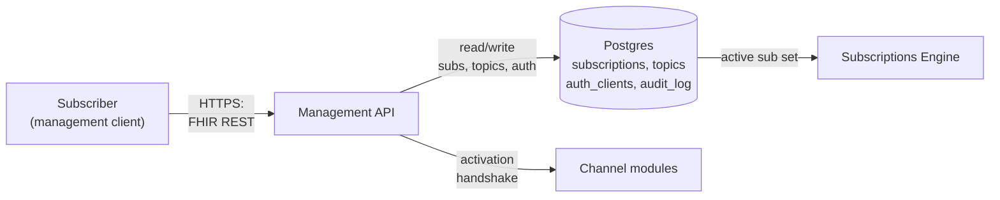

# Subscriptions API (Management Surface)

**Purpose.** The subscriber-facing HTTP/WSS surface. Subscribers manage `Subscription` resources, read `SubscriptionTopic` resources, query `$status` and `$events`, obtain a WebSocket binding token, and read the `CapabilityStatement`. Authentication and authorization for every subscriber call live here.

**Reader's prerequisites.** Read [../overview.md](../overview.md) and `../../architecture.md` (sections "Subscriptions side", "Other Spec Requirements", "Auth"). The wire-format details live in [../contracts/subscriber-api.md](../contracts/subscriber-api.md); this document covers the domain — what the API surface is responsible for, where it sits in the pipeline, and how it interacts with the engine and the channel modules.

## Where it sits

The Management API is the subscriber-side front door. It is the only component the subscriber's management client talks to. It does not produce notifications — that is the Subscriptions Engine's job — and it does not deliver them — that is the channel modules' job. It does, however, drive the **activation handshake** through the channel modules at subscription create time.

The API writes to `subscriptions`, `subscription_topics`, `auth_clients`, and `audit_log`. The engine reads from `subscriptions` and `subscription_topics`. The activation handshake is a side-effect of `POST /Subscription` succeeding: the API tells the relevant channel module to validate the subscriber endpoint, and the channel reports back; on success the subscription transitions to `active`, on failure it stays `requested` with an error.

## Endpoint surface

The API implements the FHIR REST contract at the resource level, plus the spec-defined operations.

### Resources exposed

- `Subscription` — full CRUD: `POST /Subscription`, `GET /Subscription/{id}`, `PUT /Subscription/{id}`, `DELETE /Subscription/{id}`, `GET /Subscription?...` for search.
- `SubscriptionTopic` — read-only to subscribers: `GET /SubscriptionTopic/{id}`, `GET /SubscriptionTopic?...`. Topics are configured by the operator and the adapter (see [topics.md](topics.md)); subscribers do not create them.
- `SubscriptionStatus` — never POSTed by subscribers. Returned inside `subscription-notification` Bundles and as the response to `$status`.
- `CapabilityStatement` — `GET /metadata`. Built dynamically. See "CapabilityStatement contents" below.

### Operations

The spec mandates three subscription-related operations:

- **`$status`** on `Subscription` — `GET /Subscription/{id}/$status`, `GET /Subscription/$status?id=...`. Returns a Bundle of `SubscriptionStatus` resources. See [`https://hl7.org/fhir/R5/operation-subscription-status.html`](https://hl7.org/fhir/R5/operation-subscription-status.html).
- **`$events`** on `Subscription` — `GET /Subscription/{id}/$events?eventsSinceNumber=N&eventsUntilNumber=M`. Returns a `subscription-notification` Bundle of `query-event` type containing past events (within retention). See [`https://hl7.org/fhir/R5/operation-subscription-events.html`](https://hl7.org/fhir/R5/operation-subscription-events.html).
- **`$get-ws-binding-token`** — issues a short-lived token a WebSocket subscriber uses to authenticate the WSS upgrade. See [`https://hl7.org/fhir/R5/operation-subscription-get-ws-binding-token.html`](https://hl7.org/fhir/R5/operation-subscription-get-ws-binding-token.html).

Standard CRUD plus these three operations is the entire subscriber-management surface. The full request/response wire shape lives in [../contracts/subscriber-api.md](../contracts/subscriber-api.md).

### Search parameters

Per `../../architecture.md`, the CapabilityStatement declares the spec-required search parameters and the storage layer indexes the columns that back them:

- `Subscription` — `url`, `status`, `type` (channel type), `payload`, `contact`, `criteria`, `topic` (R5).
- `SubscriptionTopic` — `url`, `status`, `version`, `name`, `title`, `date`, `derived-or-self`, `resource`, `trigger-description`.

See [`https://hl7.org/fhir/R5/subscription.html#search`](https://hl7.org/fhir/R5/subscription.html#search) and [`https://hl7.org/fhir/R5/subscriptiontopic.html#search`](https://hl7.org/fhir/R5/subscriptiontopic.html#search).

## FHIR REST contract

The API speaks the FHIR Subscriptions REST contract. Two specs are in scope:

- [FHIR R5 Subscriptions](https://hl7.org/fhir/R5/subscription.html) — the canonical, topic-based design. The internal model is R5-shaped.
- [Subscriptions R4 Backport IG](https://hl7.org/fhir/uv/subscriptions-backport/) (STU 1.1.0, 2023-01) — the topic-based design retrofitted onto R4 via extensions. **The primary subscriber-facing surface today**, because most production subscribers are R4.

A version-shim layer (`api/version-shim` in the architecture) translates the R5-shaped internal model to/from R4B Backport on the way out and on the way in. Subscribers negotiate version via standard FHIR `Accept` / `Content-Type` headers (e.g., `Accept: application/fhir+json; fhirVersion=4.0`); the API responds in the matching representation. R6 support is added once R6 publishes; the shim is the single place that change happens. See [decisions/0004-fhir-version-strategy.md](../decisions/0004-fhir-version-strategy.md).

## Authentication

**Authentication scheme is SMART on FHIR Backend Services and only SMART on FHIR Backend Services.** The user explicitly removed mTLS-only and OAuth client-credentials alternatives during architecture review. See the spec at [`https://hl7.org/fhir/smart-app-launch/backend-services.html`](https://hl7.org/fhir/smart-app-launch/backend-services.html).

How it works in this server:

- The server is a *resource server*, not an identity provider. It validates inbound JWT bearer tokens; it does not issue them.
- Tokens are validated against the configured trusted issuer set (`auth.trusted_issuers` in the configuration domain) using the issuer's published JWKS. The JWKS cache TTL is configurable.
- A built-in client registry (`auth.client_registry`, config-managed and SIGHUP-reloadable) maps each registered subscriber client's `client_id` to its public-key JWKS URL and its allowed scopes. Both the issuer-trust route and the registry route validate the same JWT — the registry is just a way to pin a particular client to a particular set of scopes without trusting an external IdP at large.
- TLS is required on the subscriber-facing listener. Plain HTTP is rejected.

## Authorization

Authorization is **scope-based** and **checked at two distinct points**:

- **At subscription create time.** The token's scopes must include the right to create the requested subscription. A token with `system/Observation.r` plus `system/Subscription.cu` may create a subscription whose topic and `filterBy` produce `Observation` payloads; a token without that resource scope is rejected with `403 Forbidden` and an `OperationOutcome`.
- **At delivery time.** Per the FHIR Subscriptions spec, the subscriber's authorization is re-checked when each notification is being prepared. If the subscriber's scopes have been narrowed or the client has been disabled, delivery stops even if the subscription itself is still `active`. The subscription transitions to `error` (or `off`, depending on policy) and the failure is recorded in `audit_log` and visible via `$status`.

Re-checking at delivery time is the spec's explicit requirement. It exists because `Subscription` resources can outlive the credentials that created them.

## CapabilityStatement contents

`GET /metadata` returns a dynamically built `CapabilityStatement` enumerating exactly what this deployment supports. The architecture doc lists what must be advertised; the API domain owns building the document at runtime from the loaded code and configuration:

- **Supported FHIR versions** — built from the version-shim's loaded versions (always R4B and R5; R6 added when published).
- **Supported `Subscription.channelType` codings** — each loaded channel module contributes a Coding via its [Channel SPI manifest](../contracts/channel-spi.md). Built-in channels contribute the spec's standard codings; custom channels contribute their own system + code per the spec's extensible binding on `channelType`. See [`https://hl7.org/fhir/R5/codesystem-subscription-channel-type.html`](https://hl7.org/fhir/R5/codesystem-subscription-channel-type.html).
- **Supported payload types per channel** — each channel declares which of `empty` / `id-only` / `full-resource` it accepts in its manifest. The CapabilityStatement reflects that.
- **Supported `SubscriptionTopic` URLs** — every `active` topic in the catalog (built-in, adapter-contributed, operator-supplied) is enumerated.
- **Supported operations** — `$status`, `$events`, `$get-ws-binding-token` plus standard CRUD.
- **Auth scheme** — `smart-on-fhir`.

The CapabilityStatement is therefore not a static document. It is a snapshot of what this running container can actually do.

## Error model

Errors follow standard FHIR REST conventions. Every error response is an `OperationOutcome` ([`https://hl7.org/fhir/R5/operationoutcome.html`](https://hl7.org/fhir/R5/operationoutcome.html)) with appropriate `severity` and `code` values and an HTTP status code matching the FHIR semantics.

Common cases:

| HTTP | When | OperationOutcome.issue.code |
|---|---|---|
| 400 | Malformed request body, invalid Subscription resource per the spec. | `invalid` / `structure` |
| 401 | Missing or invalid bearer token. | `security` / `login` |
| 403 | Token valid but scopes do not authorize the operation. | `forbidden` / `security` |
| 404 | Subscription / SubscriptionTopic with that id does not exist. | `not-found` |
| 409 | Conflict on update (version mismatch, concurrent modification). | `conflict` |
| 422 | Subscription is structurally valid but semantically rejected — for example, `maxCount > 1` on a channel whose [Channel SPI manifest](../contracts/channel-spi.md) declares `supportsBatching = false`, or a `filterBy` that names a parameter the topic's `canFilterBy` does not allow. | `business-rule` / `processing` |
| 429 | Rate-limited. | `throttled` |
| 500 | Internal error. Generic. | `exception` |
| 503 | Server is shutting down or readiness has failed. | `transient` |

`PUT /Subscription/{id}` always re-runs the same authorization checks as `POST`, plus a re-handshake when channel-affecting fields change. See "Subscription update semantics" in `../../architecture.md`.

## Version negotiation

The server stores subscriptions in the R5-shaped internal model and translates at the wire. Negotiation rules:

- The subscriber's request `Content-Type` selects the input version. `application/fhir+json; fhirVersion=4.0` is the default for R4B Backport; `application/fhir+json; fhirVersion=5.0` selects R5 native.
- The server's response `Content-Type` matches the subscriber's `Accept`. If the subscriber accepts both, the server prefers the version the subscription was created in; for the CapabilityStatement and other metadata the server defaults to R5.
- The negotiated version per subscription is recorded on the `subscriptions` row. Notifications for that subscription are emitted in that version regardless of what other subscribers receive.

The shim is bidirectional and lossless for the subset of fields used in the topic-based design — see [decisions/0004-fhir-version-strategy.md](../decisions/0004-fhir-version-strategy.md) for the reasoning and the current scope.

## Conformance testing

The HLD does not invent a new conformance suite. Two existing tools cover the contracts the API exposes:

- **Inferno** ([`https://inferno-framework.github.io/`](https://inferno-framework.github.io/)) — runs scenario-based suites against a FHIR server. Inferno includes Subscriptions test kits derived from the R4B Backport IG and the R5 spec. The deployment ships with a documented Inferno run-book in the project's CI.
- **Touchstone** ([`https://touchstone.aegis.net/touchstone/`](https://touchstone.aegis.net/touchstone/)) — interoperability test platform with Subscriptions test packages. Used as a secondary, broader conformance run.

Internally, the API has its own integration tests that drive `POST /Subscription`, `$status`, `$events`, `$get-ws-binding-token`, the activation handshake, the delivery-time scope re-check, and the version shim — but Inferno + Touchstone are the externally credible conformance bar.

## What this domain does NOT do

- **It does not match resource changes against topics.** That is the [Topic Matcher](topic-matcher.md) — Stage 2 of the pipeline.
- **It does not fan out events to subscriptions.** That is the [Subscriptions Engine](subscriptions-engine.md) — Stage 3.
- **It does not build notification Bundles.** The Notification Builder (also in the engine) does that — Stage 4.
- **It does not deliver notifications.** [Channel modules](channels.md) do — Stage 5.
- **It does not read from the EHR.** The [EHR Adapter](ehr-adapter.md) does, and only the adapter does.
- **It does not host the SubscriptionTopic catalog logic.** It exposes the catalog to subscribers via REST; the catalog itself is owned by [topics](topics.md) and configured at startup.
- **It does not act as a general-purpose FHIR server.** It does not expose `/Patient`, `/Observation`, `/Encounter`, etc. — only Subscription-domain resources. Subscribers wanting general FHIR data are pointed at the EHR's own FHIR endpoint.
