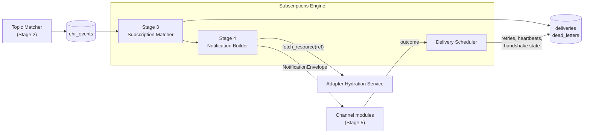

# Subscriptions Engine

**Purpose.** The brain of the subscriptions side. Owns Stages 3 (subscription fanout) and 4 (notification Bundle build) of the pipeline. Reads `ehr_events`, finds active subscriptions, applies each subscription's `filterBy`, re-checks authorization, builds the right Bundle for each subscription, and hands off to the channel module that will deliver it.

**Reader's prerequisites.** Read [../overview.md](../overview.md), `../../architecture.md` (sections "Pipeline from EHR change to subscriber notification" stages 3 and 4, "Notification Construction", "Other Spec Requirements"), and [topic-matcher.md](topic-matcher.md) (the Stage 2 producer of the rows this engine reads).

## Where it sits

The engine is generic. Nothing in it knows about Epic, HL7, or any specific FHIR profile. Its only dependency on the EHR is the synchronous `fetch_resource(ref)` callback into the adapter's [Hydration Service](ehr-adapter.md#hydration-service) when building a `full-resource` Bundle.

## Stage 3 — Subscription fanout

### Input

A row from `ehr_events`, as produced by the [Topic Matcher](topic-matcher.md):

- `event_number` — server-assigned monotonic sequence (this is what subscribers see in `eventsSinceSubscriptionStart`).
- `topic_url` — canonical URL of the matched topic (versioned).
- `change_kind` — `create` / `update` / `delete`.
- `focus` — FHIR reference to the changed resource.
- `resource` — post-translation FHIR resource body.
- `previous_resource` — prior version, if needed by `filterBy` previous-state semantics.
- `correlation_id` — propagates onto every `deliveries` row.
- `notification_shape_hint` — `_include` / `_revinclude` denormalized from the topic so Stage 4 doesn't reload the topic.

Rows are claimed with `SELECT FOR UPDATE SKIP LOCKED` so a worker that crashes mid-stage doesn't block another worker from picking up the row.

### What the Subscription Matcher does

For each `ehr_events` row:

1. **Look up active subscriptions on this topic.** Read `subscriptions` filtered by `status = 'active'` AND `topic_url = ehr_events.topic_url`. The query uses the `subscriptions(topic_id, status)` index.
2. **Apply `Subscription.filterBy`** for each candidate subscription. Each `filterBy` element is `{ resourceType, filterParameter, comparator, modifier, value }` per the spec ([`https://hl7.org/fhir/R5/subscription-definitions.html#Subscription.filterBy`](https://hl7.org/fhir/R5/subscription-definitions.html#Subscription.filterBy)). Filters use the same expression languages as `SubscriptionTopic.queryCriteria` — FHIR search-parameter expressions and FHIRPath. Evaluation is shared with the Topic Matcher (the `core/filter` module per `../../architecture.md`); see [topic-matcher.md](topic-matcher.md#matching-expression-languages) for the supported subset.
3. **Validate against the topic's `canFilterBy`.** This is enforced at subscription create time, not here — `filterBy` parameters that the topic does not allow are rejected with HTTP 422 long before they reach the engine. The engine assumes any stored `filterBy` is permitted by the topic.
4. **Re-check authorization.** The token scopes that authorized the subscription at create time are re-validated at delivery prep. A subscriber whose access has been revoked stops receiving payloads. This is the spec-mandated delivery-time scope check ([`https://hl7.org/fhir/R5/subscription.html#authorization`](https://hl7.org/fhir/R5/subscription.html#authorization)). If authorization fails, the matcher does NOT write a `deliveries` row; it transitions the subscription to `error` (or `off`, per policy) and writes an `audit_log` entry.
5. **Write one `deliveries` row per matching subscription** with `status = 'pending'`. The transaction also marks the source `ehr_events` row claimed.

**Zero-match case.** If steps 1–4 yield no matching subscriptions, the engine still marks the `ehr_events` row processed in the same transaction (no `deliveries` rows are written). The transactional invariant is "every `ehr_events` row leaves the engine either marked processed with N delivery rows committed (N ≥ 0) or untouched" — never partially advanced. This is identical to the [Topic Matcher's transactional invariant](topic-matcher.md) on `resource_changes` rows that match no topics.

### Output

Zero or more `deliveries` rows. The spec invariant `eventsSinceSubscriptionStart` is monotonic per subscription — the engine assigns delivery rows in `event_number` order per subscription so the subscriber sees them in order. See [contracts/internal-tables.md](../contracts/internal-tables.md#deliveries) for the row shape.

### Per-subscription delivery cursor

Each subscription has a delivery cursor: the highest `event_number` it has been notified about. The cursor is stored on the `subscriptions` row as `eventsSinceSubscriptionStart`. The engine advances the cursor only when a delivery is acknowledged as `delivered` by the channel module — not when the row is created and not when a retry begins.

`$status` returns this cursor unchanged. `$events` (Stage-4 historical replay) reads the durable `ehr_events` log within retention, filters by topic and `filterBy` exactly as live events do, and serves the result. The cursor is what subscribers compare against to detect missed events ("the server says I'm at 142, my last received notification was 138 — I've missed four events; let me call `$events?eventsSinceNumber=138`").

## Stage 4 — Notification Builder

The builder turns `deliveries` rows into `subscription-notification` Bundles, one per subscription. Construction differs by `(notification type, payload type, topic shape, batching state)` — see `../../architecture.md` "Notification Construction" for the canonical breakdown. The HLD-relevant points:

### Bundle shape

Every notification — handshake, heartbeat, event-notification, query-status, query-event — is a `Bundle` of `type = subscription-notification`. The first entry is always a `SubscriptionStatus` resource. Subsequent entries carry the event payload (or are absent for `empty` payloads). The full wire shape lives in [contracts/notification-bundle.md](../contracts/notification-bundle.md).

### Five notification types, one builder

| Type | When sent | Increments `eventsSinceSubscriptionStart`? | Carries event payload? |
|---|---|---|---|
| `handshake` | At activation. Driven by the Management API on `POST /Subscription`. | No | No |
| `heartbeat` | At `Subscription.heartbeatPeriod` cadence when no events have been sent. Owned by the delivery scheduler. | No | No |
| `event-notification` | On matching events. The primary path. | **Yes** | Yes (per `Subscription.content`) |
| `query-status` | Server response to `GET /Subscription/{id}/$status`. | No | No |
| `query-event` | Server response to `GET /Subscription/{id}/$events?...`. | No | Yes (replayed from `ehr_events`) |

The builder is a single module that picks the right path per `(notification type, payload type, topic shape, batching state)`. The architecture doc table is the canonical breakdown.

### Payload types

`Subscription.content` controls what goes into the Bundle alongside `SubscriptionStatus`. Per the [Subscription resource](https://hl7.org/fhir/R5/subscription.html):

- **`empty`** — Bundle has only the `SubscriptionStatus`. `notificationEvent[i].focus` is absent. Zero hydration. The cheapest path.
- **`id-only`** — Bundle has the `SubscriptionStatus` whose `notificationEvent[i].focus` references the matching resource (e.g., `ServiceRequest/abc-123`); no resource bodies. Minimal hydration.
- **`full-resource`** — Bundle has the `SubscriptionStatus`, the focus resource, and any resources required by the topic's `notificationShape` (`_include` / `_revinclude`). Full hydration.

The builder calls the adapter's [Hydration Service](ehr-adapter.md#hydration-service) only for `full-resource` payloads. The hydration service caches recently-fetched resources for a short TTL so two subscriptions matching the same event do not cause two EHR fetches for the same Patient.

Per the spec, `full-resource` payloads warrant tighter authorization. That tightening is a deployment-policy decision (e.g., only registered clients with a specific scope set may create `full-resource` subscriptions); the engine enforces whatever the subscription create path accepted.

### Batching — `Subscription.maxCount`

`Subscription.maxCount` caps the number of **events** in a notification Bundle (not Bundle entries — included Patient and Practitioner resources do not count toward the cap). The default is 1 (one event per Bundle, no batching).

The delivery scheduler's batching state machine (see `../../architecture.md` "Batching" diagram):

- For each subscription with `maxCount > 1`, the scheduler keeps a per-subscription pending batch keyed by `subscription_id`. State lives in memory; each pending row also has `status = 'pending'` in `deliveries` so a crash recovers the partial batch.
- A batch flushes when **either** the batch has reached `maxCount` events **or** the batch age has reached `maxBatchWait` (configurable, default 30s). Without `maxBatchWait`, a low-traffic subscription would wait indefinitely for a second event.
- The flushed Bundle has one `SubscriptionStatus` and one `notificationEvent` entry per included event. `eventsSinceSubscriptionStart` reflects the highest event number in the batch.
- The Channel SPI declares `supportsBatching` on its manifest. Subscriptions that try to set `maxCount > 1` on a non-batching channel are rejected at create time with HTTP 422 (the API enforces this).

### Hydration

Hydration is a synchronous in-memory call from the builder to the adapter's Hydration Service. The adapter implements `fetch(reference) -> FhirResource`. The base class provides the LRU cache, request coalescing, rate-limit budgeting, and a hard timeout per fetch — see [Adapter SPI: HydrationService](../contracts/adapter-spi.md#hydrationservice). The engine treats hydration as the only synchronous in-process boundary into the EHR; everything else crosses through Postgres rows.

If hydration fails (timeout, network error, EHR rejection), the delivery is treated as a transient failure and re-attempted with backoff. The `deliveries` row stays `pending` and is retried per the delivery scheduler's retry policy.

## Delivery scheduler

The delivery scheduler is the third component of the engine. It owns:

- **Retry policy** — exponential backoff with jitter on transient failures. Defaults: initial 10s, max 1h, jitter 0.2, max 8 attempts (per `delivery.retry` in the configuration domain).
- **Backoff curve** — the spec leaves the curve to the deployment. The architecture doc's defaults are the project defaults; operators override.
- **Heartbeat scheduling** — per-subscription heartbeat timer at `Subscription.heartbeatPeriod`. Heartbeats are emitted only when no event-notification has been sent within the period. They keep the subscriber's TCP / WSS connection healthy and let polling subscribers see liveness via `$status`.
- **Handshake state machine** — the activation handshake is initiated by the Management API on `POST /Subscription`; the scheduler holds the state machine that records handshake outcome (succeeded → `active`, failed → `requested` with error). On `PUT /Subscription` that changes channel-affecting fields, the scheduler re-runs the handshake.
- **Per-subscription event cursor** — `eventsSinceSubscriptionStart`, advanced only on confirmed delivery.
- **Subscription status transitions** — `requested` → `active` on handshake success; `active` ↔ `error` on consecutive delivery failures; `active`/`error` → `off` on max-retries-exhausted, on revoked authorization, on subscriber `DELETE`. Every transition is persisted on the `subscriptions` row and is visible via `$status`.

#### Update semantics: drain before applying changes

`PUT /Subscription/{id}` is not a hot-swap. The scheduler classifies the change and applies it in a way that keeps in-flight work consistent with what the subscriber asked for at the time the work was scheduled.

- **Channel-affecting fields** (`endpoint`, `header`, `channelType`, auth metadata): a re-handshake is required before any further notifications are sent over the new endpoint. Heartbeats and event-notifications pause until the new handshake succeeds.
- **`filterBy` or `topic` change**: the change must not be applied mid-batch — that would mean a partially-built notification mixes events that match different filter sets. The scheduler **drains the in-flight batch first**:
  1. Stop adding new matched `ehr_events` rows to this subscription's pending batch.
  2. Flush any partially-built batch on the regular flush path (delivered with the *old* `filterBy`/`topic`), or, if `maxCount = 1`, complete the in-flight delivery.
  3. Apply the new `filterBy`/`topic` to the subscription row.
  4. Subsequent `ehr_events` are evaluated against the new filter / topic.

  This means for a brief window an updating subscriber may still receive one final notification under the old criteria; this is the correct behavior — those events were already matched and queued under the contract that was in effect when they were matched.
- **`heartbeatPeriod`, `timeout`, `maxCount`, `content`**: take effect on the next notification scheduling round. No drain, no re-handshake.

The drain is bounded — partially-built batches have a `maxBatchWait` ceiling already, so the longest the apply can wait is the configured batch-wait window. If the engine is unable to drain within a longer threshold (default 60s), the change is applied anyway and the in-flight batch is dropped on the floor (a metric is emitted; this is expected to be exceedingly rare).

### Failure semantics

Per the spec ([`https://hl7.org/fhir/R5/subscription.html#error`](https://hl7.org/fhir/R5/subscription.html#error)):

- After consecutive failures, the subscription transitions to `error`. The server keeps retrying with backoff.
- After max retries are exhausted, the subscription transitions to `off` and stops delivering. The notification is dead-lettered.
- The latest error message is recorded on the `subscriptions` row and is returned in `SubscriptionStatus.error` from `$status`.
- Dead-lettered notifications are retained per `storage.retention.dead_letters` for diagnostics.

### Idempotency and ordering

- **Outbound idempotency.** Each `(subscription_id, eventNumber)` is a unique key on `deliveries`. Retries do not produce duplicate rows; the same row is updated.
- **Per-subscription ordering.** Events are delivered in `event_number` order per subscription. There is no global cross-subscription ordering guarantee — two subscriptions on the same event run independent build/send paths.

## Per-subscription cursor and `$events`

`eventsSinceSubscriptionStart` is the spec-defined event counter ([`https://hl7.org/fhir/R5/subscriptionstatus-definitions.html#SubscriptionStatus.eventsSinceSubscriptionStart`](https://hl7.org/fhir/R5/subscriptionstatus-definitions.html#SubscriptionStatus.eventsSinceSubscriptionStart)). It is monotonic per subscription. The engine writes it on every `deliveries` row and exposes it in:

- Each notification Bundle's `SubscriptionStatus.eventsSinceSubscriptionStart`.
- The `$status` response.
- The `$events` response, which replays past events from `ehr_events` filtered exactly as live events would be — the same `filterBy` evaluation, the same `notificationShape`, the same payload-type rules. `$events` is the spec-blessed catch-up mechanism. Retention of `ehr_events` is configurable (default 30 days); shorter retention narrows the catch-up window.

The `query-event` notification type is the Bundle shape `$events` returns.

## What this domain does NOT do

- **It does not match resource changes against topics.** That is the [Topic Matcher](topic-matcher.md) — Stage 2.
- **It does not deliver notifications over the wire.** [Channel modules](channels.md) do — Stage 5.
- **It does not parse, translate, or read from the EHR.** The [EHR Adapter](ehr-adapter.md) does. The only EHR-facing call from the engine is the synchronous `fetch_resource(ref)` into the adapter's Hydration Service.
- **It does not enforce authorization at the API layer.** That is the [Subscriptions API](subscriptions-api.md) at create time. The engine only re-checks scopes at delivery time per the spec.
- **It does not own the topic catalog.** That is the [topics](topics.md) domain. The engine only reads `subscriptions.topic_url` and joins to `subscription_topics` for the `notificationShape` (and only when the hint on `ehr_events` is missing — the hint is the fast path).
- **It does not store retained events.** Retention belongs to [storage](storage.md). The engine only reads `ehr_events` within the configured window.
