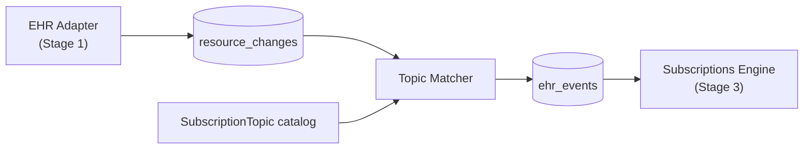

# Topic Matcher

**Purpose.** Stage 2 of the pipeline. The component that turns "this FHIR resource just changed" into "these are the topics that care about it." Generic, vendor-neutral. Reads `resource_changes`, evaluates each change against the active `SubscriptionTopic` catalog, and writes one `ehr_events` row per matching topic.

**Reader's prerequisites.** Read [../overview.md](../overview.md) and `../../architecture.md` (the "Topic Matcher" section is canonical for this component). Then [topics.md](topics.md) for the catalog domain and [subscriptions-engine.md](subscriptions-engine.md) for what reads the rows this stage writes.

## Where it sits



The matcher is the only component that consults the topic catalog. It does not look at subscriptions. It does not call the EHR. It does not build notifications. Its sole job is the topic match.

## What it consumes

For each unprocessed `resource_changes` row (claimed with `SELECT FOR UPDATE SKIP LOCKED`):

| Field | Use |
|---|---|
| `resource_type` | The resource-type gate. |
| `change_kind` | `create` / `update` / `delete`. The interaction gate. The adapter is responsible for collapsing vendor cancel-and-replace pairs into a single `update` — see [decisions/0005-cancel-and-replace-in-adapter.md](../decisions/0005-cancel-and-replace-in-adapter.md). |
| `resource` | The post-translation FHIR resource body the adapter produced (or, for `delete`, the last-known body). The matcher evaluates `queryCriteria.current` and `fhirPathCriteria` against this. |
| `previous_resource` | For `update` and `delete`, the prior version. Sourced by the adapter from `adapter_state` (FHIR scans), the predecessor message (HL7 updates), or the cancelled half of a recognized cancel-and-replace pair. May be null for `create`. |
| `correlation_id` | Propagates onto every `ehr_events` row produced. |
| `occurred_at` | Best-effort EHR-side timestamp from MSH-7, FHIR `meta.lastUpdated`, or vendor timestamp. |

See [contracts/internal-tables.md](../contracts/internal-tables.md#resource_changes) for the full row shape.

## What it consults

The active set of `SubscriptionTopic` resources from the [topic catalog](topics.md). Per the [R5 SubscriptionTopic spec](https://hl7.org/fhir/R5/subscriptiontopic.html), the matcher cares about:

- `resourceTrigger[]` — one or more triggers, each with:
  - `resource` — the FHIR resource type the trigger applies to.
  - `supportedInteraction[]` — `create`, `update`, `delete`.
  - `queryCriteria.previous` — a search-parameter expression the prior resource state must satisfy.
  - `queryCriteria.current` — a search-parameter expression the current resource state must satisfy.
  - `queryCriteria.requireBoth` — whether both `previous` and `current` must match (AND), or either suffices (OR).
  - `fhirPathCriteria` — a FHIRPath expression evaluated against the resource (an additional gate beyond search parameters).
- `eventTrigger[]` — for non-resource-shaped events. Consulted for change-feed records the adapter has tagged with an event code.
- `notificationShape[]` — `_include` / `_revinclude` directives the Notification Builder will use later. The matcher does not act on these; it copies them onto the `ehr_events` row as `notification_shape_hint` so Stage 4 does not have to reload the topic.

The catalog is loaded at startup and on hot-reload via SIGHUP (see [configuration.md](configuration.md)). A topic with a malformed search-parameter expression or a FHIRPath that fails to compile is **rejected at catalog-load time** and never becomes active. The error is operator-visible.

## The matching algorithm

The seven steps the matcher runs for each `(resource_changes row, topic)` pair (canonical in `../../architecture.md`):

1. **Resource-type gate.** If the topic's `resourceTrigger.resource` does not include the change's `resource_type`, skip.
2. **Interaction gate.** If the change's `change_kind` is not in `supportedInteraction`, skip.
3. **Previous-state criteria.** If `queryCriteria.previous` is present, evaluate it against `previous_resource`. If `previous_resource` is null and `previous` is required, skip.
4. **Current-state criteria.** If `queryCriteria.current` is present, evaluate it against `resource`.
5. **Combine** per `queryCriteria.requireBoth`: AND if true, OR otherwise.
6. **FHIRPath criteria.** If `fhirPathCriteria` is present, evaluate against the resource.
7. **Match.** If all of the above pass, emit one `ehr_events` row for this `(resource_change, topic)` pair.

A single `resource_changes` row can produce zero, one, or many `ehr_events` rows. Zero is the common case — most resource changes are not interesting to any subscribed topic.

The matcher writes all matched-topic rows for one `resource_changes` row in a single transaction, then marks the `resource_changes` row processed in the same transaction. Either every matched topic produces a row or none of them do — there is no partial fanout state.

## Matching expression languages

The matcher evaluates exactly **two** spec-defined languages on `SubscriptionTopic`. No CQL. No regex. No project-bespoke DSL. See [decisions/0006-no-cql-no-regex.md](../decisions/0006-no-cql-no-regex.md).

### 1. FHIR search-parameter expressions

Used for `SubscriptionTopic.resourceTrigger.queryCriteria.current` and `.previous`. The expression is a string in the same form a subscriber would write on a FHIR search URL — for example `status=active`, `subject=Patient/123`, `code=http://loinc.org|1234-5`, `_lastUpdated=ge2026-01-01`.

The matcher:

- parses the expression into `(parameter, modifier, comparator, value)` tuples per the [FHIR search semantics](https://hl7.org/fhir/R5/search.html);
- looks up each parameter against the resource type's published `SearchParameter` definition (which gives the FHIRPath that extracts the value from the resource);
- evaluates the extraction FHIRPath against the candidate resource (`current`) or the prior version (`previous`);
- compares using the parameter's `type`-defined matching rules (string contains, token system+code equality, reference id equality, date-range comparison, etc.).

This is how transition triggers like "status moved from `active` to `cancelled`" are expressed:

```
queryCriteria.previous   = "status=active"
queryCriteria.current    = "status=cancelled"
queryCriteria.requireBoth= true
```

The matcher gets `previous_resource` and `resource` from the same `resource_changes` row, so it evaluates both halves locally without calling the EHR.

#### Subset support

Full FHIR search has corners that are out of scope for `queryCriteria` (and `Subscription.filterBy`). What the matcher supports:

- token equality (`=`) and `:not`
- reference equality (`=`) and `:identifier`
- string equality and `:contains`
- date comparators (`eq`, `ne`, `gt`, `lt`, `ge`, `le`)
- `:missing`
- `:in` against ValueSets that have been pre-loaded into the topic catalog

What it does **not** support:

- chained references (e.g., `subject:Patient.name`)
- hierarchical token modifiers `:above` / `:below`
- full `_text` / `_content` free-text semantics
- inline custom search parameter definitions

A topic that uses an unsupported expression is rejected at catalog-load time with an operator-visible error. It does not fail silently at runtime.

### 2. FHIRPath

Used for `SubscriptionTopic.resourceTrigger.fhirPathCriteria` ([`https://hl7.org/fhir/R5/subscriptiontopic-definitions.html#SubscriptionTopic.resourceTrigger.fhirPathCriteria`](https://hl7.org/fhir/R5/subscriptiontopic-definitions.html#SubscriptionTopic.resourceTrigger.fhirPathCriteria)). A second-pass gate after the search-parameter criteria. This is where conditions that cannot be expressed in search parameters live — for example, "an Observation whose `valueQuantity.value` exceeds the upper bound of `referenceRange[0].high`."

The matcher uses an embedded FHIRPath evaluator (the same one that backs search-parameter extraction) running against `resource`, or against `previous_resource` if the path begins with `%previous`.

#### FHIRPath sandboxing

FHIRPath is expressive enough to write expensive expressions. The evaluator runs each expression with:

- a per-evaluation wall-clock timeout (default 100 ms, configurable);
- a per-evaluation node-traversal limit;
- no I/O — pure resource traversal only;
- a deny-list for non-deterministic functions. `now()` and `today()` are stamped at evaluation start (so a single evaluation sees a stable clock); nothing else with side effects is in scope.

A topic whose FHIRPath times out or errors against a runtime resource is **skipped for that resource_changes row only**. The matcher records the topic + error in a per-topic metric and a debug log. A topic that fails persistently shows up on the operator dashboard for review.

### 3. Vendor-specific event codes — no expression language

`SubscriptionTopic.eventTrigger` matches on the literal event code the adapter stamped onto a change-feed record. No expression evaluation; direct equality on the event code. The adapter is the only thing that knows what the vendor's event codes mean.

## What it writes

One `ehr_events` row per matched topic. See [contracts/internal-tables.md](../contracts/internal-tables.md#ehr_events) for the canonical row shape. The fields the matcher fills:

- `event_number` — server-assigned monotonic sequence (drives `eventsSinceSubscriptionStart` and `$events` ordering).
- `topic_url` — canonical URL of the matched topic, including version.
- `change_kind` — copied from the resource change.
- `focus` — FHIR reference to the changed resource.
- `resource` — kept for downstream filter evaluation by the engine and for `$events` replay.
- `previous_resource` — kept when needed by `queryCriteria.previous` so subscription-level filters with previous-state semantics can be re-evaluated; may be null.
- `correlation_id` — copied from the resource change.
- `occurred_at` — copied from the resource change.
- `notification_shape_hint` — the matched topic's `_include` / `_revinclude` directives, denormalized for Stage 4.
- `resource_change_id` — back-pointer to the source `resource_changes` row.

## Cancel-and-replace seen from this stage

The matcher does not see two rows for a cancel-and-replace edit. It sees one normal `update` row with both `previous_resource` and `resource` populated, because the adapter merged the pair upstream. A topic that fires on "ServiceRequest transitions from `active` to `revoked`" matches the merged update the same way it would match a true single-message update. There is no special-case logic at this stage.

This is what the architecture has decided is correct, and why it is the adapter's job: only the adapter has the vendor-specific knowledge to recognize the pair belongs together. Pushing the work downstream would force the matcher (and every subscriber) to learn vendor identifiers it does not have. See [decisions/0005-cancel-and-replace-in-adapter.md](../decisions/0005-cancel-and-replace-in-adapter.md).

## Failure handling

- **Catalog-load failure.** A `SubscriptionTopic` with a malformed search-parameter expression or FHIRPath that fails to compile is rejected at catalog-load time and never becomes active.
- **Runtime FHIRPath failure.** Timeout or evaluator error for one topic against one row: skip that topic for that row, increment a per-topic error metric, debug-log the failure. Other topics continue to evaluate.
- **DB outage.** A persistent inability to write `ehr_events` leaves the source `resource_changes` row unprocessed. The matcher resumes from where it left off when DB access returns. The row is durable; nothing is lost.
- **Process crash.** The next worker re-claims the row via `SELECT FOR UPDATE SKIP LOCKED`. Because the matcher writes all matched-topic rows in one transaction and marks the source row processed in the same transaction, there is no partial state to recover.

## What this domain does NOT do

- **It does not look at subscriptions.** Subscriptions are private per-subscriber objects; the topic catalog is server-published and shared. Per-subscription filtering is the [Subscriptions Engine](subscriptions-engine.md)'s job in Stage 3.
- **It does not call the EHR.** It works entirely from the durable `resource_changes` row. The EHR is reachable only via the [EHR Adapter](ehr-adapter.md).
- **It does not build notifications.** Bundle assembly is the Notification Builder's job in Stage 4.
- **It does not enforce authorization.** Authorization is per-subscriber and is checked in Stage 3 and again at delivery.
- **It does not deduplicate matches across topics.** If two topics legitimately match the same change, both rows are written. Subscribers are configured against specific topics, so the engine only delivers to subscribers of the topic that actually matched.
- **It does not own the catalog.** Topics are loaded by the [topics](topics.md) domain. The matcher consults the loaded catalog.
