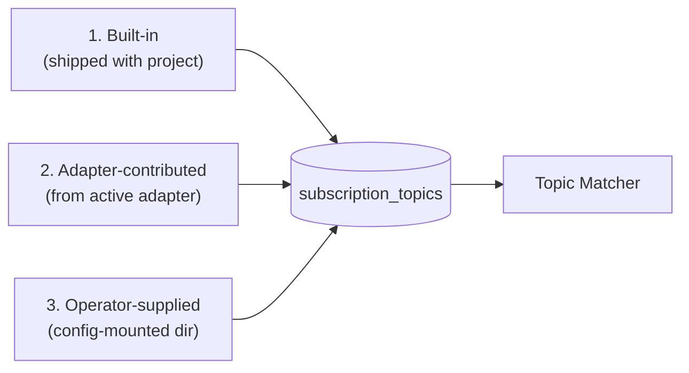

# SubscriptionTopic Catalog

**Purpose.** The set of `SubscriptionTopic` resources this deployment publishes. Owns the loading rules (built-in, adapter-contributed, operator-supplied), conflict resolution between sources, version management for canonical URLs, and the starter topic set the project ships.

**Reader's prerequisites.** Read [topic-matcher.md](topic-matcher.md) (the consumer of the catalog) and `../../architecture.md` (section "Topic catalog" under "Other Spec Requirements"). The R5 SubscriptionTopic spec is canonical: [`https://hl7.org/fhir/R5/subscriptiontopic.html`](https://hl7.org/fhir/R5/subscriptiontopic.html).

## What a topic is

A `SubscriptionTopic` describes a class of clinical event the server can publish notifications for. Subscribers reference a topic by its canonical URL when they create a `Subscription`. The topic carries:

- one or more **triggers** (`resourceTrigger` and/or `eventTrigger`) that say what causes the topic to fire;
- the **matching expressions** the [Topic Matcher](topic-matcher.md) evaluates (`queryCriteria.previous`, `queryCriteria.current`, `requireBoth`, `fhirPathCriteria`);
- a **notification shape** (`notificationShape` with `_include` and `_revinclude`) that tells the [Notification Builder](subscriptions-engine.md#stage-4--notification-builder) what to put in the Bundle;
- a **filter whitelist** (`canFilterBy`) that says what subscribers may filter on when creating a `Subscription` against this topic.

Topics are FHIR resources, stored in `subscription_topics` (see [storage.md](storage.md)). They are read-only to subscribers — only the operator and the loaded adapter contribute topics. Subscribers can `GET /SubscriptionTopic/{id}` and search via the [Subscriptions API](subscriptions-api.md), but they cannot `POST`, `PUT`, or `DELETE`.

## The three sources

There is no canonical `SubscriptionTopic` library shipped by HL7. Topics come from three places, loaded in this order at startup and on hot-reload:

### 1. Built-in topics

Topics shipped with the project as part of its baseline. These are the topics the project commits to supporting on any adapter that emits the corresponding resource changes — the conformance bar for `adapters/default` and a starting catalog for any vendor adapter.

The starter set:

| Topic | Triggered by | Common subscribers |
|---|---|---|
| `admit-discharge-transfer` | `Encounter` create / update with status transitions (`planned` → `arrived`, `arrived` → `in-progress`, `in-progress` → `finished`, etc.) | Care coordination, capacity dashboards, public-health reporting. |
| `lab-result-finalized` | `Observation` or `DiagnosticReport` transitions to `final` (`status=final` and not `preliminary` or `amended`). | Results-following systems, registries, decision support. |
| `order-placed` | `ServiceRequest` create with status in `{active, draft}`. | LIS / RIS / pharmacy partners. |
| `order-changed` | `ServiceRequest` update (any status change, edit, cancel-and-replace). | Same as above; subscribers needing every modification. |
| `document-available` | `DocumentReference` create or status transition to `current`. | Document workflow systems. |
| `allergy-changed` | `AllergyIntolerance` create / update / delete. | Decision support, formulary checking. |
| `medication-changed` | `MedicationRequest` / `MedicationStatement` create / update with clinically-meaningful status changes. | Reconciliation, decision support. |

These are notional. The exact `queryCriteria` expressions, `notificationShape` `_include` directives, and `canFilterBy` whitelist for each topic live in the topic resources themselves under `topics/builtin/` in the codebase. The starter set will evolve; new built-in topics are added by changing the project, not by configuring a deployment.

These topics are **vendor-neutral**: they are shaped against the standard FHIR R5 / R4B resources that any compliant adapter produces from `resource_changes`.

### 2. Adapter-contributed topics

A vendor adapter may register additional topics that exploit vendor-specific capabilities the standard FHIR resources don't surface. Examples:

- An Epic adapter can register a topic that fires on a specific Interconnect event code that has no direct FHIR analog.
- A Meditech adapter can register a topic over a Meditech-specific document-status workflow stage.
- An Oracle Health adapter can register a topic on a Millennium-specific event from its proprietary change feed.

Adapter-contributed topics are returned by the active adapter's `manifest()` (see [adapter-spi.md](../contracts/adapter-spi.md)). The host loads them at startup. They appear in the catalog alongside built-in and operator-supplied topics; subscribers see them in the `CapabilityStatement` and can subscribe like any other topic.

The adapter is responsible for emitting the resource changes the topic needs (typically via the `Vendor API Client` sub-component that knows how to consume the relevant change feed and tag the resource with the right event code).

Naming: adapter topics use a canonical URL under the adapter's namespace (e.g., `http://fhir-subscriptions-foss.org/topics/adapter/epic/order-status-detailed`). Vendor adapters MUST NOT contribute topics that shadow the canonical URL of a built-in topic.

### 3. Operator-supplied topics

A deployment may load extra `SubscriptionTopic` resources from a config-mounted directory (`topics.catalog_dir` in the configuration domain — see [configuration.md](configuration.md)). This is the escape hatch for facility-specific topics that are useful for one deployment but don't belong in the project's built-in set.

Loaded topics must:

- have a canonical URL with a `version`;
- use only the matching expressions supported by the [Topic Matcher](topic-matcher.md#matching-expression-languages);
- pass catalog-load validation (search-parameter expressions parse cleanly, FHIRPath compiles).

Validation failure aborts the topic load with an operator-visible error, but does NOT abort the server start (other topics continue to load). The failed topic is logged and reported via a metric.

## Conflict resolution

If two sources contribute a topic with the same canonical URL **and the same version**:

1. Operator-supplied beats adapter-contributed.
2. Adapter-contributed beats built-in.
3. Built-in is the floor.

This ordering exists so an operator can override an adapter's or the project's topic shape (for example, narrowing a `notificationShape` to fewer `_include` directives for a privacy-sensitive deployment) without forking the adapter or the project.

If two sources contribute a topic with the same canonical URL but **different versions**, both are loaded as separate versioned entries. See "Versioning" below.

If two adapter-contributed topics from a single adapter collide on canonical URL + version, the adapter is misconfigured and the server fails to start. Adapters are vetted at build time.

## Versioning

Topics are identified by **canonical URL plus version**. The storage layer keeps every published version of every topic (`subscription_topics` rows are unique on `(url, version)`). This is required by the spec: a `Subscription` references a specific topic version, and changing a topic's expressions in place would invisibly change the semantics of every subscription on it.

Rules:

- Editing a topic in place is permitted only for non-semantic changes (description, title, contact). Anything that changes matching behavior — `resourceTrigger`, `queryCriteria`, `fhirPathCriteria`, `notificationShape`, `canFilterBy` — requires a new version.
- A subscription pinned to an older version continues to evaluate against that version's expressions until the subscription is updated.
- A new subscription against the topic uses the latest version.
- The `CapabilityStatement` advertises the latest version of each topic.
- Old versions are retained until no subscriptions reference them, at which point an operator garbage-collects them by removing the version from the catalog source and triggering SIGHUP. Automatic GC is out of scope for v1.

Subscribers query versions via the standard FHIR `version` search parameter on `SubscriptionTopic`.

## Loading and reload

- Topics are loaded at startup. The startup probe (`/startup`, see [lifecycle.md](lifecycle.md)) does not return ready until the catalog has loaded.
- A SIGHUP triggers a reload that re-reads the operator-supplied directory and (if the adapter manifest has changed) the adapter's contributed set. New topics activate immediately; topics that have been removed from a source are deactivated (their rows transition to `retired`) but remain in the table for `$events` historical replay.
- Reload is atomic per source: a topic file with a parse error during reload causes that file to be rejected and logged; it does not roll back the rest of the reload.
- Built-in topics are loaded from compiled-in resources, not the filesystem. They cannot be hot-replaced — a built-in topic update ships in a new server binary.

## What HL7 does and does not ship

HL7 publishes the `SubscriptionTopic` resource definition and a small handful of example topics in implementation guides and in the spec's example folder, but it does not ship a curated, versioned, canonical SubscriptionTopic library that an FHIR Subscriptions server can drop in. This was verified during the architecture review (and is recorded in `../../architecture.md`'s "Open Questions"). The starter set above is what this project commits to publishing as its baseline.

If HL7 publishes a canonical library in the future, the project will adopt it as a built-in source.

## What this domain does NOT do

- **It does not match resource changes against topics.** That is the [Topic Matcher](topic-matcher.md) — Stage 2.
- **It does not store topic match results.** Match results are `ehr_events` rows owned by the [storage](storage.md) domain.
- **It does not own subscriber-side filtering.** `Subscription.filterBy` against `SubscriptionTopic.canFilterBy` is enforced by the [Subscriptions API](subscriptions-api.md) at create time.
- **It does not own resource-change production.** Resource changes are produced by the [EHR Adapter](ehr-adapter.md). The adapter declares what it can emit; the catalog declares what events the matcher will fire on.
- **It does not handle delivery.** Channel modules deliver Bundles produced by the engine for subscriptions on these topics — see [channels.md](channels.md).
