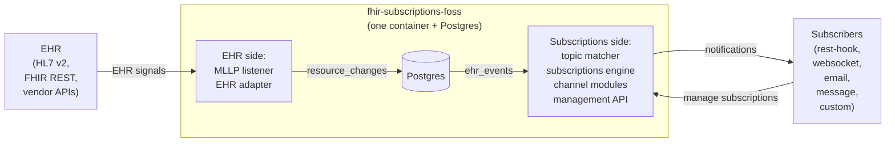

# Overview

**Purpose.** A one-page reading of the system: what it does, how it is shaped, and what the pipeline looks like end-to-end.

**Reader's prerequisites.** None. This is the entry document. After reading this, go to `../architecture.md` for the canonical sequence diagram and component table, then to the per-domain HLDs in [domains/](domains/).

## What it is

`fhir-subscriptions-foss` is an open-source server that bridges **FHIR Subscriptions** on the subscriber side and an **EHR** (Epic, Meditech, Oracle Health, etc.) on the EHR side. It is a single-tenant deployment: one container per facility, bound to one EHR. State lives in a single Postgres database. There is no leader election, no replica coordination, no external message broker.

Subscribers register `Subscription` resources against `SubscriptionTopic` resources the deployment publishes. Whenever the EHR signals a clinical change — over HL7 v2 MLLP, over FHIR REST, or over a vendor change feed — the server translates it into a vendor-neutral resource change, matches it against the topic catalog, fans it out to interested subscriptions, builds a `subscription-notification` Bundle, and delivers via the subscriber's chosen channel.

See `../high-level-concept.md` for goals and non-goals; see `../architecture.md` for component definitions, the canonical sequence diagram, and the SPI base classes.

## The two sides of the bridge

- The **EHR side** is vendor-specific from the adapter inwards. Only the MLLP listener is vendor-neutral; everything else (FHIR REST polling, proprietary APIs, change feeds, HL7 v2 parsing) lives in the active adapter and changes per EHR.
- The **subscriptions side** is generic. The same engine, channel modules, and management API run for every adapter.
- **Postgres is the durable seam.** Every stage commits its output to a table before claiming its input as processed. A crash in any stage costs at most one in-flight row; the next start re-claims pending rows.

## The pipeline at a glance

The end-to-end path from "the EHR sent us something" to "the subscriber received a notification" is five stages. Each stage has a clear input, a clear output, and a Postgres table at every handoff.

| # | Stage | Where | In | Out |
|---|---|---|---|---|
| 1 | Translate | Adapter (vendor-specific) | HL7 message, scanned FHIR resource, or vendor change-feed record | One `resource_changes` row |
| 2 | Topic match | Topic Matcher (generic) | One `resource_changes` row | Zero or more `ehr_events` rows |
| 3 | Subscription fanout | Subscriptions Engine (generic) | One `ehr_events` row | Zero or more `deliveries` rows |
| 4 | Build | Notification Builder (generic) | One `deliveries` row (or a small batch for the same subscription) | A `NotificationEnvelope` (in memory) |
| 5 | Send | Channel module (per protocol) | A `NotificationEnvelope` | Outcome recorded on the `deliveries` row |

Stage 1 is the only stage with vendor knowledge. Stages 2 through 5 are entirely generic.

For the canonical sequence diagram with Postgres handoffs, in-memory wakeups, and `SELECT FOR UPDATE SKIP LOCKED` semantics drawn explicitly, see `../architecture.md` (the "End-to-end sequence" section).

## What an EHR sends in

Three input shapes, all owned by the adapter:

- **HL7 v2 messages** delivered over MLLP. The vendor-neutral MLLP listener writes raw bytes to `hl7_message_queue` and ACKs the EHR. Persistence-then-ACK is the durability guarantee. The HL7 Message Processor inside the adapter then parses, derives change kind, maps to FHIR, and validates.
- **FHIR REST polling.** The FHIR Scan Runner inside the adapter periodically reads configured resource types from the EHR's FHIR API, snapshots them in `adapter_state`, and emits a `resource_changes` row when content has changed. We do not rely on `_lastUpdated`.
- **Vendor change feeds and proprietary APIs.** The Vendor API Client inside the adapter consumes whatever the EHR offers (Epic Interconnect events, vendor webhooks, vendor websockets) and translates to FHIR.

For cancel-and-replace edits (the canonical case is an Epic order edit emitted as a cancel ORM followed by a new ORM with a fresh order number), the adapter — and only the adapter — has the vendor-specific knowledge to recognize the pair belongs together. It collapses the pair into a single `update` row with both `previous_resource` and `resource` populated. See [decisions/0005-cancel-and-replace-in-adapter.md](decisions/0005-cancel-and-replace-in-adapter.md).

## What a subscriber gets out

Every notification is a FHIR `Bundle` of `type = subscription-notification`. The Bundle's first entry is a `SubscriptionStatus` resource describing what kind of notification this is. Subsequent entries carry the event payload, governed by the subscription's `content` (`empty`, `id-only`, or `full-resource`) and the topic's `notificationShape` (`_include` / `_revinclude`). See [contracts/notification-bundle.md](contracts/notification-bundle.md).

The spec defines five notification types, all of which the server emits:

- **handshake** — at activation.
- **heartbeat** — at the configured cadence when no events have been sent.
- **event-notification** — the primary path, when matching events have occurred.
- **query-status** — server response to the `$status` operation.
- **query-event** — server response to the `$events` operation, replaying past events from the durable log.

`$events` is the spec-blessed catch-up mechanism. Subscribers that miss notifications during downtime use it to recover. It is implemented by replaying the `ehr_events` table within the configured retention window.

## Channels

Four spec-defined channel types are built in: `rest-hook`, `websocket`, `email`, `message`. Each is a module that implements the [Channel SPI](contracts/channel-spi.md). Custom channels (Kafka, MQTT, gRPC, SFTP, vendor push) are supported per the spec's extensible binding on `Subscription.channelType` — they implement the same SPI and register their own Coding. The core delivery scheduler hands each notification to the channel and trusts it to deliver. Retry, backoff, and dead-letter policy live in the core, not in the channel.

## Why this shape

Two architectural constraints drive every other decision in the system. They are restated here because they explain otherwise-surprising choices in the per-domain docs.

1. **Operational simplicity.** One container plus Postgres. No coordination. If a stage falls behind, it catches up from durable rows. See [decisions/0002-single-instance-no-leader-election.md](decisions/0002-single-instance-no-leader-election.md).
2. **Pluggable EHR adapters.** A deployment talks to one EHR; the codebase supports many adapters through a stable [Adapter SPI](contracts/adapter-spi.md). Third parties write a new adapter without forking the core. Epic is the first reference adapter; `adapters/default` is the conformance reference.

## Where to read next

- The canonical pipeline and component diagrams: `../architecture.md`.
- The pipeline domains, in pipeline order: [domains/mllp-listener.md](domains/mllp-listener.md), [domains/ehr-adapter.md](domains/ehr-adapter.md), [domains/topic-matcher.md](domains/topic-matcher.md), [domains/subscriptions-engine.md](domains/subscriptions-engine.md), [domains/channels.md](domains/channels.md).
- The subscriber-facing surface: [domains/subscriptions-api.md](domains/subscriptions-api.md), [contracts/subscriber-api.md](contracts/subscriber-api.md), [contracts/notification-bundle.md](contracts/notification-bundle.md).
- The internals: [domains/storage.md](domains/storage.md), [contracts/internal-tables.md](contracts/internal-tables.md), [domains/configuration.md](domains/configuration.md), [domains/lifecycle.md](domains/lifecycle.md), [domains/observability.md](domains/observability.md).
