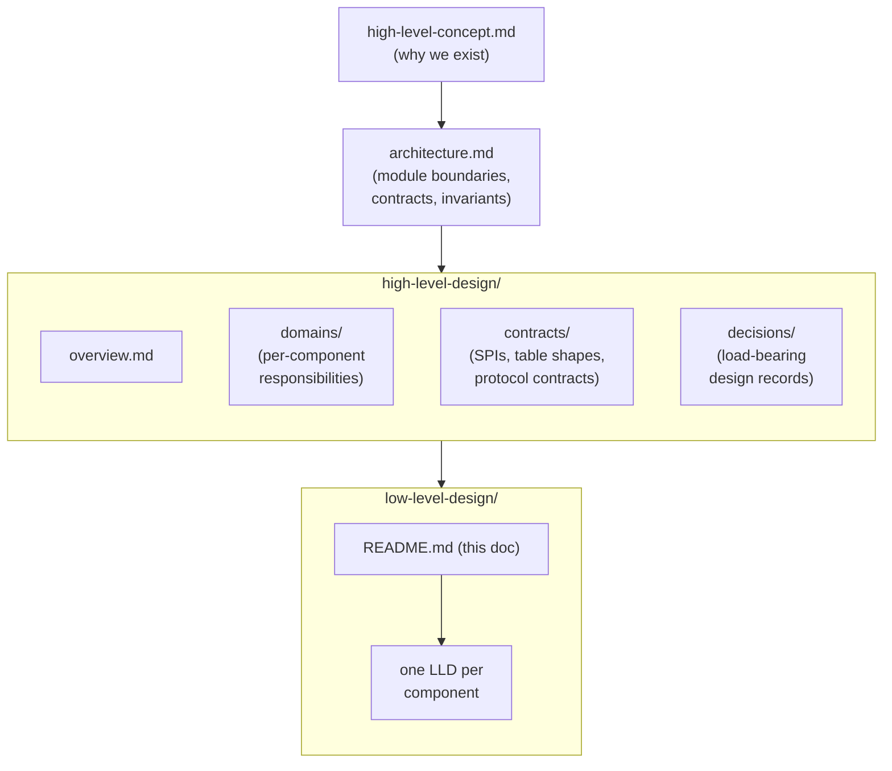

# Low-Level Design

This directory holds the implementation-level designs for `fhir-subscriptions-foss`. Each LLD takes one component named in the [architecture](../architecture.md) and the [high-level-design](../high-level-design/) and turns it into the level of detail an implementer needs to start writing code: module decomposition, public surface, internal data structures, pseudo-code for the load-bearing algorithms, error handling, metrics, the test plan, and the specific things the document is *not* responsible for. The LLDs are written for developers building these components — they assume the reader has already absorbed the concept and the architecture and is here to find out how the component is actually built.

The LLDs sit one rung below the HLD. The concept document explains why the project exists; the architecture document fixes module boundaries and the contracts between them; the HLD describes each domain's responsibilities and contracts at the conceptual level; the LLDs are where the contracts become code. None of these documents replicate the others — they each have a job. If a fact about a component is in the architecture, the corresponding LLD references it rather than restating it; if the LLD adds a new invariant beyond what the architecture declared, that invariant is called out as new.

## How the document set fits together

The arrow direction is the read order. Anything that belongs higher up the stack should not leak down. The LLDs are downstream of the HLD; they reference HLD docs, they do not redefine them.

## File list

The set covers every component named in the [architecture's module layout](../architecture.md#module-layout) plus the host-side scaffolding that runs the adapter base classes. Several documents are being authored in parallel; this index references all of them so the cross-links are stable as each one lands.

| File | One-line scope |
|---|---|
| [`mllp-listener.md`](mllp-listener.md) | Vendor-neutral MLLP receiver: per-endpoint accept loop, framing, MSH-9/MSH-10 capture, persist-then-ACK transaction, NACK/drop backpressure. |
| [`hl7-message-processor.md`](hl7-message-processor.md) | Adapter sub-component for HL7 v2 to FHIR translation: queue claim loop, lex/classify/map/validate pipeline, cancel-and-replace state machine, dead-letter routing. |
| [`fhir-scan-runner.md`](fhir-scan-runner.md) | Adapter sub-component for periodic FHIR scan-and-diff: scheduler, snapshot persistence, content-hash diffing, delete detection, rate-limit budget. |
| [`vendor-api-and-hydration.md`](vendor-api-and-hydration.md) | Adapter sub-components for vendor proprietary APIs and on-demand hydration: supervised consume loop, cursor persistence, request coalescing, LRU cache, per-fetch timeout. |
| [`topic-matcher.md`](topic-matcher.md) | Stage 2 generic core component: `resource_changes` claim loop, topic-catalog evaluator, search-parameter and FHIRPath subset, `ehr_events` writes. |
| [`subscriptions-engine.md`](subscriptions-engine.md) | Stages 3 and 4 plus delivery scheduling and heartbeats: subscription matcher, notification builder, retry/backoff, dead-letter, handshake state machine. |
| [`subscriptions-api.md`](subscriptions-api.md) | Subscriber-facing FHIR Subscriptions REST surface: Subscription CRUD, `$status`, `$events`, `/metadata`, `$get-ws-binding-token`, version shim. |
| [`channels.md`](channels.md) | Channel SPI plus four built-in channels (rest-hook, websocket, email, message): manifest, lifecycle, deliver, send_heartbeat, channel-specific failure semantics. |
| [`topics.md`](topics.md) | SubscriptionTopic catalog loading and validation: built-in plus adapter-contributed plus operator-supplied topics, canonical-URL versioning, search-parameter subset rejection. |
| [`storage.md`](storage.md) | Postgres pool, migrations, partitioning, retention: every table and index named in the architecture, the partitioning strategy for `resource_changes` and `ehr_events`, the retention sweepers, encryption-at-rest. |
| [`lifecycle.md`](lifecycle.md) | Health probes and graceful shutdown: `/healthz`, `/readyz`, `/startup`, the SIGTERM-driven shutdown sequencer, per-component shutdown hooks. |
| [`configuration.md`](configuration.md) | Config layering, secrets, hot reload: command-line + env + file + defaults precedence, `${env:...}` and `${file:...}` resolution, SIGHUP-reloadable subset. No runtime admin API. |
| [`observability.md`](observability.md) | Metrics, tracing, logs, audit: Prometheus metric naming convention, OpenTelemetry trace span shape, structured-log fields, append-only audit-log writer. |
| [`adapter-spi-framework.md`](adapter-spi-framework.md) | Host-side scaffolding for vendor adapters: adapter loader, manifest validation, `AdapterContext` construction, the four sub-component supervisors, lifecycle and conformance suite. |

Each LLD follows the same structure. If something is not in the document, it is either in a referenced LLD, in the architecture, or in an HLD; the "What this LLD does NOT cover" section at the end of every LLD is the closing-bracket on scope.

## How to use this set

If you are about to implement something:

1. **Start at the architecture.** The architecture's [Module Layout](../architecture.md#module-layout) tells you which module owns what. The pipeline diagrams tell you where in the five-stage flow your component sits. The contracts in the HLD ([adapter-spi.md](../high-level-design/contracts/adapter-spi.md), [internal-tables.md](../high-level-design/contracts/internal-tables.md), [channel-spi.md](../high-level-design/contracts/channel-spi.md)) tell you what your component has to satisfy.
2. **Open the matching LLD.** The file name in the table above maps one-to-one to a module name in the architecture's module layout (e.g., `engine/topic-matcher` → `topic-matcher.md`).
3. **Follow the cross-references.** An LLD will reference its upstream and downstream LLDs whenever the boundary matters. The cross-references are relative paths; the index here gives you the canonical filename if you arrive without context.
4. **If the LLD is missing detail, file an issue rather than guessing.** Implementation choices that affect correctness (transactional invariants, ordering, concurrency model, retry semantics) are required to be in the LLD. If you find a load-bearing decision being made at code-review time, that is a design-doc bug.

If you are reviewing a change:

- The change should be readable against the LLD it implements. A code change that contradicts the LLD without updating the LLD is a red flag.
- A change that requires updating the LLD's "Open questions" section is fine — that is what the section is for. A change that requires updating the LLD's invariants needs to also update the architecture.

If you are operating a deployment:

- LLDs are not the operator's manual. The operator's reference is the architecture's [Configuration](../architecture.md#configuration) section plus per-component runbooks (separate documents). LLDs are useful when an incident requires understanding the internal state machines and table semantics; otherwise, prefer the operator-facing docs.

## Cross-component conventions

Every LLD in this set follows the conventions below. They exist so an implementer who has read one LLD can read another without re-learning style or assumptions. If a future LLD needs to deviate from a convention, the deviation is called out at the top of the document with a one-sentence rationale.

### Pseudo-code style

- Pseudo-code is **language-neutral** but written in a syntax that resembles Rust / TypeScript with `async fn`. Names are illustrative; the implementation will normalize to the chosen language's conventions.
- Pseudo-code is **ASCII-only**. No smart quotes, em-dashes inside code blocks, or non-ASCII identifiers. (Mermaid is also ASCII-only — see below.)
- Pseudo-code is **non-running**. We do not strive for compilable correctness; we strive for unambiguous semantics. If a fragment is ambiguous, the surrounding prose disambiguates it.
- **Error returns** use a typed `Result` with named variants where the variant matters (`TransientFailure`, `PermanentFailure`, `Persisted`). When the variant doesn't matter, the prose says so.
- **Concurrency** is shown by `async fn` plus `spawn` for fire-and-forget tasks plus `await` for synchronization. Channels are shown as `(tx, rx) = channel()`. Locks are shown as `Mutex<T>` only when ownership cannot be expressed by message passing.

### Async I/O assumption

- The runtime is single-process, multi-task async. Per [decisions/0009](../high-level-design/decisions/0009-language-choice.md) the implementation language is Go; "tasks" are goroutines, "wakeups" are channel sends or `context` cancellations, "claim a row" uses `pgx` with `SELECT FOR UPDATE SKIP LOCKED`. The pseudo-code in the LLDs is presented in language-neutral form so the design pre-dates Go-specific idioms; the implementation is straight Go.
- Postgres calls are async. The pool is shared across tasks; each task checks out a connection per transaction and returns it. Statement timeouts and connection-pool acquisition timeouts are explicit.
- HTTP calls (to the EHR, to subscribers) are async, with explicit timeouts. The default HTTP client is the host-injected one; LLDs do not invent their own.
- File I/O (config files, mounted secrets, log sinks) is small-volume and async with a thread-pool fallback when the runtime requires it.
- Long-running supervisors (the MLLP accept loop, the HL7 supervisor, the FHIR scan supervisor, the vendor consume task) run as supervised tasks owned by the lifecycle module. Cancellation is cooperative — every loop checks the shutdown signal at every iteration.

### Mermaid diagrams

- ASCII-only inside Mermaid blocks. Use `->`, `-->`, `<->` rather than the Unicode arrows; use straight `--` rather than em-dashes.
- Diagrams illustrate component placement, sequence flow, or state transitions. They do not stand alone — every diagram has accompanying prose that says what the diagram shows. A diagram without prose is a documentation bug.
- Diagram node names use prose, not identifiers — `"HL7 Message Processor"`, not `Hl7MessageProcessor`. The pseudo-code is where identifiers live.
- Subgraphs are used to group nodes that belong to the same component or process. Edges crossing a subgraph boundary are the contracts between components.

### Transactional invariants

The architecture's transactional outbox pattern is the load-bearing invariant for end-to-end at-least-once. Every LLD that writes to a stage's output table follows the same shape:

- The output row INSERT and the input row mark-processed run in **one Postgres transaction**.
- The transaction commits **before** acknowledging the upstream (the EHR's MLLP ACK; the in-memory wakeup to the next stage). Persistence-then-ACK.
- Retry from a crash is safe: a crash before commit means the input row is still claimable; a crash between commit and the in-memory wakeup means the next stage finds the row on its next read. **Correctness comes from the table contents, not from the wakeup.**
- `SELECT FOR UPDATE SKIP LOCKED` claims input rows so multiple workers don't double-process. Holds for the duration of the transaction.
- Idempotency: `(adapter_id, correlation_id)` on `resource_changes`, `(subscription_id, eventNumber)` on `deliveries`, `(adapter_id, source_message_id)` on `hl7_message_queue` cancel-and-replace pending state. Duplicate inserts are no-ops.

LLDs that violate this pattern are required to call out the violation explicitly in the document. The hydration callback is the one documented exception (it is read-through, not write-through).

### Metric naming convention

Prometheus metrics across all LLDs follow:

- **Snake-case** names. `messages_processed_total`, not `messagesProcessedTotal`.
- **`_total` suffix** on counters. Histograms use `_seconds`, `_bytes`, or `_count` depending on what they measure.
- **Component prefix**. Every metric starts with the component name from the architecture's module layout: `mllp_*`, `hl7_processor_*`, `fhir_scan_*`, `vendor_api_*`, `hydration_*`, `topic_matcher_*`, `subs_engine_*`, `channel_<channel_id>_*`, `subs_api_*`, `storage_*`, `lifecycle_*`, `adapter_*` (for framework-level metrics — the per-supervisor metrics use the supervisor's component prefix).
- **Adapter labels** — `adapter_id` and `adapter_vendor` are pre-applied to every metric emitted by adapter sub-components and the framework that runs them.
- **Subscription labels** are deliberately omitted on high-cardinality counters; we summarize per channel-type and per-topic-url instead. Per-subscription details live in the audit log, not the metrics endpoint.
- **Configuration metrics** (e.g., `adapter_started_at`) are gauges set once at startup; they are valid for dashboards that want to chart deployment age or detect restart loops.

### Structured-log fields

Every LLD's structured-log examples use the same canonical field names:

- `correlation_id` — the message-level identifier that flows from the MLLP-listener row through `resource_changes` and `ehr_events`. Always present on event-pipeline log lines.
- `adapter_id`, `adapter_vendor` — present on every adapter and adapter-framework log line.
- `subscription_id` — present on every Subscriptions Engine, channel, and Subscriptions API log line that operates on a specific subscription.
- `topic_url` — present on every log line that names a `SubscriptionTopic`.
- `component` — the architecture-module name (`mllp-listener`, `hl7-message-processor`, etc.).
- `event` — a stable lowercase event identifier (`message_persisted`, `delivery_attempt_failed`, `cancel_and_replace_paired`). Used for operator alerting rules; it is part of the contract, not free-form prose.
- `error.kind`, `error.message`, `error.cause` — when an error is being logged. The kind is a typed code; the message is human-readable; the cause is the chain.

Log levels follow the standard pattern: `error` for actionable failures, `warn` for degraded behavior the operator should know about, `info` for normal lifecycle events, `debug` for per-message detail. Per-message tracing is the trace exporter's job, not the log sink's — verbose logs are not how we debug pipeline behavior.

### What every LLD ends with

- **Open questions** — design decisions deferred to implementation or to a future revision. Each item names a triggering condition for revisiting.
- **What this LLD does NOT cover** — the explicit closing of scope. Cross-references to the LLDs that own anything intentionally excluded.

The closing two sections are part of the contract, not optional. An LLD without them is incomplete.

## Status

| Component | LLD status |
|---|---|
| `mllp-listener.md` | drafted |
| `adapter-spi-framework.md` | drafted |
| `hl7-message-processor.md` | in progress |
| `fhir-scan-runner.md` | in progress |
| `vendor-api-and-hydration.md` | in progress |
| `topic-matcher.md` | in progress |
| `subscriptions-engine.md` | in progress |
| `subscriptions-api.md` | in progress |
| `channels.md` | in progress |
| `topics.md` | in progress |
| `storage.md` | in progress |
| `lifecycle.md` | in progress |
| `configuration.md` | in progress |
| `observability.md` | in progress |

Status reflects the documentation state, not the implementation state. The implementation may be ahead of or behind the LLD; if you find a discrepancy, fix the LLD first and let the code follow.
