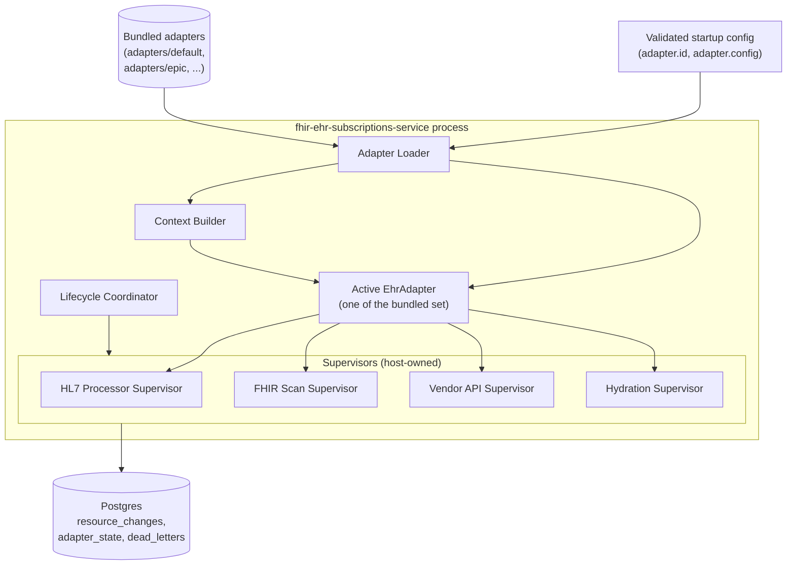

# Adapter SPI Framework — Low-Level Design

**Purpose.** Implementation-level design of the host-side scaffolding that runs vendor adapters. This is the code that does NOT live in any specific vendor adapter — it lives in the host process and is responsible for selecting one bundled adapter at startup, validating its manifest, constructing every sub-component the adapter declares, supervising those sub-components for the life of the process, and tearing everything back down on shutdown. The four adapter base classes themselves (`Hl7MessageProcessor`, `FhirScanRunner`, `VendorApiClient`, `HydrationService`) are implementations OF the SPI; this LLD designs the framework that calls them.

**Reader's prerequisites.** Read [../high-level-concept.md](../high-level-concept.md), [../architecture.md](../architecture.md) (sections "Adapter SPI", "Selection at runtime", "Configuration") in full, [../high-level-design/domains/ehr-adapter.md](../high-level-design/domains/ehr-adapter.md), and [../high-level-design/contracts/adapter-spi.md](../high-level-design/contracts/adapter-spi.md). The base-class SPI signatures and per-method semantics in those docs are the authoritative reference; this LLD designs the host that drives them. The per-sub-component runtime details are split across [hl7-message-processor.md](hl7-message-processor.md), [fhir-scan-runner.md](fhir-scan-runner.md), and [vendor-api-and-hydration.md](vendor-api-and-hydration.md); this LLD designs the supervisors that wrap them.

## 1. Component placement



The framework sits between configuration and the bundled adapter set on one side, and between the active adapter's sub-components and Postgres on the other. The supervisors are the only path to the database for adapter-produced data — vendor code never writes to `resource_changes` directly. The seam between the framework and the rest of the service is the `resource_changes` table; the seam between the framework and the active adapter is the four base-class subclasses the adapter constructed.

## 2. Module layout

The framework is one module (`adapter-spi-framework`, sibling to the `adapter-spi` interface module). Sub-modules:

- `loader` — reads `adapter.id` from validated config, looks up the matching `EhrAdapter` constructor in the bundled-adapter registry, instantiates it, calls `manifest()`, validates the manifest against the declared capabilities and the configured `adapter.config`, validates `spi_version` compatibility against the host's SPI major.
- `context_builder` — constructs the `AdapterContext` injected into every `build_*` call: HTTP client (with vendor auth wired per the adapter's manifest), `AdapterStateStore` (a Postgres-backed KV scoped per adapter id), `MetricsEmitter` (per-adapter labels pre-applied), `Logger` (per-adapter fields pre-applied), `Tracer`, and the `resource_change_sink` (the channel the supervisors drain into Postgres).
- `lifecycle_coordinator` — orchestrates the start order, the steady-state run, and the shutdown order. Registers the adapter's readiness with the host's `/readyz` handler.
- `hl7_processor_supervisor` — owns the queue claim loop over `hl7_message_queue`, calls into the vendor's `lex` / `classify` / `map_to_fhir` / `validate` overrides per row, drives the cancel-and-replace correlation-window state machine, performs the transactional outbox write to `resource_changes` + mark-processed, routes failures to `dead_letters`. Detailed runtime in [hl7-message-processor.md](hl7-message-processor.md).
- `fhir_scan_supervisor` — owns scheduling, calls into `scan_plan()` and `run_scan()`, manages snapshot persistence in `adapter_state`, computes content-hash diffs, writes `resource_changes`, applies rate-limit and retry/backoff. Detailed runtime in [fhir-scan-runner.md](fhir-scan-runner.md).
- `vendor_api_supervisor` — owns the supervised `consume()` loop, persists cursors in `adapter_state`, manages reconnect with exponential backoff, drives the per-record `translate()` plus the transactional outbox write. Detailed runtime in [vendor-api-and-hydration.md](vendor-api-and-hydration.md).
- `hydration_supervisor` — registers the engine callback, owns the per-replica LRU cache, request coalescing, rate-limit budget, and the per-fetch hard timeout. Detailed runtime in [vendor-api-and-hydration.md](vendor-api-and-hydration.md).
- `manifest_validator` — pure validation logic over `AdapterManifest`. Stateless; called once at startup.
- `state_store_pg` — Postgres-backed `AdapterStateStore` implementation that scopes keys under the adapter id.
- `resource_change_sink_pg` — the framework-internal sink the supervisors call after vendor `translate` / `map_to_fhir`. Performs the transactional INSERT plus stage-input mark-processed in one transaction.

## 3. Public surface

The framework exposes the following to the rest of the host process. Nothing else is public.

```
struct AdapterFramework {
    // Constructed once at startup, after configuration is validated.
}

impl AdapterFramework {
    // Load the adapter named by config, validate, build context, build sub-components,
    // call adapter.on_start, start supervisors. Returns once every supervisor is
    // either started successfully or has reported a fatal startup error.
    async fn start(config: ValidatedConfig, host: HostServices) -> Result<AdapterFramework>;

    // Read-only status: which sub-components are running, last health observation,
    // last error per supervisor. Used by /readyz and by the metrics endpoint.
    fn status(&self) -> AdapterFrameworkStatus;

    // Synchronous lookup of the registered hydration callback, used by the
    // engine's notification builder.
    fn hydration_callback(&self) -> Option<HydrationCallback>;

    // Begin graceful shutdown: stop supervisors in reverse start order, drain
    // in-flight work, call adapter.on_shutdown last, return within the deadline.
    async fn shutdown(&self, deadline: Instant) -> ShutdownReport;
}
```

`HostServices` is the dependency bundle the host injects: Postgres pool, metrics registry, structured logger, OpenTelemetry tracer, clock, the engine's hydration registry, and the host's HTTP-client factory. The framework does not reach for globals. The lifecycle module wires `start` into startup, `shutdown` into SIGTERM, and `status` into `/readyz`.

## 4. Adapter loading at startup

The bundled-adapter registry is a build-time list of `(id, constructor)` pairs. Each bundled adapter contributes one entry by registering a constructor function that returns its `EhrAdapter` subclass. The selection is purely runtime:

```
fn load_adapter(config: &ValidatedConfig, registry: &BundledAdapterRegistry) -> Result<Box<EhrAdapter>> {
    let id = &config.adapter.id;

    let constructor = registry
        .get(id)
        .ok_or_else(|| StartupError::UnknownAdapter {
            requested: id.clone(),
            bundled: registry.ids(),
        })?;

    let adapter: Box<EhrAdapter> = constructor();

    let manifest = adapter.manifest();

    // 1. SPI major must match host's.
    if manifest.spi_version.major != HOST_SPI_VERSION.major {
        return Err(StartupError::SpiMajorMismatch {
            host:    HOST_SPI_VERSION,
            adapter: manifest.spi_version,
        });
    }

    // 2. Manifest id must match the requested id (defensive).
    if manifest.id != *id {
        return Err(StartupError::ManifestIdMismatch {
            requested: id.clone(),
            declared:  manifest.id,
        });
    }

    // 3. version_pin must be satisfiable by the manifest's supported_ehr_versions.
    if let Some(pin) = &config.adapter.version_pin {
        if !manifest.supported_ehr_versions.satisfies(pin) {
            return Err(StartupError::VersionPinUnsatisfiable {
                pin: pin.clone(),
                supported: manifest.supported_ehr_versions.clone(),
            });
        }
    }

    // 4. adapter.config must validate against the manifest's JSON Schema.
    manifest.config_schema.validate(&config.adapter.config)
        .map_err(StartupError::ConfigSchemaInvalid)?;

    // 5. Static manifest validation (capability bool/null consistency comes later,
    //    after build_*).
    validate_manifest(&manifest)?;

    Ok(adapter)
}
```

Failure modes (every one aborts startup with a structured error pointing at the offending field):

- `UnknownAdapter` — the requested id is not in the bundled set. Operator-visible message lists the bundled ids.
- `SpiMajorMismatch` — the bundled adapter is built against a different major SPI than the host. Indicates a build-time integration error.
- `ManifestIdMismatch` — the bundled adapter's `manifest().id` does not match the registry key. Defensive check against a misregistered constructor.
- `VersionPinUnsatisfiable` — the operator pinned `>=2024.1` but the adapter declares it supports `>=2025.1`.
- `ConfigSchemaInvalid` — the operator's `adapter.config` block does not satisfy the manifest's JSON Schema.

`load_adapter` does not call `build_*` — that happens after the context is built, so any `build_*` failure has access to the full context.

## 5. AdapterContext construction

The context is constructed once per adapter and reused for every `build_*` call. Each base class clones what it needs:

```
fn build_context(
    manifest: &AdapterManifest,
    config:   &AdapterConfigBlock,
    host:     &HostServices,
) -> AdapterContext {
    let adapter_id = &manifest.id;

    let http = host.http_factory.build_for_adapter(
        // Auth + TLS resolved here; manifest declares the auth flow class
        // (smart-backend-services / oauth-client-credentials / api-key / mtls)
        // and config provides the credential references. Secrets are resolved
        // (env or file) by the framework, never read by adapter code.
        AdapterHttpProfile {
            base_url:     config.fhir_base_url.clone(),
            auth_flow:    config.auth.clone(),
            tls:          config.tls.clone(),
            user_agent:   format!("fhir-subs/{} ({})", HOST_VERSION, adapter_id),
            retry_policy: DEFAULT_HTTP_RETRY,
            timeout:      DEFAULT_HTTP_TIMEOUT,
        }
    );

    let state_store = PgAdapterStateStore::new(
        host.pg_pool.clone(),
        adapter_id.clone(),     // namespace; host prefixes every key with this
    );

    let metrics = host.metrics.with_default_labels([
        ("adapter_id", adapter_id),
        ("adapter_vendor", &manifest.vendor),
    ]);

    let logger = host.logger.with_default_fields([
        ("adapter_id", adapter_id),
    ]);

    let tracer = host.tracer.named(format!("adapter.{}", adapter_id));

    let resource_change_sink = ResourceChangeSink::new(
        host.pg_pool.clone(),
        adapter_id.clone(),
        metrics.clone(),
    );

    AdapterContext {
        config: config.clone(),
        state_store,
        http,
        metrics,
        logger,
        tracer,
        resource_change_sink,
    }
}
```

Invariants:

- The HTTP client is the only network egress route the adapter has. It is locked to `manifest.allowed_egress` (a future capability declaration; v1 allows any host the adapter calls).
- The `state_store` keyspace is scoped per adapter. An adapter cannot read or write another adapter's state.
- Secrets (`${env:VAR}` / `${file:/run/secrets/foo}`) are resolved here. The adapter receives plain strings — it never sees the placeholder syntax and never reads environment variables directly.
- The `resource_change_sink` is wired to the `state_input_table` per supervisor. The HL7 supervisor wires it to `hl7_message_queue` (mark-processed semantics); the FHIR scan and Vendor API supervisors wire it to no input row (their input is in-memory + `adapter_state`).

## 6. The four sub-component supervisors

Each supervisor is the framework wrapper around one of the adapter's base-class subclasses. The vendor's overrides are pure functions; the supervisor owns every stateful concern around them. This is what `adapters/default` inherits unmodified.

### 6.1 HL7 Processor Supervisor

Wraps the vendor's `Hl7MessageProcessor` subclass. Owns the queue claim loop, the cancel-and-replace state machine, the dead-letter routing, and the transactional outbox write.

```
async fn hl7_processor_supervisor(
    processor: Hl7MessageProcessor,    // vendor subclass
    ctx:       SupervisorCtx,
) {
    loop {
        if ctx.shutdown.is_signaled() { break; }

        // 1. Claim. SELECT FOR UPDATE SKIP LOCKED bounds at most one in-flight claim per worker.
        let row = match ctx.pg.claim_unprocessed_hl7_row().await {
            Ok(Some(row)) => row,
            Ok(None)      => { ctx.wakeup.wait_or_timeout(IDLE_POLL).await; continue; }
            Err(e)        => { ctx.metrics.inc("fhir_subs_hl7_claim_errors"); backoff(e); continue; }
        };

        let span = ctx.tracer.span("hl7.process", &[("correlation_id", &row.correlation_id)]);

        // 2. Vendor translation pipeline (pure functions; no I/O).
        let parsed = match processor.lex(row.raw_bytes) {
            Ok(p)  => p,
            Err(e) => { dead_letter(&ctx, row, "lex_failure", e).await; continue; }
        };

        let classification = match processor.classify(&parsed) {
            Ok(c)  => c,
            Err(e) => { dead_letter(&ctx, row, "classify_failure", e).await; continue; }
        };

        let resource = match processor.map_to_fhir(&parsed, &classification) {
            Ok(r)  => r,
            Err(e) => { dead_letter(&ctx, row, "map_failure", e).await; continue; }
        };

        if let Err(e) = processor.validate(&resource) {
            dead_letter(&ctx, row, "validate_failure", e).await;
            continue;
        }

        // 3. Cancel-and-replace correlation. The framework owns this state machine;
        //    the vendor only contributes correlation_key in `classification`.
        let outcome = ctx.cnr_state_machine.process(
            CnrInput {
                row_id:           row.id,
                resource_type:    resource.resource_type(),
                change_kind:      classification.kind,
                correlation_key:  classification.correlation_key,
                resource:         resource,
                hold_window:      processor.correlation_hold_window(),
            }
        ).await;

        // 4. Transactional outbox write. Either:
        //    - emit one resource_changes row + mark hl7_message_queue.processed = true, or
        //    - hold the cancellation in pending table, leave hl7_message_queue.processed = false.
        match outcome {
            CnrOutcome::EmitNow(rc)         => write_resource_change(&ctx, row.id, rc).await,
            CnrOutcome::HoldForPair         => persist_hold(&ctx, row.id).await,
            CnrOutcome::HoldExpiredEmit(rc) => write_resource_change(&ctx, row.id, rc).await,
        }

        ctx.metrics.inc("fhir_subs_messages_processed");
        span.end();
    }
}
```

The vendor subclass methods (`lex` / `classify` / `map_to_fhir` / `validate`) are pure. They have no DB access, no clock access, no network access. The supervisor times them, traces them, and routes their failures. This makes vendor logic trivially unit-testable: a fixture HL7 message in, a `ResourceChange` (or a typed error) out.

The cancel-and-replace state machine has its own background task that fires on hold-window expiry; that task drains expired holds and emits the configured unpaired-cancellation / unpaired-replacement `ResourceChange` via the same `write_resource_change` path.

### 6.2 FHIR Scan Supervisor

Wraps the vendor's `FhirScanRunner` subclass. Owns scheduling, snapshot persistence, content-hash diffing, the `resource_changes` write, the EHR-side rate-limit budget, and retry/backoff on transient EHR errors.

```
async fn fhir_scan_supervisor(
    runner: FhirScanRunner,       // vendor subclass
    ctx:    SupervisorCtx,
) {
    let plan = runner.scan_plan();   // REQUIRED override; cached at start

    let scheduler = Scheduler::new(plan.iter().map(|t| (t.resource_type.clone(), t.cadence)));

    loop {
        if ctx.shutdown.is_signaled() { break; }

        let target = scheduler.next_due().await;     // returns when a target is due

        let _budget_guard = match ctx.rate_limiter.acquire().await {
            Ok(g)  => g,
            Err(_) => { ctx.metrics.inc("fhir_subs_rate_limit_blocked"); continue; }
        };

        let span = ctx.tracer.span("fhir_scan.run", &[("resource_type", &target.resource_type)]);

        let mut seen_ids: Set<ResourceId> = Set::new();
        let mut emitted = 0u64;

        // run_scan is REQUIRED. It yields one resource at a time.
        let mut stream = match runner.run_scan(&target, &ctx.http).await {
            Ok(s)  => s,
            Err(e) => { handle_scan_error(&ctx, &target, e); continue; }
        };

        while let Some(item) = stream.next().await {
            let resource = match item {
                Ok(r)  => runner.normalize(r),       // OPTIONAL override; default identity
                Err(e) => { handle_item_error(&ctx, &target, e); continue; }
            };

            seen_ids.insert(resource.id());
            let new_hash = runner.content_hash(&resource);   // OPTIONAL override

            ctx.state_store.transaction(|tx| async move {
                let key = format!("snapshot:{}:{}", target.resource_type, resource.id());
                let prior = tx.get(&key).await?;

                let change_kind = classify_scan_delta(&prior, &new_hash);
                if let Some(kind) = change_kind {
                    let prev_resource = prior.map(|p| decode_body(p.body));
                    let rc = ResourceChange {
                        resource_type:    target.resource_type.clone(),
                        change_kind:      kind,
                        resource:         resource.clone(),
                        previous_resource: prev_resource,
                        occurred_at:       now(),
                        correlation_id:    derive_corr_id(&resource, &new_hash),
                        event_code:        None,
                    };
                    tx.put(&key, encode_snapshot(&new_hash, &resource)).await?;
                    write_resource_change_in_tx(&ctx, tx, rc).await?;
                    emitted += 1;
                }
                Ok(())
            }).await.unwrap_or_else(|e| record_scan_failure(&ctx, &target, e));
        }

        // Detect deletes: anything in adapter_state with this resource_type prefix
        // that wasn't seen this scan was deleted from the EHR.
        emit_deletes_for_unseen(&ctx, &target, &seen_ids).await;

        ctx.metrics.observe("fhir_subs_scans_run", 1, &[("resource_type", &target.resource_type)]);
        ctx.metrics.observe("fhir_subs_deltas_emitted", emitted, &[("resource_type", &target.resource_type)]);
        span.end();

        scheduler.mark_completed(&target);
    }
}
```

The vendor's `run_scan` is the EHR-facing call. Implementations handle vendor paging, profile quirks, search-parameter behavior, and auth via the injected `http`. The supervisor handles everything else.

### 6.3 Vendor API Supervisor

Wraps the vendor's `VendorApiClient` subclass. Owns the supervised consume loop, cursor persistence, reconnect, and the transactional outbox write.

```
async fn vendor_api_supervisor(
    client: VendorApiClient,    // vendor subclass
    ctx:    SupervisorCtx,
) {
    loop {
        if ctx.shutdown.is_signaled() { break; }

        let cursor = ctx.state_store
            .get("cursor:vendor_feed")
            .await
            .unwrap_or_default();

        let (sink, mut rx) = build_event_sink(&ctx);

        // consume() is REQUIRED. It is a long-running task that streams vendor
        // records into the sink. The supervisor races it against the shutdown signal.
        let consume_task = ctx.spawn(async move {
            client.consume(sink, cursor).await
        });

        let drainer_task = ctx.spawn(async move {
            while let Some(record) = rx.recv().await {
                let span = ctx.tracer.span("vendor_api.translate", &[]);

                let mut rc = match client.translate(record).await {
                    Ok(r)  => r,
                    Err(e) => { ctx.metrics.inc("fhir_subs_translate_failures"); span.end(); continue; }
                };

                // Stamp the event_code if vendor records carry one (used by
                // SubscriptionTopic.eventTrigger matching).
                rc.event_code = record_event_code(&record);

                write_resource_change(&ctx, /* no source row */ None, rc).await;

                // Persist the cursor only after the row is committed.
                ctx.state_store.put("cursor:vendor_feed", encode_cursor(&record)).await.ok();

                ctx.metrics.inc("fhir_subs_events_received");
                span.end();
            }
        });

        // If consume returns (connection drop), back off and reconnect.
        match consume_task.await {
            Ok(())    => { ctx.metrics.inc("fhir_subs_vendor_consume_clean_exit"); }
            Err(e)    => { ctx.metrics.inc("fhir_subs_vendor_consume_errors"); ctx.logger.warn("consume error", e); }
        }
        drainer_task.cancel().await;

        ctx.backoff.next().sleep().await;
    }
}
```

The supervisor never calls `consume` again with a stale cursor — it always re-reads `adapter_state` after the previous attempt drained, so a partial event run that committed N events has the next attempt resume from event N+1.

### 6.4 Hydration Supervisor

Wraps the vendor's `HydrationService` subclass. Owns the engine callback registration, the LRU cache, request coalescing, and the per-fetch hard timeout.

```
async fn hydration_supervisor(
    service: HydrationService,    // vendor subclass
    ctx:     SupervisorCtx,
) {
    let cache = LruCache::with_ttl(HYD_CACHE_CAPACITY, service.cache_ttl());
    let coalescer = SingleflightMap::new();

    let callback: HydrationCallback = Arc::new(move |reference: FhirReference| {
        let cache = cache.clone();
        let coalescer = coalescer.clone();
        let service = service.clone();
        let http = ctx.http.clone();
        let metrics = ctx.metrics.clone();
        let timeout = HYD_FETCH_TIMEOUT;

        async move {
            if let Some(hit) = cache.get(&reference) {
                metrics.inc("fhir_subs_hydration_cache_hits");
                return Ok(hit);
            }

            // Coalesce concurrent requests for the same reference.
            let resource = coalescer.do_once(&reference, async {
                let res = with_timeout(timeout, service.fetch(reference.clone(), &http)).await?;
                cache.put(reference.clone(), res.clone());
                Ok(res)
            }).await?;

            metrics.inc("fhir_subs_hydration_misses");
            Ok(resource)
        }
        .boxed()
    });

    ctx.engine.register_hydration_callback(callback);

    // Block until shutdown; the callback is held by the engine until then.
    ctx.shutdown.wait().await;
    ctx.engine.deregister_hydration_callback();
}
```

The hydration supervisor does not own a long-running task in steady state — it registers a callback the engine calls synchronously and then waits for shutdown. The cache and coalescer are owned by the closure.

## 7. Lifecycle: start order, shutdown order, error handling

### 7.1 Start order

```
async fn start_framework(config, host) -> Result<AdapterFramework> {
    // 1. Load and validate the adapter (Section 4).
    let adapter = load_adapter(&config, &host.bundled_registry)?;
    let manifest = adapter.manifest();

    // 2. Build the AdapterContext (Section 5).
    let ctx = build_context(&manifest, &config.adapter.config, &host);

    // 3. Construct sub-components. Each may return null per declared capability.
    let hl7p   = manifest.capabilities.hl7_processor    .then(|| adapter.build_hl7_processor(&ctx)).flatten();
    let scan   = manifest.capabilities.fhir_scan_runner .then(|| adapter.build_fhir_scan_runner(&ctx)).flatten();
    let vendor = manifest.capabilities.vendor_api_client.then(|| adapter.build_vendor_api_client(&ctx)).flatten();
    let hyd    = manifest.capabilities.hydration_service.then(|| adapter.build_hydration_service(&ctx)).flatten();

    // 4. Cross-check: manifest capabilities vs build_* returns.
    cross_check_capabilities(&manifest, hl7p.is_some(), scan.is_some(), vendor.is_some(), hyd.is_some())?;

    // 5. Adapter-wide on_start (vendor SDK initialization, shared connection pool, etc.)
    adapter.on_start(&ctx).await?;

    // 6. Start supervisors in dependency order:
    //    a. Hydration first — it must be ready before the engine can build full-resource bundles.
    //    b. HL7, FHIR scan, Vendor API in any order — they are independent producers.
    let mut supervisors = SupervisorSet::new();

    if let Some(s) = hyd    { supervisors.start("hydration", hydration_supervisor(s, ctx.clone())).await?; }
    if let Some(s) = hl7p   { supervisors.start("hl7",       hl7_processor_supervisor(s, ctx.clone())).await?; }
    if let Some(s) = scan   { supervisors.start("fhir_scan", fhir_scan_supervisor(s, ctx.clone())).await?; }
    if let Some(s) = vendor { supervisors.start("vendor",    vendor_api_supervisor(s, ctx.clone())).await?; }

    // 7. Register adapter-contributed topics with the catalog.
    host.topic_catalog.register_contributed(manifest.contributed_topics.clone()).await?;

    Ok(AdapterFramework { adapter, manifest, supervisors, ctx })
}
```

### 7.2 Shutdown order

Reverse of start. The supervisors have to drain in-flight work before `on_shutdown` runs, because vendor `on_shutdown` may close the SDK connections the supervisors are still using.

```
async fn shutdown(&self, deadline: Instant) -> ShutdownReport {
    // 1. Mark unready so the host's /readyz returns 503 and the engine stops calling hydration.
    self.host.lifecycle.mark_unready("adapter shutting down");

    // 2. Stop supervisors in reverse start order, with bounded drain per supervisor.
    self.supervisors.stop_in_reverse_with_deadline(deadline).await;

    // 3. Adapter-wide on_shutdown (SDK teardown, connection pool close).
    let _ = self.adapter.on_shutdown(&self.ctx).await;

    // 4. Close the AdapterContext: drop HTTP pool, drop state store handle.
    drop(self.ctx);

    self.supervisors.report()
}
```

### 7.3 Error handling during start

A `build_*` returning `Err` aborts startup. A successful `build_*` followed by a supervisor `start` failure (e.g., the HL7 supervisor cannot acquire a Postgres connection) is a startup error. There is no partial-success start — if any declared sub-component cannot run, the host refuses to come up. This is intentional: a deployment that silently runs without its FHIR scan because the scan supervisor crashed at start would silently miss change events.

### 7.4 Error handling during steady state

Each supervisor reports its own health to the framework's status. A supervisor that has been failing consistently (configurable threshold; default 5 consecutive errors per minute) flips its sub-component to `degraded` in `/readyz` but does not bring down the whole adapter. A `degraded` health state for `/readyz` reporting is the only escalation the framework performs. On supervisor failure the framework crashes the process; the container orchestrator's restart policy is the supervisor of last resort, per [decisions/0008 #5](../high-level-design/decisions/0008-resolved-design-questions.md). There is no in-process auto-restart, no soft-restart thresholds, and no exponential-backoff supervisor restart loop. This is consistent with the architecture's "operational simplicity" principle.

### 7.5 Error handling during shutdown

If `on_shutdown` errors, the framework logs and continues — shutdown completes regardless. If a supervisor cannot drain within the deadline, the framework force-cancels it and records the unfinished work in `ShutdownReport`. The next process incarnation re-claims unprocessed `hl7_message_queue` rows, resumes scans from `adapter_state`, and replays the vendor-feed cursor — at-least-once is preserved.

## 8. Manifest validation rules

`validate_manifest` runs after `manifest()` returns and before `build_*` is called.

- **id** — non-empty, lowercase, `[a-z0-9-]+`, no leading/trailing dash. Must be unique within the host's bundled-registry (build-time check).
- **vendor** — non-empty.
- **supported_ehr_versions** — well-formed `VersionSpec` (semver-style or vendor-defined, but parseable).
- **capabilities** — a sub-component declared `true` is verified against `build_*` after construction. A declared `false` MUST cause `build_*` to return null; a `false` declaration with a non-null `build_*` return is a startup error (declared capability lies).
- **config_schema** — must be a valid JSON Schema (Draft 2020-12). Compiled at validation time; compile failure is a startup error.
- **contributed_topics** — each topic must be a valid `SubscriptionTopic` resource per the topics module's loader; a topic whose canonical URL collides with a built-in topic from the host's catalog causes a startup error. See [topics.md](topics.md).
- **spi_version** — major must equal the host's; minor must be ≤ the host's (the host implements an older minor, an adapter built against a newer minor must be backward-compatible — additive minors are guaranteed).

Validation failures are structured errors carrying the path within the manifest at which the failure occurred.

## 9. Test plan

### 9.1 `MockAdapter` for engine tests

The framework ships a `MockAdapter` test helper that satisfies `EhrAdapter` plus all four base classes with stub implementations:

- `MockHl7Processor` — accepts a programmable list of `(raw_bytes -> ResourceChange | error)` mappings; the test injects HL7 fixtures and asserts the resulting `resource_changes` rows.
- `MockFhirScanRunner` — `scan_plan` returns a configurable list; `run_scan` yields a configurable iterator. Snapshot-and-diff is exercised by the supervisor unchanged.
- `MockVendorApiClient` — `consume` is a programmable async iterator; `translate` is a programmable mapping. Cursor persistence is exercised by the supervisor unchanged.
- `MockHydrationService` — `fetch` is a programmable mapping with optional latency injection.

The `MockAdapter` lets the engine, channels, topic matcher, and the framework supervisors be unit-tested end-to-end without any EHR connectivity. This is the foundation of the engine's integration tests.

### 9.2 Conformance tests every adapter must pass

The `adapter-spi-conformance` test crate is a battery every adapter (including `adapters/default`, `adapters/epic`, and any third-party adapter) must pass. The crate exercises the framework against the adapter under test:

- **Manifest validation** — the adapter loads, declared capabilities are consistent with `build_*` returns, the JSON Schema is valid, `spi_version` is compatible.
- **Lifecycle** — `on_start` runs, all declared sub-components start, `/readyz` flips to ready, shutdown drains within grace period.
- **HL7 happy path** (if `hl7_processor: true`) — synthetic HL7 messages flow through the supervisor; the resulting `resource_changes` rows match expected shape; the source `hl7_message_queue` rows are marked processed.
- **HL7 dead-letter path** — malformed messages route to `dead_letters`, never to `resource_changes`; the source row is still marked processed.
- **HL7 cancel-and-replace** — a paired cancel/new message produces one `update` row with both `previous_resource` and `resource` populated; an unpaired cancellation honors the configured `on_unpaired_cancellation`.
- **FHIR scan happy path** (if `fhir_scan_runner: true`) — a scan against a stub FHIR server seeds `adapter_state`; a second scan with a modified resource emits one `update`; a third scan with the resource removed emits one `delete`.
- **FHIR scan rate-limit** — exceeding the configured budget defers scans without crashing.
- **Vendor API happy path** (if `vendor_api_client: true`) — events from a stub change-feed translate to `resource_changes`; the cursor is persisted only after the row commits; a forced reconnect resumes from the persisted cursor.
- **Hydration happy path** (if `hydration_service: true`) — concurrent calls for the same reference deduplicate to one EHR fetch; cache hits return without an EHR call; timeout triggers `TransientFailure` on the calling channel.
- **State scoping** — the adapter cannot read state belonging to another adapter id.
- **Sandbox** — the adapter's HTTP client cannot reach a host outside its declared profile (when egress allow-listing lands).

Running the conformance crate against `adapters/default` is part of CI; running it against vendor adapters is the integration gate before they ship.

## 10. Configuration

The framework consumes the `adapter` block from validated config:

```yaml
adapter:
  id: "epic"                               # selects the bundled adapter
  version_pin: ">=2024.1"                  # constraint vs. manifest.supported_ehr_versions
  config:                                  # validated against manifest.config_schema
    fhir_base_url: "https://fhir.example-hospital.org/api/FHIR/R4"
    auth:
      kind: "smart-backend-services"
      client_id: "${env:EPIC_CLIENT_ID}"
      private_key_file: "/run/secrets/epic-key.pem"
      token_url: "https://fhir.example-hospital.org/oauth2/token"
    # ... vendor-specific keys per the manifest schema.
```

Hot-reloadable via the lifecycle module's reload signal: nothing in the adapter section. Adapter selection, `version_pin`, and `adapter.config` all require a process restart. This is intentional — re-binding state stores, re-validating schemas, and re-establishing vendor sessions in-place is a class of bug we do not want to debug.

The framework refuses to start if:

- `adapter.id` is missing.
- `adapter.id` does not name a bundled adapter.
- `adapter.config` does not satisfy the manifest schema.
- A required nested secret placeholder cannot be resolved (env var unset, secret file missing).

## 11. Metrics

Every metric carries `adapter_id` and `adapter_vendor` labels (pre-applied via `metrics.with_default_labels` at context construction).

Framework-level:

- `fhir_subs_adapter_started_at` (gauge, unix seconds) — set once after `on_start` completes.
- `fhir_subs_adapter_supervisor_state{component=hl7|fhir_scan|vendor|hydration}` (enum gauge: `not_started=0`, `running=1`, `degraded=2`, `failed=3`).
- `fhir_subs_adapter_supervisor_last_error_seconds_ago{component=...}` (gauge) — time since the supervisor last logged an error.
- `fhir_subs_adapter_manifest_validation_failures_total` (counter) — incremented on startup if validation fails (single-shot, but emitted before the process exits so an external observer sees the failure).
- `fhir_subs_adapter_shutdown_drain_remaining{component=...}` (gauge during shutdown) — number of rows / events the supervisor still owed when the deadline fired.

Per-supervisor metrics are documented in their respective LLDs ([hl7-message-processor.md](hl7-message-processor.md), [fhir-scan-runner.md](fhir-scan-runner.md), [vendor-api-and-hydration.md](vendor-api-and-hydration.md)). The framework guarantees consistent labeling across them.

The framework also emits a `/readyz` view that reports per-supervisor health, which is what the [lifecycle.md](lifecycle.md) component aggregates into the host-level readiness response.

## 12. Open questions

- **Auto-restart of failed supervisors.** Resolved by [decisions/0008](../high-level-design/decisions/0008-resolved-design-questions.md#5): no in-process auto-restart. A failed supervisor stays failed; the orchestrator's restart policy is the escalation. Matches the broader "no leader election, no replica coordination" model.
- **Capability mismatch on startup.** Resolved by [decisions/0008](../high-level-design/decisions/0008-resolved-design-questions.md#4): a manifest declaring `capabilities[X] = false` while `build_X()` returns non-null is a fatal startup error. The framework refuses to start.
- **Egress allow-listing.** The manifest does not yet declare an explicit `allowed_egress` host list; the v1 framework allows any host the vendor's `http` is configured against. A future SPI minor will add `manifest.allowed_egress` and the framework will enforce it at the HTTP-client layer.
- **Out-of-process adapters.** v1 bundles adapters compiled into the host image. WASM / dynamic-library / sidecar-process loading is a stretch goal; the supervisor abstraction is designed to be agnostic to whether the vendor code runs in-process, but the cross-boundary marshaling for `ResourceChange` and the `AdapterContext` is not yet specified. Tracked under "Adapter packaging" in `architecture.md` open questions.
- **Dynamic capability changes.** Today an adapter's capability set is fixed at startup. An adapter that wants to disable its FHIR scan in response to runtime feedback (e.g., the EHR's FHIR API is hard-down) cannot do so — the supervisor stays running and reports `degraded`. A future SPI may let an adapter mark a sub-component dormant and resume it later. Out of scope for v1.
- **Hot-reloadable adapter config.** Some `adapter.config` fields are conceptually safe to reload (timeouts, retry caps, scan cadences) but the framework does not let the vendor distinguish reloadable from non-reloadable fields. A `manifest.reloadable_config_paths` declaration would let the framework apply a subset of changes without restart. Deferred.

## 13. What this LLD does NOT cover

- **The four base classes' internal mechanics.** `Hl7MessageProcessor` queue-loop details, the cancel-and-replace state machine, the FHIR scan diffing algorithm, the vendor-feed reconnect strategy, and the hydration cache eviction policy are designed in [hl7-message-processor.md](hl7-message-processor.md), [fhir-scan-runner.md](fhir-scan-runner.md), and [vendor-api-and-hydration.md](vendor-api-and-hydration.md). This LLD designs the host that drives them.
- **The MLLP listener.** The host-provided MLLP receiver is a separate component; see [mllp-listener.md](mllp-listener.md). The HL7 Processor Supervisor consumes the queue the listener writes to, but the supervisor is not the listener.
- **The Topic Matcher, Subscriptions Engine, channels.** These are downstream of `resource_changes`; they have their own LLDs and do not interact with the framework directly except via the hydration callback the framework registers.
- **Storage, migrations, partitioning, retention.** The framework writes to `resource_changes`, `adapter_state`, `dead_letters`, and reads from `hl7_message_queue`; the table shapes, indexes, partitioning, and retention policies are designed in [storage.md](storage.md).
- **Observability transport.** Metric and log shape are designed here; the metrics endpoint, the trace exporter, and the log sink are in [observability.md](observability.md).
- **Authentication to the EHR.** The framework injects an HTTP client preconfigured with vendor auth; the auth flows themselves (SMART Backend Services token caching, OAuth refresh, mTLS handshake) live in the HTTP client implementation, not in this LLD.
- **Subscription create/update flow.** When a new subscription is created on a resource type the FHIR Scan Runner is not yet scanning, the engine is responsible for asking the running framework to extend its scan plan. The framework's API for that ("inform the FhirScanRunner of a new resource type") is sketched in [fhir-scan-runner.md](fhir-scan-runner.md) and is invoked from the Subscriptions API; the framework just brokers the call.
