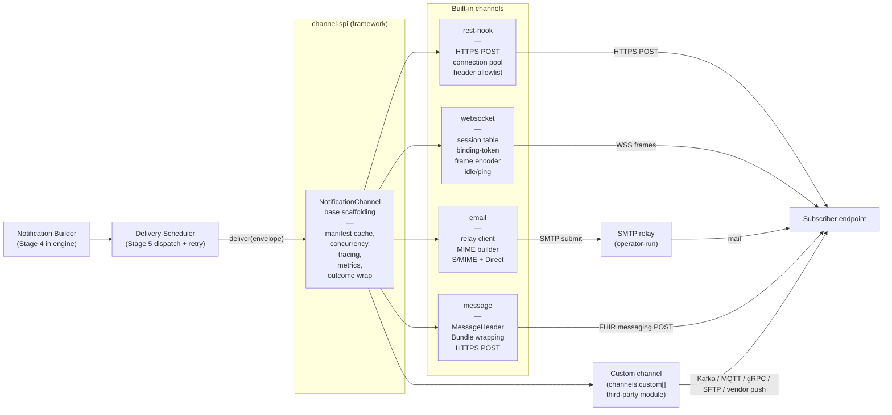
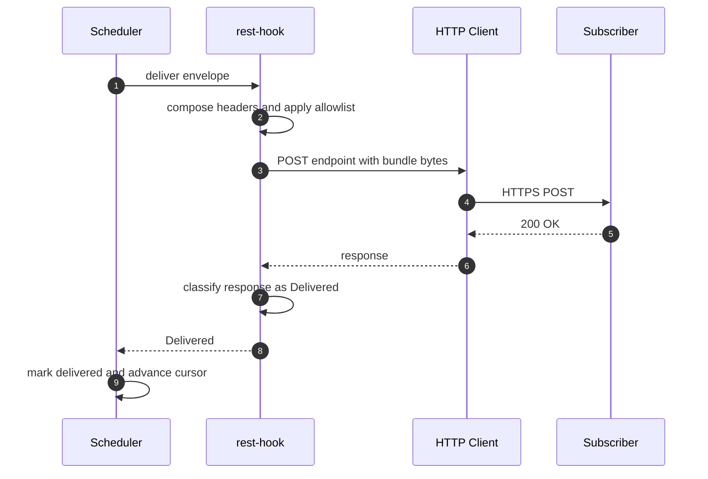
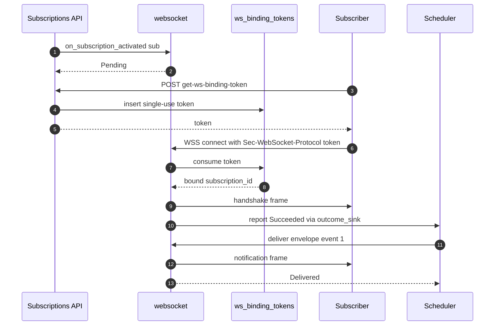
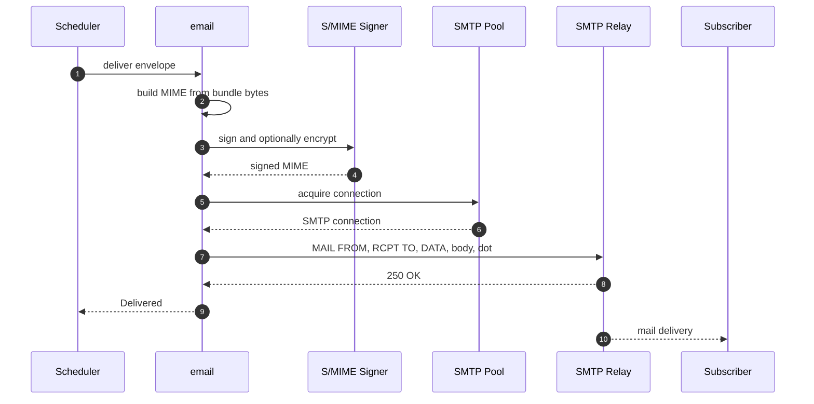

# Channel Modules — Low-Level Design

**Purpose.** This document describes how the Channel SPI and the four built-in channel modules (`rest-hook`, `websocket`, `email`, `message`) are constructed inside `fhir-subscriptions-foss`, in enough detail that an implementor can build them without rereading the higher-level documents. It covers the SPI base scaffolding the framework provides for free, the per-channel internals (connection pools, frame encoders, MIME assembly, MessageHeader construction), the protocol-level retry and timeout configuration each channel owns, the activation handshake each channel performs, the failure mappings that drive the engine's `DeliveryOutcome`, and how a third-party module registers a custom channel.

**Reader's prerequisites.** Read first:

- [`architecture.md`](../architecture.md) sections "Channel SPI", "Notification Construction", and "Email Channel — How Mail Is Sent".
- [`high-level-design/domains/channels.md`](../high-level-design/domains/channels.md) for the domain boundary.
- [`high-level-design/contracts/channel-spi.md`](../high-level-design/contracts/channel-spi.md) and [`high-level-design/contracts/notification-bundle.md`](../high-level-design/contracts/notification-bundle.md) for the SPI signatures and the wire shape.

R5 spec anchors: the [Subscription resource](https://hl7.org/fhir/R5/subscription.html), the [notification model](https://hl7.org/fhir/R5/notifications.html), and the [channel-type code system](https://hl7.org/fhir/R5/codesystem-subscription-channel-type.html).

Two hard rules carry over from the architecture: channels do not build Bundles (Stage 4 does), and channels do not own cross-attempt retry policy (the delivery scheduler does). Channels own protocol-level behavior between an envelope arriving in `deliver()` and the subscriber receiving the bytes — protocol timeouts, in-attempt connection retries, and failure classification.

## 1. Placement

Channels sit between the Notification Builder (Stage 4) and the subscriber. The builder produces a `NotificationEnvelope` carrying an already-serialized Bundle plus per-subscription metadata; the channel turns the envelope into protocol bytes and reports a `DeliveryOutcome`.



The scheduler does not branch on channel type. It calls `deliver(envelope)` on the channel module the subscription is bound to. The channel reference is cached on the subscription's in-memory dispatch entry at activation time so each delivery is one trait dispatch.

## 2. Channel SPI in detail

### 2.1 Manifest

The manifest is queried once at process start and cached on the host. It is pure (no I/O, no clock reads) so the host can call it during config validation, capability-statement assembly, and admission control on subscription create. Full shape:

| Field | Type | Notes |
|---|---|---|
| `id` | `Coding` | `system` + `code`. Built-in channels use `http://terminology.hl7.org/CodeSystem/subscription-channel-type` and the codes `rest-hook`, `websocket`, `email`, `message`. Custom channels MUST use a different system. |
| `name` | string | Operator-facing name. |
| `description` | string | Operator-facing description. |
| `spi_version` | semver string | The Channel SPI major version this channel implements. Used by the host to refuse incompatible channels at load time. |
| `supported_payload_types` | set of `empty`, `id-only`, `full-resource` | The API rejects subscriptions whose `Subscription.content` is outside this set with HTTP 422. |
| `supported_content_types` | set of `application/fhir+json`, `application/fhir+xml`, channel-specific extras | Constrains negotiation at create time. |
| `supported_endpoints` | set of URI schemes | For example, rest-hook = `{https}`, email = `{mailto}`, websocket = `{}` (subscriber-facing endpoint is server-issued, not subscription-supplied). |
| `requires_handshake` | bool | If true, the API drives the channel through `on_subscription_activated` synchronously at create. |
| `supports_heartbeats` | bool | If false, subscriptions setting `heartbeatPeriod` are rejected with HTTP 422. |
| `supports_batching` | bool | If false, subscriptions setting `maxCount > 1` are rejected with HTTP 422. |
| `parameter_schema` | JSON Schema | Validates `Subscription.parameter[]` at create. |
| `config_schema` | JSON Schema | Validates the channel's deployment config block. |
| `default_protocol_timeout` | duration | The base timeout the framework uses on protocol calls when the operator has not overridden it. |

There is one manifest per loaded channel module, including any custom channels in `channels.custom[]`.

### 2.2 Lifecycle hooks

The full SPI surface, with framework-provided semantics:

- `manifest()` — pure. Called at startup, on every subscription create, and during `/metadata` assembly. MUST be cheap; implementors return a cached reference.
- `start(ctx)` — process-level startup. The host injects a `ChannelContext` carrying validated config, an HTTP client, a metrics emitter, a logger, a tracer, and an `outcome_sink` for asynchronous outcomes. Channels allocate pools and open listeners here. Returning an error fails readiness.
- `shutdown()` — process-level teardown, called after the engine has stopped issuing `deliver` calls. Channels close pools, drain in-flight sends, and release sockets, bounded by `lifecycle.shutdown_grace_period` (default 30s).
- `on_subscription_activated(sub)` — per-subscription activation. Returns `Succeeded`, `Failed { reason }`, or `Pending`. Called serially in the API request thread; the handshake timeout is the API response budget.
- `on_subscription_deactivated(sub)` — called on `DELETE` or on a server-side `off` transition. Cleans up per-subscription state. No-op for stateless channels.
- `deliver(envelope)` — the hot path, called concurrently. Channels MUST be thread-safe.
- `send_heartbeat(sub)` — fired on the heartbeat timer. The Bundle is engine-built (`SubscriptionStatus`-only, `type = heartbeat`); the channel emits it like an event-notification with no `notificationEvent` entries. Failure is handled like any failed delivery.

### 2.3 NotificationEnvelope

The envelope is read-only and carries everything the channel needs to deliver:

```
struct NotificationEnvelope {
    subscription_id:        SubscriptionId,
    sequence:               u64,                 // eventsSinceSubscriptionStart for this delivery
    bundle_bytes:           Bytes,               // already serialized in content_type
    bundle_kind:            BundleKind,          // event-notification | heartbeat | handshake | query-status | query-event
    payload_type:           PayloadType,         // empty | id-only | full-resource
    content_type:           ContentType,         // application/fhir+json | application/fhir+xml
    attempt:                u32,                 // 0 for first, increments on retry
    correlation_id:         String,              // tracing across all stages
    subscription_endpoint:  Endpoint,            // resolved Subscription.endpoint
    subscription_parameters: Vec<Param>,         // Subscription.parameter[]
    deadline:               Instant,             // hard wall-clock deadline for this attempt
}
```

`bundle_bytes` is pre-serialized; channels do not parse or re-serialize. They ship the bytes unchanged, regardless of which Bundle variant the engine produced.

`deadline` is `now + per-channel attempt timeout`. Channels set their underlying socket and library timeouts from `deadline - now`; the scheduler does not preempt a running `deliver()`.

### 2.4 DeliveryOutcome and HandshakeOutcome

Both are closed enums. Mapping summary:

- `Delivered` — engine marks the row delivered, advances the cursor, recovers `error` to `active`.
- `TransientFailure { retry_after, reason }` — engine reschedules; `retry_after` is a floor hint.
- `PermanentFailure { reason }` — engine routes to `dead_letters` and may transition to `error` or `off`.

- `Succeeded` — subscription transitions to `active`.
- `Failed { reason }` — subscription stays `requested`; reason is surfaced via `$status`.
- `Pending` — subscription stays `requested`; channel reports the eventual outcome via `outcome_sink`. Email returns `Succeeded` after the relay accepts; `Pending` is reserved for genuinely asynchronous handshakes (websocket).

## 3. SPI base scaffolding (framework's part)

The SPI is not a flat trait. There is a base abstract implementation (`NotificationChannelBase`) that takes care of cross-cutting concerns; channel implementors override only the protocol-specific parts.

What the base provides for free:

- **Manifest caching.** Stores and serves the manifest from cache.
- **Tracing.** Each `deliver()` call is wrapped in an OpenTelemetry span `channel.<id>.deliver` with attributes `subscription.id`, `delivery.attempt`, `payload.type`, `bundle.size_bytes`. The envelope's `correlation_id` flows in as the W3C `traceparent` parent.
- **Metrics.** Counters and histograms: `fhir_subs_channel_deliveries_total`, `fhir_subs_channel_delivery_duration_seconds`, `fhir_subs_channel_handshakes_total`, `fhir_subs_channel_heartbeats_total`, all labeled by `channel` (and outcome where appropriate).
- **Outcome wrapping.** Panics in `deliver_inner()` are caught and surfaced as `TransientFailure("channel panic")`. Repeated panics show as `fhir_subs_channel_panics_total{channel}`.
- **Concurrency primitives.** A per-subscription state map plus an `acquire_subscription_slot()` helper for channels that need per-subscription serialization (websocket uses it; rest-hook does not).
- **Deadline propagation.** `ctx.attempt_deadline()` exposes `envelope.deadline - now`.
- **Default heartbeat.** Synthesizes a heartbeat envelope and routes through `deliver_inner()`. Channels with bespoke heartbeat semantics (websocket WSS-level ping/pong) override.

The implementor MUST override `manifest_inner()`, `start_inner(ctx)`, `shutdown_inner()`, `activate_inner(sub)`, `deactivate_inner(sub)`, and `deliver_inner(envelope, ctx)`. They MAY override `send_heartbeat_inner(sub)` and `classify_failure(error)` (rest-hook and message share a HTTP classifier).

The full pseudo-code for the base scaffolding:

```
abstract class NotificationChannelBase implements NotificationChannel {
    // Set in start(); cleared in shutdown().
    private manifest_cache: ChannelManifest
    private ctx: ChannelContext
    private sub_state: ConcurrentMap<SubscriptionId, PerSubState>

    fn manifest() -> ChannelManifest {
        if (manifest_cache == null) manifest_cache = manifest_inner()
        return manifest_cache
    }

    async fn start(ctx) -> Result<()> {
        this.ctx = ctx
        this.sub_state = new ConcurrentMap()
        result = start_inner(ctx)
        return result
    }

    async fn shutdown() -> Result<()> {
        result = shutdown_inner()
        sub_state.clear()
        return result
    }

    async fn on_subscription_activated(sub) -> HandshakeOutcome {
        sub_state.put(sub.id, new PerSubState(sub))
        if (!manifest().requires_handshake) return Succeeded
        return activate_inner(sub)
    }

    async fn on_subscription_deactivated(sub) -> Result<()> {
        result = deactivate_inner(sub)
        sub_state.remove(sub.id)
        return result
    }

    async fn deliver(envelope) -> DeliveryOutcome {
        span = ctx.tracer.start("channel." + manifest().id.code + ".deliver",
                                envelope.correlation_id)
        timer = ctx.metrics.start_timer("fhir_subs_channel_delivery_duration_seconds",
                                         {"channel": manifest().id.code})
        try {
            attempt_ctx = AttemptCtx {
                deadline: envelope.deadline,
                logger: ctx.logger.with("subscription_id", envelope.subscription_id),
            }
            outcome = deliver_inner(envelope, attempt_ctx)
            ctx.metrics.inc("fhir_subs_channel_deliveries_total",
                            {"channel": manifest().id.code, "outcome": outcome.kind()})
            return outcome
        } catch (panic_or_throw e) {
            ctx.logger.error("channel panic", e, envelope.correlation_id)
            return TransientFailure(retry_after: nil, reason: "channel panic")
        } finally {
            timer.observe()
            span.end()
        }
    }

    async fn send_heartbeat(sub) -> Result<()> {
        if (!manifest().supports_heartbeats) return Ok
        envelope = synthesize_heartbeat_envelope(sub)
        outcome = deliver(envelope)
        return outcome.as_result()
    }
}
```

The implementor's surface is therefore narrow: the four `*_inner` methods plus an optional heartbeat override. Everything else — tracing, metrics, panic recovery, manifest caching, per-subscription state plumbing — is paid for once.

## 4. Built-in channels

The four built-in channels live under `channels/<id>/`. Each is a single module that subclasses `NotificationChannelBase` and overrides the `*_inner` methods. They share the framework's HTTP client (in `infra/http`), the framework's metrics emitter, and the framework's logger; nothing else is shared between them.

### 4.1 rest-hook

The default channel and the most widely deployed. The subscriber registers an `https://...` endpoint; the channel posts the Bundle there.

#### Connection pool

The channel keeps one shared HTTP/2 client built on top of the framework HTTP client, configured at `start()` from `channels.rest_hook.*`. Pool parameters:

- `max_idle_per_host = 16` (default)
- `max_connections_per_host = 64`
- `keep_alive_timeout = 90s`
- `tcp_nodelay = true`
- `tls_min_version = 1.2`

The pool is shared across all rest-hook subscriptions because each subscription is just a different URL. There is no per-subscription pool.

#### Header allowlist

`Subscription.parameter[]` may carry headers the subscriber wants echoed on each POST. The channel filters these against an allowlist and a deny-list before adding them to the request, in this order:

1. **Deny-list** (always rejected, even if the subscriber asks): `Host`, `Content-Length`, `Content-Type`, `Transfer-Encoding`, `Connection`, `Authorization` (the channel sets none — subscribers typically pass their bearer in a custom header), `Cookie`, `Set-Cookie`, `User-Agent` (the channel sets it), `Trace-Parent`, `Trace-State`, `Server`, any `Proxy-*`.
2. **Reserved-prefix deny**: any header beginning with `X-Forwarded-`, `X-Real-`, or `X-Server-` (these are commonly trusted by reverse proxies; the subscriber must not be able to forge them).
3. **Allowlist of recognized FHIR-related headers** (always permitted): `If-Match`, `If-None-Match`, `If-Modified-Since`, `If-None-Exist`, `Prefer`, `X-Request-Id`.
4. **Subscriber-supplied custom headers** (default permitted): any header not on the deny-list and matching `^[A-Za-z][A-Za-z0-9-]*$`. Operators may further constrain via config (`channels.rest_hook.header_allow_pattern`, default unrestricted within rule 4).

A subscriber asking for a deny-listed header at create time receives HTTP 422 with the offending header named.

#### Server-injected headers

On every POST the channel adds:

- `User-Agent: <channels.rest_hook.user_agent>` (default `fhir-subscriptions-foss/<version>`).
- `Content-Type: <envelope.content_type>` (`application/fhir+json` or `application/fhir+xml`).
- `Accept: application/fhir+json, application/fhir+xml; q=0.9` so the subscriber can return an OperationOutcome on error.
- `traceparent`: the W3C trace context derived from `correlation_id`.
- `X-Subscription-Id: <envelope.subscription_id>`.
- `X-Subscription-Event-Number: <envelope.sequence>` (when the Bundle is event-notification).
- `X-Attempt: <envelope.attempt>`.

#### Request building and timeout

The channel constructs an HTTP `POST <Subscription.endpoint>` with the headers above and `envelope.bundle_bytes` as the body. The total wall-clock budget is `min(channels.rest_hook.request_timeout, envelope.deadline - now)`; this is split across DNS, TCP, TLS, request, and response read using the framework HTTP client's deadline semantics.

Inside one attempt, the channel applies a small protocol-level retry only for failures that happen *before* the request reaches the server: connection refused on a fresh socket, TLS handshake failure, idempotent connection reset before any byte was sent. Up to 2 in-attempt reconnect retries with 100ms / 300ms backoff. Failures from the server (any HTTP status) are not retried inside the attempt — that is the scheduler's job.

#### Response classification

```
HTTP 200..=299                                  -> Delivered
HTTP 408 (Request Timeout)                      -> TransientFailure(retry_after = none)
HTTP 429 (Too Many Requests)                    -> TransientFailure(retry_after = parse Retry-After)
HTTP 5xx                                        -> TransientFailure(retry_after = parse Retry-After if present)
HTTP 4xx (other)                                -> PermanentFailure
TLS handshake error                             -> TransientFailure
DNS NXDOMAIN                                    -> PermanentFailure
DNS SERVFAIL / TIMEOUT                          -> TransientFailure
TCP connect refused                             -> TransientFailure
TCP RST mid-request                             -> TransientFailure
Read/write timeout                              -> TransientFailure
Body decode failure (unexpected — body ignored) -> Delivered (the subscriber said 2xx)
```

`Retry-After` (RFC 7231) is parsed for both the seconds form and the HTTP-date form. The parsed duration is passed to the scheduler verbatim as `retry_after`.

#### Activation handshake

At subscription activation the channel POSTs a handshake Bundle (built by the engine, `SubscriptionStatus`-only, `type = handshake`) using the same path as `deliver_inner`. The handshake's wall-clock budget is `channels.rest_hook.handshake_timeout` (default 10s). A `2xx` response → `HandshakeOutcome::Succeeded`. Any other classification → `Failed { reason: "<status> <body excerpt>" }`. The body excerpt is bounded at 256 bytes for log safety.

The architecture's preference for an HTTP HEAD/POST probe on the endpoint before sending a Bundle is captured here as a single POST of the handshake Bundle; the Bundle itself is small enough that a separate HEAD adds no value, and the POST is the spec's mechanism.

#### Heartbeats

A heartbeat is identical to a delivery except the Bundle has no `notificationEvent`. The channel reuses `deliver_inner()`. By default the `User-Agent` and other server-injected headers are unchanged.

#### Pseudo-code

```
class RestHookChannel extends NotificationChannelBase {

    private http: HttpClient
    private allowed_headers: HeaderPolicy

    fn manifest_inner() -> ChannelManifest {
        return ChannelManifest {
            id: Coding(SUBSCRIPTION_CHANNEL_TYPE_SYSTEM, "rest-hook"),
            name: "REST Hook",
            spi_version: "1.0",
            supported_payload_types: {empty, id_only, full_resource},
            supported_content_types: {fhir_json, fhir_xml},
            supported_endpoints: {"https"},
            requires_handshake: true,
            supports_heartbeats: true,
            supports_batching: true,
            parameter_schema: REST_HOOK_PARAMETER_SCHEMA,
            config_schema: REST_HOOK_CONFIG_SCHEMA,
            default_protocol_timeout: 30s,
        }
    }

    async fn start_inner(ctx) -> Result<()> {
        cfg = ctx.config.rest_hook
        http = ctx.http.with({
            request_timeout: cfg.request_timeout,
            max_idle_per_host: cfg.max_idle_per_host,
            max_connections_per_host: cfg.max_connections_per_host,
            keep_alive_timeout: 90s,
            tls_min_version: TLS_1_2,
        })
        allowed_headers = HeaderPolicy.compile(cfg.header_allow_pattern)
        return Ok
    }

    async fn shutdown_inner() -> Result<()> {
        http.close()
        return Ok
    }

    async fn activate_inner(sub) -> HandshakeOutcome {
        envelope = build_handshake_envelope(sub)
        outcome = post_envelope(envelope, timeout = handshake_timeout)
        match outcome {
            Delivered                     -> Succeeded
            TransientFailure(_, reason)   -> Failed("transient: " + reason)
            PermanentFailure(reason)      -> Failed(reason)
        }
    }

    async fn deactivate_inner(sub) -> Result<()> {
        // No per-subscription state in the channel.
        return Ok
    }

    async fn deliver_inner(envelope, ctx) -> DeliveryOutcome {
        return post_envelope(envelope, timeout = ctx.attempt_deadline())
    }

    async fn post_envelope(envelope, timeout) -> DeliveryOutcome {
        url = envelope.subscription_endpoint.url
        if (!url.startsWith("https://")) {
            return PermanentFailure("non-https endpoint")
        }
        headers = compose_headers(envelope)
        try {
            resp = http.post(url, headers, envelope.bundle_bytes,
                             timeout: timeout,
                             reconnect_retries: 2)
            return classify_http_response(resp)
        } catch (NetworkError e) {
            return classify_network_error(e)
        }
    }

    fn compose_headers(envelope) -> Headers {
        h = Headers()
        h.set("User-Agent", config.user_agent)
        h.set("Content-Type", envelope.content_type.to_string())
        h.set("Accept", "application/fhir+json, application/fhir+xml;q=0.9")
        h.set("traceparent", envelope.correlation_id.as_traceparent())
        h.set("X-Subscription-Id", envelope.subscription_id.to_string())
        h.set("X-Attempt", envelope.attempt.to_string())
        if (envelope.bundle_kind == event_notification) {
            h.set("X-Subscription-Event-Number", envelope.sequence.to_string())
        }
        for (p in envelope.subscription_parameters) {
            if (allowed_headers.permit(p.name)) {
                h.set(p.name, p.value)
            } else {
                ctx.metrics.inc("fhir_subs_rest_hook_headers_filtered_total", {"name": p.name})
            }
        }
        return h
    }

    fn classify_http_response(resp) -> DeliveryOutcome {
        if (200 <= resp.status && resp.status < 300) return Delivered
        if (resp.status == 408) return TransientFailure(none, "408 Request Timeout")
        if (resp.status == 429) return TransientFailure(parse_retry_after(resp), "429")
        if (resp.status >= 500)  return TransientFailure(parse_retry_after(resp), "5xx " + resp.status)
        return PermanentFailure(resp.status + " " + truncate(resp.body, 256))
    }

    fn classify_network_error(e) -> DeliveryOutcome {
        match e.kind {
            DnsNxDomain                -> PermanentFailure("dns nxdomain")
            DnsServFail | DnsTimeout   -> TransientFailure(none, "dns " + e.kind)
            ConnectRefused             -> TransientFailure(none, "connect refused")
            ConnectionReset            -> TransientFailure(none, "connection reset")
            TlsHandshake               -> TransientFailure(none, "tls handshake: " + e.detail)
            ReadTimeout | WriteTimeout -> TransientFailure(none, "i/o timeout")
            _                          -> TransientFailure(none, "io: " + e.kind)
        }
    }
}
```

### 4.2 websocket

The websocket channel runs a server-side WSS endpoint. Subscribers connect to it after acquiring a short-lived binding token via the `$get-ws-binding-token` operation. Each subscription has at most one bound connection at a time; multiple subscribers for the same subscription is a configuration error and the second connection is rejected.

#### Session table

A process-wide concurrent map keyed by `subscription_id`:

```
struct WsSession {
    subscription_id:   SubscriptionId,
    socket:            WebSocketSocket,
    bound_at:          Instant,
    last_activity:     AtomicInstant,
    pending:           BoundedQueue<NotificationEnvelope>,  // queued during reconnect
    send_lock:         Mutex,                               // serializes frames per subscription
    closing:           AtomicBool,
}
```

Concurrency rule: deliveries on a given subscription serialize through `send_lock` so frames go out in `eventNumber` order. The base's `acquire_subscription_slot()` helper is used.

#### Binding-token flow

1. Subscriber calls `POST /Subscription/{id}/$get-ws-binding-token` with their bearer token.
2. The Subscriptions API mints a token: a random 32-byte value, base64url-encoded, with metadata `{subscription_id, expires_at}` written to a Postgres `ws_binding_tokens` table. TTL = `channels.websocket.binding_token_ttl` (default 60s).
3. Subscriber opens a WSS connection to `wss://<host>/ws/subscriptions` and presents the token in the `Sec-WebSocket-Protocol` header (per the spec's recommendation).
4. The channel's `start_inner` registered a request handler for that path. On upgrade, the handler reads the token, looks it up in the table, validates expiry, and (if valid) consumes the token (single-use) and binds the socket to the subscription in the session table.
5. The channel emits the handshake frame on the bound socket and transitions the subscription's status accordingly.

If validation fails (expired, unknown, already-used, subscription not in `requested`/`active`), the handler closes the socket with WS code 1008 (policy violation) and the subscription stays in `requested`.

#### Frame encoding

Each notification is one binary or text frame. The channel uses text frames for `application/fhir+json` and `application/fhir+xml` (both UTF-8 text per their MIME definitions). Frame body is `envelope.bundle_bytes` verbatim. Maximum frame size is `channels.websocket.max_frame_bytes` (default 8 MiB); a Bundle larger than the limit returns `PermanentFailure("frame too large")`.

The channel does not split a Bundle across frames — one Bundle, one frame, even when batching produces a large Bundle. Subscribers that need very large batches should configure smaller `Subscription.maxCount`.

#### Idle and ping management

Two timers per session:

- **Ping timer** at `channels.websocket.ping_interval` (default 30s). On expiry, send a WSS ping frame; record the pong arrival time on `last_activity`.
- **Idle timer** at `channels.websocket.idle_timeout` (default 5 minutes). If `now - last_activity > idle_timeout`, close the socket with WS code 1001 (going away). The subscriber is expected to reconnect via a fresh `$get-ws-binding-token`.

Disconnect handling: when a socket closes, the session is removed from the table, and the subscription's `deliveries` rows continue to accumulate while disconnected. The subscriber catches up by reconnecting and pulling missed events via `$events` (the channel does not replay queued frames after a disconnect — the durable cursor is the source of truth; this behavior is the architecture's explicit choice).

#### Activation handshake

The activation handshake for websocket is split: the API call accepts the subscription with `requires_handshake = true`, but the channel's `activate_inner` returns `Pending` because the handshake completes only when the subscriber actually binds a connection. The status is `requested` until the first successful frame delivery, at which point the channel notifies the engine via `outcome_sink` with `HandshakeOutcome::Succeeded`. If the binding token expires before being used, the API surfaces a 408-style error on `$status`.

This is the only built-in channel that returns `Pending`. All other built-ins are synchronous-handshake.

#### Heartbeats

Two layers:

1. **Application-level heartbeat** — a heartbeat Bundle frame, sent at `Subscription.heartbeatPeriod`. Reuses `deliver_inner`.
2. **Protocol-level ping/pong** — independent of the application-level heartbeat. Used to detect dead connections, not to satisfy the spec's heartbeat requirement.

#### Failure mapping

```
Frame sent successfully, no error              -> Delivered
Socket not bound (subscriber disconnected)     -> TransientFailure(retry_after = bind_wait, reason = "no socket")
send_lock acquisition timed out                -> TransientFailure(retry_after = none, reason = "lock timeout")
Frame too large                                -> PermanentFailure("frame size exceeds max_frame_bytes")
Underlying TCP/TLS write error                 -> TransientFailure(retry_after = none, reason = "i/o")
Subscription closed mid-send                   -> PermanentFailure("subscription closed")
```

`bind_wait` is the configured `channels.websocket.transient_retry_after` (default 30s). On miss, the channel returns `TransientFailure { retry_after }` and the scheduler applies its standard retry policy ([decisions/0008](../high-level-design/decisions/0008-resolved-design-questions.md#17)) — no WSS-specific reconnect-grace coupling.

#### Pseudo-code

```
class WebSocketChannel extends NotificationChannelBase {

    private sessions: ConcurrentMap<SubscriptionId, WsSession>
    private upgrade_handler: HttpUpgradeHandler

    fn manifest_inner() -> ChannelManifest {
        return ChannelManifest {
            id: Coding(SUBSCRIPTION_CHANNEL_TYPE_SYSTEM, "websocket"),
            name: "WebSocket",
            spi_version: "1.0",
            supported_payload_types: {empty, id_only, full_resource},
            supported_content_types: {fhir_json, fhir_xml},
            supported_endpoints: {},   // server-side endpoint
            requires_handshake: true,
            supports_heartbeats: true,
            supports_batching: true,
            parameter_schema: empty_schema,
            config_schema: WEBSOCKET_CONFIG_SCHEMA,
            default_protocol_timeout: 10s,
        }
    }

    async fn start_inner(ctx) -> Result<()> {
        cfg = ctx.config.websocket
        sessions = new ConcurrentMap()
        upgrade_handler = ctx.http_server.register_upgrade("/ws/subscriptions",
                                                            on_upgrade)
        spawn_ping_task(cfg.ping_interval)
        spawn_idle_task(cfg.idle_timeout)
        return Ok
    }

    async fn on_upgrade(req, sock) -> () {
        token = req.headers["Sec-WebSocket-Protocol"]
        record = ws_binding_token_repo.consume(token)   // single-use
        if (record == nil || record.expired() ||
            record.subscription.status not in {requested, active}) {
            sock.close(1008, "policy")
            return
        }
        session = WsSession.new(record.subscription_id, sock)
        existing = sessions.put_if_absent(record.subscription_id, session)
        if (existing != nil) {
            sock.close(1008, "already bound")
            return
        }
        await emit_handshake_frame(session)
        ctx.outcome_sink.report(record.subscription_id, HandshakeOutcome.Succeeded)
        run_session_loop(session)
    }

    async fn deliver_inner(envelope, ctx) -> DeliveryOutcome {
        sub_id = envelope.subscription_id
        session = sessions.get(sub_id)
        if (session == nil) {
            // Subscriber not currently bound. Standard transient failure;
            // the scheduler applies its retry policy.
            return TransientFailure(retry_after = config.transient_retry_after,
                                    reason = "no socket")
        }
        if (envelope.bundle_bytes.len > config.max_frame_bytes) {
            return PermanentFailure("frame size exceeds max_frame_bytes")
        }
        try {
            with session.send_lock(timeout = ctx.attempt_deadline()):
                session.socket.send_text(envelope.bundle_bytes)
                session.last_activity.store(now())
            return Delivered
        } catch (LockTimeout) {
            return TransientFailure(none, "send_lock timeout")
        } catch (SocketClosed) {
            sessions.remove(sub_id)
            return TransientFailure(config.transient_retry_after,
                                    "socket closed mid-send")
        } catch (IoError e) {
            return TransientFailure(none, "i/o: " + e.kind)
        }
    }

    async fn activate_inner(sub) -> HandshakeOutcome {
        // Handshake completes when the subscriber binds.
        return Pending
    }

    async fn deactivate_inner(sub) -> Result<()> {
        session = sessions.remove(sub.id)
        if (session != nil) session.socket.close(1000, "deactivated")
        return Ok
    }

    async fn shutdown_inner() -> Result<()> {
        for (s in sessions.values()) s.socket.close(1001, "going away")
        sessions.clear()
        return Ok
    }
}
```

### 4.3 email

**v1 ships plain SMTP / SMTPS only.** S/MIME and Direct modes are documented for v2; the `mode` config field accepts only `"smtp"` in v1. See [decisions/0010 #5](../high-level-design/decisions/0010-implementation-defaults.md).

The email channel is an SMTP submission client. The full architectural background — SMTP / S/MIME / Direct mode selection, certificate handling, trust bundle resolution — is in [`architecture.md` "Email Channel — How Mail Is Sent"](../architecture.md#email-channel--how-mail-is-sent) and is not duplicated here. This LLD covers what the implementor needs to build the channel.

#### Relay client

At `start()`, the channel allocates an SMTP connection pool sized at `channels.email.smtp.pool_size` (default 4). Each connection is held in the pool with `keepalive` between submissions and is recreated on connection loss.

```
struct SmtpPool {
    host: String,
    port: u16,
    starttls: enum { Required, Preferred, Disabled },
    auth: SmtpAuth,
    timeout: Duration,
    pool: BoundedPool<SmtpConnection>,
}
```

For S/MIME and Direct modes, the channel also holds:

- `signing_cert`, `signing_key` from configured files (loaded at start, refreshed on `SIGHUP`).
- `recipient_cert_resolver` — `static` (preconfigured map of address to cert) or `lookup` (LDAP for S/MIME, HISP DNS/LDAP for Direct).
- A trust bundle (`hisp_trust_bundle` for Direct mode), refreshed periodically.

#### MIME assembly

Per delivery the channel composes a MIME message:

```
From:    <channels.email.from>
To:      <Subscription.endpoint without the "mailto:" prefix>
Subject: <subject_template formatted with topic, eventNumber>
Message-ID: <generated; correlation_id is included>
Date:    <RFC 5322 now>
MIME-Version: 1.0
```

Body construction depends on the inline-vs-attachment rule:

- If `envelope.bundle_bytes.len <= channels.email.body.attachment_threshold_bytes` (default 65536 bytes): single-part body with `Content-Type: <envelope.content_type>` and the Bundle as the body.
- If above the threshold (typical for `full-resource` payloads): `multipart/mixed` with a short text part ("FHIR Subscription notification ...") plus an attached part with `Content-Type: <envelope.content_type>; name="notification.json|.xml"`, `Content-Disposition: attachment`, and `Content-Transfer-Encoding: base64`.

#### S/MIME and Direct cert handling

**v2 — not in v1.** When mode is `smime` or `direct`, the channel wraps the MIME message in `application/pkcs7-mime`:

- **Sign** with `signing_cert` + `signing_key` (always for both modes).
- **Encrypt** to recipient certs when configured. In `smime` mode this is conditional on the recipient cert being known; in `direct` mode encryption is required (per Direct rules) and a missing recipient cert is a `PermanentFailure("no Direct cert for <addr>")` before submit.

The cryptographic specifics — exact MIME wrapping, OIDs, trust-anchor validation — are deferred to the architecture and to the chosen S/MIME library; this LLD specifies only the framework's call sites.

#### Submission

The channel acquires a connection from the pool, runs the SMTP envelope (`MAIL FROM`, `RCPT TO`, `DATA`, `.`), and observes the response code. For STARTTLS, the connection upgrades on the first `EHLO` if the server advertises `STARTTLS` (and the mode requires it). Auth runs after STARTTLS using the configured mechanism.

#### Activation handshake

The architecture treats email as a one-shot delivery: the channel sends a probe message (the engine builds a `SubscriptionStatus`-only handshake Bundle as for any other channel) and reports `HandshakeOutcome::Succeeded` when the relay accepts it (`250 OK` on `DATA`). A relay rejection at handshake is `Failed { reason }`. The probe goes out as a normal email.

#### Heartbeats

Email subscribers do not get heartbeats by default. The architecture's decision is captured here as: the channel manifest declares `supports_heartbeats: true` so the subscriber may explicitly opt in by setting `Subscription.heartbeatPeriod`, but the API rejects `heartbeatPeriod` shorter than `channels.email.min_heartbeat_period` (default 24h). With no `heartbeatPeriod`, no heartbeats are sent.

#### Failure mapping

```
SMTP 2xx after DATA (typically 250)            -> Delivered
SMTP 4xx (any 4xx code after MAIL/RCPT/DATA)   -> TransientFailure(retry_after = none, reason)
SMTP 5xx (any 5xx code)                        -> PermanentFailure(reason)
TCP connect refused / TLS handshake failure    -> TransientFailure(retry_after = none, reason)
STARTTLS required but unsupported              -> PermanentFailure("starttls required by config")
SMTP AUTH failure (5xx)                        -> PermanentFailure("smtp auth failed")
S/MIME signing failure                         -> PermanentFailure("smime sign: " + reason)
Recipient cert missing (Direct, mode = direct) -> PermanentFailure("no Direct cert for " + addr)
```

Asynchronous bounces (DSN) are out of scope for v1. Operators monitor relay bounce reports separately.

#### Pseudo-code

```
class EmailChannel extends NotificationChannelBase {

    private smtp_pool: SmtpPool
    private mode: enum { Smtp, Smime, Direct }
    private signer: Option<SmimeSigner>
    private cert_resolver: Option<RecipientCertResolver>

    fn manifest_inner() -> ChannelManifest {
        return ChannelManifest {
            id: Coding(SUBSCRIPTION_CHANNEL_TYPE_SYSTEM, "email"),
            name: "Email",
            spi_version: "1.0",
            supported_payload_types: {empty, id_only, full_resource},
            supported_content_types: {fhir_json, fhir_xml},
            supported_endpoints: {"mailto"},
            requires_handshake: true,
            supports_heartbeats: true,
            supports_batching: true,
            parameter_schema: EMAIL_PARAMETER_SCHEMA,
            config_schema: EMAIL_CONFIG_SCHEMA,
            default_protocol_timeout: 30s,
        }
    }

    async fn start_inner(ctx) -> Result<()> {
        cfg = ctx.config.email
        if (!cfg.enabled) return Ok
        mode = cfg.mode
        smtp_pool = SmtpPool.open(cfg.smtp)
        if (mode in {Smime, Direct}) {
            signer = SmimeSigner.load(cfg.smime.signing_cert_file,
                                      cfg.smime.signing_key_file)
            cert_resolver = build_cert_resolver(cfg, mode)
        }
        return Ok
    }

    async fn shutdown_inner() -> Result<()> {
        smtp_pool.close()
        return Ok
    }

    async fn activate_inner(sub) -> HandshakeOutcome {
        envelope = build_handshake_envelope(sub)
        outcome = submit_email(envelope, sub.endpoint)
        match outcome {
            Delivered                  -> Succeeded
            TransientFailure(_, r)     -> Failed("transient: " + r)
            PermanentFailure(r)        -> Failed(r)
        }
    }

    async fn deactivate_inner(sub) -> Result<()> {
        return Ok    // no per-subscription state
    }

    async fn deliver_inner(envelope, ctx) -> DeliveryOutcome {
        addr = parse_mailto(envelope.subscription_endpoint)
        if (addr == nil) return PermanentFailure("invalid mailto endpoint")
        return submit_email(envelope, addr)
    }

    async fn submit_email(envelope, addr) -> DeliveryOutcome {
        try {
            mime = build_mime(envelope, addr)
            if (mode in {Smime, Direct}) {
                cert = cert_resolver.resolve(addr)
                if (mode == Direct && cert == nil) {
                    return PermanentFailure("no Direct cert for " + addr)
                }
                mime = signer.sign_and_optionally_encrypt(mime, cert)
            }
            with smtp_pool.acquire() as conn:
                resp = conn.submit(from = config.from, to = addr, body = mime,
                                   timeout = ctx.attempt_deadline())
            return classify_smtp_response(resp)
        } catch (CertificateError e) {
            return PermanentFailure("smime: " + e.kind)
        } catch (SmtpProtocolError e) {
            return classify_smtp_error(e)
        } catch (NetworkError e) {
            return TransientFailure(none, "network: " + e.kind)
        }
    }

    fn build_mime(envelope, addr) -> Bytes {
        // Compose headers, body, possibly multipart.
        h = Headers()
        h.set("From", config.from)
        h.set("To", addr)
        h.set("Subject", render_subject(envelope))
        h.set("Message-ID", new_message_id(envelope.correlation_id))
        h.set("Date", rfc5322_now())
        h.set("MIME-Version", "1.0")
        body = if (envelope.bundle_bytes.len <= config.body.attachment_threshold_bytes) {
            single_part(envelope.content_type, envelope.bundle_bytes)
        } else {
            multipart_with_attachment(envelope.content_type, envelope.bundle_bytes)
        }
        return assemble_mime(h, body)
    }

    fn classify_smtp_response(resp) -> DeliveryOutcome {
        if (resp.code >= 200 && resp.code < 300) return Delivered
        if (resp.code >= 400 && resp.code < 500) return TransientFailure(none, resp.code + " " + resp.text)
        return PermanentFailure(resp.code + " " + resp.text)
    }
}
```

### 4.4 message

The `message` channel is a thin variant of `rest-hook` that wraps the `subscription-notification` Bundle in a FHIR messaging envelope: a `MessageHeader` resource as the first entry, with the `subscription-notification` Bundle's entries following. The wire is HTTPS POST of a Bundle.

The Notification Builder still produces the `subscription-notification` Bundle in the standard shape (per [`notification-bundle.md`](../high-level-design/contracts/notification-bundle.md)). The `message` channel does not modify that Bundle; it constructs an outer FHIR `Bundle.type = message` whose first entry is a `MessageHeader` and whose subsequent entries reference the `subscription-notification` Bundle. The `MessageHeader` carries:

- `eventCoding` — a Coding identifying the event type. Per [decisions/0008](../high-level-design/decisions/0008-resolved-design-questions.md#13): `system = "http://terminology.hl7.org/CodeSystem/subscription-notification-type"` (the same code system the spec uses for `SubscriptionStatus.type`), `code` = the matching notification-type code (`event-notification`, `heartbeat`, `handshake`, `query-status`, or `query-event`). The topic URL is in the wrapped `SubscriptionStatus.topic`; subscribers do not need it on the MessageHeader.
- `source.endpoint` — the server's identity URI (`config.deployment.facility_id` lifted into a URI).
- `destination[0].endpoint` — the subscription's endpoint URL.
- `focus` — Reference to the inner `subscription-notification` Bundle (carried as a contained or co-bundled resource).

The channel re-serializes the outer Bundle in `envelope.content_type`. This is the only built-in channel that does any serialization; it does so because the wrapping is required by the FHIR messaging interaction. The original `bundle_bytes` is parsed (one parse per delivery) into a typed Bundle, wrapped, then re-serialized — see Open Questions.

The HTTP transport reuses the rest-hook channel's request building, header policy, and response classification helpers via a shared `HttpDelivery` module under `channels/http_common`.

#### Heartbeats

Same as rest-hook: a heartbeat is a normal POST whose inner `subscription-notification` Bundle has `type = heartbeat` and no `notificationEvent`. The MessageHeader's `eventCoding` carries `system = "http://terminology.hl7.org/CodeSystem/subscription-notification-type"`, `code = "heartbeat"`.

#### Failure mapping

Identical to rest-hook (see 4.1). The two channels share the HTTP classifier.

#### Pseudo-code

```
class MessageChannel extends NotificationChannelBase {

    private http_delivery: HttpDelivery       // shared with rest-hook

    fn manifest_inner() -> ChannelManifest {
        return ChannelManifest {
            id: Coding(SUBSCRIPTION_CHANNEL_TYPE_SYSTEM, "message"),
            name: "FHIR Messaging",
            spi_version: "1.0",
            supported_payload_types: {empty, id_only, full_resource},
            supported_content_types: {fhir_json, fhir_xml},
            supported_endpoints: {"https"},
            requires_handshake: true,
            supports_heartbeats: true,
            supports_batching: true,
            parameter_schema: MESSAGE_PARAMETER_SCHEMA,
            config_schema: MESSAGE_CONFIG_SCHEMA,
            default_protocol_timeout: 30s,
        }
    }

    async fn start_inner(ctx) -> Result<()> {
        http_delivery = HttpDelivery.from(ctx, config.message)
        return Ok
    }

    async fn deliver_inner(envelope, ctx) -> DeliveryOutcome {
        wrapped = wrap_in_message_bundle(envelope)
        return http_delivery.post(envelope.subscription_endpoint,
                                  envelope.subscription_parameters,
                                  envelope.content_type,
                                  wrapped,
                                  ctx.attempt_deadline())
    }

    fn wrap_in_message_bundle(envelope) -> Bytes {
        inner = parse_bundle(envelope.bundle_bytes, envelope.content_type)
        // Per [decisions/0008](../high-level-design/decisions/0008-resolved-design-questions.md#13):
        // eventCoding.system is the spec's notification-type code system,
        // and the code is the matching SubscriptionStatus.type value
        // ("event-notification", "heartbeat", "handshake", "query-status",
        // "query-event"). The notification-type comes from the inner
        // SubscriptionStatus.type which is always the first entry.
        sub_status = inner.entry[0].resource          // SubscriptionStatus
        header = MessageHeader {
            eventCoding: Coding {
                system: "http://terminology.hl7.org/CodeSystem/subscription-notification-type",
                code:   sub_status.type,              // event-notification | heartbeat | ...
            },
            source: { endpoint: server_endpoint() },
            destination: [{ endpoint: envelope.subscription_endpoint.url }],
            focus: [Reference("Bundle/" + inner.id)],
        }
        outer = Bundle {
            type: "message",
            timestamp: now(),
            entry: [{ resource: header }] + inner.entry,
        }
        return serialize(outer, envelope.content_type)
    }

    async fn activate_inner(sub) -> HandshakeOutcome {
        envelope = build_handshake_envelope(sub)
        outcome = deliver_inner(envelope, AttemptCtx.fresh(handshake_timeout))
        return handshake_outcome_from(outcome)
    }
}
```

## 5. Custom channel registration

A custom channel is a third-party module compiled into the container image at build time. Loading is by configuration:

```yaml
channels:
  custom:
    - id: "kafka"
      module: "channels/kafka"
      config:
        brokers: ["kafka-1:9092", "kafka-2:9092"]
        topic_prefix: "fhir-subs"
        auth:
          mechanism: "SASL_SSL"
          username: "${env:KAFKA_USER}"
          password: "${env:KAFKA_PASSWORD}"
```

At startup the host:

1. Iterates `channels.custom[]`.
2. For each entry, looks up the named module in the compiled-in registry. (Build-time inclusion is required in v1; runtime plugin loading is a stretch goal in `architecture.md` "Out of Scope".)
3. Instantiates the channel and calls `manifest()`.
4. Validates `entry.config` against `manifest.config_schema`.
5. Refuses to start if the channel's `id.system` is the standard subscription-channel-type system (only the four built-ins may use that system; custom channels must use their own).
6. Calls `start(ctx)` with a `ChannelContext` carrying the validated config.
7. Includes the channel's coding in the dynamically-built `CapabilityStatement` so subscribers can discover it.

Custom channels follow the same SPI and the same lifecycle. Nothing in the engine, scheduler, API, or storage layer changes when a custom channel is added.

The version compatibility check at load time compares `manifest.spi_version` against the host's supported SPI versions. A channel built against a newer major SPI is rejected with a startup error.

## 6. Sequence diagrams

### 6.1 rest-hook delivery happy path



### 6.2 websocket subscription activation and first delivery



### 6.3 email delivery via SMTP relay



(The mail-to-subscriber leg is asynchronous and out of the channel's responsibility. Bounce DSNs are out of scope for v1.)

## 7. Failure handling

Each channel classifies its own failures into `DeliveryOutcome`. `TransientFailure { retry_after }` is honored by the scheduler as a floor; `PermanentFailure` routes to dead-letter. Per-channel matrices are in section 11. Shared properties:

- Channels do not retry across attempts. The scheduler does.
- A channel may do bounded in-attempt retries (rest-hook does up to 2 reconnects). One in-attempt retry block counts as one scheduler attempt.
- Panics are caught and surfaced as `TransientFailure("channel panic")`.
- The error/off state machine (consecutive `PermanentFailure` after `delivery.retry.max_attempts`, default 8) is engine policy, not channel policy.

## 8. Configuration

Per-channel configuration knobs are defined in `architecture.md` "Configuration" under `channels.*`. This LLD does not restate them — operators read the architecture's YAML example and the per-channel manifest's `config_schema`. Keys this LLD relies on:

- `channels.rest_hook.{request_timeout, max_retries (advisory), backoff (advisory), user_agent, header_allow_pattern, max_idle_per_host, max_connections_per_host, handshake_timeout}`
- `channels.websocket.{enabled, max_connections, ping_interval, idle_timeout, binding_token_ttl, max_frame_bytes, transient_retry_after}`
- `channels.email.{enabled, mode, from, smtp.*, smime.*, direct.*, body.attachment_threshold_bytes, min_heartbeat_period}`
- `channels.message.{request_timeout, user_agent}` (delegates to `channels.rest_hook` defaults where unset)
- `channels.custom[]` per the YAML example.

Channels do not own retry curve or backoff; the engine does (`delivery.retry.*`).

## 9. Metrics

Each channel emits, in addition to the framework-provided base metrics:

| Metric | Type | Labels | Channels |
|---|---|---|---|
| `fhir_subs_channel_deliveries_total` | counter | `channel`, `outcome` | all (base) |
| `fhir_subs_channel_delivery_duration_seconds` | histogram | `channel` | all (base) |
| `fhir_subs_channel_handshakes_total` | counter | `channel`, `outcome` | all (base) |
| `fhir_subs_channel_heartbeats_total` | counter | `channel`, `outcome` | all (base) |
| `fhir_subs_channel_panics_total` | counter | `channel` | all (base) |
| `fhir_subs_rest_hook_status_total` | counter | `status_class` (`2xx`/`3xx`/`4xx`/`5xx`/`network`) | rest-hook, message |
| `fhir_subs_rest_hook_headers_filtered_total` | counter | `name` | rest-hook |
| `fhir_subs_websocket_sessions` | gauge | `state` (`bound`, `pending`) | websocket |
| `fhir_subs_websocket_pings_total` | counter | `outcome` (`pong_received`, `pong_timeout`) | websocket |
| `fhir_subs_websocket_frame_bytes` | histogram | none | websocket |
| `fhir_subs_websocket_disconnects_total` | counter | `code`, `reason` | websocket |
| `fhir_subs_email_smtp_responses_total` | counter | `class` (`2xx`/`4xx`/`5xx`/`io`) | email |
| `fhir_subs_email_smtp_pool_in_use` | gauge | none | email |
| `fhir_subs_email_smime_failures_total` | counter | `kind` (`sign`, `encrypt`, `cert_missing`) | email |
| `fhir_subs_message_wrapping_duration_seconds` | histogram | none | message |

Latency is end-to-end from `deliver()` entry to `DeliveryOutcome` return, not protocol-level latency, so an outcome of `TransientFailure` after a 30s timeout shows up as a 30s-bucket sample.

## 10. Error handling matrix

(For convenience; the prose above is canonical.)

### rest-hook

| Cause | Outcome |
|---|---|
| 2xx | Delivered |
| 408, 429 | TransientFailure (Retry-After honored) |
| 5xx | TransientFailure |
| Other 4xx | PermanentFailure |
| TLS / TCP / DNS-timeout / RST | TransientFailure |
| DNS NXDOMAIN | PermanentFailure |
| Non-https endpoint | PermanentFailure |

### websocket

| Cause | Outcome |
|---|---|
| Frame sent successfully | Delivered |
| No bound socket | TransientFailure (retry_after = transient_retry_after) |
| Frame size > max | PermanentFailure |
| send_lock timeout | TransientFailure |
| Socket closed mid-send | TransientFailure |
| Underlying I/O error | TransientFailure |
| Subscription closed | PermanentFailure |

### email

| Cause | Outcome |
|---|---|
| 250 after DATA | Delivered |
| Any 4xx | TransientFailure |
| Any 5xx | PermanentFailure |
| TCP / TLS error | TransientFailure |
| STARTTLS required but unsupported by relay | PermanentFailure |
| SMTP AUTH 5xx | PermanentFailure |
| S/MIME sign failure | PermanentFailure |
| Direct mode and no recipient cert | PermanentFailure |
| Invalid mailto endpoint | PermanentFailure |

### message

Same as rest-hook, plus:

| Cause | Outcome |
|---|---|
| Inner Bundle parse failure | PermanentFailure |
| MessageHeader assembly failure | PermanentFailure |

### Custom channels

Custom channels define their own matrix in the channel's documentation; the SPI requires only that every cause map to one of `Delivered`, `TransientFailure`, `PermanentFailure`. The base scaffolding's panic recovery still applies.

## 11. Test plan

Three layers of test cover every channel.

**Unit tests** (per-channel encoding and classification, no network):

- `rest-hook`: header allowlist filters deny-listed names; server-injected headers are present and correct; HTTP classifier maps each documented status, network error kind, and DNS outcome to the expected `DeliveryOutcome`; `Retry-After` parsing handles seconds, HTTP-date, and absent forms; non-https endpoint rejected at delivery time.
- `websocket`: session table single-binding rule; frame encoder produces text frame for json/xml; ping/idle timer transitions; binding-token consumption is single-use; activation returns `Pending`.
- `email`: MIME assembly under and above attachment threshold; subject template; S/MIME wrapping invokes the signer; recipient cert resolution per mode; SMTP response classification (250/4xx/5xx); STARTTLS-required-but-unsupported relays.
- `message`: MessageHeader fields populated; outer Bundle re-serialization round-trips through json/xml; HTTP classifier shared with rest-hook.

**Integration tests** (per-channel against mock subscribers, real network within a test container):

- `rest-hook`: a mock HTTPS server records POST bodies and headers; assert correct Content-Type, presence of `traceparent`, header echo behavior, retry-after-on-503, and timeout enforcement at the documented budget.
- `websocket`: an in-process WebSocket server simulates a subscriber that connects with a freshly-issued binding token, receives a handshake frame, then receives a deliver frame; disconnect/reconnect cycles assert the correct `TransientFailure` and pending `deliveries` recovery via `$events`.
- `email`: a Postfix container in test-mode acts as the relay; the channel submits handshake and delivery messages; the test inspects the relay's spool to verify MIME content and signing; STARTTLS, plain, S/MIME, and Direct modes each have a fixture.
- `message`: a mock FHIR messaging endpoint validates that the outer Bundle is `type = message`, the first entry is a `MessageHeader`, the focus references the inner Bundle, and the inner Bundle's first entry is the `SubscriptionStatus`.

**Conformance tests** (against the spec's channel-type semantics):

- Activation handshake: every channel with `requires_handshake = true` performs and surfaces an outcome before the subscription transitions to `active`.
- Heartbeat: every `supports_heartbeats = true` channel emits a Bundle whose `SubscriptionStatus.type = heartbeat` with no `notificationEvent` entries; non-heartbeat subscriptions never receive a heartbeat.
- Batching: `supports_batching = false` channels reject `maxCount > 1` at create with HTTP 422.
- Payload type: subscriptions with a `content` value outside the channel's `supported_payload_types` are rejected at create with HTTP 422.
- Endpoint scheme: subscriptions with an endpoint scheme outside the channel's `supported_endpoints` are rejected at create with HTTP 422.
- Bundle invariants: every Bundle the channel ships starts with a `SubscriptionStatus` entry (the channel does not reorder).

The conformance suite is shared with custom channels: any third-party channel that registers via the SPI runs the same payload-type / endpoint-scheme / batching / heartbeat / handshake assertions before being accepted.

## 12. Open questions

- **Re-serialization in the message channel.** The message channel parses the inner Bundle once per delivery to wrap it. If profiling shows this is a hotspot, the Notification Builder could produce a typed Bundle plus serialized bytes, and the channel could share the typed form. Out of scope for v1.
- **Multiple WSS connections per subscription.** The current rule is one bound connection per subscription, with the second rejected. A future refinement could fan out to multiple bound connections (round-robin or broadcast); this is not in the spec and is left as a future enhancement.
- **SMTP DSN ingestion.** Asynchronous bounces are out of scope for v1. A future iteration could add a DSN ingest path that classifies bounces back into `dead_letters`.
- **Direct mode trust bundle refresh cadence.** The channel refreshes the HISP trust bundle on a schedule; the cadence and the failure mode for a stale bundle (refuse new sends? continue with last-known?) need an operational decision.

The previously-flagged questions about `MessageHeader.eventCoding` and WSS reconnect grace are resolved by [decisions/0008](../high-level-design/decisions/0008-resolved-design-questions.md):
- **#13:** `MessageHeader.eventCoding.system` is `http://terminology.hl7.org/CodeSystem/subscription-notification-type` (the same code system the spec uses for `SubscriptionStatus.type`); the `code` is the matching notification-type value. No project-private system.
- **#17:** WSS uses the same retry / backoff / error-state policy as every other channel. There is no WebSocket-specific reconnect grace, no binding-token-TTL coupling. The channel returns `TransientFailure` on disconnect; the scheduler applies its standard retry curve and transitions the subscription to `error` after max attempts per the spec.

## 13. What this LLD does NOT cover

- **Bundle assembly.** The `subscription-notification` Bundle is built by the Notification Builder in the engine. The LLD for that lives elsewhere; this LLD assumes the envelope arrives with bytes ready to ship.
- **Cross-attempt retry policy, backoff curves, dead-letter routing, and subscription state transitions.** Those are the delivery scheduler's responsibility (engine LLD).
- **Authentication of subscribers managing subscriptions.** The Subscriptions API authenticates inbound calls; channels deal only with outbound credentials (HTTP bearer for rest-hook, SMTP AUTH for email, etc.).
- **Per-subscription filtering.** Filtering is Stage 3; the channel sees one subscription's envelope.
- **`$status` and `$events`.** Operations live in the Subscriptions API; the channel is not involved in serving them.
- **CapabilityStatement assembly.** The API builds the `CapabilityStatement` from each loaded channel's manifest; this LLD specifies the manifest fields the API consumes but not the assembly.
- **Topic catalog.** The catalog is loaded by the engine; channels do not see topics.
- **Custom-channel implementations.** Kafka, MQTT, gRPC, SFTP, vendor-specific push channels are out of tree. This LLD specifies how they plug in, not how to build any specific one.
- **WASM / dynamic plugin loading.** Build-time inclusion is the v1 model; runtime plugin loading is a stretch goal in `architecture.md` "Out of Scope" and is not designed here.
- **Cryptographic specifics of S/MIME and Direct.** The architecture references the Direct Project's HISP trust model; this LLD points at it without restating the cryptographic detail.
