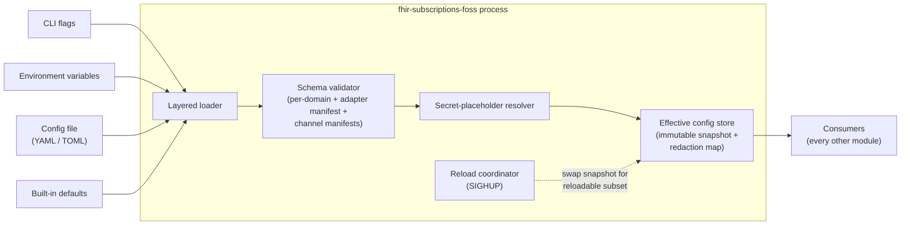

# Configuration — Low-Level Design

**Purpose.** Implementation-level design of the `infra/config` module: the layered loader (CLI flags > environment variables > config file > built-in defaults), the parser/validator, the secret-placeholder resolver, the per-domain JSON Schema validator, the SIGHUP hot-reload path, and the redaction pipeline that tags secret-derived fields and substitutes `[redacted]` in every serialization. The two load-bearing invariants are: (a) structural validation runs BEFORE secret resolution so a typo never resolves a secret, and (b) any field whose value was resolved from a secret placeholder is permanently tagged sensitive and never appears verbatim in any serialization (logs, errors, `$status`, metric labels). There is no runtime admin API per [decisions/0008](../high-level-design/decisions/0008-resolved-design-questions.md); operational changes flow through the config file plus SIGHUP for the documented hot-reload subset, or container restart for everything else.

**Reader's prerequisites.** Read [../high-level-design/domains/configuration.md](../high-level-design/domains/configuration.md) and the architecture sections "Configuration", "What's required vs. optional", "Validation", and "Hot reload" for the canonical layered model and field names. The full YAML shape is in the architecture; this LLD does not duplicate it.

## 1. Component placement



The configuration module owns the loader, the validator, the secret resolver, the snapshot store, and the reload coordinator. It does not own the schema for any individual domain — each domain ships its own schema and the validator walks them.

## 2. Module layout

The module is `infra/config` per the architecture's module layout. Sub-modules:

- `loader` — reads CLI flags, environment variables, the config file at `/etc/fhir-subs/config.yaml` (or `--config` override), and the built-in defaults; produces a layered intermediate representation.
- `merger` — applies precedence (CLI > env > file > defaults) field-by-field to produce a single typed effective config.
- `schemas` — registry of per-domain JSON Schema definitions; ships the core schemas, accepts adapter and channel manifest schemas at runtime registration.
- `validator` — walks the merged effective config and validates each domain section against its registered schema.
- `secrets` — placeholder resolver. Recognises `${env:VAR}` and `${file:/path}`; reads env or file at resolution time; returns the resolved value paired with a sensitivity tag.
- `redaction` — owns the redaction map. Every field in the effective config is tagged `Sensitive` or `NotSensitive`. The redaction map persists across reloads.
- `reload` — SIGHUP handler. Re-reads the file, validates, and applies only the reloadable subset.
- `effective_store` — the immutable snapshot every consumer reads through. Atomic swap on reload.
- `config_types` — the typed structs that mirror the architecture's YAML shape, one per domain.

## 3. Public surface

```
struct ConfigModule {
    // Constructed once at startup.
}

impl ConfigModule {
    // Boot path. Loads, validates, resolves secrets,
    // publishes the first effective snapshot. Returns a handle every
    // consumer reads through.
    async fn start(args: CliArgs, ctx: ConfigContext) -> Result<EffectiveConfigHandle>;

    // Re-read the file and apply only the reloadable subset.
    // Triggered by SIGHUP. There is no admin API.
    async fn reload(&self, trigger: ReloadTrigger) -> ReloadReport;
}

trait EffectiveConfigHandle {
    // Read a typed snapshot of one domain's config. The returned value is
    // a clone of the immutable struct so callers can hold it across awaits
    // without taking a lock on the snapshot.
    fn read<T: ConfigDomain>(&self) -> T;

    // Subscribe to changes for a specific domain. The reload coordinator
    // notifies subscribers after the atomic snapshot swap completes.
    fn subscribe<T: ConfigDomain>(&self, callback: fn(T)) -> SubscriptionId;
}
```

`ConfigContext` is the host-provided dependency bundle: a clock, a logger, a metrics emitter, and a clock-skew-tolerant filesystem reader for `${file:}` placeholders. The configuration module does not need the DB — it loads entirely from CLI / env / file / defaults.

## 4. The four sources, concretely

### 4.1 CLI flags

Parsed first. The CLI surface is minimal and is meant for ad-hoc overrides. `--config <path>`, `--log-level <level>`, `--check-config` (validate-and-exit, used by deployment pipelines), and explicit overrides for any field path expressed as `--set <dotted.key>=<value>`. CLI flags become a sparse map; the merger applies them last (highest precedence).

### 4.2 Environment variables

Environment variable names mirror the config-file path with uppercase and underscores: `STORAGE_POSTGRES_URL`, `AUTH_TRUSTED_ISSUERS_0_JWKS_URL`. Array indices are positional. The loader walks the registered schema once at startup, generates the env-var name table, and reads only those names — random environment variables are ignored (no silent shadowing).

### 4.3 Config file

Default path `/etc/fhir-subs/config.yaml`. The loader sniffs the extension to pick YAML vs. TOML. The file is parsed into a generic tree, then mapped onto the typed config structs by the validator.

The file is read once at startup and re-read on every `reload`. The reload coordinator computes the diff between the prior file-derived snapshot and the new one, then applies only the reloadable subset (see §8).

### 4.4 Built-in defaults

Each typed config struct ships with `Default` constructors. Defaults follow the architecture's example YAML — exponential backoff `(10s, 30s, 2m, 10m, 1h)`, max 8 attempts, 30-day event retention, 7-year audit retention, etc. An operator who supplies only the hard-required fields (`facility_id`, `storage.postgres.url`, `adapter.id`, `auth.*`) gets a complete effective config from defaults.

## 5. The boot path — `load_config`

```
async fn load_config(args, ctx) -> Result<EffectiveConfig> {
    // 1. Pull each layer into a generic tree.
    let cli_layer  = parse_cli_flags(args)
    let env_layer  = read_env_for_known_keys()
    let file_layer = read_config_file(args.config_path or default_path)
    let def_layer  = built_in_defaults()

    // 2. Merge by precedence into one generic tree (CLI > env > file > defaults).
    let merged = merge_layers([cli_layer, env_layer, file_layer, def_layer])

    // 3. Structural validation: every key in `merged` is known, required
    //    fields are present, types match the typed structs.
    validate_against_schema(merged) ?

    // 4. Secret-placeholder resolution. Tags sensitive fields.
    let (resolved, redaction_map) = resolve_secrets(merged) ?

    // 5. Domain-specific schema validation: the adapter's manifest schema
    //    against `adapter.config`, each channel's manifest schema against
    //    `channels.<id>` or `channels.custom[i]`.
    validate_domain_schemas(resolved, ctx.registered_manifests) ?

    // 6. Cross-field semantic checks (auth requirement, port collisions, etc.).
    validate_semantics(resolved) ?

    // 7. Build the immutable typed snapshot.
    let effective = EffectiveConfig::from_resolved(resolved, redaction_map)
    ctx.effective_store.publish(effective.clone())
    return Ok(effective)
}
```

If any step fails the service refuses to start. A structured error pointing at the offending field is emitted to stderr and to the audit log if the audit log is configured before the failure.

## 6. The secret-placeholder resolver — `resolve_secrets`

The architecture commits to two placeholder forms: `${env:VAR_NAME}` and `${file:/path}`. The resolver runs **after** structural validation so a typo in field names never causes a secret to be touched.

```
fn resolve_secrets(tree) -> Result<(ResolvedTree, RedactionMap)> {
    let mut redaction_map = RedactionMap::new()
    let resolver = |path, value| -> ResolveOutcome {
        if !is_string(value) {
            return Keep(value)
        }
        let s = value as String
        if let Some(var_name) = parse_env_placeholder(s) {
            match read_env(var_name) {
                Some(v) -> {
                    redaction_map.tag_sensitive(path)
                    return Replace(v)
                }
                None -> return Err(format!("env var {} referenced by {} is not set", var_name, path))
            }
        }
        if let Some(file_path) = parse_file_placeholder(s) {
            match read_file_trim_trailing_ws(file_path) {
                Ok(v) -> {
                    redaction_map.tag_sensitive(path)
                    return Replace(v)
                }
                Err(e) -> return Err(format!("file {} referenced by {} is unreadable: {}", file_path, path, e))
            }
        }
        // No placeholder; leave it as-is. The path is not tagged sensitive
        // unless the schema marks it so independently (see below).
        return Keep(value)
    }
    let resolved = walk_tree(tree, resolver) ?
    return Ok((resolved, redaction_map))
}
```

A field tagged sensitive in its schema (e.g., `storage.postgres.url`, `*.private_key_file` content, `*.api_key`) is added to the redaction map even if the operator embedded the secret directly in the file (which is discouraged but legal). The schema's sensitive-by-default annotation is the safety net; the placeholder syntax is the recommended path.

```
fn validate_against_schema(tree) -> Result<()> {
    // walks the registered schemas; for each field with `sensitive: true`
    // in its schema, adds the path to the redaction map even if no
    // placeholder was used.
    for (path, schema) in iter_schema_fields() {
        if schema.is_sensitive {
            redaction_map.tag_sensitive(path)
        }
    }
    // structural validation: required, type, enum, format
    ...
}
```

## 7. Per-domain schema validation — `validate_against_schema`

Each domain ships a schema. The configuration module registers them at startup. The architecture commits to:

- The core domain schemas (`deployment`, `server`, `lifecycle`, `storage`, `auth`, `topics`, `delivery`, `observability`, `mllp_listener`, `channels.<built-in-id>`).
- The adapter manifest's schema for `adapter.config`. Registered when the adapter is loaded.
- Each custom channel's manifest schema for the corresponding `channels.custom[i].config`.

```
fn validate_domain_schemas(resolved, manifests) -> Result<()> {
    // Core domains
    for (path, schema) in core_domain_schemas() {
        let subtree = resolved.get(path) or default()
        schema.validate(subtree) ?
    }
    // Adapter
    let adapter_id = resolved.get("adapter.id")
    let adapter_manifest = manifests.adapter(adapter_id) ?
    adapter_manifest.config_schema.validate(resolved.get("adapter.config")) ?
    // Custom channels
    for (i, custom) in resolved.get("channels.custom").iter().enumerate() {
        let channel_manifest = manifests.channel(custom.id) ?
        channel_manifest.config_schema.validate(custom.config) ?
    }
    return Ok
}
```

Validation errors carry the offending path, the schema that rejected it, and the rejection reason. The validator does not stop on the first error — it collects all errors and emits a single structured report.

## 8. The hot-reload subset — `hot_reload_subset`

The architecture commits to a specific reloadable subset:

- Topic catalog (operator-supplied directory + adapter-contributed + built-in).
- Subscription client registry.
- Log level.
- Delivery retry/backoff parameters.

Plus the *non-connection* fields of any already-loaded channel (channels' connection-level fields require a restart of that channel and are deliberately excluded).

```
async fn reload(trigger) -> ReloadReport {
    log_info("config reload requested", trigger)
    metrics.config_reload_total.increment("requested")

    // Re-run the boot path on a fresh tree, but stop at step 7 (effective
    // snapshot construction). Compare against the prior snapshot.
    let new_tree = load_layers_excluding_admin()
    validate_against_schema(new_tree) ?
    let (new_resolved, new_redaction) = resolve_secrets(new_tree) ?
    validate_domain_schemas(new_resolved, ctx.registered_manifests) ?
    validate_semantics(new_resolved) ?
    let new_with_admin = merge_admin_api(new_resolved, ctx.storage) ?

    let prior = ctx.effective_store.read()
    let diff = compute_diff(prior, new_with_admin)

    // Reject the reload up-front if any non-reloadable field changed.
    let immutable_changes = diff.filter(d -> !is_reloadable(d.path))
    if !immutable_changes.is_empty() {
        log_warn("reload rejected: non-reloadable fields changed", immutable_changes)
        metrics.config_reload_total.increment("rejected_immutable_change")
        return ReloadReport::Rejected(immutable_changes)
    }

    // Apply the reloadable subset.
    let next = prior.with_overrides(diff)
    ctx.effective_store.publish(next.clone())
    notify_subscribers(diff)

    metrics.config_reload_total.increment("applied")
    log_info("config reload applied", diff.summary())
    return ReloadReport::Applied(diff.summary())
}

fn is_reloadable(path) -> bool {
    return path.starts_with("topics.")
        or path.starts_with("auth.client_registry")
        or path == "deployment.log_level"
        or path.starts_with("delivery.retry.")
        or (path.starts_with("channels.") and not is_connection_field(path))
}
```

Reload is best-effort: if a single new topic file fails to parse, that topic is logged and the rest of the reload proceeds. The service does not roll back to the prior state on a partial reload failure — that would be a worse experience than "the new bad topic was rejected, everything else applied."

The reload coordinator does NOT touch fields that require a restart even if the new file changes them. Operators see a structured error in the reload response listing which fields require a restart.

SIGHUP is the only reload trigger. The signal handler implicitly trusts the local OS user; anyone who can signal the process can already kill it.

## 9. Redaction — `redact_sensitive`

Every consumer of the effective config reads through `redact_sensitive` when serializing for logs, errors, `$status` responses, or metric label resolution. The redaction map is the source of truth.

```
fn redact_sensitive(value, path, redaction_map) -> JsonValue {
    if redaction_map.is_sensitive(path) {
        return JsonValue::String("[redacted]")
    }
    if value.is_object() {
        let mut out = JsonObject::new()
        for (k, v) in value.iter() {
            out.insert(k, redact_sensitive(v, path.append(k), redaction_map))
        }
        return out
    }
    if value.is_array() {
        return JsonValue::Array(
            value.iter().enumerate()
                 .map(|(i, v)| redact_sensitive(v, path.append(i), redaction_map))
                 .collect()
        )
    }
    return value
}
```

The serializer that produces log lines, structured errors, and `$status` payloads always calls this function on any subtree of the effective config it includes. The metric label resolver does the same — sensitive values never appear as labels (and as a matter of metric hygiene, sensitive values would be high-cardinality anyway).

The redaction map is not a string-blacklist on output (which would miss copies and substrings). It is a path-keyed structural map built once at config load. Because every consumer reads the typed snapshot rather than re-parsing the file, secrets cannot be accidentally re-introduced into a serialization by a downstream module.

## 11. The effective config snapshot

The store is an `Arc<EffectiveConfig>` updated by atomic swap. Consumers read through `ConfigModule::read` and get a cheap clone of an immutable struct. Reload swaps the Arc; in-flight reads see either the old or the new snapshot consistently.

```
struct EffectiveConfig {
    deployment: DeploymentConfig,
    server: ServerConfig,
    lifecycle: LifecycleConfig,
    storage: StorageConfig,
    auth: AuthConfig,
    topics: TopicCatalog,
    mllp_listener: MllpListenerConfig,
    adapter: AdapterConfig,
    channels: ChannelsConfig,
    delivery: DeliveryConfig,
    observability: ObservabilityConfig,
    redaction: RedactionMap,
}
```

The redaction map travels with the snapshot so every downstream serializer has access to it without a separate lookup.

## 12. Subscription model for changed config

Components that need to react to reloads register a subscription on the domain they care about:

```
let token = config_handle.subscribe<DeliveryConfig>(|new_cfg| {
    delivery_scheduler.set_retry_curve(new_cfg.retry)
})
```

Subscribers are notified after the snapshot swap completes. Notifications are best-effort — a slow subscriber does not block the reload from completing.

The reload coordinator never calls a subscriber while holding any lock other than the in-memory snapshot Arc swap, so a misbehaving subscriber cannot deadlock the reload.

## 13. Failure modes

- **Unknown key in the config file** — structural validation rejects with `unknown key <path>`. No silent typos.
- **Required field missing** — structural validation rejects with `missing required field <path>`.
- **`${env:VAR}` references an unset env var** — secret resolution rejects with `env var <name> referenced by <path> is not set`. Service refuses to start.
- **`${file:/path}` references an unreadable file** — secret resolution rejects with `file <path> ... is unreadable: <error>`.
- **Adapter manifest schema rejects `adapter.config`** — domain validation rejects with the manifest's error trail. Service refuses to start.
- **Two MLLP listener endpoints share `bind+port`** — semantic validation rejects.
- **Reload changes a non-reloadable field** — reload coordinator returns `Rejected(immutable_changes)` listing the fields that require a restart. Effective config does not change.
- **Reload's new topic file fails to parse** — that topic is logged and skipped; the rest of the reload proceeds. The reload report lists per-item outcomes.

In every case the operator gets a structured error pointing at the offending path. Logs are emitted at `error` level and `fhir_subs_config_reload_total{outcome}` increments.

## 14. Configuration shape

The full YAML shape is in `architecture.md`. This LLD does not restate the field names — the architecture document is the source of truth. Per the configuration HLD's domain-to-module mapping table:

| Config domain | Owning module |
|---|---|
| `deployment.*` | `infra/config` (this module). |
| `server.*` | `api/http-fhir`, `infra/lifecycle`. |
| `lifecycle.*` | `infra/lifecycle`. |
| `storage.*` | `infra/storage`. |
| `auth.*` | `api/http-fhir`. |
| `topics.*` | `topics/catalog`. Includes `topics.value_sets_dir` (default `/etc/fhir-subs/value-sets`) per [decisions/0010 #6](../high-level-design/decisions/0010-implementation-defaults.md). |
| `mllp_listener.*` | `mllp-listener`. |
| `adapter.*` | `adapters/<id>` — sub-tree validated against the adapter's manifest schema. |
| `channels.*` | `channels/<id>` — sub-tree validated against each channel's manifest schema. |
| `delivery.*` | `engine/delivery-scheduler`. |
| `observability.*` | `infra/observability`. |

Each domain owns its typed struct, its schema, and the validator wires them up.

## 15. Metrics emitted by this module

| Metric | Type | Labels | Notes |
|---|---|---|---|
| `fhir_subs_config_load_total` | Counter | `outcome` (`ok`/`failed`) | Boot loads. |
| `fhir_subs_config_reload_total` | Counter | `outcome` (`applied`/`rejected_immutable_change`/`rejected_validation`/`partial`) | SIGHUP-triggered reloads. |
| `fhir_subs_config_validation_errors_total` | Counter | `domain` | Per-domain validation failures. |
| `fhir_subs_secret_placeholders_resolved_total` | Counter | `kind` (`env`/`file`) | Resolution stats. |
| `fhir_subs_config_redacted_fields` | Gauge | — | Number of paths tagged sensitive in the current snapshot. Useful sanity check. |

All metric labels are themselves redaction-aware — a sensitive path's value never becomes a label.

## 16. Ambiguity flagged

- The architecture says "Environment variable names mirror the config-file path"; the exact normalization (case, separator, array indexing, list-of-objects identity vs. positional) is left to implementation. Different operators may have settled conventions and the implementation's choice should be documented in operator notes.
- Whether channel-config "non-connection fields" can be enumerated stably across all channels (built-in and custom) is an open design point. A custom channel manifest may need a `reloadable_paths` declaration.
- Per-domain log level overrides require a path-aware logger; if the chosen language's logging library does not support per-domain levels natively, the implementation may need a thin adapter.

The admin-API question that was previously open here (whether it shares SMART Backend Services or uses a separate operator credential) is closed by [decisions/0008](../high-level-design/decisions/0008-resolved-design-questions.md): there is no admin API.
