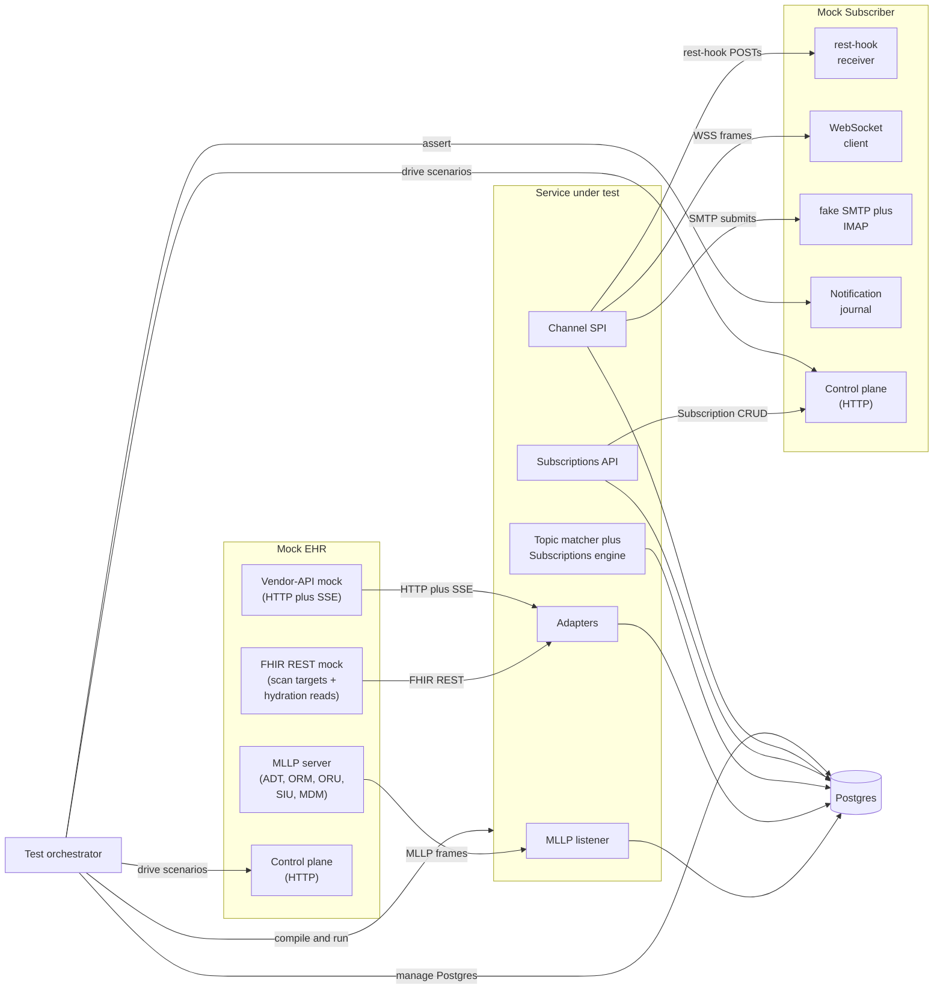

# End-to-End Test Harness — Low-Level Design

## Purpose

The end-to-end test harness is the project's day-to-day proof that the bridge actually works. It stands up the full pipeline — a mock EHR speaking HL7 v2 over MLLP and FHIR REST over HTTP, the service under test, a mock subscriber receiving deliveries on every supported channel, and a real Postgres — then drives named scenarios through it and asserts on the externally visible behavior. The harness is deliberately black-box: it pokes the EHR side, watches the subscriber side, peeks at Postgres only for invariants the wire surface cannot reveal, and never reaches into the service's internals.

The harness is not optional. The other LLDs in this set specify per-component unit and integration tests; those tests prove that each component does its own job. The e2e harness is the one place where we prove the components compose into the system the architecture promises. A change that passes every per-component test but breaks an e2e scenario is a change that broke something that no per-component test was watching. That is the gap this harness exists to close.

The harness is also the merge gate. Per the [operating procedure](../operating-procedure.md), the orchestrator does not merge a feature branch to `main` until the e2e suite goes a step further green than it did before the branch — the only acceptable e2e diffs are "more scenarios passing" or "scenarios newly enabled because the implementation now supports them." A red e2e is a blocking failure, not a flake to be re-run.

What the harness does not try to be: a load tester, a soak rig, or a fuzzer. Those concerns live in separate efforts (see [What this LLD does NOT cover](#what-this-lld-does-not-cover)). The harness's reason to exist is correctness on representative inputs, not behavior under stress.

## Reader's prerequisites

Read [`../architecture.md`](../architecture.md) — at minimum the "Module layout," "EHR side," "Subscriber side," and "Backpressure and overload behavior" sections. Read [`./README.md`](./README.md) so the cross-component conventions used here (transactional invariants, metric naming, structured-log fields) read as familiar rather than novel. Read [`../high-level-design/decisions/0010-implementation-defaults.md`](../high-level-design/decisions/0010-implementation-defaults.md), especially the items that touch wire-visible behavior: `correlation_id` as UUIDv4, `event_number` scoping, JCS canonicalization for content hashes, and the v1-only SMTP scope of the email channel.

This LLD assumes the reader knows what `hl7_message_queue`, `resource_changes`, `ehr_events`, and `deliveries` are; what cancel-and-replace means at the HL7 level (`ORC-2` / `ORC-3`); and what the FHIR R5 Subscriptions handshake looks like for `rest-hook`, `websocket`, and `email`. Where the harness has to reproduce a wire-format detail, the LLD names the spec section rather than restating it.

## Topology

The four boxes — Mock EHR, service under test, Mock Subscriber, Postgres — are the harness's universe. Everything outside the diagram (Inferno, Touchstone, real EHRs, real subscribers) is out of scope. The orchestrator owns every box: it spins them up before each scenario, drives the scenario, asserts on outcomes, and tears them down. The service under test is the only box that is "real"; the other three are project-owned mocks that the harness must keep faithful to the wire formats their real-world counterparts emit.

## Components

### Mock EHR

Directory: `testdata/e2e/mock-ehr/`. One Go module, runs as a single process exposing four logical surfaces.

Sub-components:

- `mllp_server` — TCP listener that frames per the MLLP transport spec, accepts ADT (A01/A02/A03/A04/A08/A11/A13), ORM (O01), ORU (R01), SIU (S12/S14/S15), and MDM (T02/T11) messages from a script, and consumes the ACK frames the SUT writes back. It does not parse the messages it sends — it emits pre-canned bytes from a fixture file or a templated builder so we can drop in real-world quirks (segment-terminator drift, escape sequences, MSH-3 facility-prefix oddities) verbatim.
- `cancel_and_replace_generator` — pair builder that emits a `(original, cancellation)` or `(original, modification)` HL7 pair with the right `ORC-2` / `ORC-3` linkage. Used by the HL7 cancel-and-replace scenario; lives here rather than in the orchestrator because the right linkage rules belong with the HL7 mock, not the test driver.
- `fhir_rest_server` — HTTP server returning the FHIR R5 resources the FHIR Scan Runner reads (`Patient`, `ServiceRequest`, `Encounter`, `Observation`, `DiagnosticReport`, `MedicationRequest`, `AllergyIntolerance`, `DocumentReference`) and the resources the on-demand hydrator reads. Resources are served from a fixture directory; query semantics implemented are exactly what the scan runner and hydrator need (`_lastUpdated`, `_revinclude` for the named cases, `Bundle` paging).
- `vendor_api_server` — HTTP plus Server-Sent-Events surface for the vendor-API and change-feed adapter sub-components. Emits a scripted sequence of change records with vendor-shaped IDs and timestamps; honors a cursor query parameter so the adapter's resume behavior can be exercised.
- `control_plane` — HTTP server on a separate port. Endpoints:
  - `POST /script` — load a scenario script: a list of timed events (MLLP frame at `+0ms`, FHIR resource update at `+50ms`, vendor change at `+200ms`, etc.).
  - `POST /play` — start running the loaded script.
  - `POST /pause` and `POST /resume` — pause and resume script playback.
  - `GET /state` — what the mock has emitted so far, what's pending, and any errors observed (e.g., a NACK received from the SUT).
  - `POST /reset` — clear all state, stop scripts, return to a known-empty starting point.

Exposed ports (defaults; configurable per scenario): MLLP 12575, FHIR REST 18080, Vendor API 18090, Control plane 19000. Ports come from an allocator the orchestrator owns so parallel scenarios do not collide.

Integration: the SUT is configured to point its MLLP endpoint at `localhost:12575`, its FHIR client at `http://localhost:18080`, and its vendor-API client at `http://localhost:18090`. Auth is configured via the SUT's normal config layer; the mock's auth surface is faithful enough to cover the SUT's auth code paths (bearer tokens, mTLS where the scenario calls for it).

### Mock Subscriber

Directory: `testdata/e2e/mock-subscriber/`. One Go module, runs as a single process exposing the receive surfaces for every channel the SUT supports plus a journal the orchestrator can query.

Sub-components:

- `resthook_receiver` — HTTP server that accepts notification POSTs at scenario-configurable paths. Records each request (headers, body, decoded notification Bundle) into the notification journal. Returns whatever response code the scenario asks for (200 by default; 503 to drive retry logic; 410 to drive auto-disable; arbitrary mid-flight delays to drive timeout handling).
- `websocket_client` — opens and maintains a WSS connection to the SUT's `/Subscription/$get-ws-binding-token`-derived endpoint, sends the bind frame for the scenario's subscription, records every received notification frame in the journal, and obeys orchestrator commands to drop the connection mid-scenario (used by the reconnect scenario).
- `smtp_relay` plus `imap_inbox` — tiny SMTP receiver that accepts mail submitted by the SUT's email channel and stores it in an IMAP-accessible mailbox so the orchestrator can list, fetch, and assert on message bodies. Faithful enough to cover the v1 email scope from ADR 0010 (SMTP / SMTPS, no S/MIME).
- `notification_journal` — append-only in-memory record of every notification received on every surface, with timestamps and per-channel metadata. The journal is the single thing the orchestrator asserts against; the receivers do not expose internal state.
- `assertion_endpoints` — control-plane HTTP routes the orchestrator polls or queries to make assertions:
  - `GET /journal` — full journal, optionally filtered by channel, subscription, or time window.
  - `GET /journal/wait?channel=...&subscription=...&count=N&timeout=...` — long-poll until N matching entries arrive or the timeout fires. Lets the orchestrator wait on delivery without sleep loops.
  - `POST /resthook/respond` — set the response policy (status code, delay, body) for upcoming POSTs to a given path.
  - `POST /websocket/disconnect` — force a server-side close on the named connection so the SUT must re-handshake.
  - `POST /reset` — clear journal and reset all per-receiver state.

Exposed ports (defaults): rest-hook 28080, WSS endpoint advertised in subscription config (the subscriber polls the SUT, so this is outbound), SMTP 22525, IMAP 21430, assertion endpoint 29000. Like the EHR, ports come from the orchestrator's allocator.

Integration: the orchestrator creates Subscriptions via the SUT's `Subscriptions API` and configures the `endpoint` URL to point at the mock subscriber's rest-hook receiver. For WebSocket scenarios it issues a binding-token request through the API and hands the token to the WebSocket client. For email scenarios it sets the channel's `endpoint` to the mock SMTP relay's address and the recipient mailbox to one the IMAP inbox owns.

### Test Orchestrator

Directory: `testdata/e2e/orchestrator/` plus per-scenario test files in `testdata/e2e/scenarios/`. Built on Go's standard `testing` package plus `testcontainers-go` for Postgres. The orchestrator is the only Go test binary in the harness; the mocks are long-running processes that it drives.

Responsibilities:

- **Postgres lifecycle.** `testcontainers-go` brings up a fresh Postgres container per scenario (or per test group, when isolation lets us share). Migrations are applied before the SUT starts. Postgres is torn down after each scenario.
- **SUT lifecycle.** The orchestrator compiles the SUT (`go build ./cmd/fhir-ehr-subscriptions-service`), generates a per-scenario config file pointing at the mocks and the Postgres container, starts the SUT as a child process, waits for `/readyz` to return green, and tears it down at scenario end. Logs from the SUT stream to a per-scenario file for the debug bundle.
- **Mock lifecycle.** The orchestrator starts the Mock EHR and Mock Subscriber processes (one of each per scenario by default) and waits for their control planes to respond. Mocks are torn down at scenario end.
- **Auth setup.** Where a scenario exercises an auth-bearing path, the orchestrator generates the credentials the SUT and the mocks need: bearer tokens for outbound rest-hook delivery, WSS binding tokens, an SMTP credential for the email relay. Credentials are scenario-scoped; nothing leaks across scenarios.
- **Scenario driving.** Each scenario is a Go test function that loads a script into the EHR mock, configures the subscriber mock's response policies, creates Subscriptions via the SUT API, plays the script, waits for the journal to reach the expected state, and asserts on what was received. Time is measured by the journal's wait endpoints, never by `time.Sleep`.
- **Postgres assertions.** A small set of read-only helpers query Postgres for invariants the wire surface cannot reveal: `event_number` monotonicity per subscription, `audit_log.prev_hash` chain integrity after a scenario, `pending_pairs` empty at scenario end. These helpers go through the SUT's own pool, not a side connection — we are asserting on observable state, not racing the SUT.

The orchestrator does not import any package from the SUT's `internal/` tree. The only Go imports it shares with the SUT are the public types in `pkg/` and the FHIR resource types from the project's chosen FHIR library. This is deliberate: the harness is black-box, and the import boundary enforces it.

## Scenario taxonomy

| Scenario | What it proves | Components required |
|---|---|---|
| `smoke_listener_ack` | The MLLP listener accepts a connection, frames a single ADT message, persists it, and ACKs. | `mllp-listener`, `storage` |
| `smoke_persist` | After the listener ACKs, the row is durably in `hl7_message_queue` with the correct `MSH-9` / `MSH-10` and a UUIDv4 `correlation_id`. | `mllp-listener`, `storage` |
| `single_event_to_resthook` | One ADT in, one rest-hook POST out. End-to-end happy path through every stage; subscriber receives a notification Bundle with the right `topic`, `eventNumber`, and `correlation_id`. | All five stages, `channels.rest-hook`, `subscriptions-api` |
| `cancel_and_replace_hl7` | An ORM `O01` followed by an ORC-3 cancellation pair collapses to a single `resource_changes` row with the cancel state, no duplicate `ehr_events`, and the subscriber receives one notification matching the post-cancel state. | `hl7-message-processor`, `topic-matcher`, `subscriptions-engine`, `channels.rest-hook` |
| `cancel_and_replace_scan` | The FHIR Scan Runner sees an updated `ServiceRequest`, the diff against its prior snapshot collapses to a single `resource_changes` row, and the subscriber receives one notification reflecting the latest state. | `fhir-scan-runner`, `topic-matcher`, `subscriptions-engine`, `channels.rest-hook` |
| `subscription_filter_drop` | A change that does not match a subscription's filter does not produce a delivery; the journal stays empty for that subscription while a parallel matching subscription receives normally. | `topic-matcher`, `subscriptions-engine`, `channels.rest-hook` |
| `events_replay` | After a delivery is sent, calling `Subscription/$events?eventsSinceNumber=N` returns the same Bundle (idempotent replay), and the deployment-wide `ehr_events.event_number` is monotonic across the run. | `subscriptions-api`, `subscriptions-engine`, `storage` |
| `wss_delivery_and_reconnect` | A WSS subscriber receives a notification, the orchestrator forces a server-side disconnect, the subscriber re-handshakes with the same binding token, and missed events are replayed in order. | `channels.websocket`, `subscriptions-api`, `subscriptions-engine` |
| `email_v1_smtp` | An email-channel subscription delivers the notification Bundle as an SMTP message to the configured relay; the IMAP inbox shows one message with the right MIME type, subject, and notification body. (S/MIME is out of scope per ADR 0010.) | `channels.email`, `subscriptions-engine` |
| `graceful_shutdown` | A SIGTERM mid-scenario drains in-flight messages, ACKs the EHR for everything persisted, refuses new connections during drain, and exits within the configured grace period. The journal shows no half-delivered notifications. | `lifecycle`, `mllp-listener`, every adapter, `channels.*` |
| `restart_recovery` | The SUT is killed mid-scenario (no graceful shutdown). On restart, every persisted row resumes processing exactly once; no duplicate notifications appear in the journal; the audit-log hash chain re-walks clean. | `lifecycle`, `storage`, every adapter, `channels.*` |
| `backpressure` | The subscriber's rest-hook receiver returns 503 for the first N attempts; the SUT retries with the configured backoff, eventually succeeds, and the journal shows exactly one successful delivery in the right position. NACK / drop semantics on the EHR side are exercised when the persistor is held under load. | `subscriptions-engine`, `channels.rest-hook`, `mllp-listener` |
| `auth_revocation` | A subscription whose bearer token is revoked mid-scenario receives a 401 from the subscriber, the SUT surfaces the failure on `Subscription.$status`, and stops attempting deliveries until the operator re-enables it. The journal records the failed-attempt count without recording false successes. | `channels.rest-hook`, `subscriptions-engine`, `subscriptions-api` |

The "Components required" column doubles as an unblocking schedule: a scenario only runs when every component listed has a working implementation. Scenarios are added to CI as the components land. The smoke pair (`smoke_listener_ack`, `smoke_persist`) is the floor — once those pass, the e2e harness has earned its place in the merge gate.

## Run modes

**Local.** `make e2e` runs the full suite. The Makefile target compiles the SUT, builds the mocks, allocates ports, runs every scenario in `testdata/e2e/scenarios/` against fresh Postgres containers, and produces a debug bundle on the first failure. Individual scenarios run via `make e2e SCENARIO=cancel_and_replace_hl7` (one scenario, fast). The harness is designed to run on a developer laptop without elevated privileges; the only requirement is a Docker daemon for `testcontainers-go`.

**CI.** GitHub Actions workflow `.github/workflows/e2e.yml`. Triggered on PRs labeled `run-e2e` and on every push to `main`. The label gate is intentional: e2e is slower than unit tests, so we do not run it on every PR commit by default. The PR opener (or a reviewer) adds the label when the change is e2e-relevant; the orchestrator adds it automatically once a PR is approved by a verifier subagent. CI runs each scenario in parallel where the per-scenario isolation allows. The job uploads the debug bundle as an artifact on failure.

The choice not to gate every PR on e2e is a tradeoff. The discipline that makes this safe is the operating procedure's verifier step: the verifier subagent reads the diff against the LLD, decides whether the change is e2e-relevant, and applies the label or asks for manual confirmation. Trivial doc-only PRs do not earn the label; anything that touches `internal/` does.

## Observability of the harness

When a scenario fails, the orchestrator writes a debug bundle to `testdata/e2e/debug/<scenario>-<timestamp>/`:

- `service.log` — full stdout / stderr from the SUT process, including structured-log lines.
- `service.metrics` — a snapshot of the SUT's `/metrics` endpoint at the moment of failure plus a final snapshot at scenario teardown.
- `mock-ehr.log`, `mock-subscriber.log` — the mocks' own logs.
- `postgres.dump` — `pg_dump` of the relevant tables (`hl7_message_queue`, `resource_changes`, `ehr_events`, `deliveries`, `pending_pairs`, `audit_log`). Constrained by row count so a runaway scenario does not produce a multi-gigabyte bundle.
- `journal.json` — the subscriber's journal at failure time.
- `assertion.txt` — the assertion that failed, the expected vs. actual values, and the wait-endpoint state at failure.
- `script.json` — the EHR script that was playing.

The bundle is the first artifact a developer or a debugger subagent looks at when triaging an e2e failure. Its shape is stable; CI uploads it under the same paths every run so tooling can rely on the layout.

The harness does not sample or aggregate — every scenario captures the full bundle on failure. We have at most a few dozen scenarios, the bundles are small, and disk is cheap; the optimization concerns that drive sampling in production observability do not apply here.

## Conformance bridge

Inferno (the ONC-mandated FHIR conformance suite for Subscriptions) and Touchstone (HL7's commercial conformance harness) are external testing surfaces this project supports but does not embed. The argument for keeping them external:

- **They evolve on their own schedule.** Inferno releases align with FHIR spec releases, not with our merge cadence. Coupling our merge gate to an external harness's release cycle would block us behind their timeline; running them in CI on a separate workflow keeps the dependency loose.
- **They cover what they cover.** Inferno verifies wire conformance to the spec; it does not exercise vendor-shaped HL7 quirks, cancel-and-replace pairings, or subscriber-side back-pressure. The project-internal harness is where we prove those.
- **Their failures are advisory.** A red Inferno run is a signal that our spec conformance has drifted; a red e2e run is a signal that our build is broken. The two have different escalation paths.

The conformance bridge therefore lives outside this LLD's scope: a separate workflow runs Inferno and Touchstone against a deployed instance on a schedule, posts results to the project's compliance dashboard, and files issues for failures. The day-to-day proof of correctness is the project-internal e2e harness, not Inferno.

The link from one to the other is the scenario taxonomy: where Inferno covers a scenario, the project-internal scenario keys off the same wire conditions, so an Inferno regression has a corresponding internal scenario that also fails. We do not run Inferno's tests against our mocks; we run our scenarios, with our mocks, and treat Inferno's results as a trailing signal.

## Versioning policy

The harness is part of the project. It lives in this repository, ships with every release, and is held to the same TDD discipline as the components it tests:

- A change to a mock or to the orchestrator follows the same TDD order described in the [operating procedure](../operating-procedure.md). Tests of the harness itself land before changes to it.
- A change to a scenario script ships with the implementation change that makes the new behavior pass. A scenario added "for the future" — something that never passes against any version of the SUT — is a scenario that does not belong in the suite. Either implement enough to make it pass or land it gated behind a build tag until it does.
- The conformance fixtures in `testdata/` are versioned with the code. When the FHIR version target changes (per ADR 0004), the fixtures change in the same commit, not after.

The harness is not a test fixture in the SUT's sense — it is its own subsystem with its own per-mock LLDs (one for the EHR, one for the subscriber, both deferred until either grows large enough to justify the doc). Until those exist, this LLD is the design of record for the harness as a whole.

## What this LLD does NOT cover

- **Load testing.** Sustained-throughput numbers, latency percentiles under load, and pool-saturation behavior live in a separate load harness. The e2e harness's scenarios are correctness scenarios; their input volumes are the smallest that prove the property.
- **Longitudinal soak.** Multi-day runs exercising memory growth, log-rotation, and partition-prune cadence are a separate concern. The e2e harness tears every container down per scenario.
- **Fuzzing of the HL7 parser.** Property-based and fuzz testing of the HL7 v2 lexer / classifier / mapper belongs in `hl7-message-processor`'s own test suite, not the e2e harness. The harness uses pre-canned fixtures so a scenario that depended on a fuzzer's mood would be useless.
- **Real-EHR integration.** The harness's mocks are faithful to the wire formats but they are not certified clinical systems. A scenario that depends on a real-EHR oddity (an Epic-specific MSH-3 quirk, a Cerner-specific timing window) is added to the mocks once we have a recorded trace; running against the real systems is a separate validation effort.
- **Inferno and Touchstone runs.** See [Conformance bridge](#conformance-bridge); they live in a separate workflow with their own escalation rules.
- **Human-driven exploratory testing.** When a developer wants to drive the SUT by hand against the mocks, the same mocks can be brought up via `make e2e-mocks` without an orchestrator scenario. That is a developer convenience, not part of the merge-gating suite.
