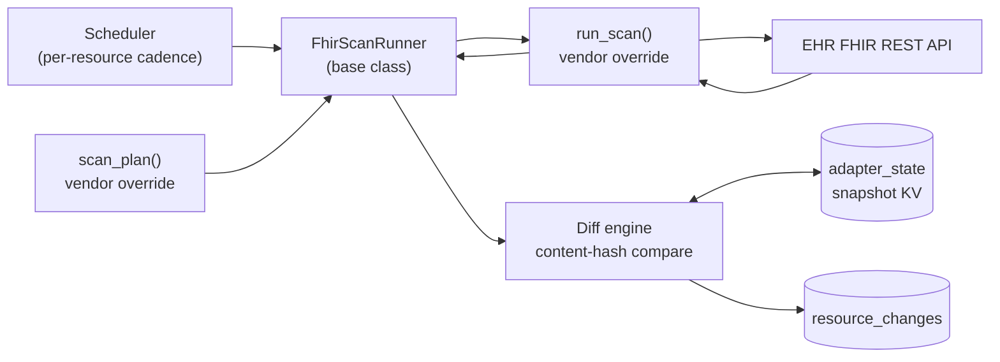
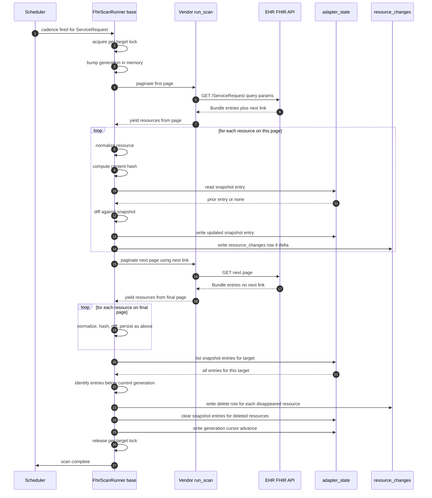

# Low-Level Design: FHIR Scan Runner

**Purpose.** This document defines the implementation-level design of the FHIR Scan Runner sub-component of the EHR Adapter. The scan runner is one of three Stage 1 sources that produce vendor-neutral `resource_changes` rows. It exists to detect resource changes in EHRs that do not push events for everything we care about and that do not reliably honor `_lastUpdated` on their FHIR REST API. The mechanism is snapshot-and-diff: on a configurable cadence, walk the configured FHIR queries against the EHR, hash each returned resource against a prior snapshot held in `adapter_state`, and emit one `resource_changes` row per detected create, update, or delete. The base class owns scheduling, snapshot persistence, hash diffing, rate-limit enforcement, retry/backoff, and the transactional write that keeps snapshot updates and `resource_changes` insertions in lockstep. The vendor subclass overrides the scan plan, the FHIR client invocation, and (optionally) the canonicalization and normalization passes used in hashing.

**Reader's prerequisites.** Read, in order: `../high-level-concept.md`, `../architecture.md` (the EHR-side topology, five-stage pipeline, snapshot-and-compare rationale, Adapter SPI section), `../high-level-design/domains/ehr-adapter.md` (four sub-components and framework boundary), `../high-level-design/contracts/adapter-spi.md` (base-class shapes and shared types), and `../high-level-design/contracts/internal-tables.md` (`adapter_state` and `resource_changes` row shapes and transactional invariants). Familiarity with FHIR R4/R5 search semantics and `Bundle` pagination is assumed.

## 1. Placement

The scan runner sits inside the active EHR adapter alongside the HL7 Message Processor, Vendor API Client, and Hydration Service. It is the only Stage 1 source that initiates outbound calls to the EHR's FHIR REST API on a schedule. It owns no inbound socket. It does not consume `hl7_message_queue` and it does not serve hydration callbacks. Its only writers to durable storage are `adapter_state` (its snapshot KV) and `resource_changes` (the vendor-neutral pipeline output); both are mediated by the framework — vendor code never holds a database handle.



Three notes. First, `run_scan` is the only place vendor code talks to the EHR's FHIR API; scheduling, snapshot, diff, and write are generic. Second, the snapshot lookup and the `resource_changes` write happen in one framework-managed transaction, so a crash between hashing and writing never leaves a phantom snapshot or a phantom emission. Third, the loop streams: it does not buffer a whole scan in memory, because some resource types (Observation in particular) produce very large result sets.

## 2. Base class outline

The base class is `FhirScanRunner`. The Adapter SPI documents the override surface; this LLD nails down what each method must guarantee in implementation terms.

**REQUIRED overrides.**

- `scan_plan() -> [ScanTarget]` — the static set of resource types this adapter scans, with cadences and FHIR query parameters. Called once at adapter start and refreshed when a new subscription's topic adds a resource type not yet in the plan. Implementors return a deterministic, sorted-by-`resource_type` list. The base class refuses duplicate `(resource_type, query_params)` entries.
- `run_scan(target, http) -> AsyncIterator<FhirResource>` — execute one scan target's query against the EHR's FHIR REST API and yield resources one at a time as `Bundle.entry[]` is walked and `next` links followed. The implementor handles vendor-specific paging (opaque continuation tokens, offset, FHIR `link.relation=next`), 401 reauth handshakes, and vendor search-parameter quirks. The implementor does NOT compute hashes, compare state, or write `resource_changes`.

**OPTIONAL overrides.**

- `content_hash(resource) -> Hash` — diff hash. Default: SHA-256 of canonicalized JSON with volatile fields stripped (`meta.lastUpdated`, `meta.versionId`, plus any field in `volatile_fields()`). Override when an EHR's profile demands custom canonicalization (e.g., narrative HTML with non-deterministic whitespace).
- `normalize(resource) -> FhirResource` — applied before hashing and persistence. Default: identity. Override to coerce vendor-profiled resources to the project's R5-shaped internal representation. The output is what gets hashed, stored, and emitted into `resource_changes.resource`.
- `volatile_fields() -> Set<FhirPath>` — default `{meta.lastUpdated, meta.versionId, meta.source}`. Override to add EHR-specific volatile fields.
- `page_size() -> int` — default 100.
- `rate_limit_budget() -> RateLimitBudget` — inherited from the host HTTP client by default; override only for per-resource-type budgets.

**Framework-owned (do not override).** Scheduler, per-target run lock (no two concurrent scans for the same target on the same adapter), streaming pagination iterator (walks `Bundle.entry[]` then follows `Bundle.link[rel=next]`), snapshot reads/writes against `adapter_state`, the canonicalize-and-hash pipeline (`normalize` then `content_hash`), diff computation, end-of-scan delete sweep, `resource_changes` writes, rate-limit accounting, retry/backoff with classified failures, and metric emission.

## 3. Internal data structures

**`ScanTarget`.** What `scan_plan()` returns and what every subsequent piece of the scan loop is keyed on:

```
struct ScanTarget {
    resource_type: String                 // "ServiceRequest", "Observation", ...
    cadence: Duration                     // e.g., 5 minutes
    query_params: Map<String, String>     // additional fixed query parameters
    page_size: Option<int>                // overrides page_size() per-target
    priority: enum { Low, Normal, High }  // scheduler tiebreaker on overlap
    seed_on_subscribe: bool               // run an initial scan immediately when this target is added
}
```

The `(adapter_id, resource_type, query_params)` triple is the snapshot's namespace key — two targets that differ only in `query_params` maintain independent snapshots and emit independent deltas.

**`Snapshot` entry.** Per-resource state held in `adapter_state`. KV key: `snapshot:<resource_type>:<query_hash>:<resource_id>` where `query_hash` is a stable hash of the target's query params. Value:

```
struct SnapshotEntry {
    content_hash: Hash             // canonical-JSON SHA-256 minus volatile fields
    body: FhirResource             // the last-seen normalized resource body
    last_seen_at: Timestamp        // updated on every scan that re-observes the resource
    last_changed_at: Timestamp     // last time content_hash changed
    scan_generation: u64           // monotonic counter for the most recent scan run
}
```

The `body` lets the base class populate `previous_resource` on `update` and `delete` rows without re-calling the EHR. The `scan_generation` is the delete-detection trick: a scan run increments the generation, every observed resource gets the new generation written, and at end-of-scan everything still on the prior generation is presumed deleted.

**`DiffResult`.** What the diff engine produces, one per resource it considers:

```
enum DiffResult {
    Unchanged                          // hash matches, no action
    Created { resource }               // not in snapshot
    Updated { resource, previous }     // hash differs, both bodies present
    Deleted { previous }               // in snapshot but not in this scan
}
```

`Unchanged` produces no `resource_changes` row. The other three each produce exactly one row with the corresponding `change_kind`.

A fourth structure, `ScanRun`, is the in-memory bookkeeping for one execution of one target: scan_generation, started_at, page_count, resources_observed, deltas_emitted, http_errors, terminal_state. It is a span attribute and a metrics aggregate, not durable.

## 4. Pseudo-code

Seven named functions: `scheduler_loop`, `run_one_scan`, `paginate`, `content_hash_default`, `diff_against_snapshot`, `emit_change`, `sweep_deletes`. Each has one job. Notional async language; real implementation will follow the runtime's idioms.

```
// Top-level scheduler. Started once per adapter at on_start.
// Dispatches per-target runs as their cadences fire.
async fn scheduler_loop(ctx: AdapterContext, plan: [ScanTarget]) {
    let timers = build_timers(plan)                  // per-target wakeup timers
    let inflight = Set<String>::new()                // per-resource_type lock
    loop {
        let target = await timers.next_due()         // earliest-due target
        if inflight.contains(target.resource_type) {
            metrics.scan_skipped_inflight.inc(target.resource_type)
            timers.advance(target, now() + target.cadence)
            continue
        }
        inflight.add(target.resource_type)
        spawn(async {
            try {
                await run_one_scan(ctx, target)
            } finally {
                inflight.remove(target.resource_type)
                timers.advance(target, now() + target.cadence)
            }
        })
    }
}

// Execute exactly one scan of one target. Cursor advances ONLY on
// successful completion. Anything else leaves the cursor where it was.
async fn run_one_scan(ctx: AdapterContext, target: ScanTarget) {
    let run = ScanRun::start(target)
    let generation = state.read_generation_counter(target).await + 1
    let observed_ids = Set<String>::new()

    try {
        let stream = paginate(ctx, target)
        for await resource in stream {
            let normalized = normalize(resource)
            let id = normalized.id
            observed_ids.add(id)

            await ctx.state_store.transaction(|tx| async {
                let key = snapshot_key(target, id)
                let prior = tx.get(key).await
                let result = diff_against_snapshot(prior, normalized)
                emit_change(tx, target, result, generation).await
            }).await

            run.resources_observed += 1
            await rate_limiter.tick(target)
        }

        // Full pass succeeded. Sweep deletes and advance the cursor.
        await sweep_deletes(ctx, target, observed_ids, generation)
        state.write_generation_counter(target, generation).await
        run.terminal_state = "complete"
    } catch (TransientError as e) {
        run.terminal_state = "transient_failed"
        // generation NOT advanced; deletes NOT swept.
        // next scheduler tick re-runs; partial snapshot updates from this run
        // are still valid (we wrote them transactionally per resource).
        log.warn("scan target {} transient failure: {}", target, e)
    } catch (PermanentError as e) {
        run.terminal_state = "permanent_failed"
        log.error("scan target {} permanent failure: {}", target, e)
    } finally {
        metrics.emit(run)
    }
}

// Stream Bundle.entry[] across pages, following Bundle.link[rel=next].
// Implementor's run_scan provides per-page execution; the iterator handles
// the link-walking glue.
async iterator fn paginate(ctx, target) -> FhirResource {
    let mut cursor = None              // None on first page
    loop {
        let page = await retry_with_backoff(|| run_scan_page(ctx, target, cursor))
        for entry in page.entries {
            yield entry.resource
        }
        cursor = page.next_link
        if cursor is None { break }
    }
}

// Default content hash. Strip volatile fields, canonicalize JSON, SHA-256.
fn content_hash_default(resource: FhirResource) -> Hash {
    let cleaned = strip_fields(resource, volatile_fields())
    let canonical = canonical_json(cleaned)        // sorted keys, no insignificant whitespace
    return sha256(canonical)
}

// Compute a DiffResult for one observed resource against its snapshot entry.
fn diff_against_snapshot(prior: Option<SnapshotEntry>, current: FhirResource) -> DiffResult {
    let h = content_hash(current)
    match prior {
        None                         => return Created { resource: current }
        Some(p) if p.content_hash == h => return Unchanged
        Some(p)                      => return Updated { resource: current, previous: p.body }
    }
}

// Persist the snapshot update and (if applicable) write a resource_changes row,
// inside a single transaction.
async fn emit_change(tx, target, result, generation) {
    match result {
        Unchanged => {
            // Refresh last_seen_at + generation, no resource_changes row.
            tx.put(snapshot_key(target, current_id), bump_generation(prior, generation)).await
        }
        Created { resource } => {
            let entry = SnapshotEntry { content_hash, body: resource,
                last_seen_at: now(), last_changed_at: now(),
                scan_generation: generation }
            tx.put(snapshot_key(target, resource.id), entry).await
            tx.write_resource_change(ResourceChange {
                resource_type: target.resource_type,
                change_kind: Create,
                resource: resource,
                previous_resource: None,
                occurred_at: now(),
                correlation_id: stable_id(target, resource.id, "create", h),
            }).await
        }
        Updated { resource, previous } => {
            let entry = SnapshotEntry { content_hash, body: resource,
                last_seen_at: now(), last_changed_at: now(),
                scan_generation: generation }
            tx.put(snapshot_key(target, resource.id), entry).await
            tx.write_resource_change(ResourceChange {
                resource_type: target.resource_type,
                change_kind: Update,
                resource: resource,
                previous_resource: Some(previous),
                occurred_at: now(),
                correlation_id: stable_id(target, resource.id, "update", h),
            }).await
        }
        Deleted { previous } => {
            tx.delete(snapshot_key(target, previous.id)).await
            tx.write_resource_change(ResourceChange {
                resource_type: target.resource_type,
                change_kind: Delete,
                resource: previous,
                previous_resource: Some(previous),
                occurred_at: now(),
                correlation_id: stable_id(target, previous.id, "delete", generation),
            }).await
        }
    }
}

// At end-of-scan: anything in the snapshot for this target whose
// scan_generation is below the current generation is a delete candidate.
async fn sweep_deletes(ctx, target, observed_ids, generation) {
    for await (key, entry) in ctx.state_store.list(snapshot_prefix(target)) {
        if observed_ids.contains(entry.body.id) { continue }
        if entry.scan_generation >= generation { continue }   // already deleted in a parallel pass
        await ctx.state_store.transaction(|tx| async {
            let result = DiffResult::Deleted { previous: entry.body }
            await emit_change(tx, target, result, generation)
        })
    }
}
```

Two invariants this code is built around: (a) per-resource snapshot writes and `resource_changes` writes are in the same transaction; (b) the per-target generation counter advances **only** when a complete scan walks every page successfully. Partial scans leave the snapshot internally consistent (each observed resource is recorded), but the delete sweep does not run, so unreached resources are not falsely emitted as deletes.

## 5. Sequence diagram for one scan iteration



## 6. Failure handling

**HTTP 4xx.** 401 and 403 trigger one auth-refresh attempt via `http.refresh_credentials()`; the base class retries the same request once. A second 401 promotes to permanent — scan terminates `permanent_failed`, generation does not advance, an alert fires. 400, 404, 410, 422 are immediate `permanent_failed` (bad query); the scan plan is suspect and surfaces on the operator dashboard.

**HTTP 5xx.** Transient. Exponential backoff with jitter (1s, 2s, 4s, 8s, 16s, 30s capped, plus 20 percent jitter) up to a configurable per-page retry limit (default 5). On exhaustion the scan terminates `transient_failed` and reschedules on the next cadence tick. Snapshot updates already committed remain valid — they were recorded transactionally per resource.

**429.** Transient with `Retry-After` honored. The failure counts against the rate-limit budget so the runner backs off the whole target rather than thrashing.

**Network timeouts.** Transient; same backoff curve as 5xx.

**Partial pages.** A `Bundle` with `entry[]` shorter than `_count` but a `next` link present is normal. A `Bundle` with zero entries and no `next` link is a clean end. A malformed `Bundle` (missing `resourceType`, missing `entry[]`, malformed `link[]`) is logged and the scan terminates `permanent_failed`; the implementor's `run_scan` should harden against this.

**Pagination interruption.** A 5xx or timeout mid-pagination retries the *same page* using the same cursor. Some EHRs invalidate cursors after a few minutes, so the base class caps single-page retries at two minutes. Past that, the scan terminates `transient_failed` and the next cadence tick starts a fresh scan from page one. Already-written snapshot updates remain correct.

**Cursor advance only on full successful scan.** The generation counter advances only when every page was walked and `sweep_deletes` ran. This is what prevents spurious deletes: an interrupted scan leaves unreached resources on the prior generation, and the delete sweep — which only runs on success — never looks at them.

**Auth refresh.** The host's HTTP client owns the SMART Backend Services token cache. The base class calls `http.refresh_credentials()` on the first 401; the host either refreshes the token or surfaces a permanent auth failure. The runner is unaware of the auth scheme.

## 7. Configuration knobs

Every behavior with a tradeoff is configurable. Defaults work for a stock R5 FHIR API.

- **Per-target cadence** (`scan_plan().cadence`) — no default; required. Common values: `ServiceRequest` 60s, `Observation` 5 min, `Patient` 30 min, `Practitioner` daily.
- **Per-target query params** (`scan_plan().query_params`) — no default; required.
- **Page size** (`page_size()`) — default 100. Most EHRs cap at 200-500.
- **Rate-limit budget** (`rate_limit_budget()`) — inherited from the host's global EHR-facing budget; per-target override available. Throttled scans defer to the next cadence tick.
- **Snapshot retention** — snapshots persist indefinitely while the target remains in the plan. Targets removed from the plan TTL-sweep after a configurable grace (default 7 days) so re-adding within the window does not flood `create` rows.
- **Volatile fields** (`volatile_fields()`) — default `{meta.lastUpdated, meta.versionId, meta.source}`.
- **Pagination per-page retry limit** — 5 attempts within a 2-minute window.
- **End-of-scan generation grace** — generations a resource must be absent before being emitted as deleted. Default 0; operators on noisy EHRs may use 1-2 to avoid flapping.
- **`seed_on_subscribe`** — default true. When a new subscription adds a resource type, an initial scan runs immediately. The seed emits every observed resource as `create`.
- **Reaper cadence** — snapshot-TTL sweeper. Default 1 hour. Independent of scan cadence.

## 8. Metrics

Every metric is labeled with `adapter_id` and `resource_type` at minimum.

- `scans_run_total` — counter, one per terminal scan, label `terminal_state` (`complete` / `transient_failed` / `permanent_failed`).
- `scan_duration_seconds` — histogram, cadence-fired to terminal-state. Buckets 100ms - 30 min.
- `resources_scanned_total` — counter, resources observed.
- `deltas_emitted_total` — counter, labeled `change_kind` (`create` / `update` / `delete`).
- `ehr_http_errors_total` — counter, labeled `status_class` (`4xx` / `5xx` / `429` / `network`) and `final` (retry exhausted yes/no).
- `scan_pages_total` — counter, pages walked.
- `snapshot_size_resources` — gauge, snapshot entry count per target.
- `snapshot_bytes` — gauge, serialized snapshot byte size per target.
- `rate_limit_throttles_total` — counter, scans deferred for budget exhaustion.

Tracing: each `run_one_scan` is a span; each page and each `emit_change` transaction is a child span. The span carries the same `correlation_id` that lands on the emitted `resource_changes` row, so one trace links cadence fire, EHR call, and every downstream stage.

## 9. Error handling matrix

| Condition | Classification | Response | Effect on snapshot | Effect on cursor |
|---|---|---|---|---|
| HTTP 200 with valid Bundle | Success | Process page, advance pagination | Snapshot updated per resource | Cursor advances on full scan |
| HTTP 200 with malformed Bundle | Permanent | Terminate scan, emit error metric, alert | No further updates this run | Cursor unchanged |
| HTTP 401 | Transient (1x) | Call `http.refresh_credentials()`, retry once | No change | Unchanged this attempt |
| HTTP 401 after refresh | Permanent | Terminate scan, alert auth | No change | Unchanged |
| HTTP 403 | Permanent | Terminate scan, alert config | No change | Unchanged |
| HTTP 404 / 410 on first page | Permanent | Terminate scan, mark plan suspect | No change | Unchanged |
| HTTP 422 | Permanent | Terminate scan, mark query suspect | No change | Unchanged |
| HTTP 429 | Transient | Sleep `Retry-After`, debit budget, retry | No change | Unchanged this attempt |
| HTTP 5xx | Transient | Backoff retry up to per-page limit | No change | Unchanged this attempt |
| Per-page retry budget exhausted | Transient | Terminate scan as transient_failed | Snapshot updates from earlier pages remain, valid | Cursor unchanged |
| Network timeout | Transient | Backoff retry up to per-page limit | Snapshot updates from earlier pages remain | Cursor unchanged |
| Network refused / DNS fail | Transient | Backoff retry up to per-page limit | No change | Unchanged |
| Resource fails `normalize` | Per-resource permanent | Skip resource, emit metric, continue scan | This resource not in snapshot | Cursor unaffected |
| `adapter_state` write fail | Transient | Roll back transaction, retry once, then escalate | Snapshot rolls back atomically | Cursor unchanged on escalation |
| `resource_changes` write fail | Transient | Roll back transaction, retry once, then escalate | Snapshot rolls back atomically | Cursor unchanged on escalation |
| Pagination cursor invalidated by EHR | Transient | Terminate scan, restart from page one next tick | Snapshot updates from earlier pages remain | Cursor unchanged |
| Generation counter increment fails | Transient | Retry once, then escalate | No change | Cursor unchanged |
| `scan_plan()` returns duplicates | Startup error | Refuse to start the scan runner | No effect | No effect |
| `seed_on_subscribe` adds same target twice | Idempotent | No-op | No effect | No effect |

The most important row is "Per-page retry budget exhausted." A transient failure does not corrupt the snapshot, does not emit phantom deletes, and does not advance the cursor. It schedules a do-over.

## 10. Test plan

### Unit tests

- **Diff correctness.** `diff_against_snapshot` returns the right `DiffResult` for not-in-snapshot (Created), hash-matches (Unchanged), hash-differs (Updated), and in-snapshot-but-not-this-scan (Deleted). Property test: any `current` byte-equal to `prior.body` modulo volatile fields yields `Unchanged`.
- **Hash determinism.** `content_hash(r)` is invariant under JSON key reordering, whitespace differences, and mutations to any field in `volatile_fields()`. Property test: generated resource plus volatile-field permutation, hash is constant.
- **Hash sensitivity.** Mutating any non-volatile field changes the hash.
- **Normalize idempotence.** `content_hash(normalize(r))` equals `content_hash(normalize(normalize(r)))`.
- **Generation counter monotonicity.** Across simulated mixed pass/fail runs, the counter never moves backward. Failed runs leave the counter exactly where it was.
- **Delete sweep precision.** Snapshot of 1000 entries, scan observes 500, expect exactly 500 delete rows and 500 remaining entries.
- **Snapshot transactionality.** Injected failure on the `resource_changes` write inside `emit_change` rolls back the snapshot; no phantom rows; next scan re-discovers the delta.

### Integration tests

The project ships a mock FHIR server in `adapter-spi-tests` with controllable `_count`, `next` link behavior, and HTTP error injection. Tests run a real `FhirScanRunner` with a stock vendor subclass:

- **First scan, no prior snapshot.** One `create` per returned resource. Snapshot matches.
- **Second scan, no changes.** Zero `resource_changes` rows. `resources_scanned_total` increments; `deltas_emitted_total` does not.
- **Single `update`.** Mutate one non-volatile field; expect exactly one `update` row with the right `previous_resource`.
- **Single `delete`.** Remove one resource; expect exactly one `delete` row with `previous_resource` from the snapshot.
- **Volatile-field-only change.** Bump `meta.lastUpdated` everywhere; expect zero rows. This proves the `_lastUpdated`-not-relied-on rule.
- **Pagination across three pages.** Pages of 10 with `next` links; expect `scan_pages_total = 3`, 30 resources observed.
- **Pagination break mid-page.** 200 on page one, 503 on page two. Retries per the backoff; terminal failure leaves generation unchanged; subsequent fix completes cleanly.
- **`seed_on_subscribe`.** New target added post-startup runs an initial scan within one cadence tick and emits every resource as `create`.
- **Concurrent same-target scans prevented.** Overlapping scheduler ticks; second is rejected with `scan_skipped_inflight`.

### Edge cases

- **A resource changes ID.** Snapshot is id-keyed; renamed resources appear as one `delete` plus one `create` (no in-scan ID linkage).
- **A resource appears twice in one scan (vendor bug).** Last-observed wins; duplicate metric fires; snapshot ends with one entry.
- **Resource bodies bigger than 1 MB.** Transactional write still succeeds; `snapshot_bytes` reflects it. Operators may extend `volatile_fields()`.
- **Empty Bundle first page.** Zero observed; sweep deletes everything in the snapshot. Safety knob `min_resources_for_full_sweep` (default 0) lets paranoid operators refuse to sweep on suspiciously-small scans.
- **Cursor expired mid-scan.** Detected as 410 on a `next` link. Scan terminates `transient_failed`; next tick restarts.
- **Adapter restart mid-scan.** In-progress scan dropped. Already-committed snapshot updates retained; generation unchanged; next tick walks fresh from page one. No false deletes — sweep only runs after success.
- **Resource type no longer needed.** Target removed from plan; snapshot TTL-sweeps after grace.

## 11. Cancel-and-replace at scan time

Per [decisions/0008](../high-level-design/decisions/0008-resolved-design-questions.md#3) the FHIR Scan Runner correlates cancel-and-replace pairs the same way the HL7 Message Processor does, so subscribers see one consolidated `update` row regardless of which path detected the change.

**Recognition rule.** During a scan, after the runner has computed the per-resource diff but before emitting `resource_changes` rows, it walks the `Disappeared` set for resources whose status indicates cancellation (typically `status = "revoked"` for `ServiceRequest`, `status = "cancelled"` for orders, etc. — the exact status set is per-resource-type and overridable on the adapter manifest). For each such cancelled resource, it walks the `Created` set for a resource whose `basedOn`, `replaces`, or vendor-specific equivalent reference resolves to the cancelled resource. If a match is found, the runner emits a single `resource_changes` row with `change_kind = update`, `previous_resource = cancelled`, `resource = replacement`, and the held half's `correlation_id` (per [decisions/0008](../high-level-design/decisions/0008-resolved-design-questions.md#2)). Both halves are removed from their respective diff sets so they aren't double-emitted.

**No scan-time hold window.** Unlike the HL7 path, scan-time correlation is one-shot: both halves are present in the same scan result or they aren't paired. The scan cadence already provides a bounded delay between EHR-side cancellation and our detection, so a separate hold window adds no value.

**Symmetric per [decisions/0008](../high-level-design/decisions/0008-resolved-design-questions.md#7).** The runner does not require the cancellation to be the older resource — if the replacement appears alongside the cancellation in the first scan that sees either, both are matched and one `update` is emitted. Order does not matter at scan time because the scan sees both resources atomically.

**Lone halves.** A cancelled resource without a matching replacement emits a plain `delete`. A replacement (status `active`, `final`, etc.) without a matching cancellation predecessor emits a plain `create`. This matches what subscribers already see for true single-state changes.

**Vendor override.** The `match_replacement` predicate is overridable on the `FhirScanRunner` base class — vendors whose `replaces`-style linkage uses a non-standard extension point provide their own implementation. The default predicate handles `basedOn` and FHIR `replaces` references.

## 12. Open questions

- **Generation counter location.** The current design holds the per-target counter as a sentinel KV key (`generation:<target_hash>`) inside `adapter_state`. Simple, but list-prefix scans return it alongside snapshot entries and require filtering. If the framework adds first-class scan-runner state (a `scan_cursors` table), the counter migrates there. Flagged for SPI v2.
- **End-of-scan grace default.** Default 0 (a missing resource is an immediate delete) is the simplest and most aggressive choice. Real EHRs occasionally drop resources from a result mid-page due to vendor bugs; a grace of 1-2 generations would smooth this out at the cost of delaying genuine deletes. Awaiting field data from the first Epic deployment.
- **Soft updates.** A resource where only `meta.lastUpdated` changed is `Unchanged` today. Some consumers may want a heartbeat-style "EHR re-saw it" signal. Not committing — `_lastUpdated` is unreliable enough that a heartbeat built on it is noise.
- **Graceful target removal.** Today, removing a target leaves snapshot entries for the TTL sweep. A graceful-removal API that emits `delete` rows for every snapshot entry on the removed target's behalf would close the loop. Deferred.

## 13. What this LLD does NOT cover

- **HL7 Message Processor.** Queue loop, classify, map, validate, cancel-and-replace correlation. See `../high-level-design/domains/ehr-adapter.md#hl7-message-processor`.
- **Vendor API Client.** Change-feed protocol, cursor, reconnect. See its forthcoming LLD.
- **Hydration Service.** Caching, coalescing, `fetch_resource(ref)` wiring. See its forthcoming LLD.
- **MLLP Listener.** Host-provided. See `../high-level-design/domains/mllp-listener.md`.
- **Topic Matcher.** Resource-change-against-catalog evaluation. See `../high-level-design/domains/topic-matcher.md`.
- **Subscriptions Engine.** filterBy, authorization, delivery scheduling. See `../high-level-design/domains/subscriptions-engine.md`.
- **Channel modules.** rest-hook, websocket, email, message, custom. See `../high-level-design/domains/channels.md`.
- **`adapter_state` and `resource_changes` table schemas.** See `../high-level-design/contracts/internal-tables.md`.
- **Adapter SPI override contract.** See `../high-level-design/contracts/adapter-spi.md`.
- **Host-injected services** (HTTP client, logger, metrics, tracer, state store implementation). See the host-services contract.
- **End-to-end pipeline transactional invariants beyond `adapter_state` and `resource_changes`.** See `../architecture.md`.
- **Manifest, capability declaration, config schema, contributed topics.** See `../high-level-design/contracts/adapter-spi.md#adaptermanifest`.
