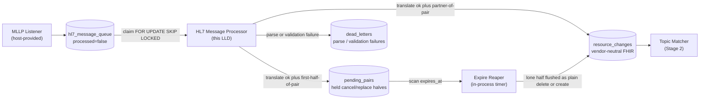
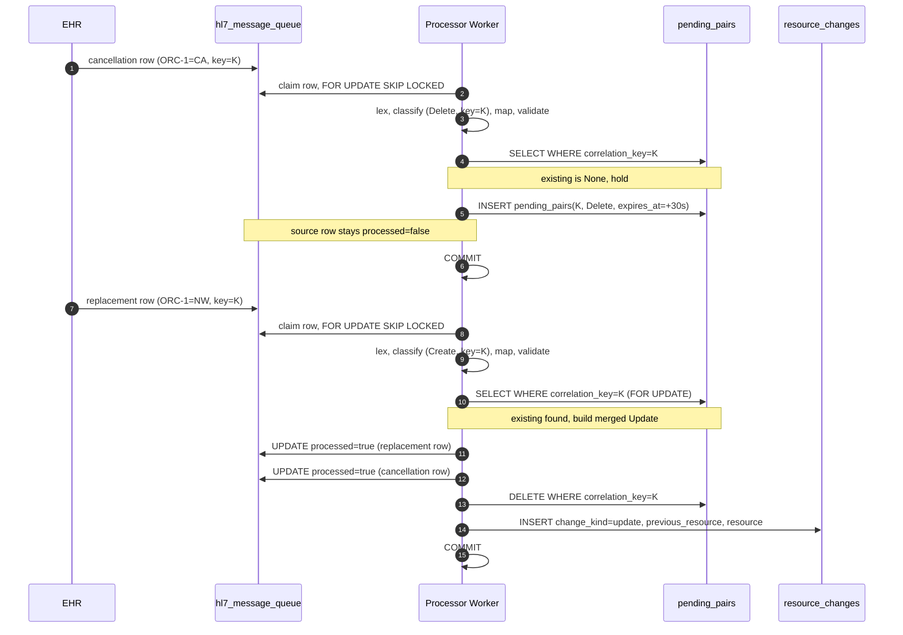
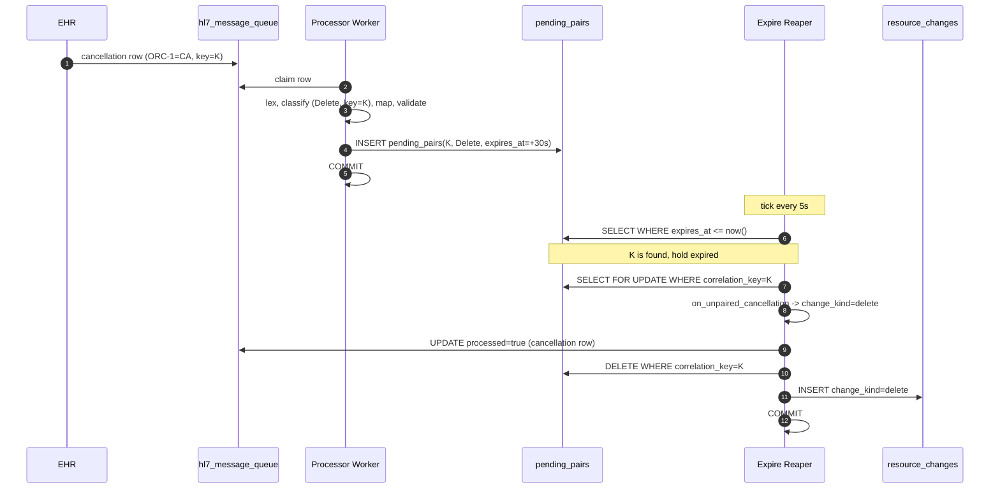

# Low-Level Design: HL7 Message Processor

**Purpose.** This document specifies the in-process design of the HL7 Message Processor sub-component of the EHR Adapter. It operationalizes the HLD's contracts into pseudo-code for the claim loop, the four overridable translation steps, the cancel-and-replace correlation state machine, the dead-letter path, and the transactional invariants that bind them.

**Reader's prerequisites.** Read [../architecture.md](../architecture.md) (translation steps 7-10, cancel-and-replace, `Hl7MessageProcessor` outline), [../high-level-design/domains/ehr-adapter.md](../high-level-design/domains/ehr-adapter.md), [../high-level-design/contracts/adapter-spi.md](../high-level-design/contracts/adapter-spi.md), [../high-level-design/contracts/internal-tables.md](../high-level-design/contracts/internal-tables.md) (`hl7_message_queue`, `resource_changes`, `pending_pairs`), and [../high-level-design/decisions/0005-cancel-and-replace-in-adapter.md](../high-level-design/decisions/0005-cancel-and-replace-in-adapter.md). This LLD does not redefine those documents.

## 1. Placement

The processor reads `hl7_message_queue` rows the MLLP Listener wrote, drives them through four translation steps, and either writes a `resource_changes` row, parks the message in `pending_pairs`, or routes it to dead-letter. Downstream of the processor: the Topic Matcher (consumes `resource_changes`), dead-letter inspector tooling (`dead_letters`), and the processor itself (`pending_pairs` on the partner-arrival or expiry path).



The processor's only EHR-facing surface is the rows already in `hl7_message_queue`. It does not open sockets, does not call the EHR FHIR API, and does not consult subscription state.

## 2. Base-class outline (REQUIRED vs OPTIONAL overrides)

The framework owns everything in the "provided" list. The vendor subclass overrides only the marked methods.

**Provided by the framework, NOT overridable:**

- Claim loop over `hl7_message_queue` using `SELECT ... FOR UPDATE SKIP LOCKED`.
- In-memory wakeup wiring from the MLLP Listener.
- Transactional outbox for the success path: `UPDATE hl7_message_queue SET processed=true` plus `INSERT INTO resource_changes` in one transaction.
- Transactional outbox for the dead-letter path: `UPDATE hl7_message_queue SET processed=true` plus `INSERT INTO dead_letters` in one transaction.
- Cancel-and-replace state machine, including `pending_pairs` reads/writes and the expiry reaper.
- Per-message metric emission, structured-log fields, and correlation-id propagation onto `resource_changes`.
- Dead-letter routing on parse, classify, map, and validation failures.

**REQUIRED overrides (vendor subclass MUST implement):**

| Method | Step | Purpose |
|---|---|---|
| `lex(raw_bytes) -> ParsedHl7Message` | 7 | Tokenize bytes to a typed segment tree, including any vendor `Z*` segments. |
| `classify(parsed) -> Classification` | 8 | Return `(change_kind, vendor_correlation_key)`. The correlation key is what the framework uses to pair cancel-and-replace halves. |
| `map_to_fhir(parsed, classification) -> FhirResource` | 9 | Apply v2-to-FHIR mappings plus vendor field overrides. Resolve references (subject, requester) by ID. Stamp `correlation_id` from the source row onto the resource. |

**OPTIONAL overrides (vendor subclass MAY implement; sensible defaults exist):**

| Method | Default | When to override |
|---|---|---|
| `validate(resource) -> ValidationResult` | Validate against base R5 profile. | Stricter facility profile; vendor-specific extensions. |
| `correlation_hold_window(resource_type) -> Duration` | 30s. | Per-resource-type tuning. |
| `on_unpaired_cancellation(resource) -> ResourceChange` | Plain `delete`. | Vendor that wants to suppress lone cancellations. |
| `on_unpaired_replacement(resource) -> ResourceChange` | Plain `create`. | Vendor where lone replacements should be suppressed or flagged. |

This is exactly the surface declared in `adapter-spi.md`.

## 3. Internal data structures

These structures are private to the framework. Their wire equivalents on disk are the row shapes in `internal-tables.md`.

```
struct ParsedHl7Message {
    mlls_message_id: String           // MSH-10 control id
    sending_app: String               // MSH-3
    sending_facility: String          // MSH-4
    timestamp: Timestamp              // MSH-7
    message_type: String              // MSH-9, e.g. "ORM^O01"
    segments: Map<String, [Segment]>  // keyed by segment id, including Z*
    raw_bytes: Bytes                  // retained for dead-letter forensics
}

struct Segment {
    id: String                        // "MSH", "PID", "ORC", "ZPI"
    fields: [Field]                   // one-indexed, HL7-shaped
}

enum ChangeKind { Create, Update, Delete }

struct Classification {
    kind: ChangeKind
    correlation_key: Option<String>   // None for messages that never pair
    is_cancellation_half: bool        // true when this message is the cancel
                                      // half of a cancel-and-replace pair
    is_replacement_half: bool         // true when this message is the replacement
                                      // half (i.e., a Create that may be paired
                                      // with a held cancellation)
    resource_type: String             // FHIR resource type the message maps to
}

struct PendingPairsRow {
    correlation_key: String           // PK
    pending_resource: FhirResource    // the held FHIR body
    pending_kind: ChangeKind          // Delete (held cancellation) or Create (held replacement)
    source_message_id: Uuid           // FK to hl7_message_queue(id)
    expires_at: Timestamp
    created_at: Timestamp
    resource_type: String             // for per-type hold-window lookup on resume
    correlation_id: String            // adapter correlation_id of the held half;
                                      // becomes the resource_changes row's id on resolve
}

struct ResourceChange {               // matches SPI shape
    resource_type: String
    change_kind: ChangeKind
    resource: FhirResource
    previous_resource: Option<FhirResource>
    occurred_at: Timestamp
    correlation_id: String
    event_code: Option<String>        // unused on the HL7 path
}

enum ProcessingOutcome {
    Emitted(ResourceChange)           // write to resource_changes, mark processed
    Held(PendingPairsRow)             // write to pending_pairs, leave processed=false
    Resolved {                        // partner arrived; merge held with current
        merged: ResourceChange
        partner_message_id: Uuid      // the held source row to mark processed too
        clear_correlation_key: String
    }
    DeadLetter {                      // parse / classify / map / validate failure
        reason: String
        error_class: ErrorClass
    }
}

enum ErrorClass {
    ParseError                        // lex failed
    ClassifyError                     // classify failed (e.g. unknown trigger)
    MapError                          // map_to_fhir failed
    ValidationError                   // validate returned invalid
    UnexpectedError                   // anything else; treated as terminal
}
```

`ParsedHl7Message`, `Classification`, and `ProcessingOutcome` are wholly in-process. `PendingPairsRow` and `ResourceChange` have on-disk equivalents.

## 4. Pseudo-code

The framework decomposes into ten named functions. The names below are notional; the language's idioms apply on adoption.

### 4.1 The claim loop

```
// run_claim_loop -- the framework's main worker. One instance per processor task.
// Inputs:  ctx (DB pool, vendor subclass, metrics, logger, config)
// Outputs: never returns under normal conditions; exits on shutdown signal
// Invariants:
//   - Every claimed row either commits (processed=true plus downstream
//     effect) or remains processed=false on rollback.
//   - The loop holds no transaction across EHR-side I/O. (No EHR I/O here.)
async fn run_claim_loop(ctx) {
    while not ctx.shutdown_requested() {
        await ctx.wakeup.recv_or_tick(claim_idle_poll_interval)

        let claimed = await claim_batch(ctx, batch_size = 16)
        if claimed.is_empty() {
            continue
        }

        for row in claimed {
            await process_one(ctx, row)
        }
    }
}

// claim_batch claims up to batch_size unprocessed rows. SKIP LOCKED means
// a crashed sibling's row becomes claimable immediately by another worker.
// The lock is per-row, scoped to process_one's per-row transaction.
async fn claim_batch(ctx, batch_size) -> [QueuedRow] {
    return ctx.db.query("
        SELECT id, body, mllp_message_id, listener_endpoint, correlation_id,
               received_at
        FROM hl7_message_queue
        WHERE processed = false
        ORDER BY received_at
        LIMIT $1
        FOR UPDATE SKIP LOCKED
    ", batch_size)
}
```

### 4.2 Per-message processing

```
// process_one drives one queued message through the pipeline. The whole
// function runs inside one Postgres transaction so source-row UPDATE,
// resource_changes / pending_pairs / dead_letters INSERT, and any
// partner-row updates commit atomically.
//
// Inputs:  ctx, row
// Outputs: none; side effects committed at end-of-function
// Invariants:
//   - Either all state changes for this row commit or none do.
//   - processed=true implies a recorded downstream effect.
//   - processed=false implies pending_pairs holds the message.
async fn process_one(ctx, row) {
    let span = ctx.tracer.start("hl7_processor.process_one", {
        message_id: row.mllp_message_id,
        listener_endpoint: row.listener_endpoint,
        correlation_id: row.correlation_id,
    })
    let timer = ctx.metrics.start_timer("fhir_subs_stage_duration_seconds",
                                        labels = { stage: "translate" })

    let tx = ctx.db.begin()
    try {
        let outcome = await translate(ctx, row)
        match outcome {
            Emitted(change) => {
                await mark_processed(tx, row.id)
                await insert_resource_change(tx, change)
                ctx.metrics.inc("fhir_subs_resource_changes_total", {
                    adapter_id: ctx.adapter_id,
                    change_kind: change.change_kind.to_str(),
                    resource_type: change.resource_type,
                })
                ctx.metrics.inc("fhir_subs_messages_processed", { outcome: "emitted" })
            },
            Held(pending) => {
                await insert_pending_pair(tx, pending)
                // do NOT mark processed; the source row stays claimable
                // by the resolution path or the reaper.
                ctx.metrics.inc("fhir_subs_pairs_held", {
                    resource_type: pending.resource_type,
                })
                ctx.metrics.set("fhir_subs_cancel_replace_pending", current_pending_count(),
                                { adapter_id: ctx.adapter_id,
                                  resource_type: pending.resource_type })
            },
            Resolved { merged, partner_message_id, clear_correlation_key } => {
                await mark_processed(tx, row.id)
                await mark_processed(tx, partner_message_id)
                await delete_pending_pair(tx, clear_correlation_key)
                await insert_resource_change(tx, merged)
                ctx.metrics.inc("fhir_subs_pairs_resolved", {
                    resource_type: merged.resource_type,
                })
                ctx.metrics.inc("fhir_subs_resource_changes_total", {
                    adapter_id: ctx.adapter_id,
                    change_kind: "update",
                    resource_type: merged.resource_type,
                })
            },
            DeadLetter { reason, error_class } => {
                await mark_processed(tx, row.id)
                await insert_dead_letter(tx, row, reason, error_class)
                ctx.metrics.inc("fhir_subs_dead_lettered_total", {
                    error_class: error_class.to_str(),
                })
                ctx.metrics.inc("fhir_subs_dead_letters_total", {
                    source: "hl7_translation",
                    reason: error_class.to_str(),
                })
            },
        }
        await tx.commit()
    } catch err {
        await tx.rollback()
        ctx.logger.error("hl7 processor transaction rolled back", {
            error: err, row_id: row.id
        })
        ctx.metrics.inc("fhir_subs_messages_processed", { outcome: "rolled_back" })
        // The row stays processed=false; another worker (or this one
        // on retry) will pick it up. We do NOT dead-letter on transient
        // DB errors -- only on classified terminal errors above.
    } finally {
        timer.observe()
        span.end()
    }
}
```

### 4.3 The translate-and-emit pipeline

```
// translate runs the four steps and decides the outcome. Does no DB writes
// itself; reads pending_pairs to decide Held vs Resolved.
//
// Inputs:  ctx, row
// Outputs: ProcessingOutcome
// Invariants:
//   - DeadLetter for every classified terminal failure.
//   - Held only when this is a cancellation half and no partner is held.
//   - Resolved when this is the partner of an existing pending_pairs row.
async fn translate(ctx, row) -> ProcessingOutcome {
    // Step 7 -- lex
    let parsed = try_or_dead_letter(ParseError, () => ctx.subclass.lex(row.body))?

    // Step 8 -- classify
    let classification = try_or_dead_letter(
        ClassifyError, () => ctx.subclass.classify(parsed))?

    // Step 9 -- map to FHIR
    let resource = try_or_dead_letter(
        MapError, () => ctx.subclass.map_to_fhir(parsed, classification))?

    // Stamp correlation_id from the source row onto the resource.
    resource = stamp_correlation_id(resource, row.correlation_id)

    // Step 10 -- validate
    let validation = ctx.subclass.validate(resource)
    if not validation.is_valid() {
        return DeadLetter {
            reason: validation.message(),
            error_class: ValidationError,
        }
    }

    // Decide whether this is a paired message or a plain emission.
    return await resolve_pairing(ctx, row, classification, resource)
}

// stamp_correlation_id sets resource.meta.tag or an equivalent extension to
// the queue row's correlation_id so downstream tracing keeps working.
fn stamp_correlation_id(resource, correlation_id) -> FhirResource { ... }
```

### 4.4 The four overridable steps -- default implementations

The base class ships defaults that work for messages that obey the v2-to-FHIR IG. Vendor subclasses override.

```
// lex_default tokenizes a raw HL7 v2 message into a ParsedHl7Message. The
// default knows the standard segments. Vendor adapters typically wrap this
// to add Z-segment parsing.
//
// Invariants: pure function; does not mutate its input bytes.
fn lex_default(raw_bytes) -> ParsedHl7Message {
    let header = parse_msh(raw_bytes)
    if header is None { throw ParseError("missing or malformed MSH") }
    let segments = split_segments(raw_bytes)
    let typed = {}
    for seg in segments {
        let id = first_field(seg)
        if id starts with "Z" {
            // unknown to the default; vendor override fills this in
            typed[id] = Segment { id, fields: tokenize_fields(seg) }
        } else {
            typed[id] = Segment { id, fields: tokenize_fields(seg) }
        }
    }
    return ParsedHl7Message {
        mlls_message_id: header.field(10),
        sending_app: header.field(3),
        sending_facility: header.field(4),
        timestamp: parse_ts(header.field(7)),
        message_type: header.field(9),
        segments: typed,
        raw_bytes: raw_bytes,
    }
}

// classify_default reads MSH-9 (message type) and ORC-1 (order control code)
// to derive change_kind and the v2 placeholder/filler correlation key.
//
// Invariants: returns Classification or throws ClassifyError. Does NOT throw
// for unknown trigger codes; instead returns Create for unknown -- the
// validate step will gate.
fn classify_default(parsed) -> Classification {
    let msh9 = parsed.message_type           // e.g. "ORM^O01"
    let trigger = msh9.split("^")[0]
    match trigger {
        "ADT" => return Classification {
            kind: derive_adt_kind(parsed),
            correlation_key: None,
            is_cancellation_half: false,
            is_replacement_half: false,
            resource_type: derive_adt_resource_type(parsed),
        },
        "ORM" | "OMP" | "OMG" => {
            let orc1 = parsed.segments["ORC"][0].field(1)   // order control
            let placeholder = parsed.segments["ORC"][0].field(2)
            let filler      = parsed.segments["ORC"][0].field(3)
            let correlation_key = pick_correlation_key(placeholder, filler)
            match orc1 {
                "NW"      => return Classification {
                                kind: Create,
                                correlation_key,
                                is_cancellation_half: false,
                                // an NW with the same correlation_key as a
                                // currently-held cancellation IS a replacement
                                is_replacement_half: true,
                                resource_type: "ServiceRequest",
                              },
                "CA" | "OC" => return Classification {
                                kind: Delete,
                                correlation_key,
                                is_cancellation_half: true,
                                is_replacement_half: false,
                                resource_type: "ServiceRequest",
                              },
                "SC" | "XO" => return Classification {
                                kind: Update,
                                correlation_key: None,
                                is_cancellation_half: false,
                                is_replacement_half: false,
                                resource_type: "ServiceRequest",
                              },
                _           => throw ClassifyError("unsupported ORC-1: " + orc1),
            }
        },
        "ORU"      => return classify_oru(parsed),     // results -> Observation/DiagnosticReport
        _          => throw ClassifyError("unsupported message type: " + msh9),
    }
}

// map_to_fhir_default applies the IG mappings. Vendor adapters override
// to apply vendor extensions and map Z-segments.
fn map_to_fhir_default(parsed, classification) -> FhirResource { ... }

// validate_default validates against the base R5 profile for the resource type.
fn validate_default(resource) -> ValidationResult {
    return ctx.profile_validator.validate(resource,
        profile = base_r5_profile_for(resource.resource_type))
}
```

**Constraints on overrides.**

- `lex` is pure (no DB reads, no network); the framework calls it inside a transaction.
- `classify` MUST set `correlation_key` whenever a message could be the cancellation or replacement half of a pair. None means "never participates in pairing." None on a cancellation causes the framework to emit a plain delete instead of pairing.
- `map_to_fhir` is deterministic; re-runs on the same parsed message produce structurally equal resources. (The framework retries on transient DB failure.)
- `validate` returns `ValidationResult.invalid(reason)` for malformed resources; it does not throw. Throwing is reserved for framework bugs and is treated as `UnexpectedError`.

### 4.5 Cancel-and-replace state machine

Three named functions in the framework, plus a per-process timer that drives the reaper. They share the same `pending_pairs` table.

```
// resolve_pairing decides Held / Resolved / Emitted for the translated message.
//
// Inputs:  ctx, row, classification, resource
// Outputs: ProcessingOutcome
// Invariants:
//   - Held only when is_cancellation_half AND no partner is held under
//     the same correlation_key.
//   - Resolved only when an existing pending_pairs row matches and the
//     arriving message is the opposite half.
//   - Emitted otherwise.
async fn resolve_pairing(ctx, row, classification, resource) -> ProcessingOutcome {
    if classification.correlation_key is None {
        return Emitted(build_plain_change(row, classification, resource))
    }

    let key = classification.correlation_key
    let existing = await ctx.db.query_one("
        SELECT * FROM pending_pairs WHERE correlation_key = $1
        FOR UPDATE
    ", key)

    if existing is None {
        if classification.is_cancellation_half {
            // First half. Hold it.
            let hold = ctx.subclass.correlation_hold_window(classification.resource_type)
            return Held(PendingPairsRow {
                correlation_key: key,
                pending_resource: resource,
                pending_kind: Delete,
                source_message_id: row.id,
                expires_at: now() + hold,
                created_at: now(),
                resource_type: classification.resource_type,
                correlation_id: row.correlation_id,
            })
        }
        // Replacement-with-no-cancellation, or any non-cancellation half
        // with a correlation_key -- emit plain.
        return Emitted(build_plain_change(row, classification, resource))
    }

    // existing is not None -- a pair is forming.
    return on_partner_arrival(ctx, row, classification, resource, existing)
}

// on_partner_arrival merges the held half with the just-translated half
// into a single resource_changes row with change_kind=update.
//
// Inputs:  ctx, row, classification, resource, existing (held PendingPairsRow)
// Outputs: ProcessingOutcome::Resolved
// Invariants:
//   - When held is Delete: held -> previous_resource, current -> resource.
//   - When held is Create: roles reverse (rare but handled).
//   - The merged correlation_id is the held half's (the row already in
//     `pending_pairs`), ensuring stable idempotency across retries.
//     Per [decisions/0008 #2](../high-level-design/decisions/0008-resolved-design-questions.md).
fn on_partner_arrival(ctx, row, classification, resource, existing)
    -> ProcessingOutcome {
    let (previous, current) = match (existing.pending_kind, classification.kind) {
        (Delete, Create) => (existing.pending_resource, resource),
        (Create, Delete) => (resource, existing.pending_resource),
        // Defensive: same-kind pair is a configuration bug. Treat as plain,
        // do NOT merge, and log loudly.
        _ => {
            ctx.logger.error("same-kind pair under same correlation_key", {
                key: existing.correlation_key,
                pending_kind: existing.pending_kind,
                arriving_kind: classification.kind,
            })
            return Emitted(build_plain_change(row, classification, resource))
        }
    }

    let merged = ResourceChange {
        resource_type: classification.resource_type,
        change_kind: Update,
        resource: current,
        previous_resource: Some(previous),
        occurred_at: max(existing.created_at, parse_msh7_or_now(resource)),
        correlation_id: existing.correlation_id,
        event_code: None,
    }
    return Resolved {
        merged: merged,
        partner_message_id: existing.source_message_id,
        clear_correlation_key: existing.correlation_key,
    }
}

// expire_reaper sweeps pending_pairs for expired rows and flushes the
// held half as a plain delete or create. Runs on a timer (default 5s).
//
// Inputs:  ctx
// Outputs: never returns under normal conditions
// Invariants:
//   - One transaction per expired row: delete pending_pairs row, mark
//     source row processed, INSERT one resource_changes row.
//   - Competes with on_partner_arrival via FOR UPDATE; one tx wins.
async fn expire_reaper(ctx) {
    while not ctx.shutdown_requested() {
        await sleep(reaper_tick_interval)   // default 5s

        let candidates = await ctx.db.query("
            SELECT correlation_key
            FROM pending_pairs
            WHERE expires_at <= now()
            FOR UPDATE SKIP LOCKED
            LIMIT 64
        ")

        for key in candidates {
            await flush_one_expired(ctx, key)
        }
    }
}

// flush_one_expired runs the per-row transaction for a single expired pair.
async fn flush_one_expired(ctx, correlation_key) {
    let tx = ctx.db.begin()
    try {
        let row = await tx.query_one("
            SELECT * FROM pending_pairs
            WHERE correlation_key = $1
            FOR UPDATE
        ", correlation_key)
        if row is None {
            // Already resolved or already swept by another worker.
            await tx.rollback()
            return
        }

        let unpaired = match row.pending_kind {
            Delete => ctx.subclass.on_unpaired_cancellation(row.pending_resource),
            Create => ctx.subclass.on_unpaired_replacement(row.pending_resource),
        }

        let unpaired_change = ResourceChange {
            resource_type: row.resource_type,
            change_kind: unpaired.change_kind,
            resource: unpaired.resource,
            previous_resource: unpaired.previous_resource,
            occurred_at: row.created_at,
            correlation_id: row.correlation_id,
            event_code: None,
        }

        await mark_processed(tx, row.source_message_id)
        await delete_pending_pair(tx, correlation_key)
        await insert_resource_change(tx, unpaired_change)
        await tx.commit()

        ctx.metrics.inc("pairs_expired", { resource_type: row.resource_type })
    } catch err {
        await tx.rollback()
        ctx.logger.error("expire_reaper transaction rolled back", { error: err })
    }
}
```

### 4.6 Dead-letter routing

```
// insert_dead_letter records a row in dead_letters. The source row is
// marked processed=true so the queue moves on; operators inspect
// dead_letters and decide whether to re-ingest after fixing.
// Always called from inside the per-message transaction; never throws.
async fn insert_dead_letter(tx, source_row, reason, error_class) {
    await tx.execute("
        INSERT INTO dead_letters (
            id, source, source_message_id, listener_endpoint, mllp_message_id,
            correlation_id, raw_body, reason, error_class, created_at
        ) VALUES (
            $1, 'hl7_translation', $2, $3, $4, $5, $6, $7, $8, now()
        )
    ", uuid(), source_row.id, source_row.listener_endpoint,
       source_row.mllp_message_id, source_row.correlation_id,
       source_row.body, reason, error_class.to_str())
}
```

`dead_letters` is owned by the storage domain; this LLD treats it as an INSERT target. The same routine handles all four classified failure paths. The HLD rule "validation failure routes to dead-letter; the source row is still marked processed" is enforced here.

## 5. Cancel-and-replace lifecycle

This subsection traces the two dominant traces: both halves arrive, and only one half arrives.

### 5.1 Both halves arrive



### 5.2 Only one half arrives (lone cancellation, expiry path)



**Symmetric hold per [decisions/0008](../high-level-design/decisions/0008-resolved-design-questions.md#7).** When `classify` returns `Create` with `is_replacement_half=true` and the partner has not yet arrived, the framework holds the replacement the same way it holds cancellations: writes a `pending_pairs` row with `pending_kind = create`, leaves the source `hl7_message_queue` row unprocessed, and waits for the partner within the configured hold window. If a `Delete` (cancellation) for the same correlation key arrives before the window expires, the framework merges the pair into one `change_kind = update` `resource_changes` row identical in shape to the cancellation-first case (`previous_resource = cancellation body`, `resource = replacement body`). If the window expires without a partner the reaper flushes the held replacement as a plain `create`. Subscribers see the same wire shape regardless of arrival order.

## 6. Translation step details

This section restates each step's contract: what the base does, what an override typically looks like, and the constraints that must hold.

### Step 7 -- lex

**Base.** Splits the bytes on segment terminators, parses MSH, builds a typed segment tree keyed by segment id, exposes `Z*` segments as raw `Segment` instances. **Override.** Calls `lex_default(raw_bytes)` first, then augments specific Z-segments with vendor-typed structures (Epic, for example, attaches an `EpicOrderMetadata` aside on `ZPI`). **Constraints.** Pure function. Throws `ParseError` on malformed-MSH or truncated-message; the framework dead-letters. Retains the original `raw_bytes` on the parsed structure for forensics.

### Step 8 -- classify

**Base.** Inspects MSH-9 (message type / trigger), ORC-1 (order control), ORC-2/ORC-3 (placeholder/filler order numbers) to derive `(change_kind, correlation_key, is_cancellation_half, is_replacement_half, resource_type)` for IG message types. **Override.** Calls `classify_default(parsed)`, then refines: a vendor Z-segment may carry the canonical correlation key (Epic placeholder order ID); the override replaces the IG-derived key. May expand the recognized message-type set. **Constraints.** Setting `correlation_key` correctly is load-bearing for pair correlation; None on a cancellation is a vendor bug. Exactly one of `is_cancellation_half` and `is_replacement_half` may be true. `ClassifyError` for unrecognized messages dead-letters.

### Step 9 -- map_to_fhir

**Base.** Applies v2-to-FHIR IG mappings for recognized messages: PID -> Patient, PV1 -> Encounter, ORC+OBR -> ServiceRequest, OBX -> Observation. Fills references by ID. **Override.** Calls `map_to_fhir_default` and patches in vendor extensions: `meta.profile` URLs, `identifier[]` types, code-system overrides. **Constraints.** Deterministic. No I/O. The framework sets `correlation_id` after the override returns; the override must not.

### Step 10 -- validate

**Base.** Validates against the base R5 profile for the resource type, returns `ValidationResult { valid, message }`. **Override.** Adds facility profile validation; Epic typically pins `meta.profile` URLs. **Constraints.** Returns `ValidationResult.invalid(reason)` for malformed resources; never throws. Failed validation always dead-letters with the source row still marked processed.

**v1 scope.** v1 validates against base R5 profiles only. The `ProfileValidator` interface is swappable so v2 can layer in IG profiles or facility-supplied profiles without touching the validate step's call sites. See [decisions/0010 #8](../high-level-design/decisions/0010-implementation-defaults.md).

## 7. Configuration knobs

These knobs are exposed in `adapter.config.hl7_processor` and validated against the manifest's `config_schema`. Defaults below.

| Knob | Default | Purpose |
|---|---|---|
| `correlation_hold_window` (per resource type) | 30s for `ServiceRequest`, none for everything else | Time the framework holds a cancellation half waiting for its replacement. |
| `reaper_tick_interval` | 5s | How often the expire reaper sweeps `pending_pairs`. |
| `claim_idle_poll_interval` | 1s | When the wakeup channel is silent, the worker still polls this often. |
| `claim_batch_size` | 16 | Rows pulled per claim. Large enough for throughput, small enough that one worker's stall does not block another's batch. |
| `dead_letter_routing_policy` | `dead_letter_table_only` | Where to record terminal failures. Alternative: `dead_letter_plus_alert` to additionally fire an OpenTelemetry event. |
| `validation_profile_set` | `r5_base` | Which profile set the default `validate` enforces. |
| `vendor_config_schema_fingerprint` | computed from manifest | Recorded in metrics so operators can see configuration rollouts. |

The `dead_letter_routing_policy` knob is intentionally narrow. A "silently drop" mode is rejected: the project's durability invariant requires every marked-processed row to leave a downstream artifact.

## 8. Metrics and structured log fields

### Metrics

| Name | Type | Labels | Source |
|---|---|---|---|
| `fhir_subs_messages_processed` | Counter | `outcome` (`emitted`, `held`, `resolved`, `rolled_back`) | per row processed |
| `fhir_subs_processing_duration` | Histogram | `outcome` | per row, end-to-end inside `process_one` |
| `fhir_subs_dead_lettered_total` | Counter | `error_class` (`parse`, `classify`, `map`, `validation`, `unexpected`) | per dead-letter |
| `fhir_subs_pairs_held` | Counter | `resource_type` | per `Held` outcome |
| `fhir_subs_pairs_resolved` | Counter | `resource_type` | per `Resolved` outcome |
| `fhir_subs_pairs_expired` | Counter | `resource_type` | per reaper-driven flush |
| `fhir_subs_resource_changes_total` | Counter | `adapter_id`, `change_kind`, `resource_type` | per `resource_changes` insert (matches the global metric in observability.md) |
| `fhir_subs_dead_letters_total` | Counter | `source=hl7_translation`, `reason` | aligns with the global dead-letter metric |
| `fhir_subs_cancel_replace_pending` | Gauge | `adapter_id`, `resource_type` | snapshot of `pending_pairs` count, refreshed per insert/delete |
| `fhir_subs_stage_duration_seconds` | Histogram | `stage=translate` | wall-clock of `process_one` |

### Structured log fields

Every log line emitted from this processor carries:

- `component=hl7_processor`
- `adapter_id=<id>`
- `correlation_id=<row.correlation_id>` (the queue row's, not the resource's; same value on success)
- `mllp_message_id=<row.mllp_message_id>`
- `listener_endpoint=<row.listener_endpoint>`
- `source_message_id=<row.id>`

When pairing is involved:

- `correlation_key=<vendor_key>`
- `pair_role` -- one of `held_cancellation`, `held_replacement`, `resolved_partner`, `expired_lone`

When a dead-letter is emitted:

- `error_class` -- one of `parse`, `classify`, `map`, `validation`, `unexpected`
- `error_reason` -- the rendered reason string

## 9. Error handling matrix

| Failure | Where caught | Effect on source row | Effect on resource_changes | Effect on pending_pairs | Metric |
|---|---|---|---|---|---|
| `lex` raises `ParseError` | `translate` | marked processed | none | none | `dead_lettered_total{error_class=parse}` |
| `classify` raises `ClassifyError` | `translate` | marked processed | none | none | `dead_lettered_total{error_class=classify}` |
| `map_to_fhir` raises `MapError` | `translate` | marked processed | none | none | `dead_lettered_total{error_class=map}` |
| `validate` returns invalid | `translate` | marked processed | none | none | `dead_lettered_total{error_class=validation}` |
| Vendor `validate` throws | `translate` | marked processed | none | none | `dead_lettered_total{error_class=unexpected}` |
| Postgres write of `resource_changes` fails | `process_one` | rolled back, stays unprocessed | none (tx rolled back) | none | `messages_processed{outcome=rolled_back}` |
| Postgres write of `pending_pairs` fails | `process_one` | rolled back, stays unprocessed | none | none | `messages_processed{outcome=rolled_back}` |
| Reaper transaction fails on partner-row mark-processed | `flush_one_expired` | unchanged | none | unchanged | logged; next reaper tick retries |
| Hold-window race: partner arrives during reaper tick | both `on_partner_arrival` and `flush_one_expired` compete on `FOR UPDATE` | exactly one wins; the loser sees a missing row and no-ops | exactly one row emitted | row deleted exactly once | one of `pairs_resolved` or `pairs_expired` |
| Same-kind pair (two cancellations under same key) | `on_partner_arrival` | the just-translated row is emitted plain; held row stays held | the just-translated row produces a plain `delete` | unchanged | logged at error level |
| Process restart with held pairs | `run_claim_loop` startup hook | source rows still `processed=false` | none on startup | rows persisted; reaper resumes | none on startup |

The two interesting races -- "partner arrives during reaper" and "two workers claim the same partner" -- are both resolved by `FOR UPDATE` on `pending_pairs`. The first transaction to acquire the row wins; the loser sees the row gone or deleted and falls back to plain emission for the just-translated message.

## 10. Test plan

### Unit

- **`lex`.** Round-trip every IG-conformant fixture; serialization equals the input bytes (modulo separators). Negative: malformed MSH, truncated message, invalid encoding throw `ParseError`.
- **`classify`.** Table-driven over `(MSH-9, ORC-1, ORC-2, ORC-3)` tuples; assert returned `Classification` including pair half-flags.
- **`map_to_fhir`.** Snapshot tests against IG fixtures; produced resource matches expected modulo the framework-stamped `correlation_id`.
- **`validate`.** Positive: snapshot suite validates. Negative: hand-crafted invalid resource returns `invalid` with non-empty reason. Vendor `validate` throwing surfaces as `UnexpectedError`.
- **`resolve_pairing`.** Three branches: (a) no key -> Emitted; (b) cancellation half, no existing -> Held; (c) replacement half, existing held cancellation -> Resolved.
- **`on_partner_arrival`.** Order test: held cancellation + arriving replacement produces a merged `Update` (cancellation as `previous_resource`, replacement as `resource`). Same-kind defensive case logs and emits plain.
- **`flush_one_expired`.** Time-warped: `expires_at` past; reaper emits plain `delete` (or `create`), deletes the pending row, marks source processed -- all in one transaction.

### Integration

- **Single message, success.** One row in queue; one cycle; assert `processed=true`, one `resource_changes` row, no `pending_pairs`, no `dead_letters`.
- **Single message, parse error.** Garbage bytes; one cycle; assert `processed=true`, no `resource_changes`, one `dead_letters` row with `error_class=parse`.
- **Cancel-and-replace happy path.** Insert cancellation (held), insert replacement; assert both source rows processed, no pending row, one `resource_changes` `update` with both bodies.
- **Cancel-and-replace expiry.** Insert cancellation, advance past hold window, run reaper; assert one `resource_changes` `delete`.
- **Partner-arrived-during-expiry race.** Hold reaper transaction, submit replacement on parallel connection; assert exactly one downstream row (either `update` or `delete`), never both, never neither.
- **Process restart.** Hold cancellation, kill worker, start new worker; replacement on new worker still resolves into `update`.

### Property

- **Idempotency under retry.** Inject transient DB errors before commit; rollback leaves the row claimable; eventual downstream effect is exactly one row (one `resource_changes`, one `dead_letters`, or one `pending_pairs`).
- **Cancel-and-replace correctness under reordering.** For any interleaving of cancellation, replacement, and reaper ticks consistent with arrival order, the emission set is one `update` (both halves inside window) or one `delete` plus one `create` (window expired between).
- **Vendor override determinism.** Two invocations of the same `lex -> classify -> map_to_fhir` pipeline on the same input produce structurally equal resources.

## 11. Open questions

- **Per-resource-type hold-window catalog shape.** This LLD assumes `correlation_hold_window(resource_type)` returns the right value; the configuration shape (map vs list-with-default) is left to the configuration domain.
- **Reordered partners.** Resolved by [decisions/0008](../high-level-design/decisions/0008-resolved-design-questions.md#7): the framework holds replacements symmetrically with cancellations. Subscribers see the same merged `update` regardless of arrival order. Vendor `classify` is responsible for tagging both halves; the framework does the rest.
- **Cross-listener correlation keys.** Resolved by [decisions/0008](../high-level-design/decisions/0008-resolved-design-questions.md#8): pairing is **same-endpoint only**. The framework includes `listener_endpoint` in the `pending_pairs` lookup key alongside `correlation_key`. Two halves arriving on different endpoints are treated as unrelated and emit as plain `delete` / `create`. Each unmatched cross-endpoint half increments `fhir_subs_pairs_cross_endpoint_unmatched_total` so operators can detect misconfigured feeds.
- **Multi-replica reaper.** The current single-replica deployment uses one reaper. `FOR UPDATE SKIP LOCKED` already makes N concurrent reapers safe; the metric `pairs_expired` would need a `replica` label.

## 12. What this LLD does NOT cover

- The MLLP socket, framing, and persistence-then-ACK durability boundary -- see the future `low-level-design/mllp-listener.md`.
- The FHIR Scan Runner sub-component (Stage 1 from FHIR REST polling) -- separate LLD.
- The Vendor API Client sub-component (Stage 1 from vendor change feeds) -- separate LLD.
- The Hydration Service sub-component (Stage 4 callback) -- separate LLD.
- The Topic Matcher (Stage 2) -- the consumer of `resource_changes`, separate LLD.
- The dead-letter table's schema, retention, and operator UI -- owned by the storage and operations domains.
- The MLLP Listener's metric/log fields -- owned by [../high-level-design/domains/mllp-listener.md](../high-level-design/domains/mllp-listener.md).
- The conformance test suite an out-of-tree adapter must pass -- owned by `adapter-spi-tests` (separate doc).

Cross-references:

- HLD domain: [../high-level-design/domains/ehr-adapter.md](../high-level-design/domains/ehr-adapter.md)
- HLD contract: [../high-level-design/contracts/adapter-spi.md](../high-level-design/contracts/adapter-spi.md)
- HLD contract: [../high-level-design/contracts/internal-tables.md](../high-level-design/contracts/internal-tables.md)
- ADR: [../high-level-design/decisions/0005-cancel-and-replace-in-adapter.md](../high-level-design/decisions/0005-cancel-and-replace-in-adapter.md)
- Architecture, translation steps: [../architecture.md](../architecture.md)
