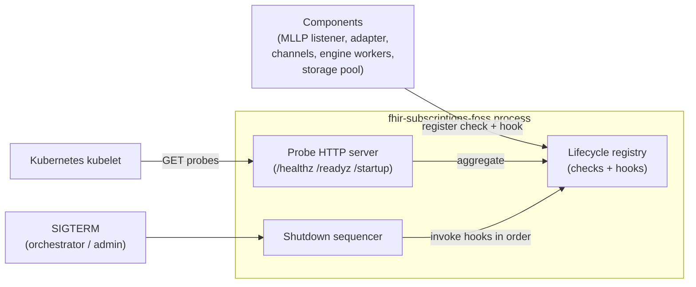

# Lifecycle — Low-Level Design

**Purpose.** Implementation-level design of the `lifecycle` module: the `/healthz`, `/readyz`, and `/startup` probe endpoints; the `ReadinessCheck` and `ShutdownHook` registration API every long-running component uses; the SIGTERM-driven shutdown sequencer that marks the service unready, stops accepting new work, drains in-flight work bounded by `lifecycle.shutdown_grace_period`, closes connections, and exits. The two load-bearing invariants are: (a) liveness MUST NOT depend on Postgres, and (b) shutdown follows a strict five-phase order with the grace-period budget enforced as a hard wall-clock deadline.

**Reader's prerequisites.** Read [../high-level-design/domains/lifecycle.md](../high-level-design/domains/lifecycle.md) and the architecture sections "Health, Readiness, and Graceful Shutdown" and "Configuration" for the canonical probe semantics and configuration field names. This LLD assumes those are baseline.

## 1. Component placement



The lifecycle module owns three things and nothing else: the probe HTTP server, the registry of `ReadinessCheck` and `ShutdownHook` callbacks, and the shutdown sequencer. It does not own any other component's readiness logic — each component implements its own check and registers it. It does not own retry or drain semantics for any specific in-flight work; it bounds the total drain time and asks each registered hook to drain itself.

## 2. Module layout

The module is `infra/lifecycle` per the architecture's module layout. Sub-modules:

- `probe_server` — the unauthenticated HTTP server hosting `/healthz`, `/readyz`, and `/startup`. Either co-mounts on the main API listener or binds its own address depending on `server.http.probe_bind`.
- `registry` — the in-memory registry of `ReadinessCheck` and `ShutdownHook` callbacks. Components register at startup; the registry is read by the probe handlers and walked by the sequencer.
- `liveness` — the trivial `/healthz` handler. Reads only the in-memory `shutdown_in_progress` flag and the `panic_signaled` flag.
- `readiness` — the `/readyz` and `/startup` aggregator. Runs every registered `ReadinessCheck`, collects the failures, returns the aggregated JSON.
- `sequencer` — the SIGTERM handler. Owns the five-phase orchestrator and the `shutdown_grace_period` wall-clock deadline.
- `signals` — wires SIGTERM and SIGINT into the sequencer's input channel.
- `config_types` — typed config structs for `lifecycle.*` and `server.http.probe_bind`.

## 3. Public surface

```
struct LifecycleModule {
    // Constructed once at startup from validated config.
}

impl LifecycleModule {
    // Build the registry, bind the probe HTTP server, install the signal
    // handlers. Probes are reachable as soon as start() returns.
    async fn start(config: LifecycleConfig, ctx: LifecycleContext) -> Result<LifecycleModule>;

    // Components register their readiness checks + shutdown hooks here.
    // Registration is idempotent on (component_name, kind).
    fn register_readiness(&self, name: &str, check: ReadinessCheck);
    fn register_shutdown(&self, name: &str, hook: ShutdownHook);

    // Trigger a graceful shutdown programmatically. Used by panic recovery
    // and other internal callers; SIGTERM enters the same path via signals.
    async fn request_shutdown(&self, reason: ShutdownReason);

    // Block until shutdown completes or the grace period expires.
    async fn wait_for_exit(&self) -> ShutdownReport;
}
```

`LifecycleContext` is the host-provided dependency bundle: the metrics emitter, the structured logger, a clock, and the storage pool reference (used only by the readiness check the storage module registers, not by the lifecycle module itself). The lifecycle module does not own a Postgres handle — that would create a dependency loop with the readiness probe and would tempt liveness into reaching the DB.

## 4. The `ReadinessCheck` and `ShutdownHook` types

Components register one of each. Both are simple async callbacks with documented contracts.

```
type ReadinessCheckResult = Ok | Failed(reason: String)

trait ReadinessCheck {
    fn name(&self) -> &str;             // appears in the failed[] list
    async fn evaluate(&self) -> ReadinessCheckResult;
    fn timeout(&self) -> Duration;      // per-check budget; 2s is typical
    fn cadence_hint(&self) -> Duration; // how often the readiness aggregator may re-evaluate
}

trait ShutdownHook {
    fn name(&self) -> &str;
    fn phase(&self) -> ShutdownPhase;   // StopAccepting | Drain | CloseConnections
    async fn run(&self, deadline: Instant) -> HookOutcome;
}

enum HookOutcome { Drained, TimedOut, Errored(reason: String) }
```

The phase enum is what lets the sequencer interleave hooks correctly without each component knowing about the others. Hooks of the same phase run concurrently; the sequencer only waits for one phase to complete before starting the next.

## 5. Probe handlers

### 5.1 `/healthz` — liveness

The handler reads two in-memory flags and returns. There is no I/O, no DB call, no network call, no awaiting on any registered check. This is the rule: liveness MUST NOT depend on Postgres or any other dependency the service cannot fix by restarting.

```
async fn handle_healthz(ctx) -> HttpResponse {
    if ctx.registry.shutdown_in_progress() {
        return json_response(503, {"status": "shutting_down"})
    }
    if ctx.registry.panic_signaled() {
        return json_response(503, {"status": "panic"})
    }
    return json_response(200, {"status": "ok"})
}
```

`shutdown_in_progress` is set by the sequencer at the start of phase 1. `panic_signaled` is set by a runtime panic handler (or by the deadlock detector, where the runtime provides one). Neither flag is reset at runtime — once the service starts shutting down or panics, it does not pretend otherwise.

### 5.2 `/readyz` — readiness

The handler walks every registered `ReadinessCheck` concurrently with each check's own timeout, collects results, and returns 200 if every check passed and the service is not shutting down; 503 otherwise.

```
async fn handle_readyz(ctx) -> HttpResponse {
    if ctx.registry.shutdown_in_progress() {
        return json_response(503, {"status": "unready", "failed": ["shutdown_in_progress"]})
    }
    let checks = ctx.registry.readiness_checks()
    let results = run_checks_concurrently(checks)
    let failed = results.filter(r -> r.outcome.is_failed()).map(r -> r.name)
    if failed.is_empty() {
        return json_response(200, {"status": "ready"})
    }
    return json_response(503, {"status": "unready", "failed": failed})
}

async fn run_checks_concurrently(checks) -> List<CheckResult> {
    let futures = checks.map(c -> async {
        let deadline = now() + c.timeout()
        let outcome = race(c.evaluate(), sleep_until(deadline))
        match outcome {
            Ok                          -> CheckResult { name: c.name(), outcome: Pass }
            Failed(reason)              -> CheckResult { name: c.name(), outcome: Fail(reason) }
            TimedOut                    -> CheckResult { name: c.name(), outcome: Fail("timeout") }
        }
    })
    return join_all(futures)
}
```

The aggregator does not retry a failing check. If Postgres flickers, readiness flickers; the orchestrator decides what to do with the flicker. Retrying would mask transient outages and is the wrong layer for that decision.

The set of readiness checks expected at runtime, registered by their owning components:

| Check name | Registered by | What it does |
|---|---|---|
| `postgres` | `infra/storage` | `SELECT 1` on a checked-out pool connection with `lifecycle.postgres_probe_timeout` (default 2s). |
| `adapter.<id>` | `adapters/<id>` | The adapter's `on_start` completion flag is set; child sub-components report ready. |
| `mllp_listener` | `mllp-listener` | At least one configured endpoint is bound. |
| `channels.<id>` | each `channels/<id>` | The channel module's `start()` completed and any persistent connections (Kafka, SMTP pool) are healthy. |
| `topic_catalog` | `topics/catalog` | The catalog finished its initial load (built-in + adapter + operator-supplied). |

The `postgres` check is the canonical example of a check the liveness handler does NOT call. Its result feeds readiness only.

### 5.3 `/startup` — startup probe

Same handler as `/readyz` with one behavioral difference: until the sequencer flips the `startup_complete` flag, `/startup` always returns 503 even if every readiness check happens to pass. This keeps Kubernetes' startup grace period in effect through the slow parts of boot (schema migrations, topic catalog load, initial FHIR scan if the adapter does one in `on_start`).

```
async fn handle_startup(ctx) -> HttpResponse {
    if !ctx.registry.startup_complete() {
        return json_response(503, {"status": "starting", "phase": ctx.registry.startup_phase()})
    }
    return handle_readyz(ctx)
}
```

The `startup_phase` field is informational ("loading_topics" / "running_migrations" / "starting_channels" / etc.) and helps operators see why a startup is taking long without reading logs.

## 6. The shutdown sequencer

SIGTERM (or `request_shutdown`) enters the sequencer's input channel exactly once. The sequencer is single-threaded across the whole shutdown — it cannot be re-entered, and a second SIGTERM coalesces with the first.

The sequencer enforces the five phases described in the HLD, with hooks bucketed by `ShutdownPhase`. Wall-clock time is bounded by `lifecycle.shutdown_grace_period` (default 30s). Each phase has a soft sub-budget; remaining budget rolls forward to subsequent phases.

```
async fn run_shutdown(ctx, reason) -> ShutdownReport {
    log_info("shutdown initiated", reason)
    ctx.registry.set_shutdown_in_progress(true)
    metrics.shutdown_initiated_total.increment(reason)

    let total_budget = ctx.config.shutdown_grace_period
    let started_at = now()
    let deadline = started_at + total_budget

    // Phase 1: mark unready. Already done by the flag flip above.
    //          Sleep one probe interval so the orchestrator observes 503
    //          before we start refusing new work — this keeps the LB from
    //          sending requests into a draining pod.
    let probe_observe_window = min(total_budget * 0.05, 2_seconds)
    sleep(probe_observe_window)

    // Phase 2: stop accepting new work.
    let p2_hooks = ctx.registry.hooks_in_phase(StopAccepting)
    let p2_outcome = race_phase(p2_hooks, deadline, soft_budget = total_budget * 0.10)

    // Phase 3: drain in-flight work.
    let p3_hooks = ctx.registry.hooks_in_phase(Drain)
    let p3_outcome = race_phase(p3_hooks, deadline, soft_budget = total_budget * 0.70)

    // Phase 4: close connections.
    let p4_hooks = ctx.registry.hooks_in_phase(CloseConnections)
    let p4_outcome = race_phase(p4_hooks, deadline, soft_budget = total_budget * 0.15)

    let elapsed = now() - started_at
    let report = ShutdownReport {
        reason,
        elapsed,
        phase_results: [p2_outcome, p3_outcome, p4_outcome],
        forced_exit: elapsed >= total_budget,
    }

    log_info("shutdown complete", report)
    metrics.shutdown_completed_total.increment(report.forced_exit ? "forced" : "graceful")
    return report
}

async fn race_phase(hooks, deadline, soft_budget) -> PhaseResult {
    let phase_deadline = min(now() + soft_budget, deadline)
    let futures = hooks.map(h -> async {
        let outcome = race(h.run(phase_deadline), sleep_until(phase_deadline))
        return HookResult { name: h.name(), outcome }
    })
    let results = join_all(futures)
    return PhaseResult { hook_results: results, hit_deadline: now() >= phase_deadline }
}
```

After phase 4 the process returns from `wait_for_exit`. Main calls `process::exit(0)` for a graceful exit and `process::exit(1)` if `report.forced_exit` is true.

### Phase ownership (which components register hooks for which phase)

| Phase | Registered hook | Owner | Action |
|---|---|---|---|
| StopAccepting | `subscriptions_api.refuse_writes` | `api/http-fhir` | Reject `POST`/`PUT`/`DELETE` on `Subscription` with 503; reads keep serving. |
| StopAccepting | `mllp_listener.stop_accepting` | `mllp-listener` | Close listening sockets; existing connections keep their slot. |
| StopAccepting | `engine.stop_claiming` | `engine/*` | Each stage worker sets a flag that suppresses the next `SELECT FOR UPDATE SKIP LOCKED`. |
| Drain | `mllp_listener.drain_connections` | `mllp-listener` | Read in-flight messages to completion, persist-then-ACK, drop sockets when idle. No NACKs during drain. |
| Drain | `adapter.drain_workers` | `adapters/<id>` | HL7 Message Processor / FHIR Scan Runner / Vendor API Client commit their current row, then stop. Cancel-and-replace pending pairs are flushed to durable state. |
| Drain | `engine.drain_in_flight` | `engine/*` | Each stage commits its current transaction. |
| Drain | `channels.<id>.drain_in_flight` | `channels/<id>` | In-flight HTTPS POST / WSS frame / SMTP submit completes and writes the resulting `deliveries` row state. Mid-attempt deliveries left as `pending`. |
| CloseConnections | `storage.close_pool` | `infra/storage` | Postgres pool close timeout. |
| CloseConnections | `channels.websocket.close_subscribers` | `channels/websocket` | Send normal close frames to subscribers. |
| CloseConnections | `adapter.close_change_feeds` | `adapters/<id>` | Long-lived vendor change-feed connections close gracefully. |

The sequencer doesn't know the names of these hooks at compile time — it walks whatever the registry holds. The table is descriptive of expected runtime contents, not part of the lifecycle module's code.

## 7. Registration semantics and idempotency

Components register at startup, after they have constructed the resource the check or hook protects. Registration is idempotent on `(component_name, kind)` so a re-entrant init does not double-register. The registry refuses registration after `shutdown_in_progress` is set — registering a hook during shutdown is always a bug.

```
fn register_readiness(name: String, check: ReadinessCheck) -> Result<()> {
    if self.shutdown_in_progress.load() {
        return Err("registration after shutdown")
    }
    self.readiness_checks.insert_or_replace(name, check)
    return Ok
}

fn register_shutdown(name: String, hook: ShutdownHook) -> Result<()> {
    if self.shutdown_in_progress.load() {
        return Err("registration after shutdown")
    }
    self.shutdown_hooks.insert_or_replace((name, hook.phase()), hook)
    return Ok
}
```

The order in which hooks register does not affect shutdown order. Phase ordering is structural; within a phase, hooks run concurrently. A component that needs to wait for another component's hook to finish must declare a later phase, not rely on registration order.

## 8. Probe HTTP server placement

The probe HTTP server is one of two things, decided by configuration:

- `server.http.probe_bind == null` (default): the probe handlers are mounted as additional routes on the main API listener. They live alongside `/metadata` but are not advertised in the `CapabilityStatement`. This keeps a single TLS posture and a single bind for small deployments.
- `server.http.probe_bind == "0.0.0.0:8081"` (or similar): probes are served from a dedicated, plain-HTTP listener on the configured address. This is the recommended pattern for Kubernetes deployments — kubelet probes do not need to negotiate the API's TLS, and operators can keep the probe port off external load balancers.

The probe listener has a tiny request budget (200ms read timeout, 200ms write timeout) and a small response cap (4 KiB) so a slow client cannot tie up the probe server.

## 9. SIGTERM and signal handling

```
fn install_signal_handlers(ctx) {
    on_signal(SIGTERM, () -> ctx.lifecycle.request_shutdown(SigTerm))
    on_signal(SIGINT,  () -> ctx.lifecycle.request_shutdown(SigInt))
    // SIGKILL is non-recoverable. The service receives no notice and exits
    // immediately. At-least-once delivery is preserved because every stage
    // commits its row before acknowledging upstream — the next incarnation
    // re-claims unfinished rows. Operators who SIGKILL accept that in-flight
    // deliveries may resend on restart.
}
```

`SIGKILL` is explicitly not recoverable. The architecture's at-least-once guarantee covers this case via durable rows — every uncommitted unit of work is re-claimed on the next process incarnation by virtue of `SELECT FOR UPDATE SKIP LOCKED` on input tables. The lifecycle module does not pretend to do anything for `SIGKILL`; it simply doesn't get a chance to.

## 10. Failure modes

- **A readiness check panics.** The aggregator catches the panic, treats it as `Failed("panic")`, and continues evaluating other checks. The panic is logged and a metric (`fhir_subs_readiness_check_panics_total{check}`) increments. Repeated panics on the same check are an operational bug to fix in that component.
- **A shutdown hook hangs past its phase deadline.** The sequencer abandons it, marks the hook as `TimedOut`, and proceeds to the next phase. A timed-out drain hook means in-flight rows revert to `pending` for the next incarnation.
- **Total grace period elapses.** The sequencer skips remaining phases and forces exit with status 1. Any uncommitted work survives in durable rows and is re-claimed on the next start.
- **Probe HTTP server fails to bind.** A startup error. The service refuses to come up because Kubernetes cannot probe it.

## 11. Configuration knobs (canonical fields in `architecture.md`)

The lifecycle module reads these fields from the validated configuration:

- `server.http.probe_bind` — `null` (default) to share the main listener, or a `host:port` to expose probes on a separate port. The `configuration` LLD owns the validator; this module only consumes the resolved value.
- `lifecycle.shutdown_grace_period` — total wall-clock budget for the shutdown sequence. Default 30s.
- `lifecycle.postgres_probe_timeout` — per-evaluation budget for the storage module's readiness `SELECT 1`. Default 2s.

Operators tune `shutdown_grace_period` based on their typical in-flight delivery time. A deployment with slow downstream subscribers (long HTTPS POST timeouts, batched email submits) needs a longer grace period to drain cleanly. A deployment that tolerates more re-deliveries on restart can run a shorter grace period and accept the at-least-once cost.

## 12. Metrics emitted by this module

| Metric | Type | Labels | Notes |
|---|---|---|---|
| `fhir_subs_probe_requests_total` | Counter | `probe` (`healthz`/`readyz`/`startup`), `status_code` | Probe traffic. |
| `fhir_subs_readiness_check_duration_seconds` | Histogram | `check` | How long each registered check takes. |
| `fhir_subs_readiness_check_failures_total` | Counter | `check`, `reason` | Failure breakdown per check. |
| `fhir_subs_readiness_check_panics_total` | Counter | `check` | Catches checks that throw. |
| `fhir_subs_shutdown_initiated_total` | Counter | `reason` (`sigterm`/`sigint`/`admin_api`) | One per shutdown. |
| `fhir_subs_shutdown_phase_duration_seconds` | Histogram | `phase` | Wall-clock time per phase. |
| `fhir_subs_shutdown_hook_outcome_total` | Counter | `hook`, `outcome` (`drained`/`timed_out`/`errored`) | Per-hook outcome. |
| `fhir_subs_shutdown_completed_total` | Counter | `kind` (`graceful`/`forced`) | Whether the deadline was hit. |

The module's structured-log lines carry `component=lifecycle` and the same correlation IDs the rest of the service uses; specific events are listed in the `observability` LLD.

## 13. Ambiguity flagged

- The architecture says "internal panic, deadlock-detection signal" causes `/healthz` 503. Whether the runtime exposes a deadlock detector is language-dependent (Tokio offers `tokio-console` watchdogs; the JVM has its own thread-dump tooling). The exact wiring of `panic_signaled` is deferred to the language ADR.
- The split between phase budgets (5%/10%/70%/15%) is a starting point. Operators with very different workloads (heavy batching, long-lived SMTP submits) may need to override; whether to expose the split as a knob or hard-code it is left for implementation.

The previously-flagged question of admin-API authentication for `request_shutdown` is closed by [decisions/0008](../high-level-design/decisions/0008-resolved-design-questions.md): there is no admin API. `request_shutdown` is an in-process call only.
