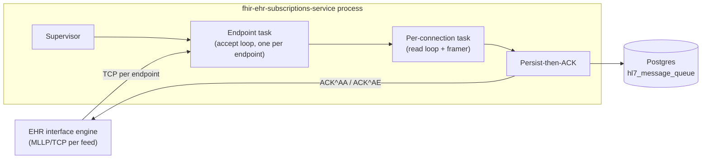

# MLLP Listener — Low-Level Design

**Purpose.** Implementation-level design of the host-provided, vendor-neutral MLLP receiver: how it accepts TCP connections on each configured endpoint, frames messages per the MLLP transport spec, captures `MSH-9` and `MSH-10` only, persists raw bytes to `hl7_message_queue`, and ACKs the EHR after the Postgres COMMIT. The persistence-then-ACK transaction and the NACK / drop-connection backpressure model are the load-bearing invariants.

**Reader's prerequisites.** Read [../high-level-design/domains/mllp-listener.md](../high-level-design/domains/mllp-listener.md), [../high-level-design/contracts/internal-tables.md](../high-level-design/contracts/internal-tables.md) (the `hl7_message_queue` section), [../high-level-design/decisions/0003-mllp-listener-vendor-neutral.md](../high-level-design/decisions/0003-mllp-listener-vendor-neutral.md), and `../architecture.md` (sections "EHR side", "Backpressure and overload behavior", and the `mllp_listener.endpoints[]` configuration block). This LLD assumes those are baseline.

## 1. Component placement



The supervisor owns one accept-loop task per configured endpoint. Each accepted TCP connection is handed off to its own per-connection task that frames messages and runs the persist-then-ACK transaction synchronously per message, in order. The seam between the listener and the rest of the service is `hl7_message_queue` — nothing in this component reaches further into the pipeline.

## 2. Module layout

The listener is one module (`mllp-listener` in the architecture's module layout) decomposed into the following sub-modules. Names are notional; they will be normalized to the chosen language's idioms.

- `supervisor` — top-level lifecycle. Reads `mllp_listener.endpoints[]` from validated config, spawns one `endpoint_task` per entry, owns the shutdown channel, exposes the readiness accessor.
- `endpoint_task` — per-endpoint accept loop. Owns the listening socket (plain TCP or TLS), spawns a `connection_task` per accepted connection, tracks the per-endpoint connection set for shutdown drain.
- `connection_task` — per-connection read loop. Owns the TCP read/write halves and a fixed-size accumulation buffer. Drives `framer`, `persistor`, and `acknowledger` per message.
- `framer` — pure, allocation-light MLLP de-framer. Stateful across reads but with no I/O. Detects start/end markers, surfaces complete frames, rejects oversize and malformed framing.
- `msh_extractor` — minimal `MSH-9` and `MSH-10` extractor. Reads only the first segment up to the relevant fields and stops. No structure-aware parsing of the rest of the body.
- `persistor` — wraps the Postgres `INSERT INTO hl7_message_queue` plus COMMIT. Owns the per-listener connection-pool checkout and the statement timeout. Returns a typed result: `Persisted | TransientFailure | PermanentFailure`.
- `acknowledger` — builds and writes the MSH ACK frame on the same socket. Builds `AA` for success, `AE` for application error (NACK), and `AR` for "reject" used only when the framing was malformed enough that the upstream message couldn't be identified.
- `metrics` — typed counters / histograms / gauges, registered once at supervisor startup and shared by all endpoint and connection tasks.
- `config_types` — strongly-typed config structs derived from the architecture's YAML. Validation runs at startup, before any socket binds.

## 3. Public surface

The listener exposes exactly the following to the rest of the service. Nothing else of this module is public; in particular, no one outside the module reads or writes `hl7_message_queue` rows on this code path.

```
struct MllpListener {
    // Constructed once at startup from validated config.
}

impl MllpListener {
    // Bind every endpoint, start every accept loop, register readiness probes.
    // Returns once every endpoint is bound (or fails fast if any endpoint
    // cannot bind and the deployment is configured to require it).
    async fn start(config: MllpListenerConfig, ctx: ListenerContext) -> Result<MllpListener>;

    // Read-only status: per-endpoint bound flag, current connection count,
    // shedding flag. Used by the lifecycle module's /readyz handler.
    fn status(&self) -> MllpListenerStatus;

    // Begin graceful shutdown: stop accepting new connections, drain in-flight
    // messages on existing connections, close sockets, return when done or
    // when shutdown_grace_period elapses.
    async fn shutdown(&self, deadline: Instant) -> ShutdownReport;
}
```

`ListenerContext` is the host-provided dependency bundle: a Postgres connection pool, the metrics emitter, the structured logger, a clock, and a `correlation_id` generator. Every dependency is injected — the listener does not reach for globals. This is what makes the per-connection task trivially unit-testable against in-memory fakes.

The lifecycle module wires `MllpListener::shutdown` into the SIGTERM handler and `MllpListener::status` into `/readyz`. There are no other public entry points.

## 4. Internal data structures

All structs are pseudo-code sketches. Field names will be normalized in the implementation.

```
// Validated startup config (one per deployment).
struct MllpListenerConfig {
    endpoints: List<EndpointConfig>,
    inflight_cap_per_connection: u32,        // default 64
    max_message_bytes: u32,                  // default 1 MiB
    read_idle_timeout: Duration,             // default 60s
    persist_timeout: Duration,               // default 5s, must be < statement_timeout
    nack_first_then_drop_after: u32,         // default 5 consecutive persist failures
    shutdown_drain_grace: Duration,          // bounded by lifecycle.shutdown_grace_period
}

struct EndpointConfig {
    name: String,                            // e.g. "adt-feed"
    bind: SocketAddr,                        // 0.0.0.0:2575
    tls: Option<TlsConfig>,                  // None = plain MLLP
    allowed_message_types: Option<Set<String>>,  // None = accept all
}

// Per-endpoint listener state, lives for the process lifetime.
struct EndpointState {
    config: EndpointConfig,
    listening_socket: TcpListener,
    active_connections: ConcurrentMap<ConnectionId, ConnectionHandle>,
    connection_count_gauge: GaugeHandle,
    shutdown_signal: WatchReceiver<ShutdownPhase>,
}

// Per-connection state. Lives only for the lifetime of one TCP connection.
struct ConnectionState {
    id: ConnectionId,
    endpoint_name: String,
    peer_addr: SocketAddr,
    accept_buffer: ByteBuffer,                // append-only, bounded by max_message_bytes
    inflight_persist_count: u32,              // for inflight_cap_per_connection
    consecutive_persist_failures: u32,
    started_at: Instant,
}

// The structured row written to hl7_message_queue. The persistor is the
// only code that turns a successfully-framed message into one of these.
struct QueueRow {
    id: Uuid,                                 // server-assigned
    received_at: Timestamp,
    listener_endpoint: String,                // EndpointConfig.name
    peer_addr: String,                        // "ip:port"
    mllp_message_id: Option<String>,          // MSH-10, may be missing on malformed-but-frameable bodies
    correlation_id: Uuid,                     // server-assigned, propagates downstream
    body: Bytes,                              // the inter-marker bytes, verbatim
    processed: bool,                          // always false at insert
}

enum FramerEvent {
    Frame { body: Bytes },                    // a complete inter-marker body
    Malformed { reason: MalformedReason },    // junk between or inside markers, or >max_message_bytes
    NeedMore,                                 // accumulator does not yet contain a full frame
}

enum MalformedReason {
    OversizedMessage,                         // body exceeded max_message_bytes
    UnexpectedStartByteMidFrame,              // 0x0B inside an open frame
    EndBeforeStart,                           // 0x1C 0x0D before any 0x0B
    StartWithoutEnd,                          // peer disconnected mid-frame
}

enum PersistOutcome {
    Persisted { row_id: Uuid, correlation_id: Uuid },
    TransientFailure { reason: String },      // pool exhaustion, statement timeout, retryable PG error
    PermanentFailure { reason: String },      // integrity error, programmer error
}
```

## 5. Pseudo-code

The pseudo-code below is plain async, ASCII, and language-independent. Each block is a small function with a comment block declaring its responsibility and the invariants it preserves.

### 5.1 Supervisor startup

```
// Bind every configured endpoint and spawn its accept loop.
// Invariants:
//   - On success, every endpoint is bound. status() returns ready=true for all.
//   - On any bind failure with require_all_endpoints=true, no endpoint is left
//     listening; the call returns an error and the caller must retry.
async fn supervisor_start(config, ctx) -> Result<MllpListener> {
    let endpoints = []
    for ep_config in config.endpoints {
        let socket = try bind_endpoint(ep_config)        // tls or plain
        let state = EndpointState {
            config: ep_config,
            listening_socket: socket,
            active_connections: empty_map(),
            connection_count_gauge: ctx.metrics.gauge("mllp_active_connections", labels=[name=ep_config.name]),
            shutdown_signal: ctx.shutdown_signal.subscribe(),
        }
        spawn endpoint_accept_loop(state, config, ctx)
        endpoints.push(state)
    }
    return Ok(MllpListener { endpoints, config })
}
```

### 5.2 Per-endpoint accept loop

```
// One task per configured endpoint. Owns the listening socket and the
// connection set. Invariant: a connection accepted here is tracked in
// active_connections until its connection_task exits.
async fn endpoint_accept_loop(ep, config, ctx) {
    loop {
        select {
            shutdown_phase = ep.shutdown_signal.changed() => {
                if shutdown_phase >= Draining {
                    // Stop accepting; existing connection_tasks drain themselves.
                    drop(ep.listening_socket)
                    break
                }
            }
            accepted = ep.listening_socket.accept() => {
                let (stream, peer_addr) = match accepted {
                    Ok(v) => v,
                    Err(e) => {
                        ctx.metrics.counter("mllp_accept_errors", labels=[endpoint=ep.config.name]).inc()
                        ctx.log.warn("accept error", endpoint=ep.config.name, error=e)
                        await sleep_jittered(100ms)
                        continue
                    }
                }
                let conn_id = ConnectionId::new()
                let conn_state = ConnectionState::new(conn_id, ep.config.name, peer_addr)
                ep.active_connections.insert(conn_id, conn_state.handle())
                ep.connection_count_gauge.inc()
                spawn connection_task(stream, conn_state, ep, config, ctx)
            }
        }
    }
}
```

### 5.3 Per-connection read loop

```
// One task per accepted TCP connection. Frames messages, runs persist-then-ACK
// per frame. Invariants:
//   - Frames are processed strictly in order on this connection.
//   - The ACK for frame N is written before frame N+1 is read off the wire
//     (HL7 v2 MLLP is request/response per message).
//   - On exit, the connection is removed from ep.active_connections.
async fn connection_task(stream, state, ep, config, ctx) {
    defer {
        ep.active_connections.remove(state.id)
        ep.connection_count_gauge.dec()
    }
    let (mut reader, mut writer) = split(stream)
    let mut framer = Framer::new(config.max_message_bytes)
    loop {
        select {
            shutdown_phase = ep.shutdown_signal.changed() => {
                if shutdown_phase >= Draining {
                    // Finish the current frame in flight (if any) and exit.
                    // Do NOT NACK during drain.
                    break
                }
            }
            read_result = reader.read_with_timeout(state.accept_buffer.writable_slice(),
                                                    config.read_idle_timeout) => {
                match read_result {
                    Ok(0) => {
                        // Peer closed.
                        if framer.has_open_frame() {
                            ctx.metrics.counter("mllp_disconnect_mid_frame",
                                                labels=[endpoint=ep.config.name]).inc()
                        }
                        break
                    }
                    Ok(n) => {
                        state.accept_buffer.advance_written(n)
                        // Drain all complete frames currently in the buffer.
                        loop {
                            match framer.next(&mut state.accept_buffer) {
                                FramerEvent::NeedMore => break,
                                FramerEvent::Malformed { reason } => {
                                    ctx.metrics.counter("mllp_malformed_total",
                                                        labels=[endpoint=ep.config.name,
                                                                reason=reason]).inc()
                                    // For OversizedMessage and UnexpectedStartByteMidFrame
                                    // we drop the connection: the peer's framer is broken
                                    // or the message is too big. EHR will reconnect.
                                    return
                                }
                                FramerEvent::Frame { body } => {
                                    handle_frame(body, &mut state, &mut writer, ep, config, ctx).await
                                    if state.consecutive_persist_failures
                                       >= config.nack_first_then_drop_after {
                                        ctx.metrics.counter("mllp_drop_for_persist_failures",
                                                            labels=[endpoint=ep.config.name]).inc()
                                        return  // drop connection; EHR holds + reconnects
                                    }
                                }
                            }
                        }
                    }
                    Err(IdleTimeout) => {
                        // No bytes for read_idle_timeout. Drop the connection.
                        return
                    }
                    Err(other) => {
                        ctx.metrics.counter("mllp_read_errors",
                                            labels=[endpoint=ep.config.name]).inc()
                        return
                    }
                }
            }
        }
    }
}
```

### 5.4 MLLP framing parser

```
// Pure de-framer. Stateful across calls (an open frame may span multiple
// reads), but does no I/O. Invariants:
//   - The bytes appended to `out` for a Frame event are exactly the
//     inter-marker bytes — no start byte, no end bytes, no normalization.
//   - The framer never emits a frame whose body length exceeds max_message_bytes.
//   - A start byte found inside an open frame is reported Malformed; the
//     connection task drops the connection.
fn framer_next(buffer, max_message_bytes, state) -> FramerEvent {
    loop {
        match state {
            Closed => {
                // Looking for 0x0B. Discard bytes before it (per spec, anything
                // before <VT> is noise from a misbehaving peer). Track noise
                // for a metric so operators see misbehaving peers.
                let pos = buffer.find(0x0B)
                if pos == None {
                    if buffer.has_pending_bytes() {
                        // record noise bytes count, then drop them
                    }
                    return NeedMore
                }
                buffer.consume(pos + 1)             // drop noise + 0x0B
                state = Open { collected: 0 }
            }
            Open { collected } => {
                // Looking for 0x1C 0x0D, or another 0x0B (=> Malformed).
                for byte at index i in buffer {
                    if byte == 0x0B {
                        return Malformed(UnexpectedStartByteMidFrame)
                    }
                    if byte == 0x1C and i+1 < buffer.len and buffer[i+1] == 0x0D {
                        let body = buffer.take(0..i)
                        buffer.consume(i + 2)        // drop 0x1C 0x0D
                        state = Closed
                        return Frame { body }
                    }
                    state.collected += 1
                    if state.collected > max_message_bytes {
                        return Malformed(OversizedMessage)
                    }
                }
                return NeedMore
            }
        }
    }
}
```

### 5.5 MSH-9 / MSH-10 extractor

```
// Reads only the first segment, only as far as MSH-9 and MSH-10. Returns
// best-effort. If extraction fails, the message is still persisted (the
// adapter dead-letters bad MSH later); allowed_message_types defaults to
// "reject" if the type can't be determined and the filter is configured.
fn extract_msh_fields(body: &Bytes) -> MshFields {
    // MSH segment starts with literal "MSH" + field separator (typically '|').
    // Per HL7 v2 spec, MSH-1 is the field separator itself; MSH-2 declares
    // encoding chars; MSH-9 is the message type; MSH-10 is the message control ID.
    // We tokenize the first segment (terminated by 0x0D) by the field separator
    // and read positions 9 and 10. Anything else in the message is opaque.
    let first_seg = body.split_once(0x0D).map(|(seg, _)| seg).unwrap_or(body)
    if !first_seg.starts_with("MSH") { return MshFields::empty() }
    let sep = first_seg[3]                          // field separator byte
    let fields = first_seg[3..].split(sep)          // [empty, encoding_chars, sender_app, ..., msg_type, msg_ctrl_id, ...]
    return MshFields {
        msh_9: fields.get(8).map(parse_msh9_root_type),   // e.g., "ORU^R01" -> "ORU"
        msh_10: fields.get(9).map(to_string),
    }
}
```

### 5.6 Persist-then-ACK transaction

```
// The durability invariant. Steps must occur in this exact order:
//   1. INSERT row into hl7_message_queue (processed=false).
//   2. Postgres COMMIT.
//   3. Write MSH ACK^AA on the socket.
// If step 1 or 2 fails, step 3 is replaced by NACK (ACK^AE) or, if the
// connection has hit nack_first_then_drop_after, the caller drops the connection.
// Step 3 is best-effort: a failed ACK write does NOT roll back the commit.
// The EHR will time out and re-send; idempotency on (mllp_message_id,
// listener_endpoint) at the adapter side prevents duplicate effects.
async fn handle_frame(body, state, writer, ep, config, ctx) {
    if state.inflight_persist_count >= config.inflight_cap_per_connection {
        // Connection-level shedding: cap reached. NACK and let EHR back off.
        let msh = extract_msh_fields(&body)
        write_nack(writer, msh, "inflight cap reached").await
        ctx.metrics.counter("mllp_nack_inflight_cap",
                            labels=[endpoint=ep.config.name]).inc()
        return
    }

    let msh = extract_msh_fields(&body)
    if let Some(allowed) = ep.config.allowed_message_types {
        let msg_type = msh.msh_9.unwrap_or("UNKNOWN")
        if !allowed.contains(&msg_type) {
            write_nack(writer, msh, "message type not allowed").await
            ctx.metrics.counter("mllp_nack_message_type",
                                labels=[endpoint=ep.config.name, type=msg_type]).inc()
            return
        }
    }

    state.inflight_persist_count += 1
    defer { state.inflight_persist_count -= 1 }

    let row = QueueRow {
        id: ctx.uuid(),
        received_at: ctx.now(),
        listener_endpoint: ep.config.name.clone(),
        peer_addr: state.peer_addr.to_string(),
        mllp_message_id: msh.msh_10.clone(),
        correlation_id: ctx.uuid(),
        body: body.clone(),
        processed: false,
    }

    let persist_start = ctx.now()
    let outcome = with_timeout(config.persist_timeout, persistor::insert(ctx.pg, row)).await
    ctx.metrics.histogram("mllp_persist_duration_ms",
                          labels=[endpoint=ep.config.name]).observe(elapsed_ms(persist_start))

    match outcome {
        Ok(Persisted { row_id, correlation_id }) => {
            state.consecutive_persist_failures = 0
            ctx.metrics.counter("mllp_received_total",
                                labels=[endpoint=ep.config.name]).inc()
            write_ack(writer, msh).await
            // Best-effort ACK write; if it fails the row is already durable.
            ctx.metrics.counter("mllp_ack_total",
                                labels=[endpoint=ep.config.name]).inc()
        }
        Err(TransientFailure { reason }) | Err(Timeout) => {
            state.consecutive_persist_failures += 1
            write_nack(writer, msh, reason).await
            ctx.metrics.counter("mllp_nack_persist_transient",
                                labels=[endpoint=ep.config.name]).inc()
        }
        Err(PermanentFailure { reason }) => {
            // Programmer error or integrity violation. Don't loop on this.
            write_nack(writer, msh, reason).await
            ctx.metrics.counter("mllp_nack_persist_permanent",
                                labels=[endpoint=ep.config.name]).inc()
            ctx.log.error("persist permanent failure", reason=reason, endpoint=ep.config.name)
        }
    }
}
```

### 5.7 Graceful shutdown

```
// Invariants:
//   - After shutdown() returns Draining, no new TCP connections are accepted
//     on any endpoint.
//   - Existing connection_tasks finish the frame currently in flight (if any),
//     then exit. They do NOT NACK during drain.
//   - shutdown() returns when (a) every connection_task has exited or
//     (b) the deadline elapses, whichever comes first. The lifecycle module's
//     shutdown_grace_period bounds (b).
async fn shutdown(self, deadline) -> ShutdownReport {
    self.shutdown_signal.send(Draining)
    let drain_start = now()
    for ep in self.endpoints {
        // Stop accepting; the accept loop drops the listening socket.
        // Existing connection_tasks observe Draining and exit at the next
        // frame boundary (or immediately if idle).
    }
    while any_endpoint_has_active_connections(self.endpoints) and now() < deadline {
        await sleep(50ms)
    }
    let still_active = count_active_connections(self.endpoints)
    if still_active > 0 {
        // Hard shutdown: close remaining sockets.
        for ep in self.endpoints { ep.force_close_active_connections() }
    }
    return ShutdownReport {
        drain_duration: now() - drain_start,
        forced_close_count: still_active,
    }
}
```

## 6. Configuration

The full config shape lives in [`../architecture.md`](../architecture.md) under `mllp_listener.endpoints[]` and is not restated here. The LLD's only refinement is the per-listener tunables surfaced as `MllpListenerConfig` fields above (`inflight_cap_per_connection`, `max_message_bytes`, `read_idle_timeout`, `persist_timeout`, `nack_first_then_drop_after`, `shutdown_drain_grace`). All have safe defaults; operators rarely need to touch them. Validation runs at startup, before any socket binds — invalid config fails fast rather than half-starting.

The `persist_timeout` MUST be strictly less than `storage.postgres.statement_timeout` (otherwise the listener cannot distinguish a Postgres-cancelled statement from its own timeout). Validation enforces this relationship.

## 7. Metrics and structured log fields

All metrics carry an `endpoint` label.

Counters:
- `fhir_subs_mllp_received_total` — frames persisted and ACKed.
- `fhir_subs_mllp_ack_total` — ACK^AA writes attempted.
- `fhir_subs_mllp_nack_total{reason}` — `inflight_cap`, `message_type`, `persist_transient`, `persist_permanent`, `msh9_unparseable`.
- `fhir_subs_mllp_drop_for_persist_failures` — connections dropped at the consecutive-failure threshold.
- `fhir_subs_mllp_disconnect_mid_frame` — peer closed inside an open frame.
- `fhir_subs_mllp_malformed_total{reason}` — framing rejections, by `MalformedReason`.
- `fhir_subs_mllp_accept_errors`, `fhir_subs_mllp_read_errors` — socket-level errors.

Histograms:
- `fhir_subs_mllp_persist_duration_ms` — INSERT + COMMIT latency. Buckets tuned around the fast path (1–10 ms) and the `persist_timeout` boundary.

Gauges:
- `fhir_subs_mllp_active_connections` — open TCP connections per endpoint.
- `fhir_subs_mllp_inflight_per_connection` — summary distribution; surfaces per-connection-cap hits.

Every log line carries a stable field subset: `endpoint`, `peer_addr`, `connection_id` (UUID per TCP connection), `correlation_id` (UUID matching the persisted row, letting operators pivot from a log line to a `hl7_message_queue` row to a downstream `resource_changes` row), `mllp_message_id` (when extractable), and `event` (one of `accept`, `frame_received`, `persisted`, `acked`, `nacked`, `dropped`, `malformed`, `disconnect_mid_frame`, `shutdown_drain_start`, `shutdown_drain_complete`).

Log levels: `info` for low-cardinality lifecycle events; `debug` for per-message success; `warn` for nack/drop/malformed/disconnect; `error` for persist permanent failure and accept storms.

## 8. Error handling matrix

Every error class the listener can encounter, what it does in response, what it logs and meters, and what it expects of the EHR.

| Error class | Cause | Listener response | Log / metric | Recovery / EHR expectation |
|---|---|---|---|---|
| Malformed framing — start byte mid-frame | Peer software bug (rare) | Drop connection without ACK/NACK | `warn`, `fhir_subs_mllp_malformed_total{reason=UnexpectedStartByteMidFrame}` | EHR reconnects; per-message MLLP retries |
| Malformed framing — end before start | Junk bytes from a misbehaving peer | Discard junk, continue reading | `debug`, count noise bytes | None |
| Oversized message (`> max_message_bytes`) | Peer sent unreasonably large body, or framing went wrong | Drop connection without ACK/NACK | `warn`, `fhir_subs_mllp_malformed_total{reason=OversizedMessage}` | EHR reconnects; operator should investigate peer |
| Peer disconnect mid-message | Network blip, peer restart | Drop in-flight buffer, exit task | `info`, `fhir_subs_mllp_disconnect_mid_frame` | EHR reconnects, re-sends un-ACKed messages |
| Read idle timeout | Idle connection beyond `read_idle_timeout` | Close connection | `debug`, no error metric | EHR reconnects on next message |
| Inflight cap reached | Slow downstream causing per-connection backlog | NACK^AE this message; do not drop yet | `warn`, `fhir_subs_mllp_nack_total{reason=inflight_cap}` | EHR holds and re-sends after backoff |
| Disallowed `MSH-9` (`allowed_message_types` filter) | Misconfigured peer or wrong endpoint | NACK^AE this message | `warn`, `fhir_subs_mllp_nack_total{reason=message_type}` | Operator: route the feed to the correct endpoint |
| DB write transient (pool exhausted, statement timeout, retryable PG error) | Postgres slow / saturated | NACK^AE; increment `consecutive_persist_failures`; drop connection if threshold hit | `warn`, `fhir_subs_mllp_nack_total{reason=persist_transient}` (and `fhir_subs_mllp_drop_for_persist_failures` on drop) | EHR holds and re-sends; downstream / DBA addresses backlog |
| DB write permanent (integrity violation, connection-string mis-config) | Programmer error or schema drift | NACK^AE this message; do not drop on first occurrence (the EHR will retry the same payload and likely fail again — operator-visible) | `error`, `fhir_subs_mllp_nack_total{reason=persist_permanent}` | Operator action required — programmer error |
| ACK write failure after commit | TCP socket broken between commit and ACK write | Log; metrics already incremented for `fhir_subs_mllp_received_total`; let connection_task exit | `warn`, no row state change | EHR will time out and re-send; downstream idempotency dedupes |
| Bind failure at startup | Port already in use, missing TLS material | Fail fast: `MllpListener::start` returns error | `error`, no metric | Operator action required |

The matrix's load-bearing rule: **the listener never ACKs without a successful Postgres COMMIT**, and **it never refuses to ACK a successfully-committed row** (the row is durable; a failed ACK write is an EHR-side retry, not a listener-side rollback).

## 9. Test plan

Tests split into unit (pure, no sockets, no DB), integration (TCP loopback + Postgres in a container), and conformance (golden HL7 messages end-to-end).

### 9.1 Unit tests

Framer (pure): single complete frame in one read; frame split across two reads; frame split byte-by-byte; trailing junk before next start byte (discarded); two complete frames in one read (both surface in order); oversized message (one byte over `max_message_bytes`) returns `Malformed(OversizedMessage)` exactly at threshold; start byte mid-frame returns `Malformed(UnexpectedStartByteMidFrame)`; end-bytes split across reads (`0x1C` at end of read N, `0x0D` at start of read N+1) still detects.

MSH extractor: standard `MSH|^~\&|...|ORU^R01|MSG-12345|...` yields `msh_9 = "ORU"`, `msh_10 = "MSG-12345"`; non-`|` field separator; missing `MSH-9`/`MSH-10` returns `None`; non-`MSH` first segment returns empty (persistence still proceeds; filter rejects); `MSH-9` with subcomponents (`ORU^R01^ORU_R01`) — filter compares only the root type.

Persist-then-ACK: happy path triggers `write_ack`, no NACK; transient failure triggers `write_nack` and increments `consecutive_persist_failures`; permanent failure triggers `write_nack` at `error` log; ACK write failure after commit leaves the row durable.

Graceful shutdown: idle connections close immediately on Draining; connection with a frame in flight finishes its persist-then-ACK then exits; deadline elapse force-closes remaining sockets and surfaces `forced_close_count > 0`.

### 9.2 Integration tests (TCP loopback + Postgres)

- Single endpoint, single client, 100 sequential messages — all persisted in order, all ACKed, `fhir_subs_mllp_received_total = 100`.
- Single endpoint, 16 concurrent clients — every message persisted exactly once, no cross-connection framer corruption.
- Three endpoints with disjoint `allowed_message_types` — wrong-endpoint messages NACKed, right-endpoint pass.
- DB outage: pause Postgres writes 10s; NACKs accumulate, `consecutive_persist_failures` advances, connection drops at threshold, EHR-emulator reconnects after Postgres resumes, every message eventually persisted.
- Slow DB: hold each INSERT for `persist_timeout + 1s`; timeouts produce NACKs, no rows leak, no ACKs without commit.
- Graceful shutdown drain: 50 messages mid-stream, SIGTERM, all 50 persisted-and-ACKed before exit, no NACKs during drain.
- Peer disconnect mid-message: client sends `0x0B` + half a body and closes; no row written, `fhir_subs_mllp_disconnect_mid_frame` incremented.

### 9.3 Conformance scenarios

Golden HL7 messages from the v2 spec (one per supported message type at minimum: ADT, ORM, ORU, SIU, MDM): frame, persist, ACK; round-trip the persisted body and verify byte-equality with the inter-marker bytes the test sent; verify `mllp_message_id` equals the test's chosen `MSH-10`. Per the architecture's invariant that the body is opaque, the listener tests do not assert any fact about the body beyond `MSH-9`/`MSH-10`. Body-correctness tests live with the HL7 Message Processor in the adapter, not here.

## 10. Open questions

Choices the source HLD does not pin down; each is an implementation decision that does not affect the contract.

- **`MSH-10` missing.** Choice: persist with `mllp_message_id = NULL` and log `warn`. Adapter idempotency falls back to the listener-generated `correlation_id`.
- **`allowed_message_types` when `MSH-9` cannot be extracted.** Choice: when the filter is configured AND extraction returns `None`, NACK with `reason=msh9_unparseable`.
- **Permanent vs. transient persist failure.** Choice: both increment `consecutive_persist_failures` toward `nack_first_then_drop_after`. An alternative is immediate drop on permanent failure to surface operator action.
- **NACK code on inflight-cap shedding.** Choice: `AE` with textual reason. Some interface engines tolerate `AR` better; the listener can gain an option without contract change.
- **Body normalization.** Confirmed: bytes written verbatim. No trimming, no line-ending translation.
- **`0x0D 0x0A` segment terminators.** Choice: leave the `0x0A` as part of the body. The adapter parser tolerates both forms; the framer does not strip.
- **Listener-wide vs. per-endpoint tunables.** Choice: listener-wide in v1 for `inflight_cap_per_connection`, `max_message_bytes`, etc. Config struct shaped so per-endpoint overrides are additive later.
- **Bind failure policy.** Choice: any endpoint bind failure fails `start()`. Fail-fast matches the "one container, one config" framing.

## 11. What this domain does NOT do

A reminder that mirrors the [HLD](../high-level-design/domains/mllp-listener.md#what-this-domain-does-not-do):

- It does not parse HL7 beyond `MSH-9` and `MSH-10`.
- It does not translate to FHIR.
- It does not route — every endpoint writes to the same `hl7_message_queue`; routing is `listener_endpoint` metadata downstream code may use.
- It does not know which vendor sent the message. Vendor knowledge lives in the [adapter](../high-level-design/domains/ehr-adapter.md), per [ADR 0003](../high-level-design/decisions/0003-mllp-listener-vendor-neutral.md).
- It does not own non-HL7 EHR I/O. FHIR REST polling, vendor APIs, and vendor change feeds belong to the adapter.
- It is not extensible per-adapter. The listener is the same code regardless of which adapter is loaded.

The durability boundary of the EHR side stops at the COMMIT before the ACK. Everything after the ACK is a different document.
