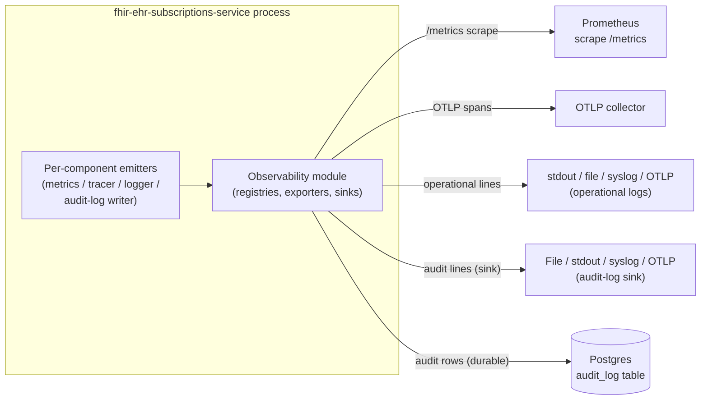

# Observability — Low-Level Design

**Purpose.** Implementation-level design of the `infra/observability` module: the Prometheus metrics layer (full metric inventory, naming convention, label cardinality rules), the OpenTelemetry tracing layer (span taxonomy, trace-context creation at the MLLP listener / API entry / scan tick / vendor feed event, propagation via `correlation_id`), the structured-logging layer (required fields, PHI-handling rules), and the append-only hash-chained audit log (separate from operational logs, independent retention, multi-sink export). The two load-bearing invariants are: (a) PHI never appears in operational logs at `info` or above, and (b) the audit log is tamper-evident — each row carries the SHA-256 of the prior row so any deletion or modification is detectable on a chain re-walk.

**Reader's prerequisites.** Read [../high-level-design/domains/observability.md](../high-level-design/domains/observability.md) and the architecture sections "Observability" and "Privacy and PHI handling". The metric naming scheme in this LLD is canonical for the project; other LLDs reference these names.

## 1. Component placement



The module owns four registries: the Prometheus registry, the OpenTelemetry tracer provider, the structured-logger root, and the audit-log writer. Every other module receives typed handles (`MetricsEmitter`, `Tracer`, `Logger`, `AuditWriter`) at construction time and emits through them — there are no globals reached from inside business logic.

## 2. Module layout

The module is `infra/observability` per the architecture's module layout. Sub-modules:

- `metrics` — Prometheus registry, exposition handler at `/metrics`, the typed `MetricsEmitter` trait every component receives, the metric inventory.
- `tracing` — OpenTelemetry tracer provider, OTLP exporter, sampler, the `Tracer` trait, span helpers and propagation primitives.
- `logging` — structured JSON logger, configured sinks, redaction filter, the `Logger` trait, the per-line required-fields enforcer.
- `audit` — append-only audit-log writer; computes SHA-256 hash-chain links; writes durably to `audit_log` table and asynchronously to the configured external sink; refuses to mutate or delete prior rows.
- `correlation` — utilities for generating, propagating, and parsing `correlation_id` strings.
- `config_types` — typed config structs for `observability.*`.

## 3. Public surface

```
struct ObservabilityModule {
    // Constructed once at startup.
}

impl ObservabilityModule {
    async fn start(config: ObservabilityConfig, ctx: ObservabilityContext) -> Result<ObservabilityHandles>;
    async fn shutdown(&self, deadline: Instant) -> ShutdownReport;
}

struct ObservabilityHandles {
    metrics: MetricsEmitter,
    tracer: Tracer,
    logger: Logger,
    audit: AuditWriter,
}
```

Every other module receives `ObservabilityHandles` (or sub-handles scoped to its component name) at construction. Sub-handles add the component name as a default label / log field / span attribute so the originator does not need to repeat itself on every emission.

## 4. The metrics layer

Prometheus exposition on `observability.metrics.bind` (default `0.0.0.0:9090`, path `/metrics`). The endpoint is unauthenticated; access control is at the network layer. The exposition format is the Prometheus text format; OpenMetrics is supported on negotiation if the scraper requests it.

### 4.1 Naming convention

All metrics use the prefix `fhir_subs_` (or `fhir_subs_` if the implementation language's exporter normalizes underscores; the prefix is fixed at module init). Metric base names are snake_case nouns. Units suffix the name where applicable: `_seconds` for time, `_bytes` for size, `_total` for monotonic counters per Prometheus convention. The general shape is:

```
fhir_subs_<noun>[_<sub_noun>]_<unit_or_total>
```

Examples: `fhir_subs_hl7_messages_received_total`, `fhir_subs_stage_duration_seconds`, `fhir_subs_db_pool_in_use`.

### 4.2 Label cardinality rules

Labels are bounded operationally. The architecture and the observability HLD imply the following allowance table; this LLD makes it explicit:

| Label | Cardinality | Allowed where | Forbidden where |
|---|---|---|---|
| `topic_url` | bounded by topic catalog (tens) | any pipeline metric | n/a |
| `channel_type` | bounded (5–10) | any delivery metric | n/a |
| `change_kind` | three values (`create`/`update`/`delete`) | any pipeline metric | n/a |
| `resource_type` | bounded by FHIR resource set (low hundreds) | any pipeline metric | n/a |
| `outcome` / `status` | bounded enum per metric | any metric | n/a |
| `listener_endpoint` | bounded by `mllp_listener.endpoints[]` | listener metrics | n/a |
| `peer_addr` | bounded in steady state but unbounded in pathological cases | listener `_received_total` only — and even there, operators may choose to drop | latency histograms, delivery histograms |
| `subscription_id` | UNBOUNDED (subscribers come and go) | gauge that operators cap, **never** on histograms or counters | latency histograms, counters |
| `adapter_id` | one per deployment | any adapter metric | n/a |
| `payload_type` | three values (`empty`/`id-only`/`full-resource`) | delivery metrics | n/a |

`subscription_id` is the most dangerous label. It is allowed on `fhir_subs_subscription_status` (gauge) and `fhir_subs_heartbeat_lag_seconds` (gauge) because operators expect to see per-subscription state and can prune retired subscriptions. It is **never** allowed on counters or histograms — those would balloon series count over time. Per-subscription histograms live in traces, not metrics.

`peer_addr` is similarly dangerous; the metric `fhir_subs_hl7_messages_received_total` carries it for forensic value, but operators with churnful upstream interface engines should drop the label at scrape time.

### 4.3 Full metric inventory

This is the canonical inventory. Other LLD docs reference these names; new metrics added by other LLDs are added here in a follow-up.

#### Pipeline volume

| Metric | Type | Labels | Source |
|---|---|---|---|
| `fhir_subs_hl7_messages_received_total` | Counter | `listener_endpoint`, `peer_addr` | MLLP Listener LLD §...; bytes-on-the-wire arrivals. |
| `fhir_subs_hl7_messages_acked_total` | Counter | `listener_endpoint`, `outcome` (`aa`/`ae`/`ar`/`dropped`) | Listener ACK breakdown. |
| `fhir_subs_hl7_message_bytes` | Histogram | `listener_endpoint` | Per-message size. Buckets sized for typical HL7 (1KB-1MB). |
| `fhir_subs_hl7_message_queue_depth` | Gauge | — | Unprocessed rows in `hl7_message_queue`. |
| `fhir_subs_resource_changes_total` | Counter | `adapter_id`, `change_kind`, `resource_type` | Stage 1 output. |
| `fhir_subs_resource_changes_queue_depth` | Gauge | — | Unprocessed rows. |
| `fhir_subs_ehr_events_total` | Counter | `topic_url`, `change_kind` | Stage 2 output (matched events). |
| `fhir_subs_ehr_events_queue_depth` | Gauge | — | Unprocessed rows. |
| `fhir_subs_deliveries_total` | Counter | `topic_url`, `channel_type`, `payload_type` | Stage 3 output. |
| `fhir_subs_deliveries_pending` | Gauge | `channel_type` | Currently pending deliveries. |
| `fhir_subs_dead_letters_total` | Counter | `source` (`hl7_translation`/`fhir_validation`/`delivery`), `reason` | Drops from any failure path. |

#### Latency

| Metric | Type | Labels | Source |
|---|---|---|---|
| `fhir_subs_stage_duration_seconds` | Histogram | `stage` (`translate`/`topic_match`/`fanout`/`build`/`send`) | Per-stage processing time. |
| `fhir_subs_end_to_end_latency_seconds` | Histogram | `topic_url`, `channel_type` | EHR-arrival to subscriber-confirmed-delivery. |
| `fhir_subs_hydration_duration_seconds` | Histogram | `adapter_id`, `resource_type`, `cache_outcome` (`hit`/`miss`) | Stage 4 hydration calls. |
| `fhir_subs_topic_match_duration_seconds` | Histogram | `topic_url` | Per-topic evaluation; helps spot expensive FHIRPath. |
| `fhir_subs_fhirpath_evaluation_duration_seconds` | Histogram | `kind` (`extraction`/`criteria`) | Lower-level FHIRPath cost. |

#### Delivery health

| Metric | Type | Labels | Source |
|---|---|---|---|
| `fhir_subs_delivery_attempts_total` | Counter | `channel_type`, `outcome` (`delivered`/`transient`/`permanent`) | Per attempt, not per delivery. |
| `fhir_subs_delivery_retries_total` | Counter | `channel_type` | Increments on each retry attempt after the first. |
| `fhir_subs_subscription_status` | Gauge | `subscription_id`, `status` | Current state. (subscription_id allowed only on this gauge and `fhir_subs_heartbeat_lag_seconds`.) |
| `fhir_subs_active_subscriptions` | Gauge | `topic_url`, `channel_type` | Snapshot. |
| `fhir_subs_heartbeat_lag_seconds` | Gauge | `subscription_id` | Time since last heartbeat or event sent. |
| `fhir_subs_handshake_attempts_total` | Counter | `channel_type`, `outcome` | Subscription activation handshakes. |

#### Adapter and EHR-side

| Metric | Type | Labels | Source |
|---|---|---|---|
| `fhir_subs_adapter_state_size` | Gauge | `adapter_id` | Approximate row count in `adapter_state`. |
| `fhir_subs_fhir_scan_duration_seconds` | Histogram | `adapter_id`, `resource_type` | One scan target's wall-clock cost. |
| `fhir_subs_fhir_scan_resources_seen_total` | Counter | `adapter_id`, `resource_type` | Resources visited. |
| `fhir_subs_fhir_scan_deltas_total` | Counter | `adapter_id`, `resource_type`, `change_kind` | Scan-emitted resource_changes. |
| `fhir_subs_vendor_change_feed_lag_seconds` | Gauge | `adapter_id` | Distance behind the vendor's cursor. |
| `fhir_subs_vendor_change_feed_events_total` | Counter | `adapter_id`, `outcome` (`accepted`/`rejected`) | Change-feed throughput. |
| `fhir_subs_cancel_replace_pending` | Gauge | `adapter_id`, `resource_type` | Currently held cancel-and-replace pairs. Should rarely be > 0 for long. |
| `fhir_subs_ehr_http_request_duration_seconds` | Histogram | `adapter_id`, `kind` (`scan`/`hydrate`/`vendor_api`), `status_class` (`2xx`/`4xx`/`5xx`/`network`) | EHR-bound HTTP cost. |
| `fhir_subs_ehr_rate_limit_remaining` | Gauge | `adapter_id`, `kind` | Where the EHR exposes rate-limit headers. |

#### Topic catalog

| Metric | Type | Labels | Source |
|---|---|---|---|
| `fhir_subs_topics_active` | Gauge | — | Active topic count. |
| `fhir_subs_topic_evaluation_errors_total` | Counter | `topic_url`, `kind` (`fhirpath_timeout`/`fhirpath_error`/`search_param_error`) | Catches expensive or broken topic expressions. |
| `fhir_subs_topic_load_failures_total` | Counter | `path`, `reason` | Catalog-load rejections. |

#### Process / DB / runtime

| Metric | Type | Labels | Source |
|---|---|---|---|
| `fhir_subs_db_pool_in_use` | Gauge | — | DB pool saturation. |
| `fhir_subs_db_pool_size` | Gauge | — | Configured pool size. |
| `fhir_subs_db_query_duration_seconds` | Histogram | `name` (low cardinality, named queries) | Spot slow queries. |
| `fhir_subs_db_query_errors_total` | Counter | `name`, `kind` | DB error breakdown. |

#### Lifecycle (mirrors lifecycle LLD)

| Metric | Type | Labels |
|---|---|---|
| `fhir_subs_probe_requests_total` | Counter | `probe`, `status_code` |
| `fhir_subs_readiness_check_duration_seconds` | Histogram | `check` |
| `fhir_subs_readiness_check_failures_total` | Counter | `check`, `reason` |
| `fhir_subs_readiness_check_panics_total` | Counter | `check` |
| `fhir_subs_shutdown_initiated_total` | Counter | `reason` |
| `fhir_subs_shutdown_phase_duration_seconds` | Histogram | `phase` |
| `fhir_subs_shutdown_hook_outcome_total` | Counter | `hook`, `outcome` |
| `fhir_subs_shutdown_completed_total` | Counter | `kind` |

#### Configuration (mirrors configuration LLD)

| Metric | Type | Labels |
|---|---|---|
| `fhir_subs_config_load_total` | Counter | `outcome` |
| `fhir_subs_config_reload_total` | Counter | `outcome` |
| `fhir_subs_config_validation_errors_total` | Counter | `domain` |
| `fhir_subs_secret_placeholders_resolved_total` | Counter | `kind` |
| `fhir_subs_config_admin_mutation_total` | Counter | `path`, `outcome` |
| `fhir_subs_config_redacted_fields` | Gauge | — |

#### Audit

| Metric | Type | Labels |
|---|---|---|
| `fhir_subs_audit_events_total` | Counter | `kind` (`subscription_create`/`subscription_update`/`subscription_delete`/`delivery_success`/`auth_decision`/`config_admin`) |
| `fhir_subs_audit_chain_writes_total` | Counter | `outcome` (`ok`/`durable_failed`/`sink_failed`) |
| `fhir_subs_audit_chain_verify_failures_total` | Counter | — | Hash-chain verification failures (manual or scheduled re-walk). |

#### Standard process metrics

`process_cpu_seconds_total`, `process_resident_memory_bytes`, `process_open_fds`, `process_start_time_seconds` — emitted from the runtime exporter without modification.

### 4.4 Exposition handler (pseudo-code)

```
async fn handle_metrics_request(req, ctx) -> HttpResponse {
    let format = negotiate_format(req.headers)   // prometheus | openmetrics
    let snapshot = ctx.metrics_registry.gather()
    let body = encode(snapshot, format)
    return HttpResponse {
        status: 200,
        headers: [("Content-Type", format.content_type())],
        body,
    }
}
```

The handler runs synchronously against an in-memory registry; the cost is bounded by the number of series, not by any I/O.

## 5. The tracing layer

OpenTelemetry over OTLP to `observability.tracing.otlp_endpoint`. Sampling is head-based at the configured `sample_rate` (default 0.1). Operators using tail sampling at the collector set `sample_rate = 1.0`.

### 5.1 Span lifecycle

A trace is rooted at one of the four entry points:

- `mllp.receive` — root span when the MLLP Listener accepts a message and writes to `hl7_message_queue`. The trace ID is created here.
- `api.request` — root span when the Subscriptions API receives a subscriber request.
- `fhir_scan.tick` — root span when the FHIR Scan Runner fires a scheduled scan.
- `vendor_feed.event` — root span when the Vendor API Client receives a change-feed record.

Each root span generates a `correlation_id` (a short, stable string — see §7) which is written onto every Postgres row produced by that workflow (`hl7_message_queue.correlation_id`, `resource_changes.correlation_id`, `ehr_events.correlation_id`, `deliveries.correlation_id`). The `correlation_id` is the bridge between traces (which sample) and durable rows (which always exist), so even unsampled traces can be reconstructed from rows.

Pipeline spans are children of the root, named per stage:

- `adapter.translate` — Stage 1.
- `topic.match` — Stage 2.
- `engine.fanout` — Stage 3.
- `engine.build` — Stage 4. Children: `hydration.fetch` per fetched reference.
- `channel.deliver` — Stage 5. Children: the outbound HTTPS POST / WSS frame / SMTP submit.

Pipeline spans are NOT created in-process by the same tracer — they are created in the worker that reads the next-stage table. Span propagation happens via `correlation_id` attached to the row, plus an explicit `traceparent`-shaped attribute (`trace_id`, `parent_span_id`) the worker reads from the row.

### 5.2 Span tags

Each span carries a small, bounded set of attributes:

| Span | Attributes |
|---|---|
| `mllp.receive` | `listener_endpoint`, `peer_addr`, `mllp_message_id`, `correlation_id`, `bytes` |
| `api.request` | `method`, `route`, `status_code`, `correlation_id` |
| `fhir_scan.tick` | `adapter_id`, `resource_type`, `correlation_id` |
| `vendor_feed.event` | `adapter_id`, `correlation_id` |
| `adapter.translate` | `adapter_id`, `change_kind`, `resource_type`, `correlation_id` |
| `topic.match` | `change_kind`, `resource_type`, `topics_evaluated`, `topics_matched`, `correlation_id` |
| `engine.fanout` | `topic_url`, `subscriptions_evaluated`, `subscriptions_matched`, `correlation_id` |
| `engine.build` | `subscription_id` (sample only — see below), `topic_url`, `payload_type`, `bundle_entry_count`, `correlation_id` |
| `hydration.fetch` | `adapter_id`, `reference_kind`, `cache_outcome`, `correlation_id` |
| `channel.deliver` | `subscription_id` (sample only), `topic_url`, `channel_type`, `attempt`, `outcome`, `correlation_id` |

`subscription_id` on spans is permitted because traces are sampled — its high cardinality does not matter inside a sampled trace. `topic_url` is bounded and always permitted. PHI-bearing fields (resource bodies, patient identifiers) are NEVER attached as span attributes.

### 5.3 Trace context creation and propagation (pseudo-code)

```
fn start_root_span(operation_name, attrs) -> SpanContext {
    let trace_id = TraceId::new_random()
    let span_id = SpanId::new_random()
    let correlation_id = correlation::generate(trace_id)
    let span = ctx.tracer.start_span(operation_name, parent = None, attrs)
    span.set_attribute("correlation_id", correlation_id)
    return SpanContext { trace_id, span_id, correlation_id }
}

fn propagate_to_row(span_ctx) -> RowTraceContext {
    return RowTraceContext {
        trace_id: span_ctx.trace_id,
        parent_span_id: span_ctx.span_id,
        correlation_id: span_ctx.correlation_id,
    }
}

fn start_stage_span(stage_name, row_ctx, attrs) -> SpanContext {
    let parent = SpanLink { trace_id: row_ctx.trace_id, span_id: row_ctx.parent_span_id }
    let span = ctx.tracer.start_span(stage_name, parent = Some(parent), attrs)
    span.set_attribute("correlation_id", row_ctx.correlation_id)
    return SpanContext { trace_id: row_ctx.trace_id, span_id: span.id(), correlation_id: row_ctx.correlation_id }
}
```

The "trace context on row" pattern is what lets traces survive process restarts and the durable-row handoffs between stages. A worker that picks up a row written by a previous incarnation joins the same trace simply by reading the row's trace context fields.

## 6. The structured logging layer

JSON, one event per line. Default sink is stdout (Kubernetes-friendly); other sinks are file and syslog. Log destinations are configured in `observability` config; the architecture's `audit_log.sink` is for the **audit** channel specifically, not operational logs.

### 6.1 Required fields

Every operational log line has:

- `ts` — RFC 3339 timestamp with timezone.
- `level` — `debug` / `info` / `warn` / `error`.
- `message` — the human-readable description (one short sentence).
- `component` — the named module emitting the line (`mllp_listener`, `adapter.epic.hl7_processor`, `topic_matcher`, `engine.fanout`, `channels.rest_hook`, `lifecycle`, `config`, ...).
- `correlation_id` — when applicable (any line tied to an event flow).
- `subscription_id` — when applicable.
- `topic_url` — when applicable.
- `event_number` — when applicable.

Error-level lines additionally carry:

- `error.kind` — short stable identifier (`db_timeout`, `tls_handshake_failed`, `fhirpath_timeout`, ...).
- `error.message` — the error's display string.
- `error.stack` — stack trace where the runtime exposes one. Captured for `error` only; `warn` does not carry stacks.

Field-name discipline matters: every emitter uses the same field names so log queries are uniform. The logger trait enforces the required fields by construction — components cannot emit a log line without a `component` and a `message`.

### 6.2 PHI handling

The architecture is explicit: "every DB column containing FHIR resources or HL7 v2 message bodies are encrypted at the storage layer." Logs follow the same principle:

- Logs at `info` and above MUST NOT contain FHIR resource bodies or HL7 v2 message bodies. The logger explicitly rejects fields named `resource`, `bundle`, `body`, `raw`, `hl7` at `info` or above unless the value is the literal `[redacted]`.
- Resource references (`Patient/123`, `ServiceRequest/abc`) ARE permitted — they are identifiers, not payloads.
- `Subscription.endpoint` query strings (which a careless implementation might log when reporting delivery failures) MUST be redacted to `https://example.com/webhook?[redacted]`. The endpoint host and path are useful for ops; query parameters can carry tokens.
- The `debug` level may log payloads under a deployment-specific opt-in (`log_level=debug` plus a separate `debug_log_payloads=true` toggle); by default, debug payloads are also redacted.

The redaction filter sits between the emit call and the sink:

```
fn emit_log(line: LogLine) {
    let filtered = redact_phi(line)
    let serialized = json_encode(filtered)
    sink.write(serialized + "\n")
}

fn redact_phi(line: LogLine) -> LogLine {
    let level_allows_payloads = (line.level == Debug && config.debug_log_payloads)
    for field in line.fields_mut() {
        if is_phi_field_name(field.name) and !level_allows_payloads {
            field.value = "[redacted]"
        }
        if field.name == "endpoint" or field.name == "url" {
            field.value = redact_query_string(field.value)
        }
        if config.redaction_map.is_sensitive(field.name) {
            field.value = "[redacted]"
        }
    }
    return line
}
```

The redaction map from the `configuration` module is shared with the logger so every secret-tagged field is also redacted in logs without each emitter knowing about it.

### 6.3 Structured-log emit (pseudo-code)

```
async fn emit_structured_log(level, component, message, correlation_id, fields) -> () {
    if level < ctx.config.min_level {
        return
    }
    let line = LogLine {
        ts: ctx.clock.now_rfc3339(),
        level: level,
        message: message,
        component: component,
        correlation_id: correlation_id,
        ...fields,
    }
    let filtered = redact_phi(line)
    let serialized = json_encode(filtered)
    ctx.sinks.write(serialized + "\n")
}
```

The logger is non-blocking: writes go to a bounded async channel and a dedicated drainer flushes to the sinks. If the channel fills (a sink is slow), the logger drops the oldest `debug` lines first, then `info`, never `warn` or `error`. A drop counter (`fhir_subs_log_lines_dropped_total{level}`) makes drops visible.

## 7. Correlation IDs

A `correlation_id` is a short string formatted as `<prefix>-<random>` where `<prefix>` is a 4-character zone hint (`mllp`, `api_`, `scan`, `feed`) and `<random>` is 16 hex chars. It is generated at the root entry point and copied verbatim onto every downstream row, span, log line, and audit row.

```
fn generate(trace_id: TraceId) -> String {
    return format!("{}-{}", zone_prefix(), short_hex(trace_id))
}
```

The trace_id is the source so the same correlation_id always resolves to the same trace if sampled. The wire format is a string so it survives JSON-only transports and `$status` / `$events` responses.

## 8. The audit log

The audit log is structurally separate from operational logs. The architecture commits to: "every subscription create/update/delete, every successful delivery, every authorization decision is recorded in an append-only audit log." This LLD adds tamper-evidence via a SHA-256 hash chain.

### 8.1 Schema

```
table audit_log (
    seq               bigint primary key generated by default as identity,
    ts                timestamptz not null,
    kind              text not null,
    correlation_id    text,
    subscription_id   text,
    actor             jsonb,           -- who performed the action (subject claim, admin user, system)
    detail            jsonb,           -- kind-specific structured payload (no PHI bodies)
    prior_hash        bytea not null,  -- SHA-256 of the prior row's `chain_input`
    chain_input       bytea not null,  -- the bytes covered by this row's hash
    chain_hash        bytea not null   -- SHA-256(chain_input)
)
```

The chain_input for row N is the canonical serialization of `(seq, ts, kind, correlation_id, subscription_id, actor, detail, prior_hash)`. Canonicalization is RFC 8785 (JCS) per [decisions/0010 #3](../high-level-design/decisions/0010-implementation-defaults.md). The chain_hash for row N is `SHA-256(chain_input_N)`. Row N+1's `prior_hash` is row N's `chain_hash`. Row 0's `prior_hash` is the genesis constant (`SHA-256("fhir-ehr-subscriptions-service audit chain genesis")`).

Any deletion or modification of a prior row breaks every subsequent row's chain. A re-walk operation (manual via admin tool, or scheduled per `observability.audit.verify_interval`) reads rows in `seq` order and verifies each `chain_hash` against the prior row's `chain_hash` plus the row's own `chain_input`. A mismatch increments `fhir_subs_audit_chain_verify_failures_total` and writes an `audit.chain.verify_failed` log line at `error`.

### 8.2 Audit-log append-with-hash-chain (pseudo-code)

```
async fn audit_append(event: AuditEvent) -> Result<()> {
    return ctx.storage.with_transaction(async |tx| {
        // Lock the latest row's chain_hash for the chain link. The
        // serialization order is enforced by an advisory lock so two
        // concurrent appenders cannot read the same prior_hash.
        let lock = tx.acquire_advisory_lock("audit_chain_serial")
        let prior = tx.query_one(
            "SELECT chain_hash FROM audit_log ORDER BY seq DESC LIMIT 1"
        )
        let prior_hash = prior.map(|r| r.chain_hash).unwrap_or(GENESIS_HASH)

        let chain_input = canonical_serialize({
            ts: event.ts,
            kind: event.kind,
            correlation_id: event.correlation_id,
            subscription_id: event.subscription_id,
            actor: event.actor,
            detail: event.detail,
            prior_hash: prior_hash,
        })
        let chain_hash = sha256(chain_input)

        tx.execute(
            "INSERT INTO audit_log (ts, kind, correlation_id, subscription_id, actor, detail, prior_hash, chain_input, chain_hash)
             VALUES (?, ?, ?, ?, ?, ?, ?, ?, ?)",
            event.ts, event.kind, event.correlation_id, event.subscription_id,
            event.actor, event.detail, prior_hash, chain_input, chain_hash
        )
        // tx commits here; advisory lock is released with commit.

        // Sink emission is asynchronous and best-effort; failure does NOT
        // unwind the durable row. The durable row is the source of truth.
        ctx.audit_sink.enqueue(json_encode_audit(event, prior_hash, chain_hash))
        return Ok
    })
}
```

The advisory lock plus the `ORDER BY seq DESC LIMIT 1` read inside the same transaction is what keeps the chain linear under concurrent appenders. `seq` is an identity column (monotonic, no gaps in successful commits — but commits that fail leave gaps, which is fine; the chain is over `seq` order).

### 8.3 Sinks

The audit log writes to two destinations:

- The `audit_log` Postgres table — the durable source of truth. Every audit event is committed here in the same transaction as the action it audits where feasible (e.g., subscription create); for events without a natural transaction (auth decisions during delivery), the audit row is committed in its own transaction.
- The configured `observability.audit_log.sink` — a forwarder for SIEM integrations. Sinks: `file`, `stdout`, `syslog`, `otlp`. Forwarder failure does not unwind the durable row; the operator monitors `fhir_subs_audit_chain_writes_total{outcome="sink_failed"}` and replays from `audit_log` on demand.

### 8.4 Retention

Audit retention is independent of operational logs and `ehr_events`. Default 7 years (`storage.retention.audit_log: "7y"` in the architecture's example). Operators set their own retention based on regional regulatory requirements; the configuration module enforces the value as a hard floor of 0 — no operator can configure a value that drops audit before the durable transaction commits.

Pruning is age-based. The pruner walks the chain from `seq=1` and re-anchors the genesis hash by recording the last pruned row's `chain_hash` as a new genesis in a `audit_chain_anchor` table. Verification beyond a prune point uses the most recent anchor as the genesis; rows prior to the most recent anchor are not re-verifiable but were verified at prune time (a recorded fact). Operators that want full lifetime verification disable pruning.

## 9. The `MetricsEmitter`, `Tracer`, `Logger`, `AuditWriter` traits

Every other module receives one of these as its observability handle. The traits are shape-only here:

```
trait MetricsEmitter {
    fn counter(&self, name: &str, labels: Labels) -> Counter;
    fn gauge(&self, name: &str, labels: Labels) -> Gauge;
    fn histogram(&self, name: &str, labels: Labels) -> Histogram;
}

trait Tracer {
    fn start_span(&self, name: &str, parent: Option<SpanLink>, attrs: Attrs) -> Span;
    fn current_span(&self) -> Option<SpanContext>;
}

trait Logger {
    fn debug(&self, msg: &str, fields: Fields);
    fn info(&self, msg: &str, fields: Fields);
    fn warn(&self, msg: &str, fields: Fields);
    fn error(&self, msg: &str, error: ErrorInfo, fields: Fields);
}

trait AuditWriter {
    async fn append(&self, event: AuditEvent) -> Result<AuditRowRef>;
}
```

The traits are scoped per component: a sub-handle bound to the component name auto-fills `component=` in logs, `adapter_id=` (for adapter sub-handles) in metric labels, etc.

## 10. Configuration knobs

The module reads these fields from the validated configuration:

- `observability.metrics.bind` — `host:port` for the `/metrics` exposition endpoint. Default `0.0.0.0:9090`.
- `observability.tracing.otlp_endpoint` — OTLP collector URL. Empty = tracing disabled.
- `observability.tracing.sample_rate` — head sampling rate, 0.0–1.0. Default 0.1.
- `observability.audit_log.sink` — `stdout` (default) / `file` / `syslog` / `otlp`. The durable Postgres write happens regardless of sink.
- `observability.audit_log.file_path` — path when sink is `file`.
- `deployment.log_level` — global log level; per-domain overrides via configuration domain `log_level_overrides[component] = level`. SIGHUP-reloadable.
- `deployment.log_format` — `json` (default) or `text` (recommended only for local development).

Internal knobs (with safe defaults, surfaced if needed):

- `observability.audit_log.verify_interval` — periodic chain verification cadence. Default 24h.
- `observability.logging.debug_log_payloads` — opt-in to log resource bodies at `debug`. Default `false`.
- `observability.logging.drop_below_level_when_sink_slow` — sink-pressure drop threshold. Default `info`.

## 11. Failure modes

- **OTLP collector unreachable** — the tracer buffers a bounded in-memory queue; on overflow, oldest spans are dropped. A counter (`fhir_subs_traces_dropped_total`) makes drops visible. The pipeline is unaffected.
- **`/metrics` endpoint unreachable** — operators see scrape failures from Prometheus. The service is unaffected; metrics keep being recorded in the registry.
- **Audit sink unreachable** — durable writes still succeed; sink-emission is async. The sink writer retries with exponential backoff. On persistent failure, the operator alerts on `fhir_subs_audit_chain_writes_total{outcome="sink_failed"}`.
- **Durable audit write fails** — the action it audits fails atomically (same transaction). The operator sees both the action failure and the audit failure. There is never an action without an audit row.
- **Hash-chain verification fails** — the verifier increments `fhir_subs_audit_chain_verify_failures_total`, writes an `error`-level log, and refuses to prune until an operator investigates.

## 12. Ambiguity flagged

- The metric prefix (`fhir_subs_` vs. `fhir_subs_`) is a naming choice that the implementation should standardize once. This LLD uses `fhir_subs_` for brevity; if the project chooses the longer prefix the inventory above re-prefixes uniformly.
- Whether `event_number` ends up as a numeric label or a string label depends on the chosen Prometheus library — most libraries discourage numeric labels because of cardinality. This LLD treats `event_number` as a log/trace field, not a metric label.
- The `actor` field on audit rows is `jsonb` for flexibility; whether to also denormalize `actor.subject` to a top-level column for indexing is an open storage question.
- The architecture's `audit_log.sink` does not commit a default; this LLD defaults to `stdout`. The Postgres `audit_log` table is the durable source of truth ([decisions/0010 #7](../high-level-design/decisions/0010-implementation-defaults.md)); the sink is the real-time forwarder. Operators on file-based platforms can switch to `file` (`/var/log/fhir-subs/audit.log`).
- Sub-second resolution on `audit_log.ts` (microsecond? nanosecond?) is left to implementation; this LLD treats it as `timestamptz` and takes whatever Postgres provides on the platform.
- Tail-sampling vs. head-sampling configuration (`sample_rate = 1.0` plus collector-side tail sampling) is mentioned but the operator runbook for it is not codified here; operators using tail sampling should accept the bandwidth cost of full-rate emission.
