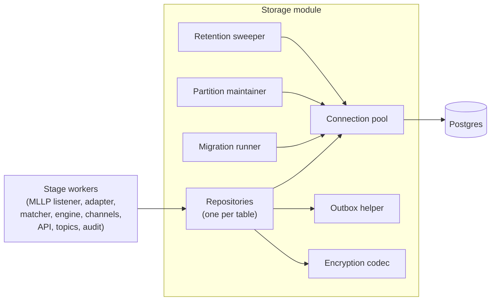

# Storage Layer — Low-Level Design

**Purpose.** Implementation-level design of the Postgres storage layer: connection pool with health checking, embedded forward-compatible migrations, the repository pattern wrapping every table, the `SELECT FOR UPDATE SKIP LOCKED` queue-claim primitive, the transactional outbox helper, encryption-at-rest at the column level, partition maintenance for the two high-volume tables, retention sweeping for the rest, and the schema-migration discipline that makes rolling deployments and quick rollbacks safe.

The load-bearing invariants are: every stage handoff is a single transaction that marks input processed and writes output (the outbox), so no crash can leave the system in a half-handed-off state; the queue-claim primitive `SELECT FOR UPDATE SKIP LOCKED` lets multiple workers in the same process claim distinct rows without any coordination beyond the table itself; partitions are created ahead of time so a write at month boundary never fails; and migrations are forward-compatible across one release in each direction so a partial rollout or rollback never wedges.

**Reader's prerequisites.** Read [../high-level-design/domains/storage.md](../high-level-design/domains/storage.md), [../high-level-design/contracts/internal-tables.md](../high-level-design/contracts/internal-tables.md) (the row contracts for every stage handoff), [../high-level-design/decisions/0001-postgres-only.md](../high-level-design/decisions/0001-postgres-only.md), and `../architecture.md` (sections "Storage Schema (sketch)", "Concurrency inside the service", "Privacy and PHI handling", and the `storage.*` configuration block). This LLD assumes those are baseline.

## 1. Component placement



The storage module is the single owner of all SQL in the codebase. No other module issues raw queries. The repositories are the typed surface; everything else (pool, outbox, codec, migration runner, partition maintainer, retention sweeper) is internal infrastructure that the repositories compose. The connection pool is the only outbound dependency.

## 2. Module layout

The storage module is decomposed into the following sub-modules. Names are notional.

- `pool` — Postgres connection pool wrapper (pgx-style for Go, sqlx-pool / deadpool / sqlx-postgres for Rust). Health-check loop, min/max bounds, connection lifetime, statement timeout, idle eviction, prepared-statement cache.
- `migrations` — embedded SQL migration files (numbered, idempotent), version table, forward runner. Invoked at startup before the service goes ready.
- `repos/*` — one repository module per table. Each exposes a typed interface (insert, claim, update-by-key, query) that the rest of the service calls. The full set: `repos/hl7_message_queue`, `repos/resource_changes`, `repos/ehr_events`, `repos/deliveries`, `repos/dead_letters`, `repos/pending_pairs`, `repos/adapter_state`, `repos/subscriptions`, `repos/subscription_topics`, `repos/auth_clients`, `repos/audit_log`.
- `outbox` — the `Tx::run_outbox` helper that wraps "mark input row processed + insert N output rows" in one transaction. Used by every stage handoff. Returns a typed `OutboxOutcome`.
- `claim` — the `SELECT FOR UPDATE SKIP LOCKED` claim primitive parameterized by table and predicate. Used by every stage that consumes rows from a Postgres queue.
- `codec` — column-level encryption codec. Encrypts on write, decrypts on read for designated columns (`hl7_message_queue.body`, `resource_changes.resource`, `resource_changes.previous_resource`, `ehr_events.resource`, `ehr_events.previous_resource`, `dead_letters.payload`, `pending_pairs.pending_resource`).
- `partition_maintainer` — daily task. Creates next month's partitions for `resource_changes` and `ehr_events`; detaches and drops partitions older than the configured retention.
- `retention_sweeper` — daily task. For non-partitioned tables that have a retention window (`hl7_message_queue` processed-only, `deliveries`, `dead_letters`, `audit_log`), runs chunked `DELETE` batches.
- `metrics` — typed counters / histograms / gauges for pool, migrations, claim duration, partition operations, retention deletes.
- `config_types` — strongly-typed config structs derived from the architecture's `storage.*` YAML block, validated at startup.

## 3. Public surface

The storage module exposes exactly the following to the rest of the service.

```
struct Storage {
    // Constructed once at startup; owns the pool and all repos.
}

impl Storage {
    // Open the pool, run migrations, register the partition maintainer
    // and the retention sweeper, return when the database is ready.
    async fn start(config: StorageConfig, ctx: StorageContext) -> Result<Storage>;

    // Cheap accessor for each repository.
    fn hl7_message_queue(&self) -> &Hl7MessageQueueRepo;
    fn resource_changes(&self)   -> &ResourceChangesRepo;
    fn ehr_events(&self)         -> &EhrEventsRepo;
    fn deliveries(&self)         -> &DeliveriesRepo;
    fn dead_letters(&self)       -> &DeadLettersRepo;
    fn pending_pairs(&self)      -> &PendingPairsRepo;
    fn adapter_state(&self)      -> &AdapterStateRepo;
    fn subscriptions(&self)      -> &SubscriptionsRepo;
    fn subscription_topics(&self)-> &SubscriptionTopicsRepo;
    fn auth_clients(&self)       -> &AuthClientsRepo;
    fn audit_log(&self)          -> &AuditLogRepo;

    // Begin a typed transaction. Caller chains repo operations on the Tx.
    async fn begin(&self) -> Result<Tx>;

    // Pool / readiness accessor for /readyz: runs SELECT 1 within
    // postgres_probe_timeout. Returns Ok if the pool can serve a query.
    async fn probe(&self, timeout: Duration) -> Result<()>;

    // Graceful shutdown: stop the maintainer + sweeper, close the pool.
    async fn shutdown(&self) -> ();
}
```

`StorageContext` is the dependency bundle: the metrics emitter, the structured logger, the clock, the encryption-key provider. Every dependency is injected.

## 4. Connection pool design

The pool is the gatekeeper for every database operation. Its tuning controls the difference between a healthy service and one that is silently capacity-bound.

### Configuration

```
struct PoolConfig {
    url: String,                          // libpq-style connection string
    min_connections: u32,                 // default 4
    max_connections: u32,                 // default 16; from storage.postgres.pool_size
    statement_timeout: Duration,          // default 30s; sent on every connection via SET
    idle_timeout: Duration,               // default 5m; idle conns above min are evicted
    max_connection_lifetime: Duration,    // default 30m; bound long-lived conns to dodge
                                          // server-side bloat / DNS failover stalemate
    acquire_timeout: Duration,            // default 5s; how long callers wait before erroring
    health_check_interval: Duration,      // default 30s; background SELECT 1 against an idle
                                          // conn to evict broken ones
    application_name: String,             // "fhir-ehr-subscriptions-service"
}
```

### Behavior

- **Minimum/maximum bounds.** The pool keeps `min_connections` warm at all times and grows up to `max_connections` under load. Above max, `acquire()` blocks until a connection is returned or `acquire_timeout` elapses.
- **Connection lifetime.** Every connection has a hard maximum lifetime (`max_connection_lifetime`) so connections are recycled even under steady demand. This insulates the service from PgBouncer / RDS proxy churn and helps reclaim memory after a long-running session.
- **Statement timeout.** Every checked-out connection runs `SET LOCAL statement_timeout = <ms>` at the start of every transaction and `SET statement_timeout = <ms>` at first checkout. A query that exceeds the budget is canceled by Postgres and returns a typed error to the caller. This is a hard upper bound; individual repos may set tighter local timeouts for specific queries.
- **Health checks.** A background task runs `SELECT 1` against one idle connection per cycle. Failures evict the connection and surface as `fhir_subs_pool_unhealthy_total` metric increments. This catches half-open TCP connections and stale RDS endpoints.
- **Application name.** Set per-connection so the DBA can identify our connections in `pg_stat_activity`.

### Failure modes the pool handles

- **Connection refused / DNS failure on startup** — `start()` returns an error; the lifecycle module retries with backoff before failing the startup probe.
- **Connection drop during a transaction** — the in-flight transaction errors; the caller decides whether to retry. The pool evicts the dead connection.
- **All connections in use** — `acquire()` blocks up to `acquire_timeout`. Callers should not infinitely retry; they should propagate the timeout up.

The pool is the only point in the codebase that calls into the underlying SQL driver. The repositories check out connections from the pool, run their queries, and check the connections back in.

## 5. Migration framework

The migration framework runs forward-compatible expand-then-contract migrations at startup, before the service goes ready.

### Migration files

Migrations live in `storage/migrations/` and are embedded into the binary at build time. Each migration is one SQL file named `NNN_short_description.sql`. NNN is a zero-padded numeric prefix. Files are loaded in lexicographic order, which equals numeric order.

A migration is:

- **Idempotent.** `CREATE TABLE IF NOT EXISTS`, `CREATE INDEX IF NOT EXISTS`, `ALTER TABLE ... ADD COLUMN IF NOT EXISTS`. Re-running the same file is a no-op.
- **Forward-compatible.** Per the storage domain's discipline, a release N+1 must run against a database migrated by release N. New columns are NULLable; new tables are not referenced by old code.
- **Online.** No long-running schema changes that take exclusive locks. Index creation uses `CREATE INDEX CONCURRENTLY` (in its own migration file because `CONCURRENTLY` cannot run inside a transaction).

The version table is `schema_migrations(version TEXT PRIMARY KEY, applied_at TIMESTAMPTZ NOT NULL, checksum TEXT NOT NULL)`. The checksum is a SHA-256 of the embedded file content; a divergence is a startup error (some other process applied a migration with a different body).

### `migrate_up` — pseudo-code

```
async fn migrate_up(pool, migrations: List<EmbeddedMigration>) -> Result<MigrationReport> {
    let conn = pool.acquire_admin().await?  // an admin connection, separate from the
                                            // normal pool, with a higher statement_timeout
                                            // for legitimately long migrations

    // 1. Ensure the version table exists.
    conn.execute("CREATE TABLE IF NOT EXISTS schema_migrations (
                    version TEXT PRIMARY KEY,
                    applied_at TIMESTAMPTZ NOT NULL,
                    checksum TEXT NOT NULL
                  )").await?

    // 2. Pull the applied set.
    let applied = conn.query("SELECT version, checksum FROM schema_migrations").await?
        .into_map_by(|row| (row.version, row.checksum))

    let report = MigrationReport::new()

    // 3. Walk the embedded list in order; apply any that are not in `applied`.
    for m in migrations {
        match applied.get(m.version) {
            Some(stored_checksum) if stored_checksum != m.checksum => {
                return Err(MigrationDriftError(m.version, stored_checksum, m.checksum))
            }
            Some(_) => {
                // already applied, no-op
                report.skipped(m.version)
                continue
            }
            None => { /* fall through to apply */ }
        }

        if m.is_concurrent_index {
            // CREATE INDEX CONCURRENTLY cannot be wrapped in a transaction.
            // Apply it directly; record the version in a small transaction afterward.
            conn.execute_unwrapped(m.body).await?
            conn.transaction(|t| {
                t.execute("INSERT INTO schema_migrations(version, applied_at, checksum)
                           VALUES ($1, now(), $2)", m.version, m.checksum)
            }).await?
        } else {
            // Wrap the migration body and the version row in one transaction
            // so a crash cannot record a half-applied migration.
            conn.transaction(|t| {
                t.execute(m.body).await?
                t.execute("INSERT INTO schema_migrations(version, applied_at, checksum)
                           VALUES ($1, now(), $2)", m.version, m.checksum).await?
            }).await?
        }

        report.applied(m.version)
        metrics::migrations_applied.inc()
    }

    return Ok(report)
}
```

The startup probe waits for `migrate_up` to return. Any error fails startup loudly. The lifecycle module retries with backoff on transient connect failures but treats an applied-checksum mismatch as fatal — that means another process applied a migration we do not recognize and continuing is unsafe.

### Forward-compatibility discipline (enforced by review)

- Adding a column: `ADD COLUMN ... NULL` (default-NULL). Old code ignores it.
- Renaming a column: do **not** rename. Add the new column, dual-write for a release, switch readers to the new column in the next release, drop the old column in the release after.
- Removing a column: same as rename — dual-read for a release, drop the writes in the next release, drop the column in the release after.
- Changing a type: same expand-then-contract dance.
- Adding a table: free; old code does not reference it.
- Adding an index: `CREATE INDEX CONCURRENTLY` in its own migration file.
- Dropping an index: free in its own migration; do not bundle with body changes.

These rules are PR-checklist items; the migration runner does not enforce them mechanically.

## 6. Repository pattern

Every table has its own repository module exposing a typed interface. The repository is the only place SQL strings for a given table live. This gives us a single audit point per table and makes the encryption codec, the outbox helper, and the metrics tagging easy to apply uniformly.

### Common shape

```
trait Repo<Row> {
    async fn insert(&self, tx: &Tx, row: Row) -> Result<RowId>;
    async fn get(&self, tx: &Tx, id: RowId) -> Result<Option<Row>>;
    async fn update(&self, tx: &Tx, id: RowId, patch: Patch) -> Result<()>;
}
```

Beyond the common shape, each repo exposes table-specific methods (claim queries, idempotent inserts, batch updates).

### Example: `DeliveriesRepo` showing the queue-claim primitive

`deliveries` is the canonical "claim by SKIP LOCKED" workload. The Subscriptions Engine inserts rows; the delivery scheduler claims them.

```
impl DeliveriesRepo {
    // Producer side — used by the Subscriptions Engine in the Stage 3 outbox.
    async fn insert(&self, tx: &Tx, row: NewDelivery) -> Result<RowId> {
        // UNIQUE (subscription_id, event_number) provides outbound idempotency.
        // ON CONFLICT DO NOTHING swallows duplicate inserts (engine retry safe).
        let result = tx.query_one(
            "INSERT INTO deliveries
                (subscription_id, event_number, ehr_event_id, status,
                 attempts, next_attempt_at, correlation_id, created_at)
             VALUES ($1, $2, $3, 'pending', 0, now(), $4, now())
             ON CONFLICT (subscription_id, event_number) DO NOTHING
             RETURNING id",
            row.subscription_id, row.event_number, row.ehr_event_id,
            row.correlation_id,
        ).await?

        return Ok(result.id)
    }

    // Consumer side — claim N rows for one delivery worker.
    // SKIP LOCKED is what makes multiple worker fibers safe.
    async fn claim_pending(&self, tx: &Tx, batch: u32, now: Timestamp)
        -> Result<List<Delivery>>
    {
        let rows = tx.query_many(
            "SELECT id, subscription_id, event_number, ehr_event_id,
                    status, attempts, next_attempt_at, correlation_id
             FROM deliveries
             WHERE status = 'pending'
               AND next_attempt_at <= $1
             ORDER BY next_attempt_at ASC
             LIMIT $2
             FOR UPDATE SKIP LOCKED",
            now, batch,
        ).await?

        // Move each claimed row to 'delivering' so it is not double-claimed
        // even if the worker crashes after this transaction (the lock is
        // released on conn close, but the status guards against re-claim).
        if rows.len() > 0 {
            tx.execute(
                "UPDATE deliveries
                 SET status = 'delivering', last_error = NULL
                 WHERE id = ANY($1)",
                rows.ids(),
            ).await?
        }

        return Ok(rows)
    }

    // Outcome handler — called after the channel reports back.
    async fn record_outcome(&self, tx: &Tx, id: RowId, outcome: DeliveryOutcome)
        -> Result<()>
    {
        match outcome {
            Delivered => tx.execute(
                "UPDATE deliveries
                 SET status = 'delivered', delivered_at = now()
                 WHERE id = $1", id).await?,
            TransientFailure { retry_after, reason } => tx.execute(
                "UPDATE deliveries
                 SET status = 'failed_transient',
                     attempts = attempts + 1,
                     next_attempt_at = $2,
                     last_error = $3
                 WHERE id = $1", id, retry_after, reason).await?,
            PermanentFailure { reason } => tx.execute(
                "UPDATE deliveries
                 SET status = 'failed_permanent',
                     attempts = attempts + 1,
                     last_error = $2
                 WHERE id = $1", id, reason).await?,
        }
        return Ok(())
    }
}
```

The `claim_pending` method is the canonical use of `SELECT FOR UPDATE SKIP LOCKED`:

- **`FOR UPDATE`** locks each returned row for the duration of the transaction. A second worker running the same query will not see locked rows because of the `SKIP LOCKED` modifier.
- **`SKIP LOCKED`** is what enables concurrency without coordination. Without it, a second worker would block until the first commits.
- **Idempotent immediate status flip.** Setting `status = 'delivering'` inside the same transaction as the claim ensures that if the worker crashes after commit but before the channel runs, the row is in `'delivering'` and a recovery sweep (or simply the next scheduler tick after a restart) finds it. We have a separate periodic task that finds rows stuck in `'delivering'` longer than a configured maximum and reverts them to `'pending'` so they get retried.

The same pattern is used by `Hl7MessageQueueRepo::claim_unprocessed`, `ResourceChangesRepo::claim_unprocessed`, `EhrEventsRepo::claim_unclaimed`, and `PendingPairsRepo::claim_expired` — all parameterized variations of the same primitive.

## 7. Transactional outbox helper

The outbox pattern is the architecture's load-bearing durability invariant. The `Tx::run_outbox` helper is the typed wrapper.

### Pseudo-code

```
// Marks one input row processed and inserts N output rows in one transaction.
async fn run_outbox<I, O>(
    tx: &Tx,
    input: InputRow<I>,            // {table, id, mark_processed_clause}
    outputs: List<OutputInsert<O>>,// each describes one INSERT
) -> Result<OutboxOutcome>
{
    // 1. Mark input row processed. Return the affected row count so a missing
    //    input (already processed by another worker) is detected and treated
    //    as a no-op.
    let affected = tx.execute(input.mark_processed_clause, input.id).await?
    if affected == 0 {
        return Ok(OutboxOutcome::AlreadyProcessed)
    }

    // 2. Insert every output row. Order is preserved so foreign keys (e.g.,
    //    deliveries.ehr_event_id) resolve correctly.
    let mut inserted_ids = []
    for out in outputs {
        let id = tx.execute_returning(out.insert_clause, out.params).await?
        inserted_ids.push(id)
    }

    return Ok(OutboxOutcome::Committed { input_id: input.id, output_ids: inserted_ids })
}
```

### Use sites

- **HL7 Message Processor:** `mark_processed_clause = "UPDATE hl7_message_queue SET processed=true, processed_at=now() WHERE id=$1 AND processed=false"`; one output insert into `resource_changes` (or, on translation failure, into `dead_letters`).
- **Topic Matcher:** `mark_processed_clause = "UPDATE resource_changes SET processed=true, processed_at=now() WHERE id=$1 AND processed=false"`; N outputs into `ehr_events`, one per matched topic. N can be zero (no-match case still flips processed).
- **Subscriptions Engine (Stage 3):** `mark_processed_clause = "UPDATE ehr_events SET processed_at=now() WHERE id=$1 AND processed_at IS NULL"`; N outputs into `deliveries`, one per matching subscription.
- **HL7 Message Processor (cancel-and-replace resolution):** two input rows (the cancellation `hl7_message_queue` row and the replacement) marked processed in one tx, plus one `resource_changes` insert with both `previous_resource` and `resource`, plus one `pending_pairs` delete. The helper accepts a list of input rows for this multi-input case.
- **Pending-pair reaper:** input is the expired `pending_pairs` row plus its `source_message_id`; output is one `resource_changes` row with `change_kind = delete` (or `create`, for a held replacement).

The `AlreadyProcessed` outcome is a successful no-op. It happens when two workers raced for the same row through `SKIP LOCKED` — one wins, the other returns `AlreadyProcessed`. The caller's metrics record this as `fhir_subs_outbox_already_processed_total` so a steady stream of these flags a tuning issue (too many workers competing for too few rows).

## 8. Encryption-at-rest

Two mechanisms are supported. The choice is deployment policy.

### Whole-database encryption (preferred, simpler)

The Postgres instance is configured with TDE (RDS/Aurora `StorageEncrypted`), LUKS, or equivalent at the OS level. The application is unaware: every column is plaintext from the application's view, and storage handles the rest. This is the recommended default. No application code is required.

### Column-level encryption (defense-in-depth)

For deployments that require column-level encryption — typically because the operator does not control the database host — the storage layer encrypts payload columns transparently:

- `hl7_message_queue.body`
- `resource_changes.resource`, `resource_changes.previous_resource`
- `ehr_events.resource`, `ehr_events.previous_resource`
- `dead_letters.payload`
- `pending_pairs.pending_resource`

The codec sits between the repository and the SQL driver. On write, it serializes the FHIR JSON / HL7 bytes, applies authenticated encryption (AES-256-GCM with a 96-bit nonce derived per row), and writes a ciphertext envelope `{key_version, nonce, ciphertext, auth_tag}` into a `bytea` column. On read, the codec verifies the auth tag and returns plaintext to the repo.

```
struct EncryptedEnvelope {
    key_version: u8,        // for rotation support
    nonce: [u8; 12],        // generated per row from a CSPRNG
    ciphertext: Bytes,
    auth_tag: [u8; 16],
}
```

The encryption key is sourced from `storage.encryption.at_rest_key` (env var or KMS reference). On startup, the codec resolves the key reference; missing or malformed keys fail startup. The codec is the only component that touches the key material.

### Key rotation

Rotation is operator-driven and gradual:

1. Operator configures a new key as `at_rest_key_versions` map: `{1: <old>, 2: <new>}`, with `at_rest_active_version = 2`.
2. On startup, the codec loads all configured versions. New writes use the active version. Reads use whatever version the envelope's `key_version` byte indicates.
3. A background re-encryption task (separate from the normal pool, runs on a small dedicated connection) walks payload tables in chunks and re-encrypts rows using the new active key. Progress is tracked in a `key_rotation_state` table (per-table cursor).
4. Once every row is re-encrypted under the new key, the operator can remove the old key version from configuration.

Re-encryption never blocks the workload; the chunk size and inter-chunk pause are tunable. The architecture's privacy section explicitly calls out that retention windows are short enough that natural row turnover handles most rotation, but the explicit re-encryption path exists for completeness.

If the codec encounters an envelope whose `key_version` is not in the configured set, the row is treated as unreadable and surfaces a typed error. Operators must keep all in-use key versions configured until rotation completes.

## 9. Partition maintenance

`resource_changes` and `ehr_events` are partitioned by month using PostgreSQL declarative partitioning. Per [decisions/0008](../high-level-design/decisions/0008-resolved-design-questions.md#6) the partitioning key is **`created_month`** (server-side insert time): `PARTITION BY RANGE (created_month)`, with `created_month` populated by trigger on insert as `date_trunc('month', now())`. This keeps every partition filled cleanly, avoids the late-arriving-row complication of partitioning on `occurred_at`, and makes retention drops cheap (`DETACH PARTITION + DROP TABLE`). Queries by `occurred_at` (e.g., `$events` replay) remain indexed and correct, just not partition-aligned. The maintainer's job is to ensure every write succeeds and to drop partitions outside retention.

### `partition_maintenance` — daily task pseudo-code

```
async fn partition_maintenance(pool, config: PartitionConfig, clock: Clock) {
    // Run once at startup, then on a daily timer.
    loop {
        let now = clock.now()
        let report = MaintenanceReport::new()

        for table in [resource_changes, ehr_events] {
            // 1. Create next month's partition AHEAD of time. We always run
            //    one month ahead so a write at the boundary never finds a
            //    missing partition. Idempotent.
            let next = first_day_of_month(now + 1.month)
            let ddl = format(
                "CREATE TABLE IF NOT EXISTS {table}_y{year}m{month}
                 PARTITION OF {table}
                 FOR VALUES FROM ('{from}') TO ('{to}')",
                table, year = next.year, month = next.month,
                from = next.iso_date(), to = (next + 1.month).iso_date(),
            )
            match pool.execute(ddl).await {
                Ok(_)  => report.created(table, next),
                Err(e) => report.create_failure(table, next, e),
            }

            // 2. Drop partitions older than the configured retention. Detach
            //    first so the drop is fast and does not contend with reads
            //    (DETACH takes a brief access-exclusive lock; the subsequent
            //    DROP runs against the now-detached table without blocking
            //    queries on the partitioned parent).
            let cutoff = first_day_of_month(now - config.retention(table))
            let stale_partitions = pool.query("
                SELECT inhrelid::regclass::text AS name
                FROM pg_inherits
                WHERE inhparent = '{table}'::regclass
                  AND name_below(name, cutoff)", cutoff).await?

            for p in stale_partitions {
                if config.auto_drop {
                    pool.execute("ALTER TABLE {table} DETACH PARTITION {p}").await?
                    pool.execute("DROP TABLE {p}").await?
                    report.dropped(table, p)
                } else {
                    report.would_drop(table, p)
                }
            }
        }

        metrics::record_maintenance_report(&report)
        clock.sleep(config.run_interval).await        // default 24h
    }
}
```

### Failure modes

- **`CREATE TABLE IF NOT EXISTS` raceless.** Two replicas or two restarts running the maintainer simultaneously are safe; the second sees the partition exists and skips. (We are single-replica, but the maintainer is also called eagerly at startup, which can race with a long-running prior run if shutdown was brief.)
- **`DETACH` blocking.** If a long read is holding the partitioned table, DETACH will wait briefly. The maintainer uses a configurable lock timeout (`partition_lock_timeout`, default 5s). A timeout is logged and retried next cycle.
- **Auto-drop disabled.** If `partitioning.auto_drop` is false, the maintainer logs which partitions it would drop but does not. Operators monitor disk separately. This is the recommended setting for deployments with longer-than-default retention requirements.

## 10. Retention sweeper

For non-partitioned tables, retention is enforced by chunked `DELETE`. The sweeper runs daily.

### `retention_sweep` — pseudo-code

```
async fn retention_sweep(pool, config: RetentionConfig, clock: Clock) {
    loop {
        let now = clock.now()

        for table in non_partitioned_with_retention() {
            let cutoff = now - config.window(table)
            let mut deleted_total = 0

            loop {
                // Chunked delete. Small chunk -> tight WAL, short locks,
                // does not stall checkpoints. CTE form returns the affected
                // count without a separate SELECT.
                let n = pool.execute(
                    "WITH victims AS (
                        SELECT id FROM {table}
                        WHERE {retention_predicate}
                          AND created_at < $1
                        LIMIT $2
                     )
                     DELETE FROM {table}
                     WHERE id IN (SELECT id FROM victims)",
                    cutoff, config.batch_size(table),
                ).await?

                deleted_total += n
                metrics::retention_rows_deleted_total{table}.inc_by(n)

                if n < config.batch_size(table) { break }
                clock.sleep(config.batch_pause).await        // default 100ms
            }

            log::info("retention swept", table, cutoff, deleted = deleted_total)
        }

        clock.sleep(config.run_interval).await                // default 24h
    }
}
```

### Per-table predicates

| Table | `retention_predicate` | Default window |
|---|---|---|
| `hl7_message_queue` | `processed = true AND processed_at < $1` | 7d |
| `deliveries` | `status IN ('delivered', 'failed_permanent')` | 90d |
| `dead_letters` | (always — no filter beyond `created_at`) | 180d |
| `audit_log` | (always) | 7y |

`resource_changes`, `ehr_events`, and `pending_pairs` are not handled by this sweeper:

- `resource_changes` and `ehr_events` are partitioned and use the partition maintainer's drop path.
- `pending_pairs` is reaped by the cancel-and-replace reaper (owned by the HL7 Message Processor), not by storage.

`adapter_state`, `subscriptions`, `subscription_topics`, and `auth_clients` retain forever (or while-referenced) and have no sweep job.

### Backup expectations

Backup is operator-driven, not handled by this layer. The storage configuration documents the recommended posture:

- `pg_basebackup` or RDS automated snapshots for full backups, daily.
- WAL archiving for point-in-time recovery; recovery target window matches the deployment's RTO.
- Logical dumps with `pg_dump --schema-only` for schema versioning across environments.

The application is restore-friendly by construction — every workflow recovers from the durable input table, so a restore from N hours ago plus replay from the EHR's HL7 buffer (the EHR retains un-ACKed messages) reaches consistency. A restore that loses processed rows replays whatever the EHR re-sends.

## 11. Configuration

Configuration is the `storage.*` block from the architecture's YAML. Effective fields:

```yaml
storage:
  postgres:
    url: "${env:DATABASE_URL}"
    pool:
      min_connections: 4
      max_connections: 16
      acquire_timeout: "5s"
      statement_timeout: "30s"
      idle_timeout: "5m"
      max_connection_lifetime: "30m"
      health_check_interval: "30s"
      application_name: "fhir-ehr-subscriptions-service"
  encryption:
    mode: "whole-database"                    # whole-database | column-level
    at_rest_active_version: 1                 # required when mode = column-level
    at_rest_key_versions:
      "1": "${env:STORAGE_ENCRYPTION_KEY_V1}"
      # "2": "${env:STORAGE_ENCRYPTION_KEY_V2}"   # add when rotating
  retention:
    hl7_message_queue: "7d"
    resource_changes: "30d"
    ehr_events: "30d"
    deliveries: "90d"
    dead_letters: "180d"
    audit_log: "7y"
  partitioning:
    auto_drop: true
    partition_lock_timeout: "5s"
    run_interval: "24h"
  retention_sweeper:
    run_interval: "24h"
    batch_size: 5000
    batch_pause: "100ms"
```

All fields validated at startup. Unknown keys are a startup error. Missing required keys (e.g., `postgres.url`) abort startup with a structured error.

## 12. Metrics

Prometheus metrics emitted by the storage module:

- `fhir_subs_pool_active_connections` — gauge, currently checked-out connections.
- `fhir_subs_pool_idle_connections` — gauge, currently idle in the pool.
- `fhir_subs_pool_wait_duration_seconds` — histogram, time spent in `acquire()`.
- `fhir_subs_pool_unhealthy_total` — counter, connections evicted by the health check.
- `fhir_subs_migrations_pending` — gauge, count of embedded migrations not yet in `schema_migrations`. Should be zero in steady state; non-zero during a pre-startup window or a bug.
- `fhir_subs_migrations_applied_total` — counter, lifetime applied count.
- `fhir_subs_partitions_created_total{table}` — counter, partitions created by the maintainer.
- `fhir_subs_partitions_dropped_total{table}` — counter, partitions dropped.
- `fhir_subs_partition_maintenance_failures_total{table, op}` — counter, per-operation failures.
- `fhir_subs_retention_rows_deleted_total{table}` — counter, retention sweep deletions.
- `fhir_subs_retention_sweep_duration_seconds{table}` — histogram, per-table sweep duration.
- `fhir_subs_queue_claim_duration_seconds{table}` — histogram, time inside the `SELECT FOR UPDATE SKIP LOCKED` claim. Spikes here indicate either contention (too many workers, too few rows) or Postgres slowness.
- `fhir_subs_outbox_already_processed_total{stage}` — counter, racing-worker no-ops. Steady-state high values flag concurrency tuning.
- `fhir_subs_encryption_decrypt_failures_total` — counter, ciphertext envelopes that failed auth-tag verification. Should always be zero; non-zero indicates corruption or a key-version misconfiguration.

## 13. Test plan

Tests live in `storage/` alongside the production code. Database tests use a dedicated test schema (or, in CI, a containerized Postgres).

- **Unit: codec.** Round-trip encrypt/decrypt for representative resource sizes (1KB, 10KB, 100KB FHIR resources). Tampered ciphertext fails auth-tag verification deterministically. Old `key_version` envelopes decrypt under the old key after rotation. Missing `key_version` in configured set returns a typed error.
- **Unit: outbox helper.** `run_outbox` against an in-memory transaction stub asserts the marker and the inserts run in one transaction; a thrown error in any insert rolls back the marker; `AlreadyProcessed` is returned when the marker affects zero rows.
- **Integration: migration runner.** A pristine database runs every embedded migration and reaches the same final schema as a snapshot dump. A database at version N is upgraded to N+1 cleanly. A database with a tampered `schema_migrations` checksum fails startup with `MigrationDriftError`. A `CREATE INDEX CONCURRENTLY` migration succeeds and is recorded.
- **Integration: claim primitive.** Two worker fibers both calling `claim_pending` against a shared pool against a synthetic `deliveries` table claim distinct rows; the union of their claims equals the unclaimed set; no row is double-claimed. A worker that aborts mid-transaction releases its claim; another worker re-claims after the connection closes.
- **Integration: outbox stage handoffs.** Each of the four stage handoffs (HL7 Message Processor, Topic Matcher, Subscriptions Engine, pending-pair resolution) runs end-to-end against a real Postgres. A simulated crash mid-transaction (caller drops the connection) leaves the input row unprocessed and no output row written. A duplicate input replay (same correlation_id) is a no-op insert per the unique constraint.
- **Integration: partition lifecycle.** The maintainer creates next month's partition. Manual time advancement (against a fake clock) demonstrates the maintainer drops a partition older than retention. A partition with active queries delays drop until the lock timeout elapses; the drop is retried next cycle and succeeds.
- **Integration: retention enforcement.** Synthetic data older than retention is deleted in chunks; younger data is preserved; the sweep terminates when the chunk size returns under the configured batch size; metrics record the deleted count.
- **Integration: crash recovery.** A simulated mid-transaction crash leaves `deliveries` rows in `'delivering'` status; a reconciliation pass (separate from the main scheduler) reverts them to `'pending'` after the configured stuck-row timeout; subsequent ticks pick them up.
- **Integration: encryption-at-rest end-to-end.** With `mode = column-level`, an inserted `resource_changes.resource` is unreadable as plaintext via direct SQL (the column is `bytea`); the repo round-trips correctly. Rotation: re-encrypt a small batch, assert all rows readable under both old and new key configurations, then under new only.
- **Performance: pool saturation.** Synthetic load that exceeds `max_connections` confirms `acquire()` blocks correctly and surfaces a timeout error when the queue exceeds `acquire_timeout`. No callers hold connections across awaits longer than the statement timeout.

## 14. Open questions

- **Partitioning key.** Resolved by [decisions/0008](../high-level-design/decisions/0008-resolved-design-questions.md#6) — `RANGE BY (created_month)`. Revisit only if write throughput shows hot-partition contention; alternatives (`occurred_at`, `sequence`) have known drawbacks documented in the ADR.
- **Re-encryption pacing.** Chunk size and inter-chunk pause for column-level rotation are workload-specific. Deferred until column-level encryption sees real production use.
- **Stuck-row reconciliation cadence.** Rows stuck in `'delivering'` are bugs. Current plan: 60s sweep that reverts rows older than the channel's request timeout. Per-channel timeouts likely; track per-channel.
- **`pgcrypto` vs. application-side encryption.** Current plan: application-side, to keep the key out of Postgres. Re-evaluate if overhead is meaningful.
- **Backup verification.** No automated backup-restore drill in v1. Open: ship a `tools/backup-restore-drill.sh`? Out of scope for the storage module proper.

## 15. What this LLD does NOT cover

- **Row contracts.** Wire-level shapes for every stage-handoff table are owned by [internal-tables.md](../high-level-design/contracts/internal-tables.md). This document handles infrastructure around those rows, not the rows themselves.
- **Stage logic.** HL7 Message Processor, Topic Matcher, Subscriptions Engine, and channel modules each own their own LLDs; storage is a passive substrate.
- **Subscription state machine.** `Subscription.status` transitions are owned by the [Subscriptions API LLD](subscriptions-api.md) and the delivery scheduler (LLD pending; current behavior lives in [`internal/engine/scheduler`](https://github.com/bzimbelman/fhir-ehr-subscriptions-service/tree/main/internal/engine/scheduler)).
- **Audit policy.** What counts as an auditable event is decided by the API, engine, and channels; storage just guarantees `audit_log` is `INSERT`-only at the application credential layer.
- **Encryption key management.** The codec consumes a key reference from configuration; KMS integration, sealed-secret patterns, and HSM use are operator concerns.
- **Backup orchestration.** Backups, snapshot scheduling, and PITR windows are operator-owned. Storage documents the recommended posture and the application properties that make backup-restore safe.
- **Cross-database replication.** Multi-region / warm-standby is out of scope for v1; the architecture is single-instance.
- **Connection-level routing.** PgBouncer / RDS Proxy is supported transparently via `max_connection_lifetime`; proxy configuration is operator-owned.
