# Low-Level Design: Subscriptions API (Subscriber Management Surface)

## 1. Purpose and Reader's Prerequisites

This document is the implementation-level design of the subscriber-facing Management API for `fhir-subscriptions-foss`. It is the contract between "what the spec and the HLD say" and "what the running code does." It tells an implementor how to wire up HTTP handlers, the SMART on FHIR Backend Services authentication middleware, the FHIR version shim, request validation, the activation handshake trigger, the spec-defined operations (`$status`, `$events`, `$get-ws-binding-token`), the dynamic `CapabilityStatement` builder, and the OperationOutcome-shaped error model. It does not describe the engine, channel modules, or EHR adapter — those are separate domains with their own LLDs.

A reader should already have absorbed:

- `../high-level-concept.md` for what the project is.
- `../architecture.md`, especially the "Subscriptions side", "FHIR Version Strategy", "Auth", "Other Spec Requirements", and "Configuration" sections.
- `../high-level-design/domains/subscriptions-api.md` — the domain doc this LLD implements.
- `../high-level-design/contracts/subscriber-api.md` — the wire contract this LLD must satisfy on the wire, including the Update semantics table.
- `../high-level-design/decisions/0004-fhir-version-strategy.md` — the rationale for the R5-internal, multi-version-on-the-wire approach.
- The FHIR R5 normative pages on `Subscription`, `SubscriptionTopic`, `SubscriptionStatus`, and `OperationOutcome`, and the R4B Subscriptions Backport IG.

What lives here that does not live in the HLD: the route table with handler names, request lifecycle as ASCII Mermaid, pseudo-code for each major handler, the JWT/JWKS auth middleware, the version-shim component, the CapabilityStatement build path, configuration for this surface, the metrics catalog, the error matrix, the test plan, and an explicit list of things the LLD does not cover.

## 2. Route Table

Every route below is bound under the same TLS listener (default `0.0.0.0:8443`, configured by `server.http.bind`). Every route requires a valid SMART Backend Services bearer token in `Authorization: Bearer <jwt>`. Plain HTTP is rejected at the listener with `497`. There is no anonymous endpoint on the Management API; the operational probes (`/healthz`, `/readyz`, `/startup`) live alongside but are out of scope for this document.

| Method | Path | Handler | Auth requirement | Side effect |
|---|---|---|---|---|
| GET | /metadata | get_capability_statement | Bearer; any registered client | Read; cache on ETag hit |
| POST | /Subscription | create_subscription | Bearer; scope `system/Subscription.c` plus topic resource read scope | Insert subscriptions row; trigger activation handshake on chosen channel |
| GET | /Subscription | search_subscriptions | Bearer; scope `system/Subscription.r` | Read |
| GET | /Subscription/{id} | read_subscription | Bearer; scope `system/Subscription.r`; client must own row | Read |
| PUT | /Subscription/{id} | update_subscription | Bearer; scope `system/Subscription.u`; client must own row | Classify field changes; signal engine to drain or re-handshake |
| DELETE | /Subscription/{id} | delete_subscription | Bearer; scope `system/Subscription.d`; client must own row | Transition status to `off`; signal engine to stop scheduling |
| GET | /Subscription/{id}/$status | op_status_single | Bearer; scope `system/Subscription.r`; client must own row | Read |
| GET | /Subscription/$status | op_status_bulk | Bearer; scope `system/Subscription.r`; client must own all referenced rows | Read |
| GET | /Subscription/{id}/$events | op_events | Bearer; scope `system/Subscription.r` plus topic resource read scope; client must own row | Read; may call hydration via engine for `full-resource` |
| POST | /Subscription/{id}/$get-ws-binding-token | op_get_ws_binding_token | Bearer; scope `system/Subscription.r`; client must own row | Insert ws_binding_tokens row |
| GET | /SubscriptionTopic | search_topics | Bearer; any registered client | Read |
| GET | /SubscriptionTopic/{id} | read_topic | Bearer; any registered client | Read |

A request whose method/path combination is not in this table returns `404 Not Found` with an `OperationOutcome` whose `issue.code = not-found` and `diagnostics = "no such endpoint"`. A request to an unknown path is never silently absorbed.

The handler names are referenced verbatim in the pseudo-code section below.

## 3. Request Lifecycle

Every request, regardless of path, traverses the same chain of middleware before reaching its handler. The chain is intentionally short and explicit; nothing in the chain is conditional on path beyond the routing decision at the end.

```mermaid
flowchart LR
    client["Subscriber<br/>management client"]
    tls["TLS terminator<br/>(server.http.tls)"]
    parse["HTTP parser<br/>+ body limit"]
    auth["Auth middleware<br/>JWT parse, JWKS verify,<br/>scope claims"]
    shim_in["Version shim (in)<br/>parse Content-Type,<br/>normalize to R5"]
    route["Router<br/>method x path<br/>to handler"]
    handler["Handler<br/>validate, DB I/O,<br/>engine signal"]
    shim_out["Version shim (out)<br/>R5 to negotiated<br/>representation"]
    resp["Response<br/>status, headers,<br/>OperationOutcome on error"]

    client --> tls --> parse --> auth --> shim_in --> route --> handler --> shim_out --> resp
```



What happens at each step:

1. **TLS terminator.** Standard TLS 1.2+ termination using the configured cert/key. A client that opens a plain TCP socket gets RST. A client that opens TLS but does not send `Authorization` proceeds to the parser and is rejected by the auth middleware later.
2. **HTTP parser + body limit.** Bodies above `server.http.body_limit` (default 1 MiB; subscriptions are small) get `413 Payload Too Large`.
3. **Auth middleware.** See section 5. Rejects with `401` or `403` here, before any handler runs.
4. **Version shim (in).** See section 6. Parses `Content-Type` (or, on a GET, no parsing). For a write, the body is decoded into the negotiated wire shape and then normalized to the internal R5 model. A version-shim failure produces `415` (unsupported media type) or `400` (malformed body) with `OperationOutcome`.
5. **Router.** The route table above. Unknown route -> `404`.
6. **Handler.** Pure logic per section 4. Database I/O via the storage repository (`storage::subscriptions`, `storage::subscription_topics`, `storage::auth_clients`, `storage::audit_log`, `storage::ws_binding_tokens`). Engine signaling is via the in-memory wakeup bus (`infra/wakeup`) plus a durable row in `subscriptions` or `deliveries` whose state the engine notices; we never trust the wakeup alone.
7. **Version shim (out).** Internal R5 model -> negotiated representation. The negotiated version is whichever the request specified, or the subscription's recorded version for paths that touch a specific subscription.
8. **Response.** Either the FHIR resource (Bundle, Subscription, etc.) or an `OperationOutcome`. Every error is an `OperationOutcome` per the spec.

## 4. Handler Pseudo-Code

Pseudo-code is async, single notional language, ASCII only. Each function is small, named, and does one thing. Where a step is "ask the engine," the call is non-blocking: the API records intent in a durable row plus an in-memory wakeup, and the engine eventually picks it up.

### 4.1 create_subscription

```
async fn create_subscription(req) -> Response {
    // Auth and version shim already applied; req.body is internal R5 model.
    let internal = req.body
    let client = req.auth.client
    let negotiated_version = req.version

    let topic = storage.subscription_topics.find_active_by_url(internal.topic)
    if topic is null {
        return op_outcome(422, "business-rule", "topic not in catalog")
    }

    let validation = validate_subscription_create(internal, topic, client)
    if validation.failed {
        return op_outcome(validation.status, validation.code, validation.diagnostics)
    }

    let row = build_subscription_row(internal, topic, client, negotiated_version)
    row.status = "requested"
    row.id = new_subscription_id()
    row.handshake_state = "pending"

    // Conditional create: If-None-Exist
    if req.headers["If-None-Exist"] is set {
        let existing = storage.subscriptions.find_by_criteria(
            client_id = client.id,
            criteria  = req.headers["If-None-Exist"]
        )
        match existing.count {
            0 => fall through to insert,
            1 => return read_response(existing.single, negotiated_version, status=200),
            _ => return op_outcome(412, "conflict", "ambiguous If-None-Exist match")
        }
    }

    storage.subscriptions.insert(row)
    storage.audit_log.append("subscription.create", row.id, client.id, internal)

    // Trigger activation handshake on the channel module.
    spawn trigger_activation_handshake(row.id)

    let body = serialize_to_negotiated(row, negotiated_version)
    return Response {
        status:  201,
        headers: {
            Location:    "/Subscription/" + row.id,
            ETag:        row.version_id_etag(),
            Content-Type: response_content_type(negotiated_version)
        },
        body: body
    }
}

async fn trigger_activation_handshake(subscription_id) {
    let sub = storage.subscriptions.find_by_id(subscription_id)
    let channel = channels.get_for(sub.channel_type)
    let outcome = channel.on_subscription_activated(sub)
    match outcome {
        HandshakeSucceeded => {
            storage.subscriptions.transition_status(sub.id, "active")
            storage.audit_log.append("subscription.handshake.ok", sub.id)
            wakeup.notify(engine, sub.id)
        }
        HandshakeFailed(reason) => {
            storage.subscriptions.set_error(sub.id, reason)
            storage.audit_log.append("subscription.handshake.fail", sub.id, reason)
        }
    }
}
```

The handshake is asynchronous from the subscriber's perspective. The 201 returns immediately with `status = requested`. Subscribers poll `$status` (or wait for the handshake notification on their channel) to learn the active state. This is what the spec calls for and matches the HLD's domain doc.

### 4.2 update_subscription

```
async fn update_subscription(req) -> Response {
    let id = req.path.id
    let new = req.body
    let client = req.auth.client

    let existing = storage.subscriptions.find_by_id(id)
    if existing is null {
        return op_outcome(404, "not-found", "no such subscription")
    }
    if existing.client_id != client.id {
        return op_outcome(404, "not-found", "no such subscription")
    }

    let topic = storage.subscription_topics.find_active_by_url(new.topic)
    if topic is null {
        return op_outcome(422, "business-rule", "topic not in catalog")
    }

    let validation = validate_subscription_create(new, topic, client)
    if validation.failed {
        return op_outcome(validation.status, validation.code, validation.diagnostics)
    }

    if req.headers["If-Match"] is set
        and req.headers["If-Match"] != existing.version_id_etag() {
        return op_outcome(409, "conflict", "version mismatch")
    }

    let classification = classify_update(existing, new)

    // Persist the new resource state but defer status changes to the engine
    // for fields that need a drain or a re-handshake.
    storage.subscriptions.update_resource(id, new, classification)
    storage.audit_log.append("subscription.update", id, client.id, classification.changed_fields)

    match classification.routing {
        TakesEffectImmediately => {
            // heartbeatPeriod, timeout, maxCount, content
            // Engine reads new row on next scheduling round.
            // Nothing further to signal.
        }
        DrainAndApply => {
            // filterBy, topic
            storage.subscriptions.set_pending_filter_change(id, new.filterBy, new.topic)
            wakeup.notify(engine, id, kind = "drain_and_apply")
        }
        ReHandshake => {
            // endpoint, header, channelType, auth metadata
            storage.subscriptions.transition_status(id, "requested")
            storage.subscriptions.set_pending_endpoint_change(id, new.endpoint, new.parameter)
            wakeup.notify(engine, id, kind = "pause_delivery")
            spawn trigger_activation_handshake(id)
        }
        DeactivateBySubscriber => {
            // status set to off by client (rare via PUT; usually DELETE)
            storage.subscriptions.transition_status(id, "off")
            wakeup.notify(engine, id, kind = "stop")
        }
    }

    let row_after = storage.subscriptions.find_by_id(id)
    let body = serialize_to_negotiated(row_after, existing.negotiated_version)
    return Response { status: 200, body, headers: { ETag: row_after.version_id_etag() } }
}

fn classify_update(existing, new) -> UpdateClassification {
    let changed = diff_fields(existing, new)
    if changed contains any of [endpoint, parameter, channel_type] {
        return ReHandshake { changed }
    }
    if changed contains any of [filter_by, topic] {
        return DrainAndApply { changed }
    }
    if changed contains [status] and new.status == "off" {
        return DeactivateBySubscriber
    }
    return TakesEffectImmediately { changed }
}
```

The Update semantics table from the contract (`subscriber-api.md`) maps exactly onto the four routing branches. The engine doc (`domains/subscriptions-engine.md`) owns the drain mechanic; the API only flips the row's pending fields and signals.

### 4.3 delete_subscription

```
async fn delete_subscription(req) -> Response {
    let id = req.path.id
    let client = req.auth.client

    let existing = storage.subscriptions.find_by_id(id)
    if existing is null or existing.client_id != client.id {
        return op_outcome(404, "not-found", "no such subscription")
    }

    storage.subscriptions.transition_status(id, "off")
    storage.audit_log.append("subscription.delete", id, client.id)
    wakeup.notify(engine, id, kind = "stop")

    return Response { status: 204 }
}
```

Per FHIR semantics, `DELETE` is "soft delete" in this design: the row remains for `$events` replay and audit, but `status = off` and the engine stops scheduling.

### 4.4 op_status_single and op_status_bulk

```
async fn op_status_single(req) -> Response {
    let id = req.path.id
    let client = req.auth.client
    let sub = storage.subscriptions.find_by_id(id)
    if sub is null or sub.client_id != client.id {
        return op_outcome(404, "not-found", "no such subscription")
    }
    let status_resource = build_subscription_status(sub, type = "query-status")
    let bundle = wrap_in_searchset_bundle([status_resource])
    return ok(bundle, sub.negotiated_version)
}

async fn op_status_bulk(req) -> Response {
    let ids = req.query.get_all("id")
    if ids is empty {
        return op_outcome(400, "invalid", "id parameter required")
    }
    let client = req.auth.client
    let entries = []
    for id in ids {
        let sub = storage.subscriptions.find_by_id(id)
        if sub is null or sub.client_id != client.id {
            // Spec is silent on partial-failure; we include an OperationOutcome entry
            entries.append(make_outcome_entry(id, "not-found"))
            continue
        }
        entries.append(build_subscription_status(sub, type = "query-status"))
    }
    let bundle = wrap_in_searchset_bundle(entries)
    return ok(bundle, request_version_or_default(req))
}

fn build_subscription_status(sub, type) -> SubscriptionStatus {
    let last_delivered = storage.deliveries.last_delivered_event_number(sub.id)
    let cursor = storage.subscriptions.events_since_subscription_start(sub.id)
    return SubscriptionStatus {
        status: sub.status,
        type:   type,
        eventsSinceSubscriptionStart: cursor,
        subscription: ref(sub.id),
        topic: sub.topic_url,
        error: sub.last_error,
        notificationEvent: []  // empty for query-status
    }
}
```

`$status` is a pure read of `subscriptions` and `deliveries`. The engine is not consulted; the persisted state is the source of truth.

### 4.5 op_events

```
async fn op_events(req) -> Response {
    let id = req.path.id
    let client = req.auth.client
    let since = parse_int(req.query["eventsSinceNumber"])
    let until = parse_int(req.query["eventsUntilNumber"])
    let content_override = req.query["content"]   // optional per spec

    let sub = storage.subscriptions.find_by_id(id)
    if sub is null or sub.client_id != client.id {
        return op_outcome(404, "not-found", "no such subscription")
    }

    if not authorize_for_replay(sub, client) {
        return op_outcome(403, "forbidden", "scopes do not authorize replay")
    }

    let payload_type = content_override or sub.content
    let events = storage.ehr_events.read_for_topic(
        topic_url = sub.topic_url,
        since     = since,
        until     = until
    )

    let entries = []
    for event in events {
        if not topic_filter.subscription_matches(sub.filter_by, event.resource) {
            continue
        }
        let bundle_entry = engine.builder.build(BuildJob{
            kind: QueryEvent, sub, event, payload_type
        })
        entries.append(bundle_entry)
    }

    let envelope_status = build_subscription_status(sub, type = "query-event")
    let bundle = wrap_in_subscription_notification_bundle(envelope_status, entries)
    return ok(bundle, sub.negotiated_version)
}
```

`$events` is the spec-blessed replay path. Two important behaviors:

- **Re-evaluation of `filterBy`.** A `filterBy` change between the original delivery and the replay is honored; we filter at replay time, not at original emission time.
- **Re-authorization at delivery prep.** This matches the spec's requirement to re-check at delivery; replay is a delivery in this sense.

The call into `engine.builder.build(BuildJob{kind: QueryEvent, ...})` is in-process — the engine module exposes a synchronous bundle builder for replay. Hydration cache is shared with live notifications.

### 4.6 op_get_ws_binding_token

```
async fn op_get_ws_binding_token(req) -> Response {
    let id = req.path.id
    let client = req.auth.client
    let sub = storage.subscriptions.find_by_id(id)
    if sub is null or sub.client_id != client.id {
        return op_outcome(404, "not-found", "no such subscription")
    }
    if sub.channel_type.code != "websocket" {
        return op_outcome(422, "business-rule", "subscription is not websocket")
    }

    let token   = random_url_safe_token(bytes = 32)
    let expires = now() + ws_binding_ttl()    // default 5 min, configurable
    storage.ws_binding_tokens.insert({
        token:           hash(token),
        subscription_id: id,
        client_id:       client.id,
        expires_at:      expires
    })

    let response = Parameters {
        parameter: [
            { name: "token",              valueString: token },
            { name: "expiration",         valueDateTime: expires.iso8601() },
            { name: "subscription",       valueReference: ref(id) },
            { name: "websocket-url",      valueUrl: ws_url_for(sub) }
        ]
    }
    return ok(response, sub.negotiated_version)
}
```

The token is short-lived, single-use (consumed on the WSS upgrade), and bound to `(client_id, subscription_id)`. The websocket channel module validates it on upgrade and atomically deletes the row. The token is hashed at rest.

### 4.7 get_capability_statement

See section 7 for the build pseudo-code. The handler is a thin wrapper:

```
async fn get_capability_statement(req) -> Response {
    let etag = capability_cache.current_etag()
    if req.headers["If-None-Match"] == etag {
        return Response { status: 304, headers: { ETag: etag } }
    }
    let representation = capability_cache.render_for(req.accept_version())
    return Response {
        status: 200,
        headers: {
            ETag:         etag,
            Content-Type: response_content_type(req.accept_version())
        },
        body: representation
    }
}
```

The cache invalidates whenever the topic catalog reloads, the channel set changes (out of scope for hot reload but in scope for restart), or the configuration version increments.

## 5. Auth Middleware: SMART on FHIR Backend Services

The auth middleware is the only authentication mechanism on the Management API. There is no mTLS path, no client-credentials alternative, no anonymous reads. Every request — including `GET /metadata` — must present a valid bearer token.

### 5.1 Trust model

Two equivalent paths produce a valid request:

- **Trusted issuer.** The token's `iss` claim is in `auth.trusted_issuers`. The server fetches that issuer's JWKS, verifies the signature, and checks standard claims. The token's `sub` (or `client_id`) names a registered client in `auth.client_registry`; the client's `allowed_scopes` constrain the token's effective scopes.
- **Self-asserted client (registry-only).** The client is in `auth.client_registry` with its own `jwks_url`. The token is signed by that client's key. This is the SMART Backend Services normative path: the client mints its own JWT for the IdP token endpoint, the IdP returns an opaque or self-contained access token, and we validate against either the IdP's JWKS or the client's JWKS depending on whether the IdP is in the trusted issuers list.

Either way, the result is a `Principal { client_id, scopes, token_jti, token_exp }` attached to the request.

### 5.2 Pseudo-code

```
async fn auth_middleware(req, next) -> Response {
    let header = req.headers["Authorization"]
    if header is null or not header.starts_with("Bearer ") {
        return op_outcome(401, "login", "missing bearer token")
    }
    let token = header.substring("Bearer ".length)

    let parsed = jwt_parse(token)
    if parsed is error {
        return op_outcome(401, "login", "malformed token")
    }

    if not parsed.claims.has(["iss", "sub", "aud", "exp", "iat"]) {
        return op_outcome(401, "login", "missing required claims")
    }
    if parsed.claims.exp < now() - clock_skew_tolerance() {
        return op_outcome(401, "login", "token expired")
    }
    if parsed.claims.aud != deployment.audience {
        return op_outcome(401, "login", "audience mismatch")
    }

    let issuer = parsed.claims.iss
    let key = jwks_cache.lookup(issuer, parsed.header.kid)
    if key is null {
        let fetched = await jwks_fetch(issuer)
        jwks_cache.put(issuer, fetched, ttl = config.auth.jwks.cache_ttl)
        key = jwks_cache.lookup(issuer, parsed.header.kid)
    }
    if key is null {
        return op_outcome(401, "login", "unknown signing key")
    }

    let valid = jwt_verify_signature(token, key, parsed.header.alg)
    if not valid {
        return op_outcome(401, "login", "signature invalid")
    }

    let client_id = parsed.claims.client_id or parsed.claims.sub
    let client = storage.auth_clients.find(client_id)
    if client is null {
        return op_outcome(401, "login", "unknown client_id")
    }

    let effective_scopes = intersect_scopes(parsed.claims.scope, client.allowed_scopes)
    if effective_scopes is empty {
        return op_outcome(403, "forbidden", "no authorized scopes")
    }

    if jti_replay_cache.seen(parsed.claims.jti) {
        return op_outcome(401, "login", "token replay")
    }
    jti_replay_cache.put(parsed.claims.jti, ttl = parsed.claims.exp - now())

    req.auth = Principal {
        client_id:     client.id,
        scopes:        effective_scopes,
        token_jti:     parsed.claims.jti,
        token_exp:     parsed.claims.exp
    }
    return await next(req)
}
```

### 5.3 JWKS cache

A small in-memory map keyed by `(issuer, kid)`. Entries carry a TTL (`auth.jwks.cache_ttl`, default 1h). On a miss for a known issuer, a single coalesced fetch runs (multiple concurrent requests share one HTTP call). On a fetch failure, the cache returns the stale entry if one exists and emits a metric (`jwks_fetch_failures_total`); a hard failure with no stale entry returns `401`. On a successful fetch with new keys, old keys are kept until their TTL expires so an in-flight token signed with a rotated-out key still validates briefly.

### 5.4 Scope check at handler entry

The middleware only authenticates and resolves scopes. The handler is responsible for "is the scope sufficient for what is being attempted?" Each handler calls `require_scopes(req.auth, ...)` near the top of its body. The mapping from `(topic, filterBy, content)` to required resource scopes is deployment policy and is published in `CapabilityStatement.security`.

```
fn require_scopes(principal, needed) -> Result<(), Response> {
    if not principal.scopes.is_superset_of(needed) {
        return Err(op_outcome(403, "forbidden", "insufficient scope: " + needed))
    }
    Ok(())
}
```

A subscription create needs at least: `system/Subscription.c` plus `system/<TriggerResource>.r` (the topic's trigger resource). A read of an `id-only` subscription needs `system/Subscription.r`. A `full-resource` subscription additionally needs `system/<IncludedResource>.r` for every resource named in the topic's `notificationShape._include`.

## 6. Version Shim

The shim translates the on-the-wire FHIR representation (R4B Backport, R5 native, eventually R6) to and from the internal R5-shaped domain model. The internal model is canonical: every storage row, every engine API, every channel envelope speaks R5. The shim is the only place version-specific code lives.

### 6.1 Components

```
mod version_shim {
    fn parse_version_from_content_type(ct: String) -> NegotiatedVersion
    fn parse_version_from_accept(accept: String) -> NegotiatedVersion
    fn negotiated_version_for(req: Request) -> NegotiatedVersion
    fn r4b_backport_to_internal(json: Json, resource_type: String) -> InternalResource
    fn internal_to_r4b_backport(res: InternalResource) -> Json
    fn r5_to_internal(json: Json, resource_type: String) -> InternalResource
    fn internal_to_r5(res: InternalResource) -> Json
}

enum NegotiatedVersion { R4BBackport, R5Native, R6 (when published) }
```

### 6.2 Negotiation rules

```
fn negotiated_version_for(req) -> NegotiatedVersion {
    if req.is_write {
        let ct = req.headers["Content-Type"]
        let v = parse_version_from_content_type(ct)
        if v is unsupported {
            return Err(op_outcome(415, "not-supported", "Content-Type FHIR version unsupported"))
        }
        return v
    }
    let accept = req.headers["Accept"]
    if accept is null or accept == "*/*" {
        // Defaults: response in the subscription's recorded version where applicable;
        // R5 for /metadata and other non-subscription paths.
        return req.path_default_version()
    }
    let acceptable = parse_version_from_accept(accept)
    if acceptable is empty {
        return Err(op_outcome(406, "not-supported", "Accept FHIR version unsupported"))
    }
    if acceptable contains the subscription's recorded version {
        return that version
    }
    return acceptable.first()
}
```

`fhirVersion=4.0` and `4.0.1` map to R4B Backport. `fhirVersion=5.0` and `5.0.0` map to R5 native. `fhirVersion=6.0` is reserved for when R6 publishes; until then it returns 406.

### 6.3 Shape mapping rules

The internal `Subscription` model is field-for-field R5. The mappings the shim performs:

- **R4B Backport `Subscription`.** R4 `Subscription.criteria` is a string carrying the topic canonical URL (per the backport profile). The shim moves it to internal `topic`. Backport extensions on `Subscription.channel.payload`, `Subscription.channel.endpoint`, `Subscription.channel.header` map to internal `channelType` / `endpoint` / `parameter`. Backport extensions on `meta.profile` are preserved on output; on input they are checked against the project's accepted profile set.
- **R5 native `Subscription`.** Field-for-field. The internal model is the R5 model.
- **`SubscriptionTopic`.** Stored R5; on R4B reads, the shim emits the Backport `Basic` resource shape that the IG specifies. New topics are not authored on the wire by subscribers, so write mappings for `SubscriptionTopic` are not exercised by this surface.
- **`SubscriptionStatus`.** R5 native. The R4B Backport carries this as a `Parameters` resource with a defined profile; the shim wraps the internal R5 SubscriptionStatus into the Parameters shape on output.
- **`OperationOutcome`.** Unchanged across versions; same shape.
- **Bundles.** R4B and R5 differ in only minor ways (notification-bundle profile URLs, R4B's use of `Parameters` for SubscriptionStatus). The shim does the right wrapping; the engine emits R5 internal bundles either way.

### 6.4 Shape mismatch policy

Where a field exists in R5 but has no representation in R4B (the spec's truncations), the shim drops the field on the way out and emits a metric (`shim_field_dropped_total{field, target_version}`). On the way in, an R4B request that supplies the truncated field is rejected with `400` only if the field is non-empty and meaningful; harmless extensions are tolerated. The decision file `0004-fhir-version-strategy.md` records the explicit truncations.

### 6.5 Pseudo-code

```
fn r4b_backport_to_internal(json, resource_type) -> InternalResource {
    if resource_type == "Subscription" {
        let s = parse_r4b_subscription(json)
        return InternalSubscription {
            id:                 s.id,
            status:             s.status,
            topic:              s.criteria,                 // backport puts URL here
            channel_type:       coding_from_backport(s.channel.type, s.channel._type_extensions),
            endpoint:           s.channel.endpoint,
            parameter:          headers_to_parameters(s.channel.header),
            heartbeat_period:   s.channel.heartbeatPeriod,
            timeout:            s.channel.timeout,
            content:            s.channel.payload?.system,   // empty | id-only | full-resource
            content_type:       s.channel.payload?.content_type,
            filter_by:          extract_backport_filter_by_extensions(s),
            max_count:          1                            // R4B has no maxCount; default
        }
    }
    // ... other resource types
}

fn internal_to_r4b_backport(res) -> Json {
    if res is InternalSubscription {
        return r4b_subscription_json {
            resourceType: "Subscription",
            meta:         { profile: [BACKPORT_SUBSCRIPTION_PROFILE_URL] },
            status:       res.status,
            criteria:     res.topic,
            channel: {
                type:            backport_channel_type(res.channel_type),
                endpoint:        res.endpoint,
                payload:         res.content,
                _payload:        { extension: [{ url: CONTENT_TYPE_EXT, valueCode: res.content_type }] },
                header:          parameters_to_headers(res.parameter),
                heartbeatPeriod: res.heartbeat_period,
                timeout:         res.timeout
            },
            extension: filter_by_extensions(res.filter_by)
        }
    }
    // ... other resource types
}
```

R5 mappings are the identity translation modulo JSON encoding. R6 mappings will be added when R6 publishes; the shim is the only file that needs to change.

## 7. CapabilityStatement Build

The `CapabilityStatement` is built dynamically at startup and rebuilt whenever the topic catalog or channel set changes. It is cached in memory; the cache key is a SHA-256 over the inputs (catalog versions + channel manifests + version-shim's loaded versions + auth scheme + supported operations). The hash is the `ETag`.

```
fn build_capability_statement() -> Cached {
    let topic_urls = topics.catalog.list_active().map(t -> t.url + "|" + t.version)
    let channels   = channels.list_loaded().map(c -> c.manifest())
    let versions   = version_shim.loaded_versions()

    let cs = CapabilityStatement {
        url:    deployment.base_url + "/metadata",
        status: "active",
        date:   build_time,
        kind:   "instance",
        software: { name: "fhir-subscriptions-foss", version: build_version },
        implementation: { description: deployment.facility_id, url: deployment.base_url },
        fhirVersion: primary_fhir_version(),
        format: ["application/fhir+json", "application/fhir+xml"],
        rest: [
            {
                mode: "server",
                resource: [
                    {
                        type: "Subscription",
                        interaction: ["create", "read", "update", "delete", "search-type"],
                        searchParam: spec_required_search_params_for("Subscription"),
                        operation: [
                            { name: "status",                definition: OP_STATUS_URL },
                            { name: "events",                definition: OP_EVENTS_URL },
                            { name: "get-ws-binding-token",  definition: OP_WS_TOKEN_URL }
                        ]
                    },
                    {
                        type: "SubscriptionTopic",
                        interaction: ["read", "search-type"],
                        searchParam: spec_required_search_params_for("SubscriptionTopic")
                    }
                ],
                security: {
                    cors: false,
                    service: [{ coding: [{ system: SMART_AUTH_SYSTEM, code: "SMART-on-FHIR" }] }]
                }
            }
        ],
        // R5-extensible binding lives here for channelType:
        extension: [
            extension_supported_channels(channels),
            extension_supported_topics(topic_urls),
            extension_supported_versions(versions)
        ]
    }
    let etag = sha256(cs.canonical_form())
    return Cached { cs, etag }
}
```

The R4B Backport CapabilityStatement representation differs slightly (some operation definitions live elsewhere); the version shim renders the cached internal form into the requested wire shape on demand.

## 8. Configuration

The Subscriptions API draws its configuration from the layered config model described in `architecture.md` (cmdline > env > file > defaults). The fields it reads:

- `server.http.bind` — TCP bind address. Default `0.0.0.0:8443`.
- `server.http.tls.cert_file`, `server.http.tls.key_file` — TLS material. TLS is required.
- `server.http.body_limit` — max request body size. Default 1 MiB.
- `auth.schemes` — must equal `["smart-backend-services"]`. Any other value fails startup.
- `auth.jwks.cache_ttl` — JWKS cache TTL. Default 1h.
- `auth.trusted_issuers[]` — list of `{ issuer, jwks_url, audience }`. At least one is required (or a non-empty `auth.client_registry`).
- `auth.client_registry[]` — list of `{ id, jwks_url, scopes }`. Hot-reloadable via SIGHUP only.
- `auth.clock_skew_tolerance` — token `exp` tolerance. Default 60s.
- `auth.ws_binding_token_ttl` — short-lived ws-binding token TTL. Default 5m.
- `auth.jti_replay_cache_size` — bounded LRU for `jti` replay protection. Default 100k.
- `topics.catalog_dir` — startup-loaded topic resources. Hot-reloadable.
- `delivery.heartbeat.min_period` / `max_period` — bounds on `Subscription.heartbeatPeriod`.
- `channels.<type>.request_timeout` — bound on `Subscription.timeout`.

Hot-reload subset (per HLD): topic catalog, subscription client registry, log level, retry/backoff parameters. The API rebuilds the `CapabilityStatement` cache on any of these reloads. Other fields require a restart.

Validation runs at startup. A misconfiguration on any of `auth.*` fails closed: the listener does not start, and the operator sees a structured error pointing at the offending field. There is no "run with no auth" mode.

## 9. Metrics

Exposed via the standard Prometheus endpoint (`observability.metrics.bind`). Names follow the project's metric naming convention (`subscriptions_api_*`).

| Metric | Type | Labels | What it measures |
|---|---|---|---|
| `subscriptions_api_requests_total` | Counter | route, method, status | Request count |
| `subscriptions_api_request_duration_seconds` | Histogram | route, method | End-to-end request latency |
| `subscriptions_api_validation_failures_total` | Counter | route, reason | Failed validations (filterBy, channelType, profile) |
| `subscriptions_api_auth_failures_total` | Counter | reason | Auth-middleware rejections (401/403) by reason |
| `subscriptions_api_jwks_fetch_duration_seconds` | Histogram | issuer | JWKS fetch time |
| `subscriptions_api_jwks_fetch_failures_total` | Counter | issuer, reason | Failed JWKS fetches |
| `subscriptions_api_jwks_cache_hits_total` | Counter | issuer | Cache hits |
| `subscriptions_api_jwks_cache_misses_total` | Counter | issuer | Cache misses |
| `subscriptions_api_handshake_outcomes_total` | Counter | outcome | `succeeded`, `failed`, `pending_timeout` |
| `subscriptions_api_capability_statement_builds_total` | Counter | trigger | `startup`, `topic_reload`, `client_reload` |
| `subscriptions_api_shim_field_dropped_total` | Counter | field, target_version | Truncations on the way out |
| `subscriptions_api_events_replay_events` | Histogram | none | Number of events returned by `$events` per call |

A trace span is opened for every request. The trace context (`traceparent` header if present) is propagated into the engine signal so a subscriber can follow one request all the way through delivery.

## 10. Error Handling Matrix

Every error is an `OperationOutcome`. Every error has a single `issue` with `severity = "error"` (or `"warning"` for partial results), a `code`, and a human-readable `diagnostics`.

| HTTP | Class of failure | OperationOutcome.issue.code | Where it originates |
|---|---|---|---|
| 400 | Malformed body, missing required param | `invalid` / `structure` | Version shim or handler |
| 400 | Bad operation parameter (e.g., non-numeric `eventsSinceNumber`) | `invalid` / `value` | Operation handler |
| 401 | Missing bearer token | `security` / `login` | Auth middleware |
| 401 | Expired/forged/replay token | `security` / `login` | Auth middleware |
| 403 | Insufficient scopes | `security` / `forbidden` | Handler entry |
| 403 | Client owns no row in resource | `security` / `forbidden` (modeled as 404 for some flows; see note) | Handler |
| 404 | No such Subscription / SubscriptionTopic | `not-found` | Handler |
| 404 | Unknown route | `not-found` | Router |
| 406 | Accept FHIR version unsupported | `not-supported` | Version shim |
| 409 | If-Match version mismatch | `conflict` | update_subscription |
| 412 | Ambiguous If-None-Exist | `conflict` | create_subscription |
| 415 | Content-Type FHIR version unsupported | `not-supported` | Version shim |
| 422 | filterBy not in canFilterBy | `business-rule` / `processing` | Validation |
| 422 | maxCount > 1 on non-batching channel | `business-rule` / `processing` | Validation |
| 422 | Invalid channelType, unknown topic, malformed endpoint URL | `business-rule` / `processing` | Validation |
| 429 | Rate-limited | `throttled` | Listener |
| 497 | Plain HTTP | `security` | Listener |
| 500 | Unhandled exception | `exception` | Top-level error boundary |
| 503 | Shutdown in progress | `transient` | Lifecycle |
| 503 | Readiness gate not yet open | `transient` | Lifecycle |

A note on 403 vs 404 for cross-tenant cases: a subscription owned by client B is invisible to client A. We return 404 rather than 403 to avoid confirming the subscription's existence to an unauthorized caller. This is a single-tenant deployment, but a client-to-client privacy boundary still exists.

## 11. Test Plan

The Management API is testable at three layers. The boundary line at each layer is explicit so the tests do not duplicate work.

### 11.1 Unit tests

Per-handler, per-component tests in isolation, with mocked storage and engine.

- **Handlers.** Each of the eleven handlers is exercised with: happy path, missing-auth, insufficient-scopes, malformed body, version-mismatch, not-found (where applicable), conflict (where applicable), and the validation failures specific to that handler. `validate_subscription_create` is exercised against every spec-defined `canFilterBy` constraint, every channel `supportsBatching` / `maxCount` rule, and every endpoint URL hygiene rule.
- **Version shim.** A round-trip test fixture: take an R4B Backport JSON, parse to internal, serialize to R5, parse back to internal, serialize to R4B, compare semantic equivalence. Same for R5 -> internal -> R4B -> internal -> R5. The fixture set covers every `Subscription` field, every `SubscriptionStatus` notification type, the five Bundle types, and `OperationOutcome`.
- **Auth middleware.** Tests for: valid token, expired token, audience mismatch, signature invalid (key rotation), unknown `kid`, replayed `jti`, missing claims, malformed JWT, unknown client_id, scope intersection.
- **CapabilityStatement build.** Test with: zero topics, one topic, many topics; only built-in channels, with custom channels; cache hit by ETag; cache invalidation on topic reload.

Coverage threshold for the API module: 80%, enforced by `.coverage-thresholds.json`, blocking before PR creation.

### 11.2 Integration tests

A live process running on a test port, talking to a real Postgres (Testcontainers / pgvector-style fixture), with the engine and channels stubbed to known behavior.

- **Full request lifecycles.** Each of the eleven routes exercised end-to-end against a TLS listener: TLS handshake, JWT minted by an in-test IdP, sent through a real HTTP client, received and parsed, routed, handled, written to Postgres, response read, asserted.
- **Conditional create.** `If-None-Exist` covering: no match (insert), one match (return existing), many matches (412).
- **Update routing.** Each of the four `classify_update` branches: `TakesEffectImmediately`, `DrainAndApply`, `ReHandshake`, `DeactivateBySubscriber`. Verify that the engine wakeup is signaled with the right kind, and that the `subscriptions` row's pending fields are correct.
- **Activation handshake.** Stub the channel's `on_subscription_activated` to return success, failure, and timeout; verify the resulting `subscriptions.status` and audit-log entries.
- **`$status` and `$events`.** Seed `ehr_events` with known rows, query, assert the bundle contents.
- **Hot reload.** SIGHUP with new topics catalog; verify new topics are in `/metadata` and accepted by `POST /Subscription`.

### 11.3 Conformance tests

External, spec-driven, run in CI nightly.

- **Inferno Subscriptions test kit (R4B Backport and R5).** Run against the deployed test instance. The CI gate is "Inferno's Subscriptions suite passes."
- **Touchstone Subscriptions test packages.** Secondary; run weekly. Used to catch interop edge cases Inferno does not.
- **Project-internal contract tests.** A small suite that exercises the routes-and-shapes contract verbatim from `subscriber-api.md` so the LLD and HLD do not drift.

The TDD workflow is mandatory per `~/cz/CLAUDE.md`: every change writes a failing test first, implements to green, and refactors with the suite green.

## 12. Open Questions

- **`$events` payload-override semantics.** The spec is ambiguous about whether `?content=full-resource` on `$events` may upgrade the payload from a subscription whose recorded `content = id-only`. Pending an Inferno-driven decision; current implementation honors the override only if the resulting payload's required scopes are within the token's effective scopes.
- **Bulk `$status` partial failures.** The spec is silent on partial-failure semantics for bulk `$status`. Current implementation returns a `searchset` Bundle with `OperationOutcome` entries for the missing/forbidden ids and `SubscriptionStatus` entries for the rest. To be confirmed against an external test suite.
- **Conditional update.** FHIR's `PUT /Subscription/?criteria=...` (conditional update) is in the spec but not in our route table or `subscriber-api.md`. Open whether to add it; subscribers can already simulate it with conditional create plus PUT.
- **Bulk delete.** Not in the spec; no plan to add. Listing here so it does not get added by accident.
- **Profile validation strictness on input.** The spec allows server-side profile pinning. v1 validates against base R5 profiles only with a swappable `ProfileValidator` interface for v2 (per [decisions/0010 #8](../high-level-design/decisions/0010-implementation-defaults.md)); the v1 implementation accepts the base R5 profile and the IG-supplied Backport profile. Whether to allow facility-supplied profiles is configuration, not code, but the configuration shape is open and lives behind the swappable validator interface.
- **Scope mapping deterministic publication.** `CapabilityStatement.security` should publish the deterministic `(topic, payload) -> required scopes` mapping. The format is project-private at the moment. Open whether to align with a public IG once one exists.
- **Rate limiting.** Per-client rate limits (429) are listed in the error matrix but the policy is not specified in this LLD. To be filled in once the engine LLD is written, since heartbeat traffic interacts with rate limit budgets.

## 13. What This LLD Does NOT Cover

This document is the API surface only. The following are out of scope:

- **The Subscriptions Engine** — fan-out, filter evaluation, notification building, hydration calls, retry/backoff, heartbeat scheduling, cursor maintenance. Lives in `domains/subscriptions-engine.md` and gets its own LLD.
- **The Topic Matcher** — Stage 2 of the pipeline. Owned by `domains/topic-matcher.md`.
- **Channel modules** — REST-hook, WebSocket, email, message, custom. The API only triggers the activation handshake; channel internals live in `domains/channels.md` and the per-channel LLDs.
- **The EHR Adapter** — all EHR I/O. The API never contacts the EHR; the adapter does. Lives in `domains/ehr-adapter.md`.
- **The MLLP listener** — vendor-neutral HL7 v2 receiver. Lives in `domains/mllp-listener.md`.
- **Storage schema and migrations** — the API uses repository abstractions; the actual table DDL, indexes, and partition strategy live in `domains/storage.md` and the storage LLD.
- **Operational probes** — `/healthz`, `/readyz`, `/startup` live alongside this listener but their behavior is owned by `domains/lifecycle.md`.
- **Audit log shape** — the API writes to `audit_log` but the table's schema, retention, and read tooling are owned by `domains/observability.md`.
- **Filter evaluation against runtime resources** — the API validates `filterBy` against `canFilterBy` at create time; the engine evaluates filters against actual resources at delivery time. This LLD covers only the create-time validation.
- **Notification Bundle wire shape** — the API wraps `SubscriptionStatus` resources in Bundles and returns them, but the canonical Bundle profiles and per-channel content negotiation rules live in `contracts/notification-bundle.md`.
- **Multi-tenant or multi-facility behavior** — explicitly out of scope per the high-level concept.
