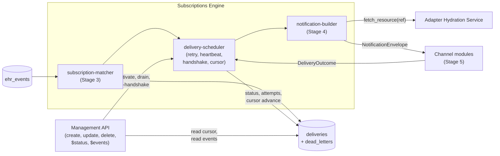
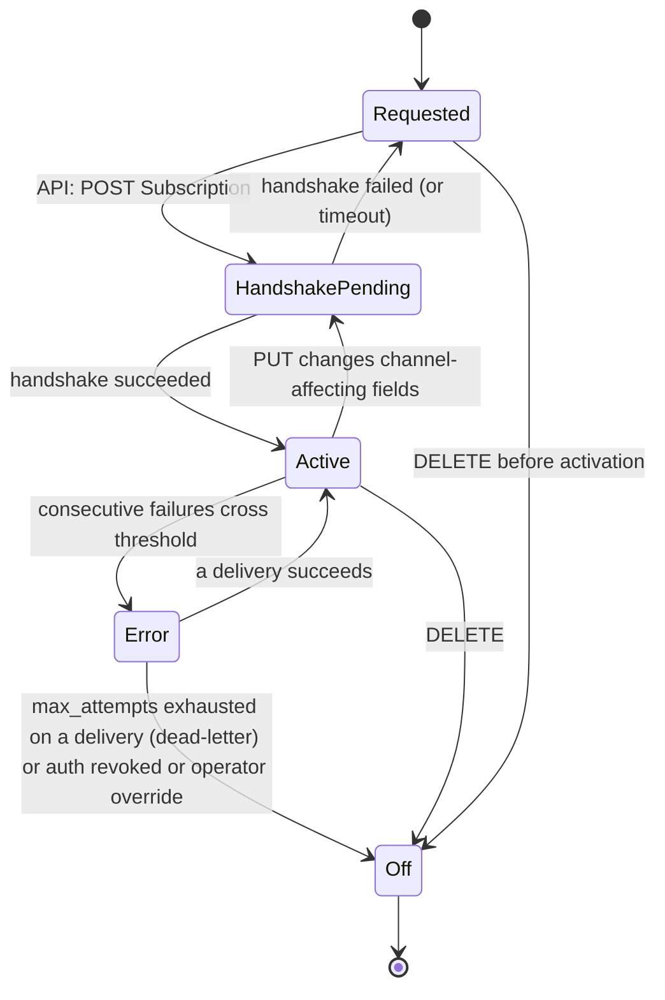
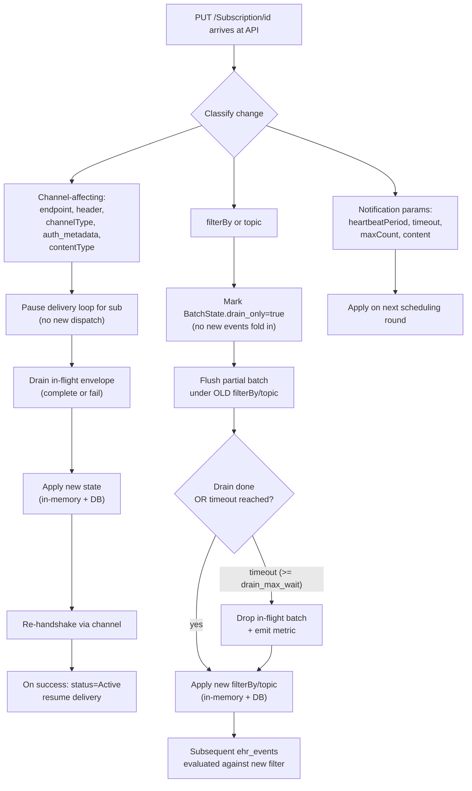
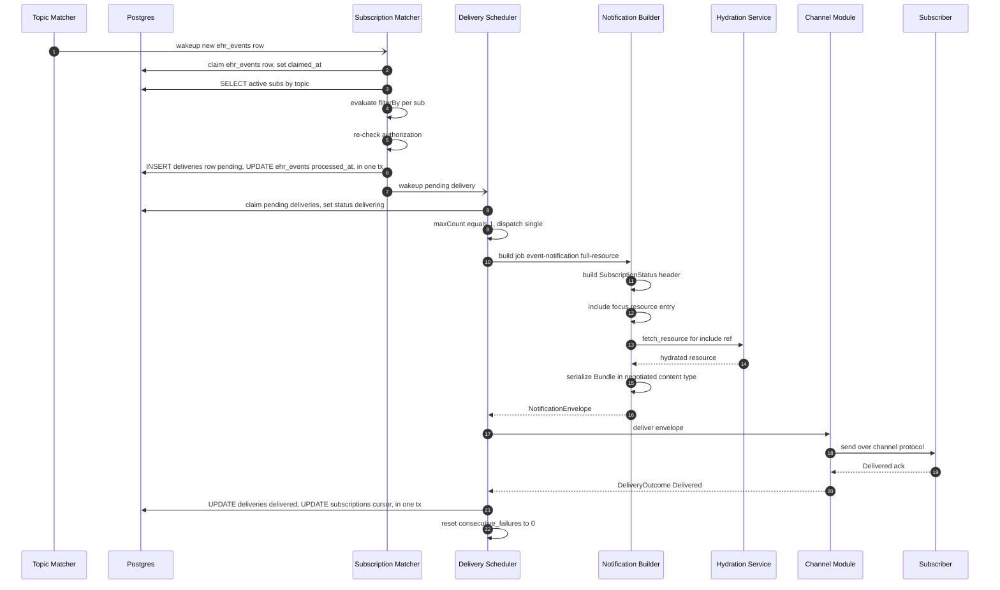

# Low-Level Design: Subscriptions Engine

**Purpose.** This document specifies the implementable design of the Subscriptions Engine — Stages 3 (subscription fanout) and 4 (notification Bundle build) of the pipeline, plus the delivery scheduler that owns retries, heartbeats, the activation handshake, and the per-subscription event cursor. It picks up where the high-level design domain doc leaves off and turns the prose into concrete data structures, named functions, lifecycle invariants, and operational knobs that an implementor can build to without further design work.

**Reader's prerequisites.** Read, in order:

- `docs/high-level-concept.md` — the bridge model and the "what does this server do" framing.
- `docs/architecture.md` — sections "Pipeline from EHR change to subscriber notification" (Stages 3-4 and the end-to-end sequence diagram), "Notification Construction" (five notification types, payload types, batching), "Subscription lifecycle states", "Subscription update semantics", and "Other Spec Requirements".
- `docs/high-level-design/domains/subscriptions-engine.md` — the HLD this LLD operationalizes, including the new "Update semantics: drain before applying changes" subsection.
- `docs/high-level-design/contracts/internal-tables.md` — the row shapes of `ehr_events` and `deliveries`. Those are the wire-level contract this engine reads and writes.
- `docs/high-level-design/contracts/notification-bundle.md` — the Bundle wire shape this engine produces.
- The R5 spec pages: `https://hl7.org/fhir/R5/subscription.html`, `https://hl7.org/fhir/R5/notifications.html`, `https://hl7.org/fhir/R5/subscriptionstatus.html`.

This LLD does not restate any of those documents. It refers back to them by section.

## Placement

The engine lives between the Topic Matcher (which writes `ehr_events`) and the Channel modules (which deliver `NotificationEnvelope`s). Its Postgres seams on either side are immutable contracts owned by other documents.



The engine is generic and vendor-neutral. Its only synchronous in-process call across the EHR boundary is `fetch_resource(ref)` into the adapter's Hydration Service while building a `full-resource` Bundle. Everything else crosses through Postgres rows.

## Cross-cutting concepts and shared types

A handful of shared types appear in all three sub-components. Defining them once.

```
struct EngineContext {
    db: PgPool                     // pool sized per delivery.pool config
    auth: AuthValidator            // re-checks scopes at delivery prep
    filter_eval: FilterEvaluator   // shared with Topic Matcher
    hydration: HydrationClient     // adapter callback
    channel_registry: ChannelRegistry
    metrics: MetricsEmitter
    clock: Clock
    config: EngineConfig
    cancel: CancellationToken
}

struct DeliveryRow {
    id: Uuid
    subscription_id: Uuid
    event_number: i64
    ehr_event_id: Uuid
    status: DeliveryStatus  // pending | delivering | delivered | failed_transient | failed_permanent
    attempts: i32
    next_attempt_at: DateTime
    last_error: String?
    delivered_at: DateTime?
    correlation_id: String
    created_at: DateTime
}

struct SubscriptionRow {
    id: Uuid
    status: SubStatus            // requested | active | error | off | entered-in-error
    topic_url: String
    filter_by: Vec<FilterClause>
    channel_type_coding: Coding
    endpoint: String
    headers: Vec<(String,String)>
    payload_type: PayloadType    // empty | id-only | full-resource
    content_type: ContentType    // application/fhir+json | application/fhir+xml
    max_count: u32               // batching cap; 1 = no batching
    heartbeat_period: Duration?
    timeout: Duration?
    auth_metadata: AuthMetadata
    cursor: i64                  // eventsSinceSubscriptionStart
    consecutive_failures: u32
    last_handshake_outcome: HandshakeOutcome?
    fhir_version: FhirVersion
    last_error: String?
    updated_at: DateTime
}

struct NotificationEnvelope {
    subscription_id: Uuid
    sequence: i64                // eventsSinceSubscriptionStart at top of batch
    bundle_bytes: Bytes          // already serialized in negotiated content_type
    bundle_size_bytes: u64
    payload_type: PayloadType
    content_type: ContentType
    notification_type: NotificationType  // handshake|heartbeat|event-notification|query-status|query-event
    attempt: u32
    deadline: DateTime           // soft deadline derived from subscription.timeout
}

enum DeliveryOutcome {
    Delivered,
    TransientFailure { retry_after: Duration?, reason: String },
    PermanentFailure { reason: String },
}
```

All times are UTC. All `DateTime` reads go through `ctx.clock.now()` so tests can pin time.

The engine runs as a single OS process with three pools of async tasks: a fanout pool (Stage 3), a builder pool (Stage 4), and a delivery pool (Stage 5 fanout to channels plus retry / heartbeat / handshake timer wheel). Pool sizes come from config (`delivery.fanout_workers`, `delivery.builder_workers`, `delivery.delivery_workers`). The pools share a single Postgres connection pool. There is no leader election; multiple workers within a pool race on `SELECT FOR UPDATE SKIP LOCKED` claims and the unique key `(subscription_id, event_number)` on `deliveries` keeps writes idempotent.

## Subscription Matcher (Stage 3)

### What it does

Reads `ehr_events`. For each row, finds active subscriptions on the topic, evaluates each subscription's `filterBy`, re-checks the subscription's authorization, and writes one `deliveries` row per matching subscription. If zero subscriptions match, the `ehr_events` row is still marked processed in the same transaction. Authorization failures do not write a delivery row; they transition the subscription to `error` (or `off`, per `auth.on_revoked` policy) and write an audit entry.

### Internal data structures

```
struct SubscriptionMatcherWorker {
    ctx: EngineContext
    claim_batch_size: u32           // claim N rows per loop pass
    poll_interval: Duration
    wakeup_rx: WakeupReceiver       // signal from Topic Matcher commit
}

struct CandidateSubscription {
    sub: SubscriptionRow
    fanout_decision: FanoutDecision  // Match | NoMatch | AuthRevoked | EvaluationError
}

enum FanoutDecision {
    Match,
    NoMatch { reason: SkipReason },
    AuthRevoked { scope_check: AuthCheckResult },
    EvaluationError { error: FilterError },
}

struct FanoutResult {
    matched: u32
    skipped_filter: u32
    skipped_auth: u32
    errored: u32
}
```

The matcher does not hold per-event state in memory across loop passes — every loop is a fresh claim. Per-subscription state (cursor, consecutive failures) lives on the `subscriptions` row; the matcher only reads it.

### Pseudo-code

```
async fn run_matcher_loop(self) {
    while !self.ctx.cancel.is_cancelled() {
        let claimed = self.claim_events(self.claim_batch_size).await
        if claimed.is_empty() {
            await wait_either(self.wakeup_rx.recv(), sleep(self.poll_interval))
            continue
        }
        for event in claimed {
            self.fanout_one_event(event).await
        }
    }
}

async fn claim_events(self, n: u32) -> Vec<EhrEventRow> {
    // SELECT ... FROM ehr_events
    // WHERE claimed_at IS NULL
    // ORDER BY event_number
    // LIMIT n
    // FOR UPDATE SKIP LOCKED
    //
    // The same transaction sets claimed_at = now() so a peer worker
    // does not pick the same row. processed_at is set later in fanout_one_event.
    return self.ctx.db.tx(|tx| {
        let rows = tx.query("SELECT ... FOR UPDATE SKIP LOCKED ...").await?
        for r in rows { tx.exec("UPDATE ehr_events SET claimed_at = now() WHERE id = $1", r.id).await? }
        return rows
    }).await
}

async fn fanout_one_event(self, event: EhrEventRow) {
    // Load candidate subscriptions: status in ('active', 'error') only.
    // 'error' subscriptions still receive new events; the scheduler is the
    // one that backs them off, not the matcher. Index: subscriptions(topic_url, status).
    let candidates = self.ctx.db.query(
        "SELECT * FROM subscriptions WHERE topic_url = $1 AND status IN ('active','error')",
        event.topic_url
    ).await

    // Decide each: filterBy first, then auth re-check.
    let decisions = self.evaluate_candidates(event, candidates)
    let matches = decisions.iter().filter(|d| d.fanout_decision == Match).collect()

    self.ctx.db.tx(|tx| {
        for d in &matches {
            // (subscription_id, event_number) is UNIQUE; ON CONFLICT DO NOTHING
            // makes fanout idempotent across replays of the same ehr_events row.
            tx.exec(
                "INSERT INTO deliveries (id, subscription_id, event_number, ehr_event_id,
                                         status, attempts, next_attempt_at, correlation_id, created_at)
                 VALUES (gen_random_uuid(), $1, $2, $3, 'pending', 0, now(), $4, now())
                 ON CONFLICT (subscription_id, event_number) DO NOTHING",
                d.sub.id, event.event_number, event.id, event.correlation_id
            ).await
        }
        tx.exec("UPDATE ehr_events SET processed_at = now() WHERE id = $1", event.id).await
        for d in decisions.where_auth_revoked() {
            transition_subscription_on_auth_revoked(tx, d.sub).await
            audit(tx, "auth_revoked_at_delivery_prep", d.sub.id, event.event_number).await
        }
    }).await

    self.ctx.metrics.record_fanout(event.topic_url, matches.len(), decisions)
    if !matches.is_empty() { self.ctx.wakeup.signal_scheduler() }
}

fn evaluate_candidates(self, event: EhrEventRow, candidates: Vec<SubscriptionRow>) -> Vec<CandidateSubscription> {
    let out = Vec::new()
    for sub in candidates {
        let f = self.ctx.filter_eval.evaluate_all(sub.filter_by, event.resource, event.previous_resource)
        if f.is_error()    { out.push(decision(sub, EvaluationError(f.err))); continue }
        if !f.is_match()   { out.push(decision(sub, NoMatch(f.reason)));      continue }
        // Spec-mandated delivery-time scope re-check.
        let a = self.ctx.auth.recheck_scopes(sub.auth_metadata, event.topic_url, event.focus)
        if a.is_revoked()  { out.push(decision(sub, AuthRevoked(a.reason)));  continue }
        if a.is_error()    { out.push(decision(sub, EvaluationError(a.err))); continue }
        out.push(decision(sub, Match))
    }
    return out
}
```

### Filter evaluation, auth re-check, and the zero-match invariant

`FilterEvaluator` is the same `core/filter` module the Topic Matcher uses, accepting the same supported subset of search-parameter expressions and FHIRPath. The matcher passes both `event.resource` and `event.previous_resource` so previous-state filter semantics work without re-loading. A filter that errors at runtime produces `EvaluationError`: the matcher skips that subscription for that event, increments `filter_runtime_errors`, and lights an operator alert if the per-subscription rate crosses a threshold.

`AuthValidator.recheck_scopes` performs the spec-mandated delivery-time scope check. `Revoked` skips the delivery row and triggers the audit + transition path. `Error` (auth backend unreachable) is treated as transient — the `ehr_events` row is left unprocessed and the next loop pass retries. Persistent auth outage is a separate operational alert.

The zero-match invariant is implemented by transactional discipline: N >= 1 matches commit "N inserts + UPDATE processed_at" together; N == 0 commits "UPDATE processed_at only" together. A row that errored before commit leaves `claimed_at` set; a startup recovery sweep zeroes `claimed_at` on rows older than `claim_lease_window` with `processed_at IS NULL` so crashed claims don't strand the row.

## Notification Builder (Stage 4)

### What it does

Reads pending `deliveries` (or, when the subscription is batching, a small group of pending rows for the same subscription), assembles the `subscription-notification` Bundle, serializes it in the negotiated content type, and returns a `NotificationEnvelope` to the delivery scheduler. The Bundle wire shape is the contract owned by `notification-bundle.md`. The builder does not invent a new shape — it picks the right variant per `(notification type, payload type, topic shape, batching state)` and fills in the spec-defined fields.

### Internal data structures

```
struct NotificationBuilder {
    ctx: EngineContext
    builder_pool: AsyncPool       // bounded concurrency
    bundle_writer: FhirSerializer // R4B / R5 / R6 via version-shim
}

struct BuildJob {
    subscription: SubscriptionRow
    notification_type: NotificationType
    events: Vec<EhrEventRow>      // empty for handshake / heartbeat / query-status; >= 1 for event-notification / query-event
    requested_attempt: u32
}

struct HydrationCache {
    // Per-build-job in-memory map keyed by FhirReference. Bounded.
    // Survives only for the duration of one BuildJob. Cross-build caching
    // is the HydrationService's job (it has its own LRU); this in-build cache
    // ensures we do not request the same Patient twice while assembling a single
    // batched Bundle that touches it from multiple events.
    map: Map<FhirReference, FhirResource>
}
```

### Pseudo-code

```
async fn build(self, job: BuildJob) -> Result<NotificationEnvelope, BuildError> {
    // SubscriptionStatus header. Always entry index 0.
    let highest = job.events.iter().map(|e| e.event_number).max().unwrap_or(job.subscription.cursor)
    let header = SubscriptionStatus {
        status: job.subscription.status_for_wire(),  // active | error | off
        type: job.notification_type,
        events_since_subscription_start: highest,
        notification_event: job.events.iter().map(|e| NotificationEvent {
            eventNumber: e.event_number,
            timestamp: e.occurred_at,
            focus: if job.subscription.payload_type == Empty { None } else { Some(Reference(e.focus)) },
            additionalContext: if job.subscription.payload_type == FullResource {
                additional_context_refs(e.notification_shape_hint)
            } else { Vec::new() },
        }).collect(),
        subscription: Reference("Subscription/" + job.subscription.id),
        topic: job.subscription.topic_url,
        error: if job.subscription.status == Error { Some(job.subscription.last_error) } else { None },
    }

    // Body entries. Empty for handshake/heartbeat/query-status and for empty payload.
    // For id-only, the focus reference lives on the SubscriptionStatus only.
    // For full-resource, we add the focus resource(s) plus hydrated includes.
    let entries = match (job.notification_type, job.subscription.payload_type) {
        (Handshake | Heartbeat | QueryStatus, _)            => Vec::new(),
        (_, Empty | IdOnly)                                 => Vec::new(),
        (EventNotification | QueryEvent, FullResource)      => self.build_full_resource_entries(job).await?,
    }

    let bundle = Bundle {
        resourceType: "Bundle",
        type: "subscription-notification",
        timestamp: self.ctx.clock.now(),
        entry: prepend(SubscriptionStatusEntry(header), entries),
    }
    let bytes = self.bundle_writer.serialize(bundle, job.subscription.fhir_version, job.subscription.content_type)?
    return NotificationEnvelope {
        subscription_id: job.subscription.id,
        sequence: highest,
        bundle_bytes: bytes,
        bundle_size_bytes: bytes.len(),
        payload_type: job.subscription.payload_type,
        content_type: job.subscription.content_type,
        notification_type: job.notification_type,
        attempt: job.requested_attempt,
        deadline: self.ctx.clock.now() + job.subscription.timeout.unwrap_or(default_timeout()),
    }
}

async fn build_full_resource_entries(self, job: BuildJob) -> Result<Vec<BundleEntry>, BuildError> {
    let cache = HydrationCache::new()  // per-build dedup; HydrationService has its own LRU across builds
    let mut entries = Vec::new()
    let mut seen = Set::new()
    // Focus resources (deduplicated when a batch contains multiple updates to the same resource).
    for event in &job.events {
        if seen.insert(Reference(event.focus)) {
            entries.push(BundleEntry { resource: event.resource })
        }
    }
    // Includes per topic shape. The hint was denormalized onto ehr_events by the Topic Matcher.
    for event in &job.events {
        for r in walk_includes(event.notification_shape_hint, event.resource) {
            if !seen.insert(r) { continue }
            if let Some(cached) = cache.map.get(r) {
                entries.push(BundleEntry { resource: cached }); continue
            }
            match self.ctx.hydration.fetch_resource(r, hydration_deadline(job)).await {
                Ok(res)                                  => { cache.map.insert(r, res); entries.push(BundleEntry { resource: res }) }
                Err(HydrationError::Timeout | Network)   => return Err(BuildError::HydrationTransient(r)),  // scheduler retries
                Err(HydrationError::NotFound)            => self.ctx.metrics.inc("hydration_skipped_not_found"),  // best-effort include
                Err(HydrationError::Forbidden)           => return Err(BuildError::HydrationForbidden(r)),  // scheduler dead-letters
            }
        }
    }
    return Ok(entries)
}
```

### Notification type rules and hydration semantics

The caller (delivery scheduler or Management API) supplies the notification type. `handshake` and `heartbeat` build `SubscriptionStatus`-only Bundles with no events. `event-notification` carries one or more events and is the only type whose delivery advances the cursor. `query-status` returns the current cursor unchanged. `query-event` replays events from `ehr_events`; the builder reuses the same Bundle assembly path, but the scheduler does not write a `deliveries` row for replays so the cursor stays put.

Hydration is invoked only for `full-resource` payloads — `empty` and `id-only` short-circuit before any EHR call. Each `fetch_resource` carries a deadline derived from the lesser of `subscription.timeout` and the build's overall budget; the HydrationService applies its own per-fetch timeout on top. Outcomes:

- `Ok` -> add to entries.
- `Timeout` / `Network` -> transient: scheduler keeps the row at `pending`, increments attempts, applies the retry curve.
- `NotFound` -> include is best-effort; skip silently and continue building.
- `Forbidden` -> permanent: scheduler dead-letters and audits.

Cross-subscription hydration coalescing is the HydrationService's job. The builder's per-build cache only deduplicates references within one batched Bundle.

## Delivery Scheduler

The scheduler is the third sub-component and is the engine's most stateful piece. It owns the retry curve, the heartbeat timer, the activation handshake state machine, the per-subscription cursor, the per-subscription batching state, and subscription status transitions.

### Internal data structures

```
struct DeliveryScheduler {
    ctx: EngineContext
    workers: Vec<DeliveryWorker>
    timer_wheel: TimerWheel       // hierarchical wheel for heartbeats and retry deadlines
    batch_table: BatchTable       // in-memory per-subscription batching state
    handshake_table: HandshakeTable
    update_apply_queue: Queue<SubscriptionUpdateRequest>
}

struct BatchTable {
    by_sub: ConcurrentMap<Uuid, BatchState>
}

struct BatchState {
    subscription_id: Uuid
    pending_event_numbers: Vec<i64>  // sorted
    first_event_at: DateTime          // for maxBatchWait
    flush_deadline: DateTime          // first_event_at + maxBatchWait
    max_count: u32
    drain_only: bool                  // set by update flow to stop accepting new events
}

struct HandshakeTable {
    by_sub: ConcurrentMap<Uuid, HandshakeState>
}

struct HandshakeState {
    subscription_id: Uuid
    attempt: u32
    started_at: DateTime
    deadline: DateTime
    last_outcome: HandshakeOutcome?
}

enum HandshakeOutcome { Pending, Succeeded, Failed { reason: String } }

enum SubscriptionUpdateRequest {
    ChannelAffecting { sub_id: Uuid, new_state: SubscriptionRow },
    FilterOrTopic    { sub_id: Uuid, new_state: SubscriptionRow },
    NotificationParams { sub_id: Uuid, new_state: SubscriptionRow },
    Activate { sub_id: Uuid },
    Deactivate { sub_id: Uuid, reason: DeactivateReason },
}
```

The `BatchTable` is the in-memory per-subscription batch table referenced by the HLD. It is keyed by `subscription_id`. Each entry's `pending_event_numbers` is also represented durably by `deliveries` rows with `status = 'pending'` so a crash recovers the partial batch (see "Crash recovery" below).

### Pseudo-code

```
async fn run_scheduler_loop(self) {
    while !self.ctx.cancel.is_cancelled() {
        // 1. apply any queued PUT-driven subscription updates first
        self.drain_update_queue().await
        // 2. claim ready deliveries (pending and next_attempt_at <= now). One claim, one tx.
        let claimed = self.ctx.db.tx(|tx| {
            let rows = tx.query("
                SELECT * FROM deliveries
                WHERE status = 'pending' AND next_attempt_at <= now()
                ORDER BY subscription_id, event_number
                LIMIT $1 FOR UPDATE SKIP LOCKED
            ", self.config.delivery_batch).await
            for r in &rows { tx.exec("UPDATE deliveries SET status = 'delivering' WHERE id = $1", r.id).await }
            return rows
        }).await
        // 3. fold into batches (or dispatch immediately for max_count = 1)
        for row in claimed { self.enqueue_for_batching(row).await }
        // 4. flush any batches that hit maxCount or whose maxBatchWait expired
        self.flush_due_batches().await
        // 5. fire heartbeats for subscriptions due (and whose last event was older than the period)
        self.fire_heartbeats().await
        // 6. expire any in-flight handshakes whose deadline elapsed
        for state in self.handshake_table.snapshot() {
            if state.last_outcome == Pending && state.deadline <= now() {
                self.fail_handshake(state.subscription_id, "handshake_timeout").await
            }
        }
        await wait_either(self.timer_wheel.next_deadline(), self.ctx.wakeup.recv(), sleep(self.config.scheduler_tick))
    }
}

async fn enqueue_for_batching(self, row: DeliveryRow) {
    let sub = self.load_subscription(row.subscription_id).await
    if sub.max_count <= 1 { return self.dispatch(sub, vec![row]).await }
    let state = self.batch_table.get_or_create(sub.id, sub.max_count, self.config.max_batch_wait)
    if state.drain_only {
        // A subscription update is in progress; this event was claimed before the drain began.
        // Release the delivering claim back to pending so the post-update scheduler picks it up.
        self.requeue_pending(row).await
        return
    }
    state.pending_event_numbers.push(row.event_number)
    state.flush_deadline = state.first_event_at + self.config.max_batch_wait
    if state.pending_event_numbers.len() >= sub.max_count { self.flush_batch(sub.id).await }
}

async fn flush_due_batches(self) {
    let now = self.ctx.clock.now()
    for (sub_id, state) in self.batch_table.snapshot() {
        if state.pending_event_numbers.is_empty() { continue }
        if state.pending_event_numbers.len() >= state.max_count || state.flush_deadline <= now {
            self.flush_batch(sub_id).await
        }
    }
}

async fn flush_batch(self, sub_id: Uuid) {
    let state = self.batch_table.take(sub_id)
    let sub = self.load_subscription(sub_id).await
    let rows = self.load_delivery_rows(sub_id, state.pending_event_numbers).await
    self.dispatch(sub, rows).await
}

async fn dispatch(self, sub: SubscriptionRow, rows: Vec<DeliveryRow>) {
    let events = self.load_ehr_events(rows.iter().map(|r| r.ehr_event_id).collect()).await
    let env = self.ctx.builder.build(BuildJob {
        subscription: sub,
        notification_type: NotificationType::EventNotification,
        events: events,
        requested_attempt: rows[0].attempts,
    }).await
    let channel = self.ctx.channel_registry.lookup(sub.channel_type_coding)
    let outcome = match env {
        Ok(e)  => channel.deliver(e).await,
        Err(BuildError::HydrationTransient(_))  => DeliveryOutcome::TransientFailure { retry_after: None, reason: "hydration_transient" },
        Err(BuildError::HydrationForbidden(_))  => DeliveryOutcome::PermanentFailure { reason: "hydration_forbidden" },
        Err(other)                              => DeliveryOutcome::PermanentFailure { reason: format!("build_error: {}", other) },
    }
    self.handle_outcome(sub, rows.iter().map(|r| r.event_number).collect(), outcome).await
}

async fn handle_outcome(self, sub: SubscriptionRow, event_numbers: Vec<i64>, outcome: DeliveryOutcome) {
    self.ctx.db.tx(|tx| match outcome {
        Delivered => {
            for n in &event_numbers {
                tx.exec("UPDATE deliveries SET status='delivered', delivered_at=now() WHERE subscription_id=$1 AND event_number=$2", sub.id, n).await
            }
            let highest = event_numbers.iter().max()
            tx.exec("UPDATE subscriptions SET cursor = GREATEST(cursor, $1), consecutive_failures = 0 WHERE id = $2", highest, sub.id).await
            if sub.status == Error { transition_subscription(tx, sub.id, Active, "delivery_recovered") }
        }
        TransientFailure { retry_after, reason } => {
            // Backoff: caller's hint wins clamped, otherwise exponential with jitter from the retry curve.
            let attempts = max_attempts_for(tx, sub.id, &event_numbers).await
            let base = retry_after
                .map(|s| clamp(s, self.config.retry.min, self.config.retry.max))
                .unwrap_or_else(|| min(self.config.retry.initial * (2 ^ attempts), self.config.retry.max))
            let next_attempt = now() + base + random_jitter(base, self.config.retry.jitter)
            for n in &event_numbers {
                tx.exec("UPDATE deliveries SET status='failed_transient', attempts=attempts+1, next_attempt_at=$1, last_error=$2 WHERE subscription_id=$3 AND event_number=$4", next_attempt, reason, sub.id, n).await
                let row = read_row(tx, sub.id, n).await
                if row.attempts >= self.config.retry.max_attempts {
                    escalate_to_dead_letter(tx, row, "max_attempts_exhausted").await
                }
            }
            tx.exec("UPDATE subscriptions SET consecutive_failures = consecutive_failures + 1 WHERE id = $1", sub.id).await
            maybe_transition_to_error(tx, sub.id, self.config.retry.error_threshold).await
            self.timer_wheel.schedule(sub.id, next_attempt)
        }
        PermanentFailure { reason } => {
            for n in &event_numbers {
                escalate_to_dead_letter(tx, read_row(tx, sub.id, n).await, reason).await
            }
            tx.exec("UPDATE subscriptions SET consecutive_failures = consecutive_failures + 1 WHERE id = $1", sub.id).await
            maybe_transition_to_off(tx, sub.id, "permanent_failure", reason).await
        }
    }).await
}

async fn fire_heartbeats(self) {
    let now = self.ctx.clock.now()
    for sub_id in self.heartbeat_index.due_at(now) {
        let sub = self.load_subscription(sub_id).await
        if sub.status != Active || sub.heartbeat_period.is_none() { continue }
        // Skip if an event-notification was delivered within the period (events reset the heartbeat clock).
        if self.last_notification_at(sub_id) > now - sub.heartbeat_period { continue }
        let env = self.ctx.builder.build(BuildJob {
            subscription: sub,
            notification_type: NotificationType::Heartbeat,
            events: Vec::new(),
            requested_attempt: 0,
        }).await
        let channel = self.ctx.channel_registry.lookup(sub.channel_type_coding)
        let _ = channel.send_heartbeat(sub).await  // channels lacking heartbeat support no-op per manifest
        self.heartbeat_index.reschedule(sub_id, now + sub.heartbeat_period.unwrap())
    }
}

async fn start_handshake(self, sub_id: Uuid) {
    let sub = self.load_subscription(sub_id).await
    let channel = self.ctx.channel_registry.lookup(sub.channel_type_coding)
    let outcome = channel.on_subscription_activated(sub).await
    match outcome {
        HandshakeOutcome::Succeeded     => { transition_subscription(self.ctx.db, sub.id, Active,    "handshake_ok"); self.handshake_table.complete(sub.id, Succeeded) }
        HandshakeOutcome::Failed(reason) => { transition_subscription(self.ctx.db, sub.id, Requested, "handshake_failed: " + reason); self.handshake_table.complete(sub.id, Failed(reason)) }
    }
}
```

### Retry curve

The retry curve is configurable per `delivery.retry` (see "Configuration knobs"). Default behavior:

- Initial delay: 10s.
- Exponent: doubling per attempt.
- Cap: 1h.
- Jitter: +/- 20% of the computed base.
- Max attempts: 8 (after the 8th attempt, dead-letter).
- `retry_after` from a channel always wins, clamped into `[retry.min, retry.max]`.

For batched deliveries, `attempts` is incremented per event-row in the batch and the batch as a whole is rebuilt on the next pass. If a batch fails, every event_number it carried is re-evaluated for retry independently — typically they stay together because they share the same `next_attempt_at` and the batcher re-groups them.

### Heartbeats

Per `Subscription.heartbeatPeriod` (clamped at startup into `[heartbeat.min_period, heartbeat.max_period]`). The scheduler keeps a heartbeat index sorted by next-fire time. A heartbeat fires only if no event-notification has been delivered within the period — sent event-notifications "reset" the heartbeat clock for that subscription. Heartbeats:

- Do not increment `eventsSinceSubscriptionStart`.
- Do not write `deliveries` rows. Heartbeat outcomes are tracked in metrics only (`heartbeats_sent`, `heartbeat_failures`); a transient heartbeat failure increments `consecutive_failures` but does not dead-letter.
- Are channel-aware: channels whose manifest declares `supports_heartbeats = false` (e.g., one-shot SFTP drops) get a no-op `send_heartbeat`. The scheduler still schedules; the channel returns `Ok` and does nothing.

### Handshake state machine



Transitions are persisted on the `subscriptions` row in the same transaction as the event that drove them. `$status` returns the current value; the audit log records every transition with reason and actor.

### Per-subscription event cursor

`subscriptions.cursor` (`eventsSinceSubscriptionStart`) advances only when a delivery commits with `status = 'delivered'` (see `handle_outcome` Delivered branch). Pending and failed-transient deliveries do not advance the cursor. This is what makes `$events`-driven catch-up correct: a subscriber sees the cursor unchanged through transient failures, knows it has not received certain events, and can call `$events?eventsSinceNumber=cursor` to fetch them. A subscription stuck in `error` keeps its cursor at the last successfully delivered event indefinitely until either delivery recovers or the operator transitions to `off`.

### Per-subscription batching state, in-memory and durable

The HLD says: "State lives in memory; each pending row also has `status = 'pending'` in `deliveries` so a crash recovers the partial batch." This LLD's implementation:

- The in-memory `BatchTable` is the fast path. When events arrive, the matcher writes a `pending` `deliveries` row and signals the scheduler. The scheduler claims it, folds it into `BatchState`, and either flushes (max reached) or arms a flush deadline timer.
- On crash and restart, the `BatchTable` is empty. A startup `recover_pending_batches` routine rebuilds it:

```
async fn recover_pending_batches(self) {
    // For every subscription with one or more pending deliveries, rebuild BatchState.
    let rows = self.ctx.db.query("
        SELECT subscription_id, MIN(created_at) AS first_event_at, ARRAY_AGG(event_number ORDER BY event_number) AS evts
        FROM deliveries
        WHERE status = 'pending'
        GROUP BY subscription_id
    ").await
    for r in rows {
        let sub = self.load_subscription(r.subscription_id).await
        let state = BatchState {
            subscription_id: sub.id,
            pending_event_numbers: r.evts,
            first_event_at: r.first_event_at,
            flush_deadline: r.first_event_at + self.config.max_batch_wait,
            max_count: sub.max_count,
            drain_only: false,
        }
        self.batch_table.insert(sub.id, state)
    }
}
```

The `(subscription_id, event_number)` unique key on `deliveries` plus the durable `pending` status means recovery cannot duplicate a delivery — every event that should be in the batch is already in the durable log, the in-memory table is only the schedule.

## Subscription update semantics

`PUT /Subscription/{id}` is dispatched by the Management API to the scheduler via the `update_apply_queue`. The scheduler classifies the change and applies it without disrupting in-flight work.



Pseudo-code:

```
async fn drain_update_queue(self) {
    while let Some(req) = self.update_apply_queue.try_pop() {
        match req {
            ChannelAffecting { sub_id, new_state } => self.apply_update(sub_id, new_state, /*drain*/ true,  /*rehandshake*/ true ).await,
            FilterOrTopic    { sub_id, new_state } => self.apply_update(sub_id, new_state, /*drain*/ true,  /*rehandshake*/ false).await,
            NotificationParams { sub_id, new_state } => self.apply_update(sub_id, new_state, /*drain*/ false, /*rehandshake*/ false).await,
            Activate   { sub_id }                  => self.start_handshake(sub_id).await,
            Deactivate { sub_id, reason }          => self.deactivate(sub_id, reason).await,
        }
    }
}

async fn apply_update(self, sub_id: Uuid, new_state: SubscriptionRow, drain: bool, rehandshake: bool) {
    if drain {
        self.batch_table.set_drain_only(sub_id, true)
        let ok = await_either(self.batch_drained(sub_id), sleep(self.config.drain_max_wait))
        if !ok { self.drop_in_flight_batch(sub_id, "update_drain_timeout") }
    }
    persist_subscription(self.ctx.db, new_state).await
    if rehandshake {
        transition_subscription(self.ctx.db, sub_id, Requested, "channel_change_re_handshake")
        self.start_handshake(sub_id).await
    }
    if drain { self.batch_table.set_drain_only(sub_id, false) }
    // notification-params updates have no drain, no re-handshake; they take effect on the next scheduling round.
}
```

The drain is bounded by `delivery.drain_max_wait` (default 60s, > `max_batch_wait` so the drain has time to wait for one full flush window). If drain exceeds the bound, the in-flight batch is dropped — its `pending` rows are flipped to `failed_permanent` with reason `drain_timeout` and dead-lettered. The metric `update_drain_timeouts_total` increments. This is expected to be exceedingly rare because the drain only has to wait for one in-flight envelope to finish or one batch flush window to elapse.

`PUT` on a subscription in `error` is allowed: the scheduler applies the change against the stored row and the next retry uses the new state. `PUT` on a subscription in `off` (terminated) is rejected at the API.

## $events and $status

Both are read-only operations the Management API serves directly out of Postgres and the builder; the engine's only role is to expose the same builder for query Bundles.

```
async fn handle_query(self, sub_id: Uuid, kind: QueryKind) -> Bundle {
    let sub = self.load_subscription(sub_id).await
    self.ctx.auth.recheck_scopes(sub.auth_metadata, sub.topic_url, None)?  // re-check at replay/status time too
    let (notif_type, events) = match kind {
        QueryKind::Status                  => (NotificationType::QueryStatus, Vec::new()),
        QueryKind::Events { since, limit } => {
            let raw = self.ctx.db.query("
                SELECT * FROM ehr_events
                WHERE topic_url = $1 AND event_number > COALESCE($2, 0)
                ORDER BY event_number LIMIT $3
            ", sub.topic_url, since, limit).await
            let filtered = raw.into_iter()
                .filter(|e| self.ctx.filter_eval.evaluate_all(sub.filter_by, e.resource, e.previous_resource).is_match())
                .collect()
            (NotificationType::QueryEvent, filtered)
        }
    }
    return self.ctx.builder.build(BuildJob { subscription: sub, notification_type: notif_type, events, requested_attempt: 0 }).bundle
}
```

`$events` does not advance the cursor and does not write `deliveries` rows. The same `filterBy` evaluation and the same `notificationShape`-driven hydration are applied so a replayed Bundle is wire-shape-identical to the live Bundle the subscriber would have received.

## Sequence: one event from `ehr_events` to delivered

Reference the architecture's full end-to-end sequence in `docs/architecture.md` "End-to-end sequence: HL7 ORM for an order on a subscribed patient" for the full pipeline. The diagram below covers only the engine's slice — from `ehr_events` claim to `deliveries.status = delivered` — for one event, one matching subscription, `payload_type = full-resource`, `max_count = 1`.



Notes (no semicolons or second colons in arrow text on purpose, ASCII only, mirrors the architecture doc's Mermaid-safe style):

- Step 6 ("INSERT deliveries row pending") and step 17 ("UPDATE deliveries delivered") are both single transactions. The first is the fanout invariant ("processed with N rows, never partial"); the second is the cursor-advance invariant ("cursor advances only on confirmed delivery").
- Step 11 ("fetch_resource for include ref") is the only synchronous in-process call across the EHR boundary. Hydration cache and coalescing live inside the HydrationService.
- Steps 7-9 (load subs, filter, auth) all happen inside `fanout_one_event` and commit together.

## Failure modes

The matrix below is exhaustive for the engine's failure surface. "Outcome" is what the engine does next; "subscription state effect" is the cumulative effect on `subscriptions.status` after the relevant threshold is crossed; "operator action" is the typical human follow-up.

| Failure | Where caught | Outcome | Subscription state effect | Operator action |
|---|---|---|---|---|
| Subscriber endpoint timeout | Channel module, returns `TransientFailure` | `deliveries` row marked `failed_transient`, `next_attempt_at` set per backoff curve, retry on next loop | After `consecutive_failures >= retry.error_threshold`, transition `active` to `error`; on first `Delivered` after, transition back | Inspect subscriber endpoint health; widen `retry.max` if endpoint is slow but functional |
| Transient 5xx from subscriber | Channel module | Same as timeout | Same | Same |
| Permanent 4xx (400/403/404/410) | Channel module, returns `PermanentFailure` | `deliveries` row marked `failed_permanent`, copied to `dead_letters` | Increment `consecutive_failures`; if exceeded, transition to `off` after `retry.permanent_off_threshold` | Investigate dead-letter; subscriber may need re-registration |
| Channel unavailable (channel manifest disabled, channel module crashed) | Scheduler, channel registry lookup fails | All pending deliveries for that channel left in `pending`; scheduler stops claiming them and emits `channel_unavailable` metric | Subscription is not transitioned automatically; this is a deployment failure, not a subscriber failure | Restart channel module / re-enable in config |
| Hydration timeout / network error | Builder, returns `BuildError::HydrationTransient` | Delivery treated as transient: row stays/returns to `pending`, `attempts` incremented, retry curve applied | Same as endpoint timeout (counts toward `consecutive_failures`) | Inspect adapter Hydration Service; possible EHR slowdown |
| Hydration `NotFound` | Builder | Resource skipped in Bundle; build proceeds | None | None — expected when EHR has deleted a referenced resource |
| Hydration `Forbidden` | Builder, returns `BuildError::HydrationForbidden` | `deliveries` row dead-lettered | Increment `consecutive_failures`; possible transition to `off` if subscription has lost EHR-side access | Audit; revoke subscription if appropriate |
| Filter evaluation runtime error | Matcher | No `deliveries` row written for that event for that subscription; `filter_runtime_errors` metric increments | None on first failure; consistent failure across many events lights operator alert | Fix the filter expression (subscriber must `PUT` a corrected filter) |
| Authorization revoked at delivery prep | Matcher | No `deliveries` row written; subscription transitioned to `error` (or `off` per `auth.on_revoked`); audit entry written | `active` -> `error` (or `off`) | Re-register the subscriber or remove subscription |
| Authorization backend unreachable | Matcher | Treated transient: `ehr_events` row not processed, `claimed_at` reset on next sweep | None (subscription untouched) | Investigate auth backend; matcher recovers when auth comes back |
| Builder serialization error | Builder | Treated permanent: `deliveries` row dead-lettered with reason `serialization_error` | Increment `consecutive_failures` | Investigate; this is a server bug to fix, not a subscriber problem |
| Postgres unavailable | Any stage | All workers idle; `claim_*` queries fail; engine emits `postgres_unavailable` metric, readiness probe returns 503 | None (no transitions can be persisted while DB is down) | Wait for DB; engine resumes on reconnect |
| Crash mid-flight (worker dies after claim, before commit) | Recovery sweep at startup | `claimed_at` older than `claim_lease_window` is reset to `NULL`, row re-eligible for claim; `delivering` deliveries with no recent heartbeat are reset to `pending` | None | None — recovery is automatic |
| Drain timeout on `PUT` filterBy/topic | Update flow | In-flight batch dropped, all carried events flipped to `failed_permanent` with reason `drain_timeout` | `consecutive_failures` += batch size, possible `error` transition | Investigate why drain didn't complete (slow channel? stuck builder?) |
| Handshake timeout | Scheduler | Subscription stays `requested`, `last_handshake_outcome = Failed`; subscriber may `PUT` new endpoint | Stays `requested`; never reached `active` | Subscriber fixes endpoint and `PUT`s again to retry handshake |
| Heartbeat send failure | Scheduler / Channel | Logged + metric `heartbeat_failures` increments; no dead-letter, no subscription transition by itself | `consecutive_failures` += 1; reaches `error` after threshold | None unless sustained |

## Configuration knobs

All knobs live under the `delivery` and `engine` config domains in `docs/architecture.md` Configuration. Defaults shown.

```
delivery:
  default_max_count: 1
  max_batch_wait: 30s
  drain_max_wait: 60s         # cap on PUT-driven drain before drop
  scheduler_tick: 1s          # idle poll interval
  delivery_batch: 64          # max deliveries claimed per scheduler tick
  retry:
    max_attempts: 8
    error_threshold: 3        # consecutive failures before active -> error
    permanent_off_threshold: 5
    backoff:
      kind: exponential
      initial: 10s
      max: 1h
      min: 1s
      jitter: 0.2
  heartbeat:
    default_period: 5m
    min_period: 1m
    max_period: 1h
  hydration:
    per_fetch_timeout: 5s
    per_build_budget: 30s
  claim_lease_window: 60s     # crashed-worker reclaim threshold
  builder_workers: 4
  fanout_workers: 4
  delivery_workers: 8

auth:
  on_revoked: error           # error | off
  recheck_cache_ttl: 60s      # in-process cache for repeated re-checks
```

`Subscription.heartbeatPeriod`, `Subscription.timeout`, `Subscription.maxCount` are all clamped at create / update time into the deployment's configured ranges; values outside the range are rejected with HTTP 422 by the API.

A non-batching channel (manifest `supports_batching = false`) rejects `maxCount > 1` at subscription create with HTTP 422. The engine relies on this — if a stored subscription somehow has `max_count > 1` on a non-batching channel (config drift after a channel module update), the scheduler downgrades to single-event delivery and emits `batching_disabled_for_channel` so operators can see it.

## Metrics

Prometheus names are notional. Tags listed where useful.

| Metric | Type | Tags |
|---|---|---|
| `events_fanned_out_total` | counter | `topic_url` |
| `ehr_events_zero_match_total` | counter | `topic_url` |
| `deliveries_by_status` (pending, delivering, delivered, failed_transient, failed_permanent) | gauge | `status` |
| `delivery_retry_count` (histogram of `attempts` at delivered or dead-letter) | histogram | `channel_type` |
| `dead_letter_count_total` | counter | `channel_type`, `reason` |
| `end_to_end_latency_seconds` (`delivered_at - ehr_events.occurred_at`) | histogram | `topic_url`, `payload_type` |
| `fanout_to_delivery_latency_seconds` (engine-only slice) | histogram | `topic_url` |
| `heartbeat_lag_seconds` (positive means overdue) | gauge | per subscription |
| `heartbeats_sent_total`, `heartbeat_failures_total` | counter | `channel_type` |
| `handshake_outcomes_total` (succeeded / failed / timeout) | counter | `outcome` |
| `subscription_state_transitions_total` | counter | `from`, `to`, `reason` |
| `update_drain_timeouts_total` (channel / filter_or_topic) | counter | `kind` |
| `filter_runtime_errors_total` (sample at scrape, high-cardinality) | counter | `subscription_id`, `error_class` |
| `auth_revoked_at_delivery_prep_total` | counter | `subscription_id` |
| `hydration_call_total`, `hydration_transient_errors_total` | counter | `outcome`, `subscription_id` |
| `bundle_size_bytes` | histogram | `payload_type` |
| `cursor_advance_total` | counter | `subscription_id` |
| `engine_postgres_unavailable_total` | counter | `stage` |

## Test plan

Unit tests are written against in-memory fakes for `PgPool`, `AuthValidator`, `FilterEvaluator`, `HydrationClient`, and `ChannelRegistry`. Integration tests run against a real Postgres in a container plus a fake adapter and fake channel.

### Subscription Matcher

- Single `ehr_events` row, zero matching subscriptions: row marked processed, no `deliveries` rows, transactional.
- Single row, N matching subscriptions: N `deliveries` rows inserted, all in one transaction.
- `filterBy` rejects: no row, no transition.
- Filter runtime error on one of N: that subscription skipped, others fanned out, metric incremented.
- Auth revoked on one of N: that subscription transitioned to `error`/`off`, audit entry, others fanned out.
- Auth backend down: row left unprocessed, `claimed_at` cleared on next sweep, eventually retried.
- Two workers race on the same row: `SKIP LOCKED` ensures only one wins; the other gets a different row.
- Recovery: a worker dies between claim and commit; startup sweep clears stale `claimed_at`; the row is re-claimed and processed on next pass.
- Idempotent insert: a duplicated fanout cycle (e.g., a partial commit then re-run) does not produce duplicate `deliveries` thanks to `(subscription_id, event_number)` unique key.

### Notification Builder

- `empty` payload: Bundle has only `SubscriptionStatus`, `notificationEvent[i].focus` absent.
- `id-only` payload: Bundle has `SubscriptionStatus` with `focus` references; no resource entries.
- `full-resource` payload, single event: Bundle has `SubscriptionStatus`, focus entry, and includes per topic shape.
- `full-resource` payload, batched events with shared Patient: Patient hydrated once, deduplicated in entries.
- Hydration `NotFound`: included resource skipped, build succeeds.
- Hydration timeout: returns `BuildError::HydrationTransient`; scheduler keeps row pending, retries.
- Five notification types: each round-trips through the builder and produces a Bundle with the right `SubscriptionStatus.type`.
- Content-type round-trip: `application/fhir+json` and `application/fhir+xml` both serialize without loss.
- Version-shim: same domain object renders correctly under R4B Backport, R5, R6 (R6 once published).
- `query-event` replay: filterBy re-evaluation can drop events that were originally delivered; cursor does not advance.

### Delivery Scheduler

- Successful delivery: `deliveries` row to `delivered`, cursor advances, `consecutive_failures` zeroed.
- Transient failure: row to `failed_transient`, `next_attempt_at` follows the curve, retry succeeds, cursor advances on success.
- Max attempts exhausted: row to `failed_permanent`, dead-lettered, subscription transitions to `error`.
- Permanent 4xx: same path, immediate dead-letter.
- `retry_after` header from channel: clamps into `[retry.min, retry.max]` and overrides exponent.
- Heartbeat fires when no event sent within period; resets after an event.
- Heartbeat does not increment cursor.
- Handshake success: `requested` -> `active`.
- Handshake failure: stays `requested`, `last_handshake_outcome.Failed` populated, audit entry written.
- Channel-affecting `PUT`: drains, applies, re-handshakes, then re-enables delivery.
- `filterBy`-only `PUT`: drains, applies, no re-handshake.
- `notification-params` `PUT`: takes effect on the next event without drain or handshake.
- Drain timeout: in-flight batch dropped, metric incremented, sub remains operational.
- Crash recovery: with N pending rows, restart rebuilds `BatchTable` correctly (max-count and flush-deadline restored from durable state).
- Per-subscription ordering: with a contrived high-throughput scenario, no `deliveries` row for sub S is dispatched before its predecessor on S; cross-subscription ordering is not guaranteed (and the test asserts only the per-subscription invariant).

### End-to-end engine slice

- `ehr_events` -> `deliveries.delivered` for `payload_type = full-resource` with hydration cache hit and miss. Asserts the sequence diagram step-by-step on a real Postgres.
- Same, but with `max_count = 5` and `max_batch_wait = 1s`. Asserts batching flushes on either condition.
- Same, but with the channel returning `TransientFailure` once then `Delivered`. Asserts retry, cursor advance, no dead-letter.
- Same, but with `PermanentFailure` on the first attempt. Asserts dead-letter, `error` transition, cursor unchanged.

## Open questions

- Should the scheduler push retries forward eagerly when a channel reports `Delivered` after a long backoff, or wait for the natural tick? (Affects p99 catchup latency.)
- Whether to make `hydration.per_build_budget` per-subscription configurable, since some topics legitimately need many includes and may exceed the global default.
- `query-event` replay semantics: resolved by [decisions/0008](../high-level-design/decisions/0008-resolved-design-questions.md#12) — replays observe the **current** `filterBy`. No time-travel.
- Whether `error_threshold` and `permanent_off_threshold` should be channel-aware (e.g., a websocket subscription is more sensitive to consecutive failures than a once-a-day SFTP drop). Today they are global.
- The exact mechanism for an operator-initiated forced `off` transition that should bypass dead-lettering. Not yet specified.
- How to handle a `PUT` that arrives while a previous `PUT` is still draining — currently the second is queued behind the first; under sustained churn this could starve event delivery. May need a bounded queue and a 409 response.

## What this LLD does NOT cover

- **Stage 1 and Stage 2** (adapter translation, MLLP listener, topic matching) — owned by other LLDs.
- **Stage 5 channel implementations.** rest-hook, websocket, email/SMTP, FHIR messaging, custom channels — each has its own LLD. The engine's only interface is `deliver`, `on_subscription_activated`, `send_heartbeat`.
- **Subscription resource CRUD.** `Subscription`/`SubscriptionTopic` payload validation, `canFilterBy` enforcement, `CapabilityStatement`, the `$status`/`$events` HTTP endpoints — the engine provides read primitives; the API LLD owns the HTTP surface.
- **Auth scheme implementation.** SMART Backend Services validation, JWKS caching, scope grammar — the engine consumes `AuthValidator`; the auth LLD specifies it.
- **FHIR version translation.** The version-shim that emits R4B Backport / R5 / R6 wire shapes. The engine calls `bundle_writer.serialize`; the version-shim LLD specifies the writer.
- **Topic catalog management.** Loading, validating, hot-reloading `SubscriptionTopic` resources, parsing `notificationShape`. The engine reads the denormalized hint off `ehr_events`.
- **Storage migrations and partition maintenance.** The engine assumes the `internal-tables.md` contract is in effect.
- **Observability backends.** OTLP exporters, Prometheus scraping, log routing — the engine emits via `MetricsEmitter` and structured logs; the observability LLD owns the plumbing.
- **Multi-instance coordination.** Out of scope per "operational simplicity"; single replica per deployment.
- **Adapter Hydration Service internals.** Cache, coalescing, EHR HTTP client, vendor profiles — owned by the adapter LLD.
