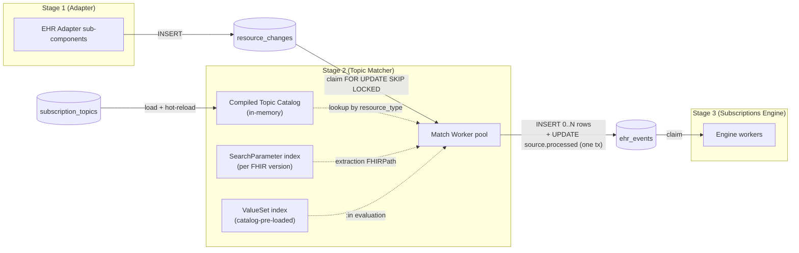

# Topic Matcher — Low-Level Design

## Purpose

The Topic Matcher is the Stage 2 component of the `fhir-ehr-subscriptions-service` pipeline. It reads `resource_changes` rows produced by the EHR adapter, evaluates each row against the active `SubscriptionTopic` catalog, and writes one `ehr_events` row per matching topic. This document specifies the internal structure of that worker: catalog load and pre-compile, the per-row claim and match, sandboxed evaluation of search-parameter expressions and FHIRPath, hot-reload semantics, and per-failure-mode handling. It is the implementation companion to `../high-level-design/domains/topic-matcher.md`, the architecture document's "Topic Matcher" section, and ADR `../high-level-design/decisions/0006-no-cql-no-regex.md`.

The LLD is implementation-language-neutral. Pseudo-code is async, single-language, ASCII. Names are notional; shapes, invariants, and failure envelopes are stable.

## Reader's Prerequisites

- `../high-level-design/domains/topic-matcher.md` — the canonical HLD-level description of the matcher's algorithm, supported expression subset, and what it does not do.
- `../architecture.md` — the "Topic Matcher" section, the seven-step matching algorithm, the cancel-and-replace behavior, and the `ehr_events` row shape.
- `../high-level-design/contracts/internal-tables.md` — `resource_changes` (input) and `ehr_events` (output) row shapes and transactional invariants.
- `../high-level-design/decisions/0006-no-cql-no-regex.md` — the explicit decision that only FHIR search-parameter expressions and FHIRPath are supported.
- HL7 R5 spec: `https://hl7.org/fhir/R5/subscriptiontopic.html` and `https://hl7.org/fhir/R5/search.html`.

## Placement



The matcher's only inputs are `resource_changes` rows and the in-memory compiled catalog. Its only output is `ehr_events` rows plus the in-transaction flip of the source row's `processed` flag. It does not call the EHR. It does not look at subscriptions. It does not touch `deliveries`.

## Catalog Data Structures

The catalog is a fully-pre-compiled, immutable, in-memory structure rebuilt atomically on every load. The match worker never parses an expression at runtime — every parse and compile happens at load time so a malformed topic surfaces to the operator before it ever sees a `resource_changes` row.

### Top-level catalog handle

```
struct CompiledCatalog {
    version: u64                                  // generation counter, bumps on each successful (re)load
    loaded_at: Timestamp
    by_resource_type: Map<ResourceType, [CompiledTopic]>
    by_event_code: Map<String, [CompiledTopic]>   // for SubscriptionTopic.eventTrigger
    valuesets: Map<CanonicalUrl, ValueSetIndex>   // pre-loaded membership for :in
    search_param_table: SearchParameterTable      // resolved per-resource-type extractions
    fhir_version: FhirVersion                     // fixes search-param semantics
    source_topic_count: u32
    rejected_topic_count: u32
}
```

### Per-topic compiled form

```
struct CompiledTopic {
    canonical_url: String                         // includes |version
    title: String                                 // for logs and metrics
    triggers: [CompiledResourceTrigger]
    event_triggers: [CompiledEventTrigger]
    notification_shape_hint: Json                 // denormalized _include / _revinclude (opaque to matcher)
}

struct CompiledResourceTrigger {
    resource_types: Set<ResourceType>             // resourceTrigger.resource (one or more)
    interactions: Set<Interaction>                // create | update | delete
    previous_criteria: Option<CompiledSearchExpression>
    current_criteria: Option<CompiledSearchExpression>
    require_both: bool                            // queryCriteria.requireBoth
    fhirpath_criteria: Option<CompiledFhirPath>
}

struct CompiledEventTrigger {
    event_codes: Set<String>                      // direct equality, no expression evaluation
    resource_types: Set<ResourceType>             // optional gate; some topics scope by resource type too
}
```

### Search-parameter expression — compiled AST

Each `queryCriteria` string parses into a small AST (one node per `&`-joined parameter). At parse time we resolve the parameter against the resource type's `SearchParameter` definition and reject anything outside the supported subset. The extraction FHIRPath is also compiled at this point so we never re-parse it.

```
struct CompiledSearchExpression {
    clauses: [CompiledSearchClause]               // implicit AND across clauses
}

struct CompiledSearchClause {
    parameter_name: String                        // e.g., "status", "subject", "code"
    parameter_type: SearchParamType               // token | reference | string | date | quantity | uri | composite
    modifier: Option<Modifier>                    // not | identifier | contains | missing | in
    comparator: Option<Comparator>                // eq | ne | gt | lt | ge | le (date)
    extraction_path: CompiledFhirPath             // resolved from SearchParameter.expression
    operand: ParsedOperand                        // typed value parsed once: Token, Reference, DateRange, ValueSet ref, etc.
}

enum ParsedOperand {
    Token { system: Option<String>, code: String }
    Reference { resource_type: Option<String>, id: String }
    StringLiteral(String)
    DateRange { lower: DateTime, upper: DateTime, comparator: Comparator }
    Missing(bool)
    InValueSet { canonical: CanonicalUrl }        // pre-resolved at load time to a ValueSetIndex pointer
}
```

### FHIRPath — compiled program

```
struct CompiledFhirPath {
    source: String                                // for diagnostics only; never re-parsed
    program: FhirPathProgram                      // bytecode-or-AST acceptable to the embedded evaluator
    references_previous: bool                     // true if expression contains %previous
    references_now_today: bool                    // for "stamp clock at start" optimization
}
```

### SearchParameter table

```
struct SearchParameterTable {
    by_resource_and_name: Map<(ResourceType, String), SearchParameterDef>
}

struct SearchParameterDef {
    name: String
    type_: SearchParamType
    expression: CompiledFhirPath                  // pre-compiled extraction FHIRPath
    target_types: Set<ResourceType>               // for reference parameters
}
```

Loaded from the FHIR core spec's `search-parameters.json` (per the catalog's declared FHIR version) plus any operator-supplied `SearchParameter` resources mounted in the topic catalog directory. Inline `SubscriptionTopic`-local search parameters are rejected at load per ADR 0006.

### ValueSet index

```
struct ValueSetIndex {
    canonical: CanonicalUrl
    members: Set<(System, Code)>                  // expanded once at load time
    expansion_source: ExpansionSource             // file | inline | terminology-server (operator-supplied)
}
```

Only `:in` against a ValueSet whose expansion is pre-loaded is supported. A topic referencing a ValueSet not in the index is rejected at load.

## Pseudo-Code

The matcher decomposes into eleven named functions sketching the algorithm rather than host idioms.

### `load_catalog` — startup and hot-reload entry point

```
async fn load_catalog(source: CatalogSource, current: Option<CompiledCatalog>) -> LoadResult {
    let raw_topics = source.read_all_active_topics()
    let valuesets  = source.read_all_valuesets()
    let sp_table   = build_search_parameter_table(source, source.fhir_version)

    let mut compiled = []
    let mut rejections = []

    let valuesets_index = build_valueset_index(valuesets)

    for raw in raw_topics {
        match compile_topic(raw, &sp_table, &valuesets_index) {
            Ok(t)  => compiled.push(t),
            Err(e) => {
                rejections.push(TopicRejection { url: raw.url, reason: e })
                emit_metric("fhir_subs_topic_matcher_topic_rejected_total", { topic: raw.url, kind: e.kind })
                log_error("topic rejected at load", raw.url, e)
            }
        }
    }

    let catalog = CompiledCatalog {
        version: current.map(|c| c.version + 1).unwrap_or(1),
        loaded_at: now(),
        by_resource_type: index_by_resource_type(&compiled),
        by_event_code:    index_by_event_code(&compiled),
        valuesets: valuesets_index,
        search_param_table: sp_table,
        fhir_version: source.fhir_version,
        source_topic_count:   raw_topics.len(),
        rejected_topic_count: rejections.len(),
    }

    LoadResult { catalog, rejections }
}
```

`compile_topic` walks each `resourceTrigger` and `eventTrigger`, parses search-parameter expressions, compiles each FHIRPath, and returns `Ok(CompiledTopic)` or a structured error naming the offending field. A failure aborts that topic only; the rest of the catalog still loads. Errors are operator-visible via metric and log; the SIGHUP-triggered reload writes a structured `ReloadReport` to stderr enumerating per-topic outcomes.

### `match_worker_loop` — the claim loop

```
async fn match_worker_loop(handle: CatalogHandle, db: Db, shutdown: ShutdownSignal) {
    while !shutdown.is_set() {
        let catalog = handle.snapshot()                           // atomic; never blocks on reload
        match db.begin_tx() {
            Ok(tx) => match claim_one(tx, &catalog) {
                Claimed(row, tx) => process_one(row, &catalog, tx).await,
                NoWork(tx)       => { tx.rollback(); wait_or_signal(shutdown).await }
                Error(e, tx)     => { tx.rollback(); backoff_on_db_error(e).await }
            }
            Err(e) => backoff_on_db_error(e).await
        }
    }
}

fn claim_one(tx: Tx, catalog: &CompiledCatalog) -> ClaimResult {
    let row = tx.query_one("
        SELECT id, resource_type, change_kind, resource, previous_resource,
               correlation_id, occurred_at, event_code, sequence
        FROM resource_changes
        WHERE processed = false
        ORDER BY sequence
        LIMIT 1
        FOR UPDATE SKIP LOCKED
    ")
    match row { Some(r) => Claimed(r, tx), None => NoWork(tx) }
}
```

The worker holds the source-row lock for all of `process_one`. The row claim, match evaluation, `ehr_events` writes, and source-row mark-processed are one transaction.

### `process_one` — the seven-step algorithm orchestrator

```
async fn process_one(row: ResourceChangeRow, catalog: &CompiledCatalog, tx: Tx) {
    let span = start_trace("topic_match", row.correlation_id, row.id)
    let timer = start_histogram("topic_match.evaluation_duration_seconds")

    let candidate_topics = catalog.by_resource_type.get(&row.resource_type).unwrap_or(&[])

    let mut emitted_rows: [EhrEventRow] = []

    for topic in candidate_topics {
        match evaluate_topic(topic, &row, catalog) {
            Match { reason } => {
                emitted_rows.push(build_ehr_event_row(topic, &row))
                emit_metric("fhir_subs_topic_matcher_matches_emitted_total", { topic: topic.canonical_url })
            }
            NoMatch         => {
                // most common case; no metric per call (would be too high-cardinality)
            }
            Skipped { kind } => {
                emit_metric("fhir_subs_topic_matcher_topic_skipped_total", { topic: topic.canonical_url, kind })
                if kind == "fhirpath_timeout" {
                    emit_metric("fhir_subs_topic_matcher_fhirpath_timeouts_total", { topic: topic.canonical_url })
                }
                // skip this topic for this row only; continue with next topic
            }
        }
    }

    // Event-code triggers (no expression evaluation) -- separate index lookup.
    if row.event_code.is_some() {
        for topic in catalog.by_event_code.get(row.event_code.unwrap()).unwrap_or(&[]) {
            if event_trigger_resource_type_gate(topic, &row) {
                emitted_rows.push(build_ehr_event_row(topic, &row))
                emit_metric("fhir_subs_topic_matcher_matches_emitted_total", { topic: topic.canonical_url, kind: "event" })
            }
        }
    }

    commit_with_source_row(tx, &row, emitted_rows)
    timer.observe()
    span.end()

    if emitted_rows.is_empty() {
        emit_metric("fhir_subs_topic_matcher_rows_dropped_no_match_total")
    }
}
```

### `evaluate_topic` — the seven steps as named gates

```
fn evaluate_topic(topic: &CompiledTopic, row: &ResourceChangeRow, catalog: &CompiledCatalog) -> EvalOutcome {
    for trigger in &topic.triggers {
        // Step 1 -- Resource-type gate
        if !resource_type_gate(trigger, row) { continue }

        // Step 2 -- Interaction gate
        if !interaction_gate(trigger, row)   { continue }

        // Step 3 -- Previous-state criteria
        let prev_outcome = evaluate_previous_criteria(trigger, row, catalog)
        if prev_outcome.is_skipped() { return Skipped(prev_outcome.kind) }

        // Step 4 -- Current-state criteria
        let curr_outcome = evaluate_current_criteria(trigger, row, catalog)
        if curr_outcome.is_skipped() { return Skipped(curr_outcome.kind) }

        // Step 5 -- Combine
        if !combine(prev_outcome.matched, curr_outcome.matched, trigger.require_both) { continue }

        // Step 6 -- FHIRPath criteria
        let fp_outcome = evaluate_fhirpath(trigger, row)
        if fp_outcome.is_skipped() { return Skipped(fp_outcome.kind) }
        if !fp_outcome.matched     { continue }

        // Step 7 -- Match
        return Match { reason: "trigger matched" }
    }
    NoMatch
}
```

### Step 1: `resource_type_gate`

```
fn resource_type_gate(trigger: &CompiledResourceTrigger, row: &ResourceChangeRow) -> bool {
    trigger.resource_types.contains(&row.resource_type)
}
```

Pre-applied at the catalog-handle level by indexing under `by_resource_type`. The explicit per-trigger check covers topics with multiple `resourceTrigger` entries scoped to different resource types.

### Step 2: `interaction_gate`

```
fn interaction_gate(trigger: &CompiledResourceTrigger, row: &ResourceChangeRow) -> bool {
    trigger.interactions.contains(&row.change_kind)
}
```

`create`, `update`, and `delete` are the only valid interactions per the spec. The merged cancel-and-replace case appears as `update` here — the matcher does not special-case it.

### Step 3: `evaluate_previous_criteria`

```
fn evaluate_previous_criteria(trigger: &CompiledResourceTrigger, row: &ResourceChangeRow, catalog: &CompiledCatalog) -> CriteriaOutcome {
    let expr = match &trigger.previous_criteria { Some(e) => e, None => return CriteriaOutcome::matched(true) }
    if row.previous_resource.is_none() {
        // Spec: previous criteria implicitly requires a prior resource. If the trigger requires
        // previous-state semantics and we have no prior, this trigger cannot match.
        return CriteriaOutcome::matched(false)
    }
    evaluate_search_expression(expr, &row.previous_resource.unwrap(), catalog)
}
```

### Step 4: `evaluate_current_criteria`

```
fn evaluate_current_criteria(trigger: &CompiledResourceTrigger, row: &ResourceChangeRow, catalog: &CompiledCatalog) -> CriteriaOutcome {
    let expr = match &trigger.current_criteria { Some(e) => e, None => return CriteriaOutcome::matched(true) }
    // For `delete`, `resource` carries the last-known body; matching against it is well-defined.
    evaluate_search_expression(expr, &row.resource, catalog)
}
```

### Step 5: `combine`

```
fn combine(prev_matched: bool, curr_matched: bool, require_both: bool) -> bool {
    if require_both { prev_matched && curr_matched } else { prev_matched || curr_matched }
}
```

When neither `previous_criteria` nor `current_criteria` is present, both halves trivially evaluate to `matched=true` and the combine returns `true` regardless of `require_both`. That matches the spec's "no criteria means the trigger fires on every interaction in scope."

### Step 6: `evaluate_fhirpath`

```
fn evaluate_fhirpath(trigger: &CompiledResourceTrigger, row: &ResourceChangeRow) -> FpOutcome {
    let prog = match &trigger.fhirpath_criteria { Some(p) => p, None => return FpOutcome::matched(true) }
    let ctx = FhirPathContext {
        root: &row.resource,
        previous: row.previous_resource.as_ref(),
        now: row.evaluation_clock,                  // stamped at start of process_one
        today: date_of(row.evaluation_clock),
        timeout: config.fhirpath_timeout,
        traversal_limit: config.fhirpath_traversal_limit,
    }
    match run_fhirpath(prog, ctx) {
        Ok(value)                   => FpOutcome::matched(value.to_bool()),
        Err(EvalError::Timeout)     => FpOutcome::skipped("fhirpath_timeout"),
        Err(EvalError::Traversal)   => FpOutcome::skipped("fhirpath_traversal_limit"),
        Err(EvalError::Runtime(_))  => FpOutcome::skipped("fhirpath_runtime"),
    }
}
```

A skip stops only this topic for this row. The match worker continues with the next topic.

### Step 7: `emit_ehr_events_rows` + `commit_with_source_row`

```
fn build_ehr_event_row(topic: &CompiledTopic, row: &ResourceChangeRow) -> EhrEventRow {
    EhrEventRow {
        // event_number is server-assigned by a sequence at INSERT time
        topic_url:               topic.canonical_url,
        change_kind:             row.change_kind,
        focus:                   reference_for(&row.resource_type, &row.resource),
        resource:                row.resource.clone(),
        previous_resource:       row.previous_resource.clone(),
        correlation_id:          row.correlation_id,
        occurred_at:             row.occurred_at,
        notification_shape_hint: topic.notification_shape_hint.clone(),
        resource_change_id:      row.id,
    }
}

fn commit_with_source_row(tx: Tx, row: &ResourceChangeRow, emitted_rows: [EhrEventRow]) {
    for er in &emitted_rows {
        tx.execute("
            INSERT INTO ehr_events (id, event_number, topic_url, change_kind, focus,
                resource, previous_resource, correlation_id, occurred_at,
                notification_shape_hint, resource_change_id)
            VALUES (uuid(), nextval('ehr_events_event_number_seq'), $1, $2, $3,
                    $4, $5, $6, $7, $8, $9)
        ", er)
    }
    tx.execute("
        UPDATE resource_changes
        SET processed = true, processed_at = now()
        WHERE id = $1
    ", row.id)
    tx.commit()
}
```

This is the transactional invariant from `internal-tables.md`: every matched-topic row for one source row plus the source-row's mark-processed, in one transaction. No commit lives between the inserts and the update, so partial fanout state cannot exist.

## Search-Parameter Expression Evaluator

`evaluate_search_expression` is small because all heavy work happens at compile time.

```
fn evaluate_search_expression(expr: &CompiledSearchExpression, resource: &Resource, catalog: &CompiledCatalog) -> CriteriaOutcome {
    for clause in &expr.clauses {
        let extracted = run_fhirpath_extract(&clause.extraction_path, resource)
        let matched = match clause.parameter_type {
            Token       => match_token(&extracted, &clause),
            Reference   => match_reference(&extracted, &clause),
            String      => match_string(&extracted, &clause),
            Date        => match_date(&extracted, &clause),
            Uri         => match_uri(&extracted, &clause),
            Quantity    => match_quantity(&extracted, &clause),
            Composite   => unreachable_topic_was_rejected_at_load(),
        }
        if !matched { return CriteriaOutcome::matched(false) }
    }
    CriteriaOutcome::matched(true)
}
```

### Per-type matching rules

```
fn match_token(values: &[Coding], clause: &CompiledSearchClause) -> bool {
    match clause.modifier {
        None | Some(Modifier::Eq) => values.any(|v| token_eq(v, clause.operand)),
        Some(Modifier::Not)       => !values.any(|v| token_eq(v, clause.operand)),
        Some(Modifier::Missing)   => values.is_empty() == clause.operand.as_missing(),
        Some(Modifier::In)        => {
            let vs = catalog.valuesets.get(clause.operand.as_in_url()).expect("validated at load")
            values.any(|v| vs.members.contains(&(v.system, v.code)))
        }
        _ => unreachable_topic_was_rejected_at_load(),
    }
}

fn match_reference(values: &[Reference], clause: &CompiledSearchClause) -> bool {
    let want = clause.operand.as_reference()
    match clause.modifier {
        None | Some(Modifier::Eq) => values.any(|v| reference_eq(v, want)),
        Some(Modifier::Identifier) => values.any(|v| identifier_eq(v.identifier, want.identifier)),
        Some(Modifier::Missing)    => values.is_empty() == clause.operand.as_missing(),
        _ => unreachable_topic_was_rejected_at_load(),
    }
}

fn match_string(values: &[String], clause: &CompiledSearchClause) -> bool {
    match clause.modifier {
        None                    => values.any(|v| v == clause.operand.as_str()),
        Some(Modifier::Contains) => values.any(|v| v.contains(clause.operand.as_str())),
        Some(Modifier::Missing)  => values.is_empty() == clause.operand.as_missing(),
        _ => unreachable_topic_was_rejected_at_load(),
    }
}

fn match_date(values: &[DateTime], clause: &CompiledSearchClause) -> bool {
    let range = clause.operand.as_date_range()
    let cmp   = clause.comparator.unwrap_or(Comparator::Eq)
    match clause.modifier {
        Some(Modifier::Missing) => values.is_empty() == clause.operand.as_missing(),
        _ => values.any(|v| compare_date(v, range, cmp))
    }
}
```

String comparison is case- and accent-insensitive using ICU root locale per [decisions/0010 #4](../high-level-design/decisions/0010-implementation-defaults.md); token, reference, date, and quantity comparisons follow the spec's per-type rules.

### Supported subset (recap)

- Token: `=`, `:not`, `:missing`, `:in`.
- Reference: `=`, `:identifier`, `:missing`.
- String: `=` (default — starts-with per spec normalized to equality on extracted token), `:contains`, `:missing`.
- Date: `eq`, `ne`, `gt`, `lt`, `ge`, `le`, `:missing`.
- Uri: `=` (exact).
- Quantity: `eq`, `ne`, `gt`, `lt`, `ge`, `le` (against the parameter's documented unit; cross-unit conversion is out of scope and is rejected at load).
- `:in` only against ValueSets pre-loaded into the catalog.

ValueSets are loaded from the directory at `topics.value_sets_dir` (default `/etc/fhir-subs/value-sets`) per [decisions/0010 #6](../high-level-design/decisions/0010-implementation-defaults.md). One FHIR `ValueSet` JSON file per resource. Loaded at startup and on SIGHUP, same as the topic catalog.

Anything else — chained references, `:above`/`:below`, `_text`/`_content`, inline `SearchParameter` definitions — is rejected at catalog-load with an operator-visible error per ADR 0006.

## FHIRPath Evaluator

One embedded evaluator serves two callers: search-parameter extraction (every clause) and `fhirPathCriteria` (the second-pass gate). Both run through the same sandbox.

### Sandbox rules

- **No I/O.** The evaluator is pure: no sockets, files, or shell-outs. The host evaluator must support this natively or be wrapped in a deny-list that blocks function calls outside the allow-list.
- **Wall-clock timeout.** Bounded by `config.fhirpath_timeout` (default 100 ms). Native deadline parameter when supported; otherwise a coroutine that the worker cancels. Returns `Err(Timeout)` on expiry.
- **Traversal limit.** Bounded by `config.fhirpath_traversal_limit` nodes (default 100,000). The evaluator tracks an instruction counter and aborts on exceedance with `Err(Traversal)`.
- **Allowed functions.** Standard FHIRPath minus side effects:
  - Allowed (clock-stamped): `now()` and `today()` return values stamped on `FhirPathContext` at the start of `process_one` so a single evaluation sees a stable clock.
  - Allowed: `where`, `select`, `exists`, `all`, `any`, `count`, `first`/`last`, `tail`, `skip`, `take`, `single`, `iif`, `is`, `as`, `ofType`, `repeat`, `aggregate`, arithmetic, comparison, boolean, string/quantity manipulation, `matches` (spec regex syntax; the evaluator-level timeout still bounds it).
  - Denied: any I/O, system clock outside `now()`/`today()`, env vars, randomness, external resolution (`%resolve`, `%context.resolve`, vendor extensions). Hitting the deny-list returns `Err(Runtime)`.
- **`%previous` variable.** Bound to `previous_resource` when present; yields empty when null. The compile-time `references_previous` flag lets the worker fast-fail `%previous` on a `create` row.

### Evaluator pseudo-code

```
fn run_fhirpath(prog: &CompiledFhirPath, ctx: FhirPathContext) -> Result<FhirPathValue, EvalError> {
    let deadline = monotonic_now() + ctx.timeout
    let counter  = TraversalCounter { used: 0, limit: ctx.traversal_limit }
    let env      = FhirPathEnv {
        root:     ctx.root,
        previous: ctx.previous,
        now:      ctx.now,
        today:    ctx.today,
        function_table: ALLOW_LISTED_FUNCTIONS,
    }
    evaluator.run(prog.program, env, deadline, counter)
}
```

The chosen library (Rust crate, Go library, HAPI in JVM) must support the deadline + counter contract. Where it does not, the matcher wraps it in a thread/coroutine with hard-kill on deadline; the counter is approximated by per-step instrumentation.

## Topic Catalog Hot-Reload

The catalog is read-mostly and immutable per generation. Reload trigger: `SIGHUP` only ([decisions/0008](../high-level-design/decisions/0008-resolved-design-questions.md) — there is no admin API). Pattern: **swap-the-handle, drain-the-readers**.

```
struct CatalogHandle {
    inner: AtomicArc<CompiledCatalog>             // load is a single atomic pointer load
}

impl CatalogHandle {
    fn snapshot(&self) -> Arc<CompiledCatalog> {
        self.inner.load()                         // bumps the Arc refcount; never blocks
    }

    fn replace(&self, new_catalog: Arc<CompiledCatalog>) -> Arc<CompiledCatalog> {
        self.inner.swap(new_catalog)              // returns the prior catalog Arc
    }
}
```

### Reload sequence

```
async fn reload(handle: &CatalogHandle, source: CatalogSource) -> ReloadOutcome {
    let current = handle.snapshot()
    let LoadResult { catalog, rejections } = load_catalog(source, Some(&*current)).await

    if catalog.source_topic_count > 0 && catalog.compiled_topic_count() == 0 {
        // Defensive: an empty catalog with non-zero topics in source means every topic was rejected.
        // Refuse the swap and keep serving with the prior catalog. Surface the rejections.
        return ReloadOutcome::Refused { rejections, kept_version: current.version }
    }

    let new_arc = Arc::new(catalog)
    let prior   = handle.replace(new_arc.clone())
    emit_metric("fhir_subs_topic_matcher_topics_active", { count: new_arc.compiled_topic_count() })
    emit_metric("fhir_subs_topic_matcher_catalog_reloads_total", { outcome: "success" })
    ReloadOutcome::Applied { rejections, prior_version: prior.version, new_version: new_arc.version }
}
```

### Drain-the-readers semantics

Each worker takes a snapshot at the top of its claim-loop iteration. A worker mid-evaluation against generation N holds an `Arc` to that catalog and runs to completion against it; the next iteration picks up generation N+1.

In-flight matches are never dropped by a reload. A topic removed by reload is still evaluated for any row a worker selected against generation N; its `ehr_events` row, if produced, is durable. Subscribers to a removed topic stop receiving new events as soon as the engine sees no further rows for it. A topic added by reload begins evaluation only on rows claimed after the swap.

Two generations briefly coexist in memory (prior + new) — the price of zero-pause reload. The prior catalog frees once all in-flight workers complete their iteration.

### Validation before swap

A reload yielding a catalog where every topic was rejected (typically a misconfigured mount) is refused; the prior catalog continues serving. Partial rejections are applied: surviving topics replace the prior generation; rejected canonical URLs are surfaced via metrics and the SIGHUP `ReloadReport` written to stderr. A topic referencing a missing `SearchParameter` or `ValueSet` is rejected at compile and never becomes active.

## Failure Modes

Each named failure has a single specified handling path. The matcher is fail-soft on per-topic-per-row errors, fail-loud on systemic errors.

### Malformed topic at catalog load

- **Detection:** `compile_topic` returns `Err` for any of: search-parameter parse failure (unknown parameter, unsupported modifier), reference to a missing `SearchParameter`, an out-of-subset feature (chained reference, `:above`/`:below`, `_text`), uncompilable FHIRPath, or an `eventTrigger` violating the catalog's constraints.
- **Handling:** topic is excluded from the new generation. `fhir_subs_topic_matcher_topic_rejected_total` increments labeled with URL and reason; an error log entry is written. Prior catalog keeps serving until the operator fixes the source.
- **Operator visibility:** rejections are exposed via the SIGHUP-triggered `ReloadReport` (stderr) and Prometheus. Operators alert on `fhir_subs_topic_matcher_topic_rejected_total > 0`.

### FHIRPath timeout or runtime error

- **Detection:** `run_fhirpath` returns `Err(Timeout)`, `Err(Traversal)`, or `Err(Runtime)`.
- **Handling:** the topic is skipped for this row only. `fhir_subs_topic_matcher_fhirpath_timeouts_total` (timeout) or `fhir_subs_topic_matcher_topic_skipped_total{kind=...}` (other classes) increments per topic. A debug log records the topic, row id, and error class (the source FHIRPath is in the catalog, not the log). Other topics for the same row keep evaluating; the source row commits normally with whatever matches were produced.
- **Persistent topic-level failure:** topics exceeding an operator-defined timeout/error rate (e.g., > 10% over 5 minutes) surface on the dashboard for review. The matcher does not auto-disable a topic — that's an operator call.

### Search-parameter extraction error

- **Detection:** `run_fhirpath_extract` returns an error. Rare; the extraction FHIRPath is the spec-defined `SearchParameter.expression` and is compiled at load. Failures here are evaluator bugs or malformed resource bodies.
- **Handling:** treated as FHIRPath runtime error — skip the topic for this row, increment `fhir_subs_topic_matcher_topic_skipped_total{kind="search_param_extract"}`, debug-log. Other topics keep evaluating.
- **Defense in depth:** extraction runs under the same sandbox (timeout + traversal limit) as `fhirPathCriteria`.

### DB write failure

- **Detection:** `commit_with_source_row` returns a database error (connection lost, unique-constraint violation on `event_number`, deadlock, transaction abort).
- **Handling:** the transaction rolls back. The source row stays `processed = false` and re-enters the claim queue. No `ehr_events` rows are written. The matcher backs off (exponential + jitter) and retries.
- **Persistent DB outage:** the matcher keeps retrying. Liveness (`/healthz`) is unaffected; readiness (`/readyz`) flips to unready (per the lifecycle domain). Work resumes from durable state when the DB returns. No data is lost.

### Worker crash mid-evaluation

- **Detection:** the worker process dies between claim and commit.
- **Handling:** Postgres rolls back on connection loss. The source row's `processed` flag stays false. Another worker re-claims via `FOR UPDATE SKIP LOCKED` and re-evaluates. No partial fanout state — there is no commit before the final one.

### Catalog generation mismatch (in-flight evaluation against a removed topic)

Not a failure; called out for clarity. A worker holding an `Arc` to a superseded catalog finishes its iteration; the next iteration sees the new generation. No special bookkeeping.

### `previous_resource = null` plus a `previous_criteria`-bearing topic

Step 3 returns `matched=false`. Step 5 combines: with `requireBoth=true` the trigger does not match; with `requireBoth=false` the trigger matches on current criteria alone. Per spec, "either suffices."

## Configuration Knobs

All knobs are operator-tunable via the configuration file or environment variables. Defaults are conservative.

| Knob | Default | Purpose |
|---|---|---|
| `topic_matcher.fhirpath_timeout` | `100ms` | Wall-clock budget per FHIRPath evaluation. |
| `topic_matcher.fhirpath_traversal_limit` | `100000` | Max evaluator steps / nodes touched per call. |
| `topic_matcher.worker_pool_size` | `4` | Number of concurrent match workers. |
| `topic_matcher.claim_batch_size` | `1` | Rows claimed per transaction (kept at 1 for the cancel-and-replace and ordering invariants; tunable upward only with care). |
| `topic_matcher.idle_poll_interval` | `200ms` | Delay between empty `NoWork` claims; in-memory wakeup signal preempts. |
| `topic_matcher.db_backoff_initial` | `100ms` | Backoff on transient DB errors. |
| `topic_matcher.db_backoff_max` | `5s` | Cap on transient DB error backoff. |
| `topic_matcher.catalog_source` | `built-in + ${topics.catalog_dir}` | Where the catalog is loaded from. |
| `topic_matcher.reload_signals` | `["sighup"]` | Which signals trigger hot-reload. |
| `topic_matcher.metric_label_cardinality_cap` | `2000` | Max distinct topic URLs in metric labels (defense against catalog explosion). |

`worker_pool_size` is the pragmatic concurrency knob. Each worker holds its own DB connection and runs the claim loop independently; `FOR UPDATE SKIP LOCKED` makes contention safe.

## Metrics

All Prometheus-compatible. Labels are low-cardinality (topic URL is canonical and bounded; no row-level labels).

| Metric | Type | Labels | Meaning |
|---|---|---|---|
| `fhir_subs_topic_matcher_topics_active` | gauge | — | Number of active topics in the current catalog generation. Updated on reload. |
| `fhir_subs_topic_matcher_catalog_version` | gauge | — | Monotonic generation counter; lets dashboards correlate behavior changes with reloads. |
| `fhir_subs_topic_matcher_topic_rejected_total` | counter | `topic_url`, `reason` | Topic-load rejections. Operator alerts wire here. |
| `fhir_subs_topic_matcher_catalog_reloads_total` | counter | `outcome` | `success` / `refused` / `error`. |
| `fhir_subs_topic_matcher_matches_emitted_total` | counter | `topic_url`, `kind` | One increment per `ehr_events` row written. `kind` is `resource` or `event`. |
| `fhir_subs_topic_matcher_rows_dropped_no_match_total` | counter | — | Source rows that produced zero `ehr_events` rows. |
| `fhir_subs_topic_matcher_rows_processed_total` | counter | — | Source rows committed (any number of `ehr_events`, including zero). |
| `fhir_subs_topic_matcher_topic_skipped_total` | counter | `topic_url`, `kind` | Per-topic skip with cause class (`fhirpath_timeout`, `fhirpath_traversal_limit`, `fhirpath_runtime`, `search_param_extract`). |
| `fhir_subs_topic_matcher_fhirpath_timeouts_total` | counter | `topic_url` | Hoisted out of `topic_skipped_total` because operators care about it specifically. |
| `fhir_subs_topic_matcher_evaluation_duration_seconds` | histogram | — | End-to-end `process_one` wall-clock. Buckets tuned around the `fhirpath_timeout` default. |
| `fhir_subs_topic_matcher_fhirpath_evaluation_duration_seconds` | histogram | `topic_url` | Just the FHIRPath portion; helps spot expensive topics. |
| `fhir_subs_topic_matcher_db_errors_total` | counter | `kind` | `claim`, `insert`, `commit`, etc. |
| `fhir_subs_topic_matcher_lag_seconds` | gauge | — | `now() - oldest unprocessed resource_changes.received_at`. The single most important latency indicator. |

`metric_label_cardinality_cap` enforces a hard ceiling on `topic_url` label cardinality; topics beyond the cap collapse into `"<other>"` so a misconfigured catalog cannot blow out Prometheus.

## Test Plan

Three tiers, each with its own failure-mode envelope.

### Unit tests — each step in isolation

One test module per named function. Each test feeds a hand-built input and asserts the output.

- `resource_type_gate`: single-type and multi-type triggers, mismatched type, no-allocation on negative path.
- `interaction_gate`: each interaction; unsupported interactions treated as not-in-set.
- `evaluate_previous_criteria`: `previous_resource = null`, present-non-match, present-match; missing-prior with `requireBoth=true` yields no match in `combine`.
- `evaluate_current_criteria`: each search-parameter type (token, reference, string, date, uri, quantity), each modifier (`:not`, `:contains`, `:identifier`, `:missing`, `:in`).
- `combine`: truth table over `(prev, curr, require_both)`.
- `evaluate_fhirpath`: passing returns matched; timeout, traversal, and runtime errors return skipped; `now()` / `today()` return stamped values; `%previous` empty when null.
- `build_ehr_event_row`: every field correctly populated; `notification_shape_hint` denormalized as expected.
- `commit_with_source_row`: atomicity verified by simulating an `ehr_events` insert failure and checking the source row remains `processed = false`.
- `compile_topic`: each rejection class with named fixtures (chained reference, `:above`, `_text`, unknown parameter, missing ValueSet, malformed FHIRPath).
- `load_catalog`: one bad topic does not block the rest; a fully-bad catalog refuses the swap.

### Conformance tests — every spec-defined topic shape

The harness loads each shape from the R5 SubscriptionTopic spec's examples plus the project's published catalog and runs canonical positive/negative `resource_changes` fixtures. Asserts:

- Positive fixtures produce exactly one `ehr_events` row per spec-expected match; negative fixtures produce zero.
- Transition triggers (`status=active` → `status=cancelled`) match only when both halves satisfy.
- Event-trigger topics match on event-code equality and ignore the search-parameter pipeline.
- A topic whose FHIRPath is `Observation.valueQuantity.value > Observation.referenceRange.first().high.value` matches the positive fixture and not the negative.

Run in CI on every commit. New spec releases typically bring new fixtures, not new evaluator code.

### Property tests — invariants under randomized input

- **Idempotency under retry.** For a fixed `(catalog, row)`, replaying the same source row produces the same `ehr_events` set. Upstream `(adapter_id, correlation_id)` uniqueness plus deterministic compile makes this hold.
- **Zero/one/many.** Random catalogs and rows produce a count of `ehr_events` equal to the count of topics whose evaluator returned `Match`.
- **Source-row atomicity.** A randomly-injected DB failure inside `commit_with_source_row` either commits both inserts and update or neither.
- **Hot-reload preserves in-flight evaluations.** A worker mid-evaluation against generation N produces the same output as without a concurrent reload.
- **Sandbox holds.** Aggressive-allocation or looping FHIRPath is bounded by timeout and traversal limit; the worker recovers.

A separate fuzz harness feeds malformed `SubscriptionTopic` resources to `compile_topic` and asserts no panics, structured rejection reasons, and bounded compile time.

## Open Questions

- **FHIRPath library choice.** The HLD does not name the evaluator. Candidates depend on language (Rust crate, Go library, HAPI on JVM). The library must support a deadline parameter or be wrappable in a hard-kill coroutine. Stretch: ship a minimal evaluator if nothing meets the sandbox bar.
- **Quantity unit conversion.** The LLD rejects cross-unit `Quantity` matching at load. Real-world topics may want UCUM-aware comparison (mg/dL vs. mmol/L). Defer to a follow-up ADR.
- **`:in` against operator-supplied terminology server.** Currently the LLD pre-loads ValueSets. A bounded-cache external-server option is possible. Defer.
- **Evaluator memoization across workers.** A hot resource type may re-evaluate the same FHIRPath repeatedly. Memoization keyed on resource hash adds cache invalidation; defer until a workload demands it.
- **Per-topic `worker_pool_size`.** A global pool may be unfair to expensive topics. Per-topic sharding is conceivable but premature.
- **`event_number` allocation.** A Postgres sequence is the simple choice; under high contention a sharded sequence or table-partitioned scheme may be needed. The storage domain owns the answer; the matcher only requires per-deployment monotonicity.
- **Catalog reload race with high-volume claim loop.** The atomic-handle swap is wait-free for readers, but a catalog with millions of compiled programs may have a noticeable build cost. Background-build-then-swap is intended; a degenerate catalog mount may need out-of-band validation before SIGHUP. Defer to operations docs.

## What This LLD Does NOT Cover

- **Adapter (Stage 1) details.** Writes to `resource_changes`, cancel-and-replace correlation in `pending_pairs`, vendor-specific HL7 lex/map/validate — owned by `../high-level-design/domains/ehr-adapter.md`.
- **Subscriptions Engine (Stage 3).** Reading `ehr_events`, evaluating `Subscription.filterBy`, re-checking authorization, writing `deliveries` — owned by `../high-level-design/domains/subscriptions-engine.md`. The `core/filter` evaluator is shared; its Stage-3 use is not this document's concern.
- **Notification Builder (Stage 4).** Consuming `notification_shape_hint`, assembling Bundles, hydration callbacks — separate LLD.
- **Topic catalog domain.** How topics are sourced (built-in / operator-mounted / adapter-contributed), how `subscription_topics` is read, canonical versioning across releases — owned by `../high-level-design/domains/topics.md`. The matcher consumes the loaded catalog; it does not own it.
- **Storage schema details.** Indexes on `resource_changes` and `ehr_events`, partitioning, retention, vacuum — owned by the storage domain.
- **Subscription lifecycle.** Subscription CRUD, handshake, status transitions — engine concerns.
- **`$events` historical replay.** The matcher writes the log; how `$events` reads it is the API surface's concern. The shared `core/filter` evaluator means a bug fix applies uniformly to live and replay paths.
- **CapabilityStatement publication.** The loaded topic set is exposed via `/metadata`; the publication path lives in `api/http-fhir`.
- **Multi-version FHIR.** The matcher operates on the R5-shaped internal model. Version translation is the version-shim's job; the catalog's `fhir_version` field selects the right SearchParameter table.
- **Operational alerting policy.** Metrics catalog is here; alerts are deployment-specific (observability domain).
- **Cancel-and-replace correlation.** Pairing logic is in the adapter and `pending_pairs`. The matcher sees the merged `update` row and treats it like any other update.
