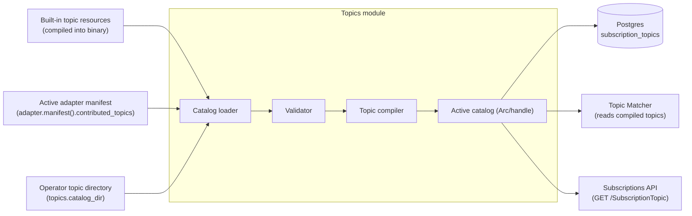

# Topics Catalog — Low-Level Design

**Purpose.** Implementation-level design of the `SubscriptionTopic` catalog: how the three sources (built-in, adapter-contributed, operator-supplied) are loaded at startup, how individual topic resources are pre-compiled into the structure the Topic Matcher actually evaluates, how `(url, version)` identity is preserved across hot-reload, how operator-supplied content is validated, and what the catalog exposes to the Subscriptions API.

The load-bearing invariants are: every topic the Matcher evaluates is fully compiled (no JSON parsing, no FHIRPath compilation, no SearchParameter lookup on the hot path); two sources contributing the same `(url, version)` resolve deterministically; and a hot-reload that fails partially leaves the running catalog unchanged for the failed source while accepting the parts that succeeded.

**Reader's prerequisites.** Read [../high-level-design/domains/topics.md](../high-level-design/domains/topics.md), [../high-level-design/domains/topic-matcher.md](../high-level-design/domains/topic-matcher.md), [../high-level-design/contracts/internal-tables.md](../high-level-design/contracts/internal-tables.md) (the `subscription_topics` row contract), and `../architecture.md` (sections "Topic catalog" under "Other Spec Requirements" and "Topic Matcher"). The R5 spec at [`https://hl7.org/fhir/R5/subscriptiontopic.html`](https://hl7.org/fhir/R5/subscriptiontopic.html) is canonical for field semantics.

## 1. Component placement



The catalog is one module owned by the topics domain. Built-in resources are compiled into the binary; adapter-contributed resources are returned by the active adapter's `manifest()`; operator-supplied resources are read from a config-mounted directory. All three flow through the same loader, validator, and compiler. The output is a single immutable in-memory structure (the **active catalog**), referenced by the Topic Matcher and the Subscriptions API. The Postgres `subscription_topics` table is the durable mirror — every active topic is persisted so a `GET /SubscriptionTopic` query against a fresh process before catalog load completes is impossible (the startup probe gates traffic until load completes).

The seam between the catalog and the Topic Matcher is the active-catalog handle, swapped atomically on hot-reload. The Matcher never reads the table directly.

## 2. Module layout

The catalog module is decomposed into the following sub-modules. Names are notional.

- `loader` — orchestrates load from the three sources in priority order, applies conflict resolution, hands the merged set to the validator.
- `sources/builtin` — exposes the compiled-in topic resources (their JSON bodies are embedded as static byte arrays at build time).
- `sources/adapter` — calls `adapter.manifest().contributed_topics` once at startup and on adapter restart; expects a list of `SubscriptionTopic` JSON resources.
- `sources/opdir` — reads `topics.catalog_dir` from the validated configuration; enumerates `*.json` and `*.yaml` files in deterministic (sorted) order.
- `validator` — shape validation (R5 `SubscriptionTopic` profile), resource-type validity (every `resourceTrigger.resource` is a known FHIR resource type), search-parameter validity (every parameter named in `queryCriteria.previous` / `queryCriteria.current` resolves against the relevant resource type's published `SearchParameter`), FHIRPath compilation (every `fhirPathCriteria` parses and compiles).
- `compiler` — pre-compiles a validated topic into the in-memory `CompiledTopic` struct used by the Matcher: parsed search-parameter expressions, compiled FHIRPath ASTs, denormalized `notification_shape_hint`, normalized `(url, version)` key, derived `canFilterBy` index.
- `registry` — owns the active catalog. Exposes a read-only handle (`ActiveCatalog`) used by the Matcher and the API. The handle is swapped atomically on reload.
- `persistor` — writes the active catalog to `subscription_topics` whenever it changes, in a single transaction. Reconciles "rows present in DB but no longer active" by transitioning them to `retired` rather than deleting (deletion would break `$events` historical replay against subscriptions still pinned to that version).
- `reload_controller` — listens for SIGHUP; serializes reload requests so two concurrent reloads cannot interleave.
- `api_handlers` — REST handlers for `GET /SubscriptionTopic` and `GET /SubscriptionTopic/{id}`.
- `metrics` — counters and gauges for catalog size, load failures per source, retired-version count, reload duration.
- `config_types` — strongly-typed config structs derived from the `topics.*` block of the YAML config.

## 3. Public surface

The catalog exposes exactly the following to the rest of the service.

```
struct TopicsCatalog {
    // Constructed once at startup; reload_controller drives mutations.
}

impl TopicsCatalog {
    // Run the full load pipeline (sources -> validator -> compiler -> persistor),
    // return when the active catalog is populated. Called from the lifecycle
    // module's startup sequence; the startup probe waits for this to return.
    async fn start(config: TopicsConfig, ctx: TopicsContext) -> Result<TopicsCatalog>;

    // Hand a read-only snapshot to the Matcher. Cheap (Arc clone or equivalent).
    fn active(&self) -> ActiveCatalog;

    // Trigger a hot-reload. Idempotent and serialized; concurrent calls coalesce.
    async fn reload(&self, trigger: ReloadTrigger) -> ReloadReport;

    // Shutdown does nothing structural; the catalog has no background workers.
    async fn shutdown(&self) -> ();
}

struct ActiveCatalog {
    // Read-only handle to a CompiledCatalog (Arc/Rc/handle). All access is
    // by canonical-URL+version key or whole-list iteration.
    fn get(url: String, version: Option<String>) -> Option<CompiledTopic>;
    fn iter_active() -> Iterator<CompiledTopic>;
    fn capability_summary() -> CapabilitySummary;  // for /metadata
}
```

`TopicsContext` is the dependency bundle: a Postgres pool, the active adapter handle, the metrics emitter, the structured logger, the clock. Every dependency is injected.

The Subscriptions API mounts `api_handlers` to serve `GET /SubscriptionTopic` queries. The lifecycle module wires `reload_controller` into the SIGHUP signal handler. Nothing else is public; in particular, no other component writes `subscription_topics` rows.

## 4. Compiled-topic data structure

A topic JSON is parsed once at load time and never re-parsed. The compiled form is the structure the Matcher consumes.

```
struct CompiledTopic {
    // Identity
    canonical_url: String,           // e.g. "http://fhir-ehr-subscriptions-service.org/topics/order-changed"
    version: String,                 // e.g. "1.0.0"
    title: String,                   // human-readable
    status: TopicStatus,             // active | draft | retired

    // Provenance — which source contributed this version
    source: TopicSource,             // BuiltIn | Adapter(adapter_id) | Operator(file_path)

    // Triggers — pre-compiled, one per resourceTrigger entry in the JSON
    resource_triggers: List<CompiledResourceTrigger>,
    event_triggers: List<CompiledEventTrigger>,

    // Notification shape — denormalized for the Notification Builder
    notification_shape: NotificationShape,

    // Filter whitelist — what subscribers may filter on
    can_filter_by: Map<String, CompiledFilterParameter>,

    // Original FHIR resource body — kept for serving GET /SubscriptionTopic
    // exactly as authored.
    raw_resource_json: Bytes,
}

struct CompiledResourceTrigger {
    resource_type: String,                       // e.g. "ServiceRequest"
    supported_interactions: Set<Interaction>,    // {Create, Update, Delete}

    // queryCriteria.previous compiled into a typed predicate.
    // None means "no predicate" (always matches).
    previous_predicate: Option<CompiledSearchParamPredicate>,
    current_predicate: Option<CompiledSearchParamPredicate>,
    require_both: bool,

    // fhirPathCriteria compiled to a FHIRPath AST + a node budget.
    fhirpath_predicate: Option<CompiledFhirPath>,
}

struct CompiledSearchParamPredicate {
    // A list of (parameter, modifier, comparator, value, extractor_fhirpath)
    // tuples. extractor_fhirpath is the FHIRPath the matcher runs against the
    // resource to obtain the parameter value (sourced from the resource type's
    // published SearchParameter definition at compile time).
    clauses: List<SearchParamClause>,
}

struct CompiledFhirPath {
    expression_text: String,         // for log/error messages
    compiled_ast: FhirPathAst,       // opaque to the catalog; produced by the
                                     // shared FHIRPath compiler in `engine/filter`
}

struct NotificationShape {
    includes: List<IncludeDirective>,    // _include
    rev_includes: List<IncludeDirective>, // _revinclude
}

enum TopicSource {
    BuiltIn,
    Adapter(adapter_id: String),
    Operator(file_path: String),
}
```

The compiled topic carries everything the Matcher needs in pre-evaluated form. No string parsing on the hot path.

## 5. Pseudo-code

### 5.1 `load_catalog` — full load pipeline

The orchestrator. Runs at startup and on every hot-reload.

```
async fn load_catalog(config, ctx) -> CompiledCatalog {
    // 1. Gather raw resources from all three sources, in priority order.
    //    Lower priority is loaded first so higher priority can override.
    let raw_builtin = sources::builtin::all_resources()
    let raw_adapter = ctx.adapter.manifest().contributed_topics
    let raw_operator = sources::opdir::scan(config.catalog_dir)

    // 2. Apply conflict resolution per (url, version) key.
    //    Operator beats adapter beats built-in.
    let merged = merge_by_priority(
        builtin = raw_builtin,
        adapter = raw_adapter,
        operator = raw_operator,
    )

    // 3. Validate and compile each merged entry. Failures are isolated
    //    per topic — one bad operator file does not abort the load.
    let report = ValidationReport::new()
    let compiled = []
    for entry in merged {
        match validator::validate(entry.resource) {
            Ok(validated) => match compiler::compile(validated, entry.source) {
                Ok(ct) => compiled.push(ct),
                Err(e) => report.compile_failure(entry, e),
            },
            Err(e) => report.validate_failure(entry, e),
        }
    }

    // 4. Reconcile against persistent `subscription_topics`:
    //    insert new (url, version) rows, update non-semantic fields on
    //    existing rows, transition rows whose (url, version) is no longer
    //    contributed by any source to `retired` (do NOT delete).
    persistor::reconcile(ctx.pg, compiled).await

    // 5. Build the immutable in-memory catalog and return it.
    //    The caller atomically swaps it into the registry.
    let catalog = CompiledCatalog::from_topics(compiled)

    metrics::record_load_report(&report)
    ctx.logger.info("catalog loaded", topics = compiled.len(), failures = report.failure_count())

    return catalog
}
```

The orchestrator never throws on a per-topic failure. It throws only when the merged set is empty (no usable topics on the deployment is treated as a misconfiguration) or when the persistor cannot write to Postgres (a startup blocker).

### 5.2 `compile_topic` — JSON to `CompiledTopic`

```
fn compile_topic(resource_json, source) -> Result<CompiledTopic> {
    let parsed = parse_subscription_topic(resource_json)?

    // Identity
    let url = parsed.url.require()
    let version = parsed.version.require()
    let title = parsed.title.unwrap_or(url.clone())
    let status = parse_status(parsed.status)

    // Resource triggers
    let resource_triggers = []
    for rt in parsed.resource_trigger {
        let resource_type = rt.resource.require()
        let supported = parse_interactions(rt.supported_interaction)

        // Compile previous and current search-parameter predicates by parsing
        // the spec-form expression and resolving each parameter name against
        // the resource type's published SearchParameter set. This is where
        // a malformed or unsupported parameter throws.
        let previous = if rt.query_criteria.previous.is_some() {
            Some(compile_search_param_predicate(resource_type, rt.query_criteria.previous)?)
        } else { None }

        let current = if rt.query_criteria.current.is_some() {
            Some(compile_search_param_predicate(resource_type, rt.query_criteria.current)?)
        } else { None }

        let require_both = rt.query_criteria.require_both.unwrap_or(false)

        // Compile fhirPathCriteria via the shared compiler. A compile error
        // here is a topic-load failure for THIS topic only.
        let fhirpath = if rt.fhir_path_criteria.is_some() {
            Some(engine::filter::fhirpath_compile(rt.fhir_path_criteria)?)
        } else { None }

        resource_triggers.push(CompiledResourceTrigger {
            resource_type, supported_interactions = supported,
            previous_predicate = previous, current_predicate = current,
            require_both, fhirpath_predicate = fhirpath,
        })
    }

    // Event triggers — direct equality on event_code; no expression compile.
    let event_triggers = parsed.event_trigger.map(parse_event_trigger)

    // Notification shape — denormalize _include / _revinclude for the builder.
    let notification_shape = compile_notification_shape(parsed.notification_shape)

    // canFilterBy whitelist — index by parameter name for quick lookup at
    // Subscription create time.
    let can_filter_by = compile_can_filter_by(parsed.can_filter_by)

    return Ok(CompiledTopic {
        canonical_url = url, version, title, status, source,
        resource_triggers, event_triggers,
        notification_shape, can_filter_by,
        raw_resource_json = resource_json,
    })
}
```

### 5.3 `validate_topic` — pre-compile shape and reference checks

The validator runs before the compiler. It rejects content the compiler would accept but the Matcher could not honor at runtime.

```
fn validate_topic(parsed) -> Result<Validated> {
    // 1. Shape: required fields per the R5 SubscriptionTopic profile.
    require(parsed.url, "SubscriptionTopic.url is required")
    require(parsed.version, "SubscriptionTopic.version is required (this server pins (url, version))")
    require(parsed.status, "SubscriptionTopic.status is required")
    require_one_of(parsed.resource_trigger.is_present() || parsed.event_trigger.is_present(),
                   "at least one trigger is required")

    // 2. Resource-type validity: every resourceTrigger.resource is a known
    //    FHIR resource type (per the version we serve internally — R5).
    for rt in parsed.resource_trigger {
        require(is_known_fhir_resource_type(rt.resource),
                "unknown FHIR resource type: " + rt.resource)
    }

    // 3. Search-parameter validity: every parameter named in queryCriteria
    //    resolves against the resource type's published SearchParameter set
    //    AND uses only the SUBSET this server supports.
    for rt in parsed.resource_trigger {
        for expr in [rt.query_criteria.previous, rt.query_criteria.current] {
            if expr.is_present() {
                let parsed_expr = parse_search_param_expression(expr)
                for clause in parsed_expr.clauses {
                    let sp = lookup_search_parameter(rt.resource, clause.name)
                    require(sp.is_some(), "unknown search parameter: " + clause.name)
                    require(is_supported_subset(sp, clause.modifier, clause.comparator),
                            "unsupported search-parameter feature: " + clause.modifier)
                }
            }
        }
    }

    // 4. FHIRPath compilation: parse and compile every fhirPathCriteria.
    //    A compile error here halts validation for this topic.
    for rt in parsed.resource_trigger {
        if rt.fhir_path_criteria.is_some() {
            engine::filter::fhirpath_compile(rt.fhir_path_criteria)?
        }
    }

    // 5. notificationShape validity: every _include / _revinclude resolves
    //    against the trigger's resource type.
    validate_notification_shape(parsed.notification_shape, parsed.resource_trigger)?

    // 6. canFilterBy validity: every entry references a real search parameter
    //    (this is what `Subscription.filterBy` is allowed to use).
    for cfb in parsed.can_filter_by {
        require(lookup_search_parameter(cfb.resource, cfb.filter_parameter).is_some(),
                "canFilterBy references unknown search parameter")
    }

    return Ok(Validated { parsed })
}
```

The error type carries enough information for the operator-visible failure log to identify the topic, source file, and offending field.

### 5.4 `hot_reload` — atomic catalog swap

```
async fn hot_reload(catalog: TopicsCatalog, trigger: ReloadTrigger) -> ReloadReport {
    // Serialize concurrent reload requests through a mutex; coalesce
    // SIGHUP storms into one reload.
    let _guard = catalog.reload_lock.acquire().await

    // 1. Re-run the full load pipeline producing a candidate catalog.
    let candidate = match load_catalog(catalog.config, catalog.ctx).await {
        Ok(c) => c,
        Err(fatal) => return ReloadReport::failed(fatal),
    }

    // 2. Compute the diff between the active catalog and the candidate.
    let diff = diff_catalogs(catalog.active(), candidate)
    //    diff.added: topics newly active
    //    diff.changed: topics whose (url, version) was active before but
    //                  whose source or non-semantic fields changed
    //    diff.removed: (url, version) pairs no longer contributed by any source

    // 3. Atomically swap the active catalog.
    //    The swap is one pointer write into the Arc cell; readers see either
    //    the old or the new whole catalog, never a half-applied state.
    catalog.registry.swap(candidate)

    // 4. Retire (url, version) pairs no longer contributed.
    //    We do not delete rows — see retire_unused_versions below.
    for removed in diff.removed {
        match retire_unused_versions(catalog.ctx.pg, removed) {
            Retired => metrics::topics_retired.inc(),
            HasReferences => metrics::topics_held_by_subscriptions.inc(),
        }
    }

    return ReloadReport::ok(diff)
}
```

The swap is the only mutation to the active catalog. The Topic Matcher reads `ActiveCatalog` once at the start of each row's evaluation, so a reload mid-evaluation cannot tear: the row finishes against the old catalog and the next row uses the new one. Both behaviors are correct because every active topic is fully self-contained — the Matcher does not maintain cross-row catalog state.

### 5.5 `retire_unused_versions` — safe garbage collection

```
fn retire_unused_versions(pg, url_version) -> RetireOutcome {
    // A topic version may still be referenced by an active subscription
    // pinned to that version. Retiring it must not break those subscriptions.
    let referenced = pg.query_scalar(
        "SELECT EXISTS(SELECT 1 FROM subscriptions
                       WHERE topic_url = $1 AND topic_version = $2
                         AND status != 'off')",
        url_version.url, url_version.version,
    )

    if referenced {
        // Mark inactive but keep the row. The Matcher does not evaluate
        // against retired rows, but the API can still serve the resource
        // for a pinned subscription's history.
        return RetireOutcome::HasReferences
    }

    pg.execute(
        "UPDATE subscription_topics SET status = 'retired', retired_at = now()
         WHERE url = $1 AND version = $2",
        url_version.url, url_version.version,
    )
    return RetireOutcome::Retired
}
```

Automatic deletion of retired rows is **not** performed in v1. Operators garbage-collect retired rows by editing the catalog source (removing the file or version from the catalog directory) and triggering SIGHUP, after confirming no subscription still references the version (visible via the `topic_versions_referenced` gauge). There is no admin API per [decisions/0008](../high-level-design/decisions/0008-resolved-design-questions.md).

## 6. Built-in starter topic set

The built-in topics ship as static byte arrays embedded into the binary at build time. The list maps to the high-level set in `domains/topics.md`:

| Topic canonical URL | Triggered by | Built-in version |
|---|---|---|
| `http://fhir-ehr-subscriptions-service.org/topics/admit-discharge-transfer` | `Encounter` create / update with `status` transitions | `1.0.0` |
| `http://fhir-ehr-subscriptions-service.org/topics/lab-result-finalized` | `Observation` or `DiagnosticReport` transitions to `final` | `1.0.0` |
| `http://fhir-ehr-subscriptions-service.org/topics/order-placed` | `ServiceRequest` create with `status in {active, draft}` | `1.0.0` |
| `http://fhir-ehr-subscriptions-service.org/topics/order-changed` | `ServiceRequest` update (any status change, edit, cancel-and-replace) | `1.0.0` |
| `http://fhir-ehr-subscriptions-service.org/topics/document-available` | `DocumentReference` create or status transition to `current` | `1.0.0` |
| `http://fhir-ehr-subscriptions-service.org/topics/allergy-changed` | `AllergyIntolerance` create / update / delete | `1.0.0` |
| `http://fhir-ehr-subscriptions-service.org/topics/medication-changed` | `MedicationRequest` / `MedicationStatement` create / update | `1.0.0` |

One example shown in full — `lab-result-finalized` — to make the shape concrete:

```json
{
  "resourceType": "SubscriptionTopic",
  "id": "lab-result-finalized",
  "url": "http://fhir-ehr-subscriptions-service.org/topics/lab-result-finalized",
  "version": "1.0.0",
  "title": "Lab result finalized",
  "status": "active",
  "experimental": false,
  "date": "2026-01-01",
  "publisher": "fhir-ehr-subscriptions-service",
  "description": "Fires when an Observation or DiagnosticReport with category 'laboratory' transitions to status=final and is not preliminary or amended.",
  "resourceTrigger": [
    {
      "description": "Observation transitions to final",
      "resource": "Observation",
      "supportedInteraction": ["create", "update"],
      "queryCriteria": {
        "previous": "status:not=final",
        "current": "status=final&category=http://terminology.hl7.org/CodeSystem/observation-category|laboratory",
        "requireBoth": false
      },
      "fhirPathCriteria": "Observation.status = 'final' and Observation.category.coding.where(system = 'http://terminology.hl7.org/CodeSystem/observation-category' and code = 'laboratory').exists()"
    },
    {
      "description": "DiagnosticReport transitions to final",
      "resource": "DiagnosticReport",
      "supportedInteraction": ["create", "update"],
      "queryCriteria": {
        "previous": "status:not=final",
        "current": "status=final&category=http://terminology.hl7.org/CodeSystem/v2-0074|LAB",
        "requireBoth": false
      }
    }
  ],
  "canFilterBy": [
    { "resource": "Observation", "filterParameter": "patient" },
    { "resource": "Observation", "filterParameter": "category" },
    { "resource": "Observation", "filterParameter": "code" },
    { "resource": "DiagnosticReport", "filterParameter": "patient" },
    { "resource": "DiagnosticReport", "filterParameter": "category" }
  ],
  "notificationShape": [
    {
      "resource": "Observation",
      "include": ["Observation:patient", "Observation:performer"]
    },
    {
      "resource": "DiagnosticReport",
      "include": ["DiagnosticReport:patient", "DiagnosticReport:result", "DiagnosticReport:performer"]
    }
  ]
}
```

The other six built-in topics follow the same shape; their full bodies live alongside this one in `topics/builtin/` in the codebase. Any change to a built-in body that alters matching semantics ships under a new `version` and is included in release notes.

## 7. Validation rules

The validator's rules, summarized for ease of reference:

- **Shape.** `url`, `version`, `status`, and at least one `resourceTrigger` or `eventTrigger` are required.
- **Resource type.** Every `resourceTrigger.resource` is a FHIR resource type known to this server's internal version (R5).
- **Search parameters.** Every parameter named in `queryCriteria.previous` / `queryCriteria.current` resolves against the resource type's published `SearchParameter` set, and uses only the supported subset (token equality / `:not`, reference equality / `:identifier`, string equality / `:contains`, date comparators `eq|ne|gt|lt|ge|le`, `:missing`, `:in` against pre-loaded ValueSets). ValueSets are loaded from the directory at `topics.value_sets_dir` (default `/etc/fhir-subs/value-sets`) per [decisions/0010 #6](../high-level-design/decisions/0010-implementation-defaults.md). One FHIR `ValueSet` JSON file per resource. Loaded at startup and on SIGHUP, same as the topic catalog. Unsupported features are operator-visible errors.
- **FHIRPath.** Every `fhirPathCriteria` parses and compiles with the shared FHIRPath compiler. Time and node budgets are checked at evaluation time, not compile time.
- **`notificationShape`.** Every `_include` / `_revinclude` references a real search parameter on the trigger's resource type.
- **`canFilterBy`.** Every entry references a real search parameter; the API enforces this whitelist at `Subscription` create time.
- **Identity collision within one source.** A single source MUST NOT contribute two entries with the same `(url, version)`. Built-in collisions fail the build; adapter collisions fail server start (the adapter is misconfigured); operator collisions reject the second file with an operator-visible error and continue loading.
- **Cross-source collision on `(url, version)`.** Operator beats adapter beats built-in. The lower-priority versions are dropped silently with a metric increment; this is intended override behavior.
- **Cross-source collision on `url` but different `version`.** Both versions are loaded and persisted as separate rows. Subscriptions reference one specific `(url, version)` pair.

Validation failure on a single topic logs an operator-visible error and increments a metric, but does not abort startup or reload.

## 8. Configuration

Configuration is the `topics.*` block from the architecture's YAML. Effective fields:

```yaml
topics:
  catalog_dir: "/etc/fhir-subs/topics"        # operator topic directory; absent or empty = no operator topics
  hot_reload:
    sighup: true                              # respond to SIGHUP (default true)
  validation:
    strict_search_param_subset: true          # default true; reject unsupported subset features
    fhirpath_max_compile_time: "100ms"        # per-expression compile budget
```

Hot-reload triggers:

1. **SIGHUP.** Wired into the process signal handler. Idempotent under signal storms (the reload controller serializes).
2. **Adapter manifest change.** When the adapter restarts (e.g., due to `on_start` failure followed by recovery), the loader is invoked with the fresh manifest list; the diff transparently retires topics no longer contributed.

The catalog is not configured to scan-on-cron — drift between disk and the active catalog is acceptable. Operators trigger reloads explicitly via SIGHUP. This avoids the surprise of a half-edited file silently activating mid-edit. There is no admin API ([decisions/0008](../high-level-design/decisions/0008-resolved-design-questions.md)).

## 9. Metrics

Prometheus metrics emitted by the catalog module:

- `fhir_subs_topics_active{source}` — gauge, count of active compiled topics by source (`builtin`, `adapter`, `operator`).
- `fhir_subs_topics_retired_total` — gauge, count of `retired`-status rows in `subscription_topics` (held until no subscription references them).
- `fhir_subs_catalog_load_failures_total{source, reason}` — counter, per-topic load failures broken down by source and reason (`shape`, `resource_type`, `search_parameter`, `fhirpath_compile`, `shape_collision`).
- `fhir_subs_catalog_load_duration_seconds` — histogram, end-to-end load pipeline latency.
- `fhir_subs_catalog_reload_total{trigger, outcome}` — counter, reloads broken down by trigger (`startup`, `sighup`, `adapter_restart`) and outcome (`ok`, `partial`, `failed`).
- `fhir_subs_catalog_topic_eval_errors_total{topic_url}` — counter, runtime FHIRPath / search-parameter evaluation errors during matching, attributed back to the topic. Sourced by the Topic Matcher but exposed under the catalog's metric namespace because the catalog is what owns the topic identity.

## 10. Test plan

Tests live in `topics/` alongside the production code; the conformance harness in `topics-conformance-tests` is run as part of CI.

- **Unit: validator.** Each rule in section 7 has a positive and a negative test. The negative tests assert the structured error type and the field-path of the failure.
- **Unit: compiler.** Round-trip a known good topic JSON through `compile_topic` and assert every field of the resulting `CompiledTopic`. Specifically: search-parameter expressions resolve to the right extractor FHIRPath; FHIRPath compiles to the same AST as a direct compile; `canFilterBy` indexes correctly.
- **Unit: conflict resolution.** Construct synthetic source sets that exercise every priority and collision rule (operator overrides adapter, adapter overrides built-in, two adapters of the same `(url, version)` is a startup error, two operator files of the same `(url, version)` rejects the second).
- **Integration: load_catalog against a fake adapter and a fixture directory.** Asserts the persistor writes the right rows; runs a second load with one operator file removed; asserts the absent `(url, version)` transitions to `retired` rather than being deleted; asserts a referenced `retired` row stays.
- **Integration: hot_reload atomicity.** Start a long-running fake Topic Matcher reading `ActiveCatalog` in a tight loop. Trigger a reload. Assert no torn read (every read returns either the old or the new catalog whole; never a half-applied state).
- **Integration: API.** `GET /SubscriptionTopic` returns the merged active set in a `Bundle`. `GET /SubscriptionTopic/{id}` returns the raw resource exactly as authored. SIGHUP reload writes a `ReloadReport` to stderr. `_search` parameters required by the spec (`url`, `status`, `version`, `name`, `title`, `date`, `derived-or-self`, `resource`, `trigger-description`) are honored.
- **Conformance: built-in starter set.** Every built-in topic loads cleanly, compiles, persists, and is round-trippable through the API. The conformance harness reads the JSON files directly (not the binary embedding) so authoring drift is caught at CI time.
- **Conformance: operator examples.** The documentation ships a `topics/examples/` directory with valid and intentionally-invalid examples; the harness loads them and asserts the right success / failure outcome and error class.

## 11. Open questions

- **Versioning semantics of non-semantic edits.** Editing `description` / `title` / `contact` on a built-in topic without bumping `version` requires a way to detect body change. Open: persist a `body_hash` column for fast diff, or recompute on every load? Current plan: recompute; revisit if reload latency becomes an issue.
- **Operator topic precedence vs. built-in security topics.** An operator override could weaken a security-sensitive built-in. Open: do we add a "non-overridable" flag for designated built-ins? Deferred until we have such a topic.
- **Adapter and topic version coupling.** When an adapter ships a same-`(url, version)` body that differs substantively, the merge result depends on whether we treat "same url+version, different body" as a collision. Current plan: silent update with a warning log. If the operator has frozen a version, they should bump.
- **`CapabilityStatement` during partial reload.** A reload that fails one operator file but succeeds others reflects the partial set. Open: do we need a "last-known-good" fallback? Current plan: no; partial reload is by design and the absent topic surfaces as a failure metric.

## 12. What this LLD does NOT cover

- **Match evaluation.** Evaluating a `CompiledTopic` against a `resource_changes` row is owned by the [Topic Matcher LLD](topic-matcher.md). This document only describes the structure the Matcher consumes.
- **`Subscription.filterBy` enforcement.** The `canFilterBy` whitelist is shaped here; checking that a subscriber's filter respects the whitelist is the [Subscriptions API LLD](subscriptions-api.md)'s responsibility.
- **`$events` historical replay.** Replay reads `ehr_events` rows by `event_number` range using the `topic_url` already stamped on each row. Owned by the Subscriptions API LLD.
- **Notification Bundle assembly.** The `NotificationShape` is denormalized onto `ehr_events` rows and consumed by the Notification Builder.
- **Adapter-contributed topic sourcing.** How an adapter discovers, parses, or generates topics is the adapter's concern. The catalog only requires that `adapter.manifest().contributed_topics` returns valid `SubscriptionTopic` JSON.
- **Storage schema, partitioning, migrations.** The `subscription_topics` row contract is in [internal-tables.md](../high-level-design/contracts/internal-tables.md); the migration discipline is in the [storage LLD](storage.md).
- **Reload trigger.** SIGHUP only ([decisions/0008](../high-level-design/decisions/0008-resolved-design-questions.md)). There is no admin reload endpoint.
