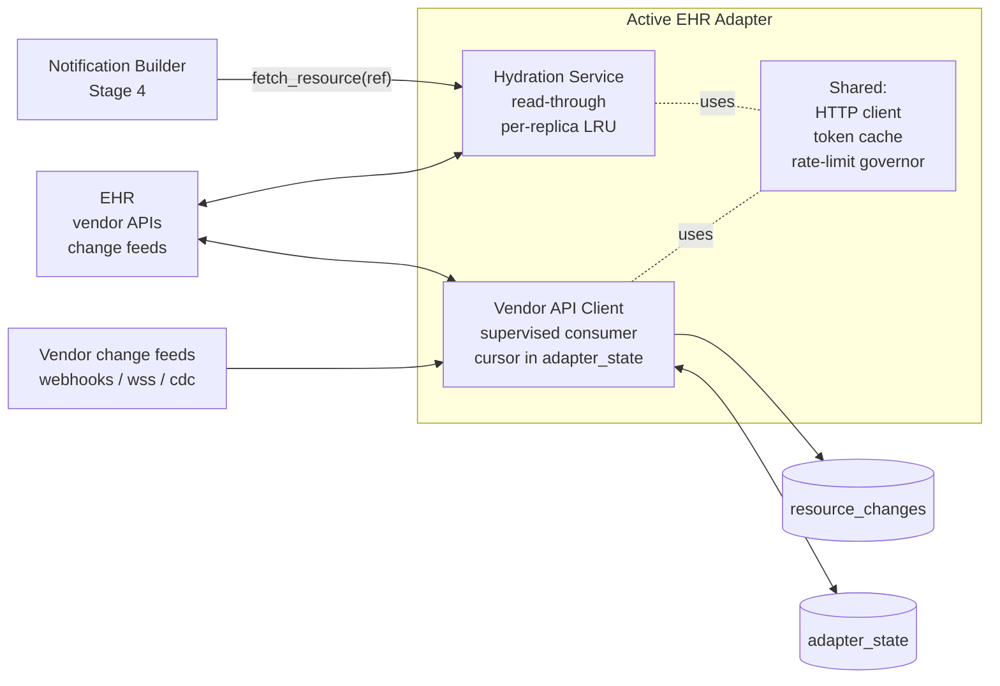

# LLD: Vendor API Client and Hydration Service

**Purpose.** This document is the low-level design for two related sub-components of the EHR Adapter: the **Vendor API Client** (Stage 1 source for vendor proprietary APIs and change feeds) and the **Hydration Service** (synchronous `fetch_resource(reference)` callback used by the Notification Builder during Stage 4). Both live behind the [Adapter SPI](../high-level-design/contracts/adapter-spi.md), both talk to the same EHR over HTTP, and both share a single HTTP client, a single auth/token cache, and a single rate-limit budget injected through `AdapterContext`. They are designed together because they compete for the same outbound budget and a hydration storm at peak scan time has to degrade predictably without breaking the change-feed consumer. The design here is the framework's responsibility — base classes, supervisor, cache, budget governor. Vendor overrides (`consume`, `translate`, `fetch`) get exactly the surface the architecture promised, no more.

**Reader's prerequisites.** Read in order: [`high-level-concept.md`](../high-level-concept.md), the EHR-side diagrams and "Adapter SPI" section of [`architecture.md`](../architecture.md), the [EHR Adapter HLD](../high-level-design/domains/ehr-adapter.md), the [Adapter SPI contract](../high-level-design/contracts/adapter-spi.md), and the [Internal Tables contract](../high-level-design/contracts/internal-tables.md) for `resource_changes` and `adapter_state`. Familiarity with the end-to-end sequence diagram in `architecture.md` (steps 25 to 28 in particular) is assumed.

## 1. Placement

The two components share an HTTP client, a token cache, and a rate-limit budget. The Vendor API Client writes `resource_changes`; the Hydration Service writes nothing. The client answers the EHR; hydration answers the Notification Builder.



The Hydration Service never writes any database row. The Vendor API Client only writes `resource_changes` (through the framework's `resource_change_sink`) and its own cursor key in `adapter_state`. Neither component reads or writes anything subscription-related.

## 2. Vendor API Client

### 2.1. Base class outline

The framework owns supervisor loop, cursor persistence, reconnect/backoff, idempotency, rate-limit accounting, lifecycle, and the `resource_changes` write. The vendor subclass owns the protocol. Class shape mirrors the SPI in [`adapter-spi.md`](../high-level-design/contracts/adapter-spi.md#vendorapiclient--stage-1-source-for-proprietary-apis-and-change-feeds):

```
abstract class VendorApiClient {
    // === Provided by framework — not overridable ===
    //   supervised loop:      run() with exponential-backoff reconnect
    //   cursor persistence:   adapter_state key cursor:<feed_name>
    //   sink wrapper:         emit() that calls translate() then writes
    //                         resource_changes via the framework sink
    //   idempotency:          dedup on (adapter_id, correlation_id)
    //   graceful shutdown:    drain in-flight events, persist cursor,
    //                         exit
    //   metrics:              events_received_total, connection_state,
    //                         lag_seconds, reconnect_total,
    //                         translate_failures_total

    // === REQUIRED overrides ===

    // Long-running consumer. The framework calls this in a supervised
    // loop. Implementor opens whatever vendor protocol this is
    // (websocket frame loop, webhook receiver registration, CDC stream
    // reader, polling loop), reads vendor records, and pushes each onto
    // the EventSink. The framework calls translate() on each event.
    abstract async fn consume(sink: EventSink, cursor: Option<Cursor>) -> ()

    // Translate one vendor-proprietary record into a ResourceChange.
    abstract fn translate(vendor_record: VendorRecord) -> ResourceChange

    // === OPTIONAL overrides ===

    // Reconnect backoff curve. Default: exponential with jitter,
    // 1s, 2s, 4s, 8s, ..., capped at 60s.
    fn reconnect_backoff(attempt: u32) -> Duration { /* default */ }

    // Health check. Default: returns ConsumerState from the supervisor.
    // Override only if the vendor protocol can be probed for liveness
    // independently of the consume() loop (e.g., a vendor health
    // endpoint).
    async fn health() -> HealthReport { /* default */ }

    // Optional pre-translate filter. Default: identity. Override to
    // drop vendor records that are not interesting (heartbeats,
    // metadata-only events) before they enter the budget governor.
    fn pre_filter(vendor_record: VendorRecord) -> Decision { /* default: keep */ }
}
```

An implementor writes two methods (`consume`, `translate`) plus optionally `pre_filter`. Everything else is shared.

### 2.2. Internal data structures

```
struct ConsumerState {
    feed_name: String                  // identity, used in metrics + cursor key
    state: enum { Connecting, Connected, Reconnecting, Draining, Stopped }
    cursor: Option<Cursor>             // last-confirmed durable cursor
    pending_cursor: Option<Cursor>     // staged but not yet committed
    last_event_at: Option<Timestamp>   // for lag metric
    consecutive_failures: u32          // drives reconnect backoff
    in_flight: AtomicU32               // events accepted by sink, not yet emitted
}

struct VendorEvent {
    cursor_marker: Cursor              // vendor-supplied position token
    correlation_id: String             // adapter-derived; defaults to vendor record id
    record: VendorRecord               // opaque, vendor-shaped
    received_at: Timestamp
}

struct EventSink {
    // The vendor's consume() pushes onto this; the framework drains it.
    push(event: VendorEvent) -> Result<(), SinkError>
}

struct Cursor {
    bytes: Bytes                       // opaque vendor token, stored verbatim in adapter_state
    epoch: u64                         // bumped on incompatible cursor format changes
}
```

The `cursor` field is opaque to the framework — Epic, Cerner, and webhook-based vendors all use different shapes. The framework persists and replays it without interpreting it.

### 2.3. Pseudo-code

Seven named functions.

```
// Top-level supervisor. The framework calls this when the adapter starts;
// it returns only when the framework signals shutdown.
async fn run_supervised(self) {
    let mut attempt = 0
    while not shutdown.is_signalled() {
        let cursor = await load_cursor(self.feed_name)
        self.state.set(Connecting)

        let sink = self.new_event_sink()
        let drainer = spawn(self.drain_sink(sink.receiver()))

        let result = self.consume(sink, cursor)   // vendor override
        await drainer.join()                       // ensure sink fully drained

        if shutdown.is_signalled() {
            await persist_cursor(self.feed_name, self.state.cursor)
            self.state.set(Stopped)
            return
        }

        self.state.set(Reconnecting)
        attempt = attempt + 1
        let delay = self.reconnect_backoff(attempt)
        metrics.inc("fhir_subs_adapter_vendor_reconnect_total", { feed: self.feed_name })
        await sleep_with_jitter(delay)
        if result.was_clean() { attempt = 0 }     // clean disconnect resets backoff
    }
}

// Drains events the vendor consume() pushed onto the sink.
async fn drain_sink(self, receiver) {
    while let event = await receiver.next() {
        self.in_flight.fetch_add(1)
        let outcome = await self.process_event(event)
        self.in_flight.fetch_sub(1)
        if outcome.is_err() {
            metrics.inc("fhir_subs_adapter_vendor_translate_failures_total", { feed: self.feed_name })
            // Translation failure does NOT halt the consumer.
            // It is logged and skipped; the source vendor record is
            // dropped or routed to the framework's dead-letter sink.
        }
    }
}

// Per-event translation + idempotent write. Cursor advances only after
// the resource_changes row commits.
async fn process_event(self, event: VendorEvent) -> Result<()> {
    if self.pre_filter(event.record) is Decision::Drop {
        return Ok(())
    }
    let change = self.translate(event.record)        // vendor override
    change.correlation_id = event.correlation_id     // ensure inheritance
    let written = await self.framework.sink.write_idempotent(change)
    // write_idempotent: INSERT INTO resource_changes ... ON CONFLICT
    // (adapter_id, correlation_id) DO NOTHING; returns whether a new
    // row was actually written.
    metrics.inc("fhir_subs_adapter_vendor_events_received_total",
                { feed: self.feed_name, dedup: not written })
    self.state.last_event_at = event.received_at
    self.stage_cursor(event.cursor_marker)
    Ok(())
}

// Cursor staging is in-memory; durable persistence is batched.
fn stage_cursor(self, marker: Cursor) {
    self.state.pending_cursor = marker
    if self.cursor_due_for_persist() {              // every 10 events or 1s
        spawn(persist_cursor(self.feed_name, marker))
    }
}

// Durable cursor write. Idempotent — re-running with the same value is
// a no-op. Atomicity with the resource_changes row is intentionally
// loose: at-most-once advancement of the cursor; at-least-once emission
// of resource_changes. Duplicate events are rejected by ON CONFLICT.
async fn persist_cursor(feed_name: String, marker: Cursor) {
    self.state_store.put(format!("cursor:{}", feed_name), marker.bytes)
    self.state.cursor = Some(marker)
}

// Loaded once per supervised attempt at the top of run_supervised().
async fn load_cursor(feed_name: String) -> Option<Cursor> {
    self.state_store.get(format!("cursor:{}", feed_name))
}

// Graceful shutdown. Triggered by the framework's lifecycle hook.
async fn shutdown(self) {
    self.state.set(Draining)
    self.consume_cancel.signal()                    // tell vendor loop to stop
    await wait_for_in_flight_zero(timeout = drain_timeout)
    await persist_cursor(self.feed_name, self.state.pending_cursor.or(self.state.cursor))
    self.state.set(Stopped)
}
```

The cursor advancement order is intentional. The framework writes `resource_changes` first; only after commit does it stage the cursor for persistence. A crash between row write and cursor write replays the same vendor event on restart, and the `(adapter_id, correlation_id)` unique constraint rejects the duplicate. No row can be lost; duplicates can be attempted, which is harmless.

### 2.4. Sequence diagram — vendor change-feed event

```
sequenceDiagram
    autonumber
    participant V as Vendor change feed
    participant C as VendorApiClient.consume()
    participant S as Sink drainer
    participant T as translate()
    participant R as resource_change_sink
    participant ST as adapter_state

    V->>C: vendor record
    C->>S: sink.push(VendorEvent)
    S->>T: translate(record)
    T-->>S: ResourceChange
    S->>R: write_idempotent(change)
    R-->>S: written or duplicate
    S->>ST: stage_cursor(marker) batched
    Note over R,ST: row commit precedes cursor persist
    Note over V,C: on disconnect reconnect_backoff with jitter
```

### 2.5. Failure handling

- **Connection drop.** Vendor `consume()` returns or raises. Supervisor moves to `Reconnecting`, increments `consecutive_failures`, sleeps for `reconnect_backoff(attempt)` with jitter, re-enters the loop. Cursor is preserved in memory and on disk, so reconnect resumes from the last persisted position.
- **Translate failure.** Logged, metric-incremented, record skipped. The consumer is not halted by a single bad record. The framework's dead-letter sink takes the raw vendor body (wired up; out of scope here).
- **Sink write failure (DB outage).** The sink retries with backoff; if it ultimately fails, the consumer applies backpressure. Vendor-protocol backpressure (websocket flow control, webhook 503, polling pause) takes over from there.
- **Auth expiry.** Handled at the HTTP layer; see Section 4.2.
- **Rate-limit exhaustion.** Handled at the HTTP layer; see Section 4.3.
- **Cursor format incompatibility.** An `epoch` mismatch on cursor load refuses to start the consumer and surfaces an operator error.

### 2.6. Metrics

| Metric | Labels | Notes |
|---|---|---|
| `fhir_subs_adapter_vendor_events_received_total` | `feed`, `dedup` | Cumulative event count; `dedup=true` for events the idempotency check rejected. |
| `fhir_subs_adapter_vendor_connection_state` | `feed` | Gauge: `connecting`, `connected`, `reconnecting`, `draining`, `stopped` mapped to integers. |
| `fhir_subs_adapter_vendor_lag_seconds` | `feed` | `now - last_event_at`. Operator-tunable alert threshold. |
| `fhir_subs_adapter_vendor_reconnect_total` | `feed` | Cumulative reconnects since process start. |
| `fhir_subs_adapter_vendor_translate_failures_total` | `feed`, `error_class` | Translation throw-rate; high values warrant operator review of vendor-specific overrides. |
| `fhir_subs_adapter_vendor_consecutive_failures` | `feed` | Gauge for current backoff depth. |

## 3. Hydration Service

### 3.1. Base class outline

The framework owns engine callback wiring, the LRU cache, the request coalescer, the rate-limit governor, and the per-call timeout. The vendor subclass owns the actual EHR fetch.

```
abstract class HydrationService {
    // === Provided by framework — not overridable ===
    //   callback registration with the engine
    //   per-replica in-memory LRU cache, short TTL
    //   request coalescing on cache key (single-flight)
    //   rate-limit budget enforcement (shared with scan + vendor api)
    //   hard timeout per fetch, configurable
    //   metrics: hydration_calls_total, hydration_cache_hits_total,
    //            hydration_coalesced_total, hydration_latency_ms,
    //            hydration_timeout_total, hydration_budget_rejections_total

    // === REQUIRED override ===

    // Fetch one resource from the EHR by reference. Implementor handles
    // vendor auth, pagination (rare but possible for resources that
    // come back as a Bundle), profile normalization, and any vendor
    // quirks (404 means "deleted" vs "never existed", etc.).
    abstract async fn fetch(reference: FhirReference, http: HttpClient) -> FhirResource

    // === OPTIONAL overrides ===

    // Cache TTL. Default: 60 seconds.
    fn cache_ttl() -> Duration { /* default: 60s */ }

    // Cache size. Default: 1000 entries.
    fn cache_size() -> u32 { /* default: 1000 */ }

    // Per-call timeout. Default: 5 seconds.
    fn fetch_timeout() -> Duration { /* default: 5s */ }

    // Cache key derivation. Default: reference.to_string(). Override
    // only if the vendor needs reference normalization (e.g.,
    // case-insensitive resource type, version stripping).
    fn cache_key(reference: FhirReference) -> String { /* default */ }
}
```

The deployment is single-tenant and single-replica, so the cache is per-process in-memory only and the cache key includes only the reference (no tenant axis, no subscriber-identity axis). The architecture's data-minimization model already constrains what gets fetched — the cache is an EHR-load reducer, not a security boundary.

### 3.2. Internal data structures

```
struct CacheEntry {
    body: FhirResource
    inserted_at: Timestamp
    ttl_until: Timestamp
}

struct CoalesceEntry {
    waiters: Vec<Waker>           // tasks awaiting completion
    in_progress_started_at: Timestamp
}

struct HydrationCache {
    lru: LinkedHashMap<String, CacheEntry>
    pending: HashMap<String, CoalesceEntry>
    capacity: u32
    ttl: Duration
}
```

Both maps are guarded by a single mutex. For the configured 1000-entry cache the mutex is uncontended in practice.

### 3.3. Pseudo-code

Six named functions.

```
// Engine callback. The Notification Builder calls this per
// referenced resource during full-resource Bundle assembly.
async fn fetch_resource(self, reference: FhirReference) -> Result<FhirResource> {
    let key = self.cache_key(reference)

    // 1. Cache hit -> immediate return.
    if let Some(body) = self.cache.get_fresh(key) {
        metrics.inc("fhir_subs_adapter_hydration_cache_hits_total")
        return Ok(body)
    }

    // 2. Coalescing -> attach to in-flight fetch and wait.
    if let Some(handle) = self.cache.attach_to_pending(key) {
        metrics.inc("fhir_subs_adapter_hydration_coalesced_total")
        return await handle.await_completion(self.fetch_timeout())
    }

    // 3. Be the leader: register pending, fetch, complete.
    let handle = self.cache.register_pending(key)
    let result = self.fetch_with_budget(reference)
    self.cache.complete_pending(key, result.clone())
    return result
}

// Wraps the vendor fetch() with budget, timeout, and metrics.
async fn fetch_with_budget(self, reference: FhirReference) -> Result<FhirResource> {
    let permit = await self.budget.try_acquire(weight = 1, deadline = self.fetch_timeout())
    if permit.is_err() {
        metrics.inc("fhir_subs_adapter_hydration_budget_rejections_total")
        return Err(BudgetExhausted)
    }

    let started = now()
    let result = with_timeout(self.fetch_timeout(), self.fetch(reference, self.http))
    metrics.observe("fhir_subs_adapter_hydration_latency_ms", now() - started)

    match result {
        Ok(body) => {
            self.cache.put(self.cache_key(reference), body.clone())
            metrics.inc("fhir_subs_adapter_hydration_calls_total", { outcome: "ok" })
            return Ok(body)
        }
        Err(Timeout) => {
            metrics.inc("fhir_subs_adapter_hydration_timeout_total")
            metrics.inc("fhir_subs_adapter_hydration_calls_total", { outcome: "timeout" })
            return Err(Timeout)
        }
        Err(NotFound) => {
            // 404 from EHR: cache a tombstone briefly so a burst of
            // identical references does not stampede.
            self.cache.put_tombstone(self.cache_key(reference), ttl = 5s)
            return Err(NotFound)
        }
        Err(other) => {
            metrics.inc("fhir_subs_adapter_hydration_calls_total", { outcome: "error" })
            return Err(other)
        }
    }
}

// LRU lookup with TTL gate.
fn cache_get_fresh(self, key: String) -> Option<FhirResource> {
    let lock = self.cache.lock()
    if let Some(entry) = lock.lru.touch(key) {
        if entry.ttl_until > now() {
            return Some(entry.body.clone())
        } else {
            lock.lru.remove(key)
            return None
        }
    }
    None
}

// Register a pending fetch atomically with cache miss.
fn register_pending(self, key: String) -> PendingHandle {
    let lock = self.cache.lock()
    lock.pending.insert(key, CoalesceEntry::new())
    PendingHandle { key, cache: self.cache }
}

// Attach to a pending fetch (the leader is already running).
fn attach_to_pending(self, key: String) -> Option<PendingHandle> {
    let lock = self.cache.lock()
    if let Some(entry) = lock.pending.get_mut(key) {
        let handle = PendingHandle::new()
        entry.waiters.push(handle.waker())
        return Some(handle)
    }
    None
}

// Complete a pending fetch: insert into LRU, wake all waiters.
fn complete_pending(self, key: String, result: Result<FhirResource>) {
    let lock = self.cache.lock()
    let entry = lock.pending.remove(key)
    if let Ok(body) = &result {
        lock.lru.put(key, CacheEntry::with_ttl(body.clone(), self.ttl))
        if lock.lru.len() > self.capacity { lock.lru.pop_oldest() }
    }
    for waker in entry.waiters { waker.wake(result.clone()) }
}
```

The single-flight pattern plus the LRU gate is what makes the architecture's promise concrete: "multiple subscriptions matching the same event don't multiply EHR calls."

### 3.4. Sequence diagram — hydration round-trip

```
sequenceDiagram
    autonumber
    participant NB as Notification Builder
    participant H as HydrationService
    participant CA as LRU + coalescer
    participant BG as Rate-limit governor
    participant V as fetch() vendor override
    participant E as EHR FHIR REST

    NB->>H: fetch_resource(Patient/123)
    H->>CA: lookup(key)
    alt cache hit fresh
        CA-->>H: body
        H-->>NB: body
    else cache miss in-flight
        CA-->>H: pending leader exists
        Note over CA,H: caller waits on pending entry
        CA-->>H: body or error from leader
        H-->>NB: result
    else cache miss leader
        H->>BG: try_acquire(weight=1)
        BG-->>H: permit or BudgetExhausted
        H->>V: fetch(ref)
        V->>E: GET Patient/123
        E-->>V: Patient resource
        V-->>H: body
        H->>CA: put(key, body, ttl)
        H-->>NB: body
    end
```

### 3.5. Failure handling

- **EHR 404.** Returned as `NotFound`. Short-lived tombstone (5s) prevents stampedes of identical missing-id references. The Notification Builder decides whether `NotFound` is fatal or recoverable (e.g., emit a reference but no body).
- **EHR 5xx.** Returned as transient error. No caching.
- **Timeout.** `fetch_timeout()` aborts the HTTP call; returned as `Timeout`.
- **Auth expiry.** Handled in the shared HTTP client (Section 4.2); transparent here.
- **Rate-limit exhaustion.** `BudgetExhausted` returned. The Notification Builder treats this as a transient delivery failure — the delivery row stays `pending` and retries when the budget recovers. This is the "hydration may starve at peak scan times" promise.
- **Cache eviction during in-flight wait.** Leader completes the fetch; waiters get the result regardless of whether the LRU evicted it under pressure. Coalescer state is independent of cache state.

### 3.6. Metrics

| Metric | Labels | Notes |
|---|---|---|
| `fhir_subs_adapter_hydration_calls_total` | `outcome` (`ok`, `timeout`, `error`, `not_found`) | All call attempts that reached the budget step. |
| `fhir_subs_adapter_hydration_cache_hits_total` | — | Calls that returned without touching the budget. |
| `fhir_subs_adapter_hydration_coalesced_total` | — | Calls that attached to a pending leader fetch. |
| `fhir_subs_adapter_hydration_latency_ms` | — | Histogram of per-call latency (cache miss path only). |
| `fhir_subs_adapter_hydration_timeout_total` | — | Hard-timeout occurrences. |
| `fhir_subs_adapter_hydration_budget_rejections_total` | — | Calls rejected by the rate-limit governor. |
| `fhir_subs_adapter_hydration_cache_size` | — | Gauge of current LRU size. |

## 4. Shared concerns

### 4.1. HTTP client wiring

The host constructs a single HTTP client and injects it into both components via `AdapterContext.http`. Pre-configured with:

- TLS with the deployment CA bundle (facility-issued certs supported via mounted bundle).
- Timeouts: connect 5s, request 30s; per-call override via `http.with_timeout(...)`.
- Connection pool: keepalive on, idle timeout 60s, max idle per host 16. Shared across both components.
- Retry policy for idempotent verbs (GET, HEAD): three retries with exponential backoff (0.2s, 0.4s, 0.8s) on connection errors and 502/503/504. Non-idempotent verbs are not retried by the client; the application layer decides.
- Headers: `User-Agent: fhir-ehr-subscriptions-service/<version> adapter/<id>`, `Accept: application/fhir+json` for FHIR callers.
- OpenTelemetry: every request is a span; trace context propagated via `traceparent`.

Vendor subclasses MUST NOT construct their own HTTP client — that bypasses the budget governor and auth cache, and is caught in adapter conformance tests.

### 4.2. Auth and token cache

The auth flow is declared by the adapter manifest. The host instantiates a token provider matching the declared kind (SMART Backend Services, OAuth client credentials, static API key, vendor SSO):

```
trait TokenProvider {
    async fn get_access_token(scope: Option<String>) -> Result<AccessToken>
    async fn invalidate(token: AccessToken) -> ()
}
```

The HTTP client wraps `TokenProvider` in middleware:

1. Attach cached access token (`Authorization: Bearer ...`) on every request.
2. On `401` (or vendor-specific equivalent — Epic has a known variant), invalidate the cached token, refresh, retry **once**. A second 401 propagates as auth failure.
3. If the cached token is within 60s of `expires_at`, refresh proactively.
4. Refresh is single-flight: concurrent requests share the in-flight refresh future.

Token cache is per-replica in-memory. Single-instance deployment means no cross-replica sharing problem.

### 4.3. Rate-limit budget governor

The architecture commits a single rate-limit budget shared between the FHIR Scan Runner, the Vendor API Client, and the Hydration Service. The framework owns one governor injected into the HTTP middleware for all three callers:

```
trait BudgetGovernor {
    async fn try_acquire(weight: u32, deadline: Duration) -> Result<Permit, BudgetExhausted>
    fn release(permit: Permit) -> ()
    fn current_state() -> BudgetState
}
```

Internally a token bucket with config parameters (Section 5): `rate` (default 10/s), `burst` (default 50), per-caller `weight` (scans 1, hydration 1, vendor-api inbound 0 — we don't budget receive traffic, only outbound calls).

`try_acquire(weight, deadline)`: if `weight` tokens available, consume and return `Permit`. Otherwise compute refill ETA — if within `deadline`, sleep and retry; otherwise return `BudgetExhausted`.

The governor does not prioritize callers. Scans, hydration, and vendor-api outbound calls compete equally. **This is the "hydration may starve at peak scan times" model** — explicitly accepted. Starvation degrades full-resource delivery latency but does not corrupt state — the delivery row stays `pending` and retries when budget recovers. If starvation is unacceptable in a given deployment, the configurable knob is the budget itself (raise `rate` and `burst` to match the EHR's published limits) — not a priority scheme. Priority is an open question (Section 8).

The governor exposes metrics:

- `fhir_subs_adapter_budget_tokens_available` — gauge.
- `fhir_subs_adapter_budget_acquire_total` (labels: `caller`, `outcome` = `ok` | `waited` | `exhausted`).
- `fhir_subs_adapter_budget_wait_ms` — histogram of wait time for `waited` outcomes.

## 5. Configuration knobs

Configuration enters via `AdapterContext.config`, validated against the manifest's JSON Schema at startup. Framework-level knobs (cache, budget, timeouts) are part of the framework's own schema with sensible defaults; operators rarely override.

```yaml
adapter:
  id: epic
  config:
    # Vendor-specific config consumed by the vendor subclass.
    fhir_base_url: https://fhir.example-hospital.org/api/FHIR/R4
    interconnect_url: https://interconnect.example-hospital.org
    auth: { kind: smart-backend-services, client_id: ..., jwks_url: ... }

    # Framework knobs. All have defaults.
    hydration:
      cache_ttl: 60s              # entry freshness window
      cache_size: 1000            # LRU capacity in entries
      fetch_timeout: 5s           # per-call hard timeout

    vendor_api:
      reconnect_backoff:
        base: 1s
        max: 60s
        jitter: 0.2               # +/- 20% jitter
      drain_timeout: 10s          # graceful shutdown drain budget
      cursor_persist_interval:
        events: 10                # batch every N events
        time: 1s                  # or every Nms, whichever first

    rate_limit:
      rate_per_second: 10
      burst: 50
      hydration_weight: 1
      scan_weight: 1
```

All values are deployment-time decisions. No runtime mutation API in v1.

## 6. Error handling matrix

Combined matrix for both components and the shared concerns. "Action" is what the framework does without operator involvement; "Operator signal" is what shows up in the user-facing dashboards.

| Condition | Component | Action | Operator signal |
|---|---|---|---|
| Vendor change-feed disconnect | VAC | `Reconnecting` state, exponential backoff with jitter, resume from last persisted cursor. | `fhir_subs_adapter_vendor_connection_state` gauge dips; `fhir_subs_adapter_vendor_reconnect_total` increments. |
| Vendor record translate throws | VAC | Skip the record, log, increment `fhir_subs_adapter_vendor_translate_failures_total`. Consumer not halted. | Failure-rate metric; persistent failures show on the per-feed alert. |
| Resource_changes write fails (DB outage) | VAC | Backpressure onto the consumer; vendor protocol's flow control engages. | DB-outage alert (cross-cutting). |
| Cursor persist fails | VAC | Logged, retried on next staging window; consumer continues using in-memory cursor. | Cursor-persist failure metric. |
| Hydration cache miss | HS | Single-flight fetch, register pending, attach concurrent callers as waiters. | `fhir_subs_adapter_hydration_coalesced_total` if any waiters attached. |
| Hydration EHR 404 | HS | Return `NotFound`; insert short-lived tombstone (5s). | `fhir_subs_adapter_hydration_calls_total{outcome=not_found}`. |
| Hydration EHR 5xx | HS | Return transient error; do not cache. | `fhir_subs_adapter_hydration_calls_total{outcome=error}`. |
| Hydration hard timeout | HS | Abort HTTP call, return `Timeout`. | `fhir_subs_adapter_hydration_timeout_total`. |
| Auth 401 | shared HTTP | Invalidate cached token, refresh via TokenProvider, retry once. Second 401 propagates. | Auth-error metric; persistent → operator alert. |
| Token refresh fails | shared HTTP | Bubble auth failure up to the calling component; VAC backs off, HS returns error. | Auth-failure alert. |
| Rate-limit budget exhausted | shared / HS / VAC outbound | `BudgetExhausted`. HS returns it to the builder (delivery stays pending and retries). VAC outbound calls back off. | `fhir_subs_adapter_budget_acquire_total{outcome=exhausted}`; spike correlates with scan windows. |
| Cursor format `epoch` mismatch | VAC | Refuse to start the consumer for that feed; surface operator-visible error. | Startup failure log + dashboard. |
| Adapter shutdown signal | both | VAC drains in-flight events, persists cursor, exits. HS rejects new calls (returns `Shutdown` to builder). | Lifecycle metric; correlates with deploy. |

## 7. Test plan

### 7.1. Unit tests

- `VendorApiClient.run_supervised` reconnect curve: assert backoff sequence with jitter bounds; reset on clean disconnect; cap at `max`.
- `process_event` idempotency: feed the same vendor event twice, assert exactly one `resource_changes` row and `dedup=true` on the second metric.
- `stage_cursor` batching: assert persist after N events or after time elapsed, whichever first.
- `shutdown` drain: in-flight events are processed before shutdown returns; cursor persisted to highest staged value.
- `HydrationCache` LRU semantics: insert, evict, touch; eviction order is least-recent-use.
- `HydrationCache.complete_pending` wakes all waiters with the same result; cache only updated on `Ok`.
- `fetch_resource` cache hit, miss-leader, miss-attach paths each return correctly.
- `BudgetGovernor.try_acquire` honors deadline; returns `BudgetExhausted` when bucket cannot refill in time; `waited` metric incremented on the slow path.

### 7.2. Integration tests

- **Mock vendor change feed + real Postgres.** Drive a thousand vendor records into the consumer; assert one-to-one `resource_changes` rows with no duplicates; cursor persisted to the last; force a mid-run process kill and assert restart resumes from last persisted cursor.
- **Mock EHR FHIR + real cache + real budget.** Issue 50 concurrent `fetch_resource` calls for 5 distinct refs; assert exactly 5 EHR calls, the rest coalesced or cache-hit.
- **Budget contention.** Run a scan workload at full budget concurrent with a hydration workload; assert hydration receives `BudgetExhausted` for some calls and recovers when the scan window ends. Assert no data corruption, just delayed deliveries.
- **Auth refresh.** Mock EHR returns 401 once, then 200. Assert the token cache invalidates, refreshes, retries, succeeds. Concurrent refresh requests share the in-flight future.

### 7.3. Conformance tests (against `adapters/default`)

- An adapter declaring `hydration_service: true` must implement `fetch` and pass the conformance suite for hydration: cache TTL respected, coalescing observable, timeout honored, 404 yields tombstone, 5xx not cached.
- An adapter declaring `vendor_api_client: true` must implement `consume` and `translate` and pass conformance for at-least-once emission, idempotent re-emission on restart, cursor durability, graceful drain.

### 7.4. Property tests

- Coalescing: for any sequence of concurrent `fetch_resource` calls on the same key during one in-flight fetch, the number of EHR calls is exactly one.
- Idempotency: for any sequence of `(adapter_id, correlation_id)` events with arbitrary duplicates, the `resource_changes` row count for that key is exactly one.

## 8. Open questions

1. **Rate-limit prioritization.** The design treats scans, hydration, and vendor-api outbound calls equally. The brief accepts hydration starvation. Real-world load may show this as too coarse; weighted-fair-queue or reserved hydration budget is a v2 candidate.
2. **Webhook ingress.** Resolved by [decisions/0008](../high-level-design/decisions/0008-resolved-design-questions.md#1): deferred to a future release. v1 ships without a webhook ingress path. Adapters whose vendors push via HTTPS webhook are not supported in v1. When the first such adapter needs it, the planned shape mirrors the MLLP-listener pattern: a host-provided vendor-neutral receive port persists to a `vendor_webhook_queue` table and ACKs; vendor-specific auth and parsing happen in the adapter via a new SPI hook.
3. **Hydration cache invalidation on update.** When the VAC emits an `update` for a cached resource, the cache is not invalidated — the entry ages out per TTL. With default 60s TTL this is acceptable. Longer TTLs make stale responses possible. A cross-component invalidation hook is a simple v2 addition.
4. **Tombstone TTL for 404.** Default 5s by design. Vendors with eventually-consistent FHIR APIs may warrant a longer tombstone — to be informed by Epic adapter integration testing.
5. **Cursor format migration.** The `epoch` field gives a refusal point but no migration tool. A vendor changing cursor format forces an operator to replay history or accept gap. A "replay from timestamp" tool is open.
6. **HTTP pool sizing.** Default `max idle per host 16` is rough; production load against Epic Interconnect may need a different value. AMBIGUITY FLAGGED — the right value is empirical.
7. **`pre_filter` metric.** Filtered records consume zero budget. Whether they should still increment a per-feed metric for visibility is deferred.

## 9. What this LLD does NOT cover

- **HL7 Message Processor.** Stage 1 source for HL7 v2. Owns `hl7_message_queue`, the cancel-and-replace state machine, and `pending_pairs`. See [`ehr-adapter.md`](../high-level-design/domains/ehr-adapter.md#hl7-message-processor) and [`internal-tables.md`](../high-level-design/contracts/internal-tables.md#pending_pairs). Separate LLD covers lex / classify / map / validate.
- **FHIR Scan Runner.** Stage 1 source for periodic scans. Shares the rate-limit budget defined here; scheduler, scan-plan resolution, and snapshot diffing are a separate LLD.
- **MLLP Listener.** Host-provided, vendor-neutral. See [`mllp-listener.md`](../high-level-design/domains/mllp-listener.md).
- **Topic Matcher (Stage 2)**, **Subscriptions Engine (Stage 3)**, **Notification Builder (Stage 4)**, **channel modules (Stage 5)**, **Subscriptions API**, **storage migrations**, **observability stack** — out of scope.
- **Adapter SPI versioning policy.** Defined in [`adapter-spi.md`](../high-level-design/contracts/adapter-spi.md#versioning-policy-for-this-spi). Changes to base-class behavior described here are governed by that policy.
- **Internal table contracts.** `resource_changes` row shape, idempotency key, retention — defined in [`internal-tables.md`](../high-level-design/contracts/internal-tables.md#resource_changes).
- **Cancel-and-replace correlation.** Owned by the HL7 Message Processor. A vendor change feed that exhibits the same pattern either delivers a consolidated event (easy case) or requires a parallel state machine in the VAC — out of scope here.
- **Dead-letter routing.** The dead-letter sink is part of the framework's storage layer; it has its own LLD.
