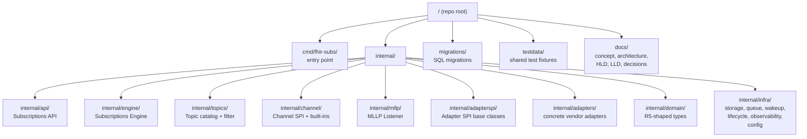

# Repository Layout

**Purpose.** Where the code lives, why it lives there, and which LLD covers each directory. The rule is simple: **one Go package equals one LLD module.** New code goes in the directory whose LLD covers the responsibility; if no directory exists, an LLD is missing.

**Reader's prerequisites.** Read [low-level-design/README.md](low-level-design/README.md) for the LLD set. Read [high-level-design/decisions/0009-language-choice.md](high-level-design/decisions/0009-language-choice.md) for the language and library shortlist.

## Tree

## Directory map

Every package below has its LLD home. Code reviewers reject PRs that put logic outside the package its LLD covers.

| Directory | Responsibility | LLD |
|---|---|---|
| `cmd/fhir-subs/` | Process entry point. Wires the components and starts the runtime. Almost no logic — just composition. | none yet (small enough not to need one) |
| `internal/api/` | Subscriptions API HTTP/WSS surface. Subscription CRUD, `$status`, `$events`, `$get-ws-binding-token`, `/metadata`. | [low-level-design/subscriptions-api.md](low-level-design/subscriptions-api.md) |
| `internal/api/auth/` | SMART Backend Services validation, JWKS cache, scope checks. | [low-level-design/subscriptions-api.md](low-level-design/subscriptions-api.md) |
| `internal/api/versionshim/` | R5 internal model ↔ R4B Backport / R5 native / R6 wire shim. | [decisions/0004-fhir-version-strategy.md](high-level-design/decisions/0004-fhir-version-strategy.md) |
| `internal/api/handlers/` | REST handlers for each route. | [low-level-design/subscriptions-api.md](low-level-design/subscriptions-api.md) |
| `internal/engine/` | Subscriptions Engine top-level (composes the four sub-packages). | [low-level-design/subscriptions-engine.md](low-level-design/subscriptions-engine.md) |
| `internal/engine/topicmatcher/` | Stage 2 — match `resource_changes` against the topic catalog. | [low-level-design/topic-matcher.md](low-level-design/topic-matcher.md) |
| `internal/engine/submatcher/` | Stage 3 — subscription fanout. | [low-level-design/subscriptions-engine.md](low-level-design/subscriptions-engine.md) |
| `internal/engine/builder/` | Stage 4 — Notification Bundle assembly. | [low-level-design/subscriptions-engine.md](low-level-design/subscriptions-engine.md) |
| `internal/engine/scheduler/` | Delivery scheduler, retries, heartbeats, handshakes. | [low-level-design/subscriptions-engine.md](low-level-design/subscriptions-engine.md) |
| `internal/topics/` | Topic catalog: load from built-in / adapter / operator sources. | [low-level-design/topics.md](low-level-design/topics.md) |
| `internal/topics/filter/` | FHIR search-parameter expression evaluator + sandboxed FHIRPath. | [low-level-design/topic-matcher.md](low-level-design/topic-matcher.md) |
| `internal/channel/` | Channel SPI — manifest, lifecycle, deliver, heartbeats. | [low-level-design/channels.md](low-level-design/channels.md) |
| `internal/channel/resthook/` | rest-hook channel. | [low-level-design/channels.md](low-level-design/channels.md) |
| `internal/channel/websocket/` | WebSocket channel. | [low-level-design/channels.md](low-level-design/channels.md) |
| `internal/channel/email/` | Email channel (v1 ships SMTP-only). | [low-level-design/channels.md](low-level-design/channels.md), [decisions/0010 #5](high-level-design/decisions/0010-implementation-defaults.md) |
| `internal/channel/message/` | FHIR messaging channel. | [low-level-design/channels.md](low-level-design/channels.md) |
| `internal/mllp/` | Host-provided vendor-neutral MLLP listener. | [low-level-design/mllp-listener.md](low-level-design/mllp-listener.md), [decisions/0003](high-level-design/decisions/0003-mllp-listener-vendor-neutral.md) |
| `internal/adapterspi/` | Adapter SPI base classes (the framework). | [low-level-design/adapter-spi-framework.md](low-level-design/adapter-spi-framework.md) |
| `internal/adapters/defaults/` | The no-vendor reference adapter. | [low-level-design/adapter-spi-framework.md](low-level-design/adapter-spi-framework.md) |
| `internal/adapters/epic/` | Epic vendor adapter — Z-segments, Interconnect, FHIR profile quirks. | (LLD pending — Epic-specific) |
| `internal/domain/` | R5-shaped internal types — `Subscription`, `SubscriptionTopic`, `SubscriptionStatus`, etc. | [high-level-design/contracts/internal-tables.md](high-level-design/contracts/internal-tables.md) |
| `internal/domain/bundle/` | `subscription-notification` Bundle assembly primitives. | [high-level-design/contracts/notification-bundle.md](high-level-design/contracts/notification-bundle.md) |
| `internal/domain/cursor/` | Per-subscription event cursors. | [low-level-design/subscriptions-engine.md](low-level-design/subscriptions-engine.md) |
| `internal/infra/storage/` | Postgres pool, repositories, queue-claim primitive, encryption-at-rest. | [low-level-design/storage.md](low-level-design/storage.md) |
| `internal/infra/storage/migrate/` | Migration runner (forward-compatible expand-then-contract). | [low-level-design/storage.md](low-level-design/storage.md) |
| `internal/infra/queue/` | The `SELECT FOR UPDATE SKIP LOCKED` claim primitive. | [low-level-design/storage.md](low-level-design/storage.md) |
| `internal/infra/wakeup/` | In-memory signal bus between stages. | [high-level-design/domains/storage.md](high-level-design/domains/storage.md) |
| `internal/infra/lifecycle/` | `/healthz`, `/readyz`, `/startup`, graceful shutdown. | [low-level-design/lifecycle.md](low-level-design/lifecycle.md) |
| `internal/infra/observability/` | Prometheus metrics, OpenTelemetry tracing, structured logs, hash-chained audit log. | [low-level-design/observability.md](low-level-design/observability.md) |
| `internal/infra/config/` | Layered config loader, secret-placeholder resolver, redaction map, SIGHUP hot-reload. | [low-level-design/configuration.md](low-level-design/configuration.md) |
| `migrations/` | Numbered SQL migrations. `0001_init.sql` is the v0 schema. | [low-level-design/storage.md](low-level-design/storage.md) |
| `testdata/` | Shared conformance fixtures: golden HL7 messages, expected `resource_changes`, golden notification Bundles, sample FHIR resources. | [low-level-design/README.md](low-level-design/README.md) §"Cross-component conventions" |

## Adding a new component

When a new component is added, the rule is:

1. Author or update the LLD first.
2. Create the package directory under `internal/`.
3. Add the directory to this document.
4. Author tests first (TDD), then implement.

PRs that add code without updating this document or its LLD are rejected.
